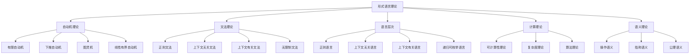

# 00-形式语言理论总论

## 目录

1. [理论概述](#1-理论概述)
2. [形式语言体系架构](#2-形式语言体系架构)
3. [核心概念体系](#3-核心概念体系)
4. [形式化表示](#4-形式化表示)
5. [跨学科整合](#5-跨学科整合)
6. [理论应用](#6-理论应用)
7. [参考文献](#7-参考文献)

## 1. 理论概述

### 1.1 形式语言理论定位

形式语言理论是形式化架构理论的核心支柱之一，为整个理论体系提供：

- **语言基础**：形式化语言的语法和语义理论
- **计算模型**：自动机和计算理论的基础
- **表达能力**：不同语言类的表达能力分析
- **算法基础**：语言处理和编译的理论基础
- **逻辑框架**：形式化逻辑的语言基础

### 1.2 理论特色

本形式语言理论体系具有以下特色：

1. **高度形式化**：使用严格的数学符号和公理化方法
2. **层次化结构**：从简单到复杂的语言层次体系
3. **计算导向**：强调语言的计算模型和算法
4. **跨学科整合**：与计算机科学、语言学、逻辑学深度融合
5. **应用导向**：注重在实际系统中的应用

### 1.3 理论目标

- 建立统一的形式语言概念体系
- 提供形式化的语言分析方法
- 支持跨学科的语言应用
- 为软件架构和系统设计提供语言基础

## 2. 形式语言体系架构

### 2.1 整体架构



### 2.2 语言层次结构

| 层次 | 语言类 | 文法类型 | 自动机 | 表达能力 |
|------|--------|----------|--------|----------|
| **0型** | 递归可枚举语言 | 无限制文法 | 图灵机 | 最强 |
| **1型** | 上下文有关语言 | 上下文有关文法 | 线性有界自动机 | 强 |
| **2型** | 上下文无关语言 | 上下文无关文法 | 下推自动机 | 中等 |
| **3型** | 正则语言 | 正则文法 | 有限自动机 | 最弱 |

## 3. 核心概念体系

### 3.1 自动机理论

#### 3.1.1 有限自动机

```rust
// 确定性有限自动机
struct DFA {
    states: Vec<State>,
    alphabet: Vec<Symbol>,
    transition_function: TransitionFunction,
    initial_state: State,
    accepting_states: Vec<State>
}

// 转移函数
struct TransitionFunction {
    transitions: HashMap<(State, Symbol), State>
}

impl DFA {
    fn new(states: Vec<State>, alphabet: Vec<Symbol>, 
           transitions: Vec<((State, Symbol), State)>,
           initial: State, accepting: Vec<State>) -> Self {
        let mut tf = TransitionFunction {
            transitions: HashMap::new()
        };
        for ((s, a), t) in transitions {
            tf.transitions.insert((s, a), t);
        }
        DFA {
            states,
            alphabet,
            transition_function: tf,
            initial_state: initial,
            accepting_states: accepting
        }
    }
    
    fn accept(&self, input: &str) -> bool {
        let mut current_state = self.initial_state;
        for symbol in input.chars() {
            if let Some(next_state) = self.transition_function
                .transitions.get(&(current_state, symbol)) {
                current_state = *next_state;
            } else {
                return false;
            }
        }
        self.accepting_states.contains(&current_state)
    }
}

// 非确定性有限自动机
struct NFA {
    states: Vec<State>,
    alphabet: Vec<Symbol>,
    transition_function: NFATransitionFunction,
    initial_state: State,
    accepting_states: Vec<State>
}

// NFA转移函数
struct NFATransitionFunction {
    transitions: HashMap<(State, Symbol), Vec<State>>
}

impl NFA {
    fn accept(&self, input: &str) -> bool {
        let mut current_states = vec![self.initial_state];
        
        for symbol in input.chars() {
            let mut next_states = Vec::new();
            for state in &current_states {
                if let Some(states) = self.transition_function
                    .transitions.get(&(*state, symbol)) {
                    next_states.extend(states);
                }
            }
            current_states = next_states;
            if current_states.is_empty() {
                return false;
            }
        }
        
        current_states.iter().any(|s| self.accepting_states.contains(s))
    }
}
```

#### 3.1.2 下推自动机

```rust
// 下推自动机
struct PDA {
    states: Vec<State>,
    input_alphabet: Vec<Symbol>,
    stack_alphabet: Vec<Symbol>,
    transition_function: PDATransitionFunction,
    initial_state: State,
    initial_stack_symbol: Symbol,
    accepting_states: Vec<State>
}

// PDA转移函数
struct PDATransitionFunction {
    transitions: HashMap<(State, Symbol, Symbol), Vec<(State, Vec<Symbol>)>>
}

// PDA配置
struct PDAConfiguration {
    state: State,
    input: Vec<Symbol>,
    stack: Vec<Symbol>
}

impl PDA {
    fn step(&self, config: &PDAConfiguration) -> Vec<PDAConfiguration> {
        let mut next_configs = Vec::new();
        let current_symbol = config.input.first();
        let stack_top = config.stack.last();
        
        if let (Some(symbol), Some(top)) = (current_symbol, stack_top) {
            if let Some(transitions) = self.transition_function
                .transitions.get(&(config.state, *symbol, *top)) {
                for (next_state, stack_push) in transitions {
                    let mut new_stack = config.stack.clone();
                    new_stack.pop(); // 弹出栈顶
                    new_stack.extend(stack_push.iter().rev()); // 压入新符号
                    
                    let mut new_input = config.input.clone();
                    new_input.remove(0); // 消耗输入符号
                    
                    next_configs.push(PDAConfiguration {
                        state: *next_state,
                        input: new_input,
                        stack: new_stack
                    });
                }
            }
        }
        
        next_configs
    }
}
```

#### 3.1.3 图灵机

```rust
// 图灵机
struct TuringMachine {
    states: Vec<State>,
    input_alphabet: Vec<Symbol>,
    tape_alphabet: Vec<Symbol>,
    transition_function: TMTransitionFunction,
    initial_state: State,
    blank_symbol: Symbol,
    accepting_states: Vec<State>
}

// 图灵机转移函数
struct TMTransitionFunction {
    transitions: HashMap<(State, Symbol), (State, Symbol, Direction)>
}

// 移动方向
enum Direction {
    Left,
    Right,
    Stay
}

// 图灵机配置
struct TMConfiguration {
    state: State,
    tape: Vec<Symbol>,
    head_position: usize
}

impl TuringMachine {
    fn step(&self, config: &TMConfiguration) -> Option<TMConfiguration> {
        let current_symbol = config.tape.get(config.head_position)?;
        
        if let Some((next_state, write_symbol, direction)) = 
            self.transition_function.transitions.get(&(config.state, *current_symbol)) {
            
            let mut new_tape = config.tape.clone();
            new_tape[config.head_position] = *write_symbol;
            
            let new_head_position = match direction {
                Direction::Left => config.head_position.saturating_sub(1),
                Direction::Right => config.head_position + 1,
                Direction::Stay => config.head_position
            };
            
            // 扩展磁带如果需要
            if new_head_position >= new_tape.len() {
                new_tape.push(self.blank_symbol);
            }
            
            Some(TMConfiguration {
                state: *next_state,
                tape: new_tape,
                head_position: new_head_position
            })
        } else {
            None
        }
    }
    
    fn accept(&self, input: &str) -> bool {
        let mut config = TMConfiguration {
            state: self.initial_state,
            tape: input.chars().map(|c| c as Symbol).collect(),
            head_position: 0
        };
        
        // 添加空白符号
        config.tape.push(self.blank_symbol);
        
        while !self.accepting_states.contains(&config.state) {
            if let Some(next_config) = self.step(&config) {
                config = next_config;
            } else {
                return false;
            }
        }
        
        true
    }
}
```

### 3.2 文法理论

#### 3.2.1 上下文无关文法

```rust
// 上下文无关文法
struct CFG {
    variables: Vec<Variable>,
    terminals: Vec<Terminal>,
    productions: Vec<Production>,
    start_symbol: Variable
}

// 产生式
struct Production {
    left_hand_side: Variable,
    right_hand_side: Vec<Symbol>
}

// 符号
enum Symbol {
    Variable(Variable),
    Terminal(Terminal)
}

impl CFG {
    fn derive(&self, steps: usize) -> Vec<String> {
        let mut current = vec![Symbol::Variable(self.start_symbol)];
        let mut derivations = vec![self.symbols_to_string(&current)];
        
        for _ in 0..steps {
            let mut new_current = Vec::new();
            let mut changed = false;
            
            for symbol in &current {
                match symbol {
                    Symbol::Variable(var) => {
                        if let Some(production) = self.productions.iter()
                            .find(|p| p.left_hand_side == *var) {
                            new_current.extend(&production.right_hand_side);
                            changed = true;
                        } else {
                            new_current.push(symbol.clone());
                        }
                    },
                    Symbol::Terminal(_) => {
                        new_current.push(symbol.clone());
                    }
                }
            }
            
            if !changed {
                break;
            }
            
            current = new_current;
            derivations.push(self.symbols_to_string(&current));
        }
        
        derivations
    }
    
    fn symbols_to_string(&self, symbols: &[Symbol]) -> String {
        symbols.iter().map(|s| match s {
            Symbol::Variable(v) => format!("{}", v),
            Symbol::Terminal(t) => format!("{}", t)
        }).collect()
    }
}
```

#### 3.2.2 正则文法

```rust
// 正则文法
struct RegularGrammar {
    variables: Vec<Variable>,
    terminals: Vec<Terminal>,
    productions: Vec<RegularProduction>,
    start_symbol: Variable
}

// 正则产生式
struct RegularProduction {
    left_hand_side: Variable,
    right_hand_side: RegularRHS
}

// 正则右部
enum RegularRHS {
    Terminal(Terminal),
    TerminalVariable(Terminal, Variable),
    Epsilon
}

impl RegularGrammar {
    fn to_dfa(&self) -> DFA {
        // 将正则文法转换为DFA
        // 实现细节...
        unimplemented!()
    }
}
```

### 3.3 语言层次理论

#### 3.3.1 乔姆斯基层次

```rust
// 乔姆斯基层次
enum ChomskyHierarchy {
    Type0, // 递归可枚举语言
    Type1, // 上下文有关语言
    Type2, // 上下文无关语言
    Type3  // 正则语言
}

// 语言类
struct LanguageClass {
    chomsky_type: ChomskyHierarchy,
    automaton: Box<dyn Automaton>,
    grammar: Box<dyn Grammar>,
    properties: LanguageProperties
}

// 语言性质
struct LanguageProperties {
    closure_under_union: bool,
    closure_under_intersection: bool,
    closure_under_complement: bool,
    closure_under_concatenation: bool,
    closure_under_kleene_star: bool,
    decidability: DecidabilityProperties
}

// 可判定性性质
struct DecidabilityProperties {
    membership: bool,      // 成员问题
    emptiness: bool,       // 空性问题
    finiteness: bool,      // 有限性问题
    equivalence: bool,     // 等价性问题
    inclusion: bool        // 包含性问题
}
```

## 4. 形式化表示

### 4.1 数学符号系统

#### 4.1.1 自动机符号

- $M = (Q, \Sigma, \delta, q_0, F)$ : 有限自动机
- $\delta: Q \times \Sigma \rightarrow Q$ : 转移函数
- $\delta^*: Q \times \Sigma^* \rightarrow Q$ : 扩展转移函数
- $L(M) = \{w \in \Sigma^* \mid \delta^*(q_0, w) \in F\}$ : 接受的语言

#### 4.1.2 文法符号

- $G = (V, T, P, S)$ : 文法
- $V$ : 变元集
- $T$ : 终结符集
- $P$ : 产生式集
- $S$ : 开始符号
- $\Rightarrow$ : 推导关系
- $\Rightarrow^*$ : 推导闭包

#### 4.1.3 语言符号

- $\Sigma$ : 字母表
- $\Sigma^*$ : 所有字符串的集合
- $\Sigma^+$ : 非空字符串的集合
- $\varepsilon$ : 空字符串
- $|w|$ : 字符串长度
- $w^R$ : 字符串反转

### 4.2 形式化公理

#### 4.2.1 自动机公理

**DFA确定性公理**：
$$\forall q \in Q, \forall a \in \Sigma: |\delta(q, a)| = 1$$

**NFA非确定性公理**：
$$\forall q \in Q, \forall a \in \Sigma: \delta(q, a) \subseteq Q$$

**PDA栈操作公理**：
$$\forall q \in Q, \forall a \in \Sigma, \forall Z \in \Gamma: \delta(q, a, Z) \subseteq Q \times \Gamma^*$$

#### 4.2.2 文法公理

**CFG产生式公理**：
$$\forall A \rightarrow \alpha \in P: A \in V \land \alpha \in (V \cup T)^*$$

**正则文法公理**：
$$\forall A \rightarrow \alpha \in P: A \in V \land (\alpha \in T \cup T \cdot V \cup \{\varepsilon\})$$

#### 4.2.3 语言公理

**语言闭包公理**：
$$L_1, L_2 \in \mathcal{L} \Rightarrow L_1 \cup L_2 \in \mathcal{L}$$

**语言层次公理**：
$$\text{REG} \subset \text{CFL} \subset \text{CSL} \subset \text{REL}$$

## 5. 跨学科整合

### 5.1 与计算机科学的整合

#### 5.1.1 编译理论

形式语言理论与编译理论的整合：

1. **词法分析**：使用正则语言和有限自动机
2. **语法分析**：使用上下文无关文法和下推自动机
3. **语义分析**：使用形式语义学
4. **代码生成**：使用图灵机模型

#### 5.1.2 程序语言理论

与程序语言理论的整合：

1. **语法定义**：使用BNF和EBNF
2. **类型系统**：使用形式类型理论
3. **语义定义**：使用操作语义、指称语义、公理语义
4. **程序验证**：使用形式化方法

### 5.2 与语言学的整合

#### 5.2.1 自然语言处理

与自然语言处理的整合：

1. **句法分析**：使用上下文无关文法
2. **语义分析**：使用形式语义学
3. **机器翻译**：使用自动机理论
4. **语音识别**：使用有限状态机

#### 5.2.2 计算语言学

与计算语言学的整合：

1. **语料库语言学**：使用统计语言模型
2. **信息抽取**：使用正则表达式
3. **文本挖掘**：使用形式语言理论
4. **对话系统**：使用状态机模型

### 5.3 与逻辑学的整合

#### 5.3.1 形式逻辑

与形式逻辑的整合：

1. **命题逻辑**：使用布尔代数
2. **谓词逻辑**：使用形式语言
3. **模态逻辑**：使用可能世界语义
4. **时态逻辑**：使用线性时间逻辑

#### 5.3.2 证明理论

与证明理论的整合：

1. **自然演绎**：使用形式推理系统
2. **序列演算**：使用形式证明系统
3. **类型论**：使用Curry-Howard对应
4. **模型论**：使用形式语义学

## 6. 理论应用

### 6.1 软件工程应用

#### 6.1.1 编译器设计

形式语言理论在编译器设计中的应用：

1. **词法分析器**：使用正则表达式和有限自动机
2. **语法分析器**：使用上下文无关文法和下推自动机
3. **语义分析器**：使用类型系统和语义规则
4. **代码生成器**：使用图灵机模型

#### 6.1.2 程序验证

在程序验证中的应用：

1. **模型检查**：使用自动机理论
2. **定理证明**：使用形式逻辑
3. **静态分析**：使用抽象解释
4. **类型检查**：使用类型理论

### 6.2 人工智能应用

#### 6.2.1 自然语言处理

形式语言理论在自然语言处理中的应用：

1. **句法分析**：使用上下文无关文法
2. **语义分析**：使用形式语义学
3. **机器翻译**：使用自动机理论
4. **语音识别**：使用隐马尔可夫模型

#### 6.2.2 知识表示

在知识表示中的应用：

1. **本体语言**：使用描述逻辑
2. **规则系统**：使用产生式规则
3. **查询语言**：使用形式语言
4. **推理引擎**：使用自动机理论

### 6.3 系统科学应用

#### 6.3.1 控制系统

形式语言理论在控制系统中的应用：

1. **状态机**：使用有限自动机
2. **事件系统**：使用形式语言
3. **时序逻辑**：使用线性时间逻辑
4. **模型检查**：使用自动机理论

#### 6.3.2 通信系统

在通信系统中的应用：

1. **协议设计**：使用形式语言
2. **错误检测**：使用有限自动机
3. **编码理论**：使用形式语言理论
4. **网络安全**：使用形式化方法

## 7. 参考文献

### 7.1 经典文献

1. Hopcroft, J.E., Ullman, J.D. *Introduction to Automata Theory, Languages, and Computation*.
2. Sipser, M. *Introduction to the Theory of Computation*.
3. Chomsky, N. *Syntactic Structures*.
4. Kleene, S.C. *Introduction to Metamathematics*.

### 7.2 现代文献

1. Kozen, D. *Automata and Computability*.
2. Lewis, H.R., Papadimitriou, C.H. *Elements of the Theory of Computation*.
3. Sudkamp, T.A. *Languages and Machines*.
4. Linz, P. *An Introduction to Formal Languages and Automata*.

### 7.3 应用文献

1. Aho, A.V., Lam, M.S., Sethi, R., Ullman, J.D. *Compilers: Principles, Techniques, and Tools*.
2. Jurafsky, D., Martin, J.H. *Speech and Language Processing*.
3. Blackburn, P., de Rijke, M., Venema, Y. *Modal Logic*.
4. Baier, C., Katoen, J.P. *Principles of Model Checking*.

---

**文件**: `00-形式语言理论总论.md`  
**版本**: v60  
**创建时间**: 2024年  
**最后更新**: 2024年当前时间  
**相关文件**: 
- [01-自动机理论](01-自动机理论.md)
- [02-文法理论](02-文法理论.md)
- [03-语言层次理论](03-语言层次理论.md)
- [04-计算理论](04-计算理论.md)
- [05-语义理论](05-语义理论.md)
