# 00-形式语言理论总论：形式化语言理论体系

## 目录

1. [1.0 形式语言理论概述](#10-形式语言理论概述)
2. [2.0 形式语言基础公理系统](#20-形式语言基础公理系统)
3. [3.0 自动机理论](#30-自动机理论)
4. [4.0 形式语法理论](#40-形式语法理论)
5. [5.0 语义理论](#50-语义理论)
6. [6.0 编译理论](#60-编译理论)
7. [7.0 语言哲学](#70-语言哲学)
8. [8.0 计算语言学](#80-计算语言学)
9. [9.0 形式语言统一框架](#90-形式语言统一框架)
10. [10.0 形式语言应用与实践](#100-形式语言应用与实践)

## 1.0 形式语言理论概述

### 1.1 形式语言理论定义

**定义 1.1.1 (形式语言理论)**
形式语言理论是一个七元组 $\mathcal{FLT} = (\mathcal{A}, \mathcal{G}, \mathcal{S}, \mathcal{C}, \mathcal{L}, \mathcal{P}, \mathcal{U})$，其中：

- $\mathcal{A}$ 是自动机理论集合 (Automata Theory)
- $\mathcal{G}$ 是形式语法理论集合 (Formal Grammar Theory)
- $\mathcal{S}$ 是语义理论集合 (Semantics Theory)
- $\mathcal{C}$ 是编译理论集合 (Compilation Theory)
- $\mathcal{L}$ 是语言哲学集合 (Language Philosophy)
- $\mathcal{P}$ 是计算语言学集合 (Computational Linguistics)
- $\mathcal{U}$ 是理论统一框架集合 (Unification Framework)

**公理 1.1.1 (形式语言理论一致性)**
形式语言理论 $\mathcal{FLT}$ 满足：
$$\forall t_1, t_2 \in \mathcal{A} \cup \mathcal{G} \cup \mathcal{S} \cup \mathcal{C} \cup \mathcal{L} \cup \mathcal{P} \cup \mathcal{U}, \quad \text{Consistent}(t_1, t_2)$$

**公理 1.1.2 (形式语言理论完备性)**
对于任意形式语言问题 $p$，存在理论 $t \in \mathcal{FLT}$ 能够形式化描述和解决 $p$。

### 1.2 形式语言理论架构

```mermaid
graph TB
    A[形式语言理论] --> B[自动机理论]
    A --> C[形式语法理论]
    A --> D[语义理论]
    A --> E[编译理论]
    A --> F[语言哲学]
    A --> G[计算语言学]
    A --> H[理论统一框架]
    
    B --> B1[有限自动机]
    B --> B2[下推自动机]
    B --> B3[图灵机]
    B --> B4[线性有界自动机]
    B --> B5[概率自动机]
    
    C --> C1[正则语法]
    C --> C2[上下文无关语法]
    C --> C3[上下文相关语法]
    C --> C4[无限制语法]
    C --> C5[属性语法]
    
    D --> D1[操作语义]
    D --> D2[指称语义]
    D --> D3[公理语义]
    D --> D4[代数语义]
    D --> D5[博弈语义]
    
    E --> E1[词法分析]
    E --> E2[语法分析]
    E --> E3[语义分析]
    E --> E4[代码生成]
    E --> E5[优化]
    
    F --> F1[语言本质]
    F --> F2[意义理论]
    F --> F3[指称理论]
    F --> F4[使用理论]
    F --> F5[形式化哲学]
    
    G --> G1[自然语言处理]
    G --> G2[机器翻译]
    G --> G3[信息抽取]
    G --> G4[对话系统]
    G --> G5[语言建模]
    
    H --> H1[理论映射关系]
    H --> H2[统一符号体系]
    H --> H3[跨领域证明]
    H --> H4[应用框架]
```



### 1.3 形式语言理论层次结构

**定义 1.3.1 (形式语言理论层次)**
形式语言理论层次是一个五层结构 $\mathcal{H}_{FL} = (L_1, L_2, L_3, L_4, L_5)$，其中：

- $L_1$ 是基础语言层 (Basic Language Layer)
- $L_2$ 是语法结构层 (Syntactic Structure Layer)
- $L_3$ 是语义解释层 (Semantic Interpretation Layer)
- $L_4$ 是应用处理层 (Application Processing Layer)
- $L_5$ 是统一语言层 (Unified Language Layer)

**定理 1.3.1 (形式语言层次依赖关系)**
对于任意形式语言理论 $f_i \in L_i, f_j \in L_j$，如果 $i < j$，则 $f_i$ 为 $f_j$ 提供基础，记为 $f_i \prec f_j$。

## 2.0 形式语言基础公理系统

### 2.1 字母表公理

**公理 2.1.1 (字母表存在性)**
存在非空有限集合 $\Sigma$，称为字母表。

**公理 2.1.2 (字符串构造)**
对于字母表 $\Sigma$，存在字符串集合 $\Sigma^*$，满足：
1. $\epsilon \in \Sigma^*$ (空字符串)
2. 如果 $a \in \Sigma$ 且 $w \in \Sigma^*$，则 $aw \in \Sigma^*$

**公理 2.1.3 (字符串连接)**
字符串连接运算 $\cdot: \Sigma^* \times \Sigma^* \to \Sigma^*$ 满足：
1. 结合律：$(u \cdot v) \cdot w = u \cdot (v \cdot w)$
2. 单位元：$\epsilon \cdot w = w \cdot \epsilon = w$

### 2.2 语言公理

**公理 2.2.1 (语言定义)**
语言是字母表 $\Sigma$ 上字符串集合的子集：$L \subseteq \Sigma^*$

**公理 2.2.2 (语言运算)**
对于语言 $L_1, L_2 \subseteq \Sigma^*$：
- 并集：$L_1 \cup L_2 = \{w \mid w \in L_1 \lor w \in L_2\}$
- 连接：$L_1 \cdot L_2 = \{uv \mid u \in L_1 \land v \in L_2\}$
- 克林闭包：$L^* = \bigcup_{n=0}^{\infty} L^n$

**公理 2.2.3 (语言层次)**
语言类形成层次结构：
$$\text{Regular} \subset \text{CFL} \subset \text{CSL} \subset \text{Recursive} \subset \text{RE}$$

### 2.3 语法公理

**公理 2.3.1 (语法定义)**
语法是一个四元组 $G = (V, \Sigma, P, S)$，其中：
- $V$ 是非终结符集合
- $\Sigma$ 是终结符集合
- $P$ 是产生式集合
- $S$ 是开始符号

**公理 2.3.2 (推导关系)**
推导关系 $\Rightarrow$ 满足：
- 如果 $A \to \alpha \in P$，则 $\beta A \gamma \Rightarrow \beta \alpha \gamma$
- 传递闭包：$\Rightarrow^*$ 是 $\Rightarrow$ 的自反传递闭包

**公理 2.3.3 (语言生成)**
语法 $G$ 生成的语言是：
$$L(G) = \{w \in \Sigma^* \mid S \Rightarrow^* w\}$$

## 3.0 自动机理论

### 3.1 有限自动机

**定义 3.1.1 (有限自动机)**
有限自动机是一个五元组 $M = (Q, \Sigma, \delta, q_0, F)$，其中：

- $Q$ 是有限状态集合
- $\Sigma$ 是输入字母表
- $\delta: Q \times \Sigma \to Q$ 是转移函数
- $q_0 \in Q$ 是初始状态
- $F \subseteq Q$ 是接受状态集合

**定义 3.1.2 (自动机接受)**
自动机 $M$ 接受字符串 $w = a_1a_2\cdots a_n$，如果存在状态序列 $q_0, q_1, \ldots, q_n$ 使得：
1. $q_0$ 是初始状态
2. $\delta(q_i, a_{i+1}) = q_{i+1}$ 对所有 $i < n$
3. $q_n \in F$

**定理 3.1.1 (有限自动机与正则语言)**
语言 $L$ 是正则的当且仅当存在有限自动机 $M$ 使得 $L = L(M)$。

### 3.2 下推自动机

**定义 3.2.1 (下推自动机)**
下推自动机是一个七元组 $P = (Q, \Sigma, \Gamma, \delta, q_0, Z_0, F)$，其中：

- $Q$ 是有限状态集合
- $\Sigma$ 是输入字母表
- $\Gamma$ 是栈字母表
- $\delta: Q \times \Sigma \times \Gamma \to \mathcal{P}(Q \times \Gamma^*)$ 是转移函数
- $q_0 \in Q$ 是初始状态
- $Z_0 \in \Gamma$ 是初始栈符号
- $F \subseteq Q$ 是接受状态集合

**定义 3.2.2 (瞬时描述)**
瞬时描述是三元组 $(q, w, \alpha)$，其中：
- $q$ 是当前状态
- $w$ 是剩余输入
- $\alpha$ 是栈内容

**定理 3.2.1 (下推自动机与上下文无关语言)**
语言 $L$ 是上下文无关的当且仅当存在下推自动机 $P$ 使得 $L = L(P)$。

### 3.3 图灵机

**定义 3.3.1 (图灵机)**
图灵机是一个七元组 $T = (Q, \Sigma, \Gamma, \delta, q_0, B, F)$，其中：

- $Q$ 是有限状态集合
- $\Sigma$ 是输入字母表
- $\Gamma$ 是磁带字母表
- $\delta: Q \times \Gamma \to Q \times \Gamma \times \{L, R\}$ 是转移函数
- $q_0 \in Q$ 是初始状态
- $B \in \Gamma$ 是空白符号
- $F \subseteq Q$ 是接受状态集合

**定义 3.3.2 (图灵机计算)**
图灵机 $T$ 在输入 $w$ 上的计算是配置序列，其中每个配置包含状态、磁带内容和读写头位置。

**定理 3.3.1 (丘奇-图灵论题)**
任何可计算的函数都可以由图灵机计算。

## 4.0 形式语法理论

### 4.1 乔姆斯基层次

**定义 4.1.1 (乔姆斯基层次)**
乔姆斯基层次是语法类的层次结构：

1. **类型0 (无限制语法)**：$\alpha \to \beta$，其中 $\alpha, \beta \in (V \cup \Sigma)^*$
2. **类型1 (上下文相关语法)**：$\alpha A \beta \to \alpha \gamma \beta$，其中 $A \in V, \alpha, \beta, \gamma \in (V \cup \Sigma)^*$
3. **类型2 (上下文无关语法)**：$A \to \alpha$，其中 $A \in V, \alpha \in (V \cup \Sigma)^*$
4. **类型3 (正则语法)**：$A \to aB$ 或 $A \to a$，其中 $A, B \in V, a \in \Sigma$

**定理 4.1.1 (乔姆斯基层次包含关系)**
$$\text{Type 3} \subset \text{Type 2} \subset \text{Type 1} \subset \text{Type 0}$$

### 4.2 上下文无关语法

**定义 4.2.1 (上下文无关语法)**
上下文无关语法是四元组 $G = (V, \Sigma, P, S)$，其中所有产生式都是 $A \to \alpha$ 形式。

**定义 4.2.2 (语法树)**
语法树是表示推导过程的树结构，其中：
- 根节点是开始符号
- 内部节点是非终结符
- 叶节点是终结符

**定义 4.2.3 (歧义性)**
语法 $G$ 是歧义的，如果存在字符串 $w$ 有多个不同的语法树。

**定理 4.2.1 (歧义性不可判定)**
对于任意上下文无关语法 $G$，判断 $G$ 是否歧义是不可判定的。

### 4.3 属性语法

**定义 4.3.1 (属性语法)**
属性语法是上下文无关语法加上属性计算规则：
$$G = (V, \Sigma, P, S, A, R)$$

其中：
- $A$ 是属性集合
- $R$ 是属性计算规则集合

**定义 4.3.2 (综合属性)**
综合属性从子节点向父节点传播。

**定义 4.3.3 (继承属性)**
继承属性从父节点向子节点传播。

## 5.0 语义理论

### 5.1 操作语义

**定义 5.1.1 (操作语义)**
操作语义通过抽象机器的状态转换定义语言语义。

**定义 5.1.2 (配置)**
配置是程序执行状态的表示：$\langle e, \sigma \rangle$，其中：
- $e$ 是表达式
- $\sigma$ 是环境

**定义 5.1.3 (求值关系)**
求值关系 $\Downarrow$ 定义表达式的求值：
$$\langle e, \sigma \rangle \Downarrow v$$

**规则 5.1.1 (常量求值)**
$$\langle c, \sigma \rangle \Downarrow c$$

**规则 5.1.2 (变量求值)**
$$\frac{\sigma(x) = v}{\langle x, \sigma \rangle \Downarrow v}$$

**规则 5.1.3 (函数应用)**
$$\frac{\langle e_1, \sigma \rangle \Downarrow \lambda x.e \quad \langle e_2, \sigma \rangle \Downarrow v_2 \quad \langle e, \sigma[x \mapsto v_2] \rangle \Downarrow v}{\langle e_1 e_2, \sigma \rangle \Downarrow v}$$

### 5.2 指称语义

**定义 5.2.1 (指称语义)**
指称语义通过数学对象（域）定义语言语义。

**定义 5.2.2 (语义域)**
语义域是语言构造的数学解释：
- 数值：$\mathbb{Z}, \mathbb{R}$
- 布尔值：$\mathbb{B} = \{\text{true}, \text{false}\}$
- 函数：$D \to D$

**定义 5.2.3 (语义函数)**
语义函数 $\llbracket \cdot \rrbracket$ 将语法构造映射到语义域：
$$\llbracket e \rrbracket: \text{Env} \to D$$

**规则 5.2.1 (常量语义)**
$$\llbracket c \rrbracket \rho = c$$

**规则 5.2.2 (变量语义)**
$$\llbracket x \rrbracket \rho = \rho(x)$$

**规则 5.2.3 (函数语义)**
$$\llbracket \lambda x.e \rrbracket \rho = \lambda v.\llbracket e \rrbracket \rho[x \mapsto v]$$

### 5.3 公理语义

**定义 5.3.1 (霍尔逻辑)**
霍尔逻辑是程序正确性的形式化系统。

**定义 5.3.2 (霍尔三元组)**
霍尔三元组 $\{P\} C \{Q\}$ 表示：
- 如果前置条件 $P$ 在执行前成立
- 且程序 $C$ 终止
- 则后置条件 $Q$ 在执行后成立

**规则 5.3.1 (赋值规则)**
$$\{P[E/x]\} x := E \{P\}$$

**规则 5.3.2 (序列规则)**
$$\frac{\{P\} C_1 \{R\} \quad \{R\} C_2 \{Q\}}{\{P\} C_1; C_2 \{Q\}}$$

**规则 5.3.3 (条件规则)**
$$\frac{\{P \land B\} C_1 \{Q\} \quad \{P \land \neg B\} C_2 \{Q\}}{\{P\} \text{if } B \text{ then } C_1 \text{ else } C_2 \{Q\}}$$

## 6.0 编译理论

### 6.1 词法分析

**定义 6.1.1 (词法分析器)**
词法分析器将输入字符串转换为词法单元序列。

**定义 6.1.2 (词法单元)**
词法单元是 $\langle \text{type}, \text{value} \rangle$ 对，其中：
- type 是词法单元类型
- value 是词法单元值

**算法 6.1.1 (词法分析算法)**
```rust
fn lexical_analysis(input: &str) -> Vec<Token> {
    let mut tokens = Vec::new();
    let mut current = 0;
    
    while current < input.len() {
        // 跳过空白字符
        while current < input.len() && input[current..].starts_with(char::is_whitespace) {
            current += 1;
        }
        
        if current >= input.len() {
            break;
        }
        
        // 识别词法单元
        if let Some(token) = recognize_token(&input[current..]) {
            tokens.push(token);
            current += token.length;
        } else {
            // 错误处理
            return Err(LexicalError);
        }
    }
    
    tokens
}
```

### 6.2 语法分析

**定义 6.2.1 (语法分析器)**
语法分析器根据语法规则构建语法树。

**定义 6.2.2 (递归下降分析)**
递归下降分析为每个非终结符编写一个函数。

**算法 6.2.1 (递归下降分析)**
```rust
struct Parser {
    tokens: Vec<Token>,
    current: usize,
}

impl Parser {
    fn parse_expression(&mut self) -> Result<Expression, ParseError> {
        let left = self.parse_term()?;
        
        while self.current < self.tokens.len() {
            match self.tokens[self.current].type {
                TokenType::Plus => {
                    self.advance();
                    let right = self.parse_term()?;
                    left = Expression::Binary(left, Operator::Plus, right);
                }
                TokenType::Minus => {
                    self.advance();
                    let right = self.parse_term()?;
                    left = Expression::Binary(left, Operator::Minus, right);
                }
                _ => break,
            }
        }
        
        Ok(left)
    }
}
```

### 6.3 语义分析

**定义 6.3.1 (语义分析)**
语义分析检查程序的语义正确性。

**定义 6.3.2 (类型检查)**
类型检查确保表达式和语句的类型正确。

**算法 6.3.1 (类型检查算法)**
```rust
fn type_check(expr: &Expression, env: &TypeEnvironment) -> Result<Type, TypeError> {
    match expr {
        Expression::Literal(value) => Ok(value.get_type()),
        Expression::Variable(name) => {
            env.get(name).ok_or(TypeError::UndefinedVariable(name.clone()))
        }
        Expression::Binary(left, op, right) => {
            let left_type = type_check(left, env)?;
            let right_type = type_check(right, env)?;
            
            match op {
                Operator::Plus => {
                    if left_type == Type::Int && right_type == Type::Int {
                        Ok(Type::Int)
                    } else {
                        Err(TypeError::TypeMismatch)
                    }
                }
                // 其他操作符...
            }
        }
    }
}
```

## 7.0 语言哲学

### 7.1 语言本质

**定义 7.1.1 (语言)**
语言是用于交流的符号系统。

**定义 7.1.2 (形式语言)**
形式语言是精确定义的符号系统，具有明确的语法和语义。

**定义 7.1.3 (自然语言)**
自然语言是人类自然发展的语言系统。

**定理 7.1.1 (语言层次)**
形式语言是自然语言的抽象和形式化。

### 7.2 意义理论

**定义 7.2.1 (指称理论)**
指称理论认为语言表达式的意义是其指称的对象。

**定义 7.2.2 (使用理论)**
使用理论认为语言表达式的意义在于其使用方式。

**定义 7.2.3 (真值条件语义)**
真值条件语义通过真值条件定义句子意义。

**定理 7.2.1 (意义组合性)**
复合表达式的意义由其组成部分的意义和组合方式决定。

### 7.3 形式化哲学

**定义 7.3.1 (形式化)**
形式化是将概念转化为精确的数学表达。

**定义 7.3.2 (形式系统)**
形式系统是符号、规则和推理的系统。

**定义 7.3.3 (形式化哲学)**
形式化哲学研究哲学概念的形式化表达。

**定理 7.3.1 (形式化完备性)**
任何哲学概念都可以形式化表达。

## 8.0 计算语言学

### 8.1 自然语言处理

**定义 8.1.1 (自然语言处理)**
自然语言处理是计算机处理自然语言的技术。

**定义 8.1.2 (语言模型)**
语言模型是自然语言的概率模型。

**定义 8.1.3 (统计语言模型)**
统计语言模型基于统计方法建模语言。

**算法 8.1.1 (n-gram语言模型)**
```rust
struct NGramModel {
    n: usize,
    counts: HashMap<Vec<String>, HashMap<String, f64>>,
}

impl NGramModel {
    fn probability(&self, context: &[String], word: &str) -> f64 {
        let context_key = context.to_vec();
        if let Some(word_counts) = self.counts.get(&context_key) {
            if let Some(&count) = word_counts.get(word) {
                let total: f64 = word_counts.values().sum();
                return count / total;
            }
        }
        0.0
    }
}
```

### 8.2 机器翻译

**定义 8.2.1 (机器翻译)**
机器翻译是自动将一种语言翻译为另一种语言。

**定义 8.2.2 (统计机器翻译)**
统计机器翻译基于统计模型进行翻译。

**定义 8.2.3 (神经机器翻译)**
神经机器翻译基于神经网络进行翻译。

**算法 8.2.1 (序列到序列翻译)**
```rust
struct Seq2SeqTranslator {
    encoder: RNN,
    decoder: RNN,
    vocabulary: Vocabulary,
}

impl Seq2SeqTranslator {
    fn translate(&self, source: &[String]) -> Vec<String> {
        // 编码
        let encoded = self.encoder.encode(source);
        
        // 解码
        let mut target = Vec::new();
        let mut hidden = encoded;
        
        while target.len() < MAX_LENGTH {
            let output = self.decoder.decode(&hidden);
            let word = self.vocabulary.decode(output);
            
            if word == "<EOS>" {
                break;
            }
            
            target.push(word);
            hidden = output;
        }
        
        target
    }
}
```

### 8.3 信息抽取

**定义 8.3.1 (信息抽取)**
信息抽取是从文本中提取结构化信息。

**定义 8.3.2 (命名实体识别)**
命名实体识别识别文本中的命名实体。

**定义 8.3.3 (关系抽取)**
关系抽取识别实体间的关系。

**算法 8.3.1 (命名实体识别)**
```rust
struct NamedEntityRecognizer {
    model: BiLSTM,
    labels: Vec<String>,
}

impl NamedEntityRecognizer {
    fn recognize(&self, tokens: &[String]) -> Vec<String> {
        let embeddings = self.embed_tokens(tokens);
        let hidden = self.model.forward(&embeddings);
        let predictions = self.linear_layer(&hidden);
        
        predictions.iter()
            .map(|p| self.labels[p.argmax()].clone())
            .collect()
    }
}
```

## 9.0 形式语言统一框架

### 9.1 理论映射关系

**定义 9.1.1 (理论映射)**
理论映射是不同形式语言理论间的对应关系。

**定义 9.1.2 (理论等价性)**
两个理论等价当且仅当它们生成相同的语言类。

**定理 9.1.1 (乔姆斯基-舒岑伯格定理)**
上下文无关语言类在并、连接、克林闭包下封闭。

### 9.2 统一符号体系

**定义 9.2.1 (统一符号)**
统一符号体系是形式语言理论的通用符号。

**定义 9.2.2 (符号一致性)**
符号在不同理论中保持一致的语义。

**定理 9.2.1 (符号完备性)**
统一符号体系能够表达所有形式语言概念。

### 9.3 跨领域证明

**定义 9.3.1 (跨领域证明)**
跨领域证明在不同理论间建立联系。

**定理 9.3.1 (自动机等价性)**
不同自动机模型在计算能力上等价。

## 10.0 形式语言应用与实践

### 10.1 编程语言设计

**定义 10.1.1 (编程语言)**
编程语言是用于编写计算机程序的形式语言。

**定义 10.1.2 (语言设计原则)**
语言设计原则指导编程语言的设计。

**算法 10.1.1 (语法分析器生成)**
```rust
struct ParserGenerator {
    grammar: Grammar,
}

impl ParserGenerator {
    fn generate_parser(&self) -> Parser {
        let first_sets = self.compute_first_sets();
        let follow_sets = self.compute_follow_sets();
        let parsing_table = self.build_parsing_table(&first_sets, &follow_sets);
        
        Parser::new(parsing_table)
    }
}
```

### 10.2 编译器设计

**定义 10.2.1 (编译器)**
编译器将高级语言程序转换为机器代码。

**定义 10.2.2 (编译阶段)**
编译过程包括词法分析、语法分析、语义分析、代码生成等阶段。

**算法 10.2.1 (代码生成)**
```rust
struct CodeGenerator {
    target_architecture: Architecture,
}

impl CodeGenerator {
    fn generate_code(&self, ast: &AST) -> Vec<Instruction> {
        match ast {
            AST::BinaryOp(left, op, right) => {
                let left_code = self.generate_code(left);
                let right_code = self.generate_code(right);
                
                let mut code = left_code;
                code.extend(right_code);
                code.push(self.generate_instruction(op));
                code
            }
            // 其他节点类型...
        }
    }
}
```

### 10.3 形式化验证

**定义 10.3.1 (形式化验证)**
形式化验证使用数学方法验证系统正确性。

**定义 10.3.2 (模型检查)**
模型检查自动验证有限状态系统的性质。

**算法 10.3.1 (模型检查算法)**
```rust
struct ModelChecker {
    model: KripkeStructure,
    formula: CTLFormula,
}

impl ModelChecker {
    fn check(&self) -> bool {
        let states = self.model.get_states();
        let mut labeled_states = HashMap::new();
        
        // 标记满足原子命题的状态
        for state in &states {
            labeled_states.insert(state.clone(), self.label_atomic_props(state));
        }
        
        // 递归标记满足复合公式的状态
        self.label_formula(&self.formula, &mut labeled_states)
    }
}
```

### 10.4 自然语言处理

**定义 10.4.1 (自然语言处理)**
自然语言处理是计算机处理自然语言的技术。

**定义 10.4.2 (语言理解)**
语言理解是计算机理解自然语言的能力。

**算法 10.4.1 (依存句法分析)**
```rust
struct DependencyParser {
    model: NeuralNetwork,
}

impl DependencyParser {
    fn parse(&self, sentence: &[String]) -> DependencyTree {
        let embeddings = self.embed_tokens(sentence);
        let scores = self.model.forward(&embeddings);
        
        // 使用动态规划找到最优依存树
        self.find_optimal_tree(&scores)
    }
}
```

---

**参考文献**

1. 形式语言的多维批判性分析：从基础理论到应用实践.md
2. 形式语言的多维技术生态批判性分析.md
3. 形式语言的综合批判分析.md
4. 自动机理论.md
5. 形式语言的理论模型与层次结构.md

**相关链接**

- [01-自动机理论](01-自动机理论.md)
- [02-形式语法理论](02-形式语法理论.md)
- [03-语义理论](03-语义理论.md)
- [04-编译理论](04-编译理论.md)
- [05-语言哲学](05-语言哲学.md)
- [06-计算语言学](06-计算语言学.md) 