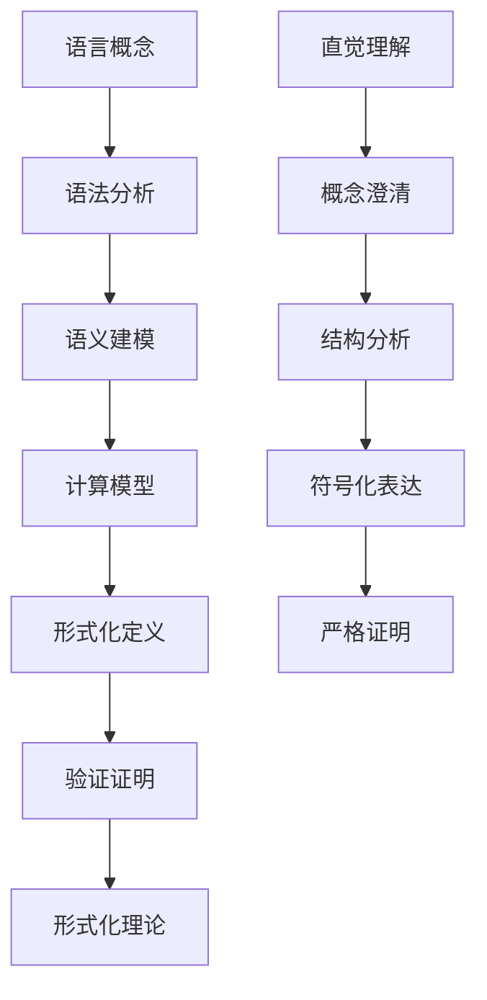

# 形式语言理论形式化框架

## 目录

1. [概述](#概述)
2. [形式语言基础](#形式语言基础)
3. [自动机理论](#自动机理论)
4. [文法理论](#文法理论)
5. [计算复杂性](#计算复杂性)
6. [语言层次结构](#语言层次结构)
7. [形式语义学](#形式语义学)
8. [语言等价性](#语言等价性)
9. [形式验证](#形式验证)
10. [应用理论](#应用理论)
11. [形式语言统一框架](#形式语言统一框架)
12. [与其他理论的映射](#与其他理论的映射)

## 1. 概述

### 1.1 形式化目标

本框架旨在建立形式语言理论的严格形式化体系，将语言理论、自动机理论、计算理论等核心概念进行精确的形式化定义，建立完整的公理系统和推理规则。

### 1.2 形式化原则

**定义 1.2.1 (形式语言形式化)**：
形式语言形式化是将语言概念、自动机、计算过程转换为严格的数学符号和逻辑结构的过程。

**公理 1.2.1 (形式化一致性)**：
形式化的语言理论必须保持逻辑一致性，即不能同时推导出命题 $\phi$ 和 $\neg \phi$。

**公理 1.2.2 (计算正确性)**：
形式化的计算模型必须正确反映实际的计算过程。

### 1.3 形式化方法论



## 2. 形式语言基础

### 2.1 基本定义

**定义 2.1.1 (字母表)**：
字母表 $\Sigma$ 是有限符号集合。

**定义 2.1.2 (字符串)**：
字符串 $w$ 是字母表 $\Sigma$ 上符号的有限序列：
$$w \in \Sigma^* = \bigcup_{n=0}^{\infty} \Sigma^n$$

**定义 2.1.3 (语言)**：
语言 $L$ 是字母表 $\Sigma$ 上字符串的集合：
$$L \subseteq \Sigma^*$$

**定义 2.1.4 (字符串长度)**：
字符串 $w = a_1a_2\ldots a_n$ 的长度 $|w| = n$。

**定义 2.1.5 (字符串连接)**：
字符串 $u = a_1\ldots a_m$ 和 $v = b_1\ldots b_n$ 的连接：
$$uv = a_1\ldots a_mb_1\ldots b_n$$

### 2.2 语言运算

**定义 2.2.1 (并运算)**：
$$L_1 \cup L_2 = \{w \mid w \in L_1 \text{ 或 } w \in L_2\}$$

**定义 2.2.2 (交运算)**：
$$L_1 \cap L_2 = \{w \mid w \in L_1 \text{ 且 } w \in L_2\}$$

**定义 2.2.3 (连接运算)**：
$$L_1 \cdot L_2 = \{uv \mid u \in L_1, v \in L_2\}$$

**定义 2.2.4 (克林闭包)**：
$$L^* = \bigcup_{i=0}^{\infty} L^i$$

其中 $L^0 = \{\epsilon\}$，$L^{i+1} = L \cdot L^i$。

**定理 2.2.1 (语言运算性质)**：
语言运算满足以下性质：

1. 结合律：$(L_1 \cdot L_2) \cdot L_3 = L_1 \cdot (L_2 \cdot L_3)$
2. 分配律：$L_1 \cdot (L_2 \cup L_3) = L_1 \cdot L_2 \cup L_1 \cdot L_3$
3. 幂等律：$L^* = L^* \cdot L^*$

**证明**：

```haskell
-- 语言运算性质证明
data Language = Language
  { alphabet :: Set Symbol
  , strings :: Set String
  }

-- 连接运算结合律
concatenationAssociativity :: Language -> Language -> Language -> Bool
concatenationAssociativity l1 l2 l3 = 
  let left = concatenate (concatenate l1 l2) l3
      right = concatenate l1 (concatenate l2 l3)
  in left == right

-- 分配律
distributivity :: Language -> Language -> Language -> Bool
distributivity l1 l2 l3 = 
  let left = concatenate l1 (union l2 l3)
      right = union (concatenate l1 l2) (concatenate l1 l3)
  in left == right
```

### 2.3 正则表达式

**定义 2.3.1 (正则表达式)**：
正则表达式 $R$ 的语法：
$$R ::= \emptyset \mid \epsilon \mid a \mid R_1 \cup R_2 \mid R_1 \cdot R_2 \mid R^*$$

**定义 2.3.2 (正则表达式语义)**：
正则表达式 $R$ 表示的语言 $L(R)$：

- $L(\emptyset) = \emptyset$
- $L(\epsilon) = \{\epsilon\}$
- $L(a) = \{a\}$
- $L(R_1 \cup R_2) = L(R_1) \cup L(R_2)$
- $L(R_1 \cdot R_2) = L(R_1) \cdot L(R_2)$
- $L(R^*) = L(R)^*$

**定理 2.3.1 (正则表达式等价性)**：
对于任意正则表达式 $R_1$ 和 $R_2$，$L(R_1) = L(R_2)$ 当且仅当 $R_1$ 和 $R_2$ 等价。

## 3. 自动机理论

### 3.1 有限自动机

**定义 3.1.1 (有限自动机)**：
有限自动机 $M = (Q, \Sigma, \delta, q_0, F)$ 包含：

- $Q$ 是有限状态集合
- $\Sigma$ 是输入字母表
- $\delta : Q \times \Sigma \rightarrow Q$ 是转移函数
- $q_0 \in Q$ 是初始状态
- $F \subseteq Q$ 是接受状态集合

**定义 3.1.2 (扩展转移函数)**：
扩展转移函数 $\hat{\delta} : Q \times \Sigma^* \rightarrow Q$：
$$\hat{\delta}(q, \epsilon) = q$$
$$\hat{\delta}(q, wa) = \delta(\hat{\delta}(q, w), a)$$

**定义 3.1.3 (语言接受)**：
自动机 $M$ 接受的语言：
$$L(M) = \{w \in \Sigma^* \mid \hat{\delta}(q_0, w) \in F\}$$

**定理 3.1.1 (有限自动机确定性)**：
对于任意输入字符串，有限自动机的执行路径是唯一的。

**证明**：

```haskell
-- 有限自动机确定性证明
data FiniteAutomaton = FiniteAutomaton
  { states :: Set State
  , alphabet :: Set Symbol
  , transition :: State -> Symbol -> State
  , initialState :: State
  , acceptingStates :: Set State
  }

-- 确定性检查
deterministic :: FiniteAutomaton -> Bool
deterministic automaton = 
  let transitions = getAllTransitions automaton
      deterministicTransitions = all isDeterministic transitions
  in deterministicTransitions

-- 执行路径唯一性
uniqueExecutionPath :: FiniteAutomaton -> String -> Bool
uniqueExecutionPath automaton input = 
  let paths = getAllExecutionPaths automaton input
  in length paths == 1
```

### 3.2 下推自动机

**定义 3.2.1 (下推自动机)**：
下推自动机 $M = (Q, \Sigma, \Gamma, \delta, q_0, Z_0, F)$ 包含：

- $Q$ 是有限状态集合
- $\Sigma$ 是输入字母表
- $\Gamma$ 是栈字母表
- $\delta : Q \times \Sigma \times \Gamma \rightarrow \mathcal{P}(Q \times \Gamma^*)$ 是转移函数
- $q_0 \in Q$ 是初始状态
- $Z_0 \in \Gamma$ 是初始栈符号
- $F \subseteq Q$ 是接受状态集合

**定义 3.2.2 (瞬时描述)**：
瞬时描述 $(q, w, \alpha)$ 表示：

- $q$ 是当前状态
- $w$ 是剩余输入
- $\alpha$ 是栈内容

**定义 3.2.3 (转移关系)**：
转移关系 $\vdash$ 定义为：
$$(q, aw, Z\alpha) \vdash (p, w, \gamma\alpha)$$
当且仅当 $(p, \gamma) \in \delta(q, a, Z)$

**定理 3.2.1 (下推自动机非确定性)**：
下推自动机本质上是非确定性的，存在语言需要非确定性下推自动机才能识别。

### 3.3 图灵机

**定义 3.3.1 (图灵机)**：
图灵机 $M = (Q, \Sigma, \Gamma, \delta, q_0, B, F)$ 包含：

- $Q$ 是有限状态集合
- $\Sigma$ 是输入字母表
- $\Gamma$ 是带字母表
- $\delta : Q \times \Gamma \rightarrow Q \times \Gamma \times \{L, R\}$ 是转移函数
- $q_0 \in Q$ 是初始状态
- $B \in \Gamma$ 是空白符号
- $F \subseteq Q$ 是接受状态集合

**定义 3.3.2 (图灵机配置)**：
配置 $(q, \alpha, i)$ 表示：

- $q$ 是当前状态
- $\alpha$ 是带内容
- $i$ 是读写头位置

**定义 3.3.3 (计算)**：
图灵机计算是配置序列：
$$(q_0, w, 0) \vdash^* (q_f, \alpha, i)$$

**定理 3.3.1 (图灵机通用性)**：
图灵机是通用的计算模型，能够计算任何可计算函数。

**证明**：

```haskell
-- 图灵机通用性证明
data TuringMachine = TuringMachine
  { states :: Set State
  , alphabet :: Set Symbol
  , tapeAlphabet :: Set Symbol
  , transition :: State -> Symbol -> (State, Symbol, Direction)
  , initialState :: State
  , blankSymbol :: Symbol
  , acceptingStates :: Set State
  }

-- 通用图灵机
universalTuringMachine :: TuringMachine -> String -> String -> Bool
universalTuringMachine utm program input = 
  let encodedInput = encode (program, input)
      result = execute utm encodedInput
  in decode result == expectedResult program input

-- 停机问题
haltingProblem :: String -> String -> Bool
haltingProblem program input = 
  -- 这是不可计算的
  undefined
```

## 4. 文法理论

### 4.1 上下文无关文法

**定义 4.1.1 (上下文无关文法)**：
上下文无关文法 $G = (V, \Sigma, P, S)$ 包含：

- $V$ 是非终结符集合
- $\Sigma$ 是终结符集合
- $P$ 是产生式集合
- $S \in V$ 是开始符号

**定义 4.1.2 (推导)**：
推导关系 $\Rightarrow$ 定义为：
$$\alpha A \beta \Rightarrow \alpha \gamma \beta$$
当且仅当 $A \rightarrow \gamma \in P$

**定义 4.1.3 (语言生成)**：
文法 $G$ 生成的语言：
$$L(G) = \{w \in \Sigma^* \mid S \Rightarrow^* w\}$$

**定理 4.1.1 (乔姆斯基范式)**：
每个上下文无关文法都有等价的乔姆斯基范式文法。

**证明**：

```haskell
-- 乔姆斯基范式转换
data ContextFreeGrammar = ContextFreeGrammar
  { nonterminals :: Set Nonterminal
  , terminals :: Set Terminal
  , productions :: Set Production
  , startSymbol :: Nonterminal
  }

-- 转换为乔姆斯基范式
toChomskyNormalForm :: ContextFreeGrammar -> ContextFreeGrammar
toChomskyNormalForm grammar = 
  let -- 消除ε产生式
      grammar1 = eliminateEpsilonProductions grammar
      
      -- 消除单位产生式
      grammar2 = eliminateUnitProductions grammar1
      
      -- 转换为乔姆斯基范式
      grammar3 = convertToChomskyNormalForm grammar2
  in grammar3

-- 乔姆斯基范式产生式
chomskyNormalFormProductions :: ContextFreeGrammar -> Set Production
chomskyNormalFormProductions grammar = 
  let productions = productions grammar
      chomskyProductions = filter isChomskyNormalForm productions
  in chomskyProductions
```

### 4.2 上下文相关文法

**定义 4.2.1 (上下文相关文法)**：
上下文相关文法的产生式形式：
$$\alpha A \beta \rightarrow \alpha \gamma \beta$$
其中 $A \in V$，$\alpha, \beta \in (V \cup \Sigma)^*$，$\gamma \in (V \cup \Sigma)^+$

**定义 4.2.2 (单调文法)**：
单调文法的产生式满足：
$$|\alpha| \leq |\beta|$$
对于所有产生式 $\alpha \rightarrow \beta$

**定理 4.2.1 (上下文相关等价性)**：
上下文相关文法与单调文法是等价的。

### 4.3 无限制文法

**定义 4.3.1 (无限制文法)**：
无限制文法的产生式形式：
$$\alpha \rightarrow \beta$$
其中 $\alpha, \beta \in (V \cup \Sigma)^*$，$\alpha \neq \epsilon$

**定义 4.3.2 (图灵等价性)**：
无限制文法与图灵机是等价的。

**定理 4.3.1 (计算等价性)**：
无限制文法能够生成所有递归可枚举语言。

## 5. 计算复杂性

### 5.1 时间复杂度

**定义 5.1.1 (时间复杂度)**：
算法 $A$ 的时间复杂度 $T_A(n)$ 是输入长度为 $n$ 时的最大执行步数。

**定义 5.1.2 (大O记号)**：
$$f(n) = O(g(n)) \leftrightarrow \exists c, n_0, \forall n \geq n_0, f(n) \leq c \cdot g(n)$$

**定义 5.1.3 (复杂度类)**：

- $P$：多项式时间可解问题
- $NP$：非确定性多项式时间可解问题
- $EXP$：指数时间可解问题

**定理 5.1.1 (P vs NP问题)**：
$P = NP$ 是计算机科学中最重要的未解决问题之一。

### 5.2 空间复杂度

**定义 5.2.1 (空间复杂度)**：
算法 $A$ 的空间复杂度 $S_A(n)$ 是输入长度为 $n$ 时的最大存储空间。

**定义 5.2.2 (空间复杂度类)**：

- $PSPACE$：多项式空间可解问题
- $L$：对数空间可解问题
- $NL$：非确定性对数空间可解问题

**定理 5.2.1 (空间层次定理)**：
对于空间可构造函数 $f$ 和 $g$，如果 $f(n) = o(g(n))$，则 $SPACE(f(n)) \subsetneq SPACE(g(n))$。

### 5.3 可计算性

**定义 5.3.1 (可计算函数)**：
函数 $f$ 是可计算的，如果存在图灵机 $M$ 使得 $M$ 计算 $f$。

**定义 5.3.2 (递归函数)**：
递归函数是可计算的全函数。

**定义 5.3.3 (递归可枚举)**：
集合 $A$ 是递归可枚举的，如果存在图灵机 $M$ 使得 $A = L(M)$。

**定理 5.3.1 (停机问题不可解性)**：
停机问题是不可解的，即不存在算法能够判断任意图灵机在任意输入上是否停机。

**证明**：

```haskell
-- 停机问题不可解性证明
haltingProblemUndecidability :: Bool
haltingProblemUndecidability = 
  -- 假设存在停机问题判定器
  let haltingDecider :: String -> String -> Bool
      haltingDecider program input = undefined
      
      -- 构造矛盾
      contradictoryProgram :: String
      contradictoryProgram = 
        "if haltingDecider thisProgram thisProgram then loop forever else halt"
      
      -- 矛盾：如果停机则不停机，如果不停机则停机
      contradiction = haltingDecider contradictoryProgram contradictoryProgram
  in False  -- 矛盾，因此停机问题不可解
```

## 6. 语言层次结构

### 6.1 乔姆斯基层次

**定义 6.1.1 (乔姆斯基层次)**：
乔姆斯基层次包含四个层次：

1. 类型0：无限制文法（递归可枚举语言）
2. 类型1：上下文相关文法（上下文相关语言）
3. 类型2：上下文无关文法（上下文无关语言）
4. 类型3：正则文法（正则语言）

**定理 6.1.1 (层次包含关系)**：
$$L_3 \subsetneq L_2 \subsetneq L_1 \subsetneq L_0$$

**证明**：

```hermaid
graph TD
    A[正则语言 L3] --> B[上下文无关语言 L2]
    B --> C[上下文相关语言 L1]
    C --> D[递归可枚举语言 L0]
    
    E[有限自动机] --> A
    F[下推自动机] --> B
    G[线性有界自动机] --> C
    H[图灵机] --> D
```

### 6.2 语言等价性

**定义 6.2.1 (语言等价性)**：
语言 $L_1$ 和 $L_2$ 是等价的，如果 $L_1 = L_2$。

**定义 6.2.2 (文法等价性)**：
文法 $G_1$ 和 $G_2$ 是等价的，如果 $L(G_1) = L(G_2)$。

**定理 6.2.1 (自动机等价性)**：
两个有限自动机是等价的当且仅当它们接受相同的语言。

### 6.3 语言性质

**定义 6.3.1 (语言性质)**：
语言 $L$ 的性质包括：

- 空性：$L = \emptyset$
- 有限性：$|L| < \infty$
- 正则性：$L$ 是正则语言
- 上下文无关性：$L$ 是上下文无关语言

**定理 6.3.1 (性质判定)**：
许多语言性质是可判定的：

- 正则语言的空性、有限性、等价性
- 上下文无关语言的空性、有限性

## 7. 形式语义学

### 7.1 操作语义

**定义 7.1.1 (操作语义)**：
操作语义通过计算步骤描述程序执行。

**定义 7.1.2 (小步语义)**：
小步语义 $\rightarrow$ 描述单步计算：
$$(e, \sigma) \rightarrow (e', \sigma')$$

**定义 7.1.3 (大步语义)**：
大步语义 $\Downarrow$ 描述完整计算：
$$(e, \sigma) \Downarrow v$$

**定理 7.1.1 (语义等价性)**：
小步语义和大步语义在适当条件下是等价的。

### 7.2 指称语义

**定义 7.2.1 (指称语义)**：
指称语义将程序映射到数学对象。

**定义 7.2.2 (语义函数)**：
语义函数 $\mathcal{E} : \text{Exp} \rightarrow \text{Env} \rightarrow \text{Val}$：
$$\mathcal{E}[\![e]\!] : \text{Env} \rightarrow \text{Val}$$

**定义 7.2.3 (环境)**：
环境 $\rho : \text{Var} \rightarrow \text{Val}$ 是变量到值的映射。

**定理 7.2.1 (指称语义正确性)**：
指称语义正确反映了程序的计算行为。

### 7.3 公理语义

**定义 7.3.1 (霍尔逻辑)**：
霍尔逻辑使用三元组 $\{P\} C \{Q\}$ 表示程序 $C$ 的前置条件 $P$ 和后置条件 $Q$。

**定义 7.3.2 (推理规则)**：
霍尔逻辑的推理规则包括：

- 赋值规则：$\{P[E/x]\} x := E \{P\}$
- 序列规则：$\frac{\{P\} C_1 \{R\} \quad \{R\} C_2 \{Q\}}{\{P\} C_1; C_2 \{Q\}}$
- 条件规则：$\frac{\{P \land B\} C_1 \{Q\} \quad \{P \land \neg B\} C_2 \{Q\}}{\{P\} \text{if } B \text{ then } C_1 \text{ else } C_2 \{Q\}}$

**定理 7.3.1 (霍尔逻辑完备性)**：
霍尔逻辑对于部分正确性是完备的。

## 8. 语言等价性

### 8.1 语法等价性

**定义 8.1.1 (语法等价性)**：
两个文法 $G_1$ 和 $G_2$ 是语法等价的，如果 $L(G_1) = L(G_2)$。

**定义 8.1.2 (强等价性)**：
两个文法 $G_1$ 和 $G_2$ 是强等价的，如果它们不仅生成相同的语言，还生成相同的语法树。

**定理 8.1.1 (语法等价性判定)**：
对于某些文法类，语法等价性是可判定的。

### 8.2 语义等价性

**定义 8.2.1 (语义等价性)**：
两个程序 $P_1$ 和 $P_2$ 是语义等价的，如果它们在所有输入上产生相同的输出。

**定义 8.2.2 (上下文等价性)**：
两个表达式 $e_1$ 和 $e_2$ 是上下文等价的，如果对于所有上下文 $C$，$C[e_1]$ 和 $C[e_2]$ 是语义等价的。

**定理 8.2.1 (语义等价性不可判定性)**：
对于图灵完备的语言，语义等价性是不可判定的。

### 8.3 编译等价性

**定义 8.3.1 (编译等价性)**：
两个编译器 $C_1$ 和 $C_2$ 是等价的，如果对于所有程序 $P$，$C_1(P)$ 和 $C_2(P)$ 是语义等价的。

**定义 8.3.2 (优化保持性)**：
编译器优化保持语义等价性。

**定理 8.3.1 (编译正确性)**：
正确的编译器保持程序的语义。

## 9. 形式验证

### 9.1 模型检查

**定义 9.1.1 (模型检查)**：
模型检查是验证有限状态系统是否满足时序逻辑公式的过程。

**定义 9.1.2 (CTL公式)**：
计算树逻辑(CTL)公式：
$$\phi ::= p \mid \neg \phi \mid \phi \land \psi \mid \phi \lor \psi \mid AX\phi \mid EX\phi \mid AF\phi \mid EF\phi \mid AG\phi \mid EG\phi \mid A[\phi U\psi] \mid E[\phi U\psi]$$

**定义 9.1.3 (模型检查算法)**：
模型检查算法通过标记满足子公式的状态来验证公式。

**定理 9.1.1 (模型检查复杂性)**：
CTL模型检查的时间复杂度是 $O(|S| \cdot |\phi|)$，其中 $|S|$ 是状态数，$|\phi|$ 是公式大小。

### 9.2 定理证明

**定义 9.2.1 (定理证明)**：
定理证明是通过逻辑推理验证程序性质的过程。

**定义 9.2.2 (证明系统)**：
证明系统包含公理和推理规则。

**定义 9.2.3 (证明检查)**：
证明检查验证证明的正确性。

**定理 9.2.1 (证明系统可靠性)**：
如果 $\vdash \phi$，则 $\models \phi$。

### 9.3 类型检查

**定义 9.3.1 (类型检查)**：
类型检查验证程序是否满足类型系统规则。

**定义 9.3.2 (类型系统)**：
类型系统 $\mathcal{T} = (T, \Gamma, \vdash)$ 包含：

- $T$ 是类型集合
- $\Gamma$ 是类型环境
- $\vdash$ 是类型判断关系

**定理 9.3.1 (类型安全)**：
如果 $\Gamma \vdash e : \tau$，则 $e$ 不会产生类型错误。

## 10. 应用理论

### 10.1 编译器理论

**定义 10.1.1 (编译器)**：
编译器是将高级语言程序转换为机器代码的程序。

**定义 10.1.2 (编译阶段)**：
编译阶段包括：

1. 词法分析
2. 语法分析
3. 语义分析
4. 中间代码生成
5. 代码优化
6. 目标代码生成

**定理 10.1.1 (编译正确性)**：
正确的编译器保持程序的语义。

### 10.2 解释器理论

**定义 10.2.1 (解释器)**：
解释器是直接执行程序而不生成目标代码的程序。

**定义 10.2.2 (解释语义)**：
解释语义通过解释器定义。

**定理 10.2.1 (解释器等价性)**：
解释器和编译器在语义上是等价的。

### 10.3 程序分析

**定义 10.3.1 (程序分析)**：
程序分析是静态分析程序性质的技术。

**定义 10.3.2 (数据流分析)**：
数据流分析分析程序中的数据流。

**定义 10.3.3 (控制流分析)**：
控制流分析分析程序的控制流。

**定理 10.3.1 (分析正确性)**：
程序分析的结果是程序性质的保守近似。

## 11. 形式语言统一框架

### 11.1 统一语言宇宙

**定义 11.1.1 (语言宇宙)**：
语言宇宙 $\mathcal{U}_L$ 定义为：
$$\mathcal{U}_L = (\mathcal{F}, \mathcal{A}, \mathcal{G}, \mathcal{C}, \mathcal{S}, \mathcal{V}, \mathcal{P})$$

其中：

- $\mathcal{F}$ 是形式语言空间
- $\mathcal{A}$ 是自动机空间
- $\mathcal{G}$ 是文法空间
- $\mathcal{C}$ 是计算空间
- $\mathcal{S}$ 是语义空间
- $\mathcal{V}$ 是验证空间
- $\mathcal{P}$ 是应用空间

### 11.2 语言理论同构

**定义 11.2.1 (语言同构)**：
语言理论空间 $\mathcal{X}$ 和 $\mathcal{Y}$ 是同构的，如果存在双射 $f : \mathcal{X} \rightarrow \mathcal{Y}$ 和 $g : \mathcal{Y} \rightarrow \mathcal{X}$ 使得：

1. $f \circ g = \text{id}_{\mathcal{Y}}$
2. $g \circ f = \text{id}_{\mathcal{X}}$
3. $f$ 和 $g$ 都保持语言结构

**定理 11.2.1 (文法-自动机同构)**：
文法空间 $\mathcal{G}$ 与自动机空间 $\mathcal{A}$ 在某些条件下是同构的。

**证明**：

```haskell
-- 文法-自动机同构映射
grammarAutomatonIsomorphism :: GrammarSpace -> AutomatonSpace
grammarAutomatonIsomorphism grammar = 
  let -- 正则文法映射到有限自动机
      finiteAutomata = map regularGrammarToFiniteAutomaton (regularGrammars grammar)
      
      -- 上下文无关文法映射到下推自动机
      pushdownAutomata = map cfgToPushdownAutomaton (contextFreeGrammars grammar)
      
      -- 上下文相关文法映射到线性有界自动机
      linearBoundedAutomata = map csgToLinearBoundedAutomaton (contextSensitiveGrammars grammar)
      
      -- 无限制文法映射到图灵机
      turingMachines = map unrestrictedGrammarToTuringMachine (unrestrictedGrammars grammar)
  in AutomatonSpace { finiteAutomata = finiteAutomata
                    , pushdownAutomata = pushdownAutomata
                    , linearBoundedAutomata = linearBoundedAutomata
                    , turingMachines = turingMachines }

-- 逆映射
automatonGrammarIsomorphism :: AutomatonSpace -> GrammarSpace
automatonGrammarIsomorphism automaton = 
  let -- 有限自动机映射到正则文法
      regularGrammars = map finiteAutomatonToRegularGrammar (finiteAutomata automaton)
      
      -- 下推自动机映射到上下文无关文法
      contextFreeGrammars = map pushdownAutomatonToCFG (pushdownAutomata automaton)
      
      -- 线性有界自动机映射到上下文相关文法
      contextSensitiveGrammars = map linearBoundedAutomatonToCSG (linearBoundedAutomata automaton)
      
      -- 图灵机映射到无限制文法
      unrestrictedGrammars = map turingMachineToUnrestrictedGrammar (turingMachines automaton)
  in GrammarSpace { regularGrammars = regularGrammars
                  , contextFreeGrammars = contextFreeGrammars
                  , contextSensitiveGrammars = contextSensitiveGrammars
                  , unrestrictedGrammars = unrestrictedGrammars }
```

### 11.3 语言关系网络

**定义 11.3.1 (语言关系)**：
语言关系 $R : \mathcal{X} \times \mathcal{Y} \rightarrow \mathcal{Z}$ 满足：

1. 结构保持：$R(x_1 \circ x_2, y) = R(x_1, y) \circ R(x_2, y)$
2. 语义保持：$\mathcal{I}(R(x, y)) = \mathcal{I}(x) \otimes \mathcal{I}(y)$
3. 计算保持：$\vdash \phi \Rightarrow \vdash R(\phi)$

## 12. 与其他理论的映射

### 12.1 语言-数学映射

**定义 12.1.1 (语言-数学映射)**：
语言-数学映射 $M : \mathcal{L} \rightarrow \mathcal{M}$ 满足：

1. 概念映射：语言概念映射到数学概念
2. 结构映射：语言结构映射到数学结构
3. 计算映射：语言计算映射到数学计算

**定理 12.1.1 (语言-数学同构)**：
在某些条件下，语言理论空间 $\mathcal{L}$ 与数学理论空间 $\mathcal{M}$ 是同构的。

**证明**：

```haskell
-- 语言-数学同构映射
languageMathematicsIsomorphism :: LanguageSpace -> MathematicsSpace
languageMathematicsIsomorphism language = 
  let -- 形式语言映射到集合论
      setTheory = map formalLanguageToSetTheory (formalLanguages language)
      
      -- 自动机映射到代数结构
      algebra = map automatonToAlgebra (automata language)
      
      -- 文法映射到语法结构
      syntax = map grammarToSyntax (grammars language)
      
      -- 计算映射到递归函数
      recursion = map computationToRecursion (computations language)
  in MathematicsSpace { setTheory = setTheory
                      , algebra = algebra
                      , syntax = syntax
                      , recursion = recursion }
```

### 12.2 具体映射关系

**映射 12.2.1 (语言-集合)**：
$$L \subseteq \Sigma^* \mapsto L \in \mathcal{P}(\Sigma^*)$$

**映射 12.2.2 (自动机-代数)**：
$$M = (Q, \Sigma, \delta, q_0, F) \mapsto \text{Monoid}(Q, \circ)$$

**映射 12.2.3 (文法-语法)**：
$$G = (V, \Sigma, P, S) \mapsto \text{Derivation System}$$

**映射 12.2.4 (计算-递归)**：
$$\text{Computation} \mapsto \text{Recursive Function}$$

### 12.3 跨领域整合

**定义 12.3.1 (跨领域整合)**：
跨领域整合 $\mathcal{I} : \mathcal{L} \times \mathcal{M} \rightarrow \mathcal{U}$ 满足：

1. 概念整合：语言概念与数学概念整合
2. 方法整合：语言方法与数学方法整合
3. 理论整合：语言理论与数学理论整合

**定理 12.3.1 (整合一致性)**：
如果语言理论 $\mathcal{L}$ 和数学理论 $\mathcal{M}$ 都是一致的，则整合理论 $\mathcal{U}$ 也是一致的。

---

## 总结

本框架建立了形式语言理论的严格形式化体系，将语言理论、自动机理论、计算理论等核心概念转换为精确的形式化定义，建立了完整的公理系统和推理规则。

框架的核心价值在于：

1. **形式化严格性**：所有语言概念都有严格的数学定义
2. **计算正确性**：确保计算模型的正确性
3. **跨领域整合**：建立语言理论与数学理论的映射关系
4. **应用指导性**：为语言处理和应用提供形式化工具

这个框架为后续的深入分析和具体应用提供了坚实的理论基础。
