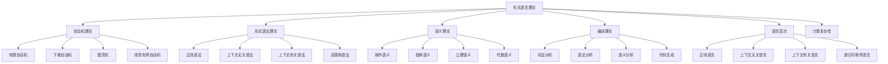

# 03-形式语言理论：形式化语言基础

## 目录

1. [1.0 形式语言理论概述](#10-形式语言理论概述)
2. [2.0 自动机理论](#20-自动机理论)
3. [3.0 形式语法理论](#30-形式语法理论)
4. [4.0 语义理论](#40-语义理论)
5. [5.0 编译理论](#50-编译理论)
6. [6.0 语言层次结构](#60-语言层次结构)
7. [7.0 计算复杂性](#70-计算复杂性)
8. [8.0 形式语言与软件架构](#80-形式语言与软件架构)
9. [9.0 形式化验证](#90-形式化验证)
10. [10.0 应用与实践](#100-应用与实践)

## 1.0 形式语言理论概述

### 1.1 形式语言在理论体系中的地位

**定义 1.1.1 (形式语言理论层)**
形式语言理论层是形式化理论体系的第三层，为软件架构提供语言理论基础和形式化描述工具。

**公理 1.1.1 (形式语言基础性)**
形式语言理论层 $\mathcal{L}$ 是软件架构理论的基础，满足：
$$\forall s \in \mathcal{S}, \quad \text{SoftwareArchitecture}(s) \Rightarrow \text{DependsOn}(s, \mathcal{L})$$

### 1.2 形式语言内容分布

## 2.0 自动机理论

### 2.1 有限自动机

**定义 2.1.1 (有限自动机)**
有限自动机是一个五元组 $M = (Q, \Sigma, \delta, q_0, F)$，其中：

- $Q$ 是状态集合
- $\Sigma$ 是输入字母表
- $\delta: Q \times \Sigma \to Q$ 是转移函数
- $q_0 \in Q$ 是初始状态
- $F \subseteq Q$ 是接受状态集合

**定义 2.1.2 (扩展转移函数)**
扩展转移函数 $\delta^*: Q \times \Sigma^* \to Q$ 递归定义为：

1. $\delta^*(q, \epsilon) = q$
2. $\delta^*(q, wa) = \delta(\delta^*(q, w), a)$

**定义 2.1.3 (语言接受)**
自动机 $M$ 接受的语言定义为：
$$L(M) = \{w \in \Sigma^* \mid \delta^*(q_0, w) \in F\}$$

**定理 2.1.1 (有限自动机等价性)**
确定性有限自动机(DFA)和非确定性有限自动机(NFA)等价。

**证明：** 通过子集构造法，可以将NFA转换为等价的DFA。

### 2.2 下推自动机

**定义 2.2.1 (下推自动机)**
下推自动机是一个七元组 $P = (Q, \Sigma, \Gamma, \delta, q_0, Z_0, F)$，其中：

- $Q$ 是状态集合
- $\Sigma$ 是输入字母表
- $\Gamma$ 是栈字母表
- $\delta: Q \times (\Sigma \cup \{\epsilon\}) \times \Gamma \to \mathcal{P}(Q \times \Gamma^*)$ 是转移函数
- $q_0 \in Q$ 是初始状态
- $Z_0 \in \Gamma$ 是初始栈符号
- $F \subseteq Q$ 是接受状态集合

**定义 2.2.2 (瞬时描述)**
瞬时描述是一个三元组 $(q, w, \gamma)$，其中：

- $q \in Q$ 是当前状态
- $w \in \Sigma^*$ 是剩余输入
- $\gamma \in \Gamma^*$ 是栈内容

**定义 2.2.3 (转移关系)**
转移关系 $\vdash$ 定义为：
$$(q, aw, Z\gamma) \vdash (p, w, \alpha\gamma) \Leftrightarrow (p, \alpha) \in \delta(q, a, Z)$$

### 2.3 图灵机

**定义 2.3.1 (图灵机)**
图灵机是一个七元组 $T = (Q, \Sigma, \Gamma, \delta, q_0, B, F)$，其中：

- $Q$ 是状态集合
- $\Sigma$ 是输入字母表
- $\Gamma$ 是磁带字母表
- $\delta: Q \times \Gamma \to Q \times \Gamma \times \{L, R\}$ 是转移函数
- $q_0 \in Q$ 是初始状态
- $B \in \Gamma$ 是空白符号
- $F \subseteq Q$ 是接受状态集合

**定义 2.3.2 (图灵机配置)**
图灵机配置是一个三元组 $(q, \alpha, i)$，其中：

- $q \in Q$ 是当前状态
- $\alpha \in \Gamma^*$ 是磁带内容
- $i \in \mathbb{N}$ 是读写头位置

**定义 2.3.3 (计算)**
图灵机 $T$ 在输入 $w$ 上的计算是配置序列：
$$(q_0, w, 0) \vdash (q_1, \alpha_1, i_1) \vdash \cdots$$

**定理 2.3.1 (丘奇-图灵论题)**
任何可计算的函数都可以由图灵机计算。

## 3.0 形式语法理论

### 3.1 上下文无关文法

**定义 3.1.1 (上下文无关文法)**
上下文无关文法是一个四元组 $G = (V, \Sigma, P, S)$，其中：

- $V$ 是非终结符集合
- $\Sigma$ 是终结符集合
- $P$ 是产生式集合
- $S \in V$ 是开始符号

**定义 3.1.2 (产生式)**
产生式是形如 $A \to \alpha$ 的规则，其中：

- $A \in V$ 是非终结符
- $\alpha \in (V \cup \Sigma)^*$ 是字符串

**定义 3.1.3 (推导关系)**
对于 $\alpha, \beta \in (V \cup \Sigma)^*$，$\alpha \Rightarrow \beta$ 当且仅当存在产生式 $A \to \gamma$ 使得：
$$\alpha = \alpha_1 A \alpha_2, \quad \beta = \alpha_1 \gamma \alpha_2$$

**定义 3.1.4 (语言生成)**
文法 $G$ 生成的语言定义为：
$$L(G) = \{w \in \Sigma^* \mid S \Rightarrow^* w\}$$

### 3.2 语法分析

**定义 3.2.1 (语法分析)**
语法分析是确定输入字符串是否属于给定语言的过程。

**定义 3.2.2 (LL(k)文法)**
LL(k)文法是可以通过向前看k个符号进行确定性分析的文法。

**定义 3.2.3 (LR(k)文法)**
LR(k)文法是可以通过向前看k个符号进行确定性归约的文法。

**定理 3.2.1 (LL(k)与LR(k)关系)**
每个LL(k)文法都是LR(k)文法，但反之不成立。

### 3.3 语法层次

**定义 3.3.1 (乔姆斯基层次)**
乔姆斯基层次是形式语法的分类体系：

1. **类型0**：无限制文法
2. **类型1**：上下文有关文法
3. **类型2**：上下文无关文法
4. **类型3**：正则文法

**定理 3.3.1 (层次包含关系)**
$$\text{Type3} \subset \text{Type2} \subset \text{Type1} \subset \text{Type0}$$

## 4.0 语义理论

### 4.1 操作语义

**定义 4.1.1 (操作语义)**
操作语义通过抽象机器的执行来描述程序的含义。

**定义 4.1.2 (小步语义)**
小步语义描述程序执行的每个步骤：
$$\langle e, \sigma \rangle \to \langle e', \sigma' \rangle$$

**定义 4.1.3 (大步语义)**
大步语义描述程序执行的最终结果：
$$\langle e, \sigma \rangle \Downarrow v$$

**公理 4.1.1 (操作语义公理)**
对于常量 $c$：
$$\langle c, \sigma \rangle \Downarrow c$$

### 4.2 指称语义

**定义 4.2.1 (指称语义)**
指称语义通过数学对象来描述程序的含义。

**定义 4.2.2 (语义域)**
语义域是程序含义的数学表示空间。

**定义 4.2.3 (语义函数)**
语义函数 $\mathcal{E}$ 将程序映射到语义域：
$$\mathcal{E}: \text{Exp} \to \text{Env} \to \text{Val}$$

**公理 4.2.1 (指称语义公理)**
对于变量 $x$：
$$\mathcal{E}[x]\rho = \rho(x)$$

### 4.3 公理语义

**定义 4.3.1 (霍尔逻辑)**
霍尔逻辑是程序正确性的形式化系统。

**定义 4.3.2 (霍尔三元组)**
霍尔三元组 $\{P\} C \{Q\}$ 表示：

- $P$ 是前置条件
- $C$ 是程序
- $Q$ 是后置条件

**公理 4.3.1 (赋值公理)**
$$\{P[E/x]\} x := E \{P\}$$

**公理 4.3.2 (序列公理)**
$$\frac{\{P\} C_1 \{R\} \quad \{R\} C_2 \{Q\}}{\{P\} C_1; C_2 \{Q\}}$$

## 5.0 编译理论

### 5.1 词法分析

**定义 5.1.1 (词法分析器)**
词法分析器将输入字符串分解为词法单元序列。

**定义 5.1.2 (词法单元)**
词法单元是一个二元组 $(token, value)$，其中：

- $token$ 是词法单元类型
- $value$ 是词法单元值

**定义 5.1.3 (正则表达式)**
正则表达式递归定义为：

1. $\epsilon$ 是正则表达式
2. $a \in \Sigma$ 是正则表达式
3. 如果 $r, s$ 是正则表达式，那么 $r|s$, $rs$, $r^*$ 是正则表达式

**定理 5.1.1 (克莱尼定理)**
正则表达式与有限自动机等价。

### 5.2 语法分析

**定义 5.2.1 (语法分析器)**
语法分析器根据语法规则构建语法树。

**定义 5.2.2 (抽象语法树)**
抽象语法树是程序结构的树形表示。

**定义 5.2.3 (语法分析算法)**
常见的语法分析算法包括：

1. **递归下降分析**
2. **LL分析**
3. **LR分析**
4. **LALR分析**

### 5.3 语义分析

**定义 5.3.1 (语义分析器)**
语义分析器检查程序的语义正确性。

**定义 5.3.2 (类型检查)**
类型检查验证表达式的类型一致性。

**定义 5.3.3 (作用域分析)**
作用域分析确定标识符的可见性。

### 5.4 代码生成

**定义 5.4.1 (代码生成器)**
代码生成器将中间表示转换为目标代码。

**定义 5.4.2 (中间表示)**
中间表示是程序的高级抽象表示。

**定义 5.4.3 (优化)**
代码优化提高生成代码的效率。

## 6.0 语言层次结构

### 6.1 正则语言

**定义 6.1.1 (正则语言)**
正则语言是可由有限自动机识别的语言。

**定理 6.1.1 (正则语言性质)**
正则语言在并、交、补、连接、星号运算下封闭。

**定理 6.1.2 (泵引理)**
对于正则语言 $L$，存在常数 $n$，使得对于任意 $w \in L$，$|w| \geq n$ 时，$w$ 可以分解为 $w = xyz$，满足：

1. $|xy| \leq n$
2. $|y| > 0$
3. $\forall k \geq 0, \quad xy^k z \in L$

### 6.2 上下文无关语言

**定义 6.2.1 (上下文无关语言)**
上下文无关语言是可由上下文无关文法生成的语言。

**定理 6.2.1 (上下文无关语言性质)**
上下文无关语言在并、连接、星号运算下封闭，但在交、补运算下不封闭。

**定理 6.2.2 (上下文无关语言泵引理)**
对于上下文无关语言 $L$，存在常数 $n$，使得对于任意 $w \in L$，$|w| \geq n$ 时，$w$ 可以分解为 $w = uvxyz$，满足：

1. $|vxy| \leq n$
2. $|vy| > 0$
3. $\forall k \geq 0, \quad uv^k xy^k z \in L$

### 6.3 递归可枚举语言

**定义 6.3.1 (递归可枚举语言)**
递归可枚举语言是可由图灵机识别的语言。

**定义 6.3.2 (递归语言)**
递归语言是可由总是停机的图灵机识别的语言。

**定理 6.3.1 (递归语言性质)**
递归语言在并、交、补运算下封闭。

## 7.0 计算复杂性

### 7.1 时间复杂度

**定义 7.1.1 (时间复杂度)**
时间复杂度是算法执行时间随输入规模增长的函数。

**定义 7.1.2 (大O记号)**
$f(n) = O(g(n))$ 当且仅当存在常数 $c, n_0$ 使得：
$$\forall n \geq n_0, \quad f(n) \leq c \cdot g(n)$$

**定义 7.1.3 (复杂度类)**
常见的复杂度类包括：

- **P**：多项式时间可解问题
- **NP**：非确定性多项式时间可解问题
- **PSPACE**：多项式空间可解问题
- **EXPTIME**：指数时间可解问题

### 7.2 空间复杂度

**定义 7.2.1 (空间复杂度)**
空间复杂度是算法执行时所需存储空间随输入规模增长的函数。

**定义 7.2.2 (空间复杂度类)**
常见的空间复杂度类包括：

- **L**：对数空间可解问题
- **NL**：非确定性对数空间可解问题
- **PSPACE**：多项式空间可解问题

### 7.3 可计算性

**定义 7.3.1 (可计算函数)**
可计算函数是可由图灵机计算的函数。

**定义 7.3.2 (停机问题)**
停机问题是判断给定图灵机在给定输入上是否停机的问题。

**定理 7.3.1 (停机问题不可解性)**
停机问题是不可解的。

## 8.0 形式语言与软件架构

### 8.1 架构描述语言

**定义 8.1.1 (架构描述语言)**
架构描述语言是用于描述软件架构的形式化语言。

**定义 8.1.2 (ADL特征)**
架构描述语言应具备：

1. **组件建模**
2. **连接器建模**
3. **配置建模**
4. **约束建模**

**定义 8.1.3 (ADL语法)**
ADL语法通常基于上下文无关文法。

### 8.2 形式化规范

**定义 8.2.1 (形式化规范)**
形式化规范是使用数学符号描述系统行为的规范。

**定义 8.2.2 (规范语言)**
常见的规范语言包括：

1. **Z语言**
2. **VDM**
3. **B方法**
4. **Alloy**

**公理 8.2.1 (规范一致性)**
形式化规范应与实现保持一致。

### 8.3 模型驱动架构

**定义 8.3.1 (模型驱动架构)**
模型驱动架构是基于模型的软件开发方法。

**定义 8.3.2 (模型转换)**
模型转换是将一种模型转换为另一种模型的过程。

**定义 8.3.3 (元模型)**
元模型是描述模型结构的模型。

## 9.0 形式化验证

### 9.1 模型检查

**定义 9.1.1 (模型检查)**
模型检查是自动验证有限状态系统是否满足性质的方法。

**定义 9.1.2 (时态逻辑)**
时态逻辑是描述系统时间行为的逻辑。

**定义 9.1.3 (CTL)**
计算树逻辑(CTL)是分支时态逻辑：

- **AX**：所有路径的下一个状态
- **EX**：存在路径的下一个状态
- **AG**：所有路径的所有状态
- **EG**：存在路径的所有状态

### 9.2 定理证明

**定义 9.2.1 (定理证明)**
定理证明是使用逻辑推理验证系统性质的方法。

**定义 9.2.2 (证明助手)**
证明助手是辅助进行形式化证明的工具。

**定义 9.2.3 (证明策略)**
常见的证明策略包括：

1. **归纳证明**
2. **反证法**
3. **构造证明**
4. **案例分析**

### 9.3 抽象解释

**定义 9.3.1 (抽象解释)**
抽象解释是静态分析程序性质的方法。

**定义 9.3.2 (抽象域)**
抽象域是程序状态的抽象表示。

**定义 9.3.3 (抽象函数)**
抽象函数将具体状态映射到抽象状态。

## 10.0 应用与实践

### 10.1 编译器设计

**定义 10.1.1 (编译器)**
编译器是将高级语言程序转换为机器代码的程序。

**定义 10.1.2 (编译器阶段)**
编译器的主要阶段包括：

1. **词法分析**
2. **语法分析**
3. **语义分析**
4. **中间代码生成**
5. **代码优化**
6. **目标代码生成**

**定理 10.1.1 (编译器正确性)**
编译器应保持程序的语义。

### 10.2 程序分析

**定义 10.2.1 (程序分析)**
程序分析是分析程序性质的技术。

**定义 10.2.2 (静态分析)**
静态分析在不执行程序的情况下分析程序。

**定义 10.2.3 (动态分析)**
动态分析在执行程序时分析程序。

### 10.3 语言设计

**定义 10.3.1 (语言设计)**
语言设计是设计编程语言的过程。

**定义 10.3.2 (语言特征)**
语言设计应考虑：

1. **可读性**
2. **可写性**
3. **可维护性**
4. **效率**

**公理 10.3.1 (语言设计公理)**
好的语言设计应平衡各种需求。

---

## 总结

形式语言理论为软件架构提供了坚实的语言理论基础。通过自动机理论、形式语法理论、语义理论等，建立了完整的语言理论框架。这些理论为编译器设计、程序分析、语言设计等提供了重要的理论支撑。 