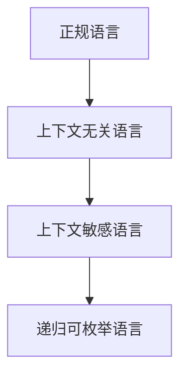

# 04-形式语言与自动机的关系

## 目录

1. [1.0 乔姆斯基层次](#10-乔姆斯基层次)
2. [2.0 语言与自动机的对应](#20-语言与自动机的对应)
3. [3.0 正规表达式与自动机](#30-正规表达式与自动机)
4. [4.0 上下文无关语言与PDA](#40-上下文无关语言与pda)
5. [5.0 上下文敏感语言与LBA](#50-上下文敏感语言与lba)
6. [6.0 递归可枚举语言与图灵机](#60-递归可枚举语言与图灵机)

## 1.0 乔姆斯基层次

**定义 1.1.1 (乔姆斯基层次)**
乔姆斯基层次将形式语言分为四类：
1. 0型：递归可枚举语言
2. 1型：上下文敏感语言
3. 2型：上下文无关语言
4. 3型：正规语言

**定理 1.1.1 (严格包含关系)**
$$\text{正规} \subset \text{上下文无关} \subset \text{上下文敏感} \subset \text{递归可枚举}$$



## 2.0 语言与自动机的对应

| 语言类别         | 自动机模型         |
|------------------|--------------------|
| 正规语言         | 有限自动机 (FA)    |
| 上下文无关语言   | 下推自动机 (PDA)   |
| 上下文敏感语言   | 线性有界自动机 (LBA)|
| 递归可枚举语言   | 图灵机 (TM)        |

**定理 2.1.1 (等价性)**
每一类语言都与一种自动机模型严格对应。

## 3.0 正规表达式与自动机

**定理 3.1.1 (Kleene定理)**
正规表达式与有限自动机等价。

- 任意正规表达式可构造等价NFA
- 任意NFA可构造等价正规表达式

```rust
// Thompson构造法伪代码
fn regex_to_nfa(regex: &str) -> NFA {
    // ...
}
```

## 4.0 上下文无关语言与PDA

**定理 4.1.1**
上下文无关语言等价于下推自动机可识别的语言。

- 任意CFG可构造等价PDA
- 任意PDA可构造等价CFG

```rust
// CFG到PDA伪代码
fn cfg_to_pda(cfg: &ContextFreeGrammar) -> PDA {
    // ...
}
```

## 5.0 上下文敏感语言与LBA

**定理 5.1.1**
上下文敏感语言等价于线性有界自动机可识别的语言。

## 6.0 递归可枚举语言与图灵机

**定理 6.1.1**
递归可枚举语言等价于图灵机可识别的语言。

---

## 总结

形式语言的分级与自动机模型一一对应，构成理论计算机科学的基础。 