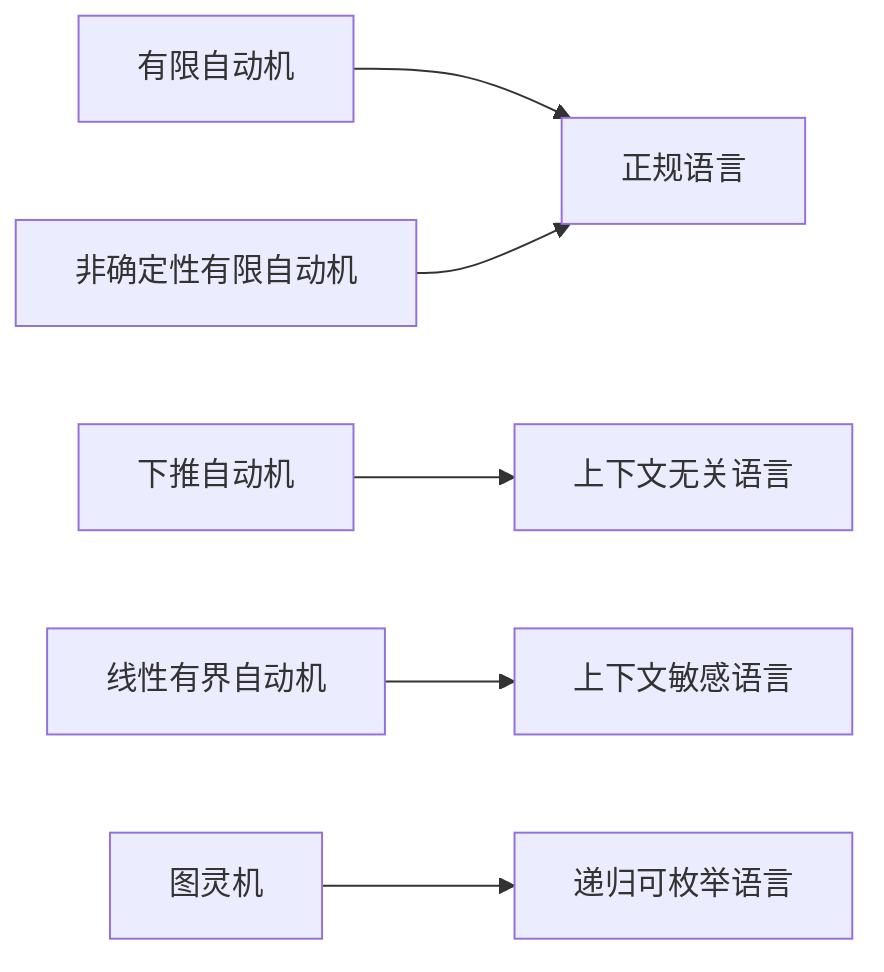

# 05-形式语言理论总结

## 1.0 理论结构回顾

- 01-自动机理论：形式化计算模型基础
- 02-语法分析理论：语言结构的形式化分析
- 03-语义分析理论：程序含义的形式化基础
- 04-形式语言与自动机的关系：分级与对应

## 2.0 主要内容要点

- 形式语言分级（乔姆斯基层次）
- 自动机模型（DFA, NFA, PDA, LBA, TM）
- 语法分析（CFG, LL, LR, SLR等）
- 语义分析（属性文法、类型系统、静态检查）
- 语言与自动机的严格对应

## 3.0 多模态表达

## 4.0 工程与学术应用

- 编译器前端（词法、语法、语义分析）
- 形式化验证与模型检测
- 语言设计与DSL开发
- 计算理论与复杂性分析

## 5.0 交叉引用

- [自动机理论](01-自动机理论.md)
- [语法分析理论](02-语法分析理论.md)
- [语义分析理论](03-语义分析理论.md)
- [形式语言与自动机的关系](04-形式语言与自动机的关系.md)

---

## 总结

形式语言理论为计算机科学、软件工程、人工智能等领域提供了坚实的理论基础和工程方法。 