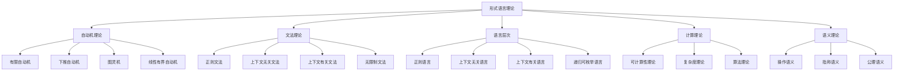

# 形式语言理论统一总论

## 目录

- [形式语言理论统一总论](#形式语言理论统一总论)
  - [目录](#目录)
  - [1. 理论概述](#1-理论概述)
    - [1.1 形式语言理论定位](#11-形式语言理论定位)
    - [1.2 形式语言的定义](#12-形式语言的定义)
    - [1.3 形式语言的核心问题](#13-形式语言的核心问题)
    - [1.4 理论特色](#14-理论特色)
    - [1.5 理论目标](#15-理论目标)
  - [2. 形式语言体系架构](#2-形式语言体系架构)
    - [2.1 整体架构](#21-整体架构)
    - [2.2 理论层次结构](#22-理论层次结构)
    - [2.3 理论关联关系](#23-理论关联关系)
    - [2.4 语言层次结构](#24-语言层次结构)
  - [3. 核心概念体系](#3-核心概念体系)
    - [3.1 自动机理论](#31-自动机理论)
      - [3.1.1 有限自动机](#311-有限自动机)
      - [3.1.2 下推自动机](#312-下推自动机)
      - [3.1.3 图灵机](#313-图灵机)
    - [3.2 文法理论](#32-文法理论)
      - [3.2.1 上下文无关文法](#321-上下文无关文法)
  - [4. 形式化表示](#4-形式化表示)
    - [4.1 语言的形式化定义](#41-语言的形式化定义)
    - [4.2 自动机的形式化定义](#42-自动机的形式化定义)
  - [5. 理论基础](#5-理论基础)
    - [5.1 数学基础](#51-数学基础)
    - [5.2 计算基础](#52-计算基础)
    - [5.3 语义理论基础](#53-语义理论基础)
      - [5.3.1 操作语义](#531-操作语义)
      - [5.3.2 指称语义](#532-指称语义)
  - [6. 应用领域](#6-应用领域)
    - [6.1 编程语言](#61-编程语言)
    - [6.2 软件工程](#62-软件工程)
    - [6.3 人工智能](#63-人工智能)
    - [6.4 跨学科整合](#64-跨学科整合)
      - [6.4.1 与哲学理论的整合](#641-与哲学理论的整合)
      - [6.4.2 与数学理论的整合](#642-与数学理论的整合)
      - [6.4.3 与软件架构理论的整合](#643-与软件架构理论的整合)
  - [7. 发展趋势](#7-发展趋势)
    - [7.1 理论发展趋势](#71-理论发展趋势)
    - [7.2 应用发展趋势](#72-应用发展趋势)
    - [7.3 技术发展趋势](#73-技术发展趋势)
  - [8. 理论目标与规划](#8-理论目标与规划)
    - [8.1 理论目标](#81-理论目标)
    - [8.2 应用目标](#82-应用目标)
    - [8.3 理论体系规划](#83-理论体系规划)
    - [8.4 实施计划](#84-实施计划)
  - [9. 总结](#9-总结)

## 1. 理论概述

### 1.1 形式语言理论定位

形式语言理论是形式化架构理论的核心支柱之一，为整个理论体系提供：

- **语言基础**：形式化语言的语法和语义理论
- **计算模型**：自动机和计算理论的基础
- **表达能力**：不同语言类的表达能力分析
- **算法基础**：语言处理和编译的理论基础
- **逻辑框架**：形式化逻辑的语言基础

### 1.2 形式语言的定义

形式语言是研究符号系统、语法结构和语义解释的数学分支。
在形式化架构理论中，形式语言为软件系统的编程语言设计、编译器构造、形式验证等提供理论基础。

**形式化定义**：

$$\mathcal{FL} = \langle \mathcal{A}, \mathcal{G}, \mathcal{S}, \mathcal{T} \rangle$$

其中：

- $\mathcal{A}$ 表示字母表集合 (Alphabets)
- $\mathcal{G}$ 表示语法集合 (Grammars)
- $\mathcal{S}$ 表示语义集合 (Semantics)
- $\mathcal{T}$ 表示类型集合 (Types)

### 1.3 形式语言的核心问题

1. **语法问题**：语言结构如何定义？
2. **语义问题**：语言含义如何解释？
3. **类型问题**：类型系统如何设计？
4. **计算问题**：语言如何执行？
5. **验证问题**：程序如何验证？

### 1.4 理论特色

本形式语言理论体系具有以下特色：

1. **高度形式化**：使用严格的数学符号和公理化方法
2. **层次化结构**：从简单到复杂的语言层次体系
3. **计算导向**：强调语言的计算模型和算法
4. **跨学科整合**：与计算机科学、语言学、逻辑学深度融合
5. **应用导向**：注重在实际系统中的应用

### 1.5 理论目标

- 建立统一的形式语言概念体系
- 提供形式化的语言分析方法
- 支持跨学科的语言应用
- 为软件架构和系统设计提供语言基础

## 2. 形式语言体系架构

### 2.1 整体架构



### 2.2 理论层次结构

```text
形式语言理论体系
├── 01-自动机理论
│   ├── 有限自动机
│   ├── 下推自动机
│   ├── 图灵机
│   └── 自动机等价性
├── 02-形式语法
│   ├── 正则语法
│   ├── 上下文无关语法
│   ├── 上下文有关语法
│   └── 无限制语法
├── 03-语义理论
│   ├── 操作语义
│   ├── 指称语义
│   ├── 公理语义
│   └── 代数语义
├── 04-类型理论
│   ├── 简单类型系统
│   ├── 多态类型系统
│   ├── 依赖类型系统
│   └── 高阶类型系统
├── 05-计算理论
│   ├── 可计算性理论
│   ├── 复杂性理论
│   ├── 递归理论
│   └── 算法理论
└── 06-语言设计
    ├── 语言规范
    ├── 编译器设计
    ├── 解释器设计
    └── 语言实现
```

### 2.3 理论关联关系

**形式化表示**：

$$\mathcal{FL} = \mathcal{AT} \oplus \mathcal{FG} \oplus \mathcal{ST} \oplus \mathcal{TT} \oplus \mathcal{CT} \oplus \mathcal{LD}$$

其中：

- $\mathcal{AT}$ 表示自动机理论 (Automata Theory)
- $\mathcal{FG}$ 表示形式语法 (Formal Grammar)
- $\mathcal{ST}$ 表示语义理论 (Semantic Theory)
- $\mathcal{TT}$ 表示类型理论 (Type Theory)
- $\mathcal{CT}$ 表示计算理论 (Computation Theory)
- $\mathcal{LD}$ 表示语言设计 (Language Design)

### 2.4 语言层次结构

| 层次 | 语言类 | 文法类型 | 自动机 | 表达能力 |
|------|--------|----------|--------|----------|
| **0型** | 递归可枚举语言 | 无限制文法 | 图灵机 | 最强 |
| **1型** | 上下文有关语言 | 上下文有关文法 | 线性有界自动机 | 强 |
| **2型** | 上下文无关语言 | 上下文无关文法 | 下推自动机 | 中等 |
| **3型** | 正则语言 | 正则文法 | 有限自动机 | 最弱 |

## 3. 核心概念体系

### 3.1 自动机理论

#### 3.1.1 有限自动机

```rust
// 确定性有限自动机
struct DFA {
    states: Vec<State>,
    alphabet: Vec<Symbol>,
    transition_function: TransitionFunction,
    initial_state: State,
    accepting_states: Vec<State>
}

// 转移函数
struct TransitionFunction {
    transitions: HashMap<(State, Symbol), State>
}

impl DFA {
    fn new(states: Vec<State>, alphabet: Vec<Symbol>, 
           transitions: Vec<((State, Symbol), State)>,
           initial: State, accepting: Vec<State>) -> Self {
        let mut tf = TransitionFunction {
            transitions: HashMap::new()
        };
        for ((s, a), t) in transitions {
            tf.transitions.insert((s, a), t);
        }
        DFA {
            states,
            alphabet,
            transition_function: tf,
            initial_state: initial,
            accepting_states: accepting
        }
    }
    
    fn accept(&self, input: &str) -> bool {
        let mut current_state = self.initial_state;
        for symbol in input.chars() {
            if let Some(next_state) = self.transition_function
                .transitions.get(&(current_state, symbol)) {
                current_state = *next_state;
            } else {
                return false;
            }
        }
        self.accepting_states.contains(&current_state)
    }
}

// 非确定性有限自动机
struct NFA {
    states: Vec<State>,
    alphabet: Vec<Symbol>,
    transition_function: NFATransitionFunction,
    initial_state: State,
    accepting_states: Vec<State>
}

// NFA转移函数
struct NFATransitionFunction {
    transitions: HashMap<(State, Symbol), Vec<State>>
}

impl NFA {
    fn accept(&self, input: &str) -> bool {
        let mut current_states = vec![self.initial_state];
        
        for symbol in input.chars() {
            let mut next_states = Vec::new();
            for state in &current_states {
                if let Some(states) = self.transition_function
                    .transitions.get(&(*state, symbol)) {
                    next_states.extend(states);
                }
            }
            current_states = next_states;
            if current_states.is_empty() {
                return false;
            }
        }
        
        current_states.iter().any(|s| self.accepting_states.contains(s))
    }
}
```

#### 3.1.2 下推自动机

```rust
// 下推自动机
struct PDA {
    states: Vec<State>,
    input_alphabet: Vec<Symbol>,
    stack_alphabet: Vec<Symbol>,
    transition_function: PDATransitionFunction,
    initial_state: State,
    initial_stack_symbol: Symbol,
    accepting_states: Vec<State>
}

// PDA转移函数
struct PDATransitionFunction {
    transitions: HashMap<(State, Symbol, Symbol), Vec<(State, Vec<Symbol>)>>
}

// PDA配置
struct PDAConfiguration {
    state: State,
    input: Vec<Symbol>,
    stack: Vec<Symbol>
}

impl PDA {
    fn accept(&self, input: &str) -> bool {
        let mut config = PDAConfiguration {
            state: self.initial_state,
            input: input.chars().collect(),
            stack: vec![self.initial_stack_symbol]
        };
        
        while !config.input.is_empty() || !config.stack.is_empty() {
            let current_symbol = config.input.first().cloned();
            let stack_top = config.stack.last().cloned();
            
            if let (Some(symbol), Some(stack_symbol)) = (current_symbol, stack_top) {
                if let Some(transitions) = self.transition_function
                    .transitions.get(&(config.state, symbol, stack_symbol)) {
                    // 应用转移规则
                    if let Some((new_state, new_stack_symbols)) = transitions.first() {
                        config.state = *new_state;
                        config.input.remove(0);
                        config.stack.pop();
                        for symbol in new_stack_symbols.iter().rev() {
                            config.stack.push(*symbol);
                        }
                        continue;
                    }
                }
            }
            
            // 如果没有匹配的转移规则，拒绝输入
            return false;
        }
        
        self.accepting_states.contains(&config.state)
    }
}
```

#### 3.1.3 图灵机

```rust
// 图灵机
struct TuringMachine {
    states: Vec<State>,
    alphabet: Vec<Symbol>,
    tape_alphabet: Vec<Symbol>,
    transition_function: TMTransitionFunction,
    initial_state: State,
    blank_symbol: Symbol,
    accepting_states: Vec<State>,
    rejecting_states: Vec<State>
}

// 图灵机转移函数
struct TMTransitionFunction {
    transitions: HashMap<(State, Symbol), (State, Symbol, Direction)>
}

#[derive(Debug, Clone)]
enum Direction {
    Left,
    Right,
    Stay
}

// 图灵机配置
struct TMConfiguration {
    state: State,
    tape: Vec<Symbol>,
    head_position: usize
}

impl TuringMachine {
    fn accept(&self, input: &str) -> bool {
        let mut config = TMConfiguration {
            state: self.initial_state,
            tape: input.chars().map(|c| c as Symbol).collect(),
            head_position: 0
        };
        
        // 确保磁带足够长
        while config.head_position >= config.tape.len() {
            config.tape.push(self.blank_symbol);
        }
        
        loop {
            let current_symbol = config.tape[config.head_position];
            
            if let Some((new_state, new_symbol, direction)) = 
                self.transition_function.transitions.get(&(config.state, current_symbol)) {
                
                // 更新状态和磁带
                config.state = *new_state;
                config.tape[config.head_position] = *new_symbol;
                
                // 移动读写头
                match direction {
                    Direction::Left => {
                        if config.head_position == 0 {
                            config.tape.insert(0, self.blank_symbol);
                        } else {
                            config.head_position -= 1;
                        }
                    },
                    Direction::Right => {
                        config.head_position += 1;
                        if config.head_position >= config.tape.len() {
                            config.tape.push(self.blank_symbol);
                        }
                    },
                    Direction::Stay => {}
                }
            } else {
                // 没有转移规则，停机
                break;
            }
        }
        
        self.accepting_states.contains(&config.state)
    }
}
```

### 3.2 文法理论

#### 3.2.1 上下文无关文法

```rust
// 上下文无关文法
struct CFG {
    variables: Vec<Variable>,
    terminals: Vec<Terminal>,
    productions: Vec<Production>,
    start_symbol: Variable
}

// 产生式
struct Production {
    left_hand_side: Variable,
    right_hand_side: Vec<Symbol>
}

#[derive(Debug, Clone)]
enum Symbol {
    Variable(Variable),
    Terminal(Terminal)
}

impl CFG {
    fn derive(&self, input: &str) -> bool {
        let mut current_string = vec![Symbol::Variable(self.start_symbol)];
        
        while !current_string.is_empty() {
            // 查找可以应用的产生式
            let mut applied = false;
            for (i, symbol) in current_string.iter().enumerate() {
                if let Symbol::Variable(var) = symbol {
                    for production in &self.productions {
                        if production.left_hand_side == *var {
                            // 应用产生式
                            let mut new_string = current_string[..i].to_vec();
                            new_string.extend(production.right_hand_side.clone());
                            new_string.extend(current_string[i+1..].to_vec());
                            current_string = new_string;
                            applied = true;
                            break;
                        }
                    }
                    if applied {
                        break;
                    }
                }
            }
            
            if !applied {
                // 检查是否生成了目标字符串
                let result: String = current_string.iter()
                    .filter_map(|s| {
                        if let Symbol::Terminal(t) = s {
                            Some(t.to_string())
                        } else {
                            None
                        }
                    })
                    .collect();
                return result == input;
            }
        }
        
        false
    }
}
```

## 4. 形式化表示

### 4.1 语言的形式化定义

**字母表**：$\Sigma$ 是一个有限的符号集合

**字符串**：$\Sigma^*$ 表示字母表 $\Sigma$ 上所有字符串的集合

**语言**：$L \subseteq \Sigma^*$ 是字母表 $\Sigma$ 上字符串的集合

**文法**：$G = (V, \Sigma, P, S)$ 其中：

- $V$ 是非终结符集合
- $\Sigma$ 是终结符集合
- $P$ 是产生式规则集合
- $S$ 是开始符号

### 4.2 自动机的形式化定义

**有限自动机**：$M = (Q, \Sigma, \delta, q_0, F)$ 其中：

- $Q$ 是状态集合
- $\Sigma$ 是输入字母表
- $\delta: Q \times \Sigma \rightarrow Q$ 是转移函数
- $q_0 \in Q$ 是初始状态
- $F \subseteq Q$ 是接受状态集合

**下推自动机**：$P = (Q, \Sigma, \Gamma, \delta, q_0, Z_0, F)$ 其中：

- $Q$ 是状态集合
- $\Sigma$ 是输入字母表
- $\Gamma$ 是栈字母表
- $\delta: Q \times \Sigma \times \Gamma \rightarrow 2^{Q \times \Gamma^*}$ 是转移函数
- $q_0 \in Q$ 是初始状态
- $Z_0 \in \Gamma$ 是初始栈符号
- $F \subseteq Q$ 是接受状态集合

**图灵机**：$T = (Q, \Sigma, \Gamma, \delta, q_0, B, F)$ 其中：

- $Q$ 是状态集合
- $\Sigma$ 是输入字母表
- $\Gamma$ 是磁带字母表
- $\delta: Q \times \Gamma \rightarrow Q \times \Gamma \times \{L, R, S\}$ 是转移函数
- $q_0 \in Q$ 是初始状态
- $B \in \Gamma$ 是空白符号
- $F \subseteq Q$ 是接受状态集合

## 5. 理论基础

### 5.1 数学基础

形式语言理论建立在以下数学基础之上：

1. **集合论**：字母表、语言、关系
2. **代数**：半群、幺半群、自由代数
3. **逻辑**：谓词逻辑、模态逻辑、时序逻辑
4. **范畴论**：函子、自然变换、伴随

### 5.2 计算基础

形式语言理论的计算基础包括：

1. **递归函数**：原始递归、一般递归
2. **λ演算**：α等价、β归约、η等价
3. **组合逻辑**：SKI组合子、组合子归约
4. **图灵机**：确定性、非确定性、通用性

### 5.3 语义理论基础

#### 5.3.1 操作语义

```rust
// 操作语义示例
pub struct OperationalSemantics {
    rules: Vec<InferenceRule>
}

pub struct InferenceRule {
    premises: Vec<Judgment>,
    conclusion: Judgment
}

pub struct Judgment {
    environment: Environment,
    expression: Expression,
    value: Value
}

impl OperationalSemantics {
    fn evaluate(&self, expression: &Expression, env: &Environment) -> Result<Value, String> {
        // 应用操作语义规则
        for rule in &self.rules {
            if self.matches_premises(rule, expression, env) {
                return self.apply_conclusion(rule, expression, env);
            }
        }
        Err("No applicable rule".to_string())
    }
}
```

#### 5.3.2 指称语义

```rust
// 指称语义示例
pub struct DenotationalSemantics {
    domains: HashMap<Type, Domain>
}

pub trait Domain {
    fn bottom(&self) -> Self;
    fn join(&self, other: &Self) -> Self;
    fn meet(&self, other: &Self) -> Self;
}

impl DenotationalSemantics {
    fn meaning(&self, expression: &Expression) -> Value {
        match expression {
            Expression::Literal(value) => value.clone(),
            Expression::Variable(name) => self.lookup_variable(name),
            Expression::BinaryOp(left, op, right) => {
                let left_val = self.meaning(left);
                let right_val = self.meaning(right);
                self.apply_operator(&left_val, op, &right_val)
            },
            Expression::FunctionCall(name, args) => {
                let func = self.lookup_function(name);
                let arg_values: Vec<Value> = args.iter()
                    .map(|arg| self.meaning(arg))
                    .collect();
                self.apply_function(&func, &arg_values)
            }
        }
    }
}
```

## 6. 应用领域

### 6.1 编程语言

1. **语言设计**：语法设计、语义定义
2. **编译器构造**：词法分析、语法分析、代码生成
3. **类型系统**：类型检查、类型推导、类型安全
4. **程序验证**：形式验证、模型检查、定理证明

### 6.2 软件工程

1. **需求工程**：形式化需求、需求验证
2. **系统设计**：形式化设计、设计验证
3. **测试理论**：形式化测试、测试生成
4. **质量保证**：形式化质量、质量度量

### 6.3 人工智能

1. **自然语言处理**：语法分析、语义理解
2. **知识表示**：逻辑表示、规则系统
3. **机器学习**：形式化学习、学习理论
4. **专家系统**：知识工程、推理系统

### 6.4 跨学科整合

#### 6.4.1 与哲学理论的整合

- **本体论**：语言实体的存在性分析
- **认识论**：语言知识的获取和验证
- **逻辑学**：形式逻辑的语言基础

#### 6.4.2 与数学理论的整合

- **集合论**：语言集合的数学结构
- **代数**：语言代数的抽象结构
- **拓扑学**：语言空间的拓扑性质

#### 6.4.3 与软件架构理论的整合

- **架构语言**：形式化架构描述语言
- **组件模型**：形式化组件交互模型
- **系统验证**：架构正确性验证

## 7. 发展趋势

### 7.1 理论发展趋势

1. **高阶理论**：高阶类型、高阶逻辑
2. **依赖理论**：依赖类型、依赖逻辑
3. **并发理论**：进程代数、时序逻辑
4. **概率理论**：概率语言、随机语义

### 7.2 应用发展趋势

1. **领域特定语言**：DSL设计、DSL工程
2. **形式化方法**：形式化开发、形式化验证
3. **软件安全**：安全语言、安全验证
4. **量子计算**：量子语言、量子语义

### 7.3 技术发展趋势

1. **智能化语言处理**：基于机器学习的语言分析
2. **可视化语言设计**：图形化语言设计工具
3. **分布式语言**：支持分布式计算的语言特性
4. **实时语言**：支持实时系统的语言特性

## 8. 理论目标与规划

### 8.1 理论目标

1. **完整性**：覆盖形式语言理论的所有核心内容
2. **系统性**：建立统一的理论框架
3. **严谨性**：采用严格的形式化方法
4. **实用性**：注重理论的实际应用

### 8.2 应用目标

1. **语言设计**：为编程语言设计提供理论基础
2. **工具开发**：为开发工具提供理论指导
3. **系统验证**：为系统验证提供理论方法
4. **教育研究**：为教育和研究提供理论资源

### 8.3 理论体系规划

1. **基础理论**：自动机理论、形式语法
2. **核心理论**：语义理论、类型理论
3. **高级理论**：计算理论、语言设计
4. **应用理论**：实际应用、案例分析

### 8.4 实施计划

1. **第一阶段**：完成基础理论文档
2. **第二阶段**：完成核心理论文档
3. **第三阶段**：完成高级理论文档
4. **第四阶段**：完成应用理论文档

## 9. 总结

形式语言理论体系为形式化架构理论体系提供了语言基础，通过自动机理论、形式语法、语义理论、类型理论、计算理论、语言设计的系统整合，为软件系统的编程语言、编译器、形式验证等提供了重要的理论指导。

通过严格的形式化方法和跨学科整合，形式语言理论体系为整个形式化架构理论体系奠定了坚实的理论基础。该理论体系将继续演进，融入新的技术发展和应用需求，为形式化架构理论的发展提供持续的理论支撑。

---

**相关链接**：

- [01-自动机理论](01-自动机理论.md)
- [02-形式语法](02-形式语法.md)
- [03-语义理论](03-语义理论.md)
- [04-类型理论](04-类型理论.md)
- [05-计算理论](05-计算理论.md)
- [06-语言设计](06-语言设计.md)

**参考文献**：

1. Hopcroft, J.E., Ullman, J.D. *Introduction to Automata Theory, Languages, and Computation*. Addison-Wesley, 1979.
2. Sipser, M. *Introduction to the Theory of Computation*. Cengage Learning, 2012.
3. Pierce, B.C. *Types and Programming Languages*. MIT Press, 2002.
4. Winskel, G. *The Formal Semantics of Programming Languages*. MIT Press, 1993.
5. Aho, A.V., Lam, M.S., Sethi, R., Ullman, J.D. *Compilers: Principles, Techniques, and Tools*. Pearson, 2006.
