# 03-形式语言理论体系-统一总论

[返回主题树](../00-主题树与内容索引.md) | [主计划文档](../00-形式化架构理论统一计划.md) | [相关计划](../递归合并计划.md)

> 本文档为形式语言理论体系分支统一总论，所有最新进展与结论以主计划文档为准，历史细节归档于archive/。

## 目录

- [03-形式语言理论体系-统一总论](#03-形式语言理论体系-统一总论)
  - [概述](#概述)
  - [形式语言理论体系架构](#形式语言理论体系架构)
  - [形式语言基础理论](#形式语言基础理论)
  - [自动机理论](#自动机理论)
  - [语法理论](#语法理论)
  - [语义理论](#语义理论)
  - [形式语言与计算理论](#形式语言与计算理论)
  - [形式语言应用理论](#形式语言应用理论)
  - [与形式化架构理论的关联](#与形式化架构理论的关联)
  - [参考文献](#参考文献)

## 概述

### 1.1 形式语言理论的定义与地位

形式语言理论是形式化架构理论的核心支柱，为整个理论体系提供：

- **形式化表达工具**：精确的符号系统和语法规则
- **计算理论基础**：自动机和计算模型的形式化描述
- **语言处理技术**：语法分析、语义分析、代码生成
- **验证与证明方法**：形式化验证和程序正确性证明

### 1.2 形式语言理论的核心特征

1. **形式化**：基于严格的数学定义和公理系统
2. **层次性**：从正则语言到递归可枚举语言的多层次结构
3. **计算性**：与计算理论紧密关联
4. **应用性**：在编程语言、编译器、自然语言处理等领域广泛应用

## 形式语言理论体系架构

### 2.1 理论体系层次结构

```mermaid
graph TD
    A[形式语言理论体系] --> B[形式语言基础理论]
    A --> C[自动机理论]
    A --> D[语法理论]
    A --> E[语义理论]
    A --> F[计算理论]
    A --> G[应用理论]
    
    B --> B1[字母表与字符串]
    B --> B2[语言定义]
    B --> B3[语言运算]
    B --> B4[语言层次]
    
    C --> C1[有限自动机]
    C --> C2[下推自动机]
    C --> C3[图灵机]
    C --> C4[线性有界自动机]
    
    D --> D1[正则文法]
    D --> D2[上下文无关文法]
    D --> D3[上下文有关文法]
    D --> D4[无限制文法]
    
    E --> E1[操作语义]
    E --> E2[指称语义]
    E --> E3[公理语义]
    E --> E4[代数语义]
    
    F --> F1[可计算性理论]
    F --> F2[计算复杂性理论]
    F --> F3[递归理论]
    
    G --> G1[编程语言理论]
    G --> G2[编译器理论]
    G --> G3[自然语言处理]
    G --> G4[形式化验证]
```



### 2.2 理论体系关系图

| 理论层次 | 核心内容 | 主要方法 | 应用领域 |
|---------|---------|---------|---------|
| 基础理论 | 字母表、字符串、语言 | 集合论方法 | 所有形式语言 |
| 自动机理论 | 计算模型、状态转换 | 状态机方法 | 语言识别、计算 |
| 语法理论 | 文法规则、推导过程 | 重写系统 | 语言生成、解析 |
| 语义理论 | 语言含义、解释方法 | 逻辑方法 | 程序理解、验证 |
| 计算理论 | 可计算性、复杂性 | 算法分析 | 计算模型、优化 |
| 应用理论 | 编程语言、编译器 | 工程方法 | 软件开发、系统设计 |

## 形式语言基础理论

### 3.1 字母表与字符串

#### 3.1.1 字母表

**定义 3.1** (字母表)
字母表是一个有限的符号集合，通常用Σ表示。

**例子**：

- 二进制字母表：Σ = {0, 1}
- 英文字母表：Σ = {a, b, ..., z}
- 数字字母表：Σ = {0, 1, 2, ..., 9}

**公理 3.1** (字母表公理)

1. 字母表是有限集合
2. 字母表非空
3. 字母表中的符号是可区分的

#### 3.1.2 字符串

**定义 3.2** (字符串)
字符串是字母表上符号的有限序列。

**定义 3.3** (字符串长度)
字符串w的长度|w|是其中符号的个数。

**定义 3.4** (空字符串)
空字符串ε是长度为0的字符串。

**定理 3.1** (字符串性质)

1. |ε| = 0
2. |wa| = |w| + 1，其中w是字符串，a是符号
3. |wv| = |w| + |v|，其中w,v是字符串

#### 3.1.3 字符串运算

**定义 3.5** (字符串连接)
字符串w和v的连接wv是将v附加到w后面。

**性质**：

1. εw = wε = w
2. (uv)w = u(vw)
3. |uv| = |u| + |v|

**定义 3.6** (字符串幂)
字符串w的n次幂w^n定义为：

- w^0 = ε
- w^{n+1} = w^n w

**定义 3.7** (字符串反转)
字符串w = a_1a_2...a_n的反转w^R = a_n...a_2a_1

### 3.2 语言定义

#### 3.2.1 语言的基本概念

**定义 3.8** (语言)
语言是字母表Σ上字符串的集合：L ⊆ Σ*

**定义 3.9** (克林闭包)
字母表Σ的克林闭包Σ*是所有字符串的集合：
Σ* = {ε} ∪ Σ ∪ Σ² ∪ Σ³ ∪ ...

**定义 3.10** (正闭包)
字母表Σ的正闭包Σ⁺是除空字符串外的所有字符串：
Σ⁺ = Σ ∪ Σ² ∪ Σ³ ∪ ...

#### 3.2.2 语言运算

**定义 3.11** (语言连接)
语言L₁和L₂的连接L₁L₂ = {uv : u ∈ L₁, v ∈ L₂}

**定义 3.12** (语言幂)
语言L的n次幂L^n定义为：

- L^0 = {ε}
- L^{n+1} = L^n L

**定义 3.13** (克林星号)
语言L的克林星号L* = ∪_{n≥0} L^n

**定义 3.14** (正星号)
语言L的正星号L⁺ = ∪_{n≥1} L^n

**定理 3.2** (语言运算性质)

1. L* = {ε} ∪ L⁺
2. (L*)* = L*
3. L*L* = L*
4. (L⁺)*= L*

### 3.3 语言层次

#### 3.3.1 乔姆斯基层次

**定义 3.15** (乔姆斯基层次)
形式语言按生成能力分为四个层次：

1. **类型0**：无限制文法 - 递归可枚举语言
2. **类型1**：上下文有关文法 - 上下文有关语言
3. **类型2**：上下文无关文法 - 上下文无关语言
4. **类型3**：正则文法 - 正则语言

**定理 3.3** (层次包含关系)
正则语言 ⊂ 上下文无关语言 ⊂ 上下文有关语言 ⊂ 递归可枚举语言

#### 3.3.2 语言类性质

**定义 3.16** (语言类封闭性)
语言类在运算下封闭，如果对类中任意语言应用该运算，结果仍在类中。

**定理 3.4** (正则语言封闭性)
正则语言在以下运算下封闭：

1. 并集
2. 交集
3. 补集
4. 连接
5. 克林星号
6. 反转

## 自动机理论

### 4.1 有限自动机

#### 4.1.1 确定性有限自动机

**定义 4.1** (DFA)
确定性有限自动机是一个五元组(Q, Σ, δ, q₀, F)：

- Q：有限状态集
- Σ：输入字母表
- δ：转移函数 Q × Σ → Q
- q₀：初始状态
- F：接受状态集

**定义 4.2** (DFA计算)
DFA在输入字符串w上的计算是状态序列：
q₀ → q₁ → q₂ → ... → q_n
其中q_{i+1} = δ(q_i, w_i)

**定义 4.3** (DFA接受)
DFA接受字符串w，如果计算结束于接受状态。

**定义 4.4** (DFA语言)
DFA M接受的语言L(M) = {w : M接受w}

#### 4.1.2 非确定性有限自动机

**定义 4.5** (NFA)
非确定性有限自动机是一个五元组(Q, Σ, δ, q₀, F)：

- Q：有限状态集
- Σ：输入字母表
- δ：转移函数 Q × Σ → 2^Q
- q₀：初始状态
- F：接受状态集

**定理 4.1** (DFA与NFA等价性)
对于每个NFA，存在等价的DFA。

**证明**：
使用子集构造法，将NFA的状态集映射到DFA的状态集。

#### 4.1.3 正则表达式

**定义 4.6** (正则表达式)
正则表达式递归定义：

1. ∅, ε, a (a ∈ Σ) 是正则表达式
2. 如果r, s是正则表达式，则(r+s), (rs), r*是正则表达式

**定理 4.2** (正则表达式与FA等价性)
正则表达式与有限自动机等价。

### 4.2 下推自动机

#### 4.2.1 下推自动机定义

**定义 4.7** (PDA)
下推自动机是一个七元组(Q, Σ, Γ, δ, q₀, Z₀, F)：

- Q：有限状态集
- Σ：输入字母表
- Γ：栈字母表
- δ：转移函数 Q × (Σ ∪ {ε}) × Γ → 2^{Q × Γ*}
- q₀：初始状态
- Z₀：初始栈符号
- F：接受状态集

**定义 4.8** (PDA配置)
PDA的配置是三元组(q, w, γ)：

- q：当前状态
- w：剩余输入
- γ：栈内容

#### 4.2.2 PDA计算

**定义 4.9** (PDA转移)
配置(q, aw, Zγ) ⊢ (p, w, αγ) 如果(p, α) ∈ δ(q, a, Z)

**定义 4.10** (PDA接受)
PDA接受字符串w，如果存在计算：
(q₀, w, Z₀) ⊢* (q, ε, γ) 其中q ∈ F

**定理 4.3** (PDA与CFG等价性)
下推自动机与上下文无关文法等价。

### 4.3 图灵机

#### 4.3.1 图灵机定义

**定义 4.11** (图灵机)
图灵机是一个七元组(Q, Σ, Γ, δ, q₀, B, F)：

- Q：有限状态集
- Σ：输入字母表
- Γ：带字母表
- δ：转移函数 Q × Γ → Q × Γ × {L, R}
- q₀：初始状态
- B：空白符号
- F：接受状态集

**定义 4.12** (图灵机配置)
图灵机的配置是三元组(q, α, i)：

- q：当前状态
- α：带内容
- i：读写头位置

#### 4.3.2 图灵机计算

**定义 4.13** (图灵机转移)
配置(q, α, i) ⊢ (p, β, j) 如果：
δ(q, α_i) = (p, b, D) 且
β_j = b, β_k = α_k (k ≠ i), j = i ± 1

**定义 4.14** (图灵机接受)
图灵机接受字符串w，如果存在计算：
(q₀, w, 0) ⊢* (q, α, i) 其中q ∈ F

**定理 4.4** (丘奇-图灵论题)
任何可计算的函数都可以用图灵机计算。

### 4.4 线性有界自动机

#### 4.4.1 LBA定义

**定义 4.15** (LBA)
线性有界自动机是图灵机的特例，读写头不能超出输入字符串的边界。

**定理 4.5** (LBA与CSG等价性)
线性有界自动机与上下文有关文法等价。

## 语法理论

### 5.1 正则文法

#### 5.1.1 右线性文法

**定义 5.1** (右线性文法)
右线性文法是四元组(V, Σ, P, S)：

- V：变元集
- Σ：终结符集
- P：产生式集，形式为A → aB或A → a
- S：起始符号

**例子**：

```text
S → aS | bA
A → bA | ε
```

**定理 5.1** (右线性文法与正则语言)
右线性文法生成的语言是正则语言。

#### 5.1.2 左线性文法

**定义 5.2** (左线性文法)
左线性文法的产生式形式为A → Ba或A → a

**定理 5.2** (左线性文法与正则语言)
左线性文法生成的语言是正则语言。

### 5.2 上下文无关文法

#### 5.2.1 CFG定义

**定义 5.3** (CFG)
上下文无关文法是四元组(V, Σ, P, S)：

- V：变元集
- Σ：终结符集
- P：产生式集，形式为A → α
- S：起始符号

**定义 5.4** (推导)
如果A → α是产生式，则βAγ ⇒ βαγ

**定义 5.5** (语言)
CFG G生成的语言L(G) = {w ∈ Σ*: S ⇒* w}

#### 5.2.2 乔姆斯基范式

**定义 5.6** (CNF)
乔姆斯基范式要求产生式形式为：

- A → BC (B, C ∈ V)
- A → a (a ∈ Σ)
- S → ε (仅当ε ∈ L(G))

**定理 5.3** (CNF转换)
任何CFG都可以转换为等价的CNF。

#### 5.2.3 歧义性

**定义 5.7** (歧义文法)
CFG是歧义的，如果存在字符串有多个不同的最左推导。

**例子**：

```text
E → E + E | E * E | (E) | id
```

字符串"id + id * id"有多个推导。

### 5.3 上下文有关文法

#### 5.3.1 CSG定义

**定义 5.8** (CSG)
上下文有关文法的产生式形式为αAβ → αγβ，其中A ∈ V, α, β, γ ∈ (V ∪ Σ)*

**定理 5.4** (CSG与LBA等价性)
上下文有关文法与线性有界自动机等价。

### 5.4 无限制文法

#### 5.4.1 无限制文法定义

**定义 5.9** (无限制文法)
无限制文法的产生式形式为α → β，其中α, β ∈ (V ∪ Σ)*

**定理 5.5** (无限制文法与图灵机等价性)
无限制文法与图灵机等价。

## 语义理论

### 6.1 操作语义

#### 6.1.1 小步操作语义

**定义 6.1** (小步语义)
小步语义定义程序的一步执行：⟨e, σ⟩ → ⟨e', σ'⟩

**例子**：

```text
⟨x + y, σ⟩ → ⟨n, σ⟩ 如果σ(x) = n₁, σ(y) = n₂, n = n₁ + n₂
```

#### 6.1.2 大步操作语义

**定义 6.2** (大步语义)
大步语义定义程序的完整执行：⟨e, σ⟩ ⇓ v

**例子**：

```text
⟨x + y, σ⟩ ⇓ n 如果σ(x) = n₁, σ(y) = n₂, n = n₁ + n₂
```

### 6.2 指称语义

#### 6.2.1 指称语义定义

**定义 6.3** (指称语义)
指称语义将程序映射到数学对象：e : State → Value

**例子**：

```text
x + yσ = σ(x) + σ(y)
```

### 6.3 公理语义

#### 6.3.1 霍尔逻辑

**定义 6.4** (霍尔三元组)
霍尔三元组{P} C {Q}表示：
如果P在执行C前成立，且C终止，则Q在执行C后成立。

**公理 6.1** (赋值公理)
{P[x/E]} x := E {P}

**公理 6.2** (序列公理)
{P} C₁ {R} {R} C₂ {Q}
{P} C₁; C₂ {Q}

**公理 6.3** (条件公理)
{P ∧ B} C₁ {Q} {P ∧ ¬B} C₂ {Q}
{P} if B then C₁ else C₂ {Q}

**公理 6.4** (循环公理)
{P ∧ B} C {P}
{P} while B do C {P ∧ ¬B}

### 6.4 代数语义

#### 6.4.1 代数语义定义

**定义 6.5** (代数语义)
代数语义基于代数结构定义语言含义。

**例子**：

```text
e₁ + e₂ = e₁ + e₂
e₁ * e₂ = e₁ * e₂
```

## 形式语言与计算理论

### 7.1 可计算性理论

#### 7.1.1 可计算函数

**定义 7.1** (可计算函数)
函数f是可计算的，如果存在图灵机计算f。

**定理 7.1** (可计算函数性质)
可计算函数在复合下封闭。

#### 7.1.2 停机问题

**定理 7.2** (停机问题不可判定)
停机问题是不可判定的。

**证明**：
假设停机问题可判定，构造自相矛盾的图灵机。

### 7.2 计算复杂性理论

#### 7.2.1 时间复杂度

**定义 7.2** (时间复杂度)
图灵机M的时间复杂度T_M(n)是M在长度为n的输入上的最大步数。

**定义 7.3** (复杂度类)

- P：多项式时间可判定语言
- NP：非确定性多项式时间可判定语言
- PSPACE：多项式空间可判定语言

#### 7.2.2 NP完全性

**定义 7.4** (NP完全)
语言L是NP完全的，如果：

1. L ∈ NP
2. 对任意A ∈ NP，A ≤_p L

**定理 7.3** (库克定理)
SAT是NP完全的。

### 7.3 递归理论

#### 7.3.1 递归函数

**定义 7.5** (原始递归函数)
原始递归函数包括：

1. 零函数：Z(x) = 0
2. 后继函数：S(x) = x + 1
3. 投影函数：P_i^n(x₁, ..., x_n) = x_i
4. 复合和原始递归

**定义 7.6** (μ递归函数)
μ递归函数是原始递归函数加上μ算子。

**定理 7.4** (丘奇论题)
μ递归函数与图灵可计算函数等价。

## 形式语言应用理论

### 8.1 编程语言理论

#### 8.1.1 语言设计原则

**原则 8.1** (语言设计原则)

1. 简洁性：语言应该简洁明了
2. 正交性：语言特性应该独立
3. 一致性：语言规则应该一致
4. 表达力：语言应该具有足够的表达力

#### 8.1.2 类型系统

**定义 8.1** (类型系统)
类型系统是语言中类型检查的规则集合。

**类型 8.1** (类型系统分类)

1. 静态类型：编译时检查
2. 动态类型：运行时检查
3. 强类型：严格类型检查
4. 弱类型：宽松类型检查

### 8.2 编译器理论

#### 8.2.1 编译器结构

**结构 8.1** (编译器阶段)

1. 词法分析：将输入分解为词法单元
2. 语法分析：构建语法树
3. 语义分析：检查语义正确性
4. 中间代码生成：生成中间表示
5. 代码优化：优化代码
6. 目标代码生成：生成目标代码

#### 8.2.2 语法分析

**方法 8.1** (语法分析方法)

1. 递归下降：自顶向下
2. LL分析：自顶向下
3. LR分析：自底向上
4. LALR分析：自底向上

### 8.3 自然语言处理

#### 8.3.1 语言模型

**模型 8.1** (语言模型)

1. n-gram模型：基于n个词的序列
2. 神经网络模型：基于神经网络
3. 统计模型：基于统计方法

#### 8.3.2 句法分析

**方法 8.2** (句法分析方法)

1. 依存句法分析：分析词间依存关系
2. 成分句法分析：分析句子结构
3. 语义角色标注：标注语义角色

### 8.4 形式化验证

#### 8.4.1 模型检查

**方法 8.3** (模型检查)

1. 状态空间搜索：搜索所有可能状态
2. 符号模型检查：使用符号表示
3. 有界模型检查：限制搜索深度

#### 8.4.2 定理证明

**方法 8.4** (定理证明)

1. 交互式证明：人工指导
2. 自动证明：完全自动化
3. 半自动证明：部分自动化

## 与形式化架构理论的关联

### 9.1 理论基础支撑

#### 9.1.1 形式化表达

形式语言理论为形式化架构理论提供：

- 精确的符号系统
- 严格的语法规则
- 清晰的语义定义

#### 9.1.2 计算模型

形式语言理论为形式化架构理论提供：

- 自动机计算模型
- 图灵机计算模型
- 计算复杂性分析

### 9.2 方法支撑

#### 9.2.1 语言设计

形式语言理论指导：

- 架构描述语言设计
- 接口规范语言设计
- 配置语言设计

#### 9.2.2 验证方法

形式语言理论提供：

- 语法分析技术
- 语义分析方法
- 形式化验证技术

### 9.3 应用支撑

#### 9.3.1 系统建模

形式语言理论支持：

- 系统行为建模
- 接口规范建模
- 协议建模

#### 9.3.2 工具开发

形式语言理论指导：

- 编译器开发
- 解释器开发
- 验证工具开发

## 参考文献

### 9.1 经典形式语言文献

1. Hopcroft, J. E., & Ullman, J. D. *Introduction to Automata Theory, Languages, and Computation*. Addison-Wesley, 1979.
2. Sipser, M. *Introduction to the Theory of Computation*. PWS Publishing, 1997.
3. Lewis, H. R., & Papadimitriou, C. H. *Elements of the Theory of Computation*. Prentice Hall, 1998.
4. Kozen, D. C. *Automata and Computability*. Springer-Verlag, 1997.

### 9.2 现代形式语言文献

1. Aho, A. V., Lam, M. S., Sethi, R., & Ullman, J. D. *Compilers: Principles, Techniques, and Tools*. Pearson, 2006.
2. Pierce, B. C. *Types and Programming Languages*. MIT Press, 2002.
3. Winskel, G. *The Formal Semantics of Programming Languages*. MIT Press, 1993.
4. Plotkin, G. D. *Structural Operational Semantics*. Cambridge University Press, 2004.

### 9.3 计算理论文献

1. Papadimitriou, C. H. *Computational Complexity*. Addison-Wesley, 1994.
2. Arora, S., & Barak, B. *Computational Complexity: A Modern Approach*. Cambridge University Press, 2009.
3. Rogers, H. *Theory of Recursive Functions and Effective Computability*. MIT Press, 1987.
4. Soare, R. I. *Recursively Enumerable Sets and Degrees*. Springer-Verlag, 1987.

### 9.4 应用理论文献

1. Scott, M. L. *Programming Language Pragmatics*. Morgan Kaufmann, 2009.
2. Jurafsky, D., & Martin, J. H. *Speech and Language Processing*. Prentice Hall, 2008.
3. Clarke, E. M., Grumberg, O., & Peled, D. A. *Model Checking*. MIT Press, 1999.
4. Baier, C., & Katoen, J. P. *Principles of Model Checking*. MIT Press, 2008.

---

**相关链接**：

- [01-自动机理论](01-自动机理论.md)
- [02-语法理论](02-语法理论.md)
- [03-语义理论](03-语义理论.md)
- [04-计算理论](04-计算理论.md)
- [05-编程语言理论](05-编程语言理论.md)
- [06-编译器理论](06-编译器理论.md)
- [07-自然语言处理](07-自然语言处理.md)
- [08-形式化验证](08-形式化验证.md)
- [09-语言设计](09-语言设计.md)
- [10-应用实践](10-应用实践.md)
