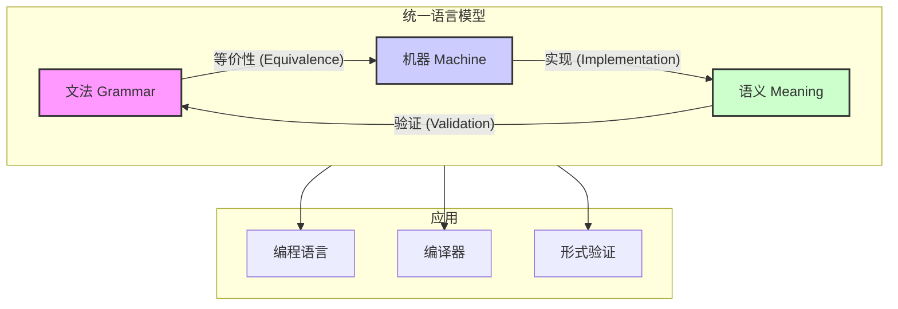

# 形式语言理论统一总论

 (v2.0)

## 目录

- [形式语言理论统一总论](#形式语言理论统一总论)
  - [目录](#目录)
  - [1. 理论概述](#1-理论概述)
    - [1.1 形式语言理论定位](#11-形式语言理论定位)
    - [1.2 形式语言的统一定义](#12-形式语言的统一定义)
    - [1.3 形式语言的核心问题](#13-形式语言的核心问题)
    - [1.4 理论特色](#14-理论特色)
    - [1.5 理论目标](#15-理论目标)
  - [2. 统一语言模型 (Unified Language Model - ULM)](#2-统一语言模型-unified-language-model---ulm)
    - [2.1 ULM 架构](#21-ulm-架构)
    - [2.2 理论核心：三位一体](#22-理论核心三位一体)
    - [2.3 理论关联关系 (形式化)](#23-理论关联关系-形式化)
    - [2.4 语言层次结构](#24-语言层次结构)
  - [3. 核心概念体系](#3-核心概念体系)
    - [3.1 自动机理论](#31-自动机理论)
      - [3.1.1 有限自动机](#311-有限自动机)
      - [3.1.2 下推自动机](#312-下推自动机)
      - [3.1.3 图灵机](#313-图灵机)
    - [3.2 文法理论](#32-文法理论)
      - [3.2.1 上下文无关文法](#321-上下文无关文法)
  - [4. 形式化表示](#4-形式化表示)
    - [4.1 语言的形式化定义](#41-语言的形式化定义)
    - [4.2 自动机的形式化定义](#42-自动机的形式化定义)
    - [4.3 核心理论等价性](#43-核心理论等价性)
  - [5. 理论基础](#5-理论基础)
    - [5.1 数学基础](#51-数学基础)
    - [5.2 计算基础](#52-计算基础)
    - [5.3 语义理论基础](#53-语义理论基础)
      - [5.3.1 操作语义](#531-操作语义)
      - [5.3.2 指称语义](#532-指称语义)
  - [6. 应用领域](#6-应用领域)
    - [6.1 编程语言](#61-编程语言)
    - [6.2 软件工程](#62-软件工程)
    - [6.3 人工智能](#63-人工智能)
    - [6.4 跨学科整合](#64-跨学科整合)
      - [6.4.1 与哲学理论的整合](#641-与哲学理论的整合)
      - [6.4.2 与数学理论的整合](#642-与数学理论的整合)
      - [6.4.3 与软件架构理论的整合](#643-与软件架构理论的整合)
  - [7. 发展趋势](#7-发展趋势)
    - [7.1 理论发展趋势](#71-理论发展趋势)
    - [7.2 应用发展趋势](#72-应用发展趋势)
    - [7.3 技术发展趋势](#73-技术发展趋势)
  - [8. 理论目标与规划](#8-理论目标与规划)
    - [8.1 理论目标](#81-理论目标)
    - [8.2 应用目标](#82-应用目标)
    - [8.3 理论体系规划](#83-理论体系规划)
    - [8.4 实施计划](#84-实施计划)
  - [9. 总结](#9-总结)

## 1. 理论概述

### 1.1 形式语言理论定位

形式语言理论是形式化架构理论的核心支柱之一，为整个理论体系提供统一的语言、计算与语义模型。它不仅是编程语言、编译器和形式验证的基石，也是连接不同形式化理论（如USTS、UMS）的桥梁。

### 1.2 形式语言的统一定义

一个形式语言是一个**八元组**：

$$ \mathcal{L} = \langle \Sigma, S, C, P, \mathcal{A}, \mathcal{M}, \mathcal{T}, \Phi \rangle $$

其中：

- $ \Sigma $: **字母表 (Alphabet)** - 有限的符号集合。
- $ S $: **符号类别 (Symbol Kinds)** - 对符号的分类，如 `Terminal`, `NonTerminal`。
- $ C $: **约束 (Constraints)** - 作用于语言字符串的规则，如上下文敏感性。
- $ P $: **产生式规则 (Productions)** - 从非终结符生成字符串的规则集合，即文法。
- $ \mathcal{A} $: **抽象机模型 (Abstract Machine)** - 识别或接受该语言的计算模型（如DFA, PDA, TM）。
- $ \mathcal{M} $: **语义函数 (Meaning Function)** - 将语法结构映射到其数学或计算含义的函数。
- $ \mathcal{T} $: **类型系统 (Type System)** - 为语言结构赋予类型的规则，确保类型安全。
- $ \Phi $: **属性 (Properties)** - 语言的元属性，如闭包性质、可判定性问题等。

### 1.3 形式语言的核心问题

1. **识别问题 (Recognition)**: 给定一个字符串，它是否属于该语言？(由 $ \mathcal{A} $ 回答)
2. **生成问题 (Generation)**: 如何生成所有属于该语言的字符串？(由 $ P $ 回答)
3. **解释问题 (Interpretation)**: 一个合法的字符串意味着什么？(由 $ \mathcal{M} $ 回答)
4. **验证问题 (Verification)**: 语言的某个属性（如类型安全）是否成立？(由 $ \mathcal{T} $ 和 $ \Phi $ 回答)
5. **等价性问题 (Equivalence)**: 两种不同的语言定义（如文法和自动机）是否描述的是同一种语言？

### 1.4 理论特色

1. **模型驱动 (Model-Driven)**: 以统一语言模型 (ULM) 为核心，整合不同理论分支。
2. **高度形式化**: 使用严格的数学符号和公理化方法定义概念及其关系。
3. **强关联性**: 明确形式化语言、自动机和语义之间的等价和转换关系。
4. **跨学科整合**: 与软件架构理论 (UMS, USTS)、类型理论和控制论深度融合。
5. **可计算性导向**: 强调语言的可计算性质、复杂性和算法实现。

### 1.5 理论目标

- 建立一个统一且内聚的形式语言理论框架 (ULM)。
- 形式化描述不同语言类别之间的转换与等价关系。
- 为 UMS 的接口定义和 USTS 的状态转换提供语言基础。
- 探索形式语言在AI、DSL和协议设计中的高级应用。

## 2. 统一语言模型 (Unified Language Model - ULM)

### 2.1 ULM 架构

ULM 将形式语言的三个核心方面——**文法 (Grammar)**、**机器 (Machine)** 和 **语义 (Meaning)**——整合为一个相互关联的整体。



### 2.2 理论核心：三位一体

- **文法 (Grammar)**: *描述性*的视角，定义了语言的**结构**。它回答了"一个有效的句子是什么样的？"。核心是产生式规则。
- **机器 (Machine)**: *识别性*的视角，定义了语言的**计算**。它回答了"如何判断一个句子是否有效？"。核心是状态和转换。
- **语义 (Meaning)**: *解释性*的视角，定义了语言的**含义**。它回答了"一个有效的句子代表什么？"。核心是映射和解释。

这三者在乔姆斯基谱系的不同层级上存在严格的等价关系，这是形式语言理论统一性的基石。

### 2.3 理论关联关系 (形式化)

我们使用 $ \Leftrightarrow $ 表示理论间的等价关系。

| 语言类别 | 文法 (Grammar) | 机器 (Machine) |
| :--- | :--- | :--- |
| **类型-3** | 正则文法 (RG) | 有限自动机 (FA) |
| **类型-2** | 上下文无关文法 (CFG) | 下推自动机 (PDA) |
| **类型-1** | 上下文相关文法 (CSG) | 线性有界自动机 (LBA) |
| **类型-0** | 无限制文法 (UG) | 图灵机 (TM) |

$$ \text{RG} \Leftrightarrow \text{FA} $$
$$ \text{CFG} \Leftrightarrow \text{PDA} $$

这些等价关系是可证明的，构成了编译器设计和语言识别算法的基础。

### 2.4 语言层次结构

| 层次 | 语言类 | 文法类型 | 自动机 | 主要应用 |
|------|--------|----------|--------|----------|
| **0型** | 递归可枚举语言 | 无限制文法 | 图灵机 | 计算理论 |
| **1型** | 上下文有关语言 | 上下文有关文法 | 线性有界自动机 | 语言学分析 |
| **2型** | 上下文无关语言 | 上下文无关文法 | 下推自动机 | 编程语言语法、解析器 |
| **3型** | 正则语言 | 正则文法 | 有限自动机 | 词法分析、正则表达式 |

## 3. 核心概念体系

### 3.1 自动机理论

#### 3.1.1 有限自动机

```rust
// 确定性有限自动机
struct DFA {
    states: Vec<State>,
    alphabet: Vec<Symbol>,
    transition_function: TransitionFunction,
    initial_state: State,
    accepting_states: Vec<State>
}

// 转移函数
struct TransitionFunction {
    transitions: HashMap<(State, Symbol), State>
}

impl DFA {
    fn new(states: Vec<State>, alphabet: Vec<Symbol>, 
           transitions: Vec<((State, Symbol), State)>,
           initial: State, accepting: Vec<State>) -> Self {
        let mut tf = TransitionFunction {
            transitions: HashMap::new()
        };
        for ((s, a), t) in transitions {
            tf.transitions.insert((s, a), t);
        }
        DFA {
            states,
            alphabet,
            transition_function: tf,
            initial_state: initial,
            accepting_states: accepting
        }
    }
    
    fn accept(&self, input: &str) -> bool {
        let mut current_state = self.initial_state;
        for symbol in input.chars() {
            if let Some(next_state) = self.transition_function
                .transitions.get(&(current_state, symbol)) {
                current_state = *next_state;
            } else {
                return false;
            }
        }
        self.accepting_states.contains(&current_state)
    }
}

// 非确定性有限自动机
struct NFA {
    states: Vec<State>,
    alphabet: Vec<Symbol>,
    transition_function: NFATransitionFunction,
    initial_state: State,
    accepting_states: Vec<State>
}

// NFA转移函数
struct NFATransitionFunction {
    transitions: HashMap<(State, Symbol), Vec<State>>
}

impl NFA {
    fn accept(&self, input: &str) -> bool {
        let mut current_states = vec![self.initial_state];
        
        for symbol in input.chars() {
            let mut next_states = Vec::new();
            for state in &current_states {
                if let Some(states) = self.transition_function
                    .transitions.get(&(*state, symbol)) {
                    next_states.extend(states);
                }
            }
            current_states = next_states;
            if current_states.is_empty() {
                return false;
            }
        }
        
        current_states.iter().any(|s| self.accepting_states.contains(s))
    }
}
```

#### 3.1.2 下推自动机

```rust
// 下推自动机
struct PDA {
    states: Vec<State>,
    input_alphabet: Vec<Symbol>,
    stack_alphabet: Vec<Symbol>,
    transition_function: PDATransitionFunction,
    initial_state: State,
    initial_stack_symbol: Symbol,
    accepting_states: Vec<State>
}

// PDA转移函数
struct PDATransitionFunction {
    transitions: HashMap<(State, Symbol, Symbol), Vec<(State, Vec<Symbol>)>>
}

// PDA配置
struct PDAConfiguration {
    state: State,
    input: Vec<Symbol>,
    stack: Vec<Symbol>
}

impl PDA {
    fn accept(&self, input: &str) -> bool {
        let mut config = PDAConfiguration {
            state: self.initial_state,
            input: input.chars().collect(),
            stack: vec![self.initial_stack_symbol]
        };
        
        while !config.input.is_empty() || !config.stack.is_empty() {
            let current_symbol = config.input.first().cloned();
            let stack_top = config.stack.last().cloned();
            
            if let (Some(symbol), Some(stack_symbol)) = (current_symbol, stack_top) {
                if let Some(transitions) = self.transition_function
                    .transitions.get(&(config.state, symbol, stack_symbol)) {
                    // 应用转移规则
                    if let Some((new_state, new_stack_symbols)) = transitions.first() {
                        config.state = *new_state;
                        config.input.remove(0);
                        config.stack.pop();
                        for symbol in new_stack_symbols.iter().rev() {
                            config.stack.push(*symbol);
                        }
                        continue;
                    }
                }
            }
            
            // 如果没有匹配的转移规则，拒绝输入
            return false;
        }
        
        self.accepting_states.contains(&config.state)
    }
}
```

#### 3.1.3 图灵机

```rust
// 图灵机
struct TuringMachine {
    states: Vec<State>,
    alphabet: Vec<Symbol>,
    tape_alphabet: Vec<Symbol>,
    transition_function: TMTransitionFunction,
    initial_state: State,
    blank_symbol: Symbol,
    accepting_states: Vec<State>,
    rejecting_states: Vec<State>
}

// 图灵机转移函数
struct TMTransitionFunction {
    transitions: HashMap<(State, Symbol), (State, Symbol, Direction)>
}

#[derive(Debug, Clone)]
enum Direction {
    Left,
    Right,
    Stay
}

// 图灵机配置
struct TMConfiguration {
    state: State,
    tape: Vec<Symbol>,
    head_position: usize
}

impl TuringMachine {
    fn accept(&self, input: &str) -> bool {
        let mut config = TMConfiguration {
            state: self.initial_state,
            tape: input.chars().map(|c| c as Symbol).collect(),
            head_position: 0
        };
        
        // 确保磁带足够长
        while config.head_position >= config.tape.len() {
            config.tape.push(self.blank_symbol);
        }
        
        loop {
            let current_symbol = config.tape[config.head_position];
            
            if let Some((new_state, new_symbol, direction)) = 
                self.transition_function.transitions.get(&(config.state, current_symbol)) {
                
                // 更新状态和磁带
                config.state = *new_state;
                config.tape[config.head_position] = *new_symbol;
                
                // 移动读写头
                match direction {
                    Direction::Left => {
                        if config.head_position == 0 {
                            config.tape.insert(0, self.blank_symbol);
                        } else {
                            config.head_position -= 1;
                        }
                    },
                    Direction::Right => {
                        config.head_position += 1;
                        if config.head_position >= config.tape.len() {
                            config.tape.push(self.blank_symbol);
                        }
                    },
                    Direction::Stay => {}
                }
            } else {
                // 没有转移规则，停机
                break;
            }
        }
        
        self.accepting_states.contains(&config.state)
    }
}
```

### 3.2 文法理论

#### 3.2.1 上下文无关文法

```rust
// 上下文无关文法
struct CFG {
    variables: Vec<Variable>,
    terminals: Vec<Terminal>,
    productions: Vec<Production>,
    start_symbol: Variable
}

// 产生式
struct Production {
    left_hand_side: Variable,
    right_hand_side: Vec<Symbol>
}

#[derive(Debug, Clone)]
enum Symbol {
    Variable(Variable),
    Terminal(Terminal)
}

impl CFG {
    fn derive(&self, input: &str) -> bool {
        let mut current_string = vec![Symbol::Variable(self.start_symbol)];
        
        while !current_string.is_empty() {
            // 查找可以应用的产生式
            let mut applied = false;
            for (i, symbol) in current_string.iter().enumerate() {
                if let Symbol::Variable(var) = symbol {
                    for production in &self.productions {
                        if production.left_hand_side == *var {
                            // 应用产生式
                            let mut new_string = current_string[..i].to_vec();
                            new_string.extend(production.right_hand_side.clone());
                            new_string.extend(current_string[i+1..].to_vec());
                            current_string = new_string;
                            applied = true;
                            break;
                        }
                    }
                    if applied {
                        break;
                    }
                }
            }
            
            if !applied {
                // 检查是否生成了目标字符串
                let result: String = current_string.iter()
                    .filter_map(|s| {
                        if let Symbol::Terminal(t) = s {
                            Some(t.to_string())
                        } else {
                            None
                        }
                    })
                    .collect();
                return result == input;
            }
        }
        
        false
    }
}

**与代数数据类型 (ADT) 的关系**:

上下文无关文法 (CFG) 与编程语言中的代数数据类型 (ADT) 存在着深刻的同构关系。

- **文法的非终结符** 对应 **ADT 的类型名** (如 `Expression`)。
- **`|` (或) 规则** 对应 **`enum` (和类型)**。
- **产生式右侧的序列** 对应 **`struct` (积类型)**。

这种关系使得我们可以直接将语言的文法映射为程序中的数据类型，这是现代编译器和解释器（尤其是函数式语言中）构造的基础。

*示例: 一个表达式文法的 ADT 表示*

文法:

```text

Expr ::= Term + Expr | Term
Term ::= Factor * Term | Factor
Factor ::= ( Expr ) | number

```

对应的 Rust ADT:

```rust
// 等价于文法的 ADT 定义
#[derive(Debug, Clone)]
pub enum Expression {
    Add(Box<Term>, Box<Expression>),
    Term(Box<Term>),
}

#[derive(Debug, Clone)]
pub enum Term {
    Multiply(Box<Factor>, Box<Term>),
    Factor(Box<Factor>),
}

#[derive(Debug, Clone)]
pub enum Factor {
    Paren(Box<Expression>),
    Number(i32),
}

// 基于这个ADT，可以构建一个递归下降解析器来解析表达式。
```

## 4. 形式化表示

### 4.1 语言的形式化定义

**字母表**：$\Sigma$ 是一个有限的符号集合

**字符串**：$\Sigma^*$ 表示字母表 $\Sigma$ 上所有字符串的集合

**语言**：$L \subseteq \Sigma^*$ 是字母表 $\Sigma$ 上字符串的集合

**文法**：$G = (V, \Sigma, P, S)$ 其中：

- $V$ 是非终结符集合
- $\Sigma$ 是终结符集合
- $P$ 是产生式规则集合
- $S$ 是开始符号

### 4.2 自动机的形式化定义

**有限自动机**：$M = (Q, \Sigma, \delta, q_0, F)$ 其中：

- $Q$ 是状态集合
- $\Sigma$ 是输入字母表
- $\delta: Q \times \Sigma \rightarrow Q$ 是转移函数
- $q_0 \in Q$ 是初始状态
- $F \subseteq Q$ 是接受状态集合

**下推自动机**：$P = (Q, \Sigma, \Gamma, \delta, q_0, Z_0, F)$ 其中：

- $Q$ 是状态集合
- $\Sigma$ 是输入字母表
- $\Gamma$ 是栈字母表
- $\delta: Q \times \Sigma \times \Gamma \rightarrow 2^{Q \times \Gamma^*}$ 是转移函数
- $q_0 \in Q$ 是初始状态
- $Z_0 \in \Gamma$ 是初始栈符号
- $F \subseteq Q$ 是接受状态集合

**图灵机**：$T = (Q, \Sigma, \Gamma, \delta, q_0, B, F)$ 其中：

- $Q$ 是状态集合
- $\Sigma$ 是输入字母表
- $\Gamma$ 是磁带字母表
- $\delta: Q \times \Gamma \rightarrow Q \times \Gamma \times \{L, R, S\}$ 是转移函数
- $q_0 \in Q$ 是初始状态
- $B \in \Gamma$ 是空白符号
- $F \subseteq Q$ 是接受状态集合

### 4.3 核心理论等价性

形式语言理论的强大之处在于其不同分支（如文法和自动机）之间的形式等价性。这允许我们从不同视角描述和处理同一种语言。

**定理 4.3.1：正则语言的等价性**
一个语言是正则的，当且仅当它能被一个确定性有限自动机（DFA）接受。
$$ L \text{ is Regular} \iff \exists \text{ DFA } M, L = L(M) $$

这一定理可以进一步分解为：

1. **正则文法 $ \Leftrightarrow $ 非确定性有限自动机 (NFA)**
2. **非确定性有限自动机 (NFA) $ \Leftrightarrow $ 确定性有限自动机 (DFA)**
3. **确定性有限自动机 (DFA) $ \Leftrightarrow $ 正则表达式 (Regex)**

**证明概要 (正则文法 $ \Rightarrow $ NFA):**

给定一个正则文法 $ G = (V, \Sigma, P, S) $，我们可以构造一个等价的 NFA $ N = (Q, \Sigma, \delta, q_0, F) $。

1. **状态集 (Q)**: 为 G 中的每个非终结符 $ A \in V $ 创建一个状态 $ q_A $。额外创建一个最终状态 $ q_f $。所以 $ Q = \{q_A | A \in V\} \cup \{q_f\} $。
2. **初始状态 ($q_0$)**: 对应文法的开始符号 $ S $，即 $ q_0 = q_S $。
3. **最终状态集 (F)**: $ F = \{q_f\} $。
4. **转移函数 ($\delta$)**:
    - 对于形如 $ A \rightarrow aB $ 的产生式，添加一条从 $ q_A $ 到 $ q_B $ 的标记为 $ a $ 的转换：$ \delta(q_A, a) \ni q_B $。
    - 对于形如 $ A \rightarrow a $ 的产生式，添加一条从 $ q_A $ 到最终状态 $ q_f $ 的标记为 $ a $ 的转换：$ \delta(q_A, a) \ni q_f $。
    - 对于形如 $ A \rightarrow \epsilon $ 的产生式（如果允许），则将 $q_A$ 加入最终状态集。

通过这种构造方法，可以证明由文法 G 生成的任何字符串都将被 NFA N 接受，反之亦然。

## 5. 理论基础

### 5.1 数学基础

形式语言理论建立在以下数学基础之上：

1. **集合论**：字母表、语言、关系
2. **代数**：半群、幺半群、自由代数
3. **逻辑**：谓词逻辑、模态逻辑、时序逻辑
4. **范畴论**：函子、自然变换、伴随

### 5.2 计算基础

形式语言理论的计算基础包括：

1. **递归函数**：原始递归、一般递归
2. **λ演算**：α等价、β归约、η等价
3. **组合逻辑**：SKI组合子、组合子归约
4. **图灵机**：确定性、非确定性、通用性

### 5.3 语义理论基础

#### 5.3.1 操作语义

```rust
// 操作语义示例
pub struct OperationalSemantics {
    rules: Vec<InferenceRule>
}

pub struct InferenceRule {
    premises: Vec<Judgment>,
    conclusion: Judgment
}

pub struct Judgment {
    environment: Environment,
    expression: Expression,
    value: Value
}

impl OperationalSemantics {
    fn evaluate(&self, expression: &Expression, env: &Environment) -> Result<Value, String> {
        // 应用操作语义规则
        for rule in &self.rules {
            if self.matches_premises(rule, expression, env) {
                return self.apply_conclusion(rule, expression, env);
            }
        }
        Err("No applicable rule".to_string())
    }
}
```

#### 5.3.2 指称语义

```rust
// 指称语义示例
pub struct DenotationalSemantics {
    domains: HashMap<Type, Domain>
}

pub trait Domain {
    fn bottom(&self) -> Self;
    fn join(&self, other: &Self) -> Self;
    fn meet(&self, other: &Self) -> Self;
}

impl DenotationalSemantics {
    fn meaning(&self, expression: &Expression) -> Value {
        match expression {
            Expression::Literal(value) => value.clone(),
            Expression::Variable(name) => self.lookup_variable(name),
            Expression::BinaryOp(left, op, right) => {
                let left_val = self.meaning(left);
                let right_val = self.meaning(right);
                self.apply_operator(&left_val, op, &right_val)
            },
            Expression::FunctionCall(name, args) => {
                let func = self.lookup_function(name);
                let arg_values: Vec<Value> = args.iter()
                    .map(|arg| self.meaning(arg))
                    .collect();
                self.apply_function(&func, &arg_values)
            }
        }
    }
}
```

## 6. 应用领域

### 6.1 编程语言

1. **语言设计**：语法设计、语义定义
2. **编译器构造**：词法分析、语法分析、代码生成
3. **类型系统**：类型检查、类型推导、类型安全
4. **程序验证**：形式验证、模型检查、定理证明

### 6.2 软件工程

1. **需求工程**：形式化需求、需求验证
2. **系统设计**：形式化设计、设计验证
3. **测试理论**：形式化测试、测试生成
4. **质量保证**：形式化质量、质量度量

### 6.3 人工智能

1. **自然语言处理**：语法分析、语义理解
2. **知识表示**：逻辑表示、规则系统
3. **机器学习**：形式化学习、学习理论
4. **专家系统**：知识工程、推理系统

### 6.4 跨学科整合

#### 6.4.1 与哲学理论的整合

- **本体论**：语言实体的存在性分析
- **认识论**：语言知识的获取和验证
- **逻辑学**：形式逻辑的语言基础

#### 6.4.2 与数学理论的整合

- **集合论**：语言集合的数学结构
- **代数**：语言代数的抽象结构（半环、克林代数）
- **拓扑学**：语言空间的拓扑性质

#### 6.4.3 与软件架构理论的整合

形式语言理论为 `UMS` (统一模块化系统) 和 `USTS` (统一状态转换系统) 提供了精确的定义和验证工具。

1. **为 UMS 定义接口文法**:
    `UMS` 的核心是组件及其接口。我们可以使用**上下文无关文法 (CFG)** 来形式化定义一个组件的API。
    - **终结符 ($\Sigma$)**: API的关键字、操作名、参数类型（如 `GET`, `POST`, `User`, `int`）。
    - **非终结符 (V)**: 语法类别（如 `Request`, `Response`, `Method`）。
    - **产生式 (P)**: 定义API调用的有效结构。
    *示例：一个简单的RESTful API文法*

    ```text
    Request  -> Method Path HTTPVersion
    Method   -> "GET" | "POST"
    Path     -> "/users/" UserID
    UserID   -> /[a-zA-Z0-9]+/
    ```

    这种方法使得API的语法结构可以被静态分析和验证，确保了组件间交互的正确性。

2. **将 USTS 的转换序列建模为正则语言**:
    `USTS` 描述了系统状态如何随事件迁移。我们可以将状态转换序列视为一个形式语言。
    - **字母表 ($\Sigma$)**: 系统中的所有事件 (Events)。
    - **语言 (L)**: 所有从初始状态出发的、合法的事件序列。
    通常，这个语言是**正则的**，因此可以被一个**有限自动机 (FA)** 所识别。这个FA在概念上与 `USTS` 本身是等价的。
    - **FA的状态**: 对应 `USTS` 的状态。
    - **FA的转换**: 对应 `USTS` 的状态迁移。
    通过这种方式，我们可以使用成熟的自动机理论（如模型检测）来分析 `USTS` 的属性，例如可达性（是否存在一条路径到达某个状态）和安全性（系统是否永远不会进入某个非法状态）。

## 7. 发展趋势

### 7.1 理论发展趋势

1. **高阶理论**：高阶类型、高阶逻辑
2. **依赖理论**：依赖类型、依赖逻辑
3. **并发理论**：进程代数、时序逻辑
4. **概率理论**：概率语言、随机语义

### 7.2 应用发展趋势

1. **领域特定语言**：DSL设计、DSL工程
2. **形式化方法**：形式化开发、形式化验证
3. **软件安全**：安全语言、安全验证
4. **量子计算**：量子语言、量子语义

### 7.3 技术发展趋势

1. **智能化语言处理**：基于机器学习的语言分析
2. **可视化语言设计**：图形化语言设计工具
3. **分布式语言**：支持分布式计算的语言特性
4. **实时语言**：支持实时系统的语言特性

## 8. 理论目标与规划

### 8.1 理论目标

1. **完整性**：覆盖形式语言理论的所有核心内容
2. **系统性**：建立统一的理论框架
3. **严谨性**：采用严格的形式化方法
4. **实用性**：注重理论的实际应用

### 8.2 应用目标

1. **语言设计**：为编程语言设计提供理论基础
2. **工具开发**：为开发工具提供理论指导
3. **系统验证**：为系统验证提供理论方法
4. **教育研究**：为教育和研究提供理论资源

### 8.3 理论体系规划

1. **基础理论**：自动机理论、形式语法
2. **核心理论**：语义理论、类型理论
3. **高级理论**：计算理论、语言设计
4. **应用理论**：实际应用、案例分析

### 8.4 实施计划

1. **第一阶段**：完成基础理论文档
2. **第二阶段**：完成核心理论文档
3. **第三阶段**：完成高级理论文档
4. **第四阶段**：完成应用理论文档

## 9. 总结

形式语言理论体系为形式化架构理论体系提供了语言基础，通过自动机理论、形式语法、语义理论、类型理论、计算理论、语言设计的系统整合，为软件系统的编程语言、编译器、形式验证等提供了重要的理论指导。

通过严格的形式化方法和跨学科整合，形式语言理论体系为整个形式化架构理论体系奠定了坚实的理论基础。该理论体系将继续演进，融入新的技术发展和应用需求，为形式化架构理论的发展提供持续的理论支撑。

---

**相关链接**：

- [01-自动机理论](01-自动机理论.md)
- [02-形式语法](02-形式语法.md)
- [03-语义理论](03-语义理论.md)
- [04-类型理论](04-类型理论.md)
- [05-计算理论](05-计算理论.md)
- [06-语言设计](06-语言设计.md)

**参考文献**：

1. Hopcroft, J.E., Ullman, J.D. *Introduction to Automata Theory, Languages, and Computation*. Addison-Wesley, 1979.
2. Sipser, M. *Introduction to the Theory of Computation*. Cengage Learning, 2012.
3. Pierce, B.C. *Types and Programming Languages*. MIT Press, 2002.
4. Winskel, G. *The Formal Semantics of Programming Languages*. MIT Press, 1993.
5. Aho, A.V., Lam, M.S., Sethi, R., Ullman, J.D. *Compilers: Principles, Techniques, and Tools*. Pearson, 2006.
