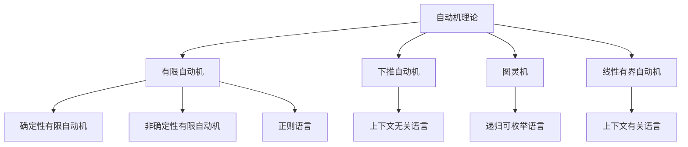

# 03-形式语言理论体系-自动机理论

[返回主题树](../00-主题树与内容索引.md) | [主计划文档](../00-形式化架构理论统一计划.md) | [相关计划](../递归合并计划.md) | [返回上级](../README.md)

> 本文档为形式语言理论体系分支自动机理论，所有最新进展与结论以主计划文档为准，历史细节归档于archive/。

## 目录

- [03-形式语言理论体系-自动机理论](#03-形式语言理论体系-自动机理论)
  - [目录](#目录)
  - [1. 概述](#1-概述)
    - [1.1 自动机理论概述](#11-自动机理论概述)
    - [1.2 核心目标](#12-核心目标)
    - [1.3 自动机层次结构](#13-自动机层次结构)
  - [2. 主要文件与内容索引](#2-主要文件与内容索引)
    - [2.1 核心文件](#21-核心文件)
    - [2.2 相关文件](#22-相关文件)
  - [3. 自动机的基本定义与解释](#3-自动机的基本定义与解释)
    - [3.1 自动机的定义](#31-自动机的定义)
      - [3.1.1 计算模型](#311-计算模型)
      - [3.1.2 语言识别](#312-语言识别)
      - [3.1.3 状态转换](#313-状态转换)
  - [4. 自动机的基础概念](#4-自动机的基础概念)
    - [4.1 有限自动机](#41-有限自动机)
      - [4.1.1 确定性有限自动机](#411-确定性有限自动机)
      - [4.1.2 非确定性有限自动机](#412-非确定性有限自动机)
      - [4.1.3 正则语言](#413-正则语言)
  - [5. 自动机的主要理论](#5-自动机的主要理论)
    - [5.1 下推自动机](#51-下推自动机)
    - [5.2 图灵机](#52-图灵机)
    - [5.3 可计算性理论](#53-可计算性理论)
    - [5.4 自动机等价性](#54-自动机等价性)
  - [6. 自动机的行业应用](#6-自动机的行业应用)
    - [6.1 编译器设计](#61-编译器设计)
    - [6.2 正则表达式引擎](#62-正则表达式引擎)
    - [6.3 状态机设计](#63-状态机设计)
  - [7. 发展历史](#7-发展历史)
  - [8. 应用领域](#8-应用领域)
  - [9. 总结](#9-总结)
  - [10. 相关性跳转与引用](#10-相关性跳转与引用)

## 1. 概述

### 1.1 自动机理论概述

自动机理论是研究计算模型和语言识别的理论分支，为形式化架构理论提供了重要的计算理论基础。自动机理论不仅支撑语言处理，也是编译器设计、状态机设计等领域的重要理论基础。

### 1.2 核心目标

- 建立计算模型的基本理论框架
- 提供语言识别的方法论工具
- 支持编译器设计和状态机设计应用

### 1.3 自动机层次结构



## 2. 主要文件与内容索引

### 2.1 核心文件

- [自动机理论.md](../Matter/FormalLanguage/Automata_Theory.md)
- [形式语言理论统一总论.md](00-形式语言理论统一总论.md)

### 2.2 相关文件

- [02-语法理论.md](02-语法理论.md)
- [03-语义理论.md](03-语义理论.md)
- [04-类型理论.md](04-类型理论.md)

## 3. 自动机的基本定义与解释

### 3.1 自动机的定义

**定义 3.1.1** 自动机（Automaton）
自动机是研究计算模型和语言识别的理论分支。

**形式化定义**：
$$\mathcal{AT} = \langle \mathcal{FA}, \mathcal{PA}, \mathcal{TM}, \mathcal{EA} \rangle$$

其中：

- $\mathcal{FA}$ 表示有限自动机集合 (Finite Automata)
- $\mathcal{PA}$ 表示下推自动机集合 (Pushdown Automata)
- $\mathcal{TM}$ 表示图灵机集合 (Turing Machines)
- $\mathcal{EA}$ 表示自动机等价性集合 (Automata Equivalence)

#### 3.1.1 计算模型

**定义 3.1.2** 计算模型（Computational Model）
计算模型是描述计算过程的抽象机器。

**特点**：

- 状态转换
- 输入输出
- 计算能力

#### 3.1.2 语言识别

**定义 3.1.3** 语言识别（Language Recognition）
语言识别是判断字符串是否属于特定语言的过程。

**方法**：

- 状态机方法
- 语法分析方法
- 语义分析方法

#### 3.1.3 状态转换

**定义 3.1.4** 状态转换（State Transition）
状态转换是自动机从一个状态到另一个状态的转换过程。

**要素**：

- 当前状态
- 输入符号
- 下一状态

## 4. 自动机的基础概念

### 4.1 有限自动机

#### 4.1.1 确定性有限自动机

**定义 4.1.1** 确定性有限自动机（Deterministic Finite Automaton）
确定性有限自动机是五元组 $(Q, \Sigma, \delta, q_0, F)$。

**形式化表示**：
$$\text{DFA} = \langle Q, \Sigma, \delta, q_0, F \rangle$$

其中：

- $Q$ 是有限状态集
- $\Sigma$ 是输入字母表
- $\delta: Q \times \Sigma \to Q$ 是转移函数
- $q_0 \in Q$ 是初始状态
- $F \subseteq Q$ 是接受状态集

**Rust实现**：

```rust
#[derive(Debug, Clone, PartialEq, Eq, Hash)]
struct State {
    id: String,
    is_accepting: bool
}

#[derive(Debug, Clone)]
struct DFA {
    states: Vec<State>,
    alphabet: Vec<char>,
    transitions: std::collections::HashMap<(State, char), State>,
    initial_state: State,
    accepting_states: Vec<State>
}

impl DFA {
    fn new(
        states: Vec<State>,
        alphabet: Vec<char>,
        initial_state: State
    ) -> Self {
        DFA {
            states,
            alphabet,
            transitions: std::collections::HashMap::new(),
            initial_state,
            accepting_states: Vec::new()
        }
    }
    
    fn add_transition(&mut self, from: State, symbol: char, to: State) {
        self.transitions.insert((from, symbol), to);
    }
    
    fn add_accepting_state(&mut self, state: State) {
        if !self.accepting_states.contains(&state) {
            self.accepting_states.push(state);
        }
    }
    
    fn process_string(&self, input: &str) -> bool {
        let mut current_state = &self.initial_state;
        
        for symbol in input.chars() {
            if let Some(next_state) = self.transitions.get(&(current_state.clone(), symbol)) {
                current_state = next_state;
            } else {
                return false; // 无转移
            }
        }
        
        self.accepting_states.contains(current_state)
    }
    
    fn is_deterministic(&self) -> bool {
        // 检查确定性：每个状态-符号对最多有一个转移
        for state in &self.states {
            for symbol in &self.alphabet {
                let mut count = 0;
                for ((from, sym), _) in &self.transitions {
                    if from == state && sym == symbol {
                        count += 1;
                    }
                }
                if count > 1 {
                    return false;
                }
            }
        }
        true
    }
}
```

#### 4.1.2 非确定性有限自动机

**定义 4.1.2** 非确定性有限自动机（Non-deterministic Finite Automaton）
非确定性有限自动机允许多个转移。

**形式化表示**：
$$\text{NFA} = \langle Q, \Sigma, \delta, q_0, F \rangle$$

其中 $\delta: Q \times \Sigma \to 2^Q$ 是转移函数。

**Rust实现**：

```rust
#[derive(Debug, Clone)]
struct NFA {
    states: Vec<State>,
    alphabet: Vec<char>,
    transitions: std::collections::HashMap<(State, char), Vec<State>>,
    initial_state: State,
    accepting_states: Vec<State>
}

impl NFA {
    fn new(
        states: Vec<State>,
        alphabet: Vec<char>,
        initial_state: State
    ) -> Self {
        NFA {
            states,
            alphabet,
            transitions: std::collections::HashMap::new(),
            initial_state,
            accepting_states: Vec::new()
        }
    }
    
    fn add_transition(&mut self, from: State, symbol: char, to: State) {
        self.transitions.entry((from, symbol))
            .or_insert_with(Vec::new)
            .push(to);
    }
    
    fn process_string(&self, input: &str) -> bool {
        let mut current_states = std::collections::HashSet::new();
        current_states.insert(&self.initial_state);
        
        for symbol in input.chars() {
            let mut next_states = std::collections::HashSet::new();
            for state in &current_states {
                if let Some(transitions) = self.transitions.get(&(state.clone(), symbol)) {
                    for next_state in transitions {
                        next_states.insert(next_state);
                    }
                }
            }
            current_states = next_states;
        }
        
        // 检查是否有接受状态
        current_states.iter().any(|state| self.accepting_states.contains(state))
    }
}
```

#### 4.1.3 正则语言

**定义 4.1.3** 正则语言（Regular Language）
正则语言是有限自动机能够识别的语言。

**性质**：

- 封闭性：并集、交集、补集、连接、星号
- 泵引理：用于证明语言非正则
- 最小化：每个正则语言有唯一的最小DFA

## 5. 自动机的主要理论

### 5.1 下推自动机

**理论 5.1.1** 下推自动机（Pushdown Automaton）
下推自动机是带有栈的有限自动机。

**形式化定义**：
$$\text{PDA} = \langle Q, \Sigma, \Gamma, \delta, q_0, Z_0, F \rangle$$

其中：

- $Q$ 是状态集
- $\Sigma$ 是输入字母表
- $\Gamma$ 是栈字母表
- $\delta$ 是转移函数
- $q_0$ 是初始状态
- $Z_0$ 是初始栈符号
- $F$ 是接受状态集

### 5.2 图灵机

**理论 5.2.1** 图灵机（Turing Machine）
图灵机是最通用的计算模型。

**形式化定义**：
$$\text{TM} = \langle Q, \Sigma, \Gamma, \delta, q_0, B, F \rangle$$

其中：

- $Q$ 是状态集
- $\Sigma$ 是输入字母表
- $\Gamma$ 是磁带字母表
- $\delta$ 是转移函数
- $q_0$ 是初始状态
- $B$ 是空白符号
- $F$ 是接受状态集

### 5.3 可计算性理论

**理论 5.3.1** 可计算性理论（Computability Theory）
可计算性理论研究哪些问题是可以计算的。

**核心概念**：

- 丘奇-图灵论题
- 不可判定问题
- 停机问题

### 5.4 自动机等价性

**理论 5.4.1** 自动机等价性（Automata Equivalence）
自动机等价性研究不同自动机模型之间的关系。

**等价关系**：

- DFA与NFA等价
- PDA与CFG等价
- TM与递归可枚举语言等价

## 6. 自动机的行业应用

### 6.1 编译器设计

- 词法分析器
- 语法分析器
- 语义分析器

### 6.2 正则表达式引擎

- 模式匹配
- 字符串处理
- 文本搜索

### 6.3 状态机设计

- 协议设计
- 工作流引擎
- 游戏状态管理

## 7. 发展历史

自动机理论的发展经历了从有限自动机到图灵机的演进过程。克莱尼、拉宾、斯科特等学者为自动机理论的发展做出了重要贡献。

## 8. 应用领域

自动机理论在编译器设计、自然语言处理、人工智能、网络安全等领域有广泛应用，是现代计算机科学的重要理论基础。

## 9. 总结

自动机理论作为计算理论的基础，为形式化架构理论提供了重要的计算模型和语言识别工具，是构建智能系统和语言处理系统不可或缺的理论基础。

## 10. 相关性跳转与引用

- [00-形式语言理论统一总论.md](00-形式语言理论统一总论.md)
- [02-语法理论.md](02-语法理论.md)
- [03-语义理论.md](03-语义理论.md)
- [04-类型理论.md](04-类型理论.md)
- [05-计算理论.md](05-计算理论.md)
