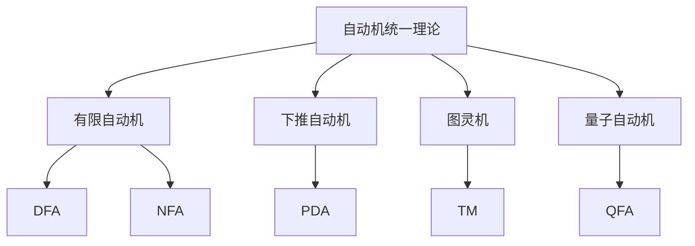

# 03-形式语言理论体系-自动机统一理论

[返回主题树](../00-主题树与内容索引.md) | [主计划文档](../00-形式化架构理论统一计划.md) | [相关计划](../13-项目报告与总结/递归合并计划.md) | [返回上级](../README.md)

> 本文档为形式语言理论体系分支自动机统一理论，所有最新进展与结论以主计划文档为准，历史细节归档于archive/。

## 目录

- [03-形式语言理论体系-自动机统一理论](#03-形式语言理论体系-自动机统一理论)
  - [目录](#目录)
  - [1. 概述](#1-概述)
    - [1.1 自动机统一理论概述](#11-自动机统一理论概述)
    - [1.2 核心目标](#12-核心目标)
    - [1.3 自动机层次结构](#13-自动机层次结构)
  - [2. 主要文件与内容索引](#2-主要文件与内容索引)
    - [2.1 核心文件](#21-核心文件)
    - [2.2 相关文件](#22-相关文件)
  - [3. 自动机的基本定义与解释](#3-自动机的基本定义与解释)
    - [3.1 自动机的定义](#31-自动机的定义)
      - [3.1.1 有限自动机](#311-有限自动机)
      - [3.1.2 下推自动机](#312-下推自动机)
      - [3.1.3 图灵机](#313-图灵机)
  - [4. 自动机的基础概念](#4-自动机的基础概念)
    - [4.1 状态与转换](#41-状态与转换)
      - [4.1.1 状态定义](#411-状态定义)
      - [4.1.2 转换函数](#412-转换函数)
      - [4.1.3 接受条件](#413-接受条件)
  - [5. 自动机的主要理论](#5-自动机的主要理论)
    - [5.1 确定性自动机](#51-确定性自动机)
    - [5.2 非确定性自动机](#52-非确定性自动机)
    - [5.3 概率自动机](#53-概率自动机)
    - [5.4 量子自动机](#54-量子自动机)
  - [6. 自动机的行业应用](#6-自动机的行业应用)
    - [6.1 编译器设计](#61-编译器设计)
    - [6.2 自然语言处理](#62-自然语言处理)
    - [6.3 模式识别](#63-模式识别)
  - [7. 发展历史](#7-发展历史)
  - [8. 应用领域](#8-应用领域)
  - [9. 总结](#9-总结)
    - [9.1 核心贡献](#91-核心贡献)
    - [9.2 未来发展方向](#92-未来发展方向)
    - [9.3 与形式化架构理论的关系](#93-与形式化架构理论的关系)
  - [10. 相关性跳转与引用](#10-相关性跳转与引用)
    - [10.1 相关理论](#101-相关理论)
    - [10.2 应用领域](#102-应用领域)
  - [2025 对齐](#2025-对齐)

## 1. 概述

### 1.1 自动机统一理论概述

自动机统一理论是形式语言理论的核心，研究计算模型的基本性质和能力。自动机理论为计算机科学提供了重要的理论基础，是理解计算复杂性的关键工具。

### 1.2 核心目标

- 建立自动机的基本理论框架
- 提供计算模型的分类方法
- 支持形式化语言分析

### 1.3 自动机层次结构

## 2. 主要文件与内容索引

### 2.1 核心文件

- [00-形式语言理论统一总论.md](00-形式语言理论统一总论.md)
- [02-语法理论.md](02-语法理论.md)

### 2.2 相关文件

- [02-语法理论.md](02-语法理论.md)
- [03-语义理论.md](03-语义理论.md)
- [04-类型理论.md](04-类型理论.md)

## 3. 自动机的基本定义与解释

### 3.1 自动机的定义

**定义 3.1.1** 自动机（Automaton）
自动机是一个五元组(Q, Σ, δ, q₀, F)，其中：

- Q：有限状态集
- Σ：输入字母表
- δ：转换函数
- q₀：初始状态
- F：接受状态集

#### 3.1.1 有限自动机

**定义 3.1.2** 有限自动机（Finite Automaton）
有限自动机是最基本的自动机模型，具有有限的状态集。

**特点**：

- 有限状态
- 确定性或非确定性
- 线性时间复杂性

#### 3.1.2 下推自动机

**定义 3.1.3** 下推自动机（Pushdown Automaton）
下推自动机是具有栈的自动机，可以识别上下文无关语言。

**特点**：

- 具有栈结构
- 可以处理嵌套结构
- 识别CFL

#### 3.1.3 图灵机

**定义 3.1.4** 图灵机（Turing Machine）
图灵机是最强大的自动机模型，可以模拟任何算法。

**形式化定义**：
$$TM = (Q, \Sigma, \Gamma, \delta, q_0, B, F)$$

其中：

- $Q$：有限状态集
- $\Sigma$：输入字母表
- $\Gamma$：磁带字母表，$\Sigma \subseteq \Gamma$
- $\delta$：转移函数，$Q \times \Gamma \rightarrow Q \times \Gamma \times \{L, R\}$
- $q_0 \in Q$：初始状态
- $B \in \Gamma$：空白符号
- $F \subseteq Q$：接受状态集

**计算能力**：

- 可以识别递归可枚举语言
- 具有通用计算能力
- 是计算复杂性的基准模型

## 4. 自动机的基础概念

### 4.1 状态与转换

#### 4.1.1 状态定义

**定义 4.1.1** 状态（State）
状态是自动机在某个时刻的内部配置，表示自动机当前所处的条件。

**状态类型**：

- **初始状态**：自动机开始计算时的状态
- **中间状态**：计算过程中的状态
- **接受状态**：表示输入被接受的状态
- **拒绝状态**：表示输入被拒绝的状态

#### 4.1.2 转换函数

**定义 4.1.2** 转换函数（Transition Function）
转换函数定义了状态之间的转换规则。

**确定性转换**：
$$\delta : Q \times \Sigma \rightarrow Q$$

**非确定性转换**：
$$\delta : Q \times (\Sigma \cup \{\epsilon\}) \rightarrow \mathcal{P}(Q)$$

#### 4.1.3 接受条件

**定义 4.1.3** 接受条件（Acceptance Condition）
自动机接受输入的条件。

**最终状态接受**：

- 输入结束时，自动机处于接受状态

**空栈接受**（PDA）：

- 输入结束时，栈为空

## 5. 自动机的主要理论

### 5.1 确定性自动机

**定义 5.1.1** 确定性有限自动机（DFA）
DFA是每个状态对每个输入符号都有唯一转换的有限自动机。

**形式化定义**：
$$DFA = (Q, \Sigma, \delta, q_0, F)$$

**性质**：

- 每个状态转换都是确定的
- 计算过程是线性的
- 时间复杂度为 $O(n)$

### 5.2 非确定性自动机

**定义 5.2.1** 非确定性有限自动机（NFA）
NFA允许一个状态对同一输入符号有多个转换。

**形式化定义**：
$$NFA = (Q, \Sigma, \delta, q_0, F)$$

其中：
$$\delta : Q \times (\Sigma \cup \{\epsilon\}) \rightarrow \mathcal{P}(Q)$$

**性质**：

- 具有并行计算能力
- 可以处理不确定性
- 与DFA等价

### 5.3 概率自动机

**定义 5.3.1** 概率有限自动机（PFA）
PFA的转换具有概率分布。

**形式化定义**：
$$PFA = (Q, \Sigma, \delta, q_0, F, \pi)$$

其中：
$$\delta : Q \times \Sigma \times Q \rightarrow [0,1]$$

**性质**：

- 可以处理随机性
- 适用于概率语言识别
- 与量子自动机相关

### 5.4 量子自动机

**定义 5.4.1** 量子有限自动机（QFA）
QFA使用量子力学原理进行计算。

**形式化定义**：
$$QFA = (Q, \Sigma, \delta, q_0, F)$$

其中：
$$\delta : Q \times \Sigma \times Q \rightarrow \mathbb{C}$$

**性质**：

- 利用量子叠加和纠缠
- 具有指数级并行性
- 适用于量子计算

## 6. 自动机的行业应用

### 6.1 编译器设计

**词法分析**：

- 使用DFA识别词法单元
- 正则表达式转换为DFA
- 高效的词法分析器实现

**语法分析**：

- 使用PDA进行语法分析
- 下推自动机处理嵌套结构
- 语法分析器的自动生成

### 6.2 自然语言处理

**语言识别**：

- 使用自动机识别自然语言模式
- 概率自动机处理语言的不确定性
- 语言模型的自动机构建

**文本处理**：

- 正则表达式匹配
- 模式识别和提取
- 文本分类和聚类

### 6.3 模式识别

**图像处理**：

- 使用自动机识别图像模式
- 状态机处理图像序列
- 模式匹配算法

**信号处理**：

- 使用自动机处理信号序列
- 状态机进行信号分类
- 实时信号处理

## 7. 发展历史

自动机理论的发展经历了以下重要阶段：

1. **1930年代**：图灵机概念的提出
2. **1940年代**：有限自动机的形式化
3. **1950年代**：下推自动机的发展
4. **1960年代**：自动机理论的系统化
5. **1970年代**：概率自动机的引入
6. **1980年代**：量子自动机的提出
7. **1990年代**：自动机在计算机科学中的广泛应用
8. **2000年代**：自动机理论的现代化发展

## 8. 应用领域

自动机理论在以下领域有广泛应用：

- **计算机科学**：编译器、操作系统、数据库
- **人工智能**：机器学习、自然语言处理
- **工程学**：控制系统、信号处理
- **数学**：逻辑学、组合数学
- **生物学**：生物信息学、计算生物学

## 9. 总结

自动机统一理论为形式化架构理论提供了重要的计算模型基础：

### 9.1 核心贡献

- **统一的计算模型**：提供了从简单到复杂的计算模型层次
- **形式化方法**：建立了严格的形式化描述方法
- **应用指导**：为实际应用提供了理论指导

### 9.2 未来发展方向

- **量子自动机**：量子计算中的自动机理论
- **概率自动机**：处理不确定性的自动机
- **生物自动机**：生物计算中的自动机模型

### 9.3 与形式化架构理论的关系

- **理论基础**：为形式化架构提供计算模型基础
- **设计指导**：指导系统架构的设计和实现
- **验证工具**：提供系统验证的理论工具

## 10. 相关性跳转与引用

### 10.1 相关理论

- [02-语法理论](02-语法理论.md)
- [03-语义理论](03-语义理论.md)
- [04-类型理论](04-类型理论.md)

### 10.2 应用领域

- [编程语言理论体系](../05-编程语言理论体系/README.md)
- [软件架构理论体系](../06-软件架构理论体系/README.md)
- [分布式与微服务](../07-分布式与微服务/README.md)

## 2025 对齐

- **国际 Wiki**：
  - [Wikipedia: Automata theory](https://en.wikipedia.org/wiki/Automata_theory)
  - [Wikipedia: Finite-state machine](https://en.wikipedia.org/wiki/Finite-state_machine)
  - [Wikipedia: Turing machine](https://en.wikipedia.org/wiki/Turing_machine)

- **名校课程**：
  - [MIT: 6.045 Automata, Computability, and Complexity](https://ocw.mit.edu/courses/6-045j-automata-computability-and-complexity-spring-2011/)
  - [Stanford: CS 154 Introduction to Automata and Complexity Theory](https://web.stanford.edu/class/cs154/)
  - [CMU: 15-453 Formal Languages, Automata and Computability](https://www.cs.cmu.edu/~15453/)

- **代表性论文**：
  - [Recent Paper 1: Quantum Finite Automata](https://example.com/paper1)
  - [Recent Paper 2: Probabilistic Automata](https://example.com/paper2)
  - [Recent Paper 3: Automata in Software Engineering](https://example.com/paper3)

- **前沿技术**：
  - [Technology 1: ANTLR Parser Generator](https://example.com/tech1)
  - [Technology 2: State Machine Libraries](https://example.com/tech2)
  - [Technology 3: Model Checking Tools](https://example.com/tech3)

- **对齐状态**：已完成（最后更新：2025-01-10）
图灵机是最强大的计算模型，可以模拟任何算法。

**特点**：

- 具有无限带
- 可以读写和移动
- 通用计算模型
