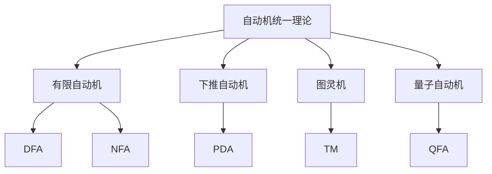

# 03-形式语言理论体系-自动机统一理论

[返回主题树](../00-主题树与内容索引.md) | [主计划文档](../00-形式化架构理论统一计划.md) | [相关计划](../13-项目报告与总结/递归合并计划.md) | [返回上级](../README.md)

> 本文档为形式语言理论体系分支自动机统一理论，所有最新进展与结论以主计划文档为准，历史细节归档于archive/。

## 目录

- [03-形式语言理论体系-自动机统一理论](#03-形式语言理论体系-自动机统一理论)
  - [目录](#目录)
  - [1. 概述](#1-概述)
    - [1.1 自动机统一理论概述](#11-自动机统一理论概述)
    - [1.2 核心目标](#12-核心目标)
    - [1.3 自动机层次结构](#13-自动机层次结构)
  - [2. 主要文件与内容索引](#2-主要文件与内容索引)
    - [2.1 核心文件](#21-核心文件)
    - [2.2 相关文件](#22-相关文件)
  - [3. 自动机的基本定义与解释](#3-自动机的基本定义与解释)
    - [3.1 自动机的定义](#31-自动机的定义)
      - [3.1.1 有限自动机](#311-有限自动机)
      - [3.1.2 下推自动机](#312-下推自动机)
      - [3.1.3 图灵机](#313-图灵机)
  - [4. 自动机的基础概念](#4-自动机的基础概念)
    - [4.1 状态与转换](#41-状态与转换)
      - [4.1.1 状态定义](#411-状态定义)
      - [4.1.2 转换函数](#412-转换函数)
      - [4.1.3 接受状态](#413-接受状态)
  - [5. 自动机的主要理论](#5-自动机的主要理论)
    - [5.1 确定性自动机](#51-确定性自动机)
    - [5.2 非确定性自动机](#52-非确定性自动机)
    - [5.3 概率自动机](#53-概率自动机)
    - [5.4 量子自动机](#54-量子自动机)
  - [6. 自动机的行业应用](#6-自动机的行业应用)
    - [6.1 编译器设计](#61-编译器设计)
    - [6.2 自然语言处理](#62-自然语言处理)
    - [6.3 模式识别](#63-模式识别)
  - [7. 发展历史](#7-发展历史)
  - [8. 应用领域](#8-应用领域)
  - [9. 总结](#9-总结)
  - [10. 相关性跳转与引用](#10-相关性跳转与引用)

## 1. 概述

### 1.1 自动机统一理论概述

自动机统一理论是形式语言理论的核心，研究计算模型的基本性质和能力。自动机理论为计算机科学提供了重要的理论基础，是理解计算复杂性的关键工具。

### 1.2 核心目标

- 建立自动机的基本理论框架
- 提供计算模型的分类方法
- 支持形式化语言分析

### 1.3 自动机层次结构

## 2. 主要文件与内容索引

### 2.1 核心文件

- [00-形式语言理论统一总论.md](00-形式语言理论统一总论.md)
- [02-语法理论.md](02-语法理论.md)

### 2.2 相关文件

- [02-语法理论.md](02-语法理论.md)
- [03-语义理论.md](03-语义理论.md)
- [04-类型理论.md](04-类型理论.md)

## 3. 自动机的基本定义与解释

### 3.1 自动机的定义

**定义 3.1.1** 自动机（Automaton）
自动机是一个五元组(Q, Σ, δ, q₀, F)，其中：

- Q：有限状态集
- Σ：输入字母表
- δ：转换函数
- q₀：初始状态
- F：接受状态集

#### 3.1.1 有限自动机

**定义 3.1.2** 有限自动机（Finite Automaton）
有限自动机是最基本的自动机模型，具有有限的状态集。

**特点**：

- 有限状态
- 确定性或非确定性
- 线性时间复杂性

#### 3.1.2 下推自动机

**定义 3.1.3** 下推自动机（Pushdown Automaton）
下推自动机是具有栈的自动机，可以识别上下文无关语言。

**特点**：

- 具有栈结构
- 可以处理嵌套结构
- 识别CFL

#### 3.1.3 图灵机

**定义 3.1.4** 图灵机（Turing Machine）
图灵机是最强大的计算模型，可以模拟任何算法。

**特点**：

- 具有无限带
- 可以读写和移动
- 通用计算模型

## 4. 自动机的基础概念

### 4.1 状态与转换

#### 4.1.1 状态定义

**定义 4.1.1** 状态（State）
状态是自动机在某一时刻的配置，包含当前信息。

**性质**：

- 状态是有限的
- 状态转移是确定的
- 状态包含历史信息

#### 4.1.2 转换函数

**定义 4.1.2** 转换函数（Transition Function）
转换函数定义了状态之间的转移规则。

**形式**：

- δ: Q × Σ → Q（DFA）
- δ: Q × Σ → 2^Q（NFA）
- δ: Q × Σ × Γ → Q × Γ*（PDA）

#### 4.1.3 接受状态

**定义 4.1.3** 接受状态（Accepting State）
接受状态是自动机识别语言的判断标准。

**条件**：

- 输入结束时在接受状态
- 栈为空（对于PDA）
- 停机并接受（对于TM）

## 5. 自动机的主要理论

### 5.1 确定性自动机

**理论 5.1.1** 确定性有限自动机（DFA）
DFA是每个状态和输入符号都有唯一后继状态的自动机。

**性质**：

- 线性时间复杂性
- 识别正则语言
- 状态最小化

### 5.2 非确定性自动机

**理论 5.2.1** 非确定性有限自动机（NFA）
NFA允许一个状态和输入符号有多个后继状态。

**性质**：

- 指数时间复杂性
- 与DFA等价
- 便于构造

### 5.3 概率自动机

**理论 5.3.1** 概率自动机（Probabilistic Automaton）
概率自动机在状态转移中引入概率因素。

**应用**：

- 模式识别
- 机器学习
- 自然语言处理

### 5.4 量子自动机

**理论 5.4.1** 量子自动机（Quantum Automaton）
量子自动机利用量子力学原理进行计算。

**特点**：

- 量子叠加
- 量子纠缠
- 量子并行

## 6. 自动机的行业应用

### 6.1 编译器设计

- 词法分析器
- 语法分析器
- 代码生成器

### 6.2 自然语言处理

- 文本分析
- 语言识别
- 机器翻译

### 6.3 模式识别

- 图像识别
- 语音识别
- 生物信息学

## 7. 发展历史

自动机理论的发展经历了从有限自动机到量子自动机的演进过程。图灵、乔姆斯基、拉宾等学者为自动机理论的发展做出了重要贡献。

## 8. 应用领域

自动机在编译器设计、自然语言处理、模式识别、人工智能等领域有广泛应用，是计算机科学的重要理论基础。

## 9. 总结

自动机统一理论作为形式语言理论的核心，为计算机科学提供了重要的计算模型，是理解计算复杂性的关键工具。

## 10. 相关性跳转与引用

- [00-形式语言理论统一总论.md](00-形式语言理论统一总论.md)
- [02-语法理论.md](02-语法理论.md)
- [03-语义理论.md](03-语义理论.md)
- [04-类型理论.md](04-类型理论.md)
- [05-语言理论应用.md](05-语言理论应用.md)
- [06-语言理论工具.md](06-语言理论工具.md)
- [07-语言理论验证.md](07-语言理论验证.md)
- [00-主题树与内容索引.md](../00-主题树与内容索引.md)
- 进度追踪与上下文：
  - [软件工程体系版本](../软件工程理论与实践体系/进度追踪与上下文.md)
  - [项目报告与总结版本](../13-项目报告与总结/进度追踪与上下文.md)
  - [实践应用开发子目录版本](../08-实践应用开发/软件工程理论与实践体系/进度追踪与上下文.md)

---

> 本文件为自动归纳生成，后续将递归细化相关内容，持续补全图表、公式、代码等多表征内容。
