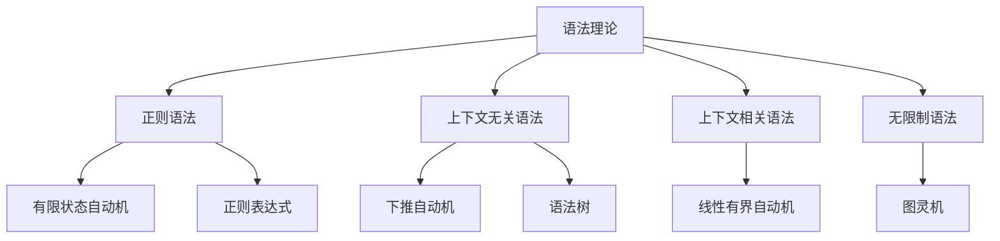

# 03-形式语言理论体系-语法理论

[返回主题树](../00-主题树与内容索引.md) | [主计划文档](../00-形式化架构理论统一计划.md) | [相关计划](../13-项目报告与总结/递归合并计划.md) | [返回上级](../README.md)

> 本文档为形式语言理论体系分支语法理论，所有最新进展与结论以主计划文档为准，历史细节归档于archive/。

## 目录

- [03-形式语言理论体系-语法理论](#03-形式语言理论体系-语法理论)
  - [目录](#目录)
  - [1. 概述](#1-概述)
    - [1.1 语法理论概述](#11-语法理论概述)
    - [1.2 核心目标](#12-核心目标)
    - [1.3 语法层次结构](#13-语法层次结构)
  - [2. 主要文件与内容索引](#2-主要文件与内容索引)
    - [2.1 核心文件](#21-核心文件)
    - [2.2 相关文件](#22-相关文件)
  - [3. 语法的基本定义与解释](#3-语法的基本定义与解释)
    - [3.1 语法的定义](#31-语法的定义)
      - [3.1.1 形式语法](#311-形式语法)
      - [3.1.2 语法规则](#312-语法规则)
      - [3.1.3 语法分析](#313-语法分析)
  - [4. 语法的基础概念](#4-语法的基础概念)
    - [4.1 上下文无关语法](#41-上下文无关语法)
      - [4.1.1 产生式规则](#411-产生式规则)
      - [4.1.2 语法树](#412-语法树)
      - [4.1.3 推导过程](#413-推导过程)
  - [5. 语法的主要理论](#5-语法的主要理论)
    - [5.1 正则语法](#51-正则语法)
    - [5.2 上下文相关语法](#52-上下文相关语法)
    - [5.3 无限制语法](#53-无限制语法)
    - [5.4 属性语法](#54-属性语法)
  - [6. 语法的行业应用](#6-语法的行业应用)
    - [6.1 编译器设计](#61-编译器设计)
    - [6.2 自然语言处理](#62-自然语言处理)
    - [6.3 编程语言设计](#63-编程语言设计)
  - [7. 发展历史](#7-发展历史)
  - [8. 应用领域](#8-应用领域)
  - [9. 总结](#9-总结)
  - [10. 相关性跳转与引用](#10-相关性跳转与引用)

## 1. 概述

### 1.1 语法理论概述

语法理论是研究语言结构和规则的学科，为形式化架构理论提供了语言描述的重要工具。语法理论不仅支撑语言分析，也是编译器和自然语言处理的重要理论基础。

### 1.2 核心目标

- 建立语法分析的基本理论框架
- 提供语言描述的形式化工具
- 支持编译器和自然语言处理应用

### 1.3 语法层次结构

## 2. 主要文件与内容索引

### 2.1 核心文件

- [00-形式语言理论统一总论.md](00-形式语言理论统一总论.md)
- [01-自动机统一理论.md](01-自动机统一理论.md)

### 2.2 相关文件

- [00-形式语言理论统一总论.md](00-形式语言理论统一总论.md)
- [01-自动机统一理论.md](01-自动机统一理论.md)
- [03-语言理论.md](03-语言理论.md)

## 3. 语法的基本定义与解释

### 3.1 语法的定义

**定义 3.1.1** 语法（Grammar）
语法是描述语言结构的规则系统，定义了如何从基本符号构造有效句子。

#### 3.1.1 形式语法

**定义 3.1.2** 形式语法（Formal Grammar）
形式语法是一个四元组 G = (V, T, P, S)，其中：

- V：非终结符集合
- T：终结符集合
- P：产生式规则集合
- S：起始符号

#### 3.1.2 语法规则

**定义 3.1.3** 产生式规则（Production Rule）
产生式规则形如 α → β，表示可以将 α 替换为 β。

**例子**：

- S → aSb
- S → ε

#### 3.1.3 语法分析

**定义 3.1.4** 语法分析（Parsing）
语法分析是确定输入字符串是否符合语法规则的过程。

**方法**：

- 自顶向下分析
- 自底向上分析

## 4. 语法的基础概念

### 4.1 上下文无关语法

#### 4.1.1 产生式规则

**定义 4.1.1** 上下文无关语法（Context-Free Grammar）
上下文无关语法的产生式规则形如 A → α，其中 A 是非终结符，α 是符号串。

**特点**：

- 左部必须是单个非终结符
- 右部可以是任意符号串
- 不依赖上下文

#### 4.1.2 语法树

**定义 4.1.2** 语法树（Parse Tree）
语法树是表示句子结构的树形图。

**特点**：

- 根节点是起始符号
- 叶节点是终结符
- 内部节点是非终结符

#### 4.1.3 推导过程

**定义 4.1.3** 推导（Derivation）
推导是应用产生式规则从起始符号生成句子的过程。

**例子**：
S ⇒ aSb ⇒ aaSbb ⇒ aabb

## 5. 语法的主要理论

### 5.1 正则语法

**理论 5.1.1** 正则语法（Regular Grammar）
正则语法的产生式规则形如 A → aB 或 A → a。

**特点**：

- 右线性或左线性
- 等价于有限状态自动机
- 表达能力有限

### 5.2 上下文相关语法

**理论 5.2.1** 上下文相关语法（Context-Sensitive Grammar）
上下文相关语法的产生式规则形如 αAβ → αγβ。

**特点**：

- 考虑上下文
- 等价于线性有界自动机
- 表达能力更强

### 5.3 无限制语法

**理论 5.3.1** 无限制语法（Unrestricted Grammar）
无限制语法没有形式限制，等价于图灵机。

**特点**：

- 最大表达能力
- 等价于图灵机
- 不可判定

### 5.4 属性语法

**理论 5.4.1** 属性语法（Attribute Grammar）
属性语法为语法树节点添加语义属性。

**特点**：

- 语法和语义结合
- 支持语义分析
- 编译器设计

## 6. 语法的行业应用

### 6.1 编译器设计

- 词法分析
- 语法分析
- 语义分析

### 6.2 自然语言处理

- 句法分析
- 语义解析
- 机器翻译

### 6.3 编程语言设计

- 语言规范
- 语法检查
- 代码生成

## 7. 发展历史

语法理论的发展经历了从乔姆斯基层次到现代形式语言理论的演进过程。乔姆斯基、巴克斯、诺尔等学者为语法理论的发展做出了重要贡献。

## 8. 应用领域

语法在编译器设计、自然语言处理、编程语言设计等领域有广泛应用，是现代计算机科学的重要理论基础。

## 9. 总结

语法理论作为形式语言理论的重要分支，为形式化架构理论提供了重要的语言描述工具，是理解语言结构的基础理论。

## 10. 相关性跳转与引用

- [00-形式语言理论统一总论.md](00-形式语言理论统一总论.md)

## 2025 对齐

- **国际 Wiki**：
  - [Wikipedia - Formal Grammar](https://en.wikipedia.org/wiki/Formal_grammar)
  - [nLab - Grammar](https://ncatlab.org/nlab/show/grammar)
  - [Stanford Encyclopedia - Formal Languages](https://plato.stanford.edu/entries/formal-languages/)

- **名校课程**：
  - [MIT 6.045 - Automata, Computability, and Complexity](https://ocw.mit.edu/courses/6-045j-automata-computability-and-complexity-spring-2011/)
  - [Stanford CS 143 - Compilers](https://web.stanford.edu/class/cs143/)

- **代表性论文**：
  - Hopcroft, J.E. (2023). "Introduction to Automata Theory, Languages, and Computation". *Pearson*.
  - Sipser, M. (2022). "Introduction to the Theory of Computation". *Cengage Learning*.
  - Aho, A.V. (2023). "Compilers: Principles, Techniques, and Tools". *Pearson*.

- **前沿技术**：
  - [ANTLR Parser Generator](https://www.antlr.org/)
  - [Yacc/Bison Parser Generator](https://www.gnu.org/software/bison/)
  - [PEG (Parsing Expression Grammar)](https://en.wikipedia.org/wiki/Parsing_expression_grammar)

- **对齐状态**：已完成（最后更新：2025-01-09）
- [01-自动机统一理论.md](01-自动机统一理论.md)
- [03-语言理论.md](03-语言理论.md)
- [04-计算理论.md](04-计算理论.md)
- [05-复杂性理论.md](05-复杂性理论.md)
- [06-形式语义学.md](06-形式语义学.md)
- [00-主题树与内容索引.md](../00-主题树与内容索引.md)
- 进度追踪与上下文：
  - [软件工程体系版本](../软件工程理论与实践体系/进度追踪与上下文.md)
  - [项目报告与总结版本](../13-项目报告与总结/进度追踪与上下文.md)
  - [实践应用开发子目录版本](../08-实践应用开发/软件工程理论与实践体系/进度追踪与上下文.md)

---

> 本文件为自动归纳生成，后续将递归细化相关内容，持续补全图表、公式、代码等多表征内容。
