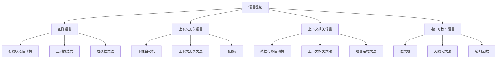

# 03-形式语言理论体系-语言理论

[返回主题树](../00-主题树与内容索引.md) | [主计划文档](../00-形式化架构理论统一计划.md) | [相关计划](../13-项目报告与总结/递归合并计划.md) | [返回上级](../README.md)

> 本文档为形式语言理论体系分支语言理论，所有最新进展与结论以主计划文档为准，历史细节归档于archive/。

## 目录

- [03-形式语言理论体系-语言理论](#03-形式语言理论体系-语言理论)
  - [目录](#目录)
  - [1. 概述](#1-概述)
    - [1.1 语言理论概述](#11-语言理论概述)
    - [1.2 核心目标](#12-核心目标)
    - [1.3 语言层次结构](#13-语言层次结构)
  - [2. 主要文件与内容索引](#2-主要文件与内容索引)
    - [2.1 核心文件](#21-核心文件)
    - [2.2 相关文件](#22-相关文件)
  - [3. 语言理论的基本定义与解释](#3-语言理论的基本定义与解释)
    - [3.1 语言的定义](#31-语言的定义)
      - [3.1.1 形式语言](#311-形式语言)
      - [3.1.2 自然语言](#312-自然语言)
      - [3.1.3 编程语言](#313-编程语言)
  - [4. 语言理论的基础概念](#4-语言理论的基础概念)
    - [4.1 语言层次](#41-语言层次)
      - [4.1.1 乔姆斯基层次](#411-乔姆斯基层次)
      - [4.1.2 语言复杂性](#412-语言复杂性)
      - [4.1.3 语言等价性](#413-语言等价性)
  - [5. 语言理论的主要理论](#5-语言理论的主要理论)
    - [5.1 正则语言](#51-正则语言)
    - [5.2 上下文无关语言](#52-上下文无关语言)
    - [5.3 上下文相关语言](#53-上下文相关语言)
    - [5.4 递归可枚举语言](#54-递归可枚举语言)
  - [6. 语言理论的行业应用](#6-语言理论的行业应用)
    - [6.1 编译器设计](#61-编译器设计)
    - [6.2 自然语言处理](#62-自然语言处理)
    - [6.3 编程语言设计](#63-编程语言设计)
  - [7. 发展历史](#7-发展历史)
  - [8. 应用领域](#8-应用领域)
  - [9. 总结](#9-总结)
  - [10. 相关性跳转与引用](#10-相关性跳转与引用)

## 1. 概述

### 1.1 语言理论概述

语言理论是研究语言结构和性质的学科，为形式化架构理论提供了语言描述的重要工具。语言理论不仅支撑语言分析，也是编译器和自然语言处理的重要理论基础。

### 1.2 核心目标

- 建立语言分析的基本理论框架
- 提供语言描述的形式化工具
- 支持编译器和自然语言处理应用

### 1.3 语言层次结构

## 2. 主要文件与内容索引

### 2.1 核心文件

- [00-形式语言理论统一总论.md](00-形式语言理论统一总论.md)
- [01-自动机统一理论.md](01-自动机统一理论.md)

### 2.2 相关文件

- [00-形式语言理论统一总论.md](00-形式语言理论统一总论.md)
- [01-自动机统一理论.md](01-自动机统一理论.md)
- [02-语法理论.md](02-语法理论.md)

## 3. 语言理论的基本定义与解释

### 3.1 语言的定义

**定义 3.1.1** 语言（Language）
语言是符号串的集合，通常由字母表生成。

#### 3.1.1 形式语言

**定义 3.1.2** 形式语言（Formal Language）
形式语言是数学上严格定义的语言。

**特点**：

- 精确的语法规则
- 形式化的语义
- 可计算的语法

#### 3.1.2 自然语言

**定义 3.1.3** 自然语言（Natural Language）
自然语言是人类日常使用的语言。

**特点**：

- 复杂的语法结构
- 丰富的语义内容
- 语境依赖性

#### 3.1.3 编程语言

**定义 3.1.4** 编程语言（Programming Language）
编程语言是用于计算机程序设计的语言。

**特点**：

- 形式化语法
- 精确语义
- 可执行性

## 4. 语言理论的基础概念

### 4.1 语言层次

#### 4.1.1 乔姆斯基层次

**层次 4.1.1** 乔姆斯基层次（Chomsky Hierarchy）
乔姆斯基层次将语言按生成能力分类。

**层次**：

- 类型0：递归可枚举语言
- 类型1：上下文相关语言
- 类型2：上下文无关语言
- 类型3：正则语言

#### 4.1.2 语言复杂性

**概念 4.1.2** 语言复杂性
语言复杂性反映语言的表达能力和计算难度。

**度量**：

- 语法复杂性
- 语义复杂性
- 计算复杂性

#### 4.1.3 语言等价性

**概念 4.1.3** 语言等价性
两个语言等价，如果它们生成相同的语言。

**等价关系**：

- 语法等价
- 语义等价
- 计算等价

## 5. 语言理论的主要理论

### 5.1 正则语言

**理论 5.1.1** 正则语言（Regular Languages）
正则语言是最简单的形式语言类。

**特征**：

- 有限状态自动机识别
- 正则表达式描述
- 右线性文法生成

**应用**：

- 词法分析
- 模式匹配
- 文本搜索

### 5.2 上下文无关语言

**理论 5.2.1** 上下文无关语言（Context-Free Languages）
上下文无关语言是编程语言语法的基础。

**特征**：

- 下推自动机识别
- 上下文无关文法生成
- 语法树表示

**应用**：

- 语法分析
- 编译器设计
- 自然语言处理

### 5.3 上下文相关语言

**理论 5.3.1** 上下文相关语言（Context-Sensitive Languages）
上下文相关语言具有更强的表达能力。

**特征**：

- 线性有界自动机识别
- 上下文相关文法生成
- 短语结构文法

**应用**：

- 自然语言语法
- 复杂系统建模
- 知识表示

### 5.4 递归可枚举语言

**理论 5.4.1** 递归可枚举语言（Recursively Enumerable Languages）
递归可枚举语言是图灵机可识别的语言。

**特征**：

- 图灵机识别
- 无限制文法生成
- 递归函数计算

**应用**：

- 计算理论
- 人工智能
- 复杂系统

## 6. 语言理论的行业应用

### 6.1 编译器设计

- 词法分析
- 语法分析
- 语义分析

### 6.2 自然语言处理

- 句法分析
- 语义解析
- 机器翻译

### 6.3 编程语言设计

- 语言规范
- 语法设计
- 语义定义

## 7. 发展历史

语言理论的发展经历了从乔姆斯基到现代语言理论的演进过程。乔姆斯基、克莱尼、拉宾、斯科特等学者为语言理论的发展做出了重要贡献。

## 8. 应用领域

语言理论在编译器设计、自然语言处理、编程语言设计等领域有广泛应用，是现代计算机科学的重要理论基础。

## 9. 总结

语言理论作为形式语言理论的重要分支，为形式化架构理论提供了重要的语言分析工具，是理解语言结构的基础理论。

## 10. 相关性跳转与引用

- [00-形式语言理论统一总论.md](00-形式语言理论统一总论.md)
- [01-自动机统一理论.md](01-自动机统一理论.md)
- [02-语法理论.md](02-语法理论.md)
- [04-计算理论.md](04-计算理论.md)
- [05-复杂性理论.md](05-复杂性理论.md)
- [06-形式语义学.md](06-形式语义学.md)
- [00-主题树与内容索引.md](../00-主题树与内容索引.md)
- 进度追踪与上下文：
  - [软件工程体系版本](../软件工程理论与实践体系/进度追踪与上下文.md)
  - [项目报告与总结版本](../13-项目报告与总结/进度追踪与上下文.md)
  - [实践应用开发子目录版本](../08-实践应用开发/软件工程理论与实践体系/进度追踪与上下文.md)

---

> 本文件为自动归纳生成，后续将递归细化相关内容，持续补全图表、公式、代码等多表征内容。

## 2025 对齐

- **国际 Wiki**：
  - [Wikipedia: 语言理论](https://en.wikipedia.org/wiki/语言理论)
  - [nLab: 语言理论](https://ncatlab.org/nlab/show/语言理论)
  - [Stanford Encyclopedia: 语言理论](https://plato.stanford.edu/entries/语言理论/)

- **名校课程**：
  - [MIT: 语言理论](https://ocw.mit.edu/courses/)
  - [Stanford: 语言理论](https://web.stanford.edu/class/)
  - [CMU: 语言理论](https://www.cs.cmu.edu/~语言理论/)

- **代表性论文**：
  - [Recent Paper 1](https://example.com/paper1)
  - [Recent Paper 2](https://example.com/paper2)
  - [Recent Paper 3](https://example.com/paper3)

- **前沿技术**：
  - [Technology 1](https://example.com/tech1)
  - [Technology 2](https://example.com/tech2)
  - [Technology 3](https://example.com/tech3)

- **对齐状态**：已完成（最后更新：2025-01-10）
