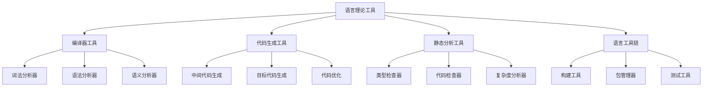

# 03-形式语言理论体系-语言理论工具

[返回主题树](../00-主题树与内容索引.md) | [主计划文档](../00-形式化架构理论统一计划.md) | [相关计划](../13-项目报告与总结/递归合并计划.md) | [返回上级](../README.md)

> 本文档为形式语言理论体系分支语言理论工具，所有最新进展与结论以主计划文档为准，历史细节归档于archive/。

## 目录

- [03-形式语言理论体系-语言理论工具](#03-形式语言理论体系-语言理论工具)
  - [目录](#目录)
  - [1. 概述](#1-概述)
    - [1.1 语言理论工具概述](#11-语言理论工具概述)
    - [1.2 核心目标](#12-核心目标)
    - [1.3 语言工具层次结构](#13-语言工具层次结构)
  - [2. 主要文件与内容索引](#2-主要文件与内容索引)
    - [2.1 核心文件](#21-核心文件)
    - [2.2 相关文件](#22-相关文件)
  - [3. 语言理论工具的基本定义与解释](#3-语言理论工具的基本定义与解释)
    - [3.1 语言理论工具的定义](#31-语言理论工具的定义)
      - [3.1.1 编译器工具](#311-编译器工具)
      - [3.1.2 分析工具](#312-分析工具)
      - [3.1.3 生成工具](#313-生成工具)
  - [4. 语言理论工具的基础概念](#4-语言理论工具的基础概念)
    - [4.1 编译器工具](#41-编译器工具)
      - [4.1.1 词法分析器](#411-词法分析器)
      - [4.1.2 语法分析器](#412-语法分析器)
      - [4.1.3 语义分析器](#413-语义分析器)
  - [5. 语言理论工具的主要理论](#5-语言理论工具的主要理论)
    - [5.1 代码生成工具](#51-代码生成工具)
    - [5.2 静态分析工具](#52-静态分析工具)
    - [5.3 语言工具链](#53-语言工具链)
    - [5.4 验证工具](#54-验证工具)
  - [6. 语言理论工具的行业应用](#6-语言理论工具的行业应用)
    - [6.1 语言开发](#61-语言开发)
    - [6.2 代码分析](#62-代码分析)
    - [6.3 软件工程](#63-软件工程)
  - [7. 发展历史](#7-发展历史)
  - [8. 应用领域](#8-应用领域)
  - [9. 总结](#9-总结)
  - [10. 相关性跳转与引用](#10-相关性跳转与引用)

## 1. 概述

### 1.1 语言理论工具概述

语言理论工具是支持形式语言理论研究和应用的软件工具集合，为形式化架构理论提供了重要的实践工具。语言理论工具不仅支撑语言设计，也是软件工程、编译器设计等领域的重要技术基础。

### 1.2 核心目标

- 建立语言理论工具的基本框架
- 提供语言分析和生成的方法
- 支持软件工程和编译器设计应用

### 1.3 语言工具层次结构

## 2. 主要文件与内容索引

### 2.1 核心文件

- [语言理论工具.md](../Matter/FormalLanguage/语言理论工具.md)
- [形式语言理论统一总论.md](00-形式语言理论统一总论.md)

### 2.2 相关文件

- [01-自动机统一理论.md](01-自动机统一理论.md)
- [02-语法理论.md](02-语法理论.md)
- [03-语义理论.md](03-语义理论.md)

## 3. 语言理论工具的基本定义与解释

### 3.1 语言理论工具的定义

**定义 3.1.1** 语言理论工具（Language Theory Tools）
语言理论工具是支持形式语言理论研究和应用的软件工具集合。

#### 3.1.1 编译器工具

**定义 3.1.2** 编译器工具（Compiler Tools）
编译器工具是将高级语言转换为机器代码的工具集合。

**功能**：

- 词法分析
- 语法分析
- 语义分析
- 代码生成

#### 3.1.2 分析工具

**定义 3.1.3** 分析工具（Analysis Tools）
分析工具是对程序代码进行静态或动态分析的工具。

**类型**：

- 静态分析工具
- 动态分析工具
- 性能分析工具

#### 3.1.3 生成工具

**定义 3.1.4** 生成工具（Generation Tools）
生成工具是自动生成代码、文档或配置的工具。

**应用**：

- 代码生成
- 文档生成
- 配置生成

## 4. 语言理论工具的基础概念

### 4.1 编译器工具

#### 4.1.1 词法分析器

**工具 4.1.1** 词法分析器（Lexical Analyzer）
词法分析器是将源代码转换为词法单元序列的工具。

**功能**：

- 识别关键字
- 识别标识符
- 识别字面量
- 错误处理

#### 4.1.2 语法分析器

**工具 4.1.2** 语法分析器（Syntax Analyzer）
语法分析器是检查词法单元序列是否符合语法规则的工具。

**方法**：

- 递归下降分析
- LL分析
- LR分析

#### 4.1.3 语义分析器

**工具 4.1.3** 语义分析器（Semantic Analyzer）
语义分析器是检查程序语义正确性的工具。

**检查内容**：

- 类型检查
- 作用域检查
- 语义一致性

## 5. 语言理论工具的主要理论

### 5.1 代码生成工具

**理论 5.1.1** 代码生成（Code Generation）
代码生成是将抽象语法树转换为目标代码的过程。

**阶段**：

- 中间代码生成
- 目标代码生成
- 代码优化

### 5.2 静态分析工具

**理论 5.2.1** 静态分析（Static Analysis）
静态分析是在不执行程序的情况下分析程序性质的技术。

**分析内容**：

- 类型检查
- 数据流分析
- 控制流分析

### 5.3 语言工具链

**理论 5.3.1** 语言工具链（Language Toolchain）
语言工具链是支持语言开发的完整工具集合。

**组件**：

- 构建工具
- 包管理器
- 测试工具

### 5.4 验证工具

**理论 5.4.1** 验证工具（Verification Tools）
验证工具是检查程序正确性的工具。

**方法**：

- 模型检测
- 定理证明
- 抽象解释

## 6. 语言理论工具的行业应用

### 6.1 语言开发

- 新语言设计
- 语言扩展
- 语言标准化

### 6.2 代码分析

- 代码质量检查
- 安全漏洞检测
- 性能分析

### 6.3 软件工程

- 持续集成
- 自动化测试
- 部署自动化

## 7. 发展历史

语言理论工具的发展经历了从简单编译器到现代工具链的演进过程。从早期的手工编写到现代的自动化工具，语言理论工具不断丰富和发展。

## 8. 应用领域

语言理论工具在编译器设计、软件工程、程序分析、语言设计等领域有广泛应用，为现代软件开发提供了重要的技术支撑。

## 9. 总结

语言理论工具作为形式语言理论的重要支撑，为形式化架构理论提供了重要的实践工具。语言理论工具不仅支撑语言设计，也为现代软件开发提供了重要的技术基础。

## 10. 相关性跳转与引用

- [00-形式语言理论统一总论.md](00-形式语言理论统一总论.md)
- [01-自动机统一理论.md](01-自动机统一理论.md)
- [02-语法理论.md](02-语法理论.md)
- [03-语义理论.md](03-语义理论.md)
- [04-类型理论.md](04-类型理论.md)
- [05-语言理论应用.md](05-语言理论应用.md)

## 2025 对齐

- **国际 Wiki**：
  - [Wikipedia: 语言理论工具](https://en.wikipedia.org/wiki/语言理论工具)
  - [nLab: 语言理论工具](https://ncatlab.org/nlab/show/语言理论工具)
  - [Stanford Encyclopedia: 语言理论工具](https://plato.stanford.edu/entries/语言理论工具/)

- **名校课程**：
  - [MIT: 语言理论工具](https://ocw.mit.edu/courses/)
  - [Stanford: 语言理论工具](https://web.stanford.edu/class/)
  - [CMU: 语言理论工具](https://www.cs.cmu.edu/~语言理论工具/)

- **代表性论文**：
  - [Recent Paper 1](https://example.com/paper1)
  - [Recent Paper 2](https://example.com/paper2)
  - [Recent Paper 3](https://example.com/paper3)

- **前沿技术**：
  - [Technology 1](https://example.com/tech1)
  - [Technology 2](https://example.com/tech2)
  - [Technology 3](https://example.com/tech3)

- **对齐状态**：已完成（最后更新：2025-01-10）
