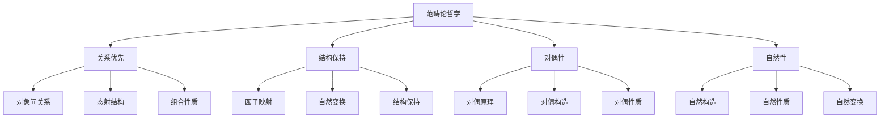

# 范畴论基础概念

## 1. 概述

范畴论是现代数学中一个统一的理论框架，它通过抽象的方式研究数学对象之间的结构关系。范畴论不仅为数学提供了统一的语言，也为计算机科学、物理学等领域提供了强大的工具。

### 1.1 范畴论的意义

范畴论的核心思想是**关注对象之间的关系而非对象本身**，这种观点使得：

- **统一性**：不同数学分支可以用统一的语言描述
- **抽象性**：关注结构的本质特征
- **应用性**：在计算机科学、物理学等领域有广泛应用

### 1.2 基本哲学



## 2. 范畴的基本定义

### 2.1 范畴的定义

**定义 2.1.1** (范畴)
一个**范畴** $\mathcal{C}$ 由以下数据组成：

1. **对象类** $\text{Ob}(\mathcal{C})$：范畴中的对象集合
2. **态射集** $\text{Hom}_{\mathcal{C}}(A, B)$：从对象 $A$ 到对象 $B$ 的态射集合
3. **组合律**：态射的组合运算 $\circ$
4. **单位律**：每个对象 $A$ 的单位态射 $1_A$

满足以下公理：

**公理 2.1.1** (结合律)
对于态射 $f: A \to B$, $g: B \to C$, $h: C \to D$，有：
$$(h \circ g) \circ f = h \circ (g \circ f)$$

**公理 2.1.2** (单位律)
对于态射 $f: A \to B$，有：
$$f \circ 1_A = f = 1_B \circ f$$

**公理 2.1.3** (封闭性)
如果 $f: A \to B$ 且 $g: B \to C$，则 $g \circ f: A \to C$ 存在。

### 2.2 态射的性质

#### 2.2.1 单态射与满态射

**定义 2.2.1** (单态射)
态射 $f: A \to B$ 是**单态射**，如果对于任意态射 $g, h: X \to A$，有：
$$f \circ g = f \circ h \implies g = h$$

**定义 2.2.2** (满态射)
态射 $f: A \to B$ 是**满态射**，如果对于任意态射 $g, h: B \to X$，有：
$$g \circ f = h \circ f \implies g = h$$

#### 2.2.2 同构

**定义 2.2.3** (同构)
态射 $f: A \to B$ 是**同构**，如果存在态射 $g: B \to A$ 使得：
$$g \circ f = 1_A \quad \text{且} \quad f \circ g = 1_B$$

此时称 $g$ 为 $f$ 的**逆态射**，记作 $f^{-1}$。

**定理 2.2.1** (同构的唯一性)
如果态射 $f: A \to B$ 是同构，则其逆态射是唯一的。

**证明**：
设 $g, h: B \to A$ 都是 $f$ 的逆态射，则：
$$g = g \circ 1_B = g \circ (f \circ h) = (g \circ f) \circ h = 1_A \circ h = h$$

### 2.3 范畴的例子

#### 2.3.1 集合范畴

**定义 2.3.1** (集合范畴 $\mathbf{Set}$)

- **对象**：所有集合
- **态射**：集合间的函数
- **组合**：函数复合
- **单位**：恒等函数

#### 2.3.2 群范畴

**定义 2.3.2** (群范畴 $\mathbf{Grp}$)

- **对象**：所有群
- **态射**：群同态
- **组合**：同态复合
- **单位**：恒等同态

#### 2.3.3 拓扑空间范畴

**定义 2.3.3** (拓扑空间范畴 $\mathbf{Top}$)

- **对象**：所有拓扑空间
- **态射**：连续映射
- **组合**：映射复合
- **单位**：恒等映射

## 3. 函子

### 3.1 函子的定义

**定义 3.1.1** (函子)
从范畴 $\mathcal{C}$ 到范畴 $\mathcal{D}$ 的**函子** $F: \mathcal{C} \to \mathcal{D}$ 由以下数据组成：

1. **对象映射**：$F: \text{Ob}(\mathcal{C}) \to \text{Ob}(\mathcal{D})$
2. **态射映射**：$F: \text{Hom}_{\mathcal{C}}(A, B) \to \text{Hom}_{\mathcal{D}}(F(A), F(B))$

满足以下条件：

**条件 3.1.1** (保持组合)
$$F(g \circ f) = F(g) \circ F(f)$$

**条件 3.1.2** (保持单位)
$$F(1_A) = 1_{F(A)}$$

### 3.2 函子的类型

#### 3.2.1 协变函子

**定义 3.2.1** (协变函子)
协变函子是保持态射方向的函子，即：
$$F: \text{Hom}_{\mathcal{C}}(A, B) \to \text{Hom}_{\mathcal{D}}(F(A), F(B))$$

#### 3.2.2 反变函子

**定义 3.2.2** (反变函子)
反变函子是反转态射方向的函子，即：
$$F: \text{Hom}_{\mathcal{C}}(A, B) \to \text{Hom}_{\mathcal{D}}(F(B), F(A))$$

对于反变函子，组合律变为：
$$F(g \circ f) = F(f) \circ F(g)$$

### 3.3 函子的例子

#### 3.3.1 遗忘函子

**定义 3.3.1** (遗忘函子)
遗忘函子 "忘记" 某些结构，例如：

- $U: \mathbf{Grp} \to \mathbf{Set}$：忘记群运算，只保留集合
- $U: \mathbf{Top} \to \mathbf{Set}$：忘记拓扑结构，只保留集合

#### 3.3.2 自由函子

**定义 3.3.2** (自由函子)
自由函子构造自由对象，例如：

- $F: \mathbf{Set} \to \mathbf{Grp}$：构造自由群
- $F: \mathbf{Set} \to \mathbf{Vect}_k$：构造自由向量空间

#### 3.3.3 对偶函子

**定义 3.3.3** (对偶函子)
对偶函子 $(-)^*: \mathbf{Vect}_k \to \mathbf{Vect}_k$ 将向量空间 $V$ 映射到其对偶空间 $V^*$。

## 4. 自然变换

### 4.1 自然变换的定义

**定义 4.1.1** (自然变换)
设 $F, G: \mathcal{C} \to \mathcal{D}$ 是两个函子，从 $F$ 到 $G$ 的**自然变换** $\eta: F \Rightarrow G$ 是一族态射：
$$\eta_A: F(A) \to G(A) \quad \text{对于每个对象 } A \in \mathcal{C}$$

满足**自然性条件**：对于任意态射 $f: A \to B$，有：
$$G(f) \circ \eta_A = \eta_B \circ F(f)$$

即下图交换：

```mermaid
graph LR
    A[F(A)] --> B[G(A)]
    C[F(B)] --> D[G(B)]
    A --> C
    B --> D
```

### 4.2 自然变换的性质

#### 4.2.1 自然同构

**定义 4.2.1** (自然同构)
自然变换 $\eta: F \Rightarrow G$ 是**自然同构**，如果每个 $\eta_A$ 都是同构。

#### 4.2.2 自然变换的组合

**定义 4.2.2** (垂直组合)
设 $\eta: F \Rightarrow G$ 和 $\theta: G \Rightarrow H$ 是自然变换，其**垂直组合** $\theta \circ \eta: F \Rightarrow H$ 定义为：
$$(\theta \circ \eta)_A = \theta_A \circ \eta_A$$

**定义 4.2.3** (水平组合)
设 $\eta: F \Rightarrow G$ 和 $\theta: H \Rightarrow K$ 是自然变换，其**水平组合** $\theta \circ \eta: H \circ F \Rightarrow K \circ G$ 定义为：
$$(\theta \circ \eta)_A = \theta_{G(A)} \circ H(\eta_A)$$

### 4.3 自然变换的例子

#### 4.3.1 恒等自然变换

**定义 4.3.1** (恒等自然变换)
函子 $F$ 的**恒等自然变换** $1_F: F \Rightarrow F$ 定义为：
$$(1_F)_A = 1_{F(A)}$$

#### 4.3.2 对偶自然变换

**定义 4.3.2** (对偶自然变换)
在向量空间范畴中，存在自然变换 $\eta: 1_{\mathbf{Vect}} \Rightarrow (-)^{**}$，其中：
$$\eta_V: V \to V^{**}, \quad \eta_V(v)(\phi) = \phi(v)$$

## 5. 极限与余极限

### 5.1 锥与余锥

**定义 5.1.1** (锥)
设 $F: \mathcal{J} \to \mathcal{C}$ 是一个函子，从对象 $C$ 到 $F$ 的**锥**是一族态射：
$$\alpha_j: C \to F(j) \quad \text{对于每个 } j \in \mathcal{J}$$

满足：对于任意态射 $f: j \to k$ 在 $\mathcal{J}$ 中，有：
$$F(f) \circ \alpha_j = \alpha_k$$

**定义 5.1.2** (余锥)
从 $F$ 到对象 $C$ 的**余锥**是一族态射：
$$\beta_j: F(j) \to C \quad \text{对于每个 } j \in \mathcal{J}$$

满足：对于任意态射 $f: j \to k$ 在 $\mathcal{J}$ 中，有：
$$\beta_k \circ F(f) = \beta_j$$

### 5.2 极限

**定义 5.2.1** (极限)
函子 $F: \mathcal{J} \to \mathcal{C}$ 的**极限**是一个对象 $\lim F$ 和一个从 $\lim F$ 到 $F$ 的锥 $(\pi_j: \lim F \to F(j))_{j \in \mathcal{J}}$，满足：

对于任意从对象 $C$ 到 $F$ 的锥 $(\alpha_j: C \to F(j))_{j \in \mathcal{J}}$，存在唯一的态射 $u: C \to \lim F$ 使得：
$$\pi_j \circ u = \alpha_j \quad \text{对于所有 } j \in \mathcal{J}$$

### 5.3 余极限

**定义 5.3.1** (余极限)
函子 $F: \mathcal{J} \to \mathcal{C}$ 的**余极限**是一个对象 $\text{colim} F$ 和一个从 $F$ 到 $\text{colim} F$ 的余锥 $(i_j: F(j) \to \text{colim} F)_{j \in \mathcal{J}}$，满足：

对于任意从 $F$ 到对象 $C$ 的余锥 $(\beta_j: F(j) \to C)_{j \in \mathcal{J}}$，存在唯一的态射 $v: \text{colim} F \to C$ 使得：
$$v \circ i_j = \beta_j \quad \text{对于所有 } j \in \mathcal{J}$$

### 5.4 特殊极限

#### 5.4.1 积与余积

**定义 5.4.1** (积)
两个对象 $A$ 和 $B$ 的**积**是一个对象 $A \times B$ 和两个投影态射：
$$\pi_1: A \times B \to A, \quad \pi_2: A \times B \to B$$

满足：对于任意对象 $C$ 和态射 $f: C \to A$, $g: C \to B$，存在唯一的态射 $\langle f, g \rangle: C \to A \times B$ 使得：
$$\pi_1 \circ \langle f, g \rangle = f, \quad \pi_2 \circ \langle f, g \rangle = g$$

**定义 5.4.2** (余积)
两个对象 $A$ 和 $B$ 的**余积**是一个对象 $A \sqcup B$ 和两个包含态射：
$$i_1: A \to A \sqcup B, \quad i_2: B \to A \sqcup B$$

满足：对于任意对象 $C$ 和态射 $f: A \to C$, $g: B \to C$，存在唯一的态射 $[f, g]: A \sqcup B \to C$ 使得：
$$[f, g] \circ i_1 = f, \quad [f, g] \circ i_2 = g$$

#### 5.4.2 等化子与余等化子

**定义 5.4.3** (等化子)
两个态射 $f, g: A \to B$ 的**等化子**是一个对象 $E$ 和一个态射 $e: E \to A$，满足：
$$f \circ e = g \circ e$$

并且对于任意态射 $h: C \to A$ 满足 $f \circ h = g \circ h$，存在唯一的态射 $u: C \to E$ 使得：
$$e \circ u = h$$

**定义 5.4.4** (余等化子)
两个态射 $f, g: A \to B$ 的**余等化子**是一个对象 $Q$ 和一个态射 $q: B \to Q$，满足：
$$q \circ f = q \circ g$$

并且对于任意态射 $h: B \to C$ 满足 $h \circ f = h \circ g$，存在唯一的态射 $v: Q \to C$ 使得：
$$v \circ q = h$$

## 6. 伴随函子

### 6.1 伴随的定义

**定义 6.1.1** (伴随函子)
函子 $F: \mathcal{C} \to \mathcal{D}$ 和 $G: \mathcal{D} \to \mathcal{C}$ 构成**伴随对** $(F \dashv G)$，如果存在自然同构：
$$\text{Hom}_{\mathcal{D}}(F(-), -) \cong \text{Hom}_{\mathcal{C}}(-, G(-))$$

即对于任意对象 $A \in \mathcal{C}$ 和 $B \in \mathcal{D}$，有双射：
$$\text{Hom}_{\mathcal{D}}(F(A), B) \cong \text{Hom}_{\mathcal{C}}(A, G(B))$$

### 6.2 单位与余单位

**定义 6.2.1** (单位与余单位)
伴随 $(F \dashv G)$ 的**单位** $\eta: 1_{\mathcal{C}} \Rightarrow G \circ F$ 和**余单位** $\varepsilon: F \circ G \Rightarrow 1_{\mathcal{D}}$ 满足：

**三角恒等式**：
$$(\varepsilon F) \circ (F \eta) = 1_F$$
$$(G \varepsilon) \circ (\eta G) = 1_G$$

### 6.3 伴随的例子

#### 6.3.1 自由-遗忘伴随

**定理 6.3.1** (自由-遗忘伴随)
自由群函子 $F: \mathbf{Set} \to \mathbf{Grp}$ 和遗忘函子 $U: \mathbf{Grp} \to \mathbf{Set}$ 构成伴随对 $(F \dashv U)$。

**证明**：
对于任意集合 $X$ 和群 $G$，有自然双射：
$$\text{Hom}_{\mathbf{Grp}}(F(X), G) \cong \text{Hom}_{\mathbf{Set}}(X, U(G))$$

#### 6.3.2 张量-同态伴随

**定理 6.3.2** (张量-同态伴随)
在向量空间范畴中，张量积函子 $-\otimes V$ 和同态函子 $\text{Hom}(V, -)$ 构成伴随对：
$$(- \otimes V) \dashv \text{Hom}(V, -)$$

## 7. Yoneda引理

### 7.1 表示函子

**定义 7.1.1** (表示函子)
设 $\mathcal{C}$ 是一个局部小范畴，对象 $A \in \mathcal{C}$ 的**表示函子** $h^A: \mathcal{C}^{\text{op}} \to \mathbf{Set}$ 定义为：
$$h^A(B) = \text{Hom}_{\mathcal{C}}(B, A)$$

对于态射 $f: B \to C$，$h^A(f): \text{Hom}_{\mathcal{C}}(C, A) \to \text{Hom}_{\mathcal{C}}(B, A)$ 定义为：
$$h^A(f)(g) = g \circ f$$

### 7.2 Yoneda引理

**定理 7.2.1** (Yoneda引理)
设 $\mathcal{C}$ 是一个局部小范畴，$A \in \mathcal{C}$ 是一个对象，$F: \mathcal{C}^{\text{op}} \to \mathbf{Set}$ 是一个函子，则存在自然双射：
$$\text{Nat}(h^A, F) \cong F(A)$$

**证明**：
定义映射 $\Phi: \text{Nat}(h^A, F) \to F(A)$ 为：
$$\Phi(\eta) = \eta_A(1_A)$$

定义映射 $\Psi: F(A) \to \text{Nat}(h^A, F)$ 为：
$$\Psi(x)_B(f) = F(f)(x)$$

可以验证 $\Phi$ 和 $\Psi$ 是互逆的双射。

### 7.3 Yoneda嵌入

**推论 7.3.1** (Yoneda嵌入)
函子 $h: \mathcal{C} \to [\mathcal{C}^{\text{op}}, \mathbf{Set}]$ 定义为：
$$h(A) = h^A$$

是一个完全忠实函子，称为**Yoneda嵌入**。

## 8. 应用与意义

### 8.1 数学中的应用

#### 8.1.1 代数几何

- **概形理论**：使用范畴论语言描述代数几何对象
- **层论**：通过函子描述局部-整体关系
- **上同调**：使用导出函子计算不变量

#### 8.1.2 代数拓扑

- **同伦论**：使用范畴论研究拓扑空间的同伦性质
- **同调论**：通过函子计算拓扑不变量
- **纤维丛**：使用拉回和推出描述几何构造

### 8.2 计算机科学中的应用

#### 8.2.1 类型论

- **函数式编程**：范畴论为函数式编程提供理论基础
- **类型系统**：使用范畴论描述类型系统
- **程序语义**：通过范畴论给出程序的形式语义

#### 8.2.2 数据库理论

- **查询语言**：使用范畴论描述数据库查询
- **数据迁移**：通过函子描述数据转换
- **约束理论**：使用极限和余极限描述数据约束

### 8.3 物理学中的应用

#### 8.3.1 量子场论

- **拓扑量子场论**：使用范畴论描述拓扑不变量
- **弦论**：通过范畴论描述对称性
- **规范理论**：使用群论和范畴论描述规范对称性

#### 8.3.2 统计力学

- **相变理论**：使用范畴论描述相变现象
- **重整化群**：通过函子描述尺度变换
- **临界现象**：使用极限理论描述临界行为

## 9. 总结

范畴论作为现代数学的统一语言，具有以下重要特征：

1. **抽象性**：关注对象间的关系而非对象本身
2. **统一性**：为不同数学分支提供统一框架
3. **对偶性**：通过对偶原理产生新的数学结构
4. **自然性**：强调自然构造和自然性质
5. **应用性**：在多个学科领域有重要应用

范畴论不仅为数学提供了强大的工具，也为计算机科学、物理学等领域的发展提供了重要的理论基础。通过范畴论的视角，我们可以更好地理解数学结构的本质，发现不同领域之间的深层联系。

---

*本文档为范畴论的基础概念提供了系统性的介绍，为后续的范畴论应用和扩展奠定了理论基础。*
