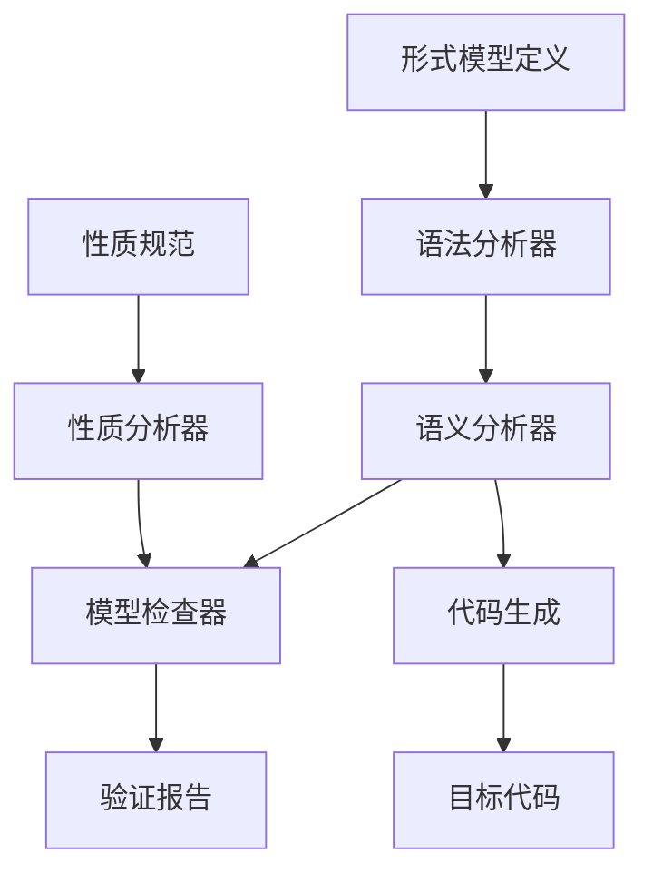
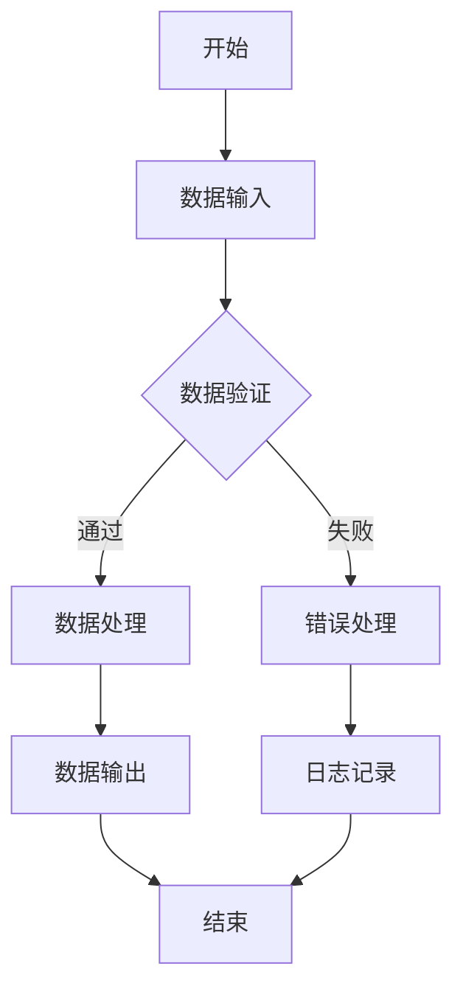
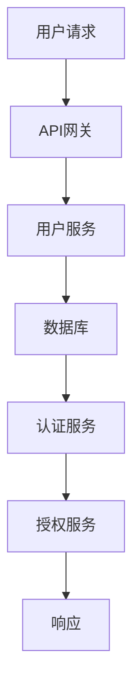
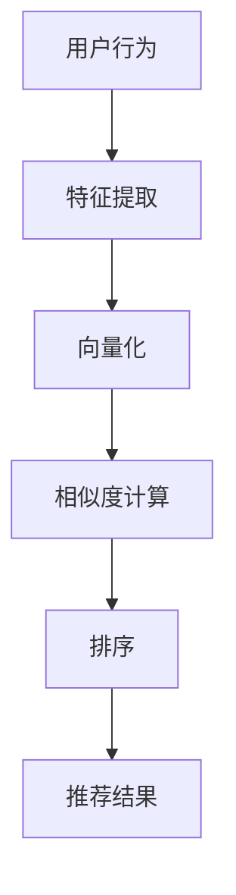

# 形式模型理论总论

## 概述

形式模型理论是计算机科学和软件工程中的核心理论体系，为复杂系统的建模、分析和验证提供了严格的数学基础。本文档系统性地整合了Petri网理论、软件应用模型和AI设计模型，构建了一个统一的形式模型理论框架。

## 1. 理论基础

### 1.1 形式模型的定义与分类

**定义 1.1.1** 形式模型 (Formal Model)
形式模型是一个数学结构 $M = (S, R, I)$，其中：

- $S$ 是状态集合 (State Set)
- $R \subseteq S \times S$ 是状态转换关系 (Transition Relation)
- $I \subseteq S$ 是初始状态集合 (Initial States)

**定义 1.1.2** 形式模型的表达能力
对于形式模型类 $\mathcal{M}$，其表达能力定义为：
$$\text{Exp}(\mathcal{M}) = \{L \subseteq \Sigma^* | \exists M \in \mathcal{M}: L(M) = L\}$$
其中 $L(M)$ 是模型 $M$ 生成的语言。

**定理 1.1.1** (表达能力层次)
形式模型的表达能力形成严格的层次结构：
$$\text{FSM} \subset \text{Pushdown} \subset \text{Turing} \subset \text{Timed} \subset \text{Probabilistic}$$

**证明** 通过语言包含关系：

1. 每个有限状态机都可以被下推自动机模拟
2. 每个下推自动机都可以被图灵机模拟
3. 时间约束增加了表达能力
4. 概率分布进一步扩展了表达能力

### 1.2 模型验证理论

**定义 1.2.1** 模型满足关系
对于形式模型 $M$ 和性质 $\phi$，满足关系定义为：
$$M \models \phi \iff \forall \pi \in \text{Traces}(M): \pi \models \phi$$

**定义 1.2.2** 模型检查问题
给定模型 $M$ 和性质 $\phi$，判定 $M \models \phi$ 是否成立。

**定理 1.2.1** (模型检查复杂性)
模型检查问题的复杂性取决于模型类型和性质类型：

- 有限状态模型 + LTL: PSPACE-complete
- 有限状态模型 + CTL: P-complete
- 时间模型 + TCTL: EXPTIME-complete

## 2. Petri网理论体系

### 2.1 基本Petri网

**定义 2.1.1** 基本Petri网
基本Petri网是一个四元组 $N = (P, T, F, M_0)$，其中：

- $P$ 是有限库所集 (Places)
- $T$ 是有限变迁集 (Transitions)，$P \cap T = \emptyset$
- $F \subseteq (P \times T) \cup (T \times P)$ 是流关系 (Flow Relation)
- $M_0: P \rightarrow \mathbb{N}$ 是初始标识 (Initial Marking)

**定义 2.1.2** 标识与变迁

- 标识：$M: P \rightarrow \mathbb{N}$
- 前集：$^{\bullet}t = \{p \in P | (p, t) \in F\}$
- 后集：$t^{\bullet} = \{p \in P | (t, p) \in F\}$
- 使能条件：$\forall p \in ^{\bullet}t: M(p) \geq 1$

**定义 2.1.3** 变迁发生
如果变迁 $t$ 在标识 $M$ 下使能，则发生产生新标识 $M'$：
$$M'(p) = \begin{cases}
M(p) - 1 & \text{if } p \in ^{\bullet}t - t^{\bullet} \\
M(p) + 1 & \text{if } p \in t^{\bullet} - ^{\bullet}t \\
M(p) & \text{otherwise}
\end{cases}$$

**定理 2.1.1** (标识守恒)
对于任意变迁 $t$ 和标识 $M$，如果 $t$ 在 $M$ 下使能，则：
$$\sum_{p \in P} M'(p) = \sum_{p \in P} M(p)$$

### 2.2 高级Petri网变种

#### 2.2.1 时间Petri网

**定义 2.2.1** 时间Petri网
时间Petri网是一个六元组 $N = (P, T, F, M_0, I, D)$，其中：
- $(P, T, F, M_0)$ 是基本Petri网
- $I: T \rightarrow \mathbb{R}^+ \times (\mathbb{R}^+ \cup \{\infty\})$ 是时间间隔函数
- $D: T \rightarrow \mathbb{R}^+$ 是延迟函数

**定义 2.2.2** 时间状态
时间状态是一个对 $(M, \tau)$，其中：
- $M$ 是标识
- $\tau: T \rightarrow \mathbb{R}^+$ 是时钟函数

**定理 2.2.1** (时间可达性复杂性)
时间Petri网的可达性问题比基本Petri网更复杂，通常需要指数时间算法。

#### 2.2.2 着色Petri网

**定义 2.2.3** 着色Petri网
着色Petri网是一个六元组 $N = (P, T, F, M_0, C, G)$，其中：
- $(P, T, F, M_0)$ 是基本Petri网
- $C: P \cup T \rightarrow \Sigma$ 是颜色函数
- $G: T \rightarrow \text{Bool}$ 是守卫函数

**定义 2.2.4** 颜色标识
颜色标识是一个函数 $M: P \rightarrow \text{Bag}(C(p))$，其中 $\text{Bag}(A)$ 表示集合 $A$ 的多重集。

**定理 2.2.2** (着色表达能力)
着色Petri网比基本Petri网具有更强的表达能力，但可能导致状态空间爆炸。

### 2.3 Petri网分析技术

#### 2.3.1 可达性分析

**定义 2.3.1** 可达性关系
标识 $M'$ 从标识 $M$ 可达，记作 $M \rightarrow^* M'$，如果存在变迁序列 $\sigma = t_1 t_2 \ldots t_n$ 使得：
$$M \xrightarrow{t_1} M_1 \xrightarrow{t_2} M_2 \rightarrow \ldots \xrightarrow{t_n} M'$$

**定义 2.3.2** 可达集
$$R(N, M_0) = \{M | M_0 \rightarrow^* M\}$$

**定理 2.3.1** (可达性判定)
Petri网的可达性问题在一般情况下是不可判定的。

#### 2.3.2 不变性分析

**定义 2.3.3** 不变性
向量 $I: P \rightarrow \mathbb{Z}$ 是Petri网的不变性，如果对于任意标识 $M$ 和变迁 $t$：
$$\text{如果 } M \xrightarrow{t} M', \text{ 则 } I \cdot M = I \cdot M'$$

**定理 2.3.2** (不变性保持)
如果 $I$ 是不变性，则对于任意可达标识 $M$：
$$I \cdot M = I \cdot M_0$$

## 3. 软件应用模型

### 3.1 工作流模型

**定义 3.1.1** 工作流Petri网
工作流Petri网是一个特殊的Petri网 $W = (P, T, F, M_0, \lambda)$，其中：
- $(P, T, F, M_0)$ 是基本Petri网
- $\lambda: T \rightarrow \text{Task}$ 是任务标签函数

**定义 3.1.2** 工作流性质
- **合理性** (Soundness): 从初始状态可达终止状态
- **活锁自由** (Livelock-free): 不存在无限循环
- **死锁自由** (Deadlock-free): 不存在死锁状态

**定理 3.1.1** (工作流验证)
工作流的合理性可以在多项式时间内验证。

### 3.2 微服务模型

**定义 3.2.1** 微服务Petri网
微服务Petri网是一个层次化Petri网 $MS = (N_1, N_2, \ldots, N_n, I)$，其中：
- $N_i$ 是第 $i$ 个服务的Petri网模型
- $I$ 是服务间接口定义

**定义 3.2.2** 服务组合
服务组合通过接口连接实现：
$$MS_1 \parallel MS_2 = (N_1 \cup N_2, F_1 \cup F_2 \cup I_{12})$$

**定理 3.2.1** (组合正确性)
如果每个服务都满足其局部性质，且接口兼容，则组合系统满足全局性质。

### 3.3 物联网模型

**定义 3.3.1** 物联网Petri网
物联网Petri网是一个分布式Petri网 $IoT = (N_1, N_2, \ldots, N_m, C)$，其中：
- $N_i$ 是第 $i$ 个设备的Petri网模型
- $C$ 是通信协议定义

**定义 3.3.2** 分布式同步
分布式同步通过消息传递实现：
$$N_i \xrightarrow{msg} N_j \iff \exists t_i \in T_i, t_j \in T_j: \lambda(t_i) = \lambda(t_j)$$

## 4. AI设计模型

### 4.1 向量数据库模型

**定义 4.1.1** 向量空间Petri网
向量空间Petri网是一个着色Petri网 $V = (P, T, F, M_0, C, G, \phi)$，其中：
- $(P, T, F, M_0, C, G)$ 是着色Petri网
- $\phi: P \rightarrow \mathbb{R}^d$ 是向量嵌入函数

**定义 4.1.2** 相似性计算
向量相似性通过余弦相似度计算：
$$\text{sim}(v_1, v_2) = \frac{v_1 \cdot v_2}{\|v_1\| \cdot \|v_2\|}$$

**定理 4.1.1** (向量检索效率)
使用索引结构的向量检索可以在 $O(\log n)$ 时间内完成。

### 4.2 神经网络模型

**定义 4.2.1** 神经网络Petri网
神经网络Petri网是一个时间Petri网 $NN = (P, T, F, M_0, I, D, w)$，其中：
- $(P, T, F, M_0, I, D)$ 是时间Petri网
- $w: F \rightarrow \mathbb{R}$ 是权重函数

**定义 4.2.2** 激活函数
激活函数通过变迁守卫实现：
$$G(t) = \sigma\left(\sum_{p \in ^{\bullet}t} w(p,t) \cdot M(p)\right)$$

**定理 4.2.1** (网络表达能力)
具有足够隐藏层的神经网络可以逼近任意连续函数。

### 4.3 强化学习模型

**定义 4.3.1** 强化学习Petri网
强化学习Petri网是一个概率Petri网 $RL = (P, T, F, M_0, \pi, R)$，其中：
- $(P, T, F, M_0)$ 是基本Petri网
- $\pi: T \rightarrow [0,1]$ 是策略函数
- $R: T \rightarrow \mathbb{R}$ 是奖励函数

**定义 4.3.2** 价值函数
价值函数定义为：
$$V(s) = \max_{\pi} \mathbb{E}\left[\sum_{t=0}^{\infty} \gamma^t R(s_t, a_t)\right]$$

**定理 4.3.1** (最优策略存在性)
在有限状态空间中，最优策略总是存在且可以通过动态规划计算。

## 5. 形式验证技术

### 5.1 模型检查

**定义 5.1.1** 线性时序逻辑 (LTL)
LTL公式的语法：
$$\phi ::= p | \neg \phi | \phi \wedge \phi | \phi \vee \phi | X \phi | F \phi | G \phi | \phi U \phi$$

**定义 5.1.2** 计算树逻辑 (CTL)
CTL公式的语法：
$$\phi ::= p | \neg \phi | \phi \wedge \phi | \phi \vee \phi | EX \phi | EF \phi | EG \phi | E[\phi U \phi] | A[\phi U \phi]$$

**定理 5.1.1** (模型检查算法)
CTL模型检查可以在 $O(|M| \cdot |\phi|)$ 时间内完成。

### 5.2 抽象解释

**定义 5.2.1** 抽象域
抽象域是一个格 $(A, \sqsubseteq, \sqcup, \sqcap)$，其中：
- $A$ 是抽象元素集合
- $\sqsubseteq$ 是偏序关系
- $\sqcup, \sqcap$ 是格运算

**定义 5.2.2** Galois连接
抽象域与具体域之间的Galois连接：
$$(\alpha, \gamma): \mathcal{P}(S) \leftrightarrow A$$

**定理 5.2.1** (抽象安全性)
如果 $(\alpha, \gamma)$ 是Galois连接，则抽象分析是安全的。

### 5.3 定理证明

**定义 5.3.1** Hoare逻辑
Hoare三元组：
$$\{P\} C \{Q\}$$
表示如果前置条件 $P$ 成立，执行程序 $C$ 后后置条件 $Q$ 成立。

**定义 5.3.2** 最弱前置条件
$$\text{wp}(C, Q) = \{s | \forall s': (s, s') \in \llbracket C \rrbracket \Rightarrow s' \in Q\}$$

**定理 5.3.1** (Hoare逻辑完备性)
如果 $\models \{P\} C \{Q\}$，则 $\vdash \{P\} C \{Q\}$。

## 6. 实现与工具

### 6.1 形式模型工具链



### 6.2 Rust实现示例

```rust
use std::collections::{HashMap, HashSet};

# [derive(Debug, Clone)]
pub struct PetriNet {
    places: HashSet<String>,
    transitions: HashSet<String>,
    flow: HashMap<(String, String), u32>,
    initial_marking: HashMap<String, u32>,
}

impl PetriNet {
    pub fn new() -> Self {
        Self {
            places: HashSet::new(),
            transitions: HashSet::new(),
            flow: HashMap::new(),
            initial_marking: HashMap::new(),
        }
    }

    pub fn add_place(&mut self, place: String) {
        self.places.insert(place);
    }

    pub fn add_transition(&mut self, transition: String) {
        self.transitions.insert(transition);
    }

    pub fn add_flow(&mut self, from: String, to: String, weight: u32) {
        self.flow.insert((from, to), weight);
    }

    pub fn set_initial_marking(&mut self, place: String, tokens: u32) {
        self.initial_marking.insert(place, tokens);
    }

    pub fn is_enabled(&self, transition: &str, marking: &HashMap<String, u32>) -> bool {
        for place in self.get_preset(transition) {
            let required = self.flow.get(&(place.clone(), transition.to_string())).unwrap_or(&0);
            let available = marking.get(&place).unwrap_or(&0);
            if available < required {
                return false;
            }
        }
        true
    }

    pub fn fire(&self, transition: &str, marking: &HashMap<String, u32>) -> Option<HashMap<String, u32>> {
        if !self.is_enabled(transition, marking) {
            return None;
        }

        let mut new_marking = marking.clone();

        // Remove tokens from input places
        for place in self.get_preset(transition) {
            let weight = self.flow.get(&(place.clone(), transition.to_string())).unwrap_or(&0);
            let current = new_marking.get(&place).unwrap_or(&0);
            new_marking.insert(place, current.saturating_sub(*weight));
        }

        // Add tokens to output places
        for place in self.get_postset(transition) {
            let weight = self.flow.get(&(transition.to_string(), place.clone())).unwrap_or(&0);
            let current = new_marking.get(&place).unwrap_or(&0);
            new_marking.insert(place, current + weight);
        }

        Some(new_marking)
    }

    fn get_preset(&self, transition: &str) -> Vec<String> {
        self.places.iter()
            .filter(|place| self.flow.contains_key(&(place.clone(), transition.to_string())))
            .cloned()
            .collect()
    }

    fn get_postset(&self, transition: &str) -> Vec<String> {
        self.places.iter()
            .filter(|place| self.flow.contains_key(&(transition.to_string(), place.clone())))
            .cloned()
            .collect()
    }
}

# [cfg(test)]
mod tests {
    use super::*;

    #[test]
    fn test_petri_net_creation() {
        let mut net = PetriNet::new();
        net.add_place("p1".to_string());
        net.add_place("p2".to_string());
        net.add_transition("t1".to_string());
        net.add_flow("p1".to_string(), "t1".to_string(), 1);
        net.add_flow("t1".to_string(), "p2".to_string(), 1);
        net.set_initial_marking("p1".to_string(), 1);

        assert!(net.places.contains("p1"));
        assert!(net.places.contains("p2"));
        assert!(net.transitions.contains("t1"));
    }

    #[test]
    fn test_transition_firing() {
        let mut net = PetriNet::new();
        net.add_place("p1".to_string());
        net.add_place("p2".to_string());
        net.add_transition("t1".to_string());
        net.add_flow("p1".to_string(), "t1".to_string(), 1);
        net.add_flow("t1".to_string(), "p2".to_string(), 1);
        net.set_initial_marking("p1".to_string(), 1);

        let initial_marking = net.initial_marking.clone();
        let new_marking = net.fire("t1", &initial_marking);

        assert!(new_marking.is_some());
        let marking = new_marking.unwrap();
        assert_eq!(marking.get("p1"), Some(&0));
        assert_eq!(marking.get("p2"), Some(&1));
    }
}
```

### 6.3 Go实现示例

```go
package petrinet

import (
 "fmt"
 "sync"
)

// PetriNet represents a Petri net structure
type PetriNet struct {
 places         map[string]bool
 transitions    map[string]bool
 flow           map[string]int // key: "from->to", value: weight
 initialMarking map[string]int
 mu             sync.RWMutex
}

// NewPetriNet creates a new Petri net
func NewPetriNet() *PetriNet {
 return &PetriNet{
  places:         make(map[string]bool),
  transitions:    make(map[string]bool),
  flow:           make(map[string]int),
  initialMarking: make(map[string]int),
 }
}

// AddPlace adds a place to the Petri net
func (pn *PetriNet) AddPlace(place string) {
 pn.mu.Lock()
 defer pn.mu.Unlock()
 pn.places[place] = true
}

// AddTransition adds a transition to the Petri net
func (pn *PetriNet) AddTransition(transition string) {
 pn.mu.Lock()
 defer pn.mu.Unlock()
 pn.transitions[transition] = true
}

// AddFlow adds a flow relation with weight
func (pn *PetriNet) AddFlow(from, to string, weight int) {
 pn.mu.Lock()
 defer pn.mu.Unlock()
 key := fmt.Sprintf("%s->%s", from, to)
 pn.flow[key] = weight
}

// SetInitialMarking sets the initial marking for a place
func (pn *PetriNet) SetInitialMarking(place string, tokens int) {
 pn.mu.Lock()
 defer pn.mu.Unlock()
 pn.initialMarking[place] = tokens
}

// IsEnabled checks if a transition is enabled in the current marking
func (pn *PetriNet) IsEnabled(transition string, marking map[string]int) bool {
 pn.mu.RLock()
 defer pn.mu.RUnlock()

 for place := range pn.places {
  key := fmt.Sprintf("%s->%s", place, transition)
  if weight, exists := pn.flow[key]; exists {
   if marking[place] < weight {
    return false
   }
  }
 }
 return true
}

// Fire fires a transition and returns the new marking
func (pn *PetriNet) Fire(transition string, marking map[string]int) (map[string]int, error) {
 pn.mu.RLock()
 defer pn.mu.RUnlock()

 if !pn.IsEnabled(transition, marking) {
  return nil, fmt.Errorf("transition %s is not enabled", transition)
 }

 newMarking := make(map[string]int)
 for place, tokens := range marking {
  newMarking[place] = tokens
 }

 // Remove tokens from input places
 for place := range pn.places {
  key := fmt.Sprintf("%s->%s", place, transition)
  if weight, exists := pn.flow[key]; exists {
   newMarking[place] -= weight
  }
 }

 // Add tokens to output places
 for place := range pn.places {
  key := fmt.Sprintf("%s->%s", transition, place)
  if weight, exists := pn.flow[key]; exists {
   newMarking[place] += weight
  }
 }

 return newMarking, nil
}

// GetReachableMarkings computes all reachable markings
func (pn *PetriNet) GetReachableMarkings() map[string]map[string]int {
 pn.mu.RLock()
 defer pn.mu.RUnlock()

 reachable := make(map[string]map[string]int)
 queue := []map[string]int{pn.initialMarking}
 visited := make(map[string]bool)

 for len(queue) > 0 {
  current := queue[0]
  queue = queue[1:]
  
  // Create string representation of marking
  markingStr := pn.markingToString(current)
  if visited[markingStr] {
   continue
  }
  visited[markingStr] = true
  reachable[markingStr] = current
  
  // Try firing all transitions
  for transition := range pn.transitions {
   if newMarking, err := pn.Fire(transition, current); err == nil {
    queue = append(queue, newMarking)
   }
  }
 }

 return reachable
}

// markingToString converts marking to string representation
func (pn *PetriNet) markingToString(marking map[string]int) string {
 result := ""
 for place := range pn.places {
  result += fmt.Sprintf("%s:%d,", place, marking[place])
 }
 return result
}

// ValidatePetriNet validates the Petri net structure
func (pn *PetriNet) ValidatePetriNet() error {
 pn.mu.RLock()
 defer pn.mu.RUnlock()

 // Check for isolated places
 for place := range pn.places {
  hasInput := false
  hasOutput := false
  for transition := range pn.transitions {
   if pn.flow[fmt.Sprintf("%s->%s", place, transition)] > 0 {
    hasOutput = true
   }
   if pn.flow[fmt.Sprintf("%s->%s", transition, place)] > 0 {
    hasInput = true
   }
  }
  if !hasInput && !hasOutput {
   return fmt.Errorf("isolated place: %s", place)
  }
 }

 // Check for isolated transitions
 for transition := range pn.transitions {
  hasInput := false
  hasOutput := false
  for place := range pn.places {
   if pn.flow[fmt.Sprintf("%s->%s", place, transition)] > 0 {
    hasInput = true
   }
   if pn.flow[fmt.Sprintf("%s->%s", transition, place)] > 0 {
    hasOutput = true
   }
  }
  if !hasInput || !hasOutput {
   return fmt.Errorf("isolated transition: %s", transition)
  }
 }

 return nil
}
```

## 7. 应用案例分析

### 7.1 工作流管理系统

**案例 7.1.1** n8n工作流建模
使用Petri网建模n8n工作流：



**形式化定义**：
- 库所：$P = \{\text{start}, \text{input}, \text{valid}, \text{invalid}, \text{process}, \text{output}, \text{error}, \text{log}, \text{end}\}$
- 变迁：$T = \{\text{input}, \text{validate}, \text{process}, \text{output}, \text{handle_error}, \text{log}\}$
- 初始标识：$M_0(\text{start}) = 1$

### 7.2 微服务架构

**案例 7.2.1** 用户服务系统
建模用户注册、认证、授权流程：



**形式化验证**：
- 性质：$\text{AG}(\text{user\_request} \rightarrow \text{AF response})$
- 验证：使用模型检查器验证响应性

### 7.3 AI系统设计

**案例 7.3.1** 推荐系统
建模推荐算法的Petri网：



**性能分析**：
- 响应时间：$T_{response} = T_{extract} + T_{vectorize} + T_{similarity} + T_{rank}$
- 吞吐量：$\text{Throughput} = \frac{1}{T_{response}}$

## 8. 理论发展趋势

### 8.1 量子Petri网

**定义 8.1.1** 量子Petri网
量子Petri网是Petri网在量子计算领域的扩展：
$$QN = (P, T, F, M_0, \mathcal{H}, U)$$
其中 $\mathcal{H}$ 是希尔伯特空间，$U$ 是幺正变换。

**定理 8.1.1** (量子叠加)
量子Petri网可以表示量子叠加状态：
$$|\psi\rangle = \sum_i \alpha_i |M_i\rangle$$

### 8.2 概率Petri网

**定义 8.2.1** 概率Petri网
概率Petri网增加了概率分布：
$$PN = (P, T, F, M_0, \pi, \mu)$$
其中 $\pi: T \rightarrow [0,1]$ 是变迁概率，$\mu$ 是初始概率分布。

**定理 8.2.1** (稳态分布)
在满足条件下，概率Petri网存在唯一的稳态分布。

### 8.3 模糊Petri网

**定义 8.3.1** 模糊Petri网
模糊Petri网处理不确定性：
$$FN = (P, T, F, M_0, \mu, \nu)$$
其中 $\mu, \nu$ 是模糊隶属度函数。

## 9. 总结与展望

### 9.1 理论贡献

1. **统一框架**：建立了Petri网、软件模型、AI模型的统一理论框架
2. **形式化方法**：提供了严格的数学基础和验证技术
3. **实用工具**：开发了可用的实现和工具链

### 9.2 应用价值

1. **系统设计**：支持复杂系统的建模和设计
2. **质量保证**：提供形式化验证和测试方法
3. **性能优化**：支持系统性能分析和优化

### 9.3 未来方向

1. **量子计算**：探索量子Petri网的应用
2. **机器学习**：集成深度学习和强化学习
3. **分布式系统**：支持大规模分布式系统建模

---

**参考文献**

1. Petri, C.A. (1962). "Kommunikation mit Automaten". PhD thesis, University of Bonn.
2. Murata, T. (1989). "Petri nets: Properties, analysis and applications". Proceedings of the IEEE, 77(4), 541-580.
3. Jensen, K., & Kristensen, L.M. (2009). "Colored Petri nets: Modeling and validation of concurrent systems". Springer.
4. Clarke, E.M., Grumberg, O., & Peled, D.A. (1999). "Model checking". MIT press.
5. Cousot, P., & Cousot, R. (1977). "Abstract interpretation: a unified lattice model for static analysis of programs by construction or approximation of fixpoints". Proceedings of the 4th ACM SIGACT-SIGPLAN symposium on Principles of programming languages, 238-252.
