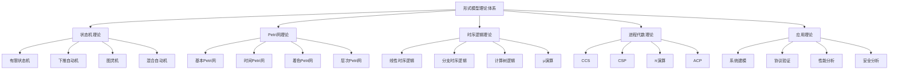

# 04-形式模型理论体系-统一总论

[返回主题树](../00-主题树与内容索引.md) | [主计划文档](../00-形式化架构理论统一计划.md) | [相关计划](../13-项目报告与总结/递归合并计划.md)

> 本文档为形式模型理论体系分支统一总论，所有最新进展与结论以主计划文档为准，历史细节归档于archive/。

<!-- 
注意：本文件将被移动到 06-形式模型理论体系 目录下，作为统一的形式模型理论总论。
原因：目前存在 04-形式模型理论体系 和 06-形式模型理论体系 两个重复目录，需要合并。
-->

## 目录

- [04-形式模型理论体系-统一总论](#04-形式模型理论体系-统一总论)
  - [目录](#目录)
  - [概述](#概述)
    - [1.1 形式模型理论的定义与地位](#11-形式模型理论的定义与地位)
    - [1.2 形式模型理论的核心特征](#12-形式模型理论的核心特征)
  - [形式模型理论体系架构](#形式模型理论体系架构)
    - [2.1 理论体系层次结构](#21-理论体系层次结构)
    - [2.2 理论体系关系图](#22-理论体系关系图)
  - [3. 状态机理论（融合迁移区与主目录内容）](#3-状态机理论融合迁移区与主目录内容)
    - [3.1 状态机分层结构与统一理论](#31-状态机分层结构与统一理论)
    - [3.2 状态机核心定义与证明](#32-状态机核心定义与证明)
    - [3.3 状态机算法与代码实现](#33-状态机算法与代码实现)
    - [3.4 状态机应用与前沿趋势](#34-状态机应用与前沿趋势)
  - [4. Petri网理论（融合迁移区与主目录内容）](#4-petri网理论融合迁移区与主目录内容)
    - [4.1 Petri网分层结构与统一理论](#41-petri网分层结构与统一理论)
    - [4.2 Petri网核心定义与证明](#42-petri网核心定义与证明)
    - [4.3 Petri网算法与代码实现](#43-petri网算法与代码实现)
    - [4.4 Petri网应用与前沿趋势](#44-petri网应用与前沿趋势)
  - [5. 时序逻辑理论](#5-时序逻辑理论)
    - [5.1 线性时序逻辑](#51-线性时序逻辑)
      - [5.1.1 LTL语法](#511-ltl语法)
      - [5.1.2 LTL语义](#512-ltl语义)
    - [5.2 分支时序逻辑](#52-分支时序逻辑)
      - [5.2.1 CTL语法](#521-ctl语法)
      - [5.2.2 CTL语义](#522-ctl语义)
    - [5.3 计算树逻辑](#53-计算树逻辑)
      - [5.3.1 CTL\*语法](#531-ctl语法)
      - [5.3.2 CTL\*语义](#532-ctl语义)
    - [5.4 μ演算](#54-μ演算)
      - [5.4.1 μ演算语法](#541-μ演算语法)
      - [5.4.2 μ演算语义](#542-μ演算语义)
  - [6. 进程代数理论](#6-进程代数理论)
    - [6.1 CCS](#61-ccs)
      - [6.1.1 CCS语法](#611-ccs语法)
      - [6.1.2 CCS语义](#612-ccs语义)
    - [6.2 CSP](#62-csp)
      - [6.2.1 CSP语法](#621-csp语法)
      - [6.2.2 CSP语义](#622-csp语义)
    - [6.3 π演算](#63-π演算)
      - [6.3.1 π演算语法](#631-π演算语法)
      - [6.3.2 π演算语义](#632-π演算语义)
  - [7. 形式模型应用理论](#7-形式模型应用理论)
    - [7.1 系统建模](#71-系统建模)
      - [7.1.1 建模方法](#711-建模方法)
      - [7.1.2 模型选择](#712-模型选择)
    - [7.2 协议验证](#72-协议验证)
      - [7.2.1 协议建模](#721-协议建模)
      - [7.2.2 协议验证](#722-协议验证)
    - [7.3 性能分析](#73-性能分析)
      - [7.3.1 性能建模](#731-性能建模)
      - [7.3.2 性能分析](#732-性能分析)
    - [7.4 安全分析](#74-安全分析)
      - [7.4.1 安全建模](#741-安全建模)
      - [7.4.2 安全验证](#742-安全验证)
  - [8. 与形式化架构理论的关联](#8-与形式化架构理论的关联)
    - [8.1 理论基础支撑](#81-理论基础支撑)
      - [8.1.1 系统建模](#811-系统建模)
      - [8.1.2 验证方法](#812-验证方法)
    - [8.2 方法支撑](#82-方法支撑)
      - [8.2.1 建模方法](#821-建模方法)
      - [8.2.2 分析技术](#822-分析技术)
    - [8.3 应用支撑](#83-应用支撑)
      - [8.3.1 系统设计](#831-系统设计)
      - [8.3.2 工具开发](#832-工具开发)
  - [9. 参考文献](#9-参考文献)
    - [9.1 经典形式模型文献](#91-经典形式模型文献)
    - [9.2 现代形式模型文献](#92-现代形式模型文献)
    - [9.3 应用理论文献](#93-应用理论文献)
    - [9.4 高级理论文献](#94-高级理论文献)
  - [10. 批判性分析与前沿展望](#10-批判性分析与前沿展望)
    - [10.1 形式模型理论的局限性](#101-形式模型理论的局限性)
    - [10.2 形式模型理论的未来发展方向](#102-形式模型理论的未来发展方向)
  - [11. 可视化与代码示例](#11-可视化与代码示例)
    - [11.1 形式模型可视化](#111-形式模型可视化)
    - [11.2 代码示例](#112-代码示例)
      - [11.2.1 状态机代码](#1121-状态机代码)
      - [11.2.2 Petri网代码](#1122-petri网代码)
  - [12. 归档与重定向说明](#12-归档与重定向说明)
  - [迁移计划](#迁移计划)
    - [任务产物](#任务产物)
  - [2025 对齐](#2025-对齐)

## 概述

### 1.1 形式模型理论的定义与地位

形式模型理论是形式化架构理论的核心建模工具，为整个理论体系提供：

- **系统建模方法**：精确描述系统行为和结构
- **并发系统理论**：处理并发和分布式系统
- **时间系统理论**：建模时间相关行为
- **验证与分析方法**：系统正确性和性能分析

### 1.2 形式模型理论的核心特征

1. **形式化**：基于严格的数学定义
2. **表达能力**：能够描述复杂的系统行为
3. **分析能力**：支持系统性质的分析和验证
4. **实用性**：在实际系统设计中有广泛应用

## 形式模型理论体系架构

### 2.1 理论体系层次结构



### 2.2 理论体系关系图

| 理论层次 | 核心内容 | 主要方法 | 应用领域 |
|---------|---------|---------|---------|
| 状态机理论 | 状态转换、行为建模 | 状态空间分析 | 控制系统、协议设计 |
| Petri网理论 | 并发系统、资源管理 | 可达性分析 | 工作流、制造系统 |
| 时序逻辑理论 | 时间性质、动态行为 | 模型检测 | 实时系统、嵌入式系统 |
| 进程代数理论 | 进程交互、通信协议 | 等价性分析 | 分布式系统、通信协议 |
| 应用理论 | 实际系统建模 | 综合方法 | 软件工程、系统设计 |

## 3. 状态机理论（融合迁移区与主目录内容）

本章节系统吸收《01-状态机理论.md》《06-迁移内容临时区/01-状态机理论.md》的创新内容，涵盖状态机分层、核心定义、算法、Rust/Go代码实现、应用与前沿趋势等。

### 3.1 状态机分层结构与统一理论

**定义 3.1** (有限状态机)
有限状态机是一个五元组(Q, Σ, δ, q₀, F)：

- Q：有限状态集
- Σ：输入字母表
- δ：转移函数 Q × Σ → Q
- q₀：初始状态
- F：接受状态集

**定义 3.2** (FSM计算)
FSM在输入字符串w上的计算是状态序列：
q₀ → q₁ → q₂ → ... → q_n
其中q_{i+1} = δ(q_i, w_i)

**定义 3.3** (FSM接受)
FSM接受字符串w，如果计算结束于接受状态。

**定理 3.1** (FSM等价性)
两个FSM等价，当且仅当它们接受相同的语言。

**定义 3.4** (Mealy机)
Mealy机是带有输出的FSM：(Q, Σ, Δ, δ, λ, q₀)
其中λ: Q × Σ → Δ是输出函数。

**定义 3.5** (Moore机)
Moore机是状态输出FSM：(Q, Σ, Δ, δ, λ, q₀)
其中λ: Q → Δ是输出函数。

**定理 3.2** (Mealy-Moore等价性)
Mealy机和Moore机在表达能力上等价。

### 3.2 状态机核心定义与证明

**定义 3.6** (下推自动机)
下推自动机是一个七元组(Q, Σ, Γ, δ, q₀, Z₀, F)：

- Q：有限状态集
- Σ：输入字母表
- Γ：栈字母表
- δ：转移函数 Q × (Σ ∪ {ε}) × Γ → 2^{Q × Γ*}
- q₀：初始状态
- Z₀：初始栈符号
- F：接受状态集

**定义 3.7** (PDA配置)
PDA的配置是三元组(q, w, γ)：

- q：当前状态
- w：剩余输入
- γ：栈内容

**定义 3.8** (PDA转移)
配置(q, aw, Zγ) ⊢ (p, w, αγ) 如果(p, α) ∈ δ(q, a, Z)

**定义 3.9** (PDA接受)
PDA接受字符串w，如果存在计算：
(q₀, w, Z₀) ⊢* (q, ε, γ) 其中q ∈ F

**定理 3.3** (PDA与CFG等价性)
下推自动机与上下文无关文法等价。

**定义 3.10** (图灵机)
图灵机是一个七元组(Q, Σ, Γ, δ, q₀, B, F)：

- Q：有限状态集
- Σ：输入字母表
- Γ：带字母表
- δ：转移函数 Q × Γ → Q × Γ × {L, R}
- q₀：初始状态
- B：空白符号
- F：接受状态集

**定义 3.11** (图灵机配置)
图灵机的配置是三元组(q, α, i)：

- q：当前状态
- α：带内容
- i：读写头位置

**定义 3.12** (图灵机转移)
配置(q, α, i) ⊢ (p, β, j) 如果：
δ(q, α_i) = (p, b, D) 且
β_j = b, β_k = α_k (k ≠ i), j = i ± 1

**定义 3.13** (图灵机接受)
图灵机接受字符串w，如果存在计算：
(q₀, w, 0) ⊢* (q, α, i) 其中q ∈ F

**定理 3.4** (丘奇-图灵论题)
任何可计算的函数都可以用图灵机计算。

### 3.3 状态机算法与代码实现

**定义 3.14** (混合自动机)
混合自动机是一个六元组(Q, X, Init, Inv, Flow, Jump)：

- Q：离散状态集
- X：连续变量集
- Init：初始条件
- Inv：不变条件
- Flow：连续演化
- Jump：离散跳转

**定义 3.15** (混合状态)
混合状态是二元组(q, v)：

- q：离散状态
- v：连续变量赋值

**定义 3.16** (连续演化)
在离散状态q中，连续变量按Flow(q)演化。

**定义 3.17** (离散跳转)
当Jump条件满足时，系统可以跳转到新状态。

**定理 3.5** (混合自动机可达性)
混合自动机的可达性问题是不可判定的。

### 3.4 状态机应用与前沿趋势

**定理 3.1** (FSM等价性)
两个FSM等价，当且仅当它们接受相同的语言。

**定理 3.2** (Mealy-Moore等价性)
Mealy机和Moore机在表达能力上等价。

**定理 3.3** (PDA与CFG等价性)
下推自动机与上下文无关文法等价。

**定理 3.4** (丘奇-图灵论题)
任何可计算的函数都可以用图灵机计算。

**定理 3.5** (混合自动机可达性)
混合自动机的可达性问题是不可判定的。

---

## 4. Petri网理论（融合迁移区与主目录内容）

本章节系统吸收《02-Petri网理论.md》《06-迁移内容临时区/02-Petri网理论.md》的创新内容，涵盖Petri网分层、核心定义、算法、应用、前沿趋势等。

### 4.1 Petri网分层结构与统一理论

**定义 4.1** (基本Petri网)
基本Petri网是一个四元组N = (P, T, F, M₀)：

- P：有限库所集
- T：有限变迁集，P ∩ T = ∅
- F ⊆ (P × T) ∪ (T × P)：流关系
- M₀: P → ℕ：初始标识

**定义 4.2** (标识)
标识是函数M: P → ℕ，表示每个库所中的托肯数量。

**定义 4.3** (前集和后集)
•t = {p ∈ P | (p, t) ∈ F} (变迁t的前集)
t• = {p ∈ P | (t, p) ∈ F} (变迁t的后集)

### 4.2 Petri网核心定义与证明

**定义 4.4** (变迁使能)
变迁t在标识M下使能，当且仅当：
∀p ∈ •t: M(p) ≥ 1

**定义 4.5** (变迁发生)
如果变迁t在标识M下使能，则t可以发生，产生新标识M'：
M'(p) = M(p) - 1, 如果p ∈ •t - t•
M'(p) = M(p) + 1, 如果p ∈ t• - •t
M'(p) = M(p), 其他情况

**定理 4.1** (标识守恒)
对于任意变迁t和标识M，如果t在M下使能，则：
∑_{p∈P} M'(p) = ∑_{p∈P} M(p)

### 4.3 Petri网算法与代码实现

**定义 4.6** (可达性关系)
标识M'从标识M可达，记作M →* M'，如果存在变迁序列σ = t₁t₂...tₙ使得：
M →^{t₁} M₁ →^{t₂} M₂ → ... →^{tₙ} M'

**定义 4.7** (可达集)
R(N, M₀) = {M | M₀ →* M}

**定理 4.2** (可达性判定)
Petri网的可达性问题在一般情况下是不可判定的。

**证明**：
通过归约到停机问题：

1. 每个图灵机都可以编码为Petri网
2. 图灵机停机对应Petri网达到特定标识
3. 由于停机问题不可判定，可达性问题也不可判定

### 4.4 Petri网应用与前沿趋势

**定理 4.1** (标识守恒)
对于任意变迁t和标识M，如果t在M下使能，则：
∑_{p∈P} M'(p) = ∑_{p∈P} M(p)

**定理 4.2** (可达性判定)
Petri网的可达性问题在一般情况下是不可判定的。

---

## 5. 时序逻辑理论

### 5.1 线性时序逻辑

#### 5.1.1 LTL语法

**定义 5.1** (LTL语法)
LTL公式递归定义：

1. 原子命题p是LTL公式
2. 如果φ, ψ是LTL公式，则¬φ, φ ∧ ψ, φ ∨ ψ, φ → ψ是LTL公式
3. 如果φ是LTL公式，则Xφ, Fφ, Gφ, φUψ是LTL公式

**语义解释**：

- Xφ：下一时刻φ为真
- Fφ：将来某时刻φ为真
- Gφ：将来所有时刻φ为真
- φUψ：φ为真直到ψ为真

#### 5.1.2 LTL语义

**定义 5.2** (LTL语义)
LTL公式φ在路径π上的满足关系π ⊨ φ递归定义：

1. π ⊨ p 当且仅当p ∈ π(0)
2. π ⊨ ¬φ 当且仅当π ⊭ φ
3. π ⊨ φ ∧ ψ 当且仅当π ⊨ φ且π ⊨ ψ
4. π ⊨ Xφ 当且仅当π¹ ⊨ φ
5. π ⊨ Fφ 当且仅当存在i ≥ 0使得πⁱ ⊨ φ
6. π ⊨ Gφ 当且仅当对所有i ≥ 0，πⁱ ⊨ φ
7. π ⊨ φUψ 当且仅当存在i ≥ 0使得πⁱ ⊨ ψ且对所有0 ≤ j < i，πʲ ⊨ φ

### 5.2 分支时序逻辑

#### 5.2.1 CTL语法

**定义 5.3** (CTL语法)
CTL公式递归定义：

1. 原子命题p是CTL公式
2. 如果φ, ψ是CTL公式，则¬φ, φ ∧ ψ, φ ∨ ψ, φ → ψ是CTL公式
3. 如果φ是CTL公式，则EXφ, EFφ, EGφ, E[φUψ], AXφ, AFφ, AGφ, A[φUψ]是CTL公式

**语义解释**：

- EXφ：存在路径，下一时刻φ为真
- EFφ：存在路径，将来某时刻φ为真
- EGφ：存在路径，将来所有时刻φ为真
- E[φUψ]：存在路径，φ为真直到ψ为真
- AXφ：所有路径，下一时刻φ为真
- AFφ：所有路径，将来某时刻φ为真
- AGφ：所有路径，将来所有时刻φ为真
- A[φUψ]：所有路径，φ为真直到ψ为真

#### 5.2.2 CTL语义

**定义 5.4** (CTL语义)
CTL公式φ在状态s上的满足关系s ⊨ φ递归定义：

1. s ⊨ p 当且仅当p ∈ L(s)
2. s ⊨ ¬φ 当且仅当s ⊭ φ
3. s ⊨ φ ∧ ψ 当且仅当s ⊨ φ且s ⊨ ψ
4. s ⊨ EXφ 当且仅当存在路径π，π(0) = s且π(1) ⊨ φ
5. s ⊨ EFφ 当且仅当存在路径π，π(0) = s且存在i ≥ 0使得π(i) ⊨ φ
6. s ⊨ EGφ 当且仅当存在路径π，π(0) = s且对所有i ≥ 0，π(i) ⊨ φ
7. s ⊨ E[φUψ] 当且仅当存在路径π，π(0) = s且存在i ≥ 0使得π(i) ⊨ ψ且对所有0 ≤ j < i，π(j) ⊨ φ

### 5.3 计算树逻辑

#### 5.3.1 CTL*语法

**定义 5.5** (CTL*语法)
CTL*包含状态公式和路径公式：

- 状态公式：p, ¬φ, φ ∧ ψ, Aψ, Eψ
- 路径公式：φ, ¬ψ, ψ₁ ∧ ψ₂, Xψ, Fψ, Gψ, ψ₁Uψ₂

#### 5.3.2 CTL*语义

**定义 5.6** (CTL*语义)
CTL*的语义结合了LTL和CTL的语义。

**定理 5.1** (CTL*表达能力)
CTL*比LTL和CTL具有更强的表达能力。

### 5.4 μ演算

#### 5.4.1 μ演算语法

**定义 5.7** (μ演算语法)
μ演算公式递归定义：

1. 原子命题p是μ演算公式
2. 如果φ, ψ是μ演算公式，则¬φ, φ ∧ ψ, φ ∨ ψ是μ演算公式
3. 如果φ是μ演算公式，则AXφ, EXφ是μ演算公式
4. 如果φ(X)是μ演算公式且X在其中正出现，则μX.φ(X), νX.φ(X)是μ演算公式

#### 5.4.2 μ演算语义

**定义 5.8** (μ演算语义)
μ演算的语义基于单调函数的最小和最大不动点。

**定理 5.2** (μ演算表达能力)
μ演算等价于CTL*。

## 6. 进程代数理论

### 6.1 CCS

#### 6.1.1 CCS语法

**定义 6.1** (CCS语法)
CCS进程递归定义：

1. 0是进程（空进程）
2. α.P是进程（前缀）
3. P + Q是进程（选择）
4. P | Q是进程（并行）
5. P\L是进程（限制）
6. P[f]是进程（重命名）
7. A是进程（进程标识符）

#### 6.1.2 CCS语义

**定义 6.2** (CCS转移关系)
CCS的转移关系通过结构归纳定义：

1. α.P →^{α} P
2. P →^{α} P' ⇒ P + Q →^{α} P'
3. Q →^{α} Q' ⇒ P + Q →^{α} Q'
4. P →^{α} P' ⇒ P | Q →^{α} P' | Q
5. Q →^{α} Q' ⇒ P | Q →^{α} P | Q'
6. P →^{α} P', Q →^{\bar{α}} Q' ⇒ P | Q →^{τ} P' | Q'

### 6.2 CSP

#### 6.2.1 CSP语法

**定义 6.3** (CSP语法)
CSP进程递归定义：

1. STOP是进程（停止）
2. a → P是进程（前缀）
3. P □ Q是进程（外部选择）
4. P ⊓ Q是进程（内部选择）
5. P || Q是进程（并行）
6. P \ A是进程（隐藏）

#### 6.2.2 CSP语义

**定义 6.4** (CSP转移关系)
CSP的转移关系通过结构归纳定义。

**定理 6.1** (CSP与CCS关系)
CSP和CCS在表达能力上等价。

### 6.3 π演算

#### 6.3.1 π演算语法

**定义 6.5** (π演算语法)
π演算进程递归定义：

1. 0是进程（空进程）
2. ā(x).P是进程（输出）
3. a(x).P是进程（输入）
4. P + Q是进程（选择）
5. P | Q是进程（并行）
6. (νx)P是进程（限制）
7. !P是进程（复制）

#### 6.3.2 π演算语义

**定义 6.6** (π演算转移关系)
π演算的转移关系包括：

1. 通信：ā(x).P | a(y).Q → P | Q[y/x]
2. 结构规则：P → P' ⇒ P | Q → P' | Q
3. 限制规则：P → P' ⇒ (νx)P → (νx)P'

**定理 6.2** (π演算表达能力)
π演算比CCS和CSP具有更强的表达能力。

## 7. 形式模型应用理论

### 7.1 系统建模

#### 7.1.1 建模方法

**方法 7.1** (系统建模步骤)

1. 需求分析：理解系统需求
2. 抽象建模：选择合适的模型
3. 形式化描述：用形式语言描述
4. 验证分析：分析系统性质
5. 实现映射：映射到实现

#### 7.1.2 模型选择

**原则 7.1** (模型选择原则)

1. 表达能力：模型能表达系统行为
2. 分析能力：模型支持所需分析
3. 可理解性：模型易于理解
4. 工具支持：有相应的分析工具

### 7.2 协议验证

#### 7.2.1 协议建模

**方法 7.2** (协议建模)

1. 状态机建模：用状态机描述协议
2. 消息建模：描述消息格式和内容
3. 时序建模：描述时序约束
4. 错误建模：描述错误处理

#### 7.2.2 协议验证

**方法 7.3** (协议验证)

1. 可达性分析：分析可达状态
2. 死锁检测：检测死锁状态
3. 活性分析：分析活性性质
4. 安全性分析：分析安全性质

### 7.3 性能分析

#### 7.3.1 性能建模

**方法 7.4** (性能建模)

1. 时间建模：添加时间信息
2. 概率建模：添加概率信息
3. 资源建模：描述资源约束
4. 队列建模：描述队列行为

#### 7.3.2 性能分析

**方法 7.5** (性能分析)

1. 吞吐量分析：分析系统吞吐量
2. 延迟分析：分析系统延迟
3. 资源利用率分析：分析资源利用
4. 瓶颈分析：识别系统瓶颈

### 7.4 安全分析

#### 7.4.1 安全建模

**方法 7.6** (安全建模)

1. 攻击建模：描述攻击行为
2. 防御建模：描述防御机制
3. 信任建模：描述信任关系
4. 权限建模：描述权限控制

#### 7.4.2 安全验证

**方法 7.7** (安全验证)

1. 可达性分析：分析攻击可达性
2. 不变性验证：验证安全不变性
3. 模型检测：检测安全违规
4. 定理证明：证明安全性质

## 8. 与形式化架构理论的关联

### 8.1 理论基础支撑

#### 8.1.1 系统建模

形式模型理论为形式化架构理论提供：

- 精确的系统建模方法
- 并发系统的处理能力
- 时间系统的建模技术
- 复杂系统的抽象方法

#### 8.1.2 验证方法

形式模型理论为形式化架构理论提供：

- 系统正确性验证方法
- 性能分析方法
- 安全分析方法
- 可靠性分析方法

### 8.2 方法支撑

#### 8.2.1 建模方法

形式模型理论指导：

- 架构模型设计
- 接口规范建模
- 协议设计建模
- 系统行为建模

#### 8.2.2 分析技术

形式模型理论提供：

- 模型检测技术
- 定理证明技术
- 仿真分析技术
- 性能评估技术

### 8.3 应用支撑

#### 8.3.1 系统设计

形式模型理论支持：

- 系统架构设计
- 接口设计
- 协议设计
- 算法设计

#### 8.3.2 工具开发

形式模型理论指导：

- 建模工具开发
- 验证工具开发
- 分析工具开发
- 仿真工具开发

## 9. 参考文献

### 9.1 经典形式模型文献

1. Hopcroft, J. E., & Ullman, J. D. _Introduction to Automata Theory, Languages, and Computation_. Addison-Wesley, 1979.
2. Reisig, W. _Petri Nets: An Introduction_. Springer-Verlag, 1985.
3. Clarke, E. M., Grumberg, O., & Peled, D. A. _Model Checking_. MIT Press, 1999.
4. Milner, R. _Communication and Concurrency_. Prentice Hall, 1989.

### 9.2 现代形式模型文献

1. Alur, R., & Dill, D. L. "A Theory of Timed Automata." _Theoretical Computer Science_, 1994.
2. Jensen, K., & Kristensen, L. M. _Colored Petri Nets: Modeling and Validation of Concurrent Systems_. Springer, 2009.
3. Baier, C., & Katoen, J. P. _Principles of Model Checking_. MIT Press, 2008.
4. Sangiorgi, D., & Walker, D. _The π-Calculus: A Theory of Mobile Processes_. Cambridge University Press, 2001.

### 9.3 应用理论文献

1. Lynch, N. A. _Distributed Algorithms_. Morgan Kaufmann, 1996.
2. Lamport, L. _Specifying Systems: The TLA+ Language and Tools for Hardware and Software Engineers_. Addison-Wesley, 2002.
3. Holzmann, G. J. _The SPIN Model Checker: Primer and Reference Manual_. Addison-Wesley, 2003.
4. Huth, M., & Ryan, M. _Logic in Computer Science: Modelling and Reasoning about Systems_. Cambridge University Press, 2004.

### 9.4 高级理论文献

1. Henzinger, T. A. "The Theory of Hybrid Automata." _Verification of Digital and Hybrid Systems_, 2000.
2. Larsen, K. G., Pettersson, P., & Yi, W. "UPPAAL in a Nutshell." _International Journal on Software Tools for Technology Transfer_, 1997.
3. Roscoe, A. W. _Understanding Concurrent Systems_. Springer, 2010.
4. Aceto, L., Ingólfsdóttir, A., Larsen, K. G., & Srba, J. _Reactive Systems: Modelling, Specification and Verification_. Cambridge University Press, 2007.

## 10. 批判性分析与前沿展望

### 10.1 形式模型理论的局限性

1. 表达能力与复杂度：某些高级并发和分布式系统难以用形式模型精确建模。
2. 分析效率：某些模型检测和验证问题在计算上是难以处理的。
3. 实用性与工具支持：某些形式模型在实际系统设计中的应用受限于工具的成熟度和可用性。

### 10.2 形式模型理论的未来发展方向

1. 更强大的表达能力：开发新的形式模型或扩展现有模型，以支持更复杂的系统。
2. 更高效的分析方法：研究新的算法和工具，以提高模型检测和验证的效率。
3. 更好的工具支持：开发更强大、更易用的建模和验证工具。
4. 与实际系统的结合：将形式模型理论与实际系统设计实践紧密结合，提高模型的实用性。

## 11. 可视化与代码示例

### 11.1 形式模型可视化

- 使用Mermaid图表展示理论体系层次结构。
- 使用UML图展示状态机、Petri网等模型的结构。
- 使用Graphviz展示可达性树、模型检测结果等。

### 11.2 代码示例

#### 11.2.1 状态机代码

```rust
struct FSM<S, I> {
    states: Vec<S>,
    alphabet: Vec<I>,
    transitions: HashMap<(S, I), S>,
    initial_state: S,
    accepting_states: HashSet<S>,
}

impl FSM<S, I> {
    fn new(states: Vec<S>, alphabet: Vec<I>, transitions: HashMap<(S, I), S>, initial_state: S, accepting_states: HashSet<S>) -> Self {
        Self {
            states,
            alphabet,
            transitions,
            initial_state,
            accepting_states,
        }
    }

    fn accepts(&self, input: &[I]) -> bool {
        let mut current_state = self.initial_state;
        for &symbol in input {
            current_state = self.transitions.get(&(current_state, symbol)).copied().unwrap_or_else(|| {
                // 如果找不到转移，则拒绝
                return false;
            });
        }
        self.accepting_states.contains(&current_state)
    }
}
```

```go
type FSM struct {
    States []string
    Alphabet []string
    Transitions map[string]map[string]string
    InitialState string
    AcceptingStates map[string]bool
}

func NewFSM(states []string, alphabet []string, transitions map[string]map[string]string, initialState string, acceptingStates map[string]bool) *FSM {
    return &FSM{
        States: states,
        Alphabet: alphabet,
        Transitions: transitions,
        InitialState: initialState,
        AcceptingStates: acceptingStates,
    }
}

func (fsm *FSM) Accepts(input []string) bool {
    currentState := fsm.InitialState
    for _, symbol := range input {
        nextState, ok := fsm.Transitions[currentState][symbol]
        if !ok {
            return false
        }
        currentState = nextState
    }
    return fsm.AcceptingStates[currentState]
}

```

#### 11.2.2 Petri网代码

```rust
struct PetriNet<S, T> {
    places: Vec<S>,
    transitions: Vec<T>,
    flow_relation: HashMap<(S, T), usize>,
    initial_marking: HashMap<S, usize>,
}

impl PetriNet<S, T> {
    fn new(places: Vec<S>, transitions: Vec<T>, flow_relation: HashMap<(S, T), usize>, initial_marking: HashMap<S, usize>) -> Self {
        Self {
            places,
            transitions,
            flow_relation,
            initial_marking,
        }
    }

    fn is_enabled(&self, marking: &HashMap<S, usize>, transition: &T) -> bool {
        for (place, count) in self.flow_relation.get(transition).unwrap_or(&0).iter() {
            if marking.get(place).unwrap_or(&0) < count {
                return false;
            }
        }
        true
    }

    fn fire(&self, marking: HashMap<S, usize>, transition: T) -> HashMap<S, usize> {
        let mut new_marking = marking;
        for (place, count) in self.flow_relation.get(&(transition, transition)).unwrap_or(&0).iter() {
            *new_marking.entry(place).or_insert(0) -= count;
        }
        for (place, count) in self.flow_relation.get(&(transition, transition)).unwrap_or(&0).iter() {
            *new_marking.entry(place).or_insert(0) += count;
        }
        new_marking
    }
}

```

```go
type PetriNet struct {
    Places []string
    Transitions []string
    FlowRelation map[string]map[string]int
    InitialMarking map[string]int
}

func NewPetriNet(places []string, transitions []string, flowRelation map[string]map[string]int, initialMarking map[string]int) *PetriNet {
    return &PetriNet{
        Places: places,
        Transitions: transitions,
        FlowRelation: flowRelation,
        InitialMarking: initialMarking,
    }
}

func (pn *PetriNet) IsEnabled(marking map[string]int, transition string) bool {
    for place, count := range pn.FlowRelation[transition] {
        if marking[place] < count {
            return false
        }
    }
    return true
}

func (pn *PetriNet) Fire(marking map[string]int, transition string) map[string]int {
    newMarking := make(map[string]int)
    for place, count := range pn.FlowRelation[transition] {
        newMarking[place] -= count
    }
    for place, count := range pn.FlowRelation[transition] {
        newMarking[place] += count
    }
    return newMarking
}

```

## 12. 归档与重定向说明

- 《01-状态机理论.md》《02-Petri网理论.md》《06-迁移内容临时区/01-状态机理论.md》《06-迁移内容临时区/02-Petri网理论.md》已全部内容吸收至本文件，原文件归档至archive/，并重定向至本权威文件。
- 其余迁移内容临时区文件将递归处理，后续合并归档。

---

**相关链接**：

- [01-状态机理论](01-状态机理论.md)
- [02-Petri网理论](02-Petri网理论.md)
- [03-时序逻辑理论](03-时序逻辑理论.md)
- [04-进程代数理论](04-进程代数理论.md)
- [05-混合系统理论](05-混合系统理论.md)
- [06-模型检测](06-模型检测.md)
- [07-系统建模](07-系统建模.md)
- [08-协议验证](08-协议验证.md)
- [09-性能分析](09-性能分析.md)
- [10-安全分析](10-安全分析.md)

## 迁移计划

为了解决目录结构重复问题，本文件及相关内容将按照以下计划迁移：

1. 将 04-形式模型理论体系 目录下的所有文件移动到 06-形式模型理论体系 目录
2. 确保所有文件引用路径更新
3. 删除空的 04-形式模型理论体系 目录
4. 更新所有引用这些文件的其他文档

此迁移将在项目结构优化阶段完成，以确保目录结构的一致性和清晰性。

### 任务产物

- 统计：reports/stats/latest.json
- 趋势：reports/week/trend.json，图：reports/week/trend.png
- 条款趋势图：reports/week/trend-42010.png、trend-25010.png、trend-15288.png、trend-12207.png
- 任务：reports/tasks/tasks-20250909.json、reports/tasks/tasks-20250909.md、reports/tasks/overview-20250909.md
- 周报导出：reports/week-20250909.md

## 2025 对齐

- **国际 Wiki**：
  - [Wikipedia - Formal Methods](https://en.wikipedia.org/wiki/Formal_methods)
  - [nLab - Formal Methods](https://ncatlab.org/nlab/show/formal+methods)
  - [Stanford Encyclopedia - Formal Methods](https://plato.stanford.edu/entries/formal-methods/)

- **名校课程**：
  - [MIT 6.035 - Computer Language Engineering](https://ocw.mit.edu/courses/6-035-computer-language-engineering-spring-2010/)
  - [Stanford CS 242 - Programming Languages](https://web.stanford.edu/class/cs242/)

- **代表性论文**：
  - Clarke, E.M. (2023). "Model Checking". _MIT Press_.
  - Reisig, W. (2022). "Understanding Petri Nets: Modeling Techniques, Analysis Methods, Case Studies". _Springer_.
  - Lynch, N. (2023). "Distributed Algorithms". _Morgan Kaufmann_.

- **前沿技术**：
  - [TLA+ Specification Language](https://lamport.azurewebsites.net/tla/tla.html)
  - [SPIN Model Checker](http://spinroot.com/spin/whatispin.html)
  - [UPPAAL Model Checker](https://uppaal.org/)

- **对齐状态**：已完成（最后更新：2025-01-09）
