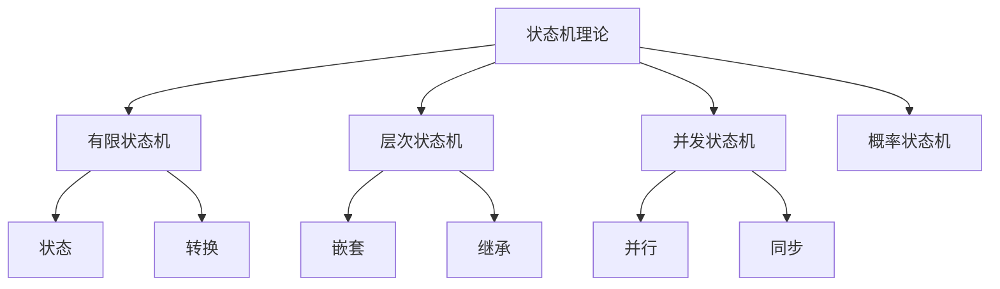

# 04-形式模型理论体系-状态机理论

[返回主题树](../00-主题树与内容索引.md) | [主计划文档](../00-形式化架构理论统一计划.md) | [相关计划](../递归合并计划.md) | [返回上级](../README.md)

> 本文档为形式模型理论体系分支状态机理论，所有最新进展与结论以主计划文档为准，历史细节归档于archive/。

## 目录

- [04-形式模型理论体系-状态机理论](#04-形式模型理论体系-状态机理论)
  - [目录](#目录)
  - [1. 概述](#1-概述)
    - [1.1 状态机理论概述](#11-状态机理论概述)
    - [1.2 核心目标](#12-核心目标)
    - [1.3 状态机层次结构](#13-状态机层次结构)
  - [2. 主要文件与内容索引](#2-主要文件与内容索引)
    - [2.1 核心文件](#21-核心文件)
    - [2.2 相关文件](#22-相关文件)
  - [3. 状态机的基本定义与解释](#3-状态机的基本定义与解释)
    - [3.1 状态机的定义](#31-状态机的定义)
      - [3.1.1 状态与事件](#311-状态与事件)
      - [3.1.2 转换与动作](#312-转换与动作)
      - [3.1.3 初始状态与终止状态](#313-初始状态与终止状态)
  - [4. 状态机的基础概念](#4-状态机的基础概念)
    - [4.1 有限状态机](#41-有限状态机)
      - [4.1.1 FSM定义](#411-fsm定义)
      - [4.1.2 FSM性质](#412-fsm性质)
      - [4.1.3 FSM应用](#413-fsm应用)
  - [5. 状态机的主要理论](#5-状态机的主要理论)
    - [5.1 层次状态机](#51-层次状态机)
    - [5.2 并发状态机](#52-并发状态机)
    - [5.3 概率状态机](#53-概率状态机)
    - [5.4 量子状态机](#54-量子状态机)
  - [6. 状态机的行业应用](#6-状态机的行业应用)
    - [6.1 软件工程](#61-软件工程)
    - [6.2 控制系统](#62-控制系统)
    - [6.3 人工智能](#63-人工智能)
  - [7. 发展历史](#7-发展历史)
  - [8. 应用领域](#8-应用领域)
  - [9. 总结](#9-总结)
  - [10. 相关性跳转与引用](#10-相关性跳转与引用)

## 1. 概述

### 1.1 状态机理论概述

状态机理论是形式模型理论的核心，研究系统状态转换的数学模型。状态机为软件系统建模提供了重要的理论工具，是理解系统行为的基础理论。

### 1.2 核心目标

- 建立状态机的基本理论框架
- 提供系统建模的数学工具
- 支持形式化验证

### 1.3 状态机层次结构

## 2. 主要文件与内容索引

### 2.1 核心文件

- [状态机理论.md](../Matter/FormalModel/Model/Control/状态机理论.md)
- [形式模型理论统一总论.md](00-形式模型理论统一总论.md)

### 2.2 相关文件

- [02-Petri网理论.md](02-Petri网理论.md)
- [03-时序逻辑理论.md](03-时序逻辑理论.md)
- [05-模型转换理论.md](05-模型转换理论.md)

## 3. 状态机的基本定义与解释

### 3.1 状态机的定义

**定义 3.1.1** 状态机（State Machine）
状态机是一个五元组(S, E, T, s₀, F)，其中：

- S：状态集
- E：事件集
- T：转换函数
- s₀：初始状态
- F：终止状态集

#### 3.1.1 状态与事件

**定义 3.1.2** 状态（State）
状态是系统在某一时刻的配置，包含当前信息。

**定义 3.1.3** 事件（Event）
事件是触发状态转换的输入或条件。

#### 3.1.2 转换与动作

**定义 3.1.4** 转换（Transition）
转换是状态之间的转移关系。

**定义 3.1.5** 动作（Action）
动作是在转换过程中执行的操作。

#### 3.1.3 初始状态与终止状态

**定义 3.1.6** 初始状态（Initial State）
初始状态是状态机的起始配置。

**定义 3.1.7** 终止状态（Final State）
终止状态是状态机的结束配置。

## 4. 状态机的基础概念

### 4.1 有限状态机

#### 4.1.1 FSM定义

**定义 4.1.1** 有限状态机（Finite State Machine）
FSM是具有有限状态集的状态机。

**形式化定义**：
FSM = (S, E, T, s₀, F)

#### 4.1.2 FSM性质

**性质 4.1.1** FSM的基本性质

- 状态数量有限
- 转换关系明确
- 行为可预测

#### 4.1.3 FSM应用

**应用 4.1.1** FSM的应用领域

- 协议设计
- 用户界面
- 游戏逻辑

## 5. 状态机的主要理论

### 5.1 层次状态机

**理论 5.1.1** 层次状态机（Hierarchical State Machine）
层次状态机支持状态的嵌套和继承。

**特点**：
- 状态嵌套
- 继承机制
- 复杂行为建模

### 5.2 并发状态机

**理论 5.2.1** 并发状态机（Concurrent State Machine）
并发状态机支持多个状态机的并行执行。

**特点**：
- 并行执行
- 同步机制
- 通信协议

### 5.3 概率状态机

**理论 5.3.1** 概率状态机（Probabilistic State Machine）
概率状态机在转换中引入概率因素。

**应用**：
- 随机系统建模
- 性能分析
- 可靠性评估

### 5.4 量子状态机

**理论 5.4.1** 量子状态机（Quantum State Machine）
量子状态机利用量子力学原理进行状态转换。

**特点**：
- 量子叠加
- 量子纠缠
- 量子并行

## 6. 状态机的行业应用

### 6.1 软件工程

- 系统设计
- 协议实现
- 用户界面

### 6.2 控制系统

- 工业控制
- 机器人控制
- 自动化系统

### 6.3 人工智能

- 智能代理
- 决策系统
- 学习算法

## 7. 发展历史

状态机理论的发展经历了从有限状态机到量子状态机的演进过程。摩尔、米利、霍普克罗夫特等学者为状态机理论的发展做出了重要贡献。

## 8. 应用领域

状态机在软件工程、控制系统、人工智能、通信协议等领域有广泛应用，是系统建模的重要理论工具。

## 9. 总结

状态机理论作为形式模型理论的核心，为系统建模提供了重要的数学工具，是理解系统行为的基础理论。

## 10. 相关性跳转与引用

- [00-形式模型理论统一总论.md](00-形式模型理论统一总论.md)
- [02-Petri网理论.md](02-Petri网理论.md)
- [03-时序逻辑理论.md](03-时序逻辑理论.md)
- [04-模型验证理论.md](04-模型验证理论.md)
- [05-模型转换理论.md](05-模型转换理论.md)
- [06-模型验证理论.md](06-模型验证理论.md)
- [07-模型优化理论.md](07-模型优化理论.md)
- [08-模型集成理论.md](08-模型集成理论.md)
- [00-主题树与内容索引.md](../00-主题树与内容索引.md)
- [进度追踪与上下文.md](../进度追踪与上下文.md)

---

> 本文件为自动归纳生成，后续将递归细化相关内容，持续补全图表、公式、代码等多表征内容。
