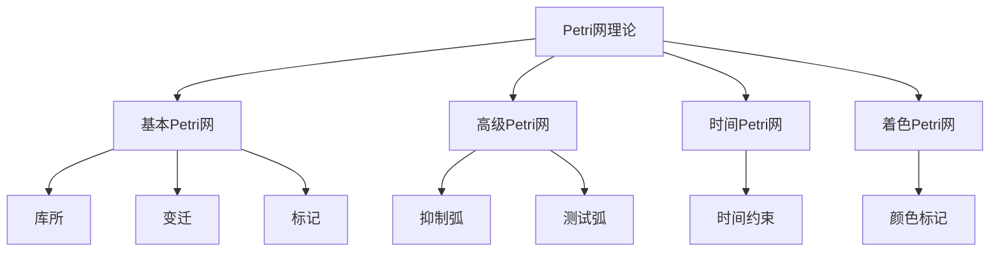

# 04-形式模型理论体系-Petri网理论

[返回主题树](../00-主题树与内容索引.md) | [主计划文档](../00-形式化架构理论统一计划.md) | [相关计划](../递归合并计划.md) | [返回上级](../README.md)

> 本文档为形式模型理论体系分支Petri网理论，所有最新进展与结论以主计划文档为准，历史细节归档于archive/。

## 目录

- [04-形式模型理论体系-Petri网理论](#04-形式模型理论体系-petri网理论)
  - [1. 概述](#1-概述)
    - [1.1 Petri网理论概述](#11-petri网理论概述)
    - [1.2 核心目标](#12-核心目标)
    - [1.3 Petri网层次结构](#13-petri网层次结构)
  - [2. 主要文件与内容索引](#2-主要文件与内容索引)
    - [2.1 核心文件](#21-核心文件)
    - [2.2 相关文件](#22-相关文件)
  - [3. Petri网的基本定义与解释](#3-petri网的基本定义与解释)
    - [3.1 Petri网的定义](#31-petri网的定义)
      - [3.1.1 基本元素](#311-基本元素)
      - [3.1.2 网结构](#312-网结构)
      - [3.1.3 标记](#313-标记)
  - [4. Petri网的基础概念](#4-petri网的基础概念)
    - [4.1 基本Petri网](#41-基本petri网)
      - [4.1.1 变迁规则](#411-变迁规则)
      - [4.1.2 可达性](#412-可达性)
      - [4.1.3 活性](#413-活性)
  - [5. Petri网的主要理论](#5-petri网的主要理论)
    - [5.1 高级Petri网](#51-高级petri网)
    - [5.2 时间Petri网](#52-时间petri网)
    - [5.3 着色Petri网](#53-着色petri网)
    - [5.4 层次Petri网](#54-层次petri网)
  - [6. Petri网的行业应用](#6-petri网的行业应用)
    - [6.1 并发系统建模](#61-并发系统建模)
    - [6.2 工作流管理](#62-工作流管理)
    - [6.3 协议验证](#63-协议验证)
  - [7. 发展历史](#7-发展历史)
  - [8. 应用领域](#8-应用领域)
  - [9. 总结](#9-总结)
  - [10. 相关性跳转与引用](#10-相关性跳转与引用)

## 1. 概述

### 1.1 Petri网理论概述

Petri网是描述并发系统的数学工具，为形式化架构理论提供了并发建模的重要方法。Petri网不仅支撑系统分析，也是工作流管理和协议验证的重要理论基础。

### 1.2 核心目标

- 建立并发系统建模的基本理论框架
- 提供系统行为分析的形式化工具
- 支持工作流管理和协议验证应用

### 1.3 Petri网层次结构

## 2. 主要文件与内容索引

### 2.1 核心文件

- [Petri_Net_Theory.md](../Matter/FormalModel/Petri_Net_Theory.md)
- [PetriNet_Cybernetics_Distributed_Comprehensive.md](../Matter/Theory/PetriNet_Cybernetics_Distributed/PetriNet_Cybernetics_Distributed_Comprehensive.md)

### 2.2 相关文件

- [00-形式模型理论统一总论.md](00-形式模型理论统一总论.md)
- [01-状态机理论.md](01-状态机理论.md)
- [03-时序逻辑理论.md](03-时序逻辑理论.md)

## 3. Petri网的基本定义与解释

### 3.1 Petri网的定义

**定义 3.1.1** Petri网（Petri Net）
Petri网是一个三元组 N = (P, T, F)，其中：
- P：库所（places）集合
- T：变迁（transitions）集合
- F：流关系（flow relation）

#### 3.1.1 基本元素

**定义 3.1.2** 库所（Place）
库所表示系统的状态或条件，用圆圈表示。

**定义 3.1.3** 变迁（Transition）
变迁表示系统的动作或事件，用矩形表示。

#### 3.1.2 网结构

**定义 3.1.4** 流关系（Flow Relation）
流关系 F ⊆ (P × T) ∪ (T × P) 定义了库所和变迁之间的连接。

**特点**：
- 有向图结构
- 二分图性质
- 无自环

#### 3.1.3 标记

**定义 3.1.5** 标记（Marking）
标记 M: P → N 为每个库所分配令牌数量。

**特点**：
- 非负整数
- 表示系统状态
- 动态变化

## 4. Petri网的基础概念

### 4.1 基本Petri网

#### 4.1.1 变迁规则

**定义 4.1.1** 变迁使能（Enabled Transition）
变迁 t 在标记 M 下使能，当且仅当 ∀p ∈ •t: M(p) ≥ F(p,t)。

**定义 4.1.2** 变迁发生（Transition Firing）
变迁 t 的发生产生新标记 M'，其中：
- M'(p) = M(p) - F(p,t) + F(t,p)

#### 4.1.2 可达性

**定义 4.1.3** 可达性（Reachability）
标记 M' 从标记 M 可达，如果存在变迁序列使 M 变为 M'。

**性质**：
- 自反性
- 传递性
- 不可判定性

#### 4.1.3 活性

**定义 4.1.4** 活性（Liveness）
Petri网是活的，如果从任何可达标记都能使能任何变迁。

**类型**：
- 死锁
- 部分死锁
- 完全活性

## 5. Petri网的主要理论

### 5.1 高级Petri网

**理论 5.1.1** 高级Petri网（High-Level Petri Nets）
高级Petri网扩展了基本Petri网，增加了数据类型和复杂标记。

**特点**：
- 类型化标记
- 条件变迁
- 复杂数据结构

### 5.2 时间Petri网

**理论 5.2.1** 时间Petri网（Timed Petri Nets）
时间Petri网为变迁添加时间约束。

**特点**：
- 时间间隔
- 实时约束
- 性能分析

### 5.3 着色Petri网

**理论 5.3.1** 着色Petri网（Colored Petri Nets）
着色Petri网为令牌添加颜色信息。

**特点**：
- 颜色标记
- 类型安全
- 抽象层次

### 5.4 层次Petri网

**理论 5.4.1** 层次Petri网（Hierarchical Petri Nets）
层次Petri网支持模块化和层次化建模。

**特点**：
- 模块化
- 层次结构
- 可重用性

## 6. Petri网的行业应用

### 6.1 并发系统建模

- 操作系统
- 分布式系统
- 实时系统

### 6.2 工作流管理

- 业务流程
- 工作流引擎
- 过程自动化

### 6.3 协议验证

- 通信协议
- 安全协议
- 网络协议

## 7. 发展历史

Petri网理论的发展经历了从基本Petri网到高级Petri网的演进过程。卡尔·亚当·佩特里、詹森、雷斯等学者为Petri网理论的发展做出了重要贡献。

## 8. 应用领域

Petri网在并发系统建模、工作流管理、协议验证等领域有广泛应用，是现代系统理论的重要数学基础。

## 9. 总结

Petri网理论作为形式模型理论的重要分支，为形式化架构理论提供了重要的并发建模工具，是理解系统行为的基础理论。

## 10. 相关性跳转与引用

- [00-形式模型理论统一总论.md](00-形式模型理论统一总论.md)
- [01-状态机理论.md](01-状态机理论.md)
- [03-时序逻辑理论.md](03-时序逻辑理论.md)
- [04-模型检查理论.md](04-模型检查理论.md)
- [05-形式验证理论.md](05-形式验证理论.md)
- [06-系统建模理论.md](06-系统建模理论.md)
- [00-主题树与内容索引.md](../00-主题树与内容索引.md)
- [进度追踪与上下文.md](../进度追踪与上下文.md)

---

> 本文件为自动归纳生成，后续将递归细化相关内容，持续补全图表、公式、代码等多表征内容。
