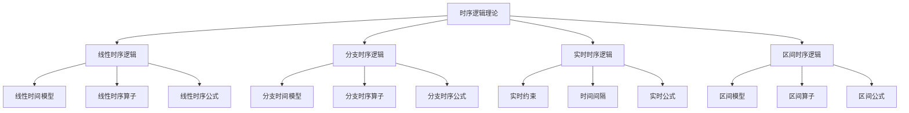

# 04-形式模型理论体系-时序逻辑理论

[返回主题树](../00-主题树与内容索引.md) | [主计划文档](../00-形式化架构理论统一计划.md) | [相关计划](../递归合并计划.md) | [返回上级](../README.md)

> 本文档为形式模型理论体系分支时序逻辑理论，所有最新进展与结论以主计划文档为准，历史细节归档于archive/。

## 目录

- [04-形式模型理论体系-时序逻辑理论](#04-形式模型理论体系-时序逻辑理论)
  - [目录](#目录)
  - [1. 概述](#1-概述)
    - [1.1 时序逻辑理论概述](#11-时序逻辑理论概述)
    - [1.2 核心目标](#12-核心目标)
    - [1.3 时序逻辑层次结构](#13-时序逻辑层次结构)
  - [2. 主要文件与内容索引](#2-主要文件与内容索引)
    - [2.1 核心文件](#21-核心文件)
    - [2.2 相关文件](#22-相关文件)
  - [3. 时序逻辑的基本定义与解释](#3-时序逻辑的基本定义与解释)
    - [3.1 时序逻辑的定义](#31-时序逻辑的定义)
      - [3.1.1 时间模型](#311-时间模型)
      - [3.1.2 时序算子](#312-时序算子)
      - [3.1.3 时序公式](#313-时序公式)
  - [4. 时序逻辑的基础概念](#4-时序逻辑的基础概念)
    - [4.1 线性时序逻辑](#41-线性时序逻辑)
      - [4.1.1 线性时间模型](#411-线性时间模型)
      - [4.1.2 线性时序算子](#412-线性时序算子)
      - [4.1.3 线性时序公式](#413-线性时序公式)
  - [5. 时序逻辑的主要理论](#5-时序逻辑的主要理论)
    - [5.1 分支时序逻辑](#51-分支时序逻辑)
    - [5.2 实时时序逻辑](#52-实时时序逻辑)
    - [5.3 区间时序逻辑](#53-区间时序逻辑)
    - [5.4 混合时序逻辑](#54-混合时序逻辑)
  - [6. 时序逻辑的行业应用](#6-时序逻辑的行业应用)
    - [6.1 程序验证](#61-程序验证)
    - [6.2 硬件验证](#62-硬件验证)
    - [6.3 协议验证](#63-协议验证)
  - [7. 发展历史](#7-发展历史)
  - [8. 应用领域](#8-应用领域)
  - [9. 总结](#9-总结)
  - [10. 相关性跳转与引用](#10-相关性跳转与引用)

## 1. 概述

### 1.1 时序逻辑理论概述

时序逻辑是研究时间相关推理的形式逻辑，为形式化架构理论提供了时间建模的重要工具。时序逻辑不仅支撑时间推理，也是程序验证和硬件验证的重要理论基础。

### 1.2 核心目标

- 建立时间推理的基本理论框架
- 提供时间建模的形式化工具
- 支持程序验证和硬件验证应用

### 1.3 时序逻辑层次结构

## 2. 主要文件与内容索引

### 2.1 核心文件

- [时序逻辑理论.md](../Matter/FormalModel/时序逻辑理论.md)
- [Temporal_Logic_Control_Comprehensive_Deepening.md](../Matter/Theory/Temporal_Logic_Control_Deepening/Temporal_Logic_Control_Comprehensive_Deepening.md)

### 2.2 相关文件

- [00-形式模型理论统一总论.md](00-形式模型理论统一总论.md)
- [01-状态机理论.md](01-状态机理论.md)
- [02-Petri网理论.md](02-Petri网理论.md)

## 3. 时序逻辑的基本定义与解释

### 3.1 时序逻辑的定义

**定义 3.1.1** 时序逻辑（Temporal Logic）
时序逻辑是研究时间相关推理的形式逻辑。

#### 3.1.1 时间模型

**定义 3.1.2** 时间模型（Temporal Model）
时间模型是描述时间结构的数学对象。

**类型**：

- 线性时间模型
- 分支时间模型
- 区间时间模型

#### 3.1.2 时序算子

**定义 3.1.3** 时序算子（Temporal Operators）
时序算子用于表达时间相关的逻辑关系。

**基本算子**：

- G（全局）
- F（未来）
- X（下一个）
- U（直到）

#### 3.1.3 时序公式

**定义 3.1.4** 时序公式（Temporal Formula）
时序公式是使用时序算子构建的逻辑公式。

**结构**：

- 原子命题
- 逻辑连接词
- 时序算子

## 4. 时序逻辑的基础概念

### 4.1 线性时序逻辑

#### 4.1.1 线性时间模型

**模型 4.1.1** 线性时间模型（Linear Temporal Model）
线性时间模型将时间视为线性序列。

**特点**：

- 时间点序列
- 全序关系
- 无限延伸

#### 4.1.2 线性时序算子

**算子 4.1.2** 线性时序算子
线性时序逻辑的基本算子：

- Gφ：φ在所有时间点都成立
- Fφ：φ在某个时间点成立
- Xφ：φ在下一个时间点成立
- φUψ：φ成立直到ψ成立

#### 4.1.3 线性时序公式

**公式 4.1.3** 线性时序公式
线性时序逻辑的公式示例：

- G(p → Fq)：如果p成立，则q最终会成立
- G(p → Xp)：如果p成立，则下一个时刻p也成立
- pUq：p成立直到q成立

## 5. 时序逻辑的主要理论

### 5.1 分支时序逻辑

**理论 5.1.1** 分支时序逻辑（Branching Temporal Logic）
分支时序逻辑考虑时间的分支结构。

**特点**：

- 分支时间模型
- 路径量词
- 不确定性建模

**算子**：

- Aφ：在所有路径上φ成立
- Eφ：在某个路径上φ成立

### 5.2 实时时序逻辑

**理论 5.2.1** 实时时序逻辑（Real-Time Temporal Logic）
实时时序逻辑添加时间约束。

**特点**：

- 时间约束
- 时间间隔
- 实时要求

**应用**：

- 实时系统
- 嵌入式系统
- 控制系统

### 5.3 区间时序逻辑

**理论 5.3.1** 区间时序逻辑（Interval Temporal Logic）
区间时序逻辑研究时间区间。

**特点**：

- 区间模型
- 区间算子
- 区间关系

**算子**：

- φ⟨ψ⟩χ：在φ成立的区间内，ψ成立直到χ成立

### 5.4 混合时序逻辑

**理论 5.4.1** 混合时序逻辑（Hybrid Temporal Logic）
混合时序逻辑结合多种时间模型。

**特点**：

- 多种时间模型
- 混合算子
- 复杂时间结构

## 6. 时序逻辑的行业应用

### 6.1 程序验证

- 程序正确性
- 死锁检测
- 活锁分析

### 6.2 硬件验证

- 电路验证
- 协议验证
- 系统验证

### 6.3 协议验证

- 通信协议
- 安全协议
- 网络协议

## 7. 发展历史

时序逻辑的发展经历了从线性时序逻辑到现代时序逻辑的演进过程。普努埃利、克拉克、埃默森等学者为时序逻辑的发展做出了重要贡献。

## 8. 应用领域

时序逻辑在程序验证、硬件验证、协议验证等领域有广泛应用，是现代形式化验证的重要理论基础。

## 9. 总结

时序逻辑理论作为形式模型理论的重要分支，为形式化架构理论提供了重要的时间建模工具，是理解时间推理的基础理论。

## 10. 相关性跳转与引用

- [00-形式模型理论统一总论.md](00-形式模型理论统一总论.md)
- [01-状态机理论.md](01-状态机理论.md)
- [02-Petri网理论.md](02-Petri网理论.md)
- [04-模型检查理论.md](04-模型检查理论.md)
- [05-形式验证理论.md](05-形式验证理论.md)
- [06-系统建模理论.md](06-系统建模理论.md)
- [00-主题树与内容索引.md](../00-主题树与内容索引.md)
- [进度追踪与上下文.md](../进度追踪与上下文.md)

---

> 本文件为自动归纳生成，后续将递归细化相关内容，持续补全图表、公式、代码等多表征内容。
