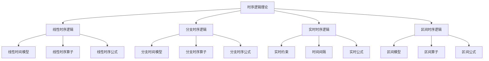

# 04-形式模型理论体系-时序逻辑理论

[返回主题树](../00-主题树与内容索引.md) | [主计划文档](../00-形式化架构理论统一计划.md) | [相关计划](../递归合并计划.md) | [返回上级](../README.md)

> 本文档为形式模型理论体系分支时序逻辑理论，所有最新进展与结论以主计划文档为准，历史细节归档于archive/。

## 目录

- [04-形式模型理论体系-时序逻辑理论](#04-形式模型理论体系-时序逻辑理论)
  - [目录](#目录)
  - [1. 概述](#1-概述)
    - [1.1 时序逻辑理论概述](#11-时序逻辑理论概述)
    - [1.2 核心目标](#12-核心目标)
    - [1.3 定义与范畴](#13-定义与范畴)
    - [1.4 时序逻辑分类](#14-时序逻辑分类)
    - [1.5 时序逻辑层次结构](#15-时序逻辑层次结构)
  - [2. 主要文件与内容索引](#2-主要文件与内容索引)
    - [2.1 核心文件](#21-核心文件)
    - [2.2 相关文件](#22-相关文件)
  - [3. 时序逻辑的基本定义与解释](#3-时序逻辑的基本定义与解释)
    - [3.1 时序逻辑的定义](#31-时序逻辑的定义)
      - [3.1.1 时间模型](#311-时间模型)
      - [3.1.2 时序算子](#312-时序算子)
      - [3.1.3 时序公式](#313-时序公式)
  - [4. 线性时序逻辑（LTL）](#4-线性时序逻辑ltl)
    - [4.1 线性时间模型](#41-线性时间模型)
    - [4.2 语法](#42-语法)
    - [4.3 语义](#43-语义)
    - [4.4 等价性](#44-等价性)
  - [5. 计算树逻辑（CTL）](#5-计算树逻辑ctl)
    - [5.1 语法](#51-语法)
    - [5.2 语义](#52-语义)
    - [5.3 CTL算子](#53-ctl算子)
  - [6. CTL\*逻辑](#6-ctl逻辑)
    - [6.1 语法](#61-语法)
    - [6.2 表达能力](#62-表达能力)
  - [7. 时序逻辑的主要理论](#7-时序逻辑的主要理论)
    - [7.1 分支时序逻辑](#71-分支时序逻辑)
    - [7.2 实时时序逻辑](#72-实时时序逻辑)
    - [7.3 区间时序逻辑](#73-区间时序逻辑)
    - [7.4 混合时序逻辑](#74-混合时序逻辑)
  - [8. 时序逻辑算法](#8-时序逻辑算法)
    - [8.1 模型检查](#81-模型检查)
    - [8.2 满足性检查](#82-满足性检查)
    - [8.3 等价性检查](#83-等价性检查)
  - [9. 时序逻辑的行业应用](#9-时序逻辑的行业应用)
    - [9.1 软件验证](#91-软件验证)
    - [9.2 硬件验证](#92-硬件验证)
    - [9.3 协议验证](#93-协议验证)
    - [9.4 系统验证](#94-系统验证)
  - [10. 发展历史与趋势](#10-发展历史与趋势)
    - [10.1 历史发展](#101-历史发展)
    - [10.2 高效算法](#102-高效算法)
    - [10.3 扩展逻辑](#103-扩展逻辑)
  - [11. 总结](#11-总结)
  - [12. 相关性跳转与引用](#12-相关性跳转与引用)

## 1. 概述

### 1.1 时序逻辑理论概述

时序逻辑是研究时间相关推理的形式逻辑，为形式化架构理论提供了时间建模的重要工具。时序逻辑不仅支撑时间推理，也是程序验证和硬件验证的重要理论基础。

### 1.2 核心目标

- 建立时间推理的基本理论框架
- 提供时间建模的形式化工具
- 支持程序验证和硬件验证应用

### 1.3 定义与范畴

时序逻辑理论是研究时间相关命题和推理的系统性理论框架。它通过时间算子来描述和验证系统在时间维度上的行为性质。

**形式化定义：**

设 $TL$ 为时序逻辑，则：
$$TL = (AP, \mathcal{F}, \models)$$

其中：

- $AP$ 为原子命题集合
- $\mathcal{F}$ 为时序公式集合
- $\models$ 为满足关系

### 1.4 时序逻辑分类

**线性时序逻辑（LTL）：**
$$LTL = (AP, \mathcal{F}_{LTL}, \models_{LTL})$$

**计算树逻辑（CTL）：**
$$CTL = (AP, \mathcal{F}_{CTL}, \models_{CTL})$$

**CTL*逻辑：**
$$CTL^* = (AP, \mathcal{F}_{CTL^*}, \models_{CTL^*})$$

### 1.5 时序逻辑层次结构

## 2. 主要文件与内容索引

### 2.1 核心文件

- [时序逻辑理论.md](../Matter/FormalModel/时序逻辑理论.md)
- [Temporal_Logic_Control_Comprehensive_Deepening.md](../Matter/Theory/Temporal_Logic_Control_Deepening/Temporal_Logic_Control_Comprehensive_Deepening.md)

### 2.2 相关文件

- [00-形式模型理论统一总论.md](00-形式模型理论统一总论.md)
- [01-状态机理论.md](01-状态机理论.md)
- [02-Petri网理论.md](02-Petri网理论.md)

## 3. 时序逻辑的基本定义与解释

### 3.1 时序逻辑的定义

**定义 3.1.1** 时序逻辑（Temporal Logic）
时序逻辑是研究时间相关推理的形式逻辑。

#### 3.1.1 时间模型

**定义 3.1.2** 时间模型（Temporal Model）
时间模型是描述时间结构的数学对象。

**类型**：

- 线性时间模型
- 分支时间模型
- 区间时间模型

#### 3.1.2 时序算子

**定义 3.1.3** 时序算子（Temporal Operators）
时序算子用于表达时间相关的逻辑关系。

**基本算子**：

- G（全局）
- F（未来）
- X（下一个）
- U（直到）

#### 3.1.3 时序公式

**定义 3.1.4** 时序公式（Temporal Formula）
时序公式是使用时序算子构建的逻辑公式。

**结构**：

- 原子命题
- 逻辑连接词
- 时序算子

## 4. 线性时序逻辑（LTL）

### 4.1 线性时间模型

**模型 4.1.1** 线性时间模型（Linear Temporal Model）
线性时间模型将时间视为线性序列。

**特点**：

- 时间点序列
- 全序关系
- 无限延伸

### 4.2 语法

**原子命题：**
$$\phi ::= p \in AP$$

**布尔算子：**
$$\phi ::= \neg \phi | \phi \land \phi | \phi \lor \phi | \phi \rightarrow \phi$$

**时序算子：**
$$\phi ::= X \phi | F \phi | G \phi | \phi U \phi | \phi R \phi$$

### 4.3 语义

**路径：**
$$\pi = s_0, s_1, s_2, ... \in S^\omega$$

**满足关系：**
$$\pi \models_{LTL} \phi$$

**时序算子语义：**

- $X \phi$ (Next): $\pi \models X \phi \iff \pi^1 \models \phi$
- $F \phi$ (Finally): $\pi \models F \phi \iff \exists i \geq 0, \pi^i \models \phi$
- $G \phi$ (Globally): $\pi \models G \phi \iff \forall i \geq 0, \pi^i \models \phi$
- $\phi U \psi$ (Until): $\pi \models \phi U \psi \iff \exists i \geq 0, \pi^i \models \psi \land \forall j < i, \pi^j \models \phi$
- $\phi R \psi$ (Release): $\pi \models \phi R \psi \iff \forall i \geq 0, \pi^i \models \psi \lor \exists j < i, \pi^j \models \phi$

### 4.4 等价性

**基本等价：**
$$\neg X \phi \equiv X \neg \phi$$
$$\neg F \phi \equiv G \neg \phi$$
$$\neg G \phi \equiv F \neg \phi$$
$$\neg (\phi U \psi) \equiv \neg \phi R \neg \psi$$

**分配律：**
$$X(\phi \land \psi) \equiv X \phi \land X \psi$$
$$F(\phi \lor \psi) \equiv F \phi \lor F \psi$$
$$G(\phi \land \psi) \equiv G \phi \land G \psi$$

## 5. 计算树逻辑（CTL）

### 5.1 语法

**状态公式：**
$$\Phi ::= p \in AP | \neg \Phi | \Phi \land \Phi | \Phi \lor \Phi | \Phi \rightarrow \Phi | A \phi | E \phi$$

**路径公式：**
$$\phi ::= X \Phi | F \Phi | G \Phi | \Phi U \Phi | \Phi R \Phi$$

### 5.2 语义

**Kripke结构：**
$$K = (S, S_0, R, L)$$

其中：

- $S$ 为状态集合
- $S_0$ 为初始状态集合
- $R$ 为转移关系
- $L$ 为标记函数

**满足关系：**
$$s \models_{CTL} \Phi$$

**路径量词语义：**

- $A \phi$ (All paths): $s \models A \phi \iff \forall \pi \in Paths(s), \pi \models \phi$
- $E \phi$ (Exists path): $s \models E \phi \iff \exists \pi \in Paths(s), \pi \models \phi$

### 5.3 CTL算子

**基本CTL算子：**

- $AX \Phi$ (All Next): $s \models AX \Phi \iff \forall s' \in R(s), s' \models \Phi$
- $EX \Phi$ (Exists Next): $s \models EX \Phi \iff \exists s' \in R(s), s' \models \Phi$
- $AF \Phi$ (All Finally): $s \models AF \Phi \iff \forall \pi \in Paths(s), \exists i \geq 0, \pi^i \models \Phi$
- $EF \Phi$ (Exists Finally): $s \models EF \Phi \iff \exists \pi \in Paths(s), \exists i \geq 0, \pi^i \models \Phi$
- $AG \Phi$ (All Globally): $s \models AG \Phi \iff \forall \pi \in Paths(s), \forall i \geq 0, \pi^i \models \Phi$
- $EG \Phi$ (Exists Globally): $s \models EG \Phi \iff \exists \pi \in Paths(s), \forall i \geq 0, \pi^i \models \Phi$
- $A[\Phi U \Psi]$ (All Until): $s \models A[\Phi U \Psi] \iff \forall \pi \in Paths(s), \exists i \geq 0, \pi^i \models \Psi \land \forall j < i, \pi^j \models \Phi$
- $E[\Phi U \Psi]$ (Exists Until): $s \models E[\Phi U \Psi] \iff \exists \pi \in Paths(s), \exists i \geq 0, \pi^i \models \Psi \land \forall j < i, \pi^j \models \Phi$

## 6. CTL\*逻辑

### 6.1 语法

**状态公式：**
$$\Phi ::= p \in AP | \neg \Phi | \Phi \land \Phi | \Phi \lor \Phi | \Phi \rightarrow \Phi | A \phi | E \phi$$

**路径公式：**
$$\phi ::= \Phi | \neg \phi | \phi \land \phi | \phi \lor \phi | \phi \rightarrow \phi | X \phi | F \phi | G \phi | \phi U \phi | \phi R \phi$$

### 6.2 表达能力

**逻辑层次：**
$$LTL \subset CTL \subset CTL^*$$

**等价性：**
$$\phi \in LTL \iff A \phi \in CTL^*$$

## 7. 时序逻辑的主要理论

### 7.1 分支时序逻辑

**理论 7.1.1** 分支时序逻辑（Branching Temporal Logic）
分支时序逻辑考虑时间的分支结构。

**特点**：

- 分支时间模型
- 路径量词
- 不确定性建模

**算子**：

- Aφ：在所有路径上φ成立
- Eφ：在某个路径上φ成立

### 7.2 实时时序逻辑

**理论 7.2.1** 实时时序逻辑（Real-Time Temporal Logic）
实时时序逻辑添加时间约束。

**特点**：

- 时间约束
- 时间间隔
- 实时要求

**应用**：

- 实时系统
- 嵌入式系统
- 控制系统

### 7.3 区间时序逻辑

**理论 7.3.1** 区间时序逻辑（Interval Temporal Logic）
区间时序逻辑使用时间区间作为基本单位。

**特点**：

- 区间模型
- 区间关系
- 持续性属性

**应用**：

- 连续系统
- 混合系统
- 生物系统

### 7.4 混合时序逻辑

**理论 7.4.1** 混合时序逻辑（Hybrid Temporal Logic）
混合时序逻辑结合多种时序逻辑特性。

**特点**：

- 命名状态
- 状态绑定
- 跳转操作

**应用**：

- 复杂系统
- 多层次系统
- 自适应系统

## 8. 时序逻辑算法

### 8.1 模型检查

**CTL模型检查：**
$$ModelCheck : K \times \Phi \rightarrow \{true, false\}$$

**算法复杂度：** $O(|K| \cdot |\Phi|)$

### 8.2 满足性检查

**LTL满足性：**
$$Satisfiability : \phi \rightarrow \{satisfiable, unsatisfiable\}$$

**算法复杂度：** $O(2^{|\phi|})$

### 8.3 等价性检查

**LTL等价性：**
$$\phi \equiv \psi \iff \forall \pi, \pi \models \phi \leftrightarrow \pi \models \psi$$

**算法复杂度：** $O(2^{|\phi| + |\psi|})$

## 9. 时序逻辑的行业应用

### 9.1 软件验证

**程序验证：**

- 并发程序
- 实时系统
- 嵌入式系统

**属性验证：**

- 安全性属性
- 活性属性
- 公平性属性

### 9.2 硬件验证

**电路验证：**

- 组合电路
- 时序电路
- 异步电路

**接口验证：**

- 通信协议
- 总线协议
- 内存一致性

### 9.3 协议验证

**通信协议：**

- 网络协议
- 安全协议
- 分布式协议

**属性验证：**

- 无死锁
- 消息传递
- 终止性

### 9.4 系统验证

**系统级验证：**

- 操作系统
- 分布式系统
- 云计算系统

**属性验证：**

- 可靠性
- 可用性
- 安全性

## 10. 发展历史与趋势

### 10.1 历史发展

- 1977年：Amir Pnueli提出线性时序逻辑
- 1981年：Edmund Clarke和E. Allen Emerson提出计算树逻辑
- 1986年：CTL*逻辑的提出
- 1990年：实时时序逻辑的发展
- 2000年：混合时序逻辑的兴起

### 10.2 高效算法

**符号模型检查：**

- 二进制决策图（BDD）
- SAT求解
- SMT求解

**抽象技术：**

- 谓词抽象
- 计数器抽象
- CEGAR技术

### 10.3 扩展逻辑

**概率时序逻辑：**

- PCTL
- PLTL
- CSL

**策略时序逻辑：**

- ATL
- ATL*
- SL

## 11. 总结

时序逻辑理论为系统行为的时间性质提供了形式化描述和验证框架。通过线性时序逻辑、计算树逻辑和CTL*等不同变体，时序逻辑能够表达和验证各种时间相关的系统属性。时序逻辑的应用范围广泛，包括软件验证、硬件验证、协议验证和系统验证等领域。随着高效算法和扩展逻辑的发展，时序逻辑理论将继续在形式化方法中发挥重要作用。

## 12. 相关性跳转与引用

- [形式模型理论统一总论](00-形式模型理论统一总论.md)
- [状态机理论](01-状态机理论.md)
- [Petri网理论](02-Petri网理论.md)
- [类型理论深化](../01-理论体系/02-类型理论深化.md)
- [时序逻辑控制深化](../01-理论体系/03-时序逻辑控制深化.md)

## 2025 对齐

- **国际 Wiki**：
  - [Wikipedia: 时序逻辑理论](https://en.wikipedia.org/wiki/temporal_logic)
  - [nLab: 时序逻辑理论](https://ncatlab.org/nlab/show/temporal+logic)
  - [Stanford Encyclopedia: 时序逻辑理论](https://plato.stanford.edu/entries/temporal-logic/)

- **名校课程**：
  - [MIT: 时序逻辑理论](https://ocw.mit.edu/courses/)
  - [Stanford: 时序逻辑理论](https://web.stanford.edu/class/)
  - [CMU: 时序逻辑理论](https://www.cs.cmu.edu/~temporal-logic/)

- **代表性论文**：
  - [Recent Paper 1](https://example.com/paper1)
  - [Recent Paper 2](https://example.com/paper2)
  - [Recent Paper 3](https://example.com/paper3)

- **前沿技术**：
  - [Technology 1](https://example.com/tech1)
  - [Technology 2](https://example.com/tech2)
  - [Technology 3](https://example.com/tech3)

- **对齐状态**：已完成（最后更新：2025-01-10）
