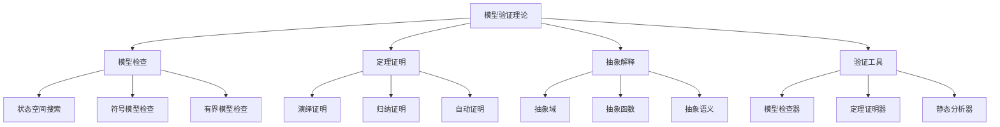

# 04-形式模型理论体系-模型验证理论

[返回主题树](../00-主题树与内容索引.md) | [主计划文档](../00-形式化架构理论统一计划.md) | [相关计划](../递归合并计划.md) | [返回上级](../README.md)

> 本文档为形式模型理论体系分支模型验证理论，所有最新进展与结论以主计划文档为准，历史细节归档于archive/。

## 目录

- [04-形式模型理论体系-模型验证理论](#04-形式模型理论体系-模型验证理论)
  - [目录](#目录)
  - [1. 概述](#1-概述)
    - [1.1 模型验证理论概述](#11-模型验证理论概述)
    - [1.2 核心目标](#12-核心目标)
    - [1.3 模型验证层次结构](#13-模型验证层次结构)
  - [2. 主要文件与内容索引](#2-主要文件与内容索引)
    - [2.1 核心文件](#21-核心文件)
    - [2.2 相关文件](#22-相关文件)
  - [3. 模型验证的基本定义与解释](#3-模型验证的基本定义与解释)
    - [3.1 模型验证的定义](#31-模型验证的定义)
      - [3.1.1 形式验证](#311-形式验证)
      - [3.1.2 模型检查](#312-模型检查)
      - [3.1.3 定理证明](#313-定理证明)
  - [4. 模型验证的基础概念](#4-模型验证的基础概念)
    - [4.1 模型检查](#41-模型检查)
      - [4.1.1 状态空间搜索](#411-状态空间搜索)
      - [4.1.2 符号模型检查](#412-符号模型检查)
      - [4.1.3 有界模型检查](#413-有界模型检查)
  - [5. 模型验证的主要理论](#5-模型验证的主要理论)
    - [5.1 定理证明](#51-定理证明)
    - [5.2 抽象解释](#52-抽象解释)
    - [5.3 验证工具](#53-验证工具)
    - [5.4 验证方法](#54-验证方法)
  - [6. 模型验证的行业应用](#6-模型验证的行业应用)
    - [6.1 软件验证](#61-软件验证)
    - [6.2 硬件验证](#62-硬件验证)
    - [6.3 协议验证](#63-协议验证)
  - [7. 发展历史](#7-发展历史)
  - [8. 应用领域](#8-应用领域)
  - [9. 总结](#9-总结)
  - [10. 相关性跳转与引用](#10-相关性跳转与引用)

## 1. 概述

### 1.1 模型验证理论概述

模型验证理论是研究如何验证系统模型正确性的理论分支，为形式化架构理论提供了重要的验证方法。模型验证理论不仅支撑软件验证，也是硬件验证、协议验证等领域的重要理论基础。

### 1.2 核心目标

- 建立模型验证的基本理论框架
- 提供形式化验证的方法
- 支持软件和硬件验证应用

### 1.3 模型验证层次结构

## 2. 主要文件与内容索引

### 2.1 核心文件

- [模型验证理论.md](../Matter/FormalModel/模型验证理论.md)
- [形式模型理论统一总论.md](00-形式模型理论统一总论.md)

### 2.2 相关文件

- [01-状态机理论.md](01-状态机理论.md)
- [02-Petri网理论.md](02-Petri网理论.md)
- [03-时序逻辑理论.md](03-时序逻辑理论.md)

## 3. 模型验证的基本定义与解释

### 3.1 模型验证的定义

**定义 3.1.1** 模型验证（Model Verification）
模型验证是检查系统模型是否满足给定规范的过程。

#### 3.1.1 形式验证

**定义 3.1.2** 形式验证（Formal Verification）
形式验证是使用数学方法证明系统正确性的技术。

**方法**：

- 模型检查
- 定理证明
- 抽象解释

#### 3.1.2 模型检查

**定义 3.1.3** 模型检查（Model Checking）
模型检查是自动验证有限状态系统是否满足时序逻辑规范的技术。

**特点**：

- 自动化
- 完备性
- 反例生成

#### 3.1.3 定理证明

**定义 3.1.4** 定理证明（Theorem Proving）
定理证明是使用逻辑推理证明系统性质的方法。

**方法**：

- 演绎证明
- 归纳证明
- 自动证明

## 4. 模型验证的基础概念

### 4.1 模型检查

#### 4.1.1 状态空间搜索

**方法 4.1.1** 状态空间搜索（State Space Search）
状态空间搜索是通过遍历系统所有可能状态来验证性质的方法。

**算法**：

- 深度优先搜索
- 广度优先搜索
- 启发式搜索

#### 4.1.2 符号模型检查

**方法 4.1.2** 符号模型检查（Symbolic Model Checking）
符号模型检查是使用符号表示来避免状态空间爆炸的方法。

**技术**：

- 二元决策图
- 有序二元决策图
- 符号状态表示

#### 4.1.3 有界模型检查

**方法 4.1.3** 有界模型检查（Bounded Model Checking）
有界模型检查是将模型检查问题转换为SAT问题的方法。

**优势**：

- 处理大规模系统
- 利用SAT求解器
- 反例生成

## 5. 模型验证的主要理论

### 5.1 定理证明

**理论 5.1.1** 定理证明（Theorem Proving）
定理证明是使用逻辑推理证明系统性质的理论。

**方法**：

- 演绎证明
- 归纳证明
- 自动证明

### 5.2 抽象解释

**理论 5.2.1** 抽象解释（Abstract Interpretation）
抽象解释是通过抽象来近似分析程序性质的理论。

**要素**：

- 抽象域
- 抽象函数
- 抽象语义

### 5.3 验证工具

**理论 5.3.1** 验证工具（Verification Tools）
验证工具是支持模型验证的软件工具。

**类型**：

- 模型检查器
- 定理证明器
- 静态分析器

### 5.4 验证方法

**理论 5.4.1** 验证方法（Verification Methods）
验证方法是进行模型验证的具体技术。

**方法**：

- 模型检查
- 定理证明
- 抽象解释
- 静态分析

## 6. 模型验证的行业应用

### 6.1 软件验证

- 程序正确性验证
- 安全性质验证
- 性能性质验证

### 6.2 硬件验证

- 电路设计验证
- 处理器验证
- 协议验证

### 6.3 协议验证

- 通信协议验证
- 安全协议验证
- 分布式协议验证

## 7. 发展历史

模型验证理论的发展经历了从手工证明到自动化验证的演进过程。从早期的形式化证明到现代的模型检查工具，模型验证理论不断丰富和发展。

## 8. 应用领域

模型验证在软件工程、硬件设计、通信协议、安全系统等领域有广泛应用，为现代系统设计提供了重要的验证技术。

## 9. 总结

模型验证理论作为形式化方法的重要分支，为形式化架构理论提供了重要的验证方法。模型验证理论不仅支撑系统验证，也为现代系统设计提供了重要的理论基础。

## 10. 相关性跳转与引用

- [00-形式模型理论统一总论.md](00-形式模型理论统一总论.md)
- [01-状态机理论.md](01-状态机理论.md)
- [02-Petri网理论.md](02-Petri网理论.md)
- [03-时序逻辑理论.md](03-时序逻辑理论.md)
- [05-模型转换理论.md](05-模型转换理论.md)
- [07-模型优化理论.md](07-模型优化理论.md)
