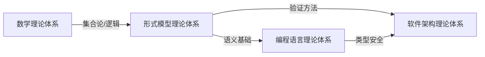

# 04-形式模型理论体系

> 形式模型理论总论与导航入口。本目录为形式模型理论体系的主权威入口，详细深化内容（状态机、Petri网、时序逻辑、模型检查等）见 [06-形式模型理论体系](../06-形式模型理论体系/00-形式模型理论体系总论.md)。

## 目录定位

```text
04-形式模型理论体系/        # 本目录：总论与导航
06-形式模型理论体系/        # 深化目录：状态机、Petri网、时序逻辑、模型检查
```

## 核心内容

- [形式模型理论统一总论](./00-形式模型理论统一总论.md) - 形式化方法在软件架构中的统一框架
- [00-形式模型理论体系总论-整合版](../06-形式模型理论体系/00-形式模型理论体系总论-整合版.md) - 整合版总论（含状态机、Petri网、时序逻辑）

## 理论体系概述

形式模型理论为软件架构提供严格的数学描述与验证基础，核心分支包括：

### 1. 状态机理论
- 有限状态机（FSM）、Mealy/Moore 机
- 状态转换系统、Kripke 结构
- 在协议验证与并发建模中的应用

### 2. Petri 网理论
- 经典 Petri 网、有色 Petri 网、时间 Petri 网
- 可达性分析、覆盖性、活性与有界性
- 工作流建模与资源分配

### 3. 时序逻辑
- 线性时序逻辑（LTL）
- 计算树逻辑（CTL/CTL*）
- Safety 与 Liveness 属性的形式化表达

### 4. 模型检查
- 显式状态模型检查（SPIN、TLA+）
- 符号模型检查（BDD、SAT/SMT）
- 抽象解释与偏序归约

## 与相关理论体系的关系



## 2025 对齐

- **国际 Wiki**：
  - [Wikipedia: Formal methods](https://en.wikipedia.org/wiki/Formal_methods)
  - [Wikipedia: Model checking](https://en.wikipedia.org/wiki/Model_checking)
  - [Wikipedia: Petri net](https://en.wikipedia.org/wiki/Petri_net)
  - [Wikipedia: Temporal logic](https://en.wikipedia.org/wiki/Temporal_logic)

- **名校课程**：
  - [CMU 15-312: Foundations of Programming Languages](https://www.cs.cmu.edu/~rwh/courses/ppl/)（形式化方法）
  - [MIT 6.033: Computer Systems Engineering](https://web.mit.edu/6.033/www/)（系统验证）
  - [Stanford CS 242: Programming Languages](https://web.stanford.edu/class/cs242/)（语义与验证）

- **代表性论文**：
  - *Principles of Model Checking* (Baier & Katoen, 2008)
  - *Communication and Concurrency* (Milner, 1989)
  - *Petri Nets: Properties, Analysis and Applications* (Murata, 1989)

- **前沿技术**：
  - [TLA+](https://lamport.azurewebsites.net/tla/tla.html)（分布式系统形式化规范）
  - [SPIN](http://spinroot.com/)（协议验证）
  - [UPPAAL](https://uppaal.org/)（实时系统模型检查）
  - [Z3](https://github.com/Z3Prover/z3)（SMT 求解器）

- **对齐状态**：已完成（最后更新：2025-01-15）

---

**版本**: v2.0
**状态**: ✅ 导航入口已完善
**最后更新**: 2026-05-13
