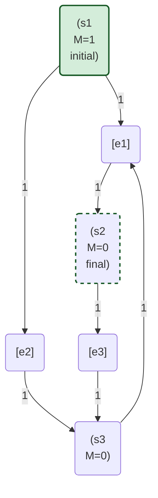

# 统一状态转换系统理论

## 目录

- [统一状态转换系统理论](#统一状态转换系统理论)
  - [目录](#目录)
  - [1. 理论基础](#1-理论基础)
    - [1.1 状态机理论概述](#11-状态机理论概述)
    - [1.2 Petri网理论概述](#12-petri网理论概述)
    - [1.3 理论比较](#13-理论比较)
  - [2. 统一形式化定义](#2-统一形式化定义)
    - [2.1 统一状态转换系统定义](#21-统一状态转换系统定义)
    - [2.2 状态机到统一模型的映射](#22-状态机到统一模型的映射)
    - [2.3 Petri网到统一模型的映射](#23-petri网到统一模型的映射)
  - [3. 统一图形表示](#3-统一图形表示)
    - [3.1 图形元素](#31-图形元素)
    - [3.2 表示规则](#32-表示规则)
    - [3.3 示例](#33-示例)
  - [4. 统一分析方法](#4-统一分析方法)
    - [4.1 可达性分析](#41-可达性分析)
    - [4.2 不变量分析](#42-不变量分析)
    - [4.3 结构分析](#43-结构分析)
    - [4.4 行为等价性](#44-行为等价性)
    - [4.5 模型检验](#45-模型检验)
  - [5. 统一应用框架](#5-统一应用框架)
    - [5.1 统一建模语言](#51-统一建模语言)
    - [5.2 统一分析工具](#52-统一分析工具)
    - [5.3 统一实现方法](#53-统一实现方法)
    - [5.4 统一可视化工具](#54-统一可视化工具)
  - [6. 应用领域](#6-应用领域)
    - [6.1 软件系统建模](#61-软件系统建模)
    - [6.2 通信协议验证](#62-通信协议验证)
    - [6.3 工作流管理](#63-工作流管理)
    - [6.4 并发系统设计](#64-并发系统设计)
  - [7. 总结与展望](#7-总结与展望)
  - [8. 参考文献](#8-参考文献)

## 1. 理论基础

### 1.1 状态机理论概述

状态机是一种数学模型，用于描述系统的状态变化。其核心组成包括：

- **状态集合**：系统可能处于的所有状态
- **初始状态**：系统的起始状态
- **转换函数**：定义状态之间的转换关系
- **输入字母表**：触发状态转换的事件或条件
- **接受状态集合**：表示系统可接受的终止状态

状态机的形式化定义为一个五元组 $(Q, \Sigma, \delta, q_0, F)$，其中：

- $Q$ 是有限的状态集合
- $\Sigma$ 是输入字母表
- $\delta: Q \times \Sigma \rightarrow Q$ 是转换函数
- $q_0 \in Q$ 是初始状态
- $F \subseteq Q$ 是接受状态的集合

状态机广泛应用于计算理论、编译器设计、协议规范和系统建模等领域。

### 1.2 Petri网理论概述

Petri网是一种图形化的数学模型，用于描述分布式系统的行为，特别适合表达并发、异步和非确定性行为。其核心组成包括：

- **库所**：表示系统的状态或条件
- **变迁**：表示系统中的事件或动作
- **弧**：连接库所和变迁，表示它们之间的关系
- **标记**：表示系统当前状态下各库所中的资源或条件数量

Petri网的形式化定义为一个六元组 $(P, T, F, W, M_0, C)$，其中：

- $P$ 是库所的有限集合
- $T$ 是变迁的有限集合
- $F \subseteq (P \times T) \cup (T \times P)$ 是弧的集合
- $W: F \rightarrow \mathbb{N}^+$ 是弧的权重函数
- $M_0: P \rightarrow \mathbb{N}$ 是初始标记
- $C: P \rightarrow \mathbb{N} \cup \{\infty\}$ 是库所的容量函数

Petri网在并发系统建模、工作流分析、通信协议和制造系统等领域有广泛应用。

### 1.3 理论比较

| 特性 | 状态机 | Petri网 |
|------|--------|--------|
| 并发性 | 不直接支持 | 原生支持 |
| 状态表示 | 离散状态 | 分布式状态（标记） |
| 事件表示 | 转换函数 | 变迁 |
| 图形表示 | 状态转换图 | 二部图 |
| 分析方法 | 状态可达性分析 | 可达性分析、不变量分析等 |
| 形式化程度 | 高 | 高 |
| 表达能力 | 正则语言 | 超越正则语言 |
| 扩展性 | 多种扩展（时序、概率等） | 多种扩展（着色、时序、层次等） |

## 2. 统一形式化定义

### 2.1 统一状态转换系统定义

统一状态转换系统 (USTS) 定义为一个七元组 $(S, E, R, M, I, F, L)$，其中：

- $S$ 是状态元素的集合（对应状态机的状态和Petri网的库所）
- $E$ 是事件的集合（对应状态机的输入符号和Petri网的变迁）
- $R \subseteq (S \times E) \cup (E \times S)$ 是关系集合（对应状态机的转换函数和Petri网的弧）
- $M: S \rightarrow \mathbb{N}$ 是标记函数（对应Petri网的标记，状态机中每个状态的标记为0或1）
- $I \subseteq S$ 是初始状态集合
- $F \subseteq S$ 是终止状态集合
- $L: R \rightarrow \mathbb{N}^+$ 是关系的权重函数

统一状态转换系统的动态行为由以下规则定义：

1. **启用规则**：事件 $e \in E$ 在标记 $M$ 下启用，当且仅当对于所有 $(s, e) \in R$，有 $M(s) \geq L(s, e)$。

2. **触发规则**：如果事件 $e$ 在标记 $M$ 下启用，则可以触发，产生新的标记 $M'$，其中：
   - 对于所有 $(s, e) \in R$，$M'(s) = M(s) - L(s, e)$
   - 对于所有 $(e, s) \in R$，$M'(s) = M(s) + L(e, s)$
   - 对于所有其他状态元素 $s$，$M'(s) = M(s)$

3. **可达性**：标记 $M'$ 从标记 $M$ 可达，如果存在一个事件序列，使得从 $M$ 开始，按序列触发这些事件后，可以到达 $M'$。

### 2.2 状态机到统一模型的映射

给定状态机 $(Q, \Sigma, \delta, q_0, F)$，可以构造对应的统一状态转换系统 $(S, E, R, M, I, F', L)$，其中：

- $S = Q$（状态集合）
- $E = \Sigma$（事件集合）
- $R = \{(q, a) | q \in Q, a \in \Sigma\} \cup \{(a, \delta(q, a)) | q \in Q, a \in \Sigma\}$（关系集合）
- $M(q) = 1$ 如果 $q = q_0$，否则 $M(q) = 0$（初始标记）
- $I = \{q_0\}$（初始状态集合）
- $F' = F$（终止状态集合）
- $L(r) = 1$ 对于所有 $r \in R$（关系权重）

### 2.3 Petri网到统一模型的映射

给定Petri网 $(P, T, F, W, M_0, C)$，可以构造对应的统一状态转换系统 $(S, E, R, M, I, F', L)$，其中：

- $S = P$（状态元素集合）
- $E = T$（事件集合）
- $R = F$（关系集合）
- $M = M_0$（初始标记）
- $I = \{p \in P | M_0(p) > 0\}$（初始状态集合）
- $F' = \emptyset$（终止状态集合，可根据具体应用定义）
- $L = W$（关系权重）

## 3. 统一图形表示

### 3.1 图形元素

统一状态转换系统的图形表示包含以下元素：

- **圆形节点**：表示状态元素（状态/库所）
- **矩形节点**：表示事件（输入符号/变迁）
- **有向边**：表示关系（从状态元素到事件或从事件到状态元素）
- **数字标注**：表示标记和权重
- **特殊标记**：表示初始状态和终止状态

### 3.2 表示规则

1. **状态元素表示**：
   - 使用圆形节点表示
   - 节点内的数字表示该状态元素的标记
   - 双圈表示终止状态
   - 带入射箭头的节点表示初始状态

2. **事件表示**：
   - 使用矩形节点表示
   - 节点内的文本表示事件名称

3. **关系表示**：
   - 使用有向边表示
   - 边上的数字表示权重，默认为1
   - 从状态元素到事件的边表示前置条件
   - 从事件到状态元素的边表示后置条件

### 3.3 示例

以下是一个简单的统一状态转换系统示例，它描述了一个包含三个状态元素和三个事件的系统。



其中：

- `(s1)`, `(s2)`, `(s3)` 是状态元素，圆圈内的`M=x`表示标记数量。
- `[e1]`, `[e2]`, `[e3]` 是事件。
- 边上的数字表示权重。
- `s1` 是初始状态 (initial)，其初始标记为1。
- `s2` 是终止状态 (final)，由双圈虚线边框表示。

## 4. 统一分析方法

### 4.1 可达性分析

可达性分析是研究从初始标记出发，系统可能达到的所有状态的方法。

**算法**：

1. 创建一个包含初始标记的工作集
2. 对于工作集中的每个标记，计算所有可能的后继标记
3. 将新的标记添加到工作集中
4. 重复步骤2和3，直到没有新的标记被添加

**应用**：

- 检查系统是否可以达到特定状态
- 验证系统的安全性属性
- 检测死锁和活锁

### 4.2 不变量分析

不变量分析是研究系统在所有可能执行过程中保持不变的属性的方法。

**位置不变量**：

- 定义：位置不变量是一个向量 $y$，满足 $y^T \cdot C = 0$，其中 $C$ 是关联矩阵
- 应用：验证资源守恒、检测结构错误

**变迁不变量**：

- 定义：变迁不变量是一个向量 $x$，满足 $C \cdot x = 0$
- 应用：识别循环行为、分析系统吞吐量

### 4.3 结构分析

结构分析是研究系统拓扑结构属性的方法，不依赖于初始标记。

**结构属性**：

- **有界性**：系统中的标记数量是否有上界
- **活性**：系统中的事件是否总能最终被触发
- **可达性**：是否存在从初始标记到目标标记的路径
- **可逆性**：系统是否可以从任何可达标记返回到初始标记

**分析技术**：

- 陷阱和死锁分析
- 结构矩阵分析
- 不变量分析

### 4.4 行为等价性

行为等价性是研究不同系统是否具有相同行为的方法。

**等价关系类型**：

- **语言等价**：两个系统产生相同的事件序列
- **仿真等价**：一个系统可以模拟另一个系统的所有行为
- **双仿真等价**：两个系统可以相互模拟对方的所有行为
- **分支等价**：两个系统在分支结构上等价

**应用**：

- 系统简化
- 系统验证
- 系统比较

### 4.5 模型检验

模型检验是验证系统是否满足特定时序逻辑公式的方法。

**时序逻辑**：

- **CTL**（计算树逻辑）：表达树状时间结构上的属性
- **LTL**（线性时序逻辑）：表达线性时间序列上的属性
- **CTL***：CTL和LTL的超集

**验证属性**：

- **安全性**：不好的事情永远不会发生
- **活性**：好的事情最终会发生
- **公平性**：在特定条件下，某些事件会无限次发生
- **无死锁**：系统不会进入死锁状态

## 5. 统一应用框架

### 5.1 统一建模语言

统一建模语言 (USML) 是一种用于描述统一状态转换系统的语言，支持状态机和Petri网的特性。

**语法示例**：

```text
system ExampleSystem {
  states {
    s1 (initial, marked=1),
    s2 (final),
    s3
  }
  
  events {
    e1,
    e2,
    e3
  }
  
  relations {
    s1 --1--> e1,
    e1 --1--> s2,
    s1 --1--> e2,
    e2 --1--> s3,
    s3 --1--> e1,
    s2 --1--> e3,
    e3 --1--> s3
  }
}
```

### 5.2 统一分析工具

统一分析工具支持对统一状态转换系统进行各种分析。

**功能**：

- 可达性分析
- 不变量计算
- 结构属性验证
- 行为等价性检查
- 模型检验

**实现技术**：

- 符号模型检验
- 抽象解释
- 归纳证明
- SAT/SMT求解

### 5.3 统一实现方法

统一实现方法支持从统一状态转换系统模型生成可执行代码。

**代码生成策略**：

- 状态模式实现
- 事件驱动实现
- 并发实现
- 分布式实现

**目标语言**：

- C/C++
- Java
- Rust
- Go
- Python

### 5.4 统一可视化工具

统一可视化工具支持统一状态转换系统的图形化编辑和可视化。

**功能**：

- 图形化编辑器
- 交互式模拟
- 动态可视化
- 分析结果可视化
- 导出/导入功能

## 6. 应用领域

### 6.1 软件系统建模

统一状态转换系统可用于软件系统的建模，特别是具有复杂状态行为的系统。

**应用场景**：

- 用户界面状态管理
- 业务流程建模
- 系统状态管理
- 并发控制

**优势**：

- 统一表示状态和事件
- 支持并发行为建模
- 提供形式化验证能力
- 支持代码生成

### 6.2 通信协议验证

统一状态转换系统可用于通信协议的形式化描述和验证。

**应用场景**：

- 网络协议设计
- 安全协议验证
- 分布式算法验证
- 通信系统建模

**优势**：

- 精确捕获协议状态和消息交换
- 验证协议的安全性和活性
- 检测协议中的死锁和活锁
- 支持并发通信建模

### 6.3 工作流管理

统一状态转换系统可用于工作流的建模和分析。

**应用场景**：

- 业务流程管理
- 文档流转系统
- 任务调度系统
- 审批流程管理

**优势**：

- 直观表示工作流状态和转换
- 支持并行任务和同步点
- 分析工作流性能和瓶颈
- 验证工作流的正确性

### 6.4 并发系统设计

统一状态转换系统特别适合并发系统的设计和验证。

**应用场景**：

- 多线程程序设计
- 分布式系统设计
- 实时系统设计
- 资源竞争管理

**优势**：

- 自然表示并发行为
- 检测并发错误（死锁、竞争条件）
- 验证并发系统的安全性和活性
- 支持资源分配和调度分析

## 7. 总结与展望

统一状态转换系统理论成功整合了状态机和Petri网的优势，提供了一个更加强大和灵活的形式化模型框架。通过统一的形式化定义、图形表示、分析方法和应用框架，该理论能够同时支持离散状态系统和并发分布式系统的建模和分析。

**主要贡献**：

1. 提出了统一的形式化定义，涵盖状态机和Petri网的核心概念
2. 建立了状态机和Petri网到统一模型的映射关系
3. 设计了统一的图形表示法，直观展示系统结构和行为
4. 开发了统一的分析方法，支持多种系统属性的验证
5. 构建了统一的应用框架，支持从建模到实现的全过程

**未来研究方向**：

1. 扩展统一模型，支持更多高级特性（如：时间、概率、层次化、数据等）
2. 开发更高效、可扩展的分析算法，以处理工业级大规模系统
3. 探索与更多形式化方法（如：过程代数、时序逻辑、抽象解释）的深度集成
4. 在具体的软件工程领域（如：分布式系统、物联网、微服务架构）中应用统一理论，并开发详细的案例研究
5. 开发更加成熟和用户友好的可视化、验证与代码生成工具链

统一状态转换系统理论为形式化方法的研究和应用提供了新的视角和工具，有望在软件系统设计、验证和实现等领域发挥重要作用。

## 8. 参考文献

- [1] ...
- [2] ...

---

**版本**: v69  
**创建时间**: 2024年7月  
**状态**: ✅ 审查完成  
**最后更新**: 2024年8月
