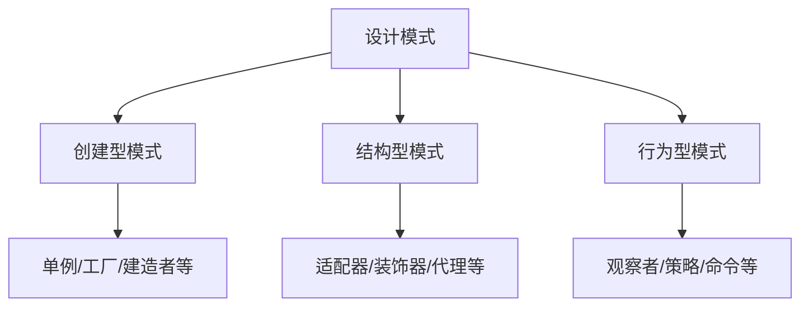

# 01-设计模式理论：软件设计的可复用解决方案

## 目录

1. [1.0 GoF设计模式](#10-gof设计模式)
2. [2.0 并发并行设计模式](#20-并发并行设计模式)
3. [3.0 分布式设计模式](#30-分布式设计模式)
4. [4.0 工作流设计模式](#40-工作流设计模式)
5. [5.0 模式组合与演化](#50-模式组合与演化)

## 1.0 GoF设计模式

### 1.1 设计模式基础

**定义 1.1.1 (设计模式)**
设计模式是一套被反复使用、多数人知晓的、经过分类编目的、代码设计经验的总结。

**定义 1.1.2 (模式分类)**
根据目的分为三类：
- **创建型模式**：处理对象创建机制
- **结构型模式**：处理类和对象的组合
- **行为型模式**：处理类或对象之间的通信



### 1.2 创建型模式

#### 1.2.1 单例模式 (Singleton)

**定义 1.2.1 (单例模式)**
保证一个类仅有一个实例，并提供一个访问它的全局访问点。

```rust
use std::sync::{Mutex, Once, ONCE_INIT};
use once_cell::sync::Lazy;

#[derive(Debug)]
pub struct SingletonLogger {
    level: String,
}

static mut SINGLETON_INSTANCE: *const Mutex<SingletonLogger> = 0 as *const _;
static ONCE: Once = ONCE_INIT;

impl SingletonLogger {
    pub fn get_instance() -> &'static Mutex<SingletonLogger> {
        ONCE.call_once(|| {
            let singleton = Mutex::new(SingletonLogger {
                level: "INFO".to_string(),
            });
            unsafe {
                SINGLETON_INSTANCE = Box::into_raw(Box::new(singleton));
            }
        });
        unsafe { &*SINGLETON_INSTANCE }
    }

    pub fn log(&self, message: &str) {
        println!("[{}] {}", self.level, message);
    }

    pub fn set_level(&mut self, level: String) {
        self.level = level;
    }
}

// 使用once_cell的现代实现
static GLOBAL_CONFIG: Lazy<Mutex<Config>> = Lazy::new(|| {
    Mutex::new(Config::load_default())
});

#[derive(Debug)]
pub struct Config {
    setting: String,
}

impl Config {
    pub fn load_default() -> Self {
        Config { setting: "default".to_string() }
    }
}
```

#### 1.2.2 工厂方法模式 (Factory Method)

**定义 1.2.2 (工厂方法模式)**
定义一个用于创建对象的接口，让子类决定实例化哪一个类。

```rust
// 产品trait
pub trait Product {
    fn operation(&self) -> String;
}

// 具体产品
pub struct ConcreteProductA;
impl Product for ConcreteProductA {
    fn operation(&self) -> String {
        "Result of ConcreteProductA".to_string()
    }
}

pub struct ConcreteProductB;
impl Product for ConcreteProductB {
    fn operation(&self) -> String {
        "Result of ConcreteProductB".to_string()
    }
}

// 创建者trait
pub trait Creator {
    fn factory_method(&self) -> Box<dyn Product>;
    
    fn some_operation(&self) -> String {
        let product = self.factory_method();
        format!("Creator: {}", product.operation())
    }
}

// 具体创建者
pub struct ConcreteCreatorA;
impl Creator for ConcreteCreatorA {
    fn factory_method(&self) -> Box<dyn Product> {
        Box::new(ConcreteProductA)
    }
}

pub struct ConcreteCreatorB;
impl Creator for ConcreteCreatorB {
    fn factory_method(&self) -> Box<dyn Product> {
        Box::new(ConcreteProductB)
    }
}
```

#### 1.2.3 抽象工厂模式 (Abstract Factory)

**定义 1.2.3 (抽象工厂模式)**
提供一个创建一系列相关或相互依赖对象的接口。

```rust
// 产品族A
pub trait AbstractProductA {
    fn useful_function_a(&self) -> String;
}

pub struct ConcreteProductA1;
impl AbstractProductA for ConcreteProductA1 {
    fn useful_function_a(&self) -> String {
        "The result of the product A1.".to_string()
    }
}

// 产品族B
pub trait AbstractProductB {
    fn useful_function_b(&self) -> String;
    fn another_useful_function_b(&self, collaborator: &dyn AbstractProductA) -> String;
}

pub struct ConcreteProductB1;
impl AbstractProductB for ConcreteProductB1 {
    fn useful_function_b(&self) -> String {
        "The result of the product B1.".to_string()
    }
    fn another_useful_function_b(&self, collaborator: &dyn AbstractProductA) -> String {
        let result = collaborator.useful_function_a();
        format!("B1 collaborating with ({})", result)
    }
}

// 抽象工厂
pub trait AbstractFactory {
    fn create_product_a(&self) -> Box<dyn AbstractProductA>;
    fn create_product_b(&self) -> Box<dyn AbstractProductB>;
}

pub struct ConcreteFactory1;
impl AbstractFactory for ConcreteFactory1 {
    fn create_product_a(&self) -> Box<dyn AbstractProductA> {
        Box::new(ConcreteProductA1)
    }
    fn create_product_b(&self) -> Box<dyn AbstractProductB> {
        Box::new(ConcreteProductB1)
    }
}
```

### 1.3 结构型模式

#### 1.3.1 适配器模式 (Adapter)

**定义 1.3.1 (适配器模式)**
将一个类的接口转换成客户希望的另外一个接口。

```rust
// 目标接口
pub trait Target {
    fn request(&self) -> String;
}

// 被适配的类
pub struct Adaptee {
    specific_request: String,
}

impl Adaptee {
    pub fn new() -> Self {
        Self {
            specific_request: "Specific request".to_string(),
        }
    }
    
    pub fn specific_request(&self) -> String {
        self.specific_request.clone()
    }
}

// 适配器
pub struct Adapter {
    adaptee: Adaptee,
}

impl Adapter {
    pub fn new(adaptee: Adaptee) -> Self {
        Self { adaptee }
    }
}

impl Target for Adapter {
    fn request(&self) -> String {
        format!("Adapter: {}", self.adaptee.specific_request())
    }
}
```

#### 1.3.2 装饰器模式 (Decorator)

**定义 1.3.2 (装饰器模式)**
动态地给对象添加额外的职责。

```rust
// 组件接口
pub trait Component {
    fn operation(&self) -> String;
}

// 具体组件
pub struct ConcreteComponent;
impl Component for ConcreteComponent {
    fn operation(&self) -> String {
        "ConcreteComponent".to_string()
    }
}

// 装饰器基类
pub struct Decorator {
    component: Box<dyn Component>,
}

impl Decorator {
    pub fn new(component: Box<dyn Component>) -> Self {
        Self { component }
    }
}

impl Component for Decorator {
    fn operation(&self) -> String {
        self.component.operation()
    }
}

// 具体装饰器
pub struct ConcreteDecoratorA {
    decorator: Decorator,
}

impl ConcreteDecoratorA {
    pub fn new(component: Box<dyn Component>) -> Self {
        Self {
            decorator: Decorator::new(component),
        }
    }
}

impl Component for ConcreteDecoratorA {
    fn operation(&self) -> String {
        format!("ConcreteDecoratorA({})", self.decorator.operation())
    }
}
```

### 1.4 行为型模式

#### 1.4.1 观察者模式 (Observer)

**定义 1.4.1 (观察者模式)**
定义对象间的一种一对多的依赖关系。

```rust
use std::collections::HashMap;
use std::sync::{Arc, Mutex};

// 观察者trait
pub trait Observer {
    fn update(&self, subject: &Subject);
}

// 具体观察者
pub struct ConcreteObserver {
    id: i32,
}

impl ConcreteObserver {
    pub fn new(id: i32) -> Self {
        Self { id }
    }
}

impl Observer for ConcreteObserver {
    fn update(&self, subject: &Subject) {
        println!("Observer {}: Subject state changed to {}", 
                self.id, subject.get_state());
    }
}

// 主题
pub struct Subject {
    observers: Vec<Arc<Mutex<dyn Observer + Send>>>,
    state: i32,
}

impl Subject {
    pub fn new() -> Self {
        Self {
            observers: Vec::new(),
            state: 0,
        }
    }
    
    pub fn attach(&mut self, observer: Arc<Mutex<dyn Observer + Send>>) {
        self.observers.push(observer);
    }
    
    pub fn detach(&mut self, observer: Arc<Mutex<dyn Observer + Send>>) {
        // 简化实现
    }
    
    pub fn notify(&self) {
        for observer in &self.observers {
            if let Ok(obs) = observer.lock() {
                obs.update(self);
            }
        }
    }
    
    pub fn set_state(&mut self, state: i32) {
        self.state = state;
        self.notify();
    }
    
    pub fn get_state(&self) -> i32 {
        self.state
    }
}
```

## 2.0 并发并行设计模式

### 2.1 并发模式基础

**定义 2.1.1 (并发模式)**
处理多线程、多进程环境下的设计模式。

### 2.2 常见并发模式

#### 2.2.1 线程池模式 (Thread Pool)

```rust
use std::sync::{Arc, Mutex, Condvar};
use std::collections::VecDeque;
use std::thread;

pub struct ThreadPool {
    workers: Vec<Worker>,
    sender: Option<std::sync::mpsc::Sender<Message>>,
}

type Job = Box<dyn FnOnce() + Send + 'static>;

enum Message {
    NewJob(Job),
    Terminate,
}

impl ThreadPool {
    pub fn new(size: usize) -> ThreadPool {
        assert!(size > 0);

        let (sender, receiver) = std::sync::mpsc::channel();
        let receiver = Arc::new(Mutex::new(receiver));
        let mut workers = Vec::with_capacity(size);

        for id in 0..size {
            workers.push(Worker::new(id, Arc::clone(&receiver)));
        }

        ThreadPool {
            workers,
            sender: Some(sender),
        }
    }

    pub fn execute<F>(&self, f: F)
    where
        F: FnOnce() + Send + 'static,
    {
        let job = Box::new(f);
        self.sender.as_ref().unwrap().send(Message::NewJob(job)).unwrap();
    }
}

struct Worker {
    id: usize,
    thread: Option<thread::JoinHandle<()>>,
}

impl Worker {
    fn new(id: usize, receiver: Arc<Mutex<std::sync::mpsc::Receiver<Message>>>) -> Worker {
        let thread = thread::spawn(move || loop {
            let message = receiver.lock().unwrap().recv().unwrap();

            match message {
                Message::NewJob(job) => {
                    println!("Worker {} got a job; executing.", id);
                    job();
                }
                Message::Terminate => {
                    println!("Worker {} was told to terminate.", id);
                    break;
                }
            }
        });

        Worker {
            id,
            thread: Some(thread),
        }
    }
}
```

#### 2.2.2 生产者-消费者模式

```rust
use std::sync::{Arc, Mutex, Condvar};
use std::collections::VecDeque;

pub struct ProducerConsumer<T> {
    queue: Arc<Mutex<VecDeque<T>>>,
    not_empty: Arc<Condvar>,
    not_full: Arc<Condvar>,
    capacity: usize,
}

impl<T> ProducerConsumer<T> {
    pub fn new(capacity: usize) -> Self {
        Self {
            queue: Arc::new(Mutex::new(VecDeque::new())),
            not_empty: Arc::new(Condvar::new()),
            not_full: Arc::new(Condvar::new()),
            capacity,
        }
    }

    pub fn produce(&self, item: T) {
        let mut queue = self.queue.lock().unwrap();
        while queue.len() >= self.capacity {
            queue = self.not_full.wait(queue).unwrap();
        }
        queue.push_back(item);
        self.not_empty.notify_one();
    }

    pub fn consume(&self) -> Option<T> {
        let mut queue = self.queue.lock().unwrap();
        while queue.is_empty() {
            queue = self.not_empty.wait(queue).unwrap();
        }
        let item = queue.pop_front();
        self.not_full.notify_one();
        item
    }
}
```

## 3.0 分布式设计模式

### 3.1 分布式模式基础

**定义 3.1.1 (分布式模式)**
处理分布式系统中的设计模式。

### 3.2 常见分布式模式

#### 3.2.1 熔断器模式 (Circuit Breaker)

```rust
use std::sync::{Arc, Mutex};
use std::time::{Duration, Instant};

#[derive(Debug, Clone)]
pub enum CircuitState {
    Closed,
    Open,
    HalfOpen,
}

pub struct CircuitBreaker {
    state: Arc<Mutex<CircuitState>>,
    failure_count: Arc<Mutex<u32>>,
    last_failure_time: Arc<Mutex<Option<Instant>>>,
    threshold: u32,
    timeout: Duration,
}

impl CircuitBreaker {
    pub fn new(threshold: u32, timeout: Duration) -> Self {
        Self {
            state: Arc::new(Mutex::new(CircuitState::Closed)),
            failure_count: Arc::new(Mutex::new(0)),
            last_failure_time: Arc::new(Mutex::new(None)),
            threshold,
            timeout,
        }
    }

    pub fn call<F, T, E>(&self, f: F) -> Result<T, E>
    where
        F: FnOnce() -> Result<T, E>,
    {
        let mut state = self.state.lock().unwrap();
        
        match *state {
            CircuitState::Open => {
                let last_failure = self.last_failure_time.lock().unwrap();
                if let Some(time) = *last_failure {
                    if time.elapsed() >= self.timeout {
                        *state = CircuitState::HalfOpen;
                        drop(state);
                        drop(last_failure);
                        self.try_call(f)
                    } else {
                        Err(/* 自定义错误类型 */)
                    }
                } else {
                    Err(/* 自定义错误类型 */)
                }
            }
            CircuitState::HalfOpen | CircuitState::Closed => {
                drop(state);
                self.try_call(f)
            }
        }
    }

    fn try_call<F, T, E>(&self, f: F) -> Result<T, E>
    where
        F: FnOnce() -> Result<T, E>,
    {
        match f() {
            Ok(result) => {
                self.on_success();
                Ok(result)
            }
            Err(e) => {
                self.on_failure();
                Err(e)
            }
        }
    }

    fn on_success(&self) {
        let mut state = self.state.lock().unwrap();
        *state = CircuitState::Closed;
        let mut failure_count = self.failure_count.lock().unwrap();
        *failure_count = 0;
    }

    fn on_failure(&self) {
        let mut failure_count = self.failure_count.lock().unwrap();
        *failure_count += 1;
        
        if *failure_count >= self.threshold {
            let mut state = self.state.lock().unwrap();
            *state = CircuitState::Open;
            let mut last_failure_time = self.last_failure_time.lock().unwrap();
            *last_failure_time = Some(Instant::now());
        }
    }
}
```

#### 3.2.2 服务发现模式

```rust
use std::collections::HashMap;
use std::sync::{Arc, Mutex};
use std::net::SocketAddr;

#[derive(Debug, Clone)]
pub struct ServiceInstance {
    pub id: String,
    pub address: SocketAddr,
    pub health: bool,
}

pub struct ServiceRegistry {
    services: Arc<Mutex<HashMap<String, Vec<ServiceInstance>>>>,
}

impl ServiceRegistry {
    pub fn new() -> Self {
        Self {
            services: Arc::new(Mutex::new(HashMap::new())),
        }
    }

    pub fn register(&self, service_name: String, instance: ServiceInstance) {
        let mut services = self.services.lock().unwrap();
        services.entry(service_name)
            .or_insert_with(Vec::new)
            .push(instance);
    }

    pub fn discover(&self, service_name: &str) -> Option<Vec<ServiceInstance>> {
        let services = self.services.lock().unwrap();
        services.get(service_name).cloned()
    }

    pub fn deregister(&self, service_name: &str, instance_id: &str) {
        let mut services = self.services.lock().unwrap();
        if let Some(instances) = services.get_mut(service_name) {
            instances.retain(|instance| instance.id != instance_id);
        }
    }
}
```

## 4.0 工作流设计模式

### 4.1 工作流模式基础

**定义 4.1.1 (工作流模式)**
处理业务流程和任务编排的设计模式。

### 4.2 状态机模式

```rust
use std::collections::HashMap;

#[derive(Debug, Clone, PartialEq, Eq, Hash)]
pub enum OrderState {
    Created,
    Paid,
    Shipped,
    Delivered,
    Cancelled,
}

#[derive(Debug)]
pub struct Order {
    pub id: String,
    pub state: OrderState,
    pub data: HashMap<String, String>,
}

pub trait StateHandler {
    fn handle(&self, order: &mut Order) -> Result<(), String>;
}

pub struct CreatedHandler;
impl StateHandler for CreatedHandler {
    fn handle(&self, order: &mut Order) -> Result<(), String> {
        println!("Processing created order: {}", order.id);
        Ok(())
    }
}

pub struct PaidHandler;
impl StateHandler for PaidHandler {
    fn handle(&self, order: &mut Order) -> Result<(), String> {
        println!("Processing paid order: {}", order.id);
        Ok(())
    }
}

pub struct OrderStateMachine {
    handlers: HashMap<OrderState, Box<dyn StateHandler>>,
}

impl OrderStateMachine {
    pub fn new() -> Self {
        let mut handlers: HashMap<OrderState, Box<dyn StateHandler>> = HashMap::new();
        handlers.insert(OrderState::Created, Box::new(CreatedHandler));
        handlers.insert(OrderState::Paid, Box::new(PaidHandler));
        
        Self { handlers }
    }

    pub fn process(&self, order: &mut Order) -> Result<(), String> {
        if let Some(handler) = self.handlers.get(&order.state) {
            handler.handle(order)
        } else {
            Err("No handler found for state".to_string())
        }
    }

    pub fn transition(&self, order: &mut Order, new_state: OrderState) {
        order.state = new_state;
    }
}
```

## 5.0 模式组合与演化

### 5.1 模式组合

**定义 5.1.1 (模式组合)**
多个设计模式的组合使用。

### 5.2 模式演化

**定理 5.2.1 (模式演化规律)**
设计模式会随着技术发展而演化，但核心思想保持不变。


---

## 总结

设计模式理论为软件设计提供了可复用的解决方案，通过创建型、结构型、行为型模式的组合，以及并发、分布式、工作流等领域的扩展，构建了完整的软件设计方法论体系。 