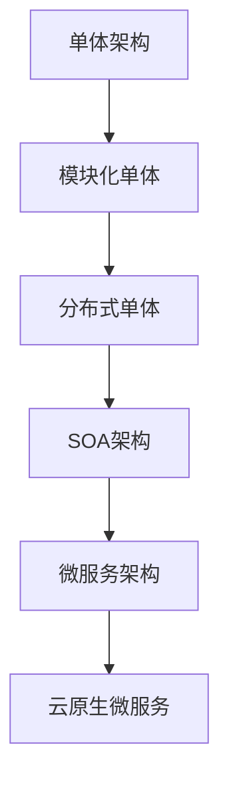

# 02-微服务架构理论：分布式系统的服务化设计

## 目录

1. [1.0 微服务架构基础](#10-微服务架构基础)
2. [2.0 微服务系统工作原理](#20-微服务系统工作原理)
3. [3.0 微服务架构模式](#30-微服务架构模式)
4. [4.0 微服务通信模式](#40-微服务通信模式)
5. [5.0 现代微服务架构演进](#50-现代微服务架构演进)
6. [6.0 微服务形式化建模](#60-微服务形式化建模)

## 1.0 微服务架构基础

### 1.1 微服务定义与特征

**定义 1.1.1 (微服务架构)**
微服务架构是一种将单一应用程序开发为一组小型服务的方法，每个服务运行在自己的进程中，通过轻量级机制进行通信。

**定义 1.1.2 (微服务特征)**
- **服务自治性**：每个微服务都是自包含的
- **业务领域专注**：每个微服务负责特定业务功能
- **弹性设计**：系统容忍服务失败
- **去中心化治理**：避免标准化，鼓励技术多样性
- **进化式设计**：服务可独立发展



### 1.2 架构演化路径

**定理 1.2.1 (架构演化规律)**
系统架构演化遵循：单体 → 模块化 → 分布式 → SOA → 微服务 → 云原生

**例 1.2.1**
演化驱动因素：
- 系统复杂性增长
- 团队规模扩大
- 技术栈多样化需求
- 部署频率提升

## 2.0 微服务系统工作原理

### 2.1 服务发现与注册

**定义 2.1.1 (服务发现)**
服务发现解决"如何找到服务实例"的问题。

**定义 2.1.2 (服务注册)**
服务启动时向注册中心注册位置信息。

```rust
use std::collections::HashMap;
use std::net::SocketAddr;
use std::sync::{Arc, Mutex};
use tokio::time::{Duration, Instant};

#[derive(Debug, Clone)]
pub struct ServiceInstance {
    pub id: String,
    pub name: String,
    pub address: SocketAddr,
    pub health_check_url: String,
    pub metadata: HashMap<String, String>,
    pub last_heartbeat: Instant,
}

#[derive(Debug)]
pub struct ServiceRegistry {
    instances: Arc<Mutex<HashMap<String, Vec<ServiceInstance>>>>,
    health_check_interval: Duration,
}

impl ServiceRegistry {
    pub fn new() -> Self {
        Self {
            instances: Arc::new(Mutex::new(HashMap::new())),
            health_check_interval: Duration::from_secs(30),
        }
    }

    pub fn register(&self, instance: ServiceInstance) -> Result<(), String> {
        let mut instances = self.instances.lock().unwrap();
        instances.entry(instance.name.clone())
            .or_insert_with(Vec::new)
            .push(instance);
        Ok(())
    }

    pub fn deregister(&self, service_name: &str, instance_id: &str) -> Result<(), String> {
        let mut instances = self.instances.lock().unwrap();
        if let Some(service_instances) = instances.get_mut(service_name) {
            service_instances.retain(|instance| instance.id != instance_id);
        }
        Ok(())
    }

    pub fn get_instances(&self, service_name: &str) -> Result<Vec<ServiceInstance>, String> {
        let instances = self.instances.lock().unwrap();
        Ok(instances.get(service_name).cloned().unwrap_or_default())
    }

    pub fn heartbeat(&self, service_name: &str, instance_id: &str) -> Result<(), String> {
        let mut instances = self.instances.lock().unwrap();
        if let Some(service_instances) = instances.get_mut(service_name) {
            for instance in service_instances {
                if instance.id == instance_id {
                    instance.last_heartbeat = Instant::now();
                    break;
                }
            }
        }
        Ok(())
    }
}
```

### 2.2 负载均衡与服务路由

**定义 2.2.1 (负载均衡)**
将请求分发到多个服务实例的机制。

**定义 2.2.2 (负载均衡算法)**
- 轮询算法
- 加权轮询算法
- 最少连接算法
- 一致性哈希算法

```rust
use std::sync::atomic::{AtomicUsize, Ordering};

pub trait LoadBalancingAlgorithm {
    fn choose(&self, instances: &[ServiceInstance]) -> Option<&ServiceInstance>;
}

pub struct RoundRobinAlgorithm {
    counter: AtomicUsize,
}

impl RoundRobinAlgorithm {
    pub fn new() -> Self {
        Self {
            counter: AtomicUsize::new(0),
        }
    }
}

impl LoadBalancingAlgorithm for RoundRobinAlgorithm {
    fn choose(&self, instances: &[ServiceInstance]) -> Option<&ServiceInstance> {
        if instances.is_empty() {
            return None;
        }
        
        let current = self.counter.fetch_add(1, Ordering::SeqCst);
        Some(&instances[current % instances.len()])
    }
}

pub struct LeastConnectionsAlgorithm;

impl LoadBalancingAlgorithm for LeastConnectionsAlgorithm {
    fn choose(&self, instances: &[ServiceInstance]) -> Option<&ServiceInstance> {
        instances.iter().min_by_key(|instance| {
            instance.metadata.get("active_connections")
                .and_then(|s| s.parse::<usize>().ok())
                .unwrap_or(0)
        })
    }
}

pub struct LoadBalancer {
    algorithm: Box<dyn LoadBalancingAlgorithm>,
}

impl LoadBalancer {
    pub fn new(algorithm: Box<dyn LoadBalancingAlgorithm>) -> Self {
        Self { algorithm }
    }

    pub fn choose_instance(&self, instances: &[ServiceInstance]) -> Option<&ServiceInstance> {
        self.algorithm.choose(instances)
    }
}
```

### 2.3 容错与弹性设计

**定义 2.3.1 (断路器模式)**
当服务调用失败率达到阈值时，断路器打开，快速失败。

**定义 2.3.2 (舱壁模式)**
资源隔离，防止一个服务消耗过多资源影响其他服务。

```rust
use std::sync::atomic::{AtomicU8, AtomicU32};
use std::time::{Duration, Instant};

#[derive(Debug, Clone, PartialEq)]
pub enum CircuitState {
    Closed,
    Open,
    HalfOpen,
}

pub struct CircuitBreaker {
    state: AtomicU8, // 0: CLOSED, 1: OPEN, 2: HALF_OPEN
    failure_count: AtomicU32,
    failure_threshold: u32,
    reset_timeout: Duration,
    last_failure_time: Mutex<Option<Instant>>,
}

impl CircuitBreaker {
    pub fn new(failure_threshold: u32, reset_timeout: Duration) -> Self {
        Self {
            state: AtomicU8::new(0), // CLOSED
            failure_count: AtomicU32::new(0),
            failure_threshold,
            reset_timeout,
            last_failure_time: Mutex::new(None),
        }
    }

    pub fn call<F, T, E>(&self, f: F) -> Result<T, E>
    where
        F: FnOnce() -> Result<T, E>,
    {
        match self.get_state() {
            CircuitState::Open => {
                let last_failure = self.last_failure_time.lock().unwrap();
                if let Some(time) = *last_failure {
                    if time.elapsed() >= self.reset_timeout {
                        self.transition_to_half_open();
                        drop(last_failure);
                        self.try_call(f)
                    } else {
                        Err(/* 自定义错误类型 */)
                    }
                } else {
                    Err(/* 自定义错误类型 */)
                }
            }
            CircuitState::HalfOpen | CircuitState::Closed => {
                self.try_call(f)
            }
        }
    }

    fn try_call<F, T, E>(&self, f: F) -> Result<T, E>
    where
        F: FnOnce() -> Result<T, E>,
    {
        match f() {
            Ok(result) => {
                self.on_success();
                Ok(result)
            }
            Err(e) => {
                self.on_failure();
                Err(e)
            }
        }
    }

    fn on_success(&self) {
        self.state.store(0, Ordering::SeqCst); // CLOSED
        self.failure_count.store(0, Ordering::SeqCst);
    }

    fn on_failure(&self) {
        let failure_count = self.failure_count.fetch_add(1, Ordering::SeqCst) + 1;
        if failure_count >= self.failure_threshold {
            self.state.store(1, Ordering::SeqCst); // OPEN
            let mut last_failure_time = self.last_failure_time.lock().unwrap();
            *last_failure_time = Some(Instant::now());
        }
    }

    fn get_state(&self) -> CircuitState {
        match self.state.load(Ordering::SeqCst) {
            0 => CircuitState::Closed,
            1 => CircuitState::Open,
            2 => CircuitState::HalfOpen,
            _ => CircuitState::Closed,
        }
    }

    fn transition_to_half_open(&self) {
        self.state.store(2, Ordering::SeqCst); // HALF_OPEN
    }
}
```

## 3.0 微服务架构模式

### 3.1 服务组合模式

**定义 3.1.1 (服务组合)**
将多个微服务组合成更高层次的服务。

**定义 3.1.2 (编排模式)**
通过中央协调器控制服务间的交互。

```rust
pub trait Service {
    fn execute(&self, input: &str) -> Result<String, String>;
}

pub struct CompositeService {
    services: Vec<Box<dyn Service>>,
}

impl CompositeService {
    pub fn new() -> Self {
        Self { services: Vec::new() }
    }

    pub fn add_service(&mut self, service: Box<dyn Service>) {
        self.services.push(service);
    }

    pub fn execute_all(&self, input: &str) -> Result<Vec<String>, String> {
        let mut results = Vec::new();
        for service in &self.services {
            let result = service.execute(input)?;
            results.push(result);
        }
        Ok(results)
    }
}
```

### 3.2 领域驱动设计

**定义 3.2.1 (限界上下文)**
明确定义模型的应用边界。

**定义 3.2.2 (聚合根)**
聚合的入口点，负责维护聚合的一致性。

```rust
use uuid::Uuid;

#[derive(Debug, Clone)]
pub struct AggregateId(Uuid);

impl AggregateId {
    pub fn new() -> Self {
        Self(Uuid::new_v4())
    }
}

pub trait AggregateRoot {
    fn id(&self) -> &AggregateId;
    fn version(&self) -> u64;
    fn events(&self) -> &[DomainEvent];
}

#[derive(Debug, Clone)]
pub struct DomainEvent {
    pub id: Uuid,
    pub aggregate_id: AggregateId,
    pub event_type: String,
    pub data: serde_json::Value,
    pub timestamp: chrono::DateTime<chrono::Utc>,
}

pub struct Order {
    id: AggregateId,
    version: u64,
    customer_id: String,
    items: Vec<OrderItem>,
    status: OrderStatus,
    events: Vec<DomainEvent>,
}

impl AggregateRoot for Order {
    fn id(&self) -> &AggregateId {
        &self.id
    }

    fn version(&self) -> u64 {
        self.version
    }

    fn events(&self) -> &[DomainEvent] {
        &self.events
    }
}

#[derive(Debug, Clone)]
pub enum OrderStatus {
    Created,
    Confirmed,
    Shipped,
    Delivered,
    Cancelled,
}

#[derive(Debug, Clone)]
pub struct OrderItem {
    product_id: String,
    quantity: u32,
    price: f64,
}
```

## 4.0 微服务通信模式

### 4.1 同步通信

**定义 4.1.1 (REST API)**
基于HTTP的同步通信模式。

**定义 4.1.2 (gRPC)**
基于HTTP/2的高性能RPC框架。

```rust
use actix_web::{web, App, HttpServer, HttpResponse};
use serde::{Deserialize, Serialize};

#[derive(Serialize, Deserialize)]
pub struct User {
    pub id: String,
    pub name: String,
    pub email: String,
}

async fn get_user(path: web::Path<String>) -> HttpResponse {
    let user_id = path.into_inner();
    // 模拟从数据库获取用户
    let user = User {
        id: user_id,
        name: "John Doe".to_string(),
        email: "john@example.com".to_string(),
    };
    HttpResponse::Ok().json(user)
}

async fn create_user(user: web::Json<User>) -> HttpResponse {
    // 模拟创建用户
    HttpResponse::Created().json(user.into_inner())
}

#[actix_web::main]
async fn main() -> std::io::Result<()> {
    HttpServer::new(|| {
        App::new()
            .route("/users/{id}", web::get().to(get_user))
            .route("/users", web::post().to(create_user))
    })
    .bind("127.0.0.1:8080")?
    .run()
    .await
}
```

### 4.2 异步通信

**定义 4.2.1 (消息队列)**
基于消息的异步通信模式。

**定义 4.2.2 (事件驱动)**
基于事件的松耦合通信模式。

```rust
use tokio::sync::mpsc;
use serde::{Deserialize, Serialize};

#[derive(Debug, Clone, Serialize, Deserialize)]
pub enum Message {
    UserCreated { user_id: String, name: String },
    OrderPlaced { order_id: String, user_id: String },
    PaymentProcessed { order_id: String, amount: f64 },
}

pub struct MessageBroker {
    sender: mpsc::Sender<Message>,
    receiver: mpsc::Receiver<Message>,
}

impl MessageBroker {
    pub fn new() -> Self {
        let (sender, receiver) = mpsc::channel(100);
        Self { sender, receiver }
    }

    pub async fn publish(&self, message: Message) -> Result<(), String> {
        self.sender.send(message).await
            .map_err(|e| format!("Failed to send message: {}", e))
    }

    pub async fn subscribe(&mut self) -> Option<Message> {
        self.receiver.recv().await
    }
}

pub struct EventHandler {
    broker: MessageBroker,
}

impl EventHandler {
    pub fn new(broker: MessageBroker) -> Self {
        Self { broker }
    }

    pub async fn handle_user_created(&self, user_id: String, name: String) -> Result<(), String> {
        let message = Message::UserCreated { user_id, name };
        self.broker.publish(message).await
    }

    pub async fn handle_order_placed(&self, order_id: String, user_id: String) -> Result<(), String> {
        let message = Message::OrderPlaced { order_id, user_id };
        self.broker.publish(message).await
    }
}
```

## 5.0 现代微服务架构演进

### 5.1 服务网格

**定义 5.1.1 (服务网格)**
处理服务间通信的基础设施层。

**定义 5.1.2 (Sidecar模式)**
每个服务实例旁边运行一个代理。

```rust
pub struct ServiceMesh {
    sidecars: Vec<Sidecar>,
    control_plane: ControlPlane,
}

pub struct Sidecar {
    service_id: String,
    proxy: Proxy,
}

pub struct Proxy {
    inbound_rules: Vec<Rule>,
    outbound_rules: Vec<Rule>,
}

pub struct Rule {
    match_condition: MatchCondition,
    action: Action,
}

pub enum MatchCondition {
    Path(String),
    Header(String, String),
    Method(String),
}

pub enum Action {
    Route(String),
    Retry(u32),
    Timeout(Duration),
    CircuitBreaker(CircuitBreakerConfig),
}

pub struct ControlPlane {
    config_store: ConfigStore,
    service_registry: ServiceRegistry,
}

impl ControlPlane {
    pub fn new() -> Self {
        Self {
            config_store: ConfigStore::new(),
            service_registry: ServiceRegistry::new(),
        }
    }

    pub fn update_config(&self, service_id: &str, config: ProxyConfig) -> Result<(), String> {
        self.config_store.update(service_id, config)
    }
}
```

### 5.2 云原生微服务

**定义 5.2.1 (云原生)**
充分利用云计算优势的应用程序设计方法。

**定义 5.2.2 (容器化)**
将应用程序打包到容器中运行。

```rust
use k8s_openapi::api::apps::v1::Deployment;
use k8s_openapi::api::core::v1::Service;
use kube::{Api, Client};

pub struct KubernetesDeployment {
    client: Client,
    namespace: String,
}

impl KubernetesDeployment {
    pub async fn new() -> Result<Self, kube::Error> {
        let client = Client::try_default().await?;
        Ok(Self {
            client,
            namespace: "default".to_string(),
        })
    }

    pub async fn deploy_service(&self, name: &str, image: &str, replicas: i32) -> Result<(), kube::Error> {
        let deployments: Api<Deployment> = Api::namespaced(self.client.clone(), &self.namespace);
        
        let deployment = self.create_deployment_manifest(name, image, replicas);
        deployments.create(&Default::default(), &deployment).await?;
        
        Ok(())
    }

    fn create_deployment_manifest(&self, name: &str, image: &str, replicas: i32) -> Deployment {
        // 创建Kubernetes部署清单
        // 简化实现
        Deployment::default()
    }
}
```

## 6.0 微服务形式化建模

### 6.1 微服务系统形式化定义

**定义 6.1.1 (微服务系统)**
微服务系统是一个五元组 $S = (M, C, R, F, P)$，其中：
- $M$ 是微服务集合
- $C$ 是通信机制集合
- $R$ 是资源约束集合
- $F$ 是故障模式集合
- $P$ 是性能指标集合

**定义 6.1.2 (服务交互)**
服务 $m_i$ 和服务 $m_j$ 的交互定义为：
$$I(m_i, m_j) = (p, d, t)$$
其中 $p$ 是协议，$d$ 是数据，$t$ 是时间戳。

### 6.2 服务组合的形式化

**定理 6.2.1 (服务组合可组合性)**
如果服务 $m_1$ 和 $m_2$ 都是正确的，且它们的接口兼容，则组合服务 $m_1 \circ m_2$ 也是正确的。

**证明**：
通过接口兼容性和服务正确性的传递性证明。

```rust
pub trait FormalService {
    fn pre_condition(&self) -> bool;
    fn post_condition(&self) -> bool;
    fn invariant(&self) -> bool;
}

pub struct FormalMicroservice {
    services: Vec<Box<dyn FormalService>>,
}

impl FormalMicroservice {
    pub fn verify_composition(&self) -> bool {
        // 验证服务组合的正确性
        for service in &self.services {
            if !service.pre_condition() || !service.post_condition() || !service.invariant() {
                return false;
            }
        }
        true
    }
}
```

---

## 总结

微服务架构理论为分布式系统设计提供了系统化的方法论，通过服务发现、负载均衡、容错机制、通信模式等核心概念，构建了可扩展、可维护的分布式系统架构。 