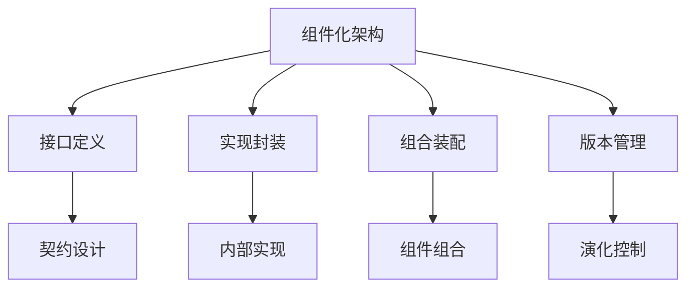

# 03-组件化架构理论：模块化系统的构建方法

## 目录

1. [1.0 组件化架构基础](#10-组件化架构基础)
2. [2.0 组件模型与接口](#20-组件模型与接口)
3. [3.0 组件交互模式](#30-组件交互模式)
4. [4.0 组件组合与装配](#40-组件组合与装配)
5. [5.0 组件演化与版本管理](#50-组件演化与版本管理)
6. [6.0 组件化形式化建模](#60-组件化形式化建模)

## 1.0 组件化架构基础

### 1.1 组件定义与特征

**定义 1.1.1 (软件组件)**
软件组件是一个可独立部署、可重用的软件单元，具有明确定义的接口和实现。

**定义 1.1.2 (组件特征)**
- **封装性**：组件内部实现对外部隐藏
- **可重用性**：组件可在不同系统中重复使用
- **可组合性**：组件可与其他组件组合
- **可替换性**：组件可被其他实现替换
- **标准化接口**：组件通过标准接口通信



### 1.2 组件化架构优势

**定理 1.2.1 (组件化优势)**
组件化架构提供：
- 提高代码重用率
- 降低系统耦合度
- 简化维护和测试
- 支持并行开发
- 便于系统演化

## 2.0 组件模型与接口

### 2.1 组件接口设计

**定义 2.1.1 (组件接口)**
组件接口定义了组件对外提供的服务和所需的服务。

**定义 2.1.2 (接口契约)**
接口契约规定了组件交互的协议和约束。

```rust
use std::collections::HashMap;
use serde::{Serialize, Deserialize};

// 组件接口定义
pub trait ComponentInterface {
    fn get_id(&self) -> &str;
    fn get_version(&self) -> &str;
    fn get_dependencies(&self) -> Vec<String>;
    fn initialize(&mut self) -> Result<(), String>;
    fn shutdown(&mut self) -> Result<(), String>;
}

// 组件元数据
#[derive(Debug, Clone, Serialize, Deserialize)]
pub struct ComponentMetadata {
    pub id: String,
    pub name: String,
    pub version: String,
    pub description: String,
    pub author: String,
    pub dependencies: Vec<String>,
    pub interfaces: Vec<String>,
}

// 基础组件实现
pub struct BaseComponent {
    metadata: ComponentMetadata,
    state: ComponentState,
    interfaces: HashMap<String, Box<dyn std::any::Any>>,
}

#[derive(Debug, Clone)]
pub enum ComponentState {
    Uninitialized,
    Initialized,
    Running,
    Stopped,
    Error(String),
}

impl BaseComponent {
    pub fn new(metadata: ComponentMetadata) -> Self {
        Self {
            metadata,
            state: ComponentState::Uninitialized,
            interfaces: HashMap::new(),
        }
    }

    pub fn register_interface<I>(&mut self, name: &str, interface: I)
    where
        I: 'static,
    {
        self.interfaces.insert(name.to_string(), Box::new(interface));
    }

    pub fn get_interface<I>(&self, name: &str) -> Option<&I>
    where
        I: 'static,
    {
        self.interfaces.get(name)?.downcast_ref::<I>()
    }
}

impl ComponentInterface for BaseComponent {
    fn get_id(&self) -> &str {
        &self.metadata.id
    }

    fn get_version(&self) -> &str {
        &self.metadata.version
    }

    fn get_dependencies(&self) -> Vec<String> {
        self.metadata.dependencies.clone()
    }

    fn initialize(&mut self) -> Result<(), String> {
        self.state = ComponentState::Initialized;
        Ok(())
    }

    fn shutdown(&mut self) -> Result<(), String> {
        self.state = ComponentState::Stopped;
        Ok(())
    }
}
```

### 2.2 组件生命周期管理

**定义 2.2.1 (组件生命周期)**
组件的生命周期包括：创建、初始化、运行、停止、销毁。

```rust
pub trait LifecycleManager {
    fn create_component(&mut self, metadata: ComponentMetadata) -> Result<String, String>;
    fn initialize_component(&mut self, component_id: &str) -> Result<(), String>;
    fn start_component(&mut self, component_id: &str) -> Result<(), String>;
    fn stop_component(&mut self, component_id: &str) -> Result<(), String>;
    fn destroy_component(&mut self, component_id: &str) -> Result<(), String>;
}

pub struct ComponentLifecycleManager {
    components: HashMap<String, Box<dyn ComponentInterface>>,
    states: HashMap<String, ComponentState>,
}

impl ComponentLifecycleManager {
    pub fn new() -> Self {
        Self {
            components: HashMap::new(),
            states: HashMap::new(),
        }
    }

    pub fn register_component(&mut self, component: Box<dyn ComponentInterface>) {
        let id = component.get_id().to_string();
        self.components.insert(id.clone(), component);
        self.states.insert(id, ComponentState::Uninitialized);
    }
}

impl LifecycleManager for ComponentLifecycleManager {
    fn create_component(&mut self, metadata: ComponentMetadata) -> Result<String, String> {
        let component = BaseComponent::new(metadata);
        let id = component.get_id().to_string();
        self.components.insert(id.clone(), Box::new(component));
        self.states.insert(id.clone(), ComponentState::Uninitialized);
        Ok(id)
    }

    fn initialize_component(&mut self, component_id: &str) -> Result<(), String> {
        if let Some(component) = self.components.get_mut(component_id) {
            component.initialize()?;
            self.states.insert(component_id.to_string(), ComponentState::Initialized);
            Ok(())
        } else {
            Err("Component not found".to_string())
        }
    }

    fn start_component(&mut self, component_id: &str) -> Result<(), String> {
        if let Some(state) = self.states.get(component_id) {
            match state {
                ComponentState::Initialized => {
                    self.states.insert(component_id.to_string(), ComponentState::Running);
                    Ok(())
                }
                _ => Err("Component not in initialized state".to_string()),
            }
        } else {
            Err("Component not found".to_string())
        }
    }

    fn stop_component(&mut self, component_id: &str) -> Result<(), String> {
        if let Some(component) = self.components.get_mut(component_id) {
            component.shutdown()?;
            self.states.insert(component_id.to_string(), ComponentState::Stopped);
            Ok(())
        } else {
            Err("Component not found".to_string())
        }
    }

    fn destroy_component(&mut self, component_id: &str) -> Result<(), String> {
        self.components.remove(component_id);
        self.states.remove(component_id);
        Ok(())
    }
}
```

## 3.0 组件交互模式

### 3.1 同步交互模式

**定义 3.1.1 (同步调用)**
组件间通过直接方法调用进行同步交互。

```rust
// 服务接口定义
pub trait UserService {
    fn get_user(&self, id: &str) -> Result<User, String>;
    fn create_user(&self, user: User) -> Result<String, String>;
    fn update_user(&self, user: User) -> Result<(), String>;
    fn delete_user(&self, id: &str) -> Result<(), String>;
}

#[derive(Debug, Clone, Serialize, Deserialize)]
pub struct User {
    pub id: String,
    pub name: String,
    pub email: String,
}

// 用户服务组件
pub struct UserServiceComponent {
    base: BaseComponent,
    users: HashMap<String, User>,
}

impl UserServiceComponent {
    pub fn new() -> Self {
        let metadata = ComponentMetadata {
            id: "user-service".to_string(),
            name: "User Service".to_string(),
            version: "1.0.0".to_string(),
            description: "User management service".to_string(),
            author: "System".to_string(),
            dependencies: Vec::new(),
            interfaces: vec!["UserService".to_string()],
        };
        
        Self {
            base: BaseComponent::new(metadata),
            users: HashMap::new(),
        }
    }
}

impl UserService for UserServiceComponent {
    fn get_user(&self, id: &str) -> Result<User, String> {
        self.users.get(id)
            .cloned()
            .ok_or_else(|| "User not found".to_string())
    }

    fn create_user(&self, user: User) -> Result<String, String> {
        let id = user.id.clone();
        self.users.insert(id.clone(), user);
        Ok(id)
    }

    fn update_user(&self, user: User) -> Result<(), String> {
        if self.users.contains_key(&user.id) {
            self.users.insert(user.id.clone(), user);
            Ok(())
        } else {
            Err("User not found".to_string())
        }
    }

    fn delete_user(&self, id: &str) -> Result<(), String> {
        if self.users.remove(id).is_some() {
            Ok(())
        } else {
            Err("User not found".to_string())
        }
    }
}

impl ComponentInterface for UserServiceComponent {
    fn get_id(&self) -> &str {
        self.base.get_id()
    }

    fn get_version(&self) -> &str {
        self.base.get_version()
    }

    fn get_dependencies(&self) -> Vec<String> {
        self.base.get_dependencies()
    }

    fn initialize(&mut self) -> Result<(), String> {
        self.base.initialize()
    }

    fn shutdown(&mut self) -> Result<(), String> {
        self.base.shutdown()
    }
}
```

### 3.2 异步交互模式

**定义 3.2.1 (事件驱动)**
组件间通过事件进行异步交互。

```rust
use tokio::sync::mpsc;

#[derive(Debug, Clone, Serialize, Deserialize)]
pub enum ComponentEvent {
    UserCreated { user_id: String, name: String },
    UserUpdated { user_id: String, name: String },
    UserDeleted { user_id: String },
    ComponentStarted { component_id: String },
    ComponentStopped { component_id: String },
}

pub trait EventHandler {
    fn handle_event(&mut self, event: ComponentEvent) -> Result<(), String>;
}

pub struct EventBus {
    publishers: HashMap<String, mpsc::Sender<ComponentEvent>>,
    subscribers: HashMap<String, Vec<mpsc::Sender<ComponentEvent>>>,
}

impl EventBus {
    pub fn new() -> Self {
        Self {
            publishers: HashMap::new(),
            subscribers: HashMap::new(),
        }
    }

    pub fn subscribe(&mut self, event_type: &str, sender: mpsc::Sender<ComponentEvent>) {
        self.subscribers.entry(event_type.to_string())
            .or_insert_with(Vec::new)
            .push(sender);
    }

    pub async fn publish(&self, event: ComponentEvent) -> Result<(), String> {
        let event_type = match &event {
            ComponentEvent::UserCreated { .. } => "UserCreated",
            ComponentEvent::UserUpdated { .. } => "UserUpdated",
            ComponentEvent::UserDeleted { .. } => "UserDeleted",
            ComponentEvent::ComponentStarted { .. } => "ComponentStarted",
            ComponentEvent::ComponentStopped { .. } => "ComponentStopped",
        };

        if let Some(subscribers) = self.subscribers.get(event_type) {
            for sender in subscribers {
                if let Err(e) = sender.send(event.clone()).await {
                    eprintln!("Failed to send event: {}", e);
                }
            }
        }
        Ok(())
    }
}
```

## 4.0 组件组合与装配

### 4.1 组件组合模式

**定义 4.1.1 (组件组合)**
将多个组件组合成更高层次的组件。

**定义 4.1.2 (组合模式)**
- 聚合组合：组件间松耦合
- 组合组合：组件间紧耦合
- 委托组合：组件间委托关系

```rust
pub struct CompositeComponent {
    base: BaseComponent,
    children: HashMap<String, Box<dyn ComponentInterface>>,
    composition_type: CompositionType,
}

#[derive(Debug, Clone)]
pub enum CompositionType {
    Aggregation,  // 聚合
    Composition,  // 组合
    Delegation,   // 委托
}

impl CompositeComponent {
    pub fn new(metadata: ComponentMetadata, composition_type: CompositionType) -> Self {
        Self {
            base: BaseComponent::new(metadata),
            children: HashMap::new(),
            composition_type,
        }
    }

    pub fn add_child(&mut self, name: &str, component: Box<dyn ComponentInterface>) {
        self.children.insert(name.to_string(), component);
    }

    pub fn remove_child(&mut self, name: &str) -> Option<Box<dyn ComponentInterface>> {
        self.children.remove(name)
    }

    pub fn get_child(&self, name: &str) -> Option<&dyn ComponentInterface> {
        self.children.get(name).map(|c| c.as_ref())
    }

    pub fn get_child_mut(&mut self, name: &str) -> Option<&mut dyn ComponentInterface> {
        self.children.get_mut(name).map(|c| c.as_mut())
    }
}

impl ComponentInterface for CompositeComponent {
    fn get_id(&self) -> &str {
        self.base.get_id()
    }

    fn get_version(&self) -> &str {
        self.base.get_version()
    }

    fn get_dependencies(&self) -> Vec<String> {
        let mut deps = self.base.get_dependencies();
        for child in self.children.values() {
            deps.extend(child.get_dependencies());
        }
        deps
    }

    fn initialize(&mut self) -> Result<(), String> {
        // 先初始化子组件
        for child in self.children.values_mut() {
            child.initialize()?;
        }
        // 再初始化自身
        self.base.initialize()
    }

    fn shutdown(&mut self) -> Result<(), String> {
        // 先关闭自身
        self.base.shutdown()?;
        // 再关闭子组件
        for child in self.children.values_mut() {
            child.shutdown()?;
        }
        Ok(())
    }
}
```

### 4.2 组件装配器

**定义 4.2.1 (组件装配器)**
负责将组件按照配置进行组合和装配。

```rust
use serde::{Serialize, Deserialize};

#[derive(Debug, Clone, Serialize, Deserialize)]
pub struct AssemblyConfiguration {
    pub name: String,
    pub components: Vec<ComponentConfig>,
    pub connections: Vec<ConnectionConfig>,
}

#[derive(Debug, Clone, Serialize, Deserialize)]
pub struct ComponentConfig {
    pub id: String,
    pub type_name: String,
    pub parameters: HashMap<String, String>,
    pub dependencies: Vec<String>,
}

#[derive(Debug, Clone, Serialize, Deserialize)]
pub struct ConnectionConfig {
    pub from: String,
    pub to: String,
    pub interface: String,
    pub connection_type: ConnectionType,
}

#[derive(Debug, Clone, Serialize, Deserialize)]
pub enum ConnectionType {
    Synchronous,
    Asynchronous,
    EventDriven,
}

pub struct ComponentAssembler {
    registry: HashMap<String, Box<dyn ComponentFactory>>,
    assemblies: HashMap<String, CompositeComponent>,
}

pub trait ComponentFactory {
    fn create_component(&self, config: &ComponentConfig) -> Result<Box<dyn ComponentInterface>, String>;
}

impl ComponentAssembler {
    pub fn new() -> Self {
        Self {
            registry: HashMap::new(),
            assemblies: HashMap::new(),
        }
    }

    pub fn register_factory(&mut self, type_name: &str, factory: Box<dyn ComponentFactory>) {
        self.registry.insert(type_name.to_string(), factory);
    }

    pub fn assemble(&mut self, config: AssemblyConfiguration) -> Result<String, String> {
        let mut composite = CompositeComponent::new(
            ComponentMetadata {
                id: config.name.clone(),
                name: config.name.clone(),
                version: "1.0.0".to_string(),
                description: "Assembled component".to_string(),
                author: "Assembler".to_string(),
                dependencies: Vec::new(),
                interfaces: Vec::new(),
            },
            CompositionType::Aggregation,
        );

        // 创建所有组件
        for comp_config in &config.components {
            let factory = self.registry.get(&comp_config.type_name)
                .ok_or_else(|| format!("Factory not found for type: {}", comp_config.type_name))?;
            
            let component = factory.create_component(comp_config)?;
            composite.add_child(&comp_config.id, component);
        }

        // 建立连接
        for conn_config in &config.connections {
            self.establish_connection(&mut composite, conn_config)?;
        }

        let assembly_id = config.name.clone();
        self.assemblies.insert(assembly_id.clone(), composite);
        Ok(assembly_id)
    }

    fn establish_connection(&self, composite: &mut CompositeComponent, config: &ConnectionConfig) -> Result<(), String> {
        // 根据连接类型建立组件间的连接
        match config.connection_type {
            ConnectionType::Synchronous => {
                // 建立同步连接
                Ok(())
            }
            ConnectionType::Asynchronous => {
                // 建立异步连接
                Ok(())
            }
            ConnectionType::EventDriven => {
                // 建立事件驱动连接
                Ok(())
            }
        }
    }
}
```

## 5.0 组件演化与版本管理

### 5.1 组件版本管理

**定义 5.1.1 (版本语义)**
版本号格式：主版本.次版本.修订版本

**定义 5.1.2 (版本兼容性)**
- 主版本变更：不兼容的API变更
- 次版本变更：向后兼容的功能性新增
- 修订版本变更：向后兼容的问题修正

```rust
use semver::{Version, VersionReq};

#[derive(Debug, Clone)]
pub struct VersionedComponent {
    component: Box<dyn ComponentInterface>,
    version: Version,
    compatibility: Vec<VersionReq>,
}

impl VersionedComponent {
    pub fn new(component: Box<dyn ComponentInterface>, version: Version) -> Self {
        Self {
            component,
            version,
            compatibility: Vec::new(),
        }
    }

    pub fn is_compatible_with(&self, other_version: &Version) -> bool {
        for req in &self.compatibility {
            if req.matches(other_version) {
                return true;
            }
        }
        false
    }

    pub fn add_compatibility(&mut self, version_req: VersionReq) {
        self.compatibility.push(version_req);
    }
}

pub struct VersionManager {
    versions: HashMap<String, Vec<VersionedComponent>>,
}

impl VersionManager {
    pub fn new() -> Self {
        Self {
            versions: HashMap::new(),
        }
    }

    pub fn register_version(&mut self, component_id: &str, versioned_component: VersionedComponent) {
        self.versions.entry(component_id.to_string())
            .or_insert_with(Vec::new)
            .push(versioned_component);
    }

    pub fn get_compatible_version(&self, component_id: &str, required_version: &Version) -> Option<&VersionedComponent> {
        if let Some(versions) = self.versions.get(component_id) {
            for versioned in versions {
                if versioned.is_compatible_with(required_version) {
                    return Some(versioned);
                }
            }
        }
        None
    }
}
```

### 5.2 组件演化策略

**定义 5.2.1 (演化策略)**
- 渐进式演化：保持向后兼容
- 革命式演化：破坏性变更
- 并行演化：多版本并存

```rust
pub trait EvolutionStrategy {
    fn can_evolve(&self, from_version: &Version, to_version: &Version) -> bool;
    fn evolve(&self, component: &mut dyn ComponentInterface) -> Result<(), String>;
}

pub struct GradualEvolutionStrategy;

impl EvolutionStrategy for GradualEvolutionStrategy {
    fn can_evolve(&self, from_version: &Version, to_version: &Version) -> bool {
        // 渐进式演化：只允许次版本和修订版本升级
        from_version.major == to_version.major
    }

    fn evolve(&self, component: &mut dyn ComponentInterface) -> Result<(), String> {
        // 执行渐进式演化逻辑
        Ok(())
    }
}

pub struct RevolutionaryEvolutionStrategy;

impl EvolutionStrategy for RevolutionaryEvolutionStrategy {
    fn can_evolve(&self, _from_version: &Version, _to_version: &Version) -> bool {
        // 革命式演化：允许所有版本变更
        true
    }

    fn evolve(&self, component: &mut dyn ComponentInterface) -> Result<(), String> {
        // 执行革命式演化逻辑
        Ok(())
    }
}
```

## 6.0 组件化形式化建模

### 6.1 组件系统形式化定义

**定义 6.1.1 (组件系统)**
组件系统是一个四元组 $CS = (C, I, R, E)$，其中：
- $C$ 是组件集合
- $I$ 是接口集合
- $R$ 是关系集合
- $E$ 是演化规则集合

**定义 6.1.2 (组件关系)**
组件 $c_i$ 和 $c_j$ 的关系定义为：
$$R(c_i, c_j) = (t, i, d)$$
其中 $t$ 是关系类型，$i$ 是接口，$d$ 是依赖关系。

### 6.2 组件组合的形式化

**定理 6.2.1 (组件组合正确性)**
如果组件 $c_1$ 和 $c_2$ 的接口兼容，且满足组合约束，则组合组件 $c_1 \circ c_2$ 是正确的。

**证明**：
通过接口兼容性和组合约束的传递性证明。

```rust
pub trait FormalComponent {
    fn interface_compatible(&self, other: &dyn FormalComponent) -> bool;
    fn composition_constraints_satisfied(&self, other: &dyn FormalComponent) -> bool;
    fn verify_composition(&self, other: &dyn FormalComponent) -> bool;
}

pub struct FormalComponentSystem {
    components: Vec<Box<dyn FormalComponent>>,
    relationships: Vec<ComponentRelationship>,
}

#[derive(Debug, Clone)]
pub struct ComponentRelationship {
    pub from: String,
    pub to: String,
    pub relationship_type: RelationshipType,
    pub interface: String,
}

#[derive(Debug, Clone)]
pub enum RelationshipType {
    Dependency,
    Composition,
    Aggregation,
    Association,
}

impl FormalComponentSystem {
    pub fn verify_system_correctness(&self) -> bool {
        // 验证整个组件系统的正确性
        for relationship in &self.relationships {
            if !self.verify_relationship(relationship) {
                return false;
            }
        }
        true
    }

    fn verify_relationship(&self, relationship: &ComponentRelationship) -> bool {
        // 验证组件关系的正确性
        // 简化实现
        true
    }
}
```

---

## 总结

组件化架构理论为软件系统的模块化设计提供了系统化的方法论，通过组件定义、接口设计、交互模式、组合装配、版本管理等核心概念，构建了可重用、可维护、可演化的软件系统架构。 