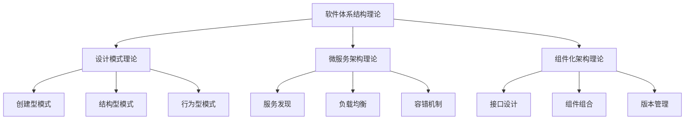

# 04-软件体系结构理论总结

## 1.0 理论结构回顾

- 01-设计模式理论：软件设计的可复用解决方案
- 02-微服务架构理论：分布式系统的服务化设计
- 03-组件化架构理论：模块化系统的构建方法

## 2.0 主要内容要点

- 设计模式分类（创建型、结构型、行为型）
- 微服务架构原理（服务发现、负载均衡、容错）
- 组件化架构方法（接口设计、组合装配、版本管理）
- 架构演化规律与最佳实践

## 3.0 多模态表达

## 4.0 工程与学术应用

- 企业级应用架构设计
- 分布式系统构建
- 软件系统重构与演化
- 架构评估与优化

## 5.0 交叉引用

- [设计模式理论](01-设计模式理论.md)
- [微服务架构理论](02-微服务架构理论.md)
- [组件化架构理论](03-组件化架构理论.md)

## 6.0 理论贡献

- 提供了系统化的软件架构设计方法
- 建立了可重用、可维护、可演化的架构模式
- 支持大规模分布式系统的构建
- 为软件工程实践提供了理论基础

---

## 总结

软件体系结构理论为现代软件系统的设计、构建和维护提供了完整的理论框架和方法论，是软件工程学科的重要理论基础。 