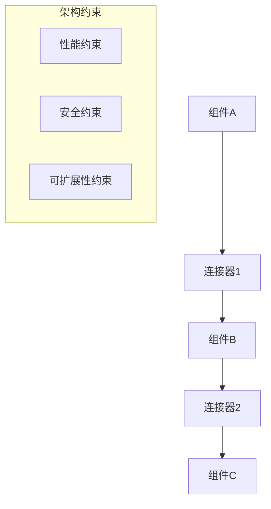

# 软件架构理论总论

## 1. 理论概述

软件架构理论是形式化架构理论体系的核心组成部分，旨在建立软件系统的结构化、系统化的设计理论框架。本理论将软件架构从经验性实践提升为严格的形式化理论体系。

### 1.1 理论基础

- **系统论基础**：基于系统科学和复杂性理论
- **数学基础**：集合论、图论、代数结构
- **工程基础**：软件工程、系统工程、控制论

### 1.2 核心目标

- 建立软件架构的形式化描述语言
- 提供架构设计的数学理论基础
- 支持架构分析和验证的自动化工具
- 实现架构知识的系统化积累和复用

## 2. 基本概念

### 2.1 架构元素

```rust
// 架构元素的基本定义
pub trait ArchitectureElement {
    fn id(&self) -> &str;
    fn name(&self) -> &str;
    fn description(&self) -> &str;
    fn properties(&self) -> HashMap<String, Value>;
}

// 组件定义
pub struct Component {
    pub id: String,
    pub name: String,
    pub description: String,
    pub interfaces: Vec<Interface>,
    pub implementation: Implementation,
    pub properties: HashMap<String, Value>,
}

// 连接器定义
pub struct Connector {
    pub id: String,
    pub name: String,
    pub source: String,
    pub target: String,
    pub protocol: Protocol,
    pub properties: HashMap<String, Value>,
}
```

### 2.2 架构模式

```rust
// 架构模式的基本结构
pub struct ArchitecturePattern {
    pub name: String,
    pub description: String,
    pub elements: Vec<ArchitectureElement>,
    pub constraints: Vec<Constraint>,
    pub benefits: Vec<String>,
    pub trade_offs: Vec<String>,
}

// 模式实例化
impl ArchitecturePattern {
    pub fn instantiate(&self, parameters: HashMap<String, Value>) -> Architecture {
        // 根据参数实例化架构模式
        todo!("实现模式实例化逻辑")
    }
}
```

## 3. 形式化表示

### 3.1 架构图论模型



### 3.2 数学表示

架构系统可以形式化为有向图 $G = (V, E, \phi)$，其中：

- $V$ 是组件集合
- $E$ 是连接器集合
- $\phi: E \rightarrow V \times V$ 是连接关系映射

架构约束可以表示为：
$$\forall e \in E: C(e) \land \forall v \in V: P(v)$$

其中 $C(e)$ 是连接器约束，$P(v)$ 是组件属性约束。

## 4. 应用领域

### 4.1 企业架构

- 业务架构设计
- 应用架构规划
- 技术架构实现
- 数据架构管理

### 4.2 系统架构

- 分布式系统设计
- 微服务架构
- 云原生架构
- 边缘计算架构

### 4.3 软件架构

- 设计模式应用
- 组件化开发
- 模块化设计
- 接口标准化

## 5. 理论框架

### 5.1 架构设计方法论

```rust
// 架构设计流程
pub struct ArchitectureDesignProcess {
    pub requirements: Requirements,
    pub constraints: Constraints,
    pub patterns: Vec<ArchitecturePattern>,
    pub evaluation: EvaluationCriteria,
}

impl ArchitectureDesignProcess {
    pub fn design(&self) -> Architecture {
        // 1. 需求分析
        let requirements = self.analyze_requirements();
        
        // 2. 约束识别
        let constraints = self.identify_constraints();
        
        // 3. 模式选择
        let patterns = self.select_patterns();
        
        // 4. 架构合成
        let architecture = self.synthesize_architecture();
        
        // 5. 验证评估
        self.validate_architecture(&architecture);
        
        architecture
    }
}
```

### 5.2 架构评估模型

```rust
// 架构质量评估
pub struct ArchitectureQualityModel {
    pub maintainability: QualityMetric,
    pub performance: QualityMetric,
    pub security: QualityMetric,
    pub scalability: QualityMetric,
    pub reliability: QualityMetric,
}

impl ArchitectureQualityModel {
    pub fn evaluate(&self, architecture: &Architecture) -> QualityScore {
        let maintainability = self.evaluate_maintainability(architecture);
        let performance = self.evaluate_performance(architecture);
        let security = self.evaluate_security(architecture);
        let scalability = self.evaluate_scalability(architecture);
        let reliability = self.evaluate_reliability(architecture);
        
        QualityScore {
            maintainability,
            performance,
            security,
            scalability,
            reliability,
        }
    }
}
```

## 6. 交叉引用

### 6.1 相关理论

- [哲学基础理论](../01-哲学基础理论/00-哲学基础理论总论.md)
- [数学理论体系](../02-数学理论体系/00-数学理论体系总论.md)
- [形式语言理论](../03-形式语言理论/00-形式语言理论总论.md)
- [编程语言理论](../05-编程语言理论/00-编程语言理论总论.md)
- [形式模型理论](../06-形式模型理论/00-形式模型理论总论.md)

### 6.2 实践应用

- [实践应用开发](../08-实践应用开发/README.md)
- [理论统一与整合](../07-理论统一与整合/00-理论统一与整合总论.md)

## 7. 导航

- [返回总目录](../../README.md)
- [设计模式理论](01-设计模式理论.md)
- [微服务架构理论](02-微服务架构理论.md)
- [组件化架构理论](03-组件化架构理论.md)
- [云原生架构理论](04-云原生架构理论.md)
- [分布式架构理论](05-分布式架构理论.md)
- [WebAssembly架构理论](06-WebAssembly架构理论.md)
- [工作流架构理论](07-工作流架构理论.md)
