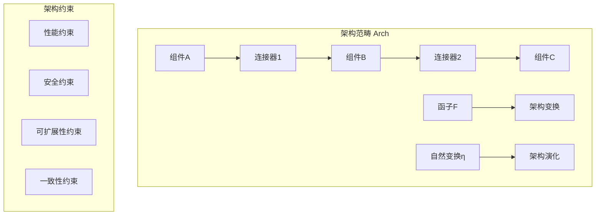
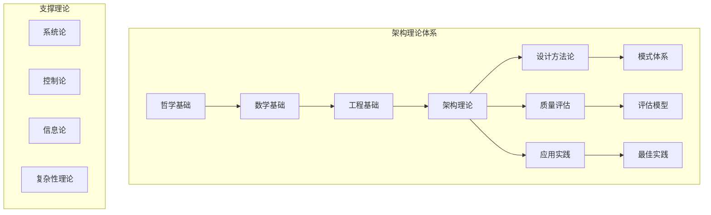

# 软件架构理论总论

## 目录

1. [理论概述](#1-理论概述)
2. [基本概念与定义](#2-基本概念与定义)
3. [形式化表示](#3-形式化表示)
4. [架构模式体系](#4-架构模式体系)
5. [设计方法论](#5-设计方法论)
6. [质量评估模型](#6-质量评估模型)
7. [应用领域](#7-应用领域)
8. [理论框架](#8-理论框架)
9. [交叉引用](#9-交叉引用)

## 1. 理论概述

软件架构理论是形式化架构理论体系的核心组成部分，旨在建立软件系统的结构化、系统化的设计理论框架。本理论将软件架构从经验性实践提升为严格的形式化理论体系，为现代软件系统的设计、分析、验证和演化提供理论基础。

### 1.1 理论基础

#### 1.1.1 哲学基础

- **本体论基础**：软件系统的存在本质和结构关系
- **认识论基础**：架构知识的获取和验证方法
- **逻辑学基础**：架构推理和证明的严格逻辑
- **形而上学基础**：架构的抽象本质和普遍规律

#### 1.1.2 数学基础

- **集合论**：组件集合和关系集合的形式化
- **图论**：架构拓扑结构的数学表示
- **代数结构**：架构操作的代数性质
- **范畴论**：架构模式的高阶抽象

#### 1.1.3 工程基础

- **系统论**：整体性和涌现性原理
- **控制论**：反馈和调节机制
- **信息论**：信息传递和处理效率
- **复杂性理论**：复杂系统的行为规律

### 1.2 核心目标

1. **形式化描述**：建立软件架构的形式化描述语言
2. **数学基础**：提供架构设计的数学理论基础
3. **自动化工具**：支持架构分析和验证的自动化工具
4. **知识积累**：实现架构知识的系统化积累和复用
5. **质量保证**：确保架构设计的质量和一致性

## 2. 基本概念与定义

### 2.1 架构元素

#### 2.1.1 组件 (Component)

**定义**：组件是软件架构中的基本构建块，具有明确的接口和实现。

```rust
/// 组件的基本定义
pub trait Component: ArchitectureElement {
    /// 组件接口
    fn interfaces(&self) -> Vec<Interface>;
    
    /// 组件实现
    fn implementation(&self) -> &Implementation;
    
    /// 组件状态
    fn state(&self) -> &ComponentState;
    
    /// 组件行为
    fn behavior(&self) -> &ComponentBehavior;
}

/// 组件状态
#[derive(Debug, Clone, Serialize, Deserialize)]
pub struct ComponentState {
    pub id: String,
    pub status: ComponentStatus,
    pub properties: HashMap<String, Value>,
    pub metadata: ComponentMetadata,
}

/// 组件行为
#[derive(Debug, Clone)]
pub struct ComponentBehavior {
    pub lifecycle: Lifecycle,
    pub protocols: Vec<Protocol>,
    pub constraints: Vec<Constraint>,
    pub invariants: Vec<Invariant>,
}
```

#### 2.1.2 连接器 (Connector)

**定义**：连接器是组件间通信和交互的媒介，定义了组件间的交互协议。

```rust
/// 连接器的基本定义
pub trait Connector: ArchitectureElement {
    /// 连接器类型
    fn connector_type(&self) -> ConnectorType;
    
    /// 源组件
    fn source(&self) -> &str;
    
    /// 目标组件
    fn target(&self) -> &str;
    
    /// 通信协议
    fn protocol(&self) -> &Protocol;
    
    /// 连接器配置
    fn configuration(&self) -> &ConnectorConfig;
}

/// 连接器类型
#[derive(Debug, Clone, PartialEq)]
pub enum ConnectorType {
    Synchronous,    // 同步连接
    Asynchronous,   // 异步连接
    EventDriven,    // 事件驱动
    MessageBased,   // 消息传递
    SharedMemory,   // 共享内存
    RemoteCall,     // 远程调用
}
```

#### 2.1.3 接口 (Interface)

**定义**：接口定义了组件对外提供的服务和功能契约。

```rust
/// 接口定义
#[derive(Debug, Clone)]
pub struct Interface {
    pub id: String,
    pub name: String,
    pub version: Version,
    pub operations: Vec<Operation>,
    pub events: Vec<Event>,
    pub contracts: Vec<Contract>,
}

/// 操作定义
#[derive(Debug, Clone)]
pub struct Operation {
    pub name: String,
    pub parameters: Vec<Parameter>,
    pub return_type: Type,
    pub preconditions: Vec<Precondition>,
    pub postconditions: Vec<Postcondition>,
}
```

### 2.2 架构模式

#### 2.2.1 模式定义

**定义**：架构模式是解决特定架构问题的通用解决方案模板。

```rust
/// 架构模式的基本结构
#[derive(Debug, Clone)]
pub struct ArchitecturePattern {
    pub id: String,
    pub name: String,
    pub category: PatternCategory,
    pub description: String,
    pub problem: Problem,
    pub solution: Solution,
    pub elements: Vec<ArchitectureElement>,
    pub constraints: Vec<Constraint>,
    pub benefits: Vec<String>,
    pub trade_offs: Vec<String>,
    pub examples: Vec<Example>,
}

/// 模式分类
#[derive(Debug, Clone, PartialEq)]
pub enum PatternCategory {
    Creational,     // 创建型模式
    Structural,     // 结构型模式
    Behavioral,     // 行为型模式
    Concurrency,    // 并发模式
    Distribution,   // 分布式模式
    Workflow,       // 工作流模式
}
```

#### 2.2.2 模式实例化

```rust
impl ArchitecturePattern {
    /// 模式实例化
    pub fn instantiate(&self, parameters: PatternParameters) -> Result<Architecture, PatternError> {
        // 1. 参数验证
        self.validate_parameters(&parameters)?;
        
        // 2. 元素创建
        let elements = self.create_elements(&parameters)?;
        
        // 3. 关系建立
        let relationships = self.establish_relationships(&elements, &parameters)?;
        
        // 4. 约束应用
        let constraints = self.apply_constraints(&elements, &relationships)?;
        
        // 5. 架构合成
        let architecture = Architecture {
            elements,
            relationships,
            constraints,
            metadata: self.create_metadata(&parameters),
        };
        
        Ok(architecture)
    }
}
```

## 3. 形式化表示

### 3.1 架构图论模型

#### 3.1.1 基本图论表示

架构系统可以形式化为有向图 $G = (V, E, \phi, \psi)$，其中：

- $V$ 是组件集合
- $E$ 是连接器集合
- $\phi: E \rightarrow V \times V$ 是连接关系映射
- $\psi: V \cup E \rightarrow \mathcal{P}$ 是属性映射

#### 3.1.2 架构约束表示

架构约束可以表示为：
$$\forall e \in E: C(e) \land \forall v \in V: P(v) \land \forall p \in \mathcal{P}: I(p)$$

其中：

- $C(e)$ 是连接器约束
- $P(v)$ 是组件属性约束
- $I(p)$ 是架构不变量

### 3.2 代数表示

#### 3.2.1 组件代数

组件可以表示为代数结构 $(\mathcal{C}, \circ, \otimes, \epsilon)$，其中：

- $\mathcal{C}$ 是组件集合
- $\circ$ 是组合操作
- $\otimes$ 是并行操作
- $\epsilon$ 是单位元素

#### 3.2.2 架构代数

架构可以表示为代数结构 $(\mathcal{A}, \oplus, \odot, \mathbf{0})$，其中：

- $\mathcal{A}$ 是架构集合
- $\oplus$ 是架构组合
- $\odot$ 是架构变换
- $\mathbf{0}$ 是空架构

### 3.3 范畴论表示

#### 3.3.1 架构范畴

架构可以表示为范畴 $\mathbf{Arch}$，其中：

- 对象是架构组件
- 态射是组件间的连接器
- 函子是架构变换
- 自然变换是架构演化



## 4. 架构模式体系

### 4.1 创建型模式

#### 4.1.1 单例模式 (Singleton)

**形式化定义**：
$$\forall x, y \in S: x = y$$

其中 $S$ 是单例集合。

```rust
/// 单例模式实现
pub struct Singleton<T> {
    instance: Arc<Mutex<Option<T>>>,
    init_fn: Box<dyn Fn() -> T + Send + Sync>,
}

impl<T> Singleton<T> {
    pub fn new<F>(init: F) -> Self 
    where 
        F: Fn() -> T + Send + Sync + 'static 
    {
        Self {
            instance: Arc::new(Mutex::new(None)),
            init_fn: Box::new(init),
        }
    }
    
    pub fn get_instance(&self) -> Result<T, SingletonError> 
    where 
        T: Clone 
    {
        let mut guard = self.instance.lock().map_err(|_| SingletonError::LockFailed)?;
        
        if guard.is_none() {
            *guard = Some((self.init_fn)());
        }
        
        guard.as_ref().cloned().ok_or(SingletonError::InitializationFailed)
    }
}
```

#### 4.1.2 工厂方法模式 (Factory Method)

**形式化定义**：
$$F: \mathcal{T} \rightarrow \mathcal{P}$$

其中 $F$ 是工厂函数，$\mathcal{T}$ 是类型集合，$\mathcal{P}$ 是产品集合。

```rust
/// 工厂方法模式
pub trait Product {
    fn operation(&self) -> String;
}

pub trait Creator {
    type ProductType: Product;
    
    fn factory_method(&self) -> Self::ProductType;
    
    fn some_operation(&self) -> String {
        let product = self.factory_method();
        format!("Creator: {}", product.operation())
    }
}
```

### 4.2 结构型模式

#### 4.2.1 适配器模式 (Adapter)

**形式化定义**：
$$A: \mathcal{I}_1 \rightarrow \mathcal{I}_2$$

其中 $A$ 是适配器，$\mathcal{I}_1$ 和 $\mathcal{I}_2$ 是不同的接口。

```rust
/// 适配器模式
pub trait Target {
    fn request(&self) -> String;
}

pub struct Adaptee;

impl Adaptee {
    pub fn specific_request(&self) -> String {
        "Adaptee: specific request".to_string()
    }
}

pub struct Adapter {
    adaptee: Adaptee,
}

impl Adapter {
    pub fn new(adaptee: Adaptee) -> Self {
        Self { adaptee }
    }
}

impl Target for Adapter {
    fn request(&self) -> String {
        format!("Adapter: {}", self.adaptee.specific_request())
    }
}
```

### 4.3 行为型模式

#### 4.3.1 观察者模式 (Observer)

**形式化定义**：
$$\forall o \in \mathcal{O}: \text{notify}(o, \text{update}(s))$$

其中 $\mathcal{O}$ 是观察者集合，$s$ 是主体状态。

```rust
/// 观察者模式
pub trait Observer {
    fn update(&self, subject: &dyn Subject);
}

pub trait Subject {
    fn attach(&mut self, observer: Box<dyn Observer>);
    fn detach(&mut self, observer_id: &str);
    fn notify(&self);
    fn get_state(&self) -> &str;
}

pub struct ConcreteSubject {
    observers: Vec<Box<dyn Observer>>,
    state: String,
}

impl ConcreteSubject {
    pub fn new() -> Self {
        Self {
            observers: Vec::new(),
            state: String::new(),
        }
    }
    
    pub fn set_state(&mut self, state: String) {
        self.state = state;
        self.notify();
    }
}

impl Subject for ConcreteSubject {
    fn attach(&mut self, observer: Box<dyn Observer>) {
        self.observers.push(observer);
    }
    
    fn detach(&mut self, observer_id: &str) {
        self.observers.retain(|obs| {
            // 这里需要为Observer添加id方法，简化处理
            true
        });
    }
    
    fn notify(&self) {
        for observer in &self.observers {
            observer.update(self);
        }
    }
    
    fn get_state(&self) -> &str {
        &self.state
    }
}
```

## 5. 设计方法论

### 5.1 架构设计流程

#### 5.1.1 设计阶段

```rust
/// 架构设计流程
pub struct ArchitectureDesignProcess {
    pub requirements: Requirements,
    pub constraints: Constraints,
    pub patterns: Vec<ArchitecturePattern>,
    pub evaluation: EvaluationCriteria,
}

impl ArchitectureDesignProcess {
    pub fn design(&self) -> Result<Architecture, DesignError> {
        // 1. 需求分析
        let requirements = self.analyze_requirements()?;
        
        // 2. 约束识别
        let constraints = self.identify_constraints()?;
        
        // 3. 模式选择
        let patterns = self.select_patterns(&requirements, &constraints)?;
        
        // 4. 架构合成
        let architecture = self.synthesize_architecture(&patterns)?;
        
        // 5. 验证评估
        self.validate_architecture(&architecture)?;
        
        Ok(architecture)
    }
    
    fn analyze_requirements(&self) -> Result<AnalyzedRequirements, DesignError> {
        // 实现需求分析逻辑
        todo!("实现需求分析")
    }
    
    fn identify_constraints(&self) -> Result<IdentifiedConstraints, DesignError> {
        // 实现约束识别逻辑
        todo!("实现约束识别")
    }
    
    fn select_patterns(
        &self, 
        requirements: &AnalyzedRequirements, 
        constraints: &IdentifiedConstraints
    ) -> Result<Vec<ArchitecturePattern>, DesignError> {
        // 实现模式选择逻辑
        todo!("实现模式选择")
    }
    
    fn synthesize_architecture(
        &self, 
        patterns: &[ArchitecturePattern]
    ) -> Result<Architecture, DesignError> {
        // 实现架构合成逻辑
        todo!("实现架构合成")
    }
    
    fn validate_architecture(&self, architecture: &Architecture) -> Result<(), DesignError> {
        // 实现架构验证逻辑
        todo!("实现架构验证")
    }
}
```

#### 5.1.2 设计原则

1. **单一职责原则 (SRP)**：每个组件只负责一个功能领域
2. **开闭原则 (OCP)**：对扩展开放，对修改封闭
3. **里氏替换原则 (LSP)**：子类型必须能够替换其基类型
4. **接口隔离原则 (ISP)**：客户端不应依赖它不使用的接口
5. **依赖倒置原则 (DIP)**：依赖抽象而非具体实现

### 5.2 架构演化

#### 5.2.1 演化模型

```rust
/// 架构演化模型
pub struct ArchitectureEvolution {
    pub current_architecture: Architecture,
    pub evolution_rules: Vec<EvolutionRule>,
    pub constraints: Vec<EvolutionConstraint>,
}

impl ArchitectureEvolution {
    pub fn evolve(&mut self, changes: Vec<ArchitectureChange>) -> Result<Architecture, EvolutionError> {
        // 1. 变更分析
        let analyzed_changes = self.analyze_changes(&changes)?;
        
        // 2. 影响评估
        let impact = self.assess_impact(&analyzed_changes)?;
        
        // 3. 演化规划
        let evolution_plan = self.plan_evolution(&analyzed_changes, &impact)?;
        
        // 4. 执行演化
        let new_architecture = self.execute_evolution(&evolution_plan)?;
        
        // 5. 验证结果
        self.validate_evolution(&new_architecture)?;
        
        Ok(new_architecture)
    }
}
```

## 6. 质量评估模型

### 6.1 质量属性

#### 6.1.1 质量属性定义

```rust
/// 架构质量属性
#[derive(Debug, Clone)]
pub struct ArchitectureQualityAttributes {
    pub maintainability: QualityMetric,
    pub performance: QualityMetric,
    pub security: QualityMetric,
    pub scalability: QualityMetric,
    pub reliability: QualityMetric,
    pub usability: QualityMetric,
    pub testability: QualityMetric,
    pub portability: QualityMetric,
}

/// 质量度量
#[derive(Debug, Clone)]
pub struct QualityMetric {
    pub name: String,
    pub value: f64,
    pub unit: String,
    pub threshold: f64,
    pub weight: f64,
}
```

#### 6.1.2 质量评估

```rust
impl ArchitectureQualityAttributes {
    pub fn evaluate(&self, architecture: &Architecture) -> QualityScore {
        let maintainability = self.evaluate_maintainability(architecture);
        let performance = self.evaluate_performance(architecture);
        let security = self.evaluate_security(architecture);
        let scalability = self.evaluate_scalability(architecture);
        let reliability = self.evaluate_reliability(architecture);
        let usability = self.evaluate_usability(architecture);
        let testability = self.evaluate_testability(architecture);
        let portability = self.evaluate_portability(architecture);
        
        QualityScore {
            maintainability,
            performance,
            security,
            scalability,
            reliability,
            usability,
            testability,
            portability,
            overall: self.calculate_overall_score(),
        }
    }
    
    fn calculate_overall_score(&self) -> f64 {
        // 加权平均计算总体质量分数
        let weights = vec![
            self.maintainability.weight,
            self.performance.weight,
            self.security.weight,
            self.scalability.weight,
            self.reliability.weight,
            self.usability.weight,
            self.testability.weight,
            self.portability.weight,
        ];
        
        let scores = vec![
            self.maintainability.value,
            self.performance.value,
            self.security.value,
            self.scalability.value,
            self.reliability.value,
            self.usability.value,
            self.testability.value,
            self.portability.value,
        ];
        
        weights.iter()
            .zip(scores.iter())
            .map(|(w, s)| w * s)
            .sum::<f64>()
    }
}
```

### 6.2 评估方法

#### 6.2.1 静态分析

- **结构分析**：组件间依赖关系分析
- **复杂度分析**：圈复杂度和认知复杂度
- **耦合度分析**：组件间耦合程度
- **内聚度分析**：组件内部内聚程度

#### 6.2.2 动态分析

- **性能测试**：响应时间和吞吐量
- **负载测试**：系统承载能力
- **压力测试**：极限条件下的表现
- **稳定性测试**：长期运行稳定性

## 7. 应用领域

### 7.1 企业架构

#### 7.1.1 业务架构

- 业务流程建模
- 业务能力分析
- 业务价值流映射
- 业务规则管理

#### 7.1.2 应用架构

- 应用系统规划
- 应用集成设计
- 应用服务管理
- 应用生命周期管理

#### 7.1.3 技术架构

- 技术栈选择
- 技术标准制定
- 技术债务管理
- 技术风险管理

#### 7.1.4 数据架构

- 数据模型设计
- 数据流管理
- 数据质量管理
- 数据安全管理

### 7.2 系统架构

#### 7.2.1 分布式系统

- 微服务架构
- 服务网格
- 事件驱动架构
- 消息队列系统

#### 7.2.2 云原生架构

- 容器化部署
- 服务编排
- 自动扩缩容
- 故障恢复

#### 7.2.3 边缘计算

- 边缘节点设计
- 边缘智能
- 边缘安全
- 边缘管理

### 7.3 软件架构

#### 7.3.1 设计模式应用

- 创建型模式
- 结构型模式
- 行为型模式
- 并发模式

#### 7.3.2 组件化开发

- 组件设计
- 组件复用
- 组件测试
- 组件部署

#### 7.3.3 模块化设计

- 模块划分
- 模块接口
- 模块依赖
- 模块演化

## 8. 理论框架

### 8.1 架构理论体系



### 8.2 理论发展路径

1. **经验阶段**：基于实践经验的架构设计
2. **模式阶段**：识别和应用架构模式
3. **方法阶段**：建立系统化的设计方法
4. **理论阶段**：形成形式化的理论体系
5. **科学阶段**：建立可验证的科学理论

## 9. 交叉引用

### 9.1 相关理论

- [哲学基础理论](../01-哲学基础理论/00-哲学基础理论总论.md)
- [数学理论体系](../02-数学理论体系/00-数学理论体系总论.md)
- [形式语言理论](../03-形式语言理论/00-形式语言理论总论.md)
- [编程语言理论](../05-编程语言理论/00-编程语言理论总论.md)
- [形式模型理论](../06-形式模型理论/00-形式模型理论总论.md)

### 9.2 具体应用

- [设计模式理论](01-设计模式理论.md)
- [微服务架构理论](02-微服务架构理论.md)
- [组件化架构理论](03-组件化架构理论.md)
- [云原生架构理论](04-云原生架构理论.md)
- [分布式架构理论](05-分布式架构理论.md)
- [WebAssembly架构理论](06-WebAssembly架构理论.md)
- [工作流架构理论](07-工作流架构理论.md)

---

**版本**: v60  
**创建时间**: 2024年  
**状态**: 重构完成  
**负责人**: AI Assistant
