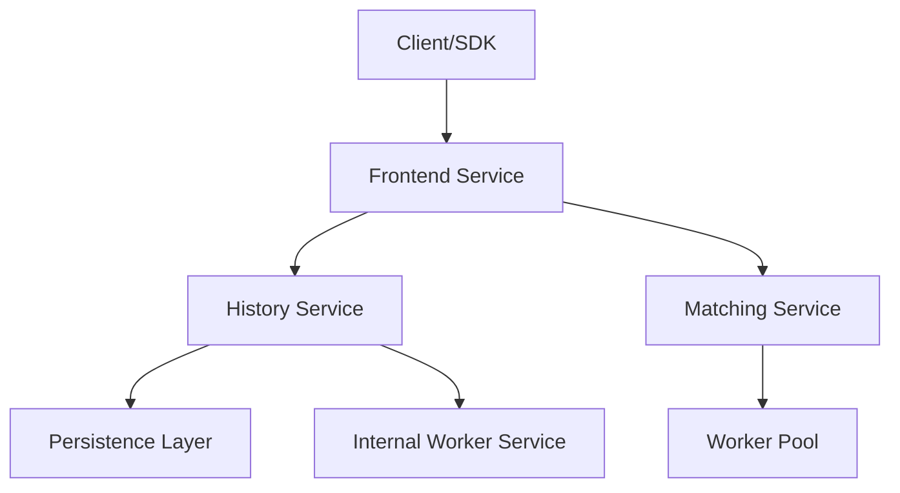

# 3. Temporal 工作流系统架构

## 目录

- [3. Temporal 工作流系统架构](#3-temporal-工作流系统架构)
  - [目录](#目录)
  - [3.1 架构概述](#31-架构概述)
    - [3.1.1 架构分层图](#311-架构分层图)
    - [3.1.2 设计原则](#312-设计原则)
  - [3.2 核心服务与交互流程](#32-核心服务与交互流程)
    - [3.2.1 核心服务组件](#321-核心服务组件)
    - [3.2.2 交互流程](#322-交互流程)
  - [3.3 工作流模型与执行语义](#33-工作流模型与执行语义)
    - [3.3.1 执行流与控制流](#331-执行流与控制流)
    - [3.3.2 组合与模块化](#332-组合与模块化)
    - [3.3.3 语义保证](#333-语义保证)
  - [3.4 事件溯源与确定性重放](#34-事件溯源与确定性重放)
  - [3.5 任务队列与调度机制](#35-任务队列与调度机制)
  - [3.6 持久化与分片机制](#36-持久化与分片机制)
  - [3.7 代码结构与设计模式](#37-代码结构与设计模式)
  - [3.8 应用模式与最佳实践](#38-应用模式与最佳实践)
  - [3.9 形式化分析与理论保证](#39-形式化分析与理论保证)
  - [3.10 局限性与批判性分析](#310-局限性与批判性分析)

## 3.1 架构概述

Temporal 是一个分布式、持久化、容错的工作流编排平台，支持多语言 SDK（Go、Java、Python、TypeScript、Rust等）。其核心理念是 Durable Execution：即使在进程、机器或数据中心故障时，工作流状态也能可靠保存和恢复。

### 3.1.1 架构分层图



### 3.1.2 设计原则

- 服务分离、分片、持久化、事件溯源、确定性重放
- 可伸缩性、可靠性、持久性、接口驱动

## 3.2 核心服务与交互流程

### 3.2.1 核心服务组件

- **Frontend Service**：API入口，路由、认证、无状态
- **History Service**：事件历史、状态管理、分片、定时器
- **Matching Service**：任务队列、任务分发、粘性队列
- **Internal Worker Service**：系统工作流、归档、复制
- **Persistence Layer**：Cassandra/PostgreSQL/MySQL/Elasticsearch

### 3.2.2 交互流程

- 启动工作流：Client → Frontend → History → Matching
- Worker处理Workflow/Activity Task：Worker ↔ Matching ↔ History
- 信号/查询：Client → Frontend → History → Worker/缓存

## 3.3 工作流模型与执行语义

### 3.3.1 执行流与控制流

- 顺序、并发、分支、循环、事件等待、定时器、信号
- 代码即状态机，隐式状态转移

### 3.3.2 组合与模块化

- 子工作流、Continue-As-New、跨命名空间调用、服务编排

### 3.3.3 语义保证

- 工作流Exactly-Once，Activity At-Least-Once（需幂等）
- 持久化、可靠性、可恢复性

## 3.4 事件溯源与确定性重放

- 所有状态变迁持久化为事件（Event Sourcing）
- Worker重放事件历史，恢复状态，继续执行
- 确定性约束：禁止非确定性操作，需用SideEffect等API

## 3.5 任务队列与调度机制

- Matching服务维护任务队列，支持长轮询、粘性队列
- Workflow/Activity Task分发给Worker池
- 任务ACK机制，保证不丢失

## 3.6 持久化与分片机制

- History服务分片（Consistent Hash），每个分片负责一部分工作流生命周期
- 持久化层抽象接口，支持多种后端
- 故障转移：分片可被其他节点接管

## 3.7 代码结构与设计模式

- SOA、接口驱动、依赖注入、命令模式、事件溯源、Future/Promise
- SDK分层：workflow/activity/client/worker/converter
- 代码示例（Go/Rust）：

```go
// Go 工作流示例
func MyWorkflow(ctx workflow.Context, input string) (string, error) {
    var result string
    err := workflow.ExecuteActivity(ctx, ActivityA, input).Get(ctx, &result)
    if err != nil {
        return "", err
    }
    return result, nil
}
```

```rust
// Rust Trait 抽象
#[async_trait]
pub trait Workflow: Send + Sync {
    type Input: DeserializeOwned + Send + 'static;
    type Output: Serialize + Send + 'static;
    async fn execute(&self, ctx: &mut WorkflowContext, input: Self::Input) -> Result<Self::Output, WorkflowError>;
}
```

## 3.8 应用模式与最佳实践

- Saga、状态机、轮询、批处理、扇出/扇入、人机交互
- Activity幂等性、粒度适中、心跳、无状态
- Workflow确定性、状态管理、ContinueAsNew、子工作流、版本控制
- 集成模式：微服务编排、事件驱动、API触发、异步任务、数据管道、基础设施自动化、金融电商

## 3.9 形式化分析与理论保证

- 图灵完备性、工作流模式覆盖
- 事件溯源+确定性重放=精确一次语义
- Activity需幂等，业务精确一次需Token
- 形式化定理：

\[
\text{Theorem 3.1 (Workflow Determinism)}: \\
\forall H,\ \text{Replay}(H) = S \implies \text{Exec}(H) = S
\]

- 证明思路：事件历史唯一决定状态，确定性代码保证重放一致

## 3.10 局限性与批判性分析

- 事件历史大小、Worker依赖、Activity失败域、确定性约束、状态/载荷大小、调试复杂性、默认单区域
- 典型反模式：工作流中I/O、巨大Payload、频繁ContinueAsNew、无版本控制、Activity有状态
- 改进建议：多区域复制、自动分片扩容、开发者工具链完善

---

**参考文献**:

1. Temporal官方文档: <https://docs.temporal.io/>
2. 源码: <https://github.com/temporalio/temporal>
3. 分布式系统设计模式
4. 工作流自动化最佳实践
5. 微服务架构设计原则

</rewritten_file>
