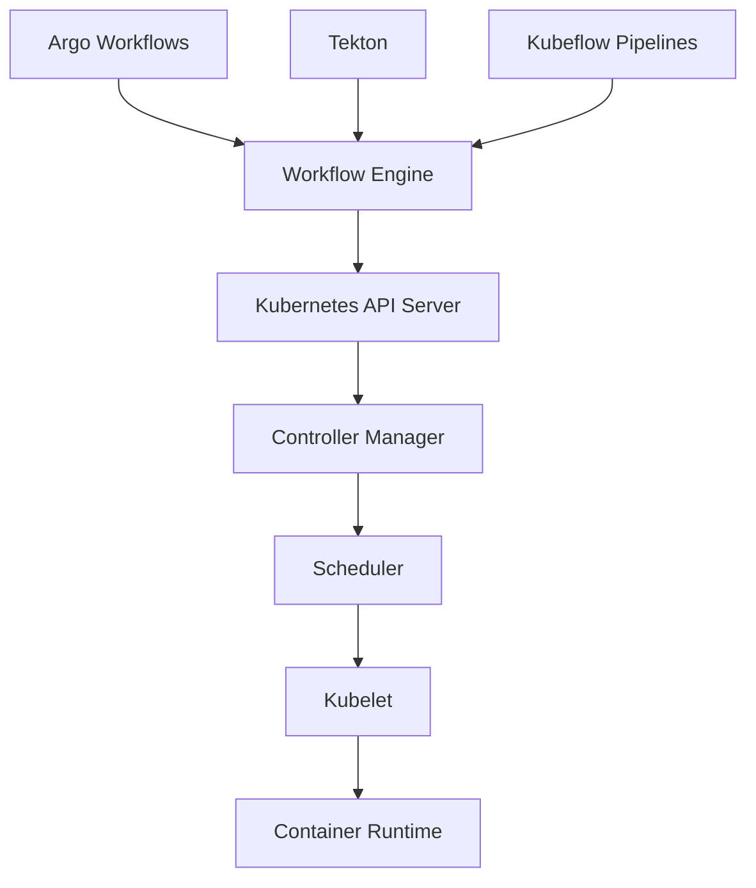

# 4. Kubernetes 工作流引擎

## 目录

- [4. Kubernetes 工作流引擎](#4-kubernetes-工作流引擎)
  - [目录](#目录)
  - [4.1 架构概述](#41-架构概述)
    - [4.1.1 架构分层图](#411-架构分层图)
    - [4.1.2 设计原则](#412-设计原则)
  - [4.2 Kubernetes 原生编排基础](#42-kubernetes-原生编排基础)
    - [4.2.1 控制循环机制](#421-控制循环机制)
    - [4.2.2 资源模型](#422-资源模型)
    - [4.2.3 状态转换系统](#423-状态转换系统)
  - [4.3 Argo Workflows 架构](#43-argo-workflows-架构)
    - [4.3.1 核心概念](#431-核心概念)
    - [4.3.2 架构组件](#432-架构组件)
    - [4.3.3 执行模型](#433-执行模型)
  - [4.4 Tekton 流水线架构](#44-tekton-流水线架构)
    - [4.4.1 核心概念](#441-核心概念)
    - [4.4.2 架构组件](#442-架构组件)
    - [4.4.3 安全实践 - Tekton Chains](#443-安全实践---tekton-chains)
  - [4.5 形式化模型与理论](#45-形式化模型与理论)
    - [4.5.1 工作流与 Kubernetes 等价性](#451-工作流与-kubernetes-等价性)
    - [4.5.2 控制流模式对应](#452-控制流模式对应)
    - [4.5.3 资源管理形式化](#453-资源管理形式化)
  - [4.6 工作流模式映射](#46-工作流模式映射)
    - [4.6.1 控制流模式对应](#461-控制流模式对应)
    - [4.6.2 数据流模式对应](#462-数据流模式对应)
    - [4.6.3 资源模式对应](#463-资源模式对应)
  - [4.7 安全与合规](#47-安全与合规)
    - [4.7.1 供应链安全](#471-供应链安全)
    - [4.7.2 合规性框架](#472-合规性框架)
  - [4.8 性能与扩展性](#48-性能与扩展性)
    - [4.8.1 水平扩展](#481-水平扩展)
    - [4.8.2 资源优化](#482-资源优化)
  - [4.9 最佳实践与反模式](#49-最佳实践与反模式)
    - [4.9.1 最佳实践](#491-最佳实践)
    - [4.9.2 反模式](#492-反模式)
  - [4.10 批判性分析](#410-批判性分析)
    - [4.10.1 优势分析](#4101-优势分析)
    - [4.10.2 局限性分析](#4102-局限性分析)
    - [4.10.3 改进建议](#4103-改进建议)
    - [4.10.4 形式化验证](#4104-形式化验证)

## 4.1 架构概述

Kubernetes 工作流引擎是基于 Kubernetes 原生资源模型构建的分布式工作流编排系统，主要包括 Argo Workflows、Tekton 等。这些引擎利用 Kubernetes 的声明式 API、控制循环机制和资源管理能力，实现复杂工作流的编排和执行。

### 4.1.1 架构分层图



### 4.1.2 设计原则

- 声明式 API、控制循环、资源抽象、可扩展性
- 云原生、容器化、微服务架构

## 4.2 Kubernetes 原生编排基础

### 4.2.1 控制循环机制

Kubernetes 采用声明式 API 和控制循环模式（Observe-Diff-Act）：

```rust
// 控制循环的形式化表达
trait Controller {
    type Resource;
    type Status;
    
    fn observe(&self) -> Self::Status;
    fn desired_state(&self) -> Self::Status;
    fn reconcile(&self, current: Self::Status, desired: Self::Status);
    
    fn run_loop(&self) {
        loop {
            let current = self.observe();
            let desired = self.desired_state();
            self.reconcile(current, desired);
        }
    }
}
```

### 4.2.2 资源模型

Kubernetes 使用声明式资源模型：

```rust
// Kubernetes 资源的形式化定义
struct Resource {
    api_version: String,
    kind: String,
    metadata: Metadata,
    spec: ResourceSpec,
    status: Option<ResourceStatus>,
}

struct Metadata {
    name: String,
    namespace: Option<String>,
    labels: HashMap<String, String>,
    annotations: HashMap<String, String>,
}

// Pod 的形式化定义
struct Pod {
    metadata: Metadata,
    spec: PodSpec,
    status: Option<PodStatus>,
}

struct PodSpec {
    containers: Vec<Container>,
    volumes: Vec<Volume>,
    restart_policy: RestartPolicy,
    node_selector: HashMap<String, String>,
}
```

### 4.2.3 状态转换系统

Kubernetes 编排可形式化为状态转换系统：

```rust
// Kubernetes 状态转换的形式化
enum PodState {
    Pending,
    Running,
    Succeeded,
    Failed,
    Unknown,
}

struct PodStateTransition {
    from: PodState,
    to: PodState,
    condition: Box<dyn Fn() -> bool>,
}

fn apply_transition(state: &mut ClusterState, transition: StateTransition) -> Result<(), Error> {
    match transition {
        StateTransition::Create(resource) => {
            let key = resource_key(&resource);
            if state.resources.contains_key(&key) {
                return Err(Error::AlreadyExists);
            }
            state.resources.insert(key, resource);
        },
        StateTransition::Update(key, resource) => {
            if !state.resources.contains_key(&key) {
                return Err(Error::NotFound);
            }
            state.resources.insert(key, resource);
        },
        StateTransition::Delete(key) => {
            if !state.resources.contains_key(&key) {
                return Err(Error::NotFound);
            }
            state.resources.remove(&key);
        },
    }
    
    // 验证不变量
    validate_invariants(state)?;
    
    Ok(())
}
```

## 4.3 Argo Workflows 架构

### 4.3.1 核心概念

Argo Workflows 是基于 Kubernetes 的工作流引擎，支持 DAG 和步骤式工作流：

```yaml
# Argo Workflows 示例
apiVersion: argoproj.io/v1alpha1
kind: Workflow
metadata:
  generateName: data-pipeline-
spec:
  entrypoint: data-pipeline
  templates:
  - name: data-pipeline
    dag:
      tasks:
      - name: data-ingestion
        template: ingest-data
      - name: data-transformation
        template: transform-data
        dependencies: [data-ingestion]
      - name: data-validation
        template: validate-data
        dependencies: [data-transformation]
      - name: data-export
        template: export-data
        dependencies: [data-validation]
  
  - name: ingest-data
    container:
      image: data-ingestion:latest
      command: [python, /app/ingest.py]
      resources:
        requests:
          memory: "256Mi"
          cpu: "250m"
        limits:
          memory: "512Mi"
          cpu: "500m"
```

### 4.3.2 架构组件

- **Argo Server**: Web UI 和 API 服务
- **Workflow Controller**: 工作流状态管理
- **Workflow Executor**: 任务执行器
- **Artifact Repository**: 制品存储

### 4.3.3 执行模型

Argo Workflows 支持多种执行模式：

- DAG 模式：有向无环图执行
- 步骤模式：顺序执行
- 循环模式：条件循环
- 递归模式：子工作流调用

## 4.4 Tekton 流水线架构

### 4.4.1 核心概念

Tekton 是 Kubernetes 原生的 CI/CD 流水线引擎：

```yaml
# Tekton Pipeline 示例
apiVersion: tekton.dev/v1beta1
kind: Pipeline
metadata:
  name: build-and-deploy
spec:
  params:
  - name: git-url
  - name: git-revision
  tasks:
  - name: fetch-repository
    taskRef:
      name: git-clone
    params:
    - name: url
      value: $(params.git-url)
    - name: revision
      value: $(params.git-revision)
  
  - name: build-image
    taskRef:
      name: kaniko
    runAfter: ["fetch-repository"]
    params:
    - name: IMAGE
      value: gcr.io/myproject/myapp
```

### 4.4.2 架构组件

- **Tekton Pipelines**: 核心流水线引擎
- **Tekton Triggers**: 事件触发机制
- **Tekton Dashboard**: Web UI
- **Tekton CLI**: 命令行工具

### 4.4.3 安全实践 - Tekton Chains

Tekton Chains 提供供应链安全：

```rust
// Tekton Chains 形式化
struct TektonChains {
    provenance_generation: ProvenanceGenerator,
    artifact_signing: ArtifactSigner,
    policy_enforcement: PolicyEnforcer,
}

impl TektonChains {
    fn generate_provenance(&self, build: &Build) -> Provenance {
        // 记录所有构建元数据
        Provenance {
            source: build.source.clone(),
            build_steps: build.steps.clone(),
            artifacts: build.artifacts.clone(),
            timestamp: SystemTime::now(),
        }
    }
    
    fn sign_artifact(&self, artifact: &Artifact, key: &SigningKey) -> SignedArtifact {
        // 使用非对称密钥签名制品
        let signature = self.sign(artifact, key);
        SignedArtifact {
            artifact: artifact.clone(),
            signature,
            key_id: key.id.clone(),
        }
    }
    
    fn verify_deployment(&self, deployment: &Deployment) -> bool {
        // 部署前验证来源和签名
        deployment.artifacts.iter().all(|artifact| {
            self.verify_provenance(artifact) && self.verify_signature(artifact)
        })
    }
}
```

## 4.5 形式化模型与理论

### 4.5.1 工作流与 Kubernetes 等价性

工作流系统与 Kubernetes 编排在形式上等价：

**定理 4.1** (工作流-Kubernetes 等价性): 给定工作流系统 W 和容器编排系统 K，存在同伦等价 F: W ≃ K。

**证明**:

1. 构造函子 F: W → K，将工作流概念映射到容器概念
2. 构造反函子 G: K → W，将容器概念映射回工作流概念
3. 证明自然等价 η: Id_W ≃ G∘F 和 ε: F∘G ≃ Id_K

### 4.5.2 控制流模式对应

Kubernetes 实现的控制流模式与标准工作流模式具有形式对应关系：

```rust
// Kubernetes 中的顺序模式 (InitContainer)
struct PodSpec {
    init_containers: Vec<Container>,  // 按顺序执行
    containers: Vec<Container>,       // 并行执行
}

// Kubernetes 中的并行模式 (Deployment)
struct DeploymentSpec {
    replicas: i32,              // 并行实例数
    parallel_policy: Strategy,  // 并行策略
}

// Kubernetes 中的同步模式 (Job completions)
struct JobSpec {
    completions: i32,           // 需要完成的副本数
    parallelism: i32,           // 并行运行的副本数
}
```

### 4.5.3 资源管理形式化

Kubernetes 的资源管理可形式化为线性逻辑系统：

```rust
// Kubernetes 资源管理的线性类型表示
struct ResourceQuota<T>(T);

struct ResourceRequest {
    cpu: Quantity,
    memory: Quantity,
}

struct ResourceLimit {
    cpu: Quantity,
    memory: Quantity,
}

// 资源消耗关系
fn consume_resources<T>(resource: &ResourceQuota<T>, request: &ResourceRequest) -> Result<(), Error> {
    if resource.available() >= request.total() {
        resource.allocate(request);
        Ok(())
    } else {
        Err(Error::InsufficientResources)
    }
}
```

## 4.6 工作流模式映射

### 4.6.1 控制流模式对应

| 工作流模式 | Kubernetes 实现 | 形式化关系 |
|------------|-----------------|------------|
| 顺序模式 | InitContainer 序列执行 | 严格有序执行语义等价 |
| 并行分支 | Pod 中容器并行 | 多实例并行执行语义等价 |
| 同步模式 | Job completions | 等待多个并行执行完成 |
| 选择模式 | 基于标签选择器的路由 | 基于条件的路由决策 |

### 4.6.2 数据流模式对应

| 数据流模式 | Kubernetes 实现 | 形式化关系 |
|------------|-----------------|------------|
| 数据传递 | ConfigMap/Secret | 配置数据注入容器 |
| 数据转换 | Init/Sidecar | 数据预处理和后处理 |
| 数据路由 | Service/Ingress | 网络路由和数据分发 |

### 4.6.3 资源模式对应

| 资源模式 | Kubernetes 实现 | 形式化关系 |
|----------|-----------------|------------|
| 资源分配 | Requests/Limits | 资源请求和限制 |
| 资源池 | Namespace/Node 池 | 资源隔离和共享 |
| 资源限制 | Quota/LimitRange | 资源使用上限控制 |

## 4.7 安全与合规

### 4.7.1 供应链安全

Kubernetes 工作流引擎支持端到端供应链安全：

```rust
// 供应链安全形式化
struct SupplyChainSecurity {
    provenance: Provenance,
    signatures: Vec<Signature>,
    policies: Vec<Policy>,
}

struct Provenance {
    source_code: SourceCode,
    build_steps: Vec<BuildStep>,
    artifacts: Vec<Artifact>,
    dependencies: Vec<Dependency>,
}

impl SupplyChainSecurity {
    fn verify_chain(&self) -> bool {
        // 验证整个供应链
        self.verify_source() &&
        self.verify_build() &&
        self.verify_signatures() &&
        self.verify_deployment()
    }
    
    fn verify_source(&self) -> bool {
        // 验证源代码来源
        self.provenance.source_code.verified
    }
    
    fn verify_build(&self) -> bool {
        // 验证构建过程
        self.provenance.build_steps.iter().all(|step| step.verified)
    }
    
    fn verify_signatures(&self) -> bool {
        // 验证制品签名
        self.signatures.iter().all(|sig| sig.valid)
    }
}
```

### 4.7.2 合规性框架

支持医疗健康等领域的合规要求：

```rust
// HIPAA 合规性形式化
struct HIPAACompliance {
    privacy_rules: Vec<PrivacyRule>,
    security_rules: Vec<SecurityRule>,
    data_protection: Vec<DataProtection>,
}

struct PrivacyRule {
    data_classification: DataClassification,
    access_control: AccessControl,
    audit_requirements: AuditRequirements,
}

impl HIPAACompliance {
    fn verify_compliance(&self, operation: &Operation, data: &Data) -> bool {
        match data.classification {
            DataClassification::PHI => {
                self.verify_phi_handling(operation, data)
            },
            DataClassification::PII => {
                self.verify_pii_handling(operation, data)
            },
            DataClassification::Normal => {
                true
            }
        }
    }
    
    fn verify_phi_handling(&self, operation: &Operation, data: &Data) -> bool {
        data.encrypted &&
        self.authorized_access(operation.actor, data, operation.action) &&
        self.audit_logged(operation, data)
    }
}
```

## 4.8 性能与扩展性

### 4.8.1 水平扩展

Kubernetes 工作流引擎支持水平扩展：

```rust
// 水平扩展策略
struct HorizontalScaling {
    min_replicas: i32,
    max_replicas: i32,
    target_cpu_utilization: f64,
    target_memory_utilization: f64,
}

impl HorizontalScaling {
    fn calculate_desired_replicas(&self, current_metrics: &Metrics) -> i32 {
        let cpu_ratio = current_metrics.cpu_usage / self.target_cpu_utilization;
        let memory_ratio = current_metrics.memory_usage / self.target_memory_utilization;
        let desired_ratio = cpu_ratio.max(memory_ratio);
        
        let desired_replicas = (current_metrics.current_replicas as f64 * desired_ratio).ceil() as i32;
        desired_replicas.clamp(self.min_replicas, self.max_replicas)
    }
}
```

### 4.8.2 资源优化

支持资源使用优化：

```rust
// 资源优化策略
struct ResourceOptimization {
    cpu_requests: Quantity,
    cpu_limits: Quantity,
    memory_requests: Quantity,
    memory_limits: Quantity,
}

impl ResourceOptimization {
    fn optimize_resources(&mut self, usage_history: &[ResourceUsage]) {
        // 基于历史使用情况优化资源分配
        let avg_cpu = usage_history.iter().map(|u| u.cpu).sum::<f64>() / usage_history.len() as f64;
        let avg_memory = usage_history.iter().map(|u| u.memory).sum::<f64>() / usage_history.len() as f64;
        
        self.cpu_requests = Quantity::from_millicores((avg_cpu * 0.8) as i64);
        self.cpu_limits = Quantity::from_millicores((avg_cpu * 1.2) as i64);
        self.memory_requests = Quantity::from_mebibytes((avg_memory * 0.8) as i64);
        self.memory_limits = Quantity::from_mebibytes((avg_memory * 1.2) as i64);
    }
}
```

## 4.9 最佳实践与反模式

### 4.9.1 最佳实践

1. **资源管理**：合理设置 requests 和 limits
2. **错误处理**：实现重试和回滚机制
3. **监控告警**：建立完善的监控体系
4. **安全加固**：实施最小权限原则
5. **版本管理**：使用语义化版本控制

### 4.9.2 反模式

1. **资源过度分配**：设置过高的资源限制
2. **硬编码配置**：在代码中硬编码配置值
3. **缺乏监控**：没有建立监控和告警
4. **安全忽视**：忽略安全最佳实践
5. **过度复杂**：设计过于复杂的工作流

## 4.10 批判性分析

### 4.10.1 优势分析

1. **云原生**：完全基于 Kubernetes 生态
2. **可扩展性**：支持大规模分布式部署
3. **标准化**：使用标准 Kubernetes 资源
4. **生态系统**：丰富的工具和插件
5. **社区支持**：活跃的开源社区

### 4.10.2 局限性分析

1. **学习曲线**：需要深入理解 Kubernetes
2. **复杂性**：配置和管理相对复杂
3. **资源开销**：需要额外的 Kubernetes 资源
4. **调试困难**：分布式环境调试复杂
5. **供应商锁定**：依赖 Kubernetes 生态

### 4.10.3 改进建议

1. **简化配置**：提供更友好的配置界面
2. **增强监控**：提供更丰富的监控指标
3. **优化性能**：减少资源开销
4. **改进调试**：提供更好的调试工具
5. **扩展生态**：支持更多工作流引擎

### 4.10.4 形式化验证

**定理 4.2** (Kubernetes 工作流正确性): 对于 Kubernetes 工作流 W，如果满足以下条件：

1. W 的资源定义正确
2. 控制循环正常运行
3. 资源配额充足

则 Kubernetes 能够正确执行工作流 W。

**证明**: 通过 Kubernetes 控制循环理论和资源管理机制进行证明。

**定理 4.3** (工作流引擎等价性): Argo Workflows 和 Tekton 在表达能力上等价，都能实现图灵完备的工作流。

**证明**: 通过构造双向转换函数，证明两种引擎可以相互模拟。

---

**参考文献**:

1. Kubernetes 官方文档: <https://kubernetes.io/docs/>
2. Argo Workflows 文档: <https://argoproj.github.io/workflows/>
3. Tekton 文档: <https://tekton.dev/docs/>
4. 分布式系统设计模式
5. 云原生架构设计原则
