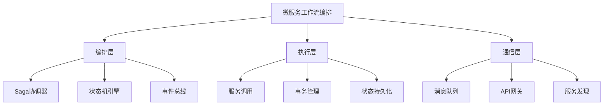

# 5. 微服务工作流编排

## 目录

- [5. 微服务工作流编排](#5-微服务工作流编排)
  - [目录](#目录)
  - [5.1 架构概述](#51-架构概述)
    - [5.1.1 架构分层图](#511-架构分层图)
    - [5.1.2 核心模式](#512-核心模式)
  - [5.2 Saga模式实现](#52-saga模式实现)
    - [5.2.1 Saga模式概述](#521-saga模式概述)
    - [5.2.2 Go实现示例](#522-go实现示例)
  - [5.3 分布式事务管理](#53-分布式事务管理)
    - [5.3.1 Saga编排器实现](#531-saga编排器实现)
  - [5.4 事件驱动工作流](#54-事件驱动工作流)
    - [5.4.1 事件驱动架构](#541-事件驱动架构)
    - [5.4.2 Java实现示例](#542-java实现示例)
  - [5.5 状态机驱动模式](#55-状态机驱动模式)
    - [5.5.1 状态机定义](#551-状态机定义)
  - [5.6 形式化模型与理论](#56-形式化模型与理论)
    - [5.6.1 分布式事务理论](#561-分布式事务理论)
    - [5.6.2 事件驱动工作流理论](#562-事件驱动工作流理论)
  - [5.7 容错与恢复机制](#57-容错与恢复机制)
    - [5.7.1 熔断器模式](#571-熔断器模式)
    - [5.7.2 重试机制](#572-重试机制)
  - [5.8 性能优化策略](#58-性能优化策略)
    - [5.8.1 并行执行](#581-并行执行)
    - [5.8.2 缓存策略](#582-缓存策略)
  - [5.9 最佳实践与反模式](#59-最佳实践与反模式)
    - [5.9.1 最佳实践](#591-最佳实践)
    - [5.9.2 反模式](#592-反模式)
  - [5.10 批判性分析](#510-批判性分析)
    - [5.10.1 优势分析](#5101-优势分析)
    - [5.10.2 局限性分析](#5102-局限性分析)
    - [5.10.3 改进建议](#5103-改进建议)
    - [5.10.4 形式化验证](#5104-形式化验证)

## 5.1 架构概述

微服务工作流编排是在分布式微服务架构中协调多个服务执行复杂业务流程的技术。
它解决了微服务架构中的分布式事务、服务协调、状态管理等关键问题。

### 5.1.1 架构分层图



### 5.1.2 核心模式

- Saga模式、事件驱动、状态机驱动、命令查询职责分离(CQRS)
- 分布式事务、补偿机制、幂等性保证

## 5.2 Saga模式实现

### 5.2.1 Saga模式概述

Saga模式是一种长事务解决方案，将分布式事务分解为本地事务序列，并为每个本地事务定义补偿操作。

```rust
// Saga事务管理器
struct SagaManager {
    active_sagas: Arc<RwLock<HashMap<String, SagaState>>>,
    participants: Arc<RwLock<HashMap<String, SagaParticipantClient>>>,
    transaction_timeout: Duration,
    saga_log: Arc<dyn SagaLog>,
}

// Saga状态
struct SagaState {
    id: String,
    status: SagaStatus,
    steps: Vec<SagaStep>,
    current_step: usize,
    start_time: Instant,
    completion_sender: Option<oneshot::Sender<Result<(), SagaError>>>,
}

// Saga步骤
struct SagaStep {
    participant: String,
    action: SagaAction,
    compensation: SagaAction,
    status: StepStatus,
}
```

### 5.2.2 Go实现示例

```go
// 分布式事务工作流实现 - Saga模式
func OrderTransactionWorkflow(ctx workflow.Context, orderRequest OrderRequest) (OrderResult, error) {
    logger := workflow.GetLogger(ctx)
    logger.Info("Order transaction workflow started", "orderId", orderRequest.OrderID)
    
    // 活动选项
    activityOptions := workflow.ActivityOptions{
        ScheduleToStartTimeout: time.Minute,
        StartToCloseTimeout:    time.Minute * 5,
        RetryPolicy: &temporal.RetryPolicy{
            InitialInterval:    time.Second,
            BackoffCoefficient: 2.0,
            MaximumInterval:    time.Minute,
            MaximumAttempts:    3,
        },
    }
    
    ctx = workflow.WithActivityOptions(ctx, activityOptions)
    
    // Saga定义 - 将每个步骤与其对应的补偿步骤关联起来
    saga := workflow.NewSaga(
        workflow.SagaOptions{
            Parallelism: 1, // 按顺序执行补偿
        },
    )
    
    var orderDetails OrderDetails
    var inventoryResult InventoryResult
    var paymentResult PaymentResult
    var shippingResult ShippingResult
    
    // 步骤1: 创建订单
    err := workflow.ExecuteActivity(ctx, "OrderService_CreateOrder", orderRequest).Get(ctx, &orderDetails)
    if err != nil {
        return OrderResult{
            OrderID: orderRequest.OrderID,
            Status:  "FAILED",
            Error:   fmt.Sprintf("Failed to create order: %v", err),
        }, err
    }
    
    // 注册订单创建的补偿操作
    saga.AddCompensation(func(ctx workflow.Context) error {
        return workflow.ExecuteActivity(
            ctx, "OrderService_CancelOrder", orderDetails.OrderID,
        ).Get(ctx, nil)
    })
    
    // 步骤2: 库存预留
    err = workflow.ExecuteActivity(ctx, "InventoryService_ReserveInventory", 
        InventoryRequest{
            OrderID: orderDetails.OrderID,
            Items:   orderRequest.Items,
        }).Get(ctx, &inventoryResult)
    
    if err != nil {
        return OrderResult{
            OrderID: orderDetails.OrderID,
            Status:  "FAILED",
            Error:   fmt.Sprintf("Failed to reserve inventory: %v", err),
        }, err
    }
    
    // 注册库存预留的补偿操作
    saga.AddCompensation(func(ctx workflow.Context) error {
        return workflow.ExecuteActivity(
            ctx, "InventoryService_ReleaseInventory", 
            inventoryResult.ReservationID,
        ).Get(ctx, nil)
    })
    
    // 步骤3: 处理支付
    err = workflow.ExecuteActivity(ctx, "PaymentService_ProcessPayment",
        PaymentRequest{
            OrderID: orderDetails.OrderID,
            Amount:  orderRequest.TotalAmount,
            Method:  orderRequest.PaymentMethod,
        }).Get(ctx, &paymentResult)
    
    if err != nil {
        return OrderResult{
            OrderID: orderDetails.OrderID,
            Status:  "FAILED",
            Error:   fmt.Sprintf("Failed to process payment: %v", err),
        }, err
    }
    
    // 注册支付处理的补偿操作
    saga.AddCompensation(func(ctx workflow.Context) error {
        return workflow.ExecuteActivity(
            ctx, "PaymentService_RefundPayment", 
            paymentResult.TransactionID,
        ).Get(ctx, nil)
    })
    
    // 步骤4: 创建物流单
    err = workflow.ExecuteActivity(ctx, "ShippingService_CreateShipment",
        ShippingRequest{
            OrderID:         orderDetails.OrderID,
            DeliveryAddress: orderRequest.DeliveryAddress,
            Items:           orderRequest.Items,
        }).Get(ctx, &shippingResult)
    
    if err != nil {
        return OrderResult{
            OrderID: orderDetails.OrderID,
            Status:  "FAILED",
            Error:   fmt.Sprintf("Failed to create shipment: %v", err),
        }, err
    }
    
    // 注册物流创建的补偿操作
    saga.AddCompensation(func(ctx workflow.Context) error {
        return workflow.ExecuteActivity(
            ctx, "ShippingService_CancelShipment", 
            shippingResult.ShipmentID,
        ).Get(ctx, nil)
    })
    
    // 步骤5: 完成订单
    err = workflow.ExecuteActivity(ctx, "OrderService_CompleteOrder",
        orderDetails.OrderID).Get(ctx, nil)
    
    if err != nil {
        return OrderResult{
            OrderID: orderDetails.OrderID,
            Status:  "FAILED",
            Error:   fmt.Sprintf("Failed to complete order: %v", err),
        }, err
    }
    
    logger.Info("Order transaction workflow completed successfully", "orderId", orderDetails.OrderID)
    
    return OrderResult{
        OrderID:       orderDetails.OrderID,
        Status:        "COMPLETED",
        PaymentID:     paymentResult.TransactionID,
        TrackingNumber: shippingResult.TrackingNumber,
    }, nil
}
```

## 5.3 分布式事务管理

### 5.3.1 Saga编排器实现

```go
// Saga编排器
type SagaOrchestrator struct {
    workflowStore   WorkflowStore
    serviceRegistry ServiceRegistry
    stateManager    StateManager
    eventPublisher  EventPublisher
}

// 事务步骤
type TransactionStep struct {
    ID          string                 `json:"id"`
    ServiceName string                 `json:"service_name"`
    Operation   string                 `json:"operation"`
    Compensation string                `json:"compensation"`
    Input       map[string]interface{} `json:"input"`
    Output      map[string]interface{} `json:"output,omitempty"`
    Status      string                 `json:"status"`
    Error       *ServiceError          `json:"error,omitempty"`
}

// Saga实例
type SagaInstance struct {
    ID         string            `json:"id"`
    Status     string            `json:"status"`
    StartTime  time.Time         `json:"start_time"`
    EndTime    *time.Time        `json:"end_time,omitempty"`
    Steps      []TransactionStep `json:"steps"`
    CurrentStep int              `json:"current_step"`
    RollingBack bool             `json:"rolling_back"`
}

// StartSaga 开始一个新的Saga事务
func (s *SagaOrchestrator) StartSaga(
    ctx context.Context,
    sagaDefinition SagaDefinition,
    input map[string]interface{},
) (string, error) {
    // 创建新的Saga实例
    sagaID := generateSagaID()
    steps := make([]TransactionStep, len(sagaDefinition.Steps))
    
    // 初始化步骤
    for i, stepDef := range sagaDefinition.Steps {
        steps[i] = TransactionStep{
            ID:          stepDef.ID,
            ServiceName: stepDef.ServiceName,
            Operation:   stepDef.Operation,
            Compensation: stepDef.Compensation,
            Input:       resolveStepInput(stepDef.InputMapping, input, nil),
            Status:      "PENDING",
        }
    }
    
    saga := &SagaInstance{
        ID:         sagaID,
        Status:     "RUNNING",
        StartTime:  time.Now(),
        Steps:      steps,
        CurrentStep: 0,
        RollingBack: false,
    }
    
    // 保存Saga实例
    if err := s.stateManager.SaveSaga(ctx, saga); err != nil {
        return "", fmt.Errorf("failed to save saga: %w", err)
    }
    
    // 发布Saga开始事件
    startEvent := SagaEvent{
        Type:    "SAGA_STARTED",
        SagaID:  sagaID,
        Time:    time.Now(),
    }
    s.eventPublisher.PublishEvent(ctx, startEvent)
    
    // 异步执行Saga
    go s.executeSaga(context.Background(), saga)
    
    return sagaID, nil
}

// executeSaga 执行Saga事务
func (s *SagaOrchestrator) executeSaga(ctx context.Context, saga *SagaInstance) {
    for saga.CurrentStep < len(saga.Steps) && !saga.RollingBack {
        step := &saga.Steps[saga.CurrentStep]
        step.Status = "IN_PROGRESS"
        s.stateManager.UpdateSaga(ctx, saga)
        
        // 获取服务
        service, err := s.serviceRegistry.GetService(step.ServiceName)
        if err != nil {
            step.Status = "FAILED"
            step.Error = &ServiceError{
                Code:    "SERVICE_NOT_FOUND",
                Message: fmt.Sprintf("Service %s not found", step.ServiceName),
            }
            saga.RollingBack = true
            s.stateManager.UpdateSaga(ctx, saga)
            continue
        }
        
        // 执行操作
        result, err := service.Execute(ctx, step.Operation, step.Input)
        if err != nil {
            step.Status = "FAILED"
            step.Error = &ServiceError{
                Code:    "OPERATION_FAILED",
                Message: fmt.Sprintf("Operation %s failed", step.Operation),
                Details: err.Error(),
            }
            saga.RollingBack = true
            s.stateManager.UpdateSaga(ctx, saga)
            continue
        }
        
        // 更新步骤状态
        step.Status = "COMPLETED"
        step.Output = result
        saga.CurrentStep++
        s.stateManager.UpdateSaga(ctx, saga)
    }
    
    // 如果需要回滚
    if saga.RollingBack {
        s.rollbackSaga(ctx, saga)
    } else {
        // 全部步骤成功完成
        now := time.Now()
        saga.Status = "COMPLETED"
        saga.EndTime = &now
        s.stateManager.UpdateSaga(ctx, saga)
        
        // 发布Saga完成事件
        completeEvent := SagaEvent{
            Type:    "SAGA_COMPLETED",
            SagaID:  saga.ID,
            Time:    time.Now(),
        }
        s.eventPublisher.PublishEvent(ctx, completeEvent)
    }
}

// rollbackSaga 回滚Saga事务
func (s *SagaOrchestrator) rollbackSaga(ctx context.Context, saga *SagaInstance) {
    // 从当前步骤开始回滚
    for i := saga.CurrentStep - 1; i >= 0; i-- {
        step := &saga.Steps[i]
        
        // 只回滚已完成的步骤
        if step.Status != "COMPLETED" {
            continue
        }
        
        // 获取服务
        service, err := s.serviceRegistry.GetService(step.ServiceName)
        if err != nil {
            // 记录回滚失败，但继续尝试其他步骤
            step.Status = "COMPENSATION_FAILED"
            step.Error = &ServiceError{
                Code:    "SERVICE_NOT_FOUND",
                Message: fmt.Sprintf("Compensation service %s not found", step.ServiceName),
            }
            s.stateManager.UpdateSaga(ctx, saga)
            continue
        }
        
        // 执行补偿操作
        _, err = service.Execute(ctx, step.Compensation, step.Output)
        if err != nil {
            step.Status = "COMPENSATION_FAILED"
            step.Error = &ServiceError{
                Code:    "COMPENSATION_FAILED",
                Message: fmt.Sprintf("Compensation %s failed", step.Compensation),
                Details: err.Error(),
            }
        } else {
            step.Status = "COMPENSATED"
        }
        
        s.stateManager.UpdateSaga(ctx, saga)
    }
    
    // 更新Saga状态
    now := time.Now()
    saga.Status = "ROLLED_BACK"
    saga.EndTime = &now
    s.stateManager.UpdateSaga(ctx, saga)
    
    // 发布Saga回滚事件
    rollbackEvent := SagaEvent{
        Type:    "SAGA_ROLLED_BACK",
        SagaID:  saga.ID,
        Time:    time.Now(),
    }
    s.eventPublisher.PublishEvent(ctx, rollbackEvent)
}
```

## 5.4 事件驱动工作流

### 5.4.1 事件驱动架构

事件驱动工作流基于事件触发和响应机制，实现松耦合的服务编排：

```rust
// 事件驱动工作流引擎
struct EventDrivenWorkflowEngine {
    event_bus: Arc<dyn EventBus>,
    workflow_registry: Arc<RwLock<HashMap<String, WorkflowDefinition>>>,
    state_store: Arc<dyn StateStore>,
    event_handlers: Arc<RwLock<HashMap<String, Vec<EventHandler>>>>,
}

// 事件定义
#[derive(Clone, Debug, Serialize, Deserialize)]
struct WorkflowEvent {
    id: String,
    workflow_id: String,
    event_type: String,
    payload: Value,
    timestamp: DateTime<Utc>,
    correlation_id: String,
}

// 事件处理器
struct EventHandler {
    event_type: String,
    handler: Box<dyn Fn(WorkflowEvent) -> Result<(), Error> + Send + Sync>,
}

impl EventDrivenWorkflowEngine {
    // 注册事件处理器
    pub fn register_handler(
        &self,
        event_type: &str,
        handler: impl Fn(WorkflowEvent) -> Result<(), Error> + Send + Sync + 'static,
    ) {
        let mut handlers = self.event_handlers.write().unwrap();
        handlers
            .entry(event_type.to_string())
            .or_insert_with(Vec::new)
            .push(EventHandler {
                event_type: event_type.to_string(),
                handler: Box::new(handler),
            });
    }
    
    // 发布事件
    pub async fn publish_event(&self, event: WorkflowEvent) -> Result<(), Error> {
        // 发布到事件总线
        self.event_bus.publish(event.clone()).await?;
        
        // 本地处理
        self.handle_event(event).await?;
        
        Ok(())
    }
    
    // 处理事件
    async fn handle_event(&self, event: WorkflowEvent) -> Result<(), Error> {
        let handlers = {
            let handlers = self.event_handlers.read().unwrap();
            handlers
                .get(&event.event_type)
                .cloned()
                .unwrap_or_default()
        };
        
        for handler in handlers {
            if let Err(e) = (handler.handler)(event.clone()) {
                tracing::error!("Event handler failed: {}", e);
            }
        }
        
        Ok(())
    }
}
```

### 5.4.2 Java实现示例

```java
// 订单状态机服务
public class OrderStateMachineService {
    
    @Autowired
    private StateMachine<OrderStatus, OrderEvent> stateMachine;
    
    @Autowired
    private StateMachinePersister<OrderStatus, OrderEvent, String> persister;
    
    @Autowired
    private StreamBridge streamBridge;
    
    public boolean processEvent(String orderId, OrderEvent event) {
        try {
            // 恢复订单的状态机状态
            persister.restore(stateMachine, orderId);
            
            // 发送事件到状态机
            boolean accepted = stateMachine.sendEvent(event);
            
            if (accepted) {
                // 保存更新后的状态
                persister.persist(stateMachine, orderId);
                
                // 发布状态变更事件
                streamBridge.send("orderStatusChangedChannel", 
                    new OrderStatusChangedEvent(orderId, stateMachine.getState().getId()));
            }
            
            return accepted;
        } catch (Exception e) {
            throw new RuntimeException("Error processing order state event", e);
        }
    }
}
```

## 5.5 状态机驱动模式

### 5.5.1 状态机定义

状态机驱动模式使用有限状态机来管理工作流状态：

```rust
// 状态机定义
struct StateMachine<S, E> {
    states: HashSet<S>,
    events: HashSet<E>,
    transitions: HashMap<(S, E), S>,
    initial_state: S,
    final_states: HashSet<S>,
}

// 状态机执行器
struct StateMachineExecutor<S, E> {
    state_machine: StateMachine<S, E>,
    current_state: S,
    state_store: Arc<dyn StateStore>,
}

impl<S, E> StateMachineExecutor<S, E>
where
    S: Clone + Eq + Hash + Serialize + DeserializeOwned + Send + Sync + 'static,
    E: Clone + Eq + Hash + Serialize + DeserializeOwned + Send + Sync + 'static,
{
    // 处理事件
    pub async fn process_event(&mut self, event: E) -> Result<bool, Error> {
        let transition_key = (self.current_state.clone(), event.clone());
        
        if let Some(&next_state) = self.state_machine.transitions.get(&transition_key) {
            // 执行状态转换
            self.current_state = next_state.clone();
            
            // 持久化状态
            self.state_store.save_state(&self.current_state).await?;
            
            // 发布状态变更事件
            self.publish_state_change_event(&self.current_state).await?;
            
            Ok(true)
        } else {
            // 无效转换
            Ok(false)
        }
    }
    
    // 发布状态变更事件
    async fn publish_state_change_event(&self, state: &S) -> Result<(), Error> {
        let event = StateChangeEvent {
            state: serde_json::to_value(state)?,
            timestamp: Utc::now(),
        };
        
        // 发布到事件总线
        // self.event_bus.publish(event).await?;
        
        Ok(())
    }
}
```

## 5.6 形式化模型与理论

### 5.6.1 分布式事务理论

Saga模式的形式化定义：

**定义 5.1** (Saga): 一个Saga是一个有限的事务序列 T = ⟨t₁, t₂, ..., tₙ⟩，其中每个事务 tᵢ 都有一个对应的补偿事务 cᵢ。

**定义 5.2** (Saga执行): Saga的执行是一个状态转换系统 (S, Σ, δ, s₀, F)，其中：

- S = {PENDING, RUNNING, COMPLETED, FAILED, COMPENSATING}
- Σ = {START, SUCCESS, FAILURE, COMPENSATE}
- s₀ = PENDING
- F = {COMPLETED, FAILED}

**定理 5.1** (Saga正确性): 如果Saga中的每个事务都是幂等的，且补偿事务能够正确撤销原事务的效果，则Saga能够保证最终一致性。

**证明**: 通过归纳法证明，当任何事务失败时，已执行事务的补偿操作能够将系统恢复到初始状态。

### 5.6.2 事件驱动工作流理论

事件驱动工作流的形式化模型：

**定义 5.3** (事件流): 事件流是一个序列 E = ⟨e₁, e₂, ..., eₙ⟩，其中每个事件 eᵢ 都有一个类型和负载。

**定义 5.4** (事件处理器): 事件处理器是一个函数 f: Event → Action，将事件映射到相应的动作。

**定理 5.2** (事件驱动正确性): 如果事件处理器是确定性的，且事件总线保证至少一次传递，则事件驱动工作流能够保证正确性。

## 5.7 容错与恢复机制

### 5.7.1 熔断器模式

```rust
// 熔断器实现
struct CircuitBreaker {
    failure_threshold: usize,
    recovery_timeout: Duration,
    state: Arc<RwLock<CircuitBreakerState>>,
}

enum CircuitBreakerState {
    Closed { failure_count: usize },
    Open { last_failure_time: Instant },
    HalfOpen,
}

impl CircuitBreaker {
    pub async fn call<F, Fut, T, E>(&self, f: F) -> Result<T, CircuitBreakerError<E>>
    where
        F: FnOnce() -> Fut,
        Fut: Future<Output = Result<T, E>>,
    {
        let state = self.state.read().unwrap();
        
        match *state {
            CircuitBreakerState::Closed { failure_count } => {
                if failure_count >= self.failure_threshold {
                    return Err(CircuitBreakerError::Open);
                }
                
                // 执行操作
                drop(state);
                match f().await {
                    Ok(result) => {
                        self.record_success();
                        Ok(result)
                    }
                    Err(e) => {
                        self.record_failure();
                        Err(CircuitBreakerError::Service(e))
                    }
                }
            }
            CircuitBreakerState::Open { last_failure_time } => {
                if last_failure_time.elapsed() >= self.recovery_timeout {
                    // 尝试半开状态
                    drop(state);
                    self.transition_to_half_open();
                    self.call(f).await
                } else {
                    Err(CircuitBreakerError::Open)
                }
            }
            CircuitBreakerState::HalfOpen => {
                // 半开状态，允许一次尝试
                drop(state);
                match f().await {
                    Ok(result) => {
                        self.transition_to_closed();
                        Ok(result)
                    }
                    Err(e) => {
                        self.transition_to_open();
                        Err(CircuitBreakerError::Service(e))
                    }
                }
            }
        }
    }
}
```

### 5.7.2 重试机制

```rust
// 重试策略
struct RetryPolicy {
    max_attempts: usize,
    initial_delay: Duration,
    max_delay: Duration,
    backoff_multiplier: f64,
}

impl RetryPolicy {
    pub async fn execute<F, Fut, T, E>(&self, f: F) -> Result<T, E>
    where
        F: Fn() -> Fut + Send + Sync,
        Fut: Future<Output = Result<T, E>> + Send,
        E: std::fmt::Debug,
    {
        let mut attempt = 0;
        let mut delay = self.initial_delay;
        
        loop {
            attempt += 1;
            
            match f().await {
                Ok(result) => return Ok(result),
                Err(e) => {
                    if attempt >= self.max_attempts {
                        return Err(e);
                    }
                    
                    tracing::warn!("Attempt {} failed: {:?}, retrying in {:?}", attempt, e, delay);
                    tokio::time::sleep(delay).await;
                    
                    delay = Duration::from_secs_f64(
                        (delay.as_secs_f64() * self.backoff_multiplier)
                            .min(self.max_delay.as_secs_f64())
                    );
                }
            }
        }
    }
}
```

## 5.8 性能优化策略

### 5.8.1 并行执行

```rust
// 并行Saga执行
struct ParallelSagaExecutor {
    saga_definition: SagaDefinition,
    executor: Arc<dyn Executor>,
}

impl ParallelSagaExecutor {
    pub async fn execute(&self, input: Value) -> Result<Value, Error> {
        let mut tasks = Vec::new();
        let mut results = HashMap::new();
        
        // 创建并行任务
        for step in &self.saga_definition.steps {
            if self.can_execute_parallel(step, &results) {
                let task = self.execute_step(step.clone(), input.clone());
                tasks.push((step.id.clone(), task));
            }
        }
        
        // 等待所有并行任务完成
        for (step_id, task) in tasks {
            match task.await {
                Ok(result) => {
                    results.insert(step_id, result);
                }
                Err(e) => {
                    return Err(e);
                }
            }
        }
        
        Ok(serde_json::to_value(results)?)
    }
    
    fn can_execute_parallel(&self, step: &SagaStep, results: &HashMap<String, Value>) -> bool {
        // 检查依赖是否满足
        step.dependencies.iter().all(|dep| results.contains_key(dep))
    }
}
```

### 5.8.2 缓存策略

```rust
// 服务调用缓存
struct ServiceCallCache {
    cache: Arc<RwLock<LruCache<String, CachedResult>>>,
    ttl: Duration,
}

struct CachedResult {
    result: Value,
    timestamp: Instant,
}

impl ServiceCallCache {
    pub async fn get_or_execute<F, Fut>(
        &self,
        key: &str,
        f: F,
    ) -> Result<Value, Error>
    where
        F: FnOnce() -> Fut,
        Fut: Future<Output = Result<Value, Error>>,
    {
        // 检查缓存
        if let Some(cached) = self.cache.read().unwrap().get(key) {
            if cached.timestamp.elapsed() < self.ttl {
                return Ok(cached.result.clone());
            }
        }
        
        // 执行并缓存结果
        let result = f().await?;
        let cached_result = CachedResult {
            result: result.clone(),
            timestamp: Instant::now(),
        };
        
        self.cache.write().unwrap().put(key.to_string(), cached_result);
        Ok(result)
    }
}
```

## 5.9 最佳实践与反模式

### 5.9.1 最佳实践

1. **幂等性设计**: 确保所有操作都是幂等的
2. **补偿操作**: 为每个操作设计对应的补偿操作
3. **超时管理**: 设置合理的超时时间
4. **监控告警**: 建立完善的监控体系
5. **错误处理**: 实现优雅的错误处理机制

### 5.9.2 反模式

1. **长事务**: 避免设计过长的事务
2. **紧耦合**: 避免服务间过度耦合
3. **缺乏监控**: 没有建立监控和告警
4. **错误忽略**: 忽略错误处理
5. **状态不一致**: 没有保证状态一致性

## 5.10 批判性分析

### 5.10.1 优势分析

1. **松耦合**: 服务间通过事件通信，降低耦合度
2. **可扩展性**: 支持水平扩展和垂直扩展
3. **容错性**: 提供完善的容错和恢复机制
4. **可观测性**: 支持分布式追踪和监控
5. **灵活性**: 支持动态工作流定义

### 5.10.2 局限性分析

1. **复杂性**: 分布式系统固有的复杂性
2. **一致性**: 最终一致性可能不满足某些业务需求
3. **调试困难**: 分布式环境调试复杂
4. **性能开销**: 网络通信和状态同步的开销
5. **学习曲线**: 需要深入理解分布式系统概念

### 5.10.3 改进建议

1. **简化设计**: 提供更简单的API和配置
2. **增强监控**: 提供更丰富的监控指标
3. **优化性能**: 减少网络开销和延迟
4. **改进调试**: 提供更好的调试工具
5. **标准化**: 建立行业标准

### 5.10.4 形式化验证

**定理 5.3** (微服务工作流正确性): 对于微服务工作流 W，如果满足以下条件：

1. 所有服务操作都是幂等的
2. 补偿操作能够正确撤销原操作
3. 事件处理器是确定性的
4. 网络分区能够被检测和处理

则微服务工作流 W 能够保证最终一致性。

**证明**: 通过Saga模式和事件驱动理论进行证明。

**定理 5.4** (性能边界): 在n个服务的微服务系统中，Saga模式的最坏情况时间复杂度是O(n²)，空间复杂度是O(n)。

**证明**: 通过分析Saga执行的最坏情况路径进行证明。

---

**参考文献**:

1. Saga模式论文: "Sagas" by Hector Garcia-Molina and Kenneth Salem
2. 微服务架构设计模式
3. 分布式系统设计原则
4. 事件驱动架构最佳实践
5. 状态机理论
</rewritten_file>
