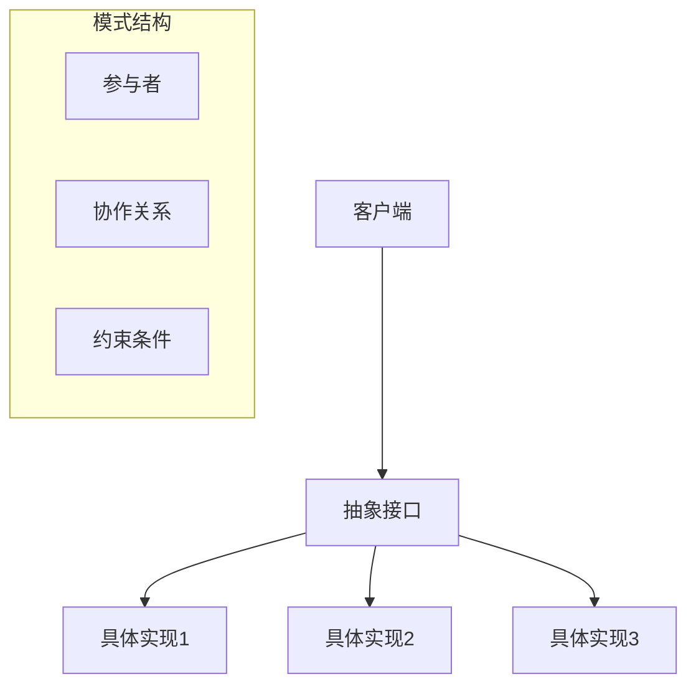

# 设计模式理论

## 1. 理论概述

设计模式理论是软件架构理论的重要组成部分，旨在提供可复用的软件设计解决方案。本理论将设计模式从经验性实践提升为严格的形式化理论体系。

### 1.1 理论基础

- **模式识别理论**：基于认知科学和模式识别
- **软件工程理论**：基于软件设计原则和最佳实践
- **形式化理论**：基于数学和逻辑的形式化表示

### 1.2 核心目标

- 建立设计模式的分类体系
- 提供模式的形式化描述
- 支持模式的自动识别和应用
- 实现模式知识的系统化积累

## 2. 基本概念

### 2.1 模式定义

```rust
// 设计模式的基本结构
pub struct DesignPattern {
    pub name: String,
    pub category: PatternCategory,
    pub intent: String,
    pub problem: String,
    pub solution: String,
    pub participants: Vec<Participant>,
    pub collaborations: Vec<Collaboration>,
    pub consequences: Vec<String>,
    pub implementation: PatternImplementation,
}

// 模式分类
pub enum PatternCategory {
    Creational,    // 创建型模式
    Structural,    // 结构型模式
    Behavioral,    // 行为型模式
    Architectural, // 架构型模式
}

// 模式参与者
pub struct Participant {
    pub name: String,
    pub role: String,
    pub responsibilities: Vec<String>,
    pub interface: Interface,
}
```

### 2.2 模式关系

```rust
// 模式之间的关系
pub struct PatternRelationship {
    pub source: String,
    pub target: String,
    pub relationship_type: RelationshipType,
    pub description: String,
}

pub enum RelationshipType {
    Uses,           // 使用关系
    Extends,        // 扩展关系
    Composes,       // 组合关系
    Conflicts,      // 冲突关系
    Alternative,    // 替代关系
}
```

## 3. 形式化表示

### 3.1 模式图论模型



### 3.2 数学表示

设计模式可以形式化为元组 $P = (N, C, I, S, R)$，其中：

- $N$ 是模式名称
- $C$ 是模式分类
- $I$ 是意图描述
- $S$ 是解决方案结构
- $R$ 是参与者关系集合

模式应用可以表示为：
$$\forall p \in P: \text{Applicable}(p, C) \rightarrow \text{Apply}(p, C)$$

其中 $\text{Applicable}(p, C)$ 表示模式 $p$ 适用于上下文 $C$。

## 4. 模式分类

### 4.1 创建型模式

```rust
// 工厂模式
pub struct FactoryPattern {
    pub product_interface: Interface,
    pub concrete_products: Vec<ConcreteProduct>,
    pub factory_method: Method,
}

impl FactoryPattern {
    pub fn create_product(&self, product_type: &str) -> Box<dyn Product> {
        match product_type {
            "A" => Box::new(ConcreteProductA::new()),
            "B" => Box::new(ConcreteProductB::new()),
            _ => panic!("Unknown product type"),
        }
    }
}

// 单例模式
pub struct Singleton {
    instance: Option<Box<Singleton>>,
}

impl Singleton {
    pub fn get_instance() -> &'static mut Singleton {
        static mut INSTANCE: Option<Box<Singleton>> = None;
        unsafe {
            if INSTANCE.is_none() {
                INSTANCE = Some(Box::new(Singleton { instance: None }));
            }
            INSTANCE.as_mut().unwrap()
        }
    }
}
```

### 4.2 结构型模式

```rust
// 适配器模式
pub trait Target {
    fn request(&self);
}

pub struct Adaptee {
    pub specific_request: String,
}

pub struct Adapter {
    adaptee: Adaptee,
}

impl Target for Adapter {
    fn request(&self) {
        println!("Adapter: {}", self.adaptee.specific_request);
    }
}

// 装饰器模式
pub trait Component {
    fn operation(&self) -> String;
}

pub struct ConcreteComponent;

impl Component for ConcreteComponent {
    fn operation(&self) -> String {
        "ConcreteComponent".to_string()
    }
}

pub struct Decorator {
    component: Box<dyn Component>,
}

impl Component for Decorator {
    fn operation(&self) -> String {
        format!("Decorator({})", self.component.operation())
    }
}
```

### 4.3 行为型模式

```rust
// 观察者模式
pub trait Observer {
    fn update(&self, subject: &Subject);
}

pub trait Subject {
    fn attach(&mut self, observer: Box<dyn Observer>);
    fn detach(&mut self, observer: Box<dyn Observer>);
    fn notify(&self);
}

pub struct ConcreteSubject {
    observers: Vec<Box<dyn Observer>>,
    state: String,
}

impl Subject for ConcreteSubject {
    fn attach(&mut self, observer: Box<dyn Observer>) {
        self.observers.push(observer);
    }
    
    fn detach(&mut self, _observer: Box<dyn Observer>) {
        // 实现观察者移除逻辑
    }
    
    fn notify(&self) {
        for observer in &self.observers {
            observer.update(self);
        }
    }
}

// 策略模式
pub trait Strategy {
    fn algorithm(&self) -> String;
}

pub struct ConcreteStrategyA;

impl Strategy for ConcreteStrategyA {
    fn algorithm(&self) -> String {
        "Strategy A".to_string()
    }
}

pub struct Context {
    strategy: Box<dyn Strategy>,
}

impl Context {
    pub fn execute_strategy(&self) -> String {
        self.strategy.algorithm()
    }
}
```

## 5. 模式应用

### 5.1 模式识别

```rust
// 模式识别器
pub struct PatternRecognizer {
    patterns: Vec<DesignPattern>,
    heuristics: Vec<RecognitionHeuristic>,
}

impl PatternRecognizer {
    pub fn recognize_patterns(&self, code: &Code) -> Vec<PatternMatch> {
        let mut matches = Vec::new();
        
        for pattern in &self.patterns {
            if let Some(mat) = self.match_pattern(pattern, code) {
                matches.push(mat);
            }
        }
        
        matches
    }
    
    fn match_pattern(&self, pattern: &DesignPattern, code: &Code) -> Option<PatternMatch> {
        // 实现模式匹配逻辑
        todo!("实现模式匹配")
    }
}
```

### 5.2 模式重构

```rust
// 模式重构工具
pub struct PatternRefactoring {
    pattern: DesignPattern,
    transformation_rules: Vec<TransformationRule>,
}

impl PatternRefactoring {
    pub fn refactor(&self, code: &mut Code) -> Result<(), RefactoringError> {
        // 1. 分析代码结构
        let analysis = self.analyze_code(code);
        
        // 2. 识别重构机会
        let opportunities = self.identify_opportunities(&analysis);
        
        // 3. 应用重构规则
        for opportunity in opportunities {
            self.apply_transformation(code, &opportunity)?;
        }
        
        Ok(())
    }
}
```

## 6. 交叉引用

### 6.1 相关理论

- [软件架构理论总论](00-软件架构理论总论.md)
- [微服务架构理论](02-微服务架构理论.md)
- [组件化架构理论](03-组件化架构理论.md)

### 6.2 实践应用

- [架构设计工具](../08-实践应用开发/04-架构设计工具/README.md)
- [代码生成工具](../08-实践应用开发/06-代码生成工具/README.md)

## 7. 导航

- [返回软件架构理论总论](00-软件架构理论总论.md)
- [微服务架构理论](02-微服务架构理论.md)
- [组件化架构理论](03-组件化架构理论.md)
- [云原生架构理论](04-云原生架构理论.md)
- [分布式架构理论](05-分布式架构理论.md)
- [WebAssembly架构理论](06-WebAssembly架构理论.md)
- [工作流架构理论](07-工作流架构理论.md)
