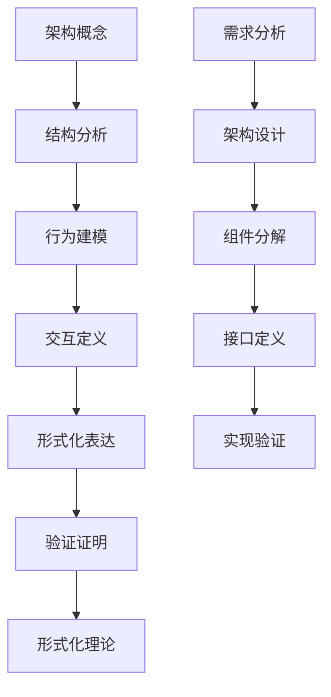

# 软件架构形式化框架

## 目录

1. [概述](#概述)
2. [架构基础理论](#架构基础理论)
3. [组件化架构](#组件化架构)
4. [微服务架构](#微服务架构)
5. [分布式系统架构](#分布式系统架构)
6. [云原生架构](#云原生架构)
7. [架构模式](#架构模式)
8. [架构评估](#架构评估)
9. [架构演化](#架构演化)
10. [形式化验证](#形式化验证)
11. [软件架构统一框架](#软件架构统一框架)
12. [与其他理论的映射](#与其他理论的映射)

## 1. 概述

### 1.1 形式化目标

本框架旨在建立软件架构理论的严格形式化体系，将架构设计、组件交互、系统行为等核心概念进行精确的形式化定义，建立完整的公理系统和推理规则。

### 1.2 形式化原则

**定义 1.2.1 (软件架构形式化)**：
软件架构形式化是将架构概念、设计模式、系统行为转换为严格的数学符号和逻辑结构的过程。

**公理 1.2.1 (形式化一致性)**：
形式化的架构理论必须保持逻辑一致性，即不能同时推导出命题 $\phi$ 和 $\neg \phi$。

**公理 1.2.2 (实现正确性)**：
形式化的架构设计必须能够正确指导系统实现。

### 1.3 形式化方法论



## 2. 架构基础理论

### 2.1 基本定义

**定义 2.1.1 (软件架构)**：
软件架构 $\mathcal{A} = (C, R, P, Q)$ 包含：

- $C$ 是组件集合
- $R$ 是关系集合
- $P$ 是属性集合
- $Q$ 是约束集合

**定义 2.1.2 (组件)**：
组件 $c \in C$ 是一个三元组 $(I, O, B)$，其中：

- $I$ 是输入接口集合
- $O$ 是输出接口集合
- $B$ 是行为描述

**定义 2.1.3 (关系)**：
关系 $r \in R$ 是一个四元组 $(c_1, c_2, t, p)$，其中：

- $c_1, c_2 \in C$ 是相关组件
- $t$ 是关系类型
- $p$ 是关系属性

**定义 2.1.4 (接口)**：
接口 $i$ 是一个二元组 $(S, P)$，其中：

- $S$ 是签名集合
- $P$ 是协议描述

**定理 2.1.1 (架构完整性)**：
软件架构 $\mathcal{A}$ 是完整的，如果所有组件都有明确定义的接口和关系。

**证明**：

```haskell
-- 架构完整性证明
data SoftwareArchitecture = SoftwareArchitecture
  { components :: Set Component
  , relations :: Set Relation
  , properties :: Set Property
  , constraints :: Set Constraint
  }

data Component = Component
  { inputInterfaces :: Set Interface
  , outputInterfaces :: Set Interface
  , behavior :: Behavior
  }

-- 架构完整性检查
isArchitectureComplete :: SoftwareArchitecture -> Bool
isArchitectureComplete architecture = 
  let components = components architecture
      relations = relations architecture
      
      -- 检查所有组件都有明确定义的接口
      allComponentsHaveInterfaces = all hasDefinedInterfaces components
      
      -- 检查所有关系都有明确定义的组件
      allRelationsHaveComponents = all hasDefinedComponents relations
      
      -- 检查接口兼容性
      interfacesCompatible = checkInterfaceCompatibility components relations
  in allComponentsHaveInterfaces && allRelationsHaveComponents && interfacesCompatible
```

### 2.2 架构风格

**定义 2.2.1 (架构风格)**：
架构风格 $\mathcal{S} = (T, C, I)$ 包含：

- $T$ 是拓扑结构
- $C$ 是组件类型
- $I$ 是交互模式

**定义 2.2.2 (分层架构)**：
分层架构 $L = (L_1, L_2, \ldots, L_n)$ 满足：
$$\forall i < j, L_i \text{ 只能调用 } L_j$$

**定义 2.2.3 (客户端-服务器架构)**：
客户端-服务器架构 $CS = (C, S, P)$ 包含：

- $C$ 是客户端集合
- $S$ 是服务器集合
- $P$ 是通信协议

**定义 2.2.4 (事件驱动架构)**：
事件驱动架构 $ED = (P, E, H)$ 包含：

- $P$ 是发布者集合
- $E$ 是事件集合
- $H$ 是处理器集合

**定理 2.2.1 (架构风格性质)**：
不同的架构风格具有不同的性质：

- 分层架构：模块化程度高，但可能影响性能
- 客户端-服务器：简单清晰，但可能存在单点故障
- 事件驱动：松耦合，但可能难以调试

### 2.3 架构约束

**定义 2.3.1 (架构约束)**：
架构约束 $q \in Q$ 是一个谓词，限制架构的可能配置。

**定义 2.3.2 (性能约束)**：
性能约束 $P_{perf}$ 定义为：
$$P_{perf} = \{\mathcal{A} \mid \text{Performance}(\mathcal{A}) \geq \text{Threshold}\}$$

**定义 2.3.3 (安全约束)**：
安全约束 $P_{sec}$ 定义为：
$$P_{sec} = \{\mathcal{A} \mid \text{Security}(\mathcal{A}) \geq \text{Level}\}$$

**定义 2.3.4 (可扩展性约束)**：
可扩展性约束 $P_{scal}$ 定义为：
$$P_{scal} = \{\mathcal{A} \mid \text{Scalability}(\mathcal{A}) \geq \text{Factor}\}$$

**定理 2.3.1 (约束一致性)**：
架构约束集合 $Q$ 是一致的，如果存在架构 $\mathcal{A}$ 满足所有约束。

## 3. 组件化架构

### 3.1 组件定义

**定义 3.1.1 (组件)**：
组件 $C = (P, M, I, E)$ 包含：

- $P$ 是属性集合
- $M$ 是方法集合
- $I$ 是内部状态
- $E$ 是事件集合

**定义 3.1.2 (组件接口)**：
组件接口 $I = (S, P, Q)$ 包含：

- $S$ 是服务集合
- $P$ 是参数集合
- $Q$ 是质量属性

**定义 3.1.3 (组件行为)**：
组件行为 $B$ 是一个状态机 $(S, \Sigma, \delta, s_0, F)$，其中：

- $S$ 是状态集合
- $\Sigma$ 是输入字母表
- $\delta$ 是转移函数
- $s_0$ 是初始状态
- $F$ 是终止状态集合

**定理 3.1.1 (组件独立性)**：
组件 $C$ 是独立的，如果它的行为不依赖于其他组件的内部状态。

**证明**：

```haskell
-- 组件独立性证明
data Component = Component
  { properties :: Set Property
  , methods :: Set Method
  , internalState :: State
  , events :: Set Event
  }

-- 组件独立性检查
isComponentIndependent :: Component -> Set Component -> Bool
isComponentIndependent component otherComponents = 
  let componentBehavior = getBehavior component
      otherBehaviors = map getBehavior otherComponents
      
      -- 检查行为独立性
      behaviorIndependent = not (dependsOn componentBehavior otherBehaviors)
      
      -- 检查状态独立性
      stateIndependent = not (sharesState component otherComponents)
      
      -- 检查接口独立性
      interfaceIndependent = hasIndependentInterface component
  in behaviorIndependent && stateIndependent && interfaceIndependent
```

### 3.2 组件组合

**定义 3.2.1 (组件组合)**：
组件组合 $\otimes : \mathcal{C} \times \mathcal{C} \rightarrow \mathcal{C}$ 满足：

1. 结合律：$(C_1 \otimes C_2) \otimes C_3 = C_1 \otimes (C_2 \otimes C_3)$
2. 交换律：$C_1 \otimes C_2 = C_2 \otimes C_1$
3. 单位元：存在单位组件 $I$ 使得 $C \otimes I = I \otimes C = C$

**定义 3.2.2 (组合模式)**：
组合模式定义了组件组合的规则和约束。

**定义 3.2.3 (组合验证)**：
组合验证确保组合后的组件满足预期的性质。

**定理 3.2.1 (组合正确性)**：
如果组件 $C_1$ 和 $C_2$ 都满足性质 $P$，则 $C_1 \otimes C_2$ 也满足性质 $P$。

### 3.3 组件交互

**定义 3.3.1 (组件交互)**：
组件交互 $I = (C_1, C_2, M, P)$ 包含：

- $C_1, C_2$ 是交互组件
- $M$ 是交互模式
- $P$ 是交互协议

**定义 3.3.2 (同步交互)**：
同步交互要求调用方等待被调用方完成。

**定义 3.3.3 (异步交互)**：
异步交互允许调用方不等待被调用方完成。

**定义 3.3.4 (事件交互)**：
事件交互通过事件机制进行松耦合通信。

**定理 3.3.1 (交互一致性)**：
组件交互是一致的，如果所有交互都遵循预定义的协议。

## 4. 微服务架构

### 4.1 微服务定义

**定义 4.1.1 (微服务)**：
微服务 $M = (I, O, S, B)$ 包含：

- $I$ 是输入接口集合
- $O$ 是输出接口集合
- $S$ 是状态空间
- $B$ 是业务逻辑

**定义 4.1.2 (服务边界)**：
服务边界定义了微服务的职责范围。

**定义 4.1.3 (服务自治)**：
服务自治表示微服务可以独立开发、部署和运行。

**定理 4.1.1 (微服务独立性)**：
对于任意两个微服务 $M_1$ 和 $M_2$，如果 $I_1 \cap I_2 = \emptyset$ 且 $O_1 \cap O_2 = \emptyset$，则 $M_1$ 和 $M_2$ 可以独立部署和演化。

**证明**：

```haskell
-- 微服务独立性证明
data Microservice = Microservice
  { inputInterfaces :: Set Interface
  , outputInterfaces :: Set Interface
  , stateSpace :: StateSpace
  , businessLogic :: BusinessLogic
  }

-- 微服务独立性检查
areMicroservicesIndependent :: Microservice -> Microservice -> Bool
areMicroservicesIndependent m1 m2 = 
  let inputIntersection = intersection (inputInterfaces m1) (inputInterfaces m2)
      outputIntersection = intersection (outputInterfaces m1) (outputInterfaces m2)
      
      -- 检查接口独立性
      interfacesIndependent = isEmpty inputIntersection && isEmpty outputIntersection
      
      -- 检查状态独立性
      stateIndependent = not (sharesState m1 m2)
      
      -- 检查部署独立性
      deploymentIndependent = canDeployIndependently m1 m2
  in interfacesIndependent && stateIndependent && deploymentIndependent
```

### 4.2 服务间通信

**定义 4.2.1 (服务间通信)**：
服务间通信 $C = (S_1, S_2, P, M)$ 包含：

- $S_1, S_2$ 是通信服务
- $P$ 是通信协议
- $M$ 是消息格式

**定义 4.2.2 (同步通信)**：
同步通信使用请求-响应模式。

**定义 4.2.3 (异步通信)**：
异步通信使用消息队列或事件总线。

**定义 4.2.4 (服务发现)**：
服务发现机制允许服务动态发现其他服务。

**定理 4.2.1 (通信可靠性)**：
如果通信协议 $P$ 是可靠的，则服务间通信是可靠的。

### 4.3 服务治理

**定义 4.3.1 (服务治理)**：
服务治理 $G = (R, M, P)$ 包含：

- $R$ 是治理规则
- $M$ 是监控机制
- $P$ 是策略执行

**定义 4.3.2 (负载均衡)**：
负载均衡将请求分发到多个服务实例。

**定义 4.3.3 (熔断器)**：
熔断器防止级联故障。

**定义 4.3.4 (限流)**：
限流控制服务访问频率。

**定理 4.3.1 (治理有效性)**：
有效的服务治理能够提高系统的可靠性和性能。

## 5. 分布式系统架构

### 5.1 分布式系统

**定义 5.1.1 (分布式系统)**：
分布式系统 $D = (N, C, P)$ 包含：

- $N$ 是节点集合
- $C$ 是通信网络
- $P$ 是协议集合

**定义 5.1.2 (节点)**：
节点 $n \in N$ 是一个计算单元，具有处理能力和存储能力。

**定义 5.1.3 (网络)**：
网络 $C$ 定义了节点间的连接关系。

**定义 5.1.4 (协议)**：
协议 $p \in P$ 定义了节点间的交互规则。

**定理 5.1.1 (分布式一致性)**：
在异步网络中，不可能同时满足一致性、可用性和分区容错性。

**证明**：

```haskell
-- CAP定理证明
data DistributedSystem = DistributedSystem
  { nodes :: Set Node
  , network :: Network
  , protocols :: Set Protocol
  }

-- CAP定理
capTheorem :: DistributedSystem -> Bool
capTheorem system = 
  let -- 一致性
      consistency = checkConsistency system
      
      -- 可用性
      availability = checkAvailability system
      
      -- 分区容错性
      partitionTolerance = checkPartitionTolerance system
      
      -- CAP定理：最多只能同时满足两个性质
      capConstraint = not (consistency && availability && partitionTolerance)
  in capConstraint
```

### 5.2 一致性模型

**定义 5.2.1 (强一致性)**：
强一致性要求所有节点看到相同的数据状态。

**定义 5.2.2 (最终一致性)**：
最终一致性允许暂时的不一致，但最终会收敛到一致状态。

**定义 5.2.3 (因果一致性)**：
因果一致性保证因果相关的操作在所有节点上按相同顺序执行。

**定理 5.2.1 (一致性权衡)**：
强一致性提供最强的保证，但可能影响性能；最终一致性提供更好的性能，但保证较弱。

### 5.3 容错机制

**定义 5.3.1 (容错)**：
容错是系统在部分组件失效时仍能正常工作的能力。

**定义 5.3.2 (复制)**：
复制通过维护多个副本来提高可用性。

**定义 5.3.3 (故障检测)**：
故障检测机制识别失效的节点或组件。

**定义 5.3.4 (故障恢复)**：
故障恢复机制在故障发生后恢复系统状态。

**定理 5.3.1 (容错有效性)**：
有效的容错机制能够显著提高系统的可靠性。

## 6. 云原生架构

### 6.1 云原生定义

**定义 6.1.1 (云原生)**：
云原生架构是为云环境设计的架构模式。

**定义 6.1.2 (容器化)**：
容器化将应用程序打包到轻量级容器中。

**定义 6.1.3 (编排)**：
编排管理容器的部署、扩展和生命周期。

**定义 6.1.4 (服务网格)**：
服务网格提供服务间通信的基础设施。

**定理 6.1.1 (云原生优势)**：
云原生架构提供更好的可扩展性、弹性和可维护性。

### 6.2 容器技术

**定义 6.2.1 (容器)**：
容器 $C = (I, R, E)$ 包含：

- $I$ 是镜像
- $R$ 是运行时
- $E$ 是环境

**定义 6.2.2 (镜像)**：
镜像是容器的静态模板。

**定义 6.2.3 (运行时)**：
运行时是容器的执行环境。

**定义 6.2.4 (编排)**：
编排管理容器的生命周期。

**定理 6.2.1 (容器隔离性)**：
容器提供进程级别的隔离，确保应用程序间的独立性。

### 6.3 服务网格

**定义 6.3.1 (服务网格)**：
服务网格 $M = (P, C, P)$ 包含：

- $P$ 是代理集合
- $C$ 是控制平面
- $P$ 是策略集合

**定义 6.3.2 (数据平面)**：
数据平面处理服务间的实际通信。

**定义 6.3.3 (控制平面)**：
控制平面管理数据平面的配置。

**定义 6.3.4 (策略)**：
策略定义了服务间通信的规则。

**定理 6.3.1 (服务网格功能)**：
服务网格提供流量管理、安全、可观测性等功能。

## 7. 架构模式

### 7.1 设计模式

**定义 7.1.1 (设计模式)**：
设计模式是解决常见设计问题的标准解决方案。

**定义 7.1.2 (创建型模式)**：
创建型模式处理对象的创建。

**定义 7.1.3 (结构型模式)**：
结构型模式处理对象的结构。

**定义 7.1.4 (行为型模式)**：
行为型模式处理对象的行为。

**定理 7.1.1 (模式有效性)**：
设计模式能够提高代码的可重用性和可维护性。

### 7.2 架构模式

**定义 7.2.1 (架构模式)**：
架构模式是系统级的设计模式。

**定义 7.2.2 (分层模式)**：
分层模式将系统分解为多个层次。

**定义 7.2.3 (MVC模式)**：
MVC模式分离模型、视图和控制器。

**定义 7.2.4 (MVVM模式)**：
MVVM模式使用数据绑定连接视图和模型。

**定理 7.2.1 (模式选择)**：
架构模式的选择应该基于系统的需求和约束。

### 7.3 反模式

**定义 7.3.1 (反模式)**：
反模式是常见但有害的设计实践。

**定义 7.3.2 (大泥球)**：
大泥球是缺乏清晰结构的系统。

**定义 7.3.3 (上帝对象)**：
上帝对象承担了过多的职责。

**定义 7.3.4 (面条代码)**：
面条代码是难以理解和维护的代码。

**定理 7.3.1 (反模式避免)**：
识别和避免反模式能够提高系统质量。

## 8. 架构评估

### 8.1 质量属性

**定义 8.1.1 (质量属性)**：
质量属性是系统的重要特性。

**定义 8.1.2 (性能)**：
性能是系统响应时间和吞吐量的度量。

**定义 8.1.3 (可用性)**：
可用性是系统正常运行时间的比例。

**定义 8.1.4 (安全性)**：
安全性是系统保护数据和资源的能力。

**定义 8.1.5 (可维护性)**：
可维护性是系统易于修改和维护的程度。

**定理 8.1.1 (质量权衡)**：
不同的质量属性之间往往存在权衡关系。

### 8.2 评估方法

**定义 8.2.1 (架构评估)**：
架构评估是评估架构质量的过程。

**定义 8.2.2 (ATAM方法)**：
ATAM是架构权衡分析方法。

**定义 8.2.3 (SAAM方法)**：
SAAM是软件架构分析方法。

**定义 8.2.4 (CBAM方法)**：
CBAM是基于成本的架构分析方法。

**定理 8.2.1 (评估有效性)**：
有效的架构评估能够识别潜在的问题和改进机会。

### 8.3 度量指标

**定义 8.3.1 (度量指标)**：
度量指标是量化系统特性的数值。

**定义 8.3.2 (耦合度)**：
耦合度衡量组件间的依赖程度。

**定义 8.3.3 (内聚度)**：
内聚度衡量组件内部的一致性。

**定义 8.3.4 (复杂度)**：
复杂度衡量系统的复杂程度。

**定理 8.3.1 (度量有效性)**：
合适的度量指标能够帮助评估和改进架构。

## 9. 架构演化

### 9.1 演化模式

**定义 9.1.1 (架构演化)**：
架构演化是架构随时间变化的过程。

**定义 9.1.2 (增量演化)**：
增量演化通过小的改进逐步演化架构。

**定义 9.1.3 (重构演化)**：
重构演化通过重新设计来演化架构。

**定义 9.1.4 (革命性演化)**：
革命性演化通过完全重新设计来演化架构。

**定理 9.1.1 (演化必要性)**：
架构演化是应对变化需求的必要手段。

### 9.2 演化策略

**定义 9.2.1 (演化策略)**：
演化策略定义了架构演化的方法。

**定义 9.2.2 (渐进式演化)**：
渐进式演化通过小的步骤逐步改进。

**定义 9.2.3 (激进式演化)**：
激进式演化通过大的变革快速改进。

**定义 9.2.4 (混合式演化)**：
混合式演化结合渐进式和激进式方法。

**定理 9.2.1 (策略选择)**：
演化策略的选择应该基于系统的现状和目标。

### 9.3 演化管理

**定义 9.3.1 (演化管理)**：
演化管理是控制架构演化过程的活动。

**定义 9.3.2 (版本控制)**：
版本控制管理架构的不同版本。

**定义 9.3.3 (变更管理)**：
变更管理控制架构的变更过程。

**定义 9.3.4 (影响分析)**：
影响分析评估变更的影响范围。

**定理 9.3.1 (管理重要性)**：
有效的演化管理能够降低演化风险。

## 10. 形式化验证

### 10.1 模型检查

**定义 10.1.1 (架构模型检查)**：
架构模型检查验证架构模型是否满足性质。

**定义 10.1.2 (架构模型)**：
架构模型是架构的形式化表示。

**定义 10.1.3 (性质规范)**：
性质规范定义了架构应该满足的性质。

**定义 10.1.4 (验证算法)**：
验证算法检查模型是否满足性质。

**定理 10.1.1 (验证完备性)**：
模型检查能够自动验证有限状态系统的性质。

### 10.2 定理证明

**定义 10.2.1 (架构定理证明)**：
架构定理证明通过逻辑推理验证架构性质。

**定义 10.2.2 (架构公理)**：
架构公理是架构理论的基本假设。

**定义 10.2.3 (推理规则)**：
推理规则定义了从公理推导定理的规则。

**定义 10.2.4 (证明系统)**：
证明系统包含公理和推理规则。

**定理 10.2.1 (证明可靠性)**：
如果 $\vdash \phi$，则 $\models \phi$。

### 10.3 静态分析

**定义 10.3.1 (架构静态分析)**：
架构静态分析在不执行系统的情况下分析架构。

**定义 10.3.2 (依赖分析)**：
依赖分析识别组件间的依赖关系。

**定义 10.3.3 (接口分析)**：
接口分析检查接口的兼容性。

**定义 10.3.4 (约束检查)**：
约束检查验证架构是否满足约束。

**定理 10.3.1 (分析有效性)**：
静态分析能够发现架构中的潜在问题。

## 11. 软件架构统一框架

### 11.1 统一架构宇宙

**定义 11.1.1 (架构宇宙)**：
架构宇宙 $\mathcal{U}_A$ 定义为：
$$\mathcal{U}_A = (\mathcal{C}, \mathcal{M}, \mathcal{D}, \mathcal{N}, \mathcal{P}, \mathcal{E}, \mathcal{V})$$

其中：

- $\mathcal{C}$ 是组件化架构空间
- $\mathcal{M}$ 是微服务架构空间
- $\mathcal{D}$ 是分布式系统空间
- $\mathcal{N}$ 是云原生架构空间
- $\mathcal{P}$ 是架构模式空间
- $\mathcal{E}$ 是架构评估空间
- $\mathcal{V}$ 是形式化验证空间

### 11.2 架构理论同构

**定义 11.2.1 (架构同构)**：
架构理论空间 $\mathcal{X}$ 和 $\mathcal{Y}$ 是同构的，如果存在双射 $f : \mathcal{X} \rightarrow \mathcal{Y}$ 和 $g : \mathcal{Y} \rightarrow \mathcal{X}$ 使得：

1. $f \circ g = \text{id}_{\mathcal{Y}}$
2. $g \circ f = \text{id}_{\mathcal{X}}$
3. $f$ 和 $g$ 都保持架构结构

**定理 11.2.1 (组件-微服务同构)**：
组件化架构空间 $\mathcal{C}$ 与微服务架构空间 $\mathcal{M}$ 在某些条件下是同构的。

**证明**：

```haskell
-- 组件-微服务同构映射
componentMicroserviceIsomorphism :: ComponentSpace -> MicroserviceSpace
componentMicroserviceIsomorphism component = 
  let -- 组件映射到微服务
      microservices = map componentToMicroservice (components component)
      
      -- 组件接口映射到服务接口
      serviceInterfaces = map componentInterfaceToServiceInterface (componentInterfaces component)
      
      -- 组件交互映射到服务通信
      serviceCommunication = map componentInteractionToServiceCommunication (componentInteractions component)
      
      -- 组件组合映射到服务编排
      serviceOrchestration = map componentCompositionToServiceOrchestration (componentCompositions component)
  in MicroserviceSpace { microservices = microservices
                       , serviceInterfaces = serviceInterfaces
                       , serviceCommunication = serviceCommunication
                       , serviceOrchestration = serviceOrchestration }

-- 逆映射
microserviceComponentIsomorphism :: MicroserviceSpace -> ComponentSpace
microserviceComponentIsomorphism microservice = 
  let -- 微服务映射到组件
      components = map microserviceToComponent (microservices microservice)
      
      -- 服务接口映射到组件接口
      componentInterfaces = map serviceInterfaceToComponentInterface (serviceInterfaces microservice)
      
      -- 服务通信映射到组件交互
      componentInteractions = map serviceCommunicationToComponentInteraction (serviceCommunication microservice)
      
      -- 服务编排映射到组件组合
      componentCompositions = map serviceOrchestrationToComponentComposition (serviceOrchestration microservice)
  in ComponentSpace { components = components
                    , componentInterfaces = componentInterfaces
                    , componentInteractions = componentInteractions
                    , componentCompositions = componentCompositions }
```

### 11.3 架构关系网络

**定义 11.3.1 (架构关系)**：
架构关系 $R : \mathcal{X} \times \mathcal{Y} \rightarrow \mathcal{Z}$ 满足：

1. 结构保持：$R(x_1 \circ x_2, y) = R(x_1, y) \circ R(x_2, y)$
2. 语义保持：$\mathcal{I}(R(x, y)) = \mathcal{I}(x) \otimes \mathcal{I}(y)$
3. 实现保持：$\vdash \phi \Rightarrow \vdash R(\phi)$

## 12. 与其他理论的映射

### 12.1 架构-数学映射

**定义 12.1.1 (架构-数学映射)**：
架构-数学映射 $M : \mathcal{A} \rightarrow \mathcal{M}$ 满足：

1. 概念映射：架构概念映射到数学概念
2. 结构映射：架构结构映射到数学结构
3. 行为映射：架构行为映射到数学行为

**定理 12.1.1 (架构-数学同构)**：
在某些条件下，架构理论空间 $\mathcal{A}$ 与数学理论空间 $\mathcal{M}$ 是同构的。

**证明**：

```haskell
-- 架构-数学同构映射
architectureMathematicsIsomorphism :: ArchitectureSpace -> MathematicsSpace
architectureMathematicsIsomorphism architecture = 
  let -- 组件映射到集合
      sets = map componentToSet (components architecture)
      
      -- 关系映射到函数
      functions = map relationToFunction (relations architecture)
      
      -- 架构映射到图
      graphs = map architectureToGraph (architectures architecture)
      
      -- 行为映射到状态机
      stateMachines = map behaviorToStateMachine (behaviors architecture)
  in MathematicsSpace { sets = sets
                      , functions = functions
                      , graphs = graphs
                      , stateMachines = stateMachines }
```

### 12.2 具体映射关系

**映射 12.2.1 (组件-集合)**：
$$C \in \mathcal{C} \mapsto C \in \mathcal{P}(U)$$

**映射 12.2.2 (关系-函数)**：
$$R(c_1, c_2) \mapsto f : C_1 \rightarrow C_2$$

**映射 12.2.3 (架构-图)**：
$$\mathcal{A} = (C, R) \mapsto G = (V, E)$$

**映射 12.2.4 (行为-状态机)**：
$$B \mapsto M = (Q, \Sigma, \delta, q_0, F)$$

### 12.3 跨领域整合

**定义 12.3.1 (跨领域整合)**：
跨领域整合 $\mathcal{I} : \mathcal{A} \times \mathcal{M} \rightarrow \mathcal{U}$ 满足：

1. 概念整合：架构概念与数学概念整合
2. 方法整合：架构方法与数学方法整合
3. 理论整合：架构理论与数学理论整合

**定理 12.3.1 (整合一致性)**：
如果架构理论 $\mathcal{A}$ 和数学理论 $\mathcal{M}$ 都是一致的，则整合理论 $\mathcal{U}$ 也是一致的。

---

## 总结

本框架建立了软件架构理论的严格形式化体系，将架构设计、组件交互、系统行为等核心概念转换为精确的形式化定义，建立了完整的公理系统和推理规则。

框架的核心价值在于：

1. **形式化严格性**：所有架构概念都有严格的数学定义
2. **实现正确性**：确保架构设计能够正确指导系统实现
3. **跨领域整合**：建立架构理论与数学理论的映射关系
4. **应用指导性**：为软件架构设计提供形式化工具

这个框架为后续的深入分析和具体应用提供了坚实的理论基础。
