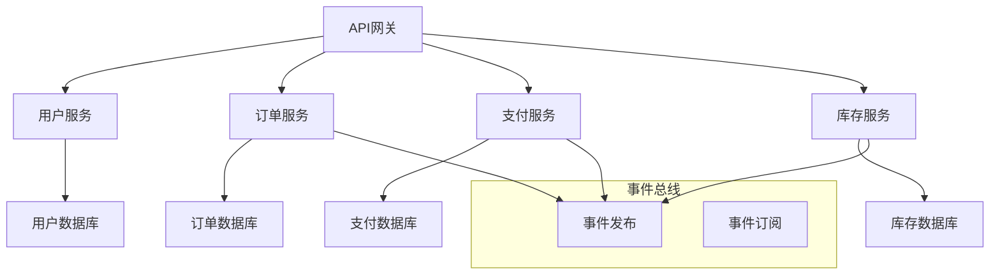

# 微服务架构理论

## 1. 理论概述

微服务架构理论是现代分布式系统设计的重要理论体系，旨在通过服务拆分和独立部署来实现系统的可扩展性、可维护性和灵活性。本理论将微服务架构从实践模式提升为严格的形式化理论。

### 1.1 理论基础

- **分布式系统理论**：基于分布式计算和网络理论
- **服务导向架构**：基于SOA和Web服务理论
- **容器化技术**：基于容器和编排技术理论

### 1.2 核心目标

- 建立微服务拆分的形式化方法
- 提供服务间通信的理论框架
- 支持微服务架构的自动化部署和管理
- 实现微服务系统的可观测性和可维护性

## 2. 基本概念

### 2.1 微服务定义

```rust
// 微服务的基本结构
pub struct Microservice {
    pub id: String,
    pub name: String,
    pub domain: Domain,
    pub api: ApiDefinition,
    pub data_store: DataStore,
    pub dependencies: Vec<ServiceDependency>,
    pub configuration: ServiceConfiguration,
}

// 服务域
pub struct Domain {
    pub name: String,
    pub bounded_context: BoundedContext,
    pub entities: Vec<Entity>,
    pub value_objects: Vec<ValueObject>,
    pub aggregates: Vec<Aggregate>,
}

// 服务依赖
pub struct ServiceDependency {
    pub service_id: String,
    pub dependency_type: DependencyType,
    pub contract: ServiceContract,
    pub resilience: ResiliencePattern,
}

pub enum DependencyType {
    Synchronous,   // 同步依赖
    Asynchronous,  // 异步依赖
    EventDriven,   // 事件驱动
}
```

### 2.2 服务边界

```rust
// 服务边界定义
pub struct ServiceBoundary {
    pub domain_boundary: DomainBoundary,
    pub technical_boundary: TechnicalBoundary,
    pub organizational_boundary: OrganizationalBoundary,
}

// 边界上下文
pub struct BoundedContext {
    pub name: String,
    pub description: String,
    pub ubiquitous_language: UbiquitousLanguage,
    pub context_mapping: ContextMapping,
}
```

## 3. 形式化表示

### 3.1 微服务架构图



### 3.2 数学表示

微服务系统可以形式化为图 $G = (S, E, \phi)$，其中：

- $S$ 是微服务集合
- $E$ 是服务间连接集合
- $\phi: E \rightarrow S \times S$ 是连接关系映射

服务拆分原则可以表示为：
$$\forall s_i, s_j \in S: \text{Cohesion}(s_i) > \text{Coupling}(s_i, s_j)$$

其中 $\text{Cohesion}(s_i)$ 是服务内聚度，$\text{Coupling}(s_i, s_j)$ 是服务间耦合度。

## 4. 架构模式

### 4.1 服务拆分模式

```rust
// 领域驱动设计拆分
pub struct DomainDrivenSplitter {
    pub domain_model: DomainModel,
    pub bounded_contexts: Vec<BoundedContext>,
}

impl DomainDrivenSplitter {
    pub fn split_by_domain(&self, monolithic_app: &MonolithicApp) -> Vec<Microservice> {
        let mut services = Vec::new();
        
        for context in &self.bounded_contexts {
            let service = self.extract_service(monolithic_app, context);
            services.push(service);
        }
        
        services
    }
    
    fn extract_service(&self, app: &MonolithicApp, context: &BoundedContext) -> Microservice {
        // 根据边界上下文提取服务
        todo!("实现服务提取逻辑")
    }
}

// 数据驱动拆分
pub struct DataDrivenSplitter {
    pub data_entities: Vec<DataEntity>,
    pub data_relationships: Vec<DataRelationship>,
}

impl DataDrivenSplitter {
    pub fn split_by_data(&self, app: &MonolithicApp) -> Vec<Microservice> {
        // 根据数据实体和关系进行拆分
        todo!("实现数据驱动拆分")
    }
}
```

### 4.2 通信模式

```rust
// 同步通信
pub struct SynchronousCommunication {
    pub protocol: Protocol,
    pub load_balancer: LoadBalancer,
    pub circuit_breaker: CircuitBreaker,
}

impl SynchronousCommunication {
    pub async fn call_service(&self, request: ServiceRequest) -> Result<ServiceResponse, Error> {
        // 实现同步服务调用
        todo!("实现同步通信")
    }
}

// 异步通信
pub struct AsynchronousCommunication {
    pub message_broker: MessageBroker,
    pub event_store: EventStore,
    pub saga_pattern: SagaPattern,
}

impl AsynchronousCommunication {
    pub async fn publish_event(&self, event: DomainEvent) -> Result<(), Error> {
        // 发布领域事件
        todo!("实现事件发布")
    }
    
    pub async fn subscribe_to_events(&self, event_type: &str) -> EventStream {
        // 订阅事件流
        todo!("实现事件订阅")
    }
}
```

### 4.3 数据管理模式

```rust
// 数据库 per 服务
pub struct DatabasePerService {
    pub service_id: String,
    pub database: Database,
    pub schema: Schema,
}

// 共享数据库
pub struct SharedDatabase {
    pub database: Database,
    pub service_schemas: HashMap<String, Schema>,
    pub access_control: AccessControl,
}

// 事件溯源
pub struct EventSourcing {
    pub event_store: EventStore,
    pub event_handlers: Vec<EventHandler>,
    pub snapshots: SnapshotStore,
}

impl EventSourcing {
    pub fn append_event(&mut self, aggregate_id: &str, event: DomainEvent) -> Result<(), Error> {
        // 追加事件到事件存储
        todo!("实现事件追加")
    }
    
    pub fn reconstruct_aggregate(&self, aggregate_id: &str) -> Result<Aggregate, Error> {
        // 从事件重建聚合
        todo!("实现聚合重建")
    }
}
```

## 5. 架构实现

### 5.1 服务注册与发现

```rust
// 服务注册中心
pub struct ServiceRegistry {
    pub services: HashMap<String, ServiceInstance>,
    pub health_checker: HealthChecker,
}

impl ServiceRegistry {
    pub fn register_service(&mut self, service: ServiceInstance) -> Result<(), Error> {
        // 注册服务实例
        todo!("实现服务注册")
    }
    
    pub fn discover_service(&self, service_name: &str) -> Option<Vec<ServiceInstance>> {
        // 发现服务实例
        todo!("实现服务发现")
    }
}

// 服务实例
pub struct ServiceInstance {
    pub id: String,
    pub service_name: String,
    pub host: String,
    pub port: u16,
    pub health_status: HealthStatus,
    pub metadata: HashMap<String, String>,
}
```

### 5.2 配置管理

```rust
// 配置中心
pub struct ConfigurationCenter {
    pub configurations: HashMap<String, Configuration>,
    pub watchers: Vec<ConfigurationWatcher>,
}

impl ConfigurationCenter {
    pub fn get_configuration(&self, service_id: &str) -> Option<Configuration> {
        // 获取服务配置
        todo!("实现配置获取")
    }
    
    pub fn update_configuration(&mut self, service_id: &str, config: Configuration) -> Result<(), Error> {
        // 更新配置
        todo!("实现配置更新")
    }
}

// 配置结构
pub struct Configuration {
    pub database_url: String,
    pub redis_url: String,
    pub log_level: String,
    pub feature_flags: HashMap<String, bool>,
}
```

### 5.3 监控与可观测性

```rust
// 分布式追踪
pub struct DistributedTracing {
    pub tracer: Tracer,
    pub span_collector: SpanCollector,
}

impl DistributedTracing {
    pub fn start_span(&self, operation_name: &str) -> Span {
        // 开始追踪跨度
        todo!("实现跨度开始")
    }
    
    pub fn inject_context(&self, span: &Span, headers: &mut HashMap<String, String>) {
        // 注入追踪上下文
        todo!("实现上下文注入")
    }
}

// 指标收集
pub struct MetricsCollector {
    pub counters: HashMap<String, Counter>,
    pub gauges: HashMap<String, Gauge>,
    pub histograms: HashMap<String, Histogram>,
}

impl MetricsCollector {
    pub fn increment_counter(&mut self, name: &str, value: u64) {
        // 增加计数器
        todo!("实现计数器增加")
    }
    
    pub fn record_histogram(&mut self, name: &str, value: f64) {
        // 记录直方图
        todo!("实现直方图记录")
    }
}
```

## 6. 交叉引用

### 6.1 相关理论

- [软件架构理论总论](00-软件架构理论总论.md)
- [设计模式理论](01-设计模式理论.md)
- [分布式架构理论](05-分布式架构理论.md)

### 6.2 实践应用

- [架构设计工具](../08-实践应用开发/04-架构设计工具/README.md)
- [模型检测工具](../08-实践应用开发/05-模型检测工具/README.md)

## 7. 导航

- [返回软件架构理论总论](00-软件架构理论总论.md)
- [设计模式理论](01-设计模式理论.md)
- [组件化架构理论](03-组件化架构理论.md)
- [云原生架构理论](04-云原生架构理论.md)
- [分布式架构理论](05-分布式架构理论.md)
- [WebAssembly架构理论](06-WebAssembly架构理论.md)
- [工作流架构理论](07-工作流架构理论.md)
