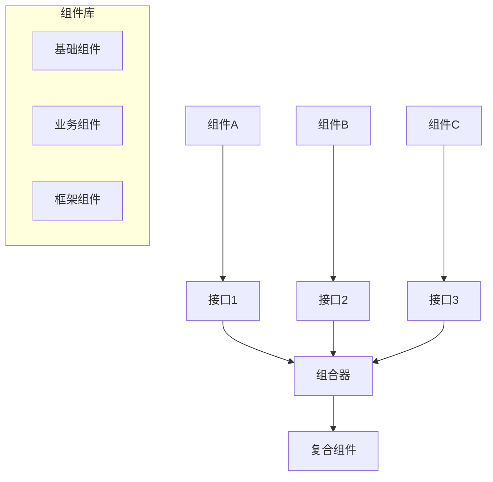

# 组件化架构理论

## 1. 理论概述

组件化架构理论是软件架构理论的重要分支，旨在通过可复用组件的设计和组合来构建复杂软件系统。本理论将组件化开发从实践模式提升为严格的形式化理论体系。

### 1.1 理论基础

- **模块化理论**：基于软件模块化和封装理论
- **接口理论**：基于接口设计和契约理论
- **组合理论**：基于组件组合和装配理论

### 1.2 核心目标

- 建立组件设计的形式化方法
- 提供组件接口的标准化规范
- 支持组件的自动组合和装配
- 实现组件库的系统化管理

## 2. 基本概念

### 2.1 组件定义

```rust
// 组件的基本结构
pub struct Component {
    pub id: String,
    pub name: String,
    pub version: Version,
    pub interfaces: Vec<Interface>,
    pub implementation: Implementation,
    pub dependencies: Vec<Dependency>,
    pub metadata: ComponentMetadata,
}

// 组件接口
pub struct Interface {
    pub name: String,
    pub methods: Vec<Method>,
    pub events: Vec<Event>,
    pub properties: Vec<Property>,
}

// 组件实现
pub struct Implementation {
    pub language: ProgrammingLanguage,
    pub source_code: String,
    pub binary: Option<Vec<u8>>,
    pub configuration: Configuration,
}
```

### 2.2 组件生命周期

```rust
// 组件生命周期管理
pub struct ComponentLifecycle {
    pub state: ComponentState,
    pub transitions: Vec<StateTransition>,
}

pub enum ComponentState {
    Created,
    Initialized,
    Active,
    Suspended,
    Terminated,
}

impl ComponentLifecycle {
    pub fn initialize(&mut self) -> Result<(), Error> {
        // 初始化组件
        todo!("实现组件初始化")
    }
    
    pub fn activate(&mut self) -> Result<(), Error> {
        // 激活组件
        todo!("实现组件激活")
    }
    
    pub fn suspend(&mut self) -> Result<(), Error> {
        // 挂起组件
        todo!("实现组件挂起")
    }
}
```

## 3. 形式化表示

### 3.1 组件关系图



### 3.2 数学表示

组件系统可以形式化为元组 $C = (I, P, R, M)$，其中：

- $I$ 是接口集合
- $P$ 是属性集合
- $R$ 是关系集合
- $M$ 是方法集合

组件组合可以表示为：
$$\text{Compose}(c_1, c_2, \ldots, c_n) = \text{Composite}(c_1, c_2, \ldots, c_n)$$

其中 $\text{Compose}$ 是组合函数，$\text{Composite}$ 是复合组件。

## 4. 组件设计模式

### 4.1 接口设计

```rust
// 接口契约
pub trait ComponentContract {
    fn initialize(&mut self) -> Result<(), Error>;
    fn start(&mut self) -> Result<(), Error>;
    fn stop(&mut self) -> Result<(), Error>;
    fn get_status(&self) -> ComponentStatus;
}

// 接口适配器
pub struct InterfaceAdapter {
    pub source_interface: Interface,
    pub target_interface: Interface,
    pub transformation_rules: Vec<TransformationRule>,
}

impl InterfaceAdapter {
    pub fn adapt(&self, request: Request) -> Result<Response, Error> {
        // 实现接口适配
        todo!("实现接口适配")
    }
}
```

### 4.2 组件组合

```rust
// 组件组合器
pub struct ComponentComposer {
    pub components: Vec<Component>,
    pub composition_rules: Vec<CompositionRule>,
    pub wiring: WiringConfiguration,
}

impl ComponentComposer {
    pub fn compose(&self) -> Result<CompositeComponent, Error> {
        // 1. 验证组件兼容性
        self.validate_compatibility()?;
        
        // 2. 建立组件连接
        let connections = self.establish_connections()?;
        
        // 3. 创建复合组件
        let composite = CompositeComponent {
            components: self.components.clone(),
            connections,
            lifecycle: ComponentLifecycle::new(),
        };
        
        Ok(composite)
    }
    
    fn validate_compatibility(&self) -> Result<(), Error> {
        // 验证组件间兼容性
        todo!("实现兼容性验证")
    }
    
    fn establish_connections(&self) -> Result<Vec<Connection>, Error> {
        // 建立组件间连接
        todo!("实现连接建立")
    }
}
```

### 4.3 组件装配

```rust
// 组件装配器
pub struct ComponentAssembler {
    pub assembly_plan: AssemblyPlan,
    pub component_registry: ComponentRegistry,
}

impl ComponentAssembler {
    pub fn assemble(&self, specification: &AssemblySpecification) -> Result<Assembly, Error> {
        // 1. 解析装配规范
        let plan = self.parse_specification(specification)?;
        
        // 2. 查找所需组件
        let components = self.locate_components(&plan)?;
        
        // 3. 执行装配
        let assembly = self.execute_assembly(components, &plan)?;
        
        Ok(assembly)
    }
}

// 装配规范
pub struct AssemblySpecification {
    pub components: Vec<ComponentSpec>,
    pub connections: Vec<ConnectionSpec>,
    pub constraints: Vec<Constraint>,
}
```

## 5. 组件管理

### 5.1 组件注册

```rust
// 组件注册中心
pub struct ComponentRegistry {
    pub components: HashMap<String, Component>,
    pub categories: HashMap<String, Vec<String>>,
    pub metadata: HashMap<String, ComponentMetadata>,
}

impl ComponentRegistry {
    pub fn register_component(&mut self, component: Component) -> Result<(), Error> {
        // 验证组件
        self.validate_component(&component)?;
        
        // 注册组件
        let id = component.id.clone();
        self.components.insert(id.clone(), component);
        
        // 更新分类
        self.update_categories(&id)?;
        
        Ok(())
    }
    
    pub fn find_component(&self, criteria: &SearchCriteria) -> Vec<Component> {
        // 根据条件查找组件
        todo!("实现组件查找")
    }
}
```

### 5.2 版本管理

```rust
// 组件版本管理
pub struct VersionManager {
    pub versions: HashMap<String, Vec<Version>>,
    pub compatibility_matrix: CompatibilityMatrix,
}

impl VersionManager {
    pub fn check_compatibility(&self, component1: &Component, component2: &Component) -> bool {
        // 检查组件版本兼容性
        todo!("实现兼容性检查")
    }
    
    pub fn upgrade_component(&mut self, component_id: &str, target_version: &Version) -> Result<(), Error> {
        // 升级组件版本
        todo!("实现组件升级")
    }
}
```

### 5.3 依赖管理

```rust
// 依赖解析器
pub struct DependencyResolver {
    pub dependency_graph: DependencyGraph,
    pub resolution_strategy: ResolutionStrategy,
}

impl DependencyResolver {
    pub fn resolve_dependencies(&self, component: &Component) -> Result<Vec<Component>, Error> {
        // 解析组件依赖
        let dependencies = self.build_dependency_tree(component)?;
        let resolved = self.resolve_conflicts(&dependencies)?;
        Ok(resolved)
    }
    
    fn build_dependency_tree(&self, component: &Component) -> Result<DependencyTree, Error> {
        // 构建依赖树
        todo!("实现依赖树构建")
    }
}
```

## 6. 交叉引用

### 6.1 相关理论

- [软件架构理论总论](00-软件架构理论总论.md)
- [设计模式理论](01-设计模式理论.md)
- [微服务架构理论](02-微服务架构理论.md)

### 6.2 实践应用

- [架构设计工具](../08-实践应用开发/04-架构设计工具/README.md)
- [代码生成工具](../08-实践应用开发/06-代码生成工具/README.md)

## 7. 导航

- [返回软件架构理论总论](00-软件架构理论总论.md)
- [设计模式理论](01-设计模式理论.md)
- [微服务架构理论](02-微服务架构理论.md)
- [云原生架构理论](04-云原生架构理论.md)
- [分布式架构理论](05-分布式架构理论.md)
- [WebAssembly架构理论](06-WebAssembly架构理论.md)
- [工作流架构理论](07-工作流架构理论.md)
