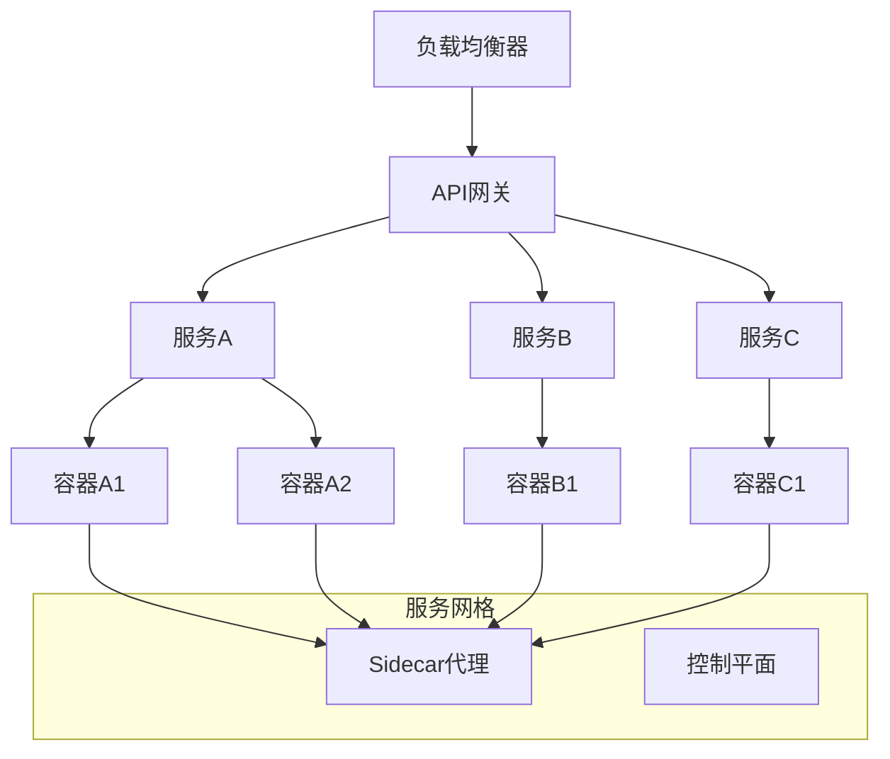

# 云原生架构理论

## 1. 理论概述

云原生架构理论是现代云计算环境下的软件架构理论体系，旨在通过容器化、微服务、DevOps等技术实现应用的云原生化。本理论将云原生架构从技术实践提升为严格的形式化理论。

### 1.1 理论基础

- **容器化理论**：基于容器技术和虚拟化理论
- **编排理论**：基于分布式系统编排和调度理论
- **服务网格理论**：基于网络代理和服务间通信理论

### 1.2 核心目标

- 建立云原生应用的设计原则
- 提供容器化部署的形式化方法
- 支持云原生架构的自动化运维
- 实现云原生系统的可观测性和弹性

## 2. 基本概念

### 2.1 云原生定义

```rust
// 云原生应用的基本结构
pub struct CloudNativeApp {
    pub name: String,
    pub containers: Vec<Container>,
    pub services: Vec<Service>,
    pub configs: Vec<ConfigMap>,
    pub secrets: Vec<Secret>,
    pub volumes: Vec<Volume>,
    pub networking: Networking,
}

// 容器定义
pub struct Container {
    pub name: String,
    pub image: Image,
    pub ports: Vec<Port>,
    pub env_vars: Vec<EnvironmentVariable>,
    pub resources: ResourceRequirements,
    pub health_check: HealthCheck,
}

// 服务定义
pub struct Service {
    pub name: String,
    pub selector: HashMap<String, String>,
    pub ports: Vec<ServicePort>,
    pub service_type: ServiceType,
}
```

### 2.2 云原生原则

```rust
// 云原生设计原则
pub struct CloudNativePrinciples {
    pub containerization: ContainerizationPrinciple,
    pub microservices: MicroservicesPrinciple,
    pub immutable_infrastructure: ImmutableInfrastructurePrinciple,
    pub declarative_configuration: DeclarativeConfigurationPrinciple,
    pub observability: ObservabilityPrinciple,
    pub resilience: ResiliencePrinciple,
}

// 不可变基础设施
pub struct ImmutableInfrastructurePrinciple {
    pub version_control: bool,
    pub automated_deployment: bool,
    pub rollback_capability: bool,
}
```

## 3. 形式化表示

### 3.1 云原生架构图



### 3.2 数学表示

云原生系统可以形式化为元组 $CN = (C, S, N, O)$，其中：

- $C$ 是容器集合
- $S$ 是服务集合
- $N$ 是网络配置
- $O$ 是编排策略

容器编排可以表示为：
$$\text{Orchestrate}(C, S) = \text{Schedule}(C) \land \text{Network}(S) \land \text{Monitor}(C \cup S)$$

## 4. 容器化技术

### 4.1 容器运行时

```rust
// 容器运行时
pub struct ContainerRuntime {
    pub runtime_type: RuntimeType,
    pub isolation: IsolationLevel,
    pub resource_limits: ResourceLimits,
}

pub enum RuntimeType {
    Docker,
    Containerd,
    CRIO,
    Podman,
}

impl ContainerRuntime {
    pub fn create_container(&self, spec: &ContainerSpec) -> Result<Container, Error> {
        // 创建容器
        todo!("实现容器创建")
    }
    
    pub fn start_container(&self, container_id: &str) -> Result<(), Error> {
        // 启动容器
        todo!("实现容器启动")
    }
    
    pub fn stop_container(&self, container_id: &str) -> Result<(), Error> {
        // 停止容器
        todo!("实现容器停止")
    }
}
```

### 4.2 镜像管理

```rust
// 容器镜像
pub struct ContainerImage {
    pub name: String,
    pub tag: String,
    pub layers: Vec<ImageLayer>,
    pub manifest: ImageManifest,
    pub security_scan: SecurityScanResult,
}

impl ContainerImage {
    pub fn build(&self, dockerfile: &str) -> Result<ContainerImage, Error> {
        // 构建镜像
        todo!("实现镜像构建")
    }
    
    pub fn push(&self, registry: &str) -> Result<(), Error> {
        // 推送镜像
        todo!("实现镜像推送")
    }
    
    pub fn pull(&self, registry: &str) -> Result<ContainerImage, Error> {
        // 拉取镜像
        todo!("实现镜像拉取")
    }
}
```

## 5. 编排技术

### 5.1 Kubernetes编排

```rust
// Kubernetes集群
pub struct KubernetesCluster {
    pub master_nodes: Vec<MasterNode>,
    pub worker_nodes: Vec<WorkerNode>,
    pub etcd_cluster: EtcdCluster,
    pub api_server: ApiServer,
}

// Pod定义
pub struct Pod {
    pub name: String,
    pub namespace: String,
    pub containers: Vec<Container>,
    pub volumes: Vec<Volume>,
    pub labels: HashMap<String, String>,
    pub annotations: HashMap<String, String>,
}

impl KubernetesCluster {
    pub fn create_pod(&self, pod_spec: &PodSpec) -> Result<Pod, Error> {
        // 创建Pod
        todo!("实现Pod创建")
    }
    
    pub fn scale_deployment(&self, deployment_name: &str, replicas: u32) -> Result<(), Error> {
        // 扩缩容部署
        todo!("实现部署扩缩容")
    }
}
```

### 5.2 服务发现

```rust
// 服务发现
pub struct ServiceDiscovery {
    pub service_registry: ServiceRegistry,
    pub load_balancer: LoadBalancer,
    pub health_checker: HealthChecker,
}

impl ServiceDiscovery {
    pub fn register_service(&mut self, service: &Service) -> Result<(), Error> {
        // 注册服务
        todo!("实现服务注册")
    }
    
    pub fn discover_service(&self, service_name: &str) -> Option<Vec<ServiceEndpoint>> {
        // 发现服务
        todo!("实现服务发现")
    }
    
    pub fn health_check(&self, endpoint: &ServiceEndpoint) -> HealthStatus {
        // 健康检查
        todo!("实现健康检查")
    }
}
```

## 6. 服务网格

### 6.1 Istio服务网格

```rust
// Istio服务网格
pub struct IstioServiceMesh {
    pub control_plane: ControlPlane,
    pub data_plane: DataPlane,
    pub sidecar_proxies: Vec<SidecarProxy>,
}

// 流量管理
pub struct TrafficManagement {
    pub virtual_services: Vec<VirtualService>,
    pub destination_rules: Vec<DestinationRule>,
    pub gateways: Vec<Gateway>,
}

impl IstioServiceMesh {
    pub fn route_traffic(&self, request: &Request) -> Result<Response, Error> {
        // 路由流量
        todo!("实现流量路由")
    }
    
    pub fn apply_policy(&self, policy: &Policy) -> Result<(), Error> {
        // 应用策略
        todo!("实现策略应用")
    }
}
```

### 6.2 可观测性

```rust
// 分布式追踪
pub struct DistributedTracing {
    pub jaeger: JaegerTracer,
    pub zipkin: ZipkinTracer,
}

// 指标收集
pub struct MetricsCollection {
    pub prometheus: PrometheusMetrics,
    pub grafana: GrafanaDashboard,
}

// 日志聚合
pub struct LogAggregation {
    pub fluentd: FluentdCollector,
    pub elasticsearch: ElasticsearchStorage,
    pub kibana: KibanaVisualization,
}
```

## 7. DevOps实践

### 7.1 CI/CD流水线

```rust
// CI/CD流水线
pub struct CICDPipeline {
    pub stages: Vec<PipelineStage>,
    pub triggers: Vec<Trigger>,
    pub artifacts: Vec<Artifact>,
}

pub enum PipelineStage {
    Build,
    Test,
    SecurityScan,
    Deploy,
    Monitor,
}

impl CICDPipeline {
    pub fn execute(&self) -> Result<PipelineResult, Error> {
        // 执行流水线
        todo!("实现流水线执行")
    }
    
    pub fn rollback(&self, target_version: &str) -> Result<(), Error> {
        // 回滚部署
        todo!("实现部署回滚")
    }
}
```

### 7.2 GitOps

```rust
// GitOps实践
pub struct GitOps {
    pub git_repository: GitRepository,
    pub declarative_configs: Vec<DeclarativeConfig>,
    pub sync_controller: SyncController,
}

impl GitOps {
    pub fn sync_configuration(&self) -> Result<(), Error> {
        // 同步配置
        todo!("实现配置同步")
    }
    
    pub fn apply_changes(&self, changes: &[ConfigChange]) -> Result<(), Error> {
        // 应用变更
        todo!("实现变更应用")
    }
}
```

## 8. 交叉引用

### 8.1 相关理论

- [软件架构理论总论](00-软件架构理论总论.md)
- [微服务架构理论](02-微服务架构理论.md)
- [分布式架构理论](05-分布式架构理论.md)

### 8.2 实践应用

- [架构设计工具](../08-实践应用开发/04-架构设计工具/README.md)
- [模型检测工具](../08-实践应用开发/05-模型检测工具/README.md)

## 9. 导航

- [返回软件架构理论总论](00-软件架构理论总论.md)
- [设计模式理论](01-设计模式理论.md)
- [微服务架构理论](02-微服务架构理论.md)
- [组件化架构理论](03-组件化架构理论.md)
- [分布式架构理论](05-分布式架构理论.md)
- [WebAssembly架构理论](06-WebAssembly架构理论.md)
- [工作流架构理论](07-工作流架构理论.md)
