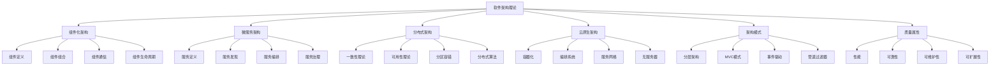

# 04-软件架构理论：形式化架构基础

## 目录

1. [1.0 软件架构理论概述](#10-软件架构理论概述)
2. [2.0 组件化架构](#20-组件化架构)
3. [3.0 微服务架构](#30-微服务架构)
4. [4.0 分布式架构](#40-分布式架构)
5. [5.0 云原生架构](#50-云原生架构)
6. [6.0 架构模式](#60-架构模式)
7. [7.0 架构质量属性](#70-架构质量属性)
8. [8.0 架构评估](#80-架构评估)
9. [9.0 架构演化](#90-架构演化)
10. [10.0 架构与形式化](#100-架构与形式化)

## 1.0 软件架构理论概述

### 1.1 软件架构在理论体系中的地位

**定义 1.1.1 (软件架构理论层)**
软件架构理论层是形式化理论体系的第四层，为软件系统提供架构设计原则和形式化描述方法。

**公理 1.1.1 (软件架构基础性)**
软件架构理论层 $\mathcal{S}$ 是软件系统的核心，满足：
$$\forall sys \in \text{SoftwareSystem}, \quad \text{HasArchitecture}(sys) \Rightarrow \text{DependsOn}(sys, \mathcal{S})$$

### 1.2 软件架构内容分布

## 2.0 组件化架构

### 2.1 组件定义

**定义 2.1.1 (软件组件)**
软件组件是一个三元组 $C = (I, O, B)$，其中：

- $I$ 是输入接口集合
- $O$ 是输出接口集合
- $B$ 是行为规范

**定义 2.1.2 (组件接口)**
组件接口是一个二元组 $IF = (S, P)$，其中：

- $S$ 是签名集合
- $P$ 是协议集合

**定义 2.1.3 (组件行为)**
组件行为是一个状态机 $B = (Q, \Sigma, \delta, q_0, F)$，其中：

- $Q$ 是状态集合
- $\Sigma$ 是事件集合
- $\delta$ 是状态转移函数
- $q_0$ 是初始状态
- $F$ 是接受状态集合

### 2.2 组件组合

**定义 2.2.1 (组件组合)**
组件 $C_1 = (I_1, O_1, B_1)$ 和 $C_2 = (I_2, O_2, B_2)$ 的组合定义为：
$$C_1 \otimes C_2 = (I_1 \cup I_2, O_1 \cup O_2, B_1 \parallel B_2)$$

**定义 2.2.2 (并行组合)**
并行组合 $B_1 \parallel B_2$ 定义为：
$$B_1 \parallel B_2 = (Q_1 \times Q_2, \Sigma_1 \cup \Sigma_2, \delta_{12}, (q_{01}, q_{02}), F_1 \times F_2)$$

**公理 2.2.1 (组合结合律)**
组件组合满足结合律：
$$(C_1 \otimes C_2) \otimes C_3 = C_1 \otimes (C_2 \otimes C_3)$$

### 2.3 组件通信

**定义 2.3.1 (组件通信)**
组件通信是一个四元组 $Comm = (C_1, C_2, M, P)$，其中：

- $C_1, C_2$ 是通信组件
- $M$ 是消息集合
- $P$ 是通信协议

**定义 2.3.2 (同步通信)**
同步通信满足：
$$\forall m \in M, \quad \text{Send}(m) \Rightarrow \text{Receive}(m)$$

**定义 2.3.3 (异步通信)**
异步通信满足：
$$\forall m \in M, \quad \text{Send}(m) \not\Rightarrow \text{Receive}(m)$$

## 3.0 微服务架构

### 3.1 微服务定义

**定义 3.1.1 (微服务)**
微服务是一个四元组 $S = (API, State, Logic, Config)$，其中：

- $API$ 是服务接口
- $State$ 是服务状态
- $Logic$ 是业务逻辑
- $Config$ 是配置信息

**定义 3.1.2 (服务接口)**
服务接口是一个三元组 $API = (Endpoints, Methods, Contracts)$，其中：

- $Endpoints$ 是端点集合
- $Methods$ 是方法集合
- $Contracts$ 是契约集合

**定义 3.1.3 (服务状态)**
服务状态是一个二元组 $State = (Data, Persistence)$，其中：

- $Data$ 是数据集合
- $Persistence$ 是持久化策略

### 3.2 服务发现

**定义 3.2.1 (服务注册)**
服务注册是一个三元组 $Reg = (S, Loc, Meta)$，其中：

- $S$ 是服务标识
- $Loc$ 是服务位置
- $Meta$ 是元数据

**定义 3.2.2 (服务发现)**
服务发现是一个函数：
$$\text{Discover}: \text{ServiceName} \to \mathcal{P}(\text{ServiceLocation})$$

**公理 3.2.1 (服务发现一致性)**
服务发现应保持一致性：
$$\forall s \in \text{Service}, \quad \text{Registered}(s) \Rightarrow \text{Discoverable}(s)$$

### 3.3 服务编排

**定义 3.3.1 (服务编排)**
服务编排是一个函数 $\mathcal{O}: \mathcal{S}^* \to \mathcal{S}$，其中 $\mathcal{S}$ 是微服务集合。

**定义 3.3.2 (编排模式)**
常见的编排模式包括：

1. **顺序编排**：$S_1 \to S_2 \to \cdots \to S_n$
2. **并行编排**：$S_1 \parallel S_2 \parallel \cdots \parallel S_n$
3. **条件编排**：$\text{if } C \text{ then } S_1 \text{ else } S_2$
4. **循环编排**：$\text{while } C \text{ do } S$

**定义 3.3.3 (编排正确性)**
编排正确性定义为：
$$\text{Correct}(\mathcal{O}) \Leftrightarrow \forall \text{input}, \quad \text{Output}(\mathcal{O}, \text{input}) = \text{Expected}(\text{input})$$

## 4.0 分布式架构

### 4.1 分布式系统

**定义 4.1.1 (分布式系统)**
分布式系统是一个三元组 $DS = (N, C, P)$，其中：

- $N$ 是节点集合
- $C$ 是通信网络
- $P$ 是协议集合

**定义 4.1.2 (节点)**
节点是一个四元组 $Node = (ID, State, Behavior, Network)$，其中：

- $ID$ 是节点标识
- $State$ 是节点状态
- $Behavior$ 是节点行为
- $Network$ 是网络接口

**定义 4.1.3 (通信网络)**
通信网络是一个三元组 $Network = (Nodes, Links, Protocol)$，其中：

- $Nodes$ 是节点集合
- $Links$ 是连接集合
- $Protocol$ 是通信协议

### 4.2 CAP理论

**定义 4.2.1 (一致性)**
一致性定义为：
$$\forall n_1, n_2 \in N, \quad \text{Read}(n_1, k) = \text{Read}(n_2, k)$$

**定义 4.2.2 (可用性)**
可用性定义为：
$$\forall n \in N, \quad \text{Response}(n) \text{ in finite time}$$

**定义 4.2.3 (分区容错)**
分区容错定义为：
$$\text{NetworkPartition} \not\Rightarrow \text{SystemFailure}$$

**定理 4.2.1 (CAP定理)**
在分布式系统中，一致性、可用性、分区容错三者最多只能同时满足两个。

### 4.3 分布式算法

**定义 4.3.1 (共识算法)**
共识算法是一个函数：
$$\text{Consensus}: \text{Proposal}^* \to \text{Decision}$$

**定义 4.3.2 (Paxos算法)**
Paxos算法是一个三元组 $(Prepare, Accept, Learn)$，其中：

- $Prepare$ 是准备阶段
- $Accept$ 是接受阶段
- $Learn$ 是学习阶段

**定义 4.3.3 (Raft算法)**
Raft算法是一个四元组 $(Leader, Log, Safety, Liveness)$，其中：

- $Leader$ 是领导者选举
- $Log$ 是日志复制
- $Safety$ 是安全性保证
- $Liveness$ 是活性保证

## 5.0 云原生架构

### 5.1 容器化

**定义 5.1.1 (容器)**
容器是一个四元组 $Container = (Image, Runtime, Resources, Isolation)$，其中：

- $Image$ 是容器镜像
- $Runtime$ 是运行时环境
- $Resources$ 是资源限制
- $Isolation$ 是隔离机制

**定义 5.1.2 (容器镜像)**
容器镜像是一个三元组 $Image = (Layers, Config, Metadata)$，其中：

- $Layers$ 是镜像层
- $Config$ 是配置信息
- $Metadata$ 是元数据

**定义 5.1.3 (容器编排)**
容器编排是一个函数：
$$\text{Orchestrate}: \text{Container}^* \to \text{Deployment}$$

### 5.2 编排系统

**定义 5.2.1 (Kubernetes)**
Kubernetes是一个五元组 $K8s = (Pods, Services, Deployments, ConfigMaps, Secrets)$，其中：

- $Pods$ 是Pod集合
- $Services$ 是服务集合
- $Deployments$ 是部署集合
- $ConfigMaps$ 是配置映射
- $Secrets$ 是密钥集合

**定义 5.2.2 (Pod)**
Pod是一个三元组 $Pod = (Containers, Network, Storage)$，其中：

- $Containers$ 是容器集合
- $Network$ 是网络配置
- $Storage$ 是存储配置

**定义 5.2.3 (Service)**
Service是一个四元组 $Service = (Selector, Ports, Type, Endpoints)$，其中：

- $Selector$ 是选择器
- $Ports$ 是端口配置
- $Type$ 是服务类型
- $Endpoints$ 是端点集合

### 5.3 服务网格

**定义 5.3.1 (服务网格)**
服务网格是一个四元组 $Mesh = (DataPlane, ControlPlane, Policies, Observability)$，其中：

- $DataPlane$ 是数据平面
- $ControlPlane$ 是控制平面
- $Policies$ 是策略集合
- $Observability$ 是可观测性

**定义 5.3.2 (数据平面)**
数据平面是一个三元组 $DataPlane = (Proxies, Routing, LoadBalancing)$，其中：

- $Proxies$ 是代理集合
- $Routing$ 是路由规则
- $LoadBalancing$ 是负载均衡

**定义 5.3.3 (控制平面)**
控制平面是一个三元组 $ControlPlane = (Discovery, Configuration, Security)$，其中：

- $Discovery$ 是服务发现
- $Configuration$ 是配置管理
- $Security$ 是安全管理

## 6.0 架构模式

### 6.1 分层架构

**定义 6.1.1 (分层架构)**
分层架构是一个四元组 $Layered = (Layers, Interfaces, Dependencies, Constraints)$，其中：

- $Layers$ 是层集合
- $Interfaces$ 是接口集合
- $Dependencies$ 是依赖关系
- $Constraints$ 是约束条件

**公理 6.1.1 (分层约束)**
分层架构满足：
$$\forall l_i, l_j \in Layers, \quad i < j \Rightarrow l_i \text{ depends on } l_j$$

**定义 6.1.2 (经典三层架构)**
经典三层架构包含：

1. **表示层**：用户界面
2. **业务层**：业务逻辑
3. **数据层**：数据访问

### 6.2 MVC模式

**定义 6.2.1 (MVC模式)**
MVC模式是一个三元组 $MVC = (Model, View, Controller)$，其中：

- $Model$ 是数据模型
- $View$ 是视图组件
- $Controller$ 是控制器

**定义 6.2.2 (模型)**
模型是一个三元组 $Model = (Data, BusinessLogic, Validation)$，其中：

- $Data$ 是数据结构
- $BusinessLogic$ 是业务逻辑
- $Validation$ 是验证规则

**定义 6.2.3 (视图)**
视图是一个二元组 $View = (Presentation, UserInteraction)$，其中：

- $Presentation$ 是表现逻辑
- $UserInteraction$ 是用户交互

### 6.3 事件驱动架构

**定义 6.3.1 (事件驱动架构)**
事件驱动架构是一个四元组 $EDA = (Events, Producers, Consumers, EventBus)$，其中：

- $Events$ 是事件集合
- $Producers$ 是事件生产者
- $Consumers$ 是事件消费者
- $EventBus$ 是事件总线

**定义 6.3.2 (事件)**
事件是一个三元组 $Event = (Type, Data, Timestamp)$，其中：

- $Type$ 是事件类型
- $Data$ 是事件数据
- $Timestamp$ 是时间戳

**定义 6.3.3 (事件总线)**
事件总线是一个函数：
$$\text{EventBus}: \text{Event} \to \text{Consumer}^*$$

## 7.0 架构质量属性

### 7.1 性能

**定义 7.1.1 (响应时间)**
响应时间是一个函数：
$$\text{ResponseTime}: \text{Request} \to \text{Time}$$

**定义 7.1.2 (吞吐量)**
吞吐量是一个函数：
$$\text{Throughput}: \text{Time} \to \text{RequestCount}$$

**定义 7.1.3 (性能目标)**
性能目标定义为：
$$\forall r \in \text{Request}, \quad \text{ResponseTime}(r) \leq \text{Threshold}$$

### 7.2 可靠性

**定义 7.2.1 (可用性)**
可用性定义为：
$$\text{Availability} = \frac{\text{Uptime}}{\text{Uptime} + \text{Downtime}}$$

**定义 7.2.2 (故障率)**
故障率定义为：
$$\text{FailureRate} = \frac{\text{Failures}}{\text{TotalTime}}$$

**定义 7.2.3 (平均故障间隔时间)**
平均故障间隔时间定义为：
$$\text{MTBF} = \frac{\text{TotalTime}}{\text{FailureCount}}$$

### 7.3 可维护性

**定义 7.3.1 (模块化)**
模块化定义为：
$$\text{Modularity} = \frac{\text{Cohesion}}{\text{Coupling}}$$

**定义 7.3.2 (可理解性)**
可理解性定义为：
$$\text{Understandability} = f(\text{Complexity}, \text{Documentation}, \text{Consistency})$$

**定义 7.3.3 (可测试性)**
可测试性定义为：
$$\text{Testability} = f(\text{Observability}, \text{Controllability}, \text{Isolation})$$

### 7.4 可扩展性

**定义 7.4.1 (水平扩展)**
水平扩展定义为：
$$\text{HorizontalScaling} = \text{AddNodes}(\text{System})$$

**定义 7.4.2 (垂直扩展)**
垂直扩展定义为：
$$\text{VerticalScaling} = \text{IncreaseResources}(\text{Node})$$

**定义 7.4.3 (扩展性度量)**
扩展性度量定义为：
$$\text{Scalability} = \frac{\text{Performance}(\text{Scaled})}{\text{Performance}(\text{Original})}}$$

## 8.0 架构评估

### 8.1 评估方法

**定义 8.1.1 (架构评估)**
架构评估是一个函数：
$$\text{Evaluate}: \text{Architecture} \times \text{Scenario} \to \text{QualityScore}$$

**定义 8.1.2 (ATAM方法)**
ATAM方法是一个四元组 $(UtilityTree, Scenarios, Analysis, Results)$，其中：

- $UtilityTree$ 是效用树
- $Scenarios$ 是场景集合
- $Analysis$ 是分析方法
- $Results$ 是评估结果

**定义 8.1.3 (SAAM方法)**
SAAM方法是一个三元组 $(Scenarios, Analysis, Metrics)$，其中：

- $Scenarios$ 是场景集合
- $Analysis$ 是场景分析
- $Metrics$ 是度量指标

### 8.2 评估指标

**定义 8.2.1 (质量指标)**
质量指标是一个函数：
$$\text{QualityMetric}: \text{Architecture} \to \mathbb{R}$$

**定义 8.2.2 (性能指标)**
性能指标包括：

1. **响应时间**：$\text{RT} = \text{ProcessingTime} + \text{NetworkTime}$
2. **吞吐量**：$\text{TP} = \frac{\text{Requests}}{\text{Time}}$
3. **资源利用率**：$\text{RU} = \frac{\text{UsedResources}}{\text{TotalResources}}$

**定义 8.2.3 (可靠性指标)**
可靠性指标包括：

1. **可用性**：$\text{AV} = \frac{\text{Uptime}}{\text{TotalTime}}$
2. **故障率**：$\text{FR} = \frac{\text{Failures}}{\text{Time}}$
3. **恢复时间**：$\text{MTTR} = \text{MeanTimeToRepair}$

## 9.0 架构演化

### 9.1 演化模式

**定义 9.1.1 (架构演化)**
架构演化是一个函数：
$$\text{Evolution}: \text{Architecture} \times \text{Change} \to \text{Architecture}$$

**定义 9.1.2 (演化类型)**
演化类型包括：

1. **增量演化**：$\text{Incremental}(\text{Arch}, \text{Change})$
2. **重构演化**：$\text{Refactoring}(\text{Arch}, \text{Change})$
3. **革命性演化**：$\text{Revolutionary}(\text{Arch}, \text{Change})$

**定义 9.1.3 (演化约束)**
演化约束定义为：
$$\text{EvolutionConstraint}(\text{Arch}, \text{Change}) \Leftrightarrow \text{Preserve}(\text{QualityAttributes})$$

### 9.2 演化策略

**定义 9.2.1 (演化策略)**
演化策略是一个三元组 $Strategy = (Approach, Timeline, Risk)$，其中：

- $Approach$ 是演化方法
- $Timeline$ 是时间安排
- $Risk$ 是风险评估

**定义 9.2.2 (渐进式演化)**
渐进式演化定义为：
$$\text{GradualEvolution} = \text{StepByStep}(\text{Changes})$$

**定义 9.2.3 (并行演化)**
并行演化定义为：
$$\text{ParallelEvolution} = \text{Concurrent}(\text{Changes})$$

## 10.0 架构与形式化

### 10.1 形式化描述

**定义 10.1.1 (架构形式化)**
架构形式化是使用数学符号描述软件架构的过程。

**定义 10.1.2 (架构描述语言)**
架构描述语言是一个四元组 $ADL = (Syntax, Semantics, Tools, Analysis)$，其中：

- $Syntax$ 是语法定义
- $Semantics$ 是语义定义
- $Tools$ 是工具支持
- $Analysis$ 是分析方法

**公理 10.1.1 (形式化公理)**
对于任意架构 $A$：
$$\text{Formalizable}(A) \Rightarrow \text{Verifiable}(A)$$

### 10.2 架构验证

**定义 10.2.1 (架构验证)**
架构验证是验证架构是否满足需求的过程。

**定义 10.2.2 (模型检查)**
架构模型检查是一个函数：
$$\text{ModelCheck}: \text{Architecture} \times \text{Property} \to \{\text{True}, \text{False}\}$$

**定义 10.2.3 (定理证明)**
架构定理证明是一个函数：
$$\text{TheoremProve}: \text{Architecture} \times \text{Theorem} \to \text{Proof}$$

### 10.3 架构实现

**定义 10.3.1 (架构实现)**
架构实现是将形式化架构转换为实际系统的过程。

**定义 10.3.2 (代码生成)**
代码生成是一个函数：
$$\text{CodeGeneration}: \text{FormalArchitecture} \to \text{Implementation}$$

**定义 10.3.3 (实现验证)**
实现验证是一个函数：
$$\text{ImplementationVerification}: \text{Implementation} \times \text{Architecture} \to \{\text{Correct}, \text{Incorrect}\}$$

---

## 总结

软件架构理论为软件系统提供了系统的架构设计方法和原则。通过组件化架构、微服务架构、分布式架构等理论，建立了完整的架构框架。这些理论为实际软件系统的设计和实现提供了重要的指导。 