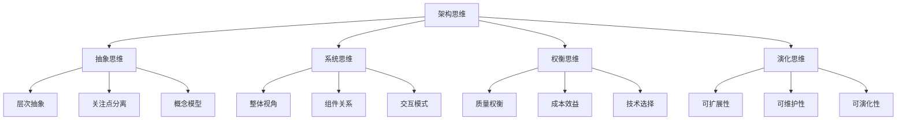
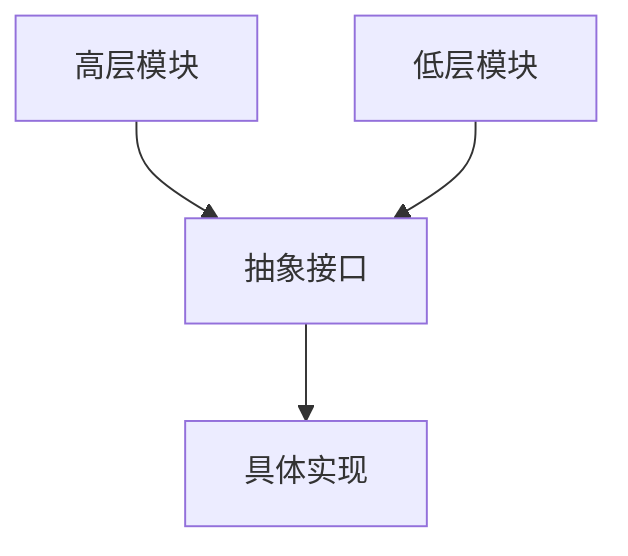
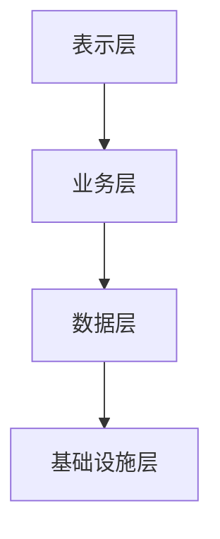
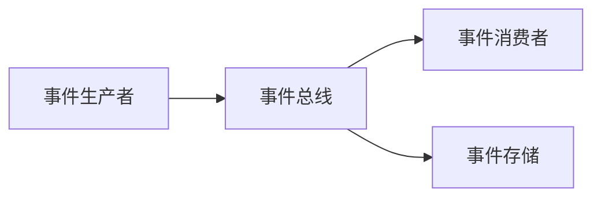

# 软件架构定义与原则

## 1. 概述

软件架构是软件系统的**结构蓝图**，它定义了系统的组织方式、组件关系、设计原则和约束条件。软件架构不仅关注系统的技术实现，更关注系统的质量属性、业务目标和长期演化。

### 1.1 软件架构的重要性

软件架构在现代软件开发中具有核心地位：

- **系统蓝图**：为系统开发提供整体指导
- **质量保证**：确保系统满足质量要求
- **团队协作**：为开发团队提供共同理解
- **系统演化**：支持系统的长期维护和扩展
- **风险控制**：早期识别和化解技术风险

### 1.2 架构思维

## 2. 软件架构的定义

### 2.1 经典定义

**定义 2.1.1** (IEEE 1471标准)
软件架构是系统的基本组织，体现在其组件、组件之间的关系、组件与环境的关系，以及指导其设计和演化的原则。

**定义 2.1.2** (Bass-Clements-Kazman)
软件架构是一个程序或计算系统的软件架构，是系统的结构，包括软件组件、这些组件的外部可见属性，以及组件之间的关系。

**定义 2.1.3** (Garlan-Shaw)
软件架构是软件系统的抽象，它关注系统的结构和行为，以及系统如何满足其功能和非功能需求。

### 2.2 形式化定义

**定义 2.2.1** (形式化架构定义)
软件架构是一个四元组 $A = (C, R, P, Q)$，其中：

- $C = \{c_1, c_2, \ldots, c_n\}$ 是组件集合
- $R = \{r_1, r_2, \ldots, r_m\}$ 是关系集合
- $P = \{p_1, p_2, \ldots, p_k\}$ 是属性集合
- $Q = \{q_1, q_2, \ldots, q_l\}$ 是约束集合

满足：
$$\forall r \in R, \exists c_i, c_j \in C, r: c_i \to c_j$$
$$\forall p \in P, p: C \cup R \to \text{Value}$$
$$\forall q \in Q, q: C \cup R \to \{\text{true}, \text{false}\}$$

### 2.3 架构的层次

#### 2.3.1 企业架构层次

**定义 2.3.1** (企业架构)
企业架构关注整个组织的IT战略和业务对齐，包括：

- **业务架构**：业务战略、流程、组织
- **数据架构**：数据模型、数据流、数据治理
- **应用架构**：应用系统、集成模式、服务
- **技术架构**：技术栈、基础设施、标准

#### 2.3.2 系统架构层次

**定义 2.3.2** (系统架构)
系统架构关注单个系统的结构和行为：

- **逻辑架构**：系统的逻辑组织和组件关系
- **物理架构**：系统的物理部署和资源分配
- **运行时架构**：系统的动态行为和交互模式

#### 2.3.3 组件架构层次

**定义 2.3.3** (组件架构)
组件架构关注系统内部组件的设计和实现：

- **模块架构**：代码组织和模块关系
- **类架构**：面向对象设计的类结构
- **接口架构**：组件间的接口设计

## 3. 架构的核心原则

### 3.1 关注点分离原则

**原则 3.1.1** (关注点分离)
将不同的关注点分离到不同的组件或层次中，使得每个组件只关注特定的职责。

**形式化表达**：
$$\forall c_i, c_j \in C, i \neq j \implies \text{concern}(c_i) \cap \text{concern}(c_j) = \emptyset$$

**应用示例**：

- **MVC模式**：模型、视图、控制器分离
- **分层架构**：表示层、业务层、数据层分离
- **微服务架构**：业务功能分离到不同服务

### 3.2 单一职责原则

**原则 3.2.1** (单一职责)
每个组件应该只有一个改变的理由，即只负责一个特定的功能或职责。

**形式化表达**：
$$\forall c \in C, |\text{responsibility}(c)| = 1$$

**定理 3.2.1** (职责唯一性)
如果组件 $c$ 满足单一职责原则，则其变更影响范围最小。

**证明**：
设组件 $c$ 的职责为 $r$，则对于任意变更 $\delta$：
$$\text{impact}(\delta) = \{c' \in C \mid \text{depends}(c', c) \land \text{affects}(\delta, r)\}$$

由于 $r$ 是唯一的，影响范围被限制在依赖 $c$ 且与 $r$ 相关的组件中。

### 3.3 开闭原则

**原则 3.3.1** (开闭原则)
软件实体应该对扩展开放，对修改关闭。

**形式化表达**：
$$\forall f \in \text{Features}, \exists c \in C, \text{implements}(c, f) \land \neg \text{modifies}(c, \text{existing})$$

**设计模式应用**：

- **策略模式**：通过接口扩展新策略
- **装饰器模式**：通过组合扩展功能
- **工厂模式**：通过工厂创建新对象

### 3.4 依赖倒置原则

**原则 3.4.1** (依赖倒置)
高层模块不应该依赖低层模块，两者都应该依赖抽象。抽象不应该依赖细节，细节应该依赖抽象。

**形式化表达**：
$$\forall c_i, c_j \in C, \text{level}(c_i) > \text{level}(c_j) \implies \text{depends}(c_i, \text{abstract}(c_j))$$

**依赖关系**：

### 3.5 接口隔离原则

**原则 3.5.1** (接口隔离)
客户端不应该被迫依赖它不使用的接口。

**形式化表达**：
$$\forall c \in C, \forall i \in \text{interfaces}(c), \text{uses}(c, i) \implies \text{needs}(c, i)$$

**接口设计**：

- **细粒度接口**：将大接口拆分为小接口
- **角色分离**：按角色定义接口
- **最小依赖**：只依赖必要的接口

## 4. 架构质量属性

### 4.1 功能性质量属性

#### 4.1.1 正确性

**定义 4.1.1** (正确性)
系统行为符合其规范要求的程度。

**度量方法**：
$$\text{correctness}(S) = \frac{|\text{correct\_behaviors}(S)|}{|\text{total\_behaviors}(S)|}$$

#### 4.1.2 完整性

**定义 4.1.2** (完整性)
系统实现所有要求功能的能力。

**度量方法**：
$$\text{completeness}(S) = \frac{|\text{implemented\_features}(S)|}{|\text{required\_features}(S)|}$$

### 4.2 非功能性质量属性

#### 4.2.1 性能

**定义 4.2.1** (性能)
系统在给定资源约束下完成任务的效率。

**性能指标**：

- **响应时间**：$T_{\text{response}} = T_{\text{processing}} + T_{\text{communication}}$
- **吞吐量**：$\text{Throughput} = \frac{\text{requests}}{\text{time}}$
- **资源利用率**：$\text{Utilization} = \frac{\text{used\_resources}}{\text{total\_resources}}$

#### 4.2.2 可用性

**定义 4.2.2** (可用性)
系统在给定时间间隔内正常运行的概率。

**可用性计算**：
$$\text{Availability} = \frac{\text{MTBF}}{\text{MTBF} + \text{MTTR}}$$

其中：

- MTBF (Mean Time Between Failures)：平均故障间隔时间
- MTTR (Mean Time To Repair)：平均修复时间

#### 4.2.3 可扩展性

**定义 4.2.3** (可扩展性)
系统在负载增加时保持性能的能力。

**扩展类型**：

- **水平扩展**：增加节点数量
- **垂直扩展**：增加节点能力
- **功能扩展**：增加新功能

#### 4.2.4 可维护性

**定义 4.2.4** (可维护性)
系统易于理解、修改和扩展的程度。

**维护性指标**：

- **圈复杂度**：$\text{CC} = E - N + 2P$
- **代码重复率**：$\text{DR} = \frac{\text{duplicated\_lines}}{\text{total\_lines}}$
- **模块耦合度**：$\text{Coupling} = \frac{\text{external\_dependencies}}{\text{total\_dependencies}}$

### 4.3 质量属性权衡

**定理 4.3.1** (质量属性权衡)
在资源约束下，质量属性之间存在权衡关系。

**证明**：
设系统 $S$ 的资源约束为 $R$，质量属性为 $Q = \{q_1, q_2, \ldots, q_n\}$，则：
$$\sum_{i=1}^{n} \text{cost}(q_i) \leq R$$

由于资源有限，提高某个质量属性必然影响其他质量属性。

## 5. 架构决策框架

### 5.1 决策过程

**定义 5.1.1** (架构决策)
架构决策是影响系统结构、行为或质量属性的技术选择。

**决策过程**：

1. **问题识别**：识别需要决策的问题
2. **方案生成**：生成可能的解决方案
3. **方案评估**：评估各方案的优缺点
4. **方案选择**：选择最佳方案
5. **决策记录**：记录决策和理由

### 5.2 决策矩阵

**定义 5.2.1** (决策矩阵)
决策矩阵用于系统化地评估和比较不同方案。

**矩阵结构**：
$$\text{Score}(S_i) = \sum_{j=1}^{m} w_j \cdot \text{rating}(S_i, C_j)$$

其中：

- $S_i$ 是第 $i$ 个方案
- $C_j$ 是第 $j$ 个评估标准
- $w_j$ 是第 $j$ 个标准的权重
- $\text{rating}(S_i, C_j)$ 是方案 $i$ 在标准 $j$ 上的评分

### 5.3 决策记录

**定义 5.3.1** (架构决策记录)
架构决策记录 (ADR) 是记录架构决策的文档，包含：

- **决策ID**：唯一标识符
- **决策日期**：决策时间
- **决策者**：参与决策的人员
- **问题描述**：需要解决的问题
- **考虑的方案**：评估过的方案
- **选择的方案**：最终选择的方案
- **决策理由**：选择该方案的原因
- **影响分析**：决策的影响范围

## 6. 架构模式

### 6.1 分层架构

**定义 6.1.1** (分层架构)
分层架构将系统组织为一系列层次，每层只与相邻层交互。

**形式化定义**：
$$\text{Layer}_i = \{c \in C \mid \text{level}(c) = i\}$$
$$\forall c_i \in \text{Layer}_i, c_j \in \text{Layer}_j, i < j \implies \text{can\_call}(c_i, c_j)$$

**层次结构**：

### 6.2 微服务架构

**定义 6.2.1** (微服务架构)
微服务架构将系统分解为一系列小型、独立的服务。

**服务特征**：

- **独立性**：每个服务可以独立开发、部署、扩展
- **单一职责**：每个服务负责特定的业务功能
- **松耦合**：服务间通过标准协议通信
- **技术多样性**：不同服务可以使用不同技术栈

**服务通信**：
$$\text{Communication}(S_i, S_j) = \{\text{HTTP}, \text{gRPC}, \text{Message Queue}, \text{Event}\}$$

### 6.3 事件驱动架构

**定义 6.3.1** (事件驱动架构)
事件驱动架构基于事件的产生、检测、消费和反应。

**事件流**：

**事件处理**：
$$\text{EventFlow} = \text{Producer} \to \text{EventBus} \to \text{Consumer}$$

## 7. 架构评估

### 7.1 评估方法

#### 7.1.1 ATAM方法

**定义 7.1.1** (ATAM - Architecture Tradeoff Analysis Method)
ATAM是一种系统化的架构评估方法。

**评估步骤**：

1. **ATAM介绍**：介绍评估过程
2. **业务驱动**：理解业务目标
3. **架构介绍**：介绍系统架构
4. **识别架构方法**：识别关键架构决策
5. **生成质量属性树**：建立质量属性模型
6. **分析架构方法**：分析架构决策的影响
7. **头脑风暴和场景优先级排序**：识别关键场景
8. **分析架构方法**：深入分析关键场景
9. **提出结果**：总结评估结果

#### 7.1.2 SAAM方法

**定义 7.1.2** (SAAM - Software Architecture Analysis Method)
SAAM专注于可修改性的评估。

**评估指标**：
$$\text{Modifiability} = \frac{\text{scenarios\_supported}}{\text{total\_scenarios}}$$

### 7.2 评估指标

#### 7.2.1 复杂度指标

**定义 7.2.1** (架构复杂度)
架构复杂度衡量架构的复杂程度。

**复杂度计算**：
$$\text{Complexity}(A) = \alpha \cdot |C| + \beta \cdot |R| + \gamma \cdot \text{avg\_coupling}$$

其中 $\alpha, \beta, \gamma$ 是权重系数。

#### 7.2.2 一致性指标

**定义 7.2.2** (架构一致性)
架构一致性衡量架构与设计原则的符合程度。

**一致性计算**：
$$\text{Consistency}(A) = \frac{|\text{principles\_followed}|}{|\text{total\_principles}|}$$

## 8. 架构演化

### 8.1 演化模式

#### 8.1.1 增量演化

**定义 8.1.1** (增量演化)
通过小的、渐进的改变来改进架构。

**演化特征**：

- **低风险**：每次改变的影响范围小
- **可回滚**：容易撤销失败的改变
- **持续改进**：通过迭代持续优化

#### 8.1.2 重构演化

**定义 8.1.2** (重构演化)
通过重新组织代码结构来改进架构。

**重构原则**：

- **保持行为**：重构不改变外部行为
- **小步前进**：每次重构的规模小
- **频繁测试**：重构后立即测试

### 8.2 演化策略

#### 8.2.1 兼容性策略

**定义 8.2.1** (向后兼容)
新版本保持与旧版本的接口兼容。

**兼容性级别**：

- **二进制兼容**：编译后的代码兼容
- **源代码兼容**：源代码级别的兼容
- **语义兼容**：行为语义的兼容

#### 8.2.2 迁移策略

**定义 8.2.2** (渐进迁移)
通过渐进的方式将系统迁移到新架构。

**迁移步骤**：

1. **并行运行**：新旧系统并行运行
2. **流量切换**：逐步将流量切换到新系统
3. **功能验证**：验证新系统的功能正确性
4. **旧系统退役**：完全切换到新系统

## 9. 总结

软件架构作为软件系统的结构蓝图，具有以下核心特征：

1. **系统性**：关注系统的整体结构和组织
2. **抽象性**：通过抽象隐藏实现细节
3. **权衡性**：在多个质量属性间进行权衡
4. **演化性**：支持系统的长期演化和发展
5. **原则性**：基于设计原则指导架构决策

软件架构不仅是一门技术，更是一门艺术，需要在技术可行性、业务需求和系统约束之间找到最佳平衡点。通过系统化的架构设计、评估和演化，可以构建出高质量、可维护、可扩展的软件系统。

---

*本文档为软件架构的基础理论提供了系统性的介绍，为后续的架构设计和实践奠定了理论基础。*
