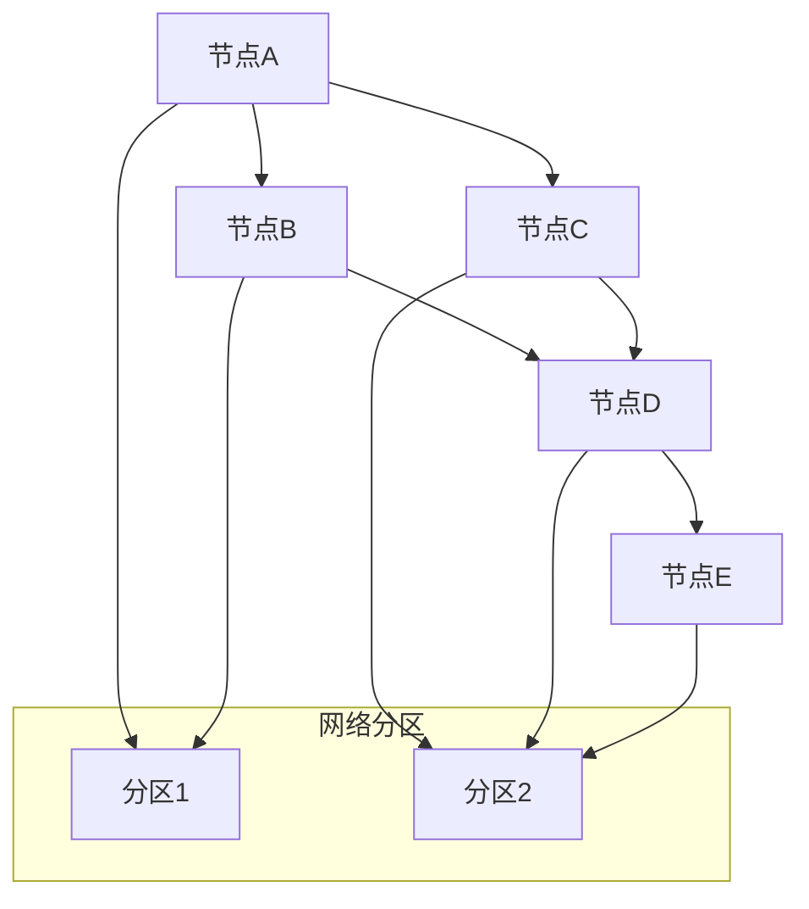

# 分布式架构理论

## 1. 理论概述

分布式架构理论是软件架构理论的核心分支，旨在通过分布式系统的设计和实现来解决大规模、高可用、高性能的软件系统问题。本理论将分布式系统从工程实践提升为严格的形式化理论体系。

### 1.1 理论基础

- **分布式系统理论**：基于分布式计算和网络理论
- **一致性理论**：基于CAP定理和一致性模型
- **容错理论**：基于故障检测和恢复理论

### 1.2 核心目标

- 建立分布式系统的设计原则
- 提供一致性保证的形式化方法
- 支持分布式系统的容错和恢复
- 实现分布式系统的可扩展性和性能优化

## 2. 基本概念

### 2.1 分布式系统定义

```rust
// 分布式系统的基本结构
pub struct DistributedSystem {
    pub nodes: Vec<Node>,
    pub network: Network,
    pub protocols: Vec<Protocol>,
    pub consistency_model: ConsistencyModel,
    pub fault_tolerance: FaultTolerance,
}

// 节点定义
pub struct Node {
    pub id: String,
    pub address: NetworkAddress,
    pub state: NodeState,
    pub capabilities: Vec<Capability>,
    pub neighbors: Vec<String>,
}

// 网络定义
pub struct Network {
    pub topology: NetworkTopology,
    pub latency: LatencyModel,
    pub bandwidth: BandwidthModel,
    pub reliability: ReliabilityModel,
}
```

### 2.2 分布式特性

```rust
// 分布式特性
pub struct DistributedProperties {
    pub scalability: Scalability,
    pub availability: Availability,
    pub consistency: Consistency,
    pub partition_tolerance: PartitionTolerance,
}

// CAP定理
pub struct CAPTheorem {
    pub consistency: bool,
    pub availability: bool,
    pub partition_tolerance: bool,
}

impl CAPTheorem {
    pub fn trade_off(&self) -> CAPTradeOff {
        // 实现CAP权衡
        todo!("实现CAP权衡")
    }
}
```

## 3. 形式化表示

### 3.1 分布式系统图



### 3.2 数学表示

分布式系统可以形式化为图 $DS = (N, E, P, C)$，其中：

- $N$ 是节点集合
- $E$ 是边集合（网络连接）
- $P$ 是协议集合
- $C$ 是一致性约束

一致性可以表示为：
$$\forall n_i, n_j \in N: \text{Consistent}(n_i, n_j) \land \text{EventuallyConsistent}(n_i, n_j)$$

## 4. 一致性理论

### 4.1 一致性模型

```rust
// 一致性模型
pub enum ConsistencyModel {
    StrongConsistency,
    EventualConsistency,
    CausalConsistency,
    SequentialConsistency,
    Linearizability,
}

// 强一致性
pub struct StrongConsistency {
    pub atomicity: bool,
    pub isolation: bool,
    pub durability: bool,
}

impl StrongConsistency {
    pub fn ensure_consistency(&self, operation: &Operation) -> Result<(), ConsistencyError> {
        // 确保强一致性
        todo!("实现强一致性保证")
    }
}

// 最终一致性
pub struct EventualConsistency {
    pub convergence_time: Duration,
    pub conflict_resolution: ConflictResolutionStrategy,
}

impl EventualConsistency {
    pub fn converge(&self, replicas: &[Replica]) -> Result<(), Error> {
        // 实现最终一致性收敛
        todo!("实现一致性收敛")
    }
}
```

### 4.2 共识算法

```rust
// Paxos共识算法
pub struct Paxos {
    pub proposers: Vec<Proposer>,
    pub acceptors: Vec<Acceptor>,
    pub learners: Vec<Learner>,
    pub proposal_number: u64,
}

impl Paxos {
    pub fn propose(&mut self, value: Value) -> Result<Value, Error> {
        // 1. Prepare阶段
        let prepare_ok = self.prepare_phase()?;
        
        // 2. Accept阶段
        let accept_ok = self.accept_phase(value)?;
        
        // 3. Learn阶段
        let learned_value = self.learn_phase()?;
        
        Ok(learned_value)
    }
    
    fn prepare_phase(&self) -> Result<bool, Error> {
        // 实现Prepare阶段
        todo!("实现Prepare阶段")
    }
    
    fn accept_phase(&self, value: Value) -> Result<bool, Error> {
        // 实现Accept阶段
        todo!("实现Accept阶段")
    }
    
    fn learn_phase(&self) -> Result<Value, Error> {
        // 实现Learn阶段
        todo!("实现Learn阶段")
    }
}

// Raft共识算法
pub struct Raft {
    pub leader: Option<String>,
    pub term: u64,
    pub log: Vec<LogEntry>,
    pub commit_index: u64,
    pub applied_index: u64,
}

impl Raft {
    pub fn append_entries(&mut self, entries: Vec<LogEntry>) -> Result<(), Error> {
        // 追加日志条目
        todo!("实现日志追加")
    }
    
    pub fn request_vote(&self, candidate: &str, term: u64) -> Result<bool, Error> {
        // 请求投票
        todo!("实现投票请求")
    }
}
```

## 5. 容错机制

### 5.1 故障检测

```rust
// 故障检测器
pub struct FailureDetector {
    pub timeout: Duration,
    pub suspicion_threshold: u32,
    pub heartbeat_interval: Duration,
}

impl FailureDetector {
    pub fn detect_failures(&mut self, nodes: &[Node]) -> Vec<String> {
        let mut failed_nodes = Vec::new();
        
        for node in nodes {
            if self.is_suspected_failed(node) {
                failed_nodes.push(node.id.clone());
            }
        }
        
        failed_nodes
    }
    
    fn is_suspected_failed(&self, node: &Node) -> bool {
        // 检测节点是否故障
        todo!("实现故障检测")
    }
}

// 心跳机制
pub struct Heartbeat {
    pub sender: String,
    pub receiver: String,
    pub timestamp: DateTime<Utc>,
    pub sequence_number: u64,
}

impl Heartbeat {
    pub fn send(&self) -> Result<(), Error> {
        // 发送心跳
        todo!("实现心跳发送")
    }
    
    pub fn receive(&self) -> Result<(), Error> {
        // 接收心跳
        todo!("实现心跳接收")
    }
}
```

### 5.2 故障恢复

```rust
// 故障恢复
pub struct FaultRecovery {
    pub recovery_strategy: RecoveryStrategy,
    pub backup_nodes: Vec<Node>,
    pub state_replication: StateReplication,
}

pub enum RecoveryStrategy {
    ActiveReplication,
    PassiveReplication,
    SemiActiveReplication,
}

impl FaultRecovery {
    pub fn recover(&self, failed_node: &str) -> Result<(), Error> {
        // 1. 检测故障
        let failure = self.detect_failure(failed_node)?;
        
        // 2. 选择恢复策略
        let strategy = self.select_recovery_strategy(&failure)?;
        
        // 3. 执行恢复
        self.execute_recovery(strategy)?;
        
        Ok(())
    }
    
    fn detect_failure(&self, node_id: &str) -> Result<Failure, Error> {
        // 检测故障
        todo!("实现故障检测")
    }
    
    fn select_recovery_strategy(&self, failure: &Failure) -> Result<RecoveryStrategy, Error> {
        // 选择恢复策略
        todo!("实现策略选择")
    }
    
    fn execute_recovery(&self, strategy: RecoveryStrategy) -> Result<(), Error> {
        // 执行恢复
        todo!("实现故障恢复")
    }
}
```

## 6. 分布式存储

### 6.1 数据分片

```rust
// 数据分片
pub struct DataSharding {
    pub shards: Vec<Shard>,
    pub sharding_strategy: ShardingStrategy,
    pub rebalancing: RebalancingStrategy,
}

pub enum ShardingStrategy {
    HashBased,
    RangeBased,
    DirectoryBased,
}

impl DataSharding {
    pub fn route_request(&self, key: &str) -> Result<String, Error> {
        // 路由请求到正确的分片
        todo!("实现请求路由")
    }
    
    pub fn rebalance(&mut self) -> Result<(), Error> {
        // 重新平衡分片
        todo!("实现分片重平衡")
    }
}

// 分片定义
pub struct Shard {
    pub id: String,
    pub range: KeyRange,
    pub nodes: Vec<String>,
    pub replication_factor: u32,
}
```

### 6.2 数据复制

```rust
// 数据复制
pub struct DataReplication {
    pub replicas: Vec<Replica>,
    pub replication_factor: u32,
    pub consistency_level: ConsistencyLevel,
}

pub enum ConsistencyLevel {
    One,
    Quorum,
    All,
}

impl DataReplication {
    pub fn write(&self, key: &str, value: &Value) -> Result<(), Error> {
        // 写入数据到多个副本
        todo!("实现数据写入")
    }
    
    pub fn read(&self, key: &str) -> Result<Value, Error> {
        // 从副本读取数据
        todo!("实现数据读取")
    }
}

// 副本定义
pub struct Replica {
    pub id: String,
    pub node: String,
    pub state: ReplicaState,
    pub lag: Duration,
}
```

## 7. 分布式计算

### 7.1 MapReduce

```rust
// MapReduce框架
pub struct MapReduce {
    pub mapper: Box<dyn Mapper>,
    pub reducer: Box<dyn Reducer>,
    pub input_splits: Vec<InputSplit>,
    pub output_format: OutputFormat,
}

pub trait Mapper {
    fn map(&self, key: &str, value: &str) -> Vec<(String, String)>;
}

pub trait Reducer {
    fn reduce(&self, key: &str, values: &[String]) -> String;
}

impl MapReduce {
    pub fn execute(&self) -> Result<(), Error> {
        // 1. Map阶段
        let map_results = self.map_phase()?;
        
        // 2. Shuffle阶段
        let shuffled_data = self.shuffle_phase(map_results)?;
        
        // 3. Reduce阶段
        let reduce_results = self.reduce_phase(shuffled_data)?;
        
        // 4. 输出结果
        self.output_results(reduce_results)?;
        
        Ok(())
    }
    
    fn map_phase(&self) -> Result<Vec<(String, String)>, Error> {
        // 实现Map阶段
        todo!("实现Map阶段")
    }
    
    fn shuffle_phase(&self, map_results: Vec<(String, String)>) -> Result<HashMap<String, Vec<String>>, Error> {
        // 实现Shuffle阶段
        todo!("实现Shuffle阶段")
    }
    
    fn reduce_phase(&self, shuffled_data: HashMap<String, Vec<String>>) -> Result<Vec<(String, String)>, Error> {
        // 实现Reduce阶段
        todo!("实现Reduce阶段")
    }
}
```

### 7.2 流处理

```rust
// 流处理系统
pub struct StreamProcessing {
    pub topology: ProcessingTopology,
    pub sources: Vec<DataSource>,
    pub sinks: Vec<DataSink>,
    pub operators: Vec<StreamOperator>,
}

impl StreamProcessing {
    pub fn process_stream(&self, stream: DataStream) -> Result<DataStream, Error> {
        // 处理数据流
        todo!("实现流处理")
    }
    
    pub fn window_aggregation(&self, window: TimeWindow, data: &[Event]) -> Result<AggregationResult, Error> {
        // 窗口聚合
        todo!("实现窗口聚合")
    }
}
```

## 8. 交叉引用

### 8.1 相关理论

- [软件架构理论总论](00-软件架构理论总论.md)
- [微服务架构理论](02-微服务架构理论.md)
- [云原生架构理论](04-云原生架构理论.md)

### 8.2 实践应用

- [架构设计工具](../08-实践应用开发/04-架构设计工具/README.md)
- [模型检测工具](../08-实践应用开发/05-模型检测工具/README.md)

## 9. 导航

- [返回软件架构理论总论](00-软件架构理论总论.md)
- [设计模式理论](01-设计模式理论.md)
- [微服务架构理论](02-微服务架构理论.md)
- [组件化架构理论](03-组件化架构理论.md)
- [云原生架构理论](04-云原生架构理论.md)
- [WebAssembly架构理论](06-WebAssembly架构理论.md)
- [工作流架构理论](07-工作流架构理论.md)
