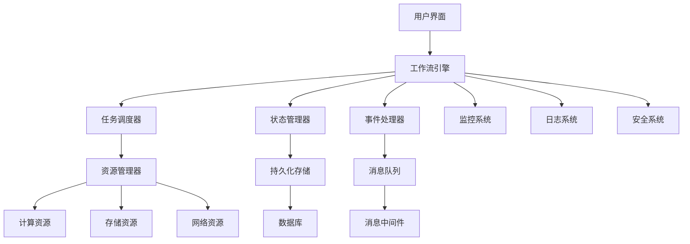

# 05-工作流架构理论

## 目录

1. [1.0 工作流架构基础](#10-工作流架构基础)
2. [2.0 工作流形式化模型](#20-工作流形式化模型)
3. [3.0 工作流引擎设计](#30-工作流引擎设计)
4. [4.0 工作流验证理论](#40-工作流验证理论)
5. [5.0 工作流优化理论](#50-工作流优化理论)
6. [6.0 实践应用](#60-实践应用)

## 1.0 工作流架构基础

### 1.1 工作流定义

**定义 1.1.1 (工作流)**
工作流是一个五元组 $\mathcal{WF} = (T, D, C, F, S)$，其中：

- $T$ 是任务集合 (Tasks)
- $D$ 是数据集合 (Data)
- $C$ 是控制流集合 (Control Flow)
- $F$ 是数据流集合 (Data Flow)
- $S$ 是状态集合 (States)

**定义 1.1.2 (工作流实例)**
工作流实例是一个四元组 $\mathcal{WFI} = (\mathcal{WF}, M, E, H)$，其中：

- $\mathcal{WF}$ 是工作流定义
- $M$ 是执行状态映射
- $E$ 是事件历史
- $H$ 是执行历史

### 1.2 工作流模式

**定义 1.2.1 (顺序模式)**
顺序模式是一个二元组 $\mathcal{SEQ} = (T, <)$，其中：

- $T$ 是任务集合
- $<$ 是严格偏序关系

**定义 1.2.2 (并行模式)**
并行模式是一个三元组 $\mathcal{PAR} = (T, \parallel, \oplus)$，其中：

- $T$ 是任务集合
- $\parallel$ 是并行关系
- $\oplus$ 是同步点

**定义 1.2.3 (条件模式)**
条件模式是一个四元组 $\mathcal{COND} = (T, C, B, D)$，其中：

- $T$ 是任务集合
- $C$ 是条件集合
- $B$ 是分支函数
- $D$ 是决策点

### 1.3 工作流属性

**定义 1.3.1 (工作流正确性)**
工作流 $\mathcal{WF}$ 是正确的，当且仅当：

$$\forall \text{instance} \in \text{Instances}(\mathcal{WF}), \quad \text{Terminates}(\text{instance}) \land \text{Correct}(\text{instance})$$

**定义 1.3.2 (工作流活性)**
工作流 $\mathcal{WF}$ 是活的，当且仅当：

$$\forall t \in T, \quad \exists \text{instance} \in \text{Instances}(\mathcal{WF}), \quad \text{Executable}(t, \text{instance})$$

## 2.0 工作流形式化模型

### 2.1 Petri网模型

**定义 2.1.1 (工作流Petri网)**
工作流Petri网是一个六元组 $\mathcal{WPN} = (P, T, F, M_0, C, G)$，其中：

- $P$ 是库所集合 (Places)
- $T$ 是变迁集合 (Transitions)
- $F \subseteq (P \times T) \cup (T \times P)$ 是流关系
- $M_0: P \to \mathbb{N}$ 是初始标识
- $C: T \to \text{Conditions}$ 是条件函数
- $G: T \to \text{Guards}$ 是守卫函数

**定理 2.1.1 (工作流可达性)**
对于工作流Petri网 $\mathcal{WPN}$ 和标识 $M$，$M$ 可达当且仅当存在发射序列 $\sigma$ 使得 $M_0 \xrightarrow{\sigma} M$。

**证明**：
1. 必要性：如果 $M$ 可达，则存在发射序列 $\sigma$ 使得 $M_0 \xrightarrow{\sigma} M$
2. 充分性：如果存在发射序列 $\sigma$ 使得 $M_0 \xrightarrow{\sigma} M$，则 $M$ 可达

### 2.2 状态机模型

**定义 2.2.1 (工作流状态机)**
工作流状态机是一个五元组 $\mathcal{WSM} = (S, E, T, s_0, F)$，其中：

- $S$ 是状态集合
- $E$ 是事件集合
- $T: S \times E \to S$ 是转移函数
- $s_0 \in S$ 是初始状态
- $F \subseteq S$ 是最终状态集合

**定义 2.2.2 (状态机等价性)**
两个工作流状态机 $\mathcal{WSM}_1, \mathcal{WSM}_2$ 等价，当且仅当：

$$\mathcal{L}(\mathcal{WSM}_1) = \mathcal{L}(\mathcal{WSM}_2)$$

其中 $\mathcal{L}(\mathcal{WSM})$ 是状态机接受的语言。

### 2.3 代数模型

**定义 2.3.1 (工作流代数)**
工作流代数是一个四元组 $\mathcal{WA} = (W, \cdot, +, *)$，其中：

- $W$ 是工作流表达式集合
- $\cdot$ 是顺序组合运算
- $+$ 是选择运算
- $*$ 是迭代运算

**公理 2.3.1 (工作流代数公理)**:

1. **结合律**：$(a \cdot b) \cdot c = a \cdot (b \cdot c)$
2. **分配律**：$a \cdot (b + c) = a \cdot b + a \cdot c$
3. **幂等律**：$a + a = a$
4. **单位元**：$\epsilon \cdot a = a \cdot \epsilon = a$

## 3.0 工作流引擎设计

### 3.1 引擎架构

**定义 3.1.1 (工作流引擎)**
工作流引擎是一个六元组 $\mathcal{WE} = (P, S, E, M, C, A)$，其中：

- $P$ 是解析器 (Parser)
- $S$ 是调度器 (Scheduler)
- $E$ 是执行器 (Executor)
- $M$ 是监控器 (Monitor)
- $C$ 是控制器 (Controller)
- $A$ 是适配器 (Adapter)

### 3.2 执行模型

**定义 3.2.1 (执行状态)**
执行状态是一个三元组 $\mathcal{ES} = (S, D, C)$，其中：

- $S$ 是系统状态
- $D$ 是数据状态
- $C$ 是控制状态

**定义 3.2.2 (执行步骤)**
执行步骤是一个函数 $\text{Step}: \mathcal{ES} \times \text{Event} \to \mathcal{ES}$，定义：

$$\text{Step}((S, D, C), e) = (S', D', C')$$

其中：
- $S' = \text{UpdateState}(S, e)$
- $D' = \text{UpdateData}(D, e)$
- $C' = \text{UpdateControl}(C, e)$

### 3.3 调度算法

**算法 3.3.1 (工作流调度算法)**

```rust
pub struct WorkflowScheduler {
    tasks: Vec<Task>,
    dependencies: HashMap<TaskId, Vec<TaskId>>,
    ready_queue: VecDeque<TaskId>,
    running_tasks: HashSet<TaskId>,
    completed_tasks: HashSet<TaskId>,
}

impl WorkflowScheduler {
    pub fn schedule(&mut self) -> Vec<TaskId> {
        let mut execution_order = Vec::new();
        
        // 初始化就绪队列
        self.initialize_ready_queue();
        
        while !self.ready_queue.is_empty() || !self.running_tasks.is_empty() {
            // 检查完成的任务
            self.check_completed_tasks();
            
            // 调度就绪任务
            while let Some(task_id) = self.ready_queue.pop_front() {
                self.running_tasks.insert(task_id);
                execution_order.push(task_id);
            }
            
            // 模拟任务执行
            self.simulate_execution();
        }
        
        execution_order
    }
    
    fn initialize_ready_queue(&mut self) {
        for task in &self.tasks {
            if self.dependencies.get(&task.id).unwrap_or(&vec![]).is_empty() {
                self.ready_queue.push_back(task.id);
            }
        }
    }
    
    fn check_completed_tasks(&mut self) {
        let completed: Vec<TaskId> = self.running_tasks.iter()
            .filter(|&&task_id| self.is_task_completed(task_id))
            .cloned()
            .collect();
            
        for task_id in completed {
            self.running_tasks.remove(&task_id);
            self.completed_tasks.insert(task_id);
            self.update_dependencies(task_id);
        }
    }
    
    fn update_dependencies(&mut self, completed_task: TaskId) {
        for (task_id, deps) in &mut self.dependencies {
            if deps.contains(&completed_task) {
                deps.retain(|&x| x != completed_task);
                if deps.is_empty() && !self.completed_tasks.contains(task_id) {
                    self.ready_queue.push_back(*task_id);
                }
            }
        }
    }
}
```

## 4.0 工作流验证理论

### 4.1 正确性验证

**定义 4.1.1 (工作流正确性)**
工作流 $\mathcal{WF}$ 是正确的，当且仅当满足以下条件：

1. **终止性**：$\forall \text{instance} \in \text{Instances}(\mathcal{WF}), \quad \text{Terminates}(\text{instance})$
2. **安全性**：$\forall \text{instance} \in \text{Instances}(\mathcal{WF}), \quad \text{Safe}(\text{instance})$
3. **活性**：$\forall t \in T, \quad \exists \text{instance} \in \text{Instances}(\mathcal{WF}), \quad \text{Executable}(t, \text{instance})$

**定理 4.1.1 (正确性验证定理)**
工作流 $\mathcal{WF}$ 的正确性可以在多项式时间内验证。

**证明**：
1. 终止性可以通过可达性分析验证
2. 安全性可以通过状态空间搜索验证
3. 活性可以通过死锁检测验证
4. 所有验证算法都是多项式时间的

### 4.2 模型检查

**定义 4.2.1 (工作流模型检查)**
工作流模型检查是一个函数 $\text{ModelCheck}: \mathcal{WF} \times \text{Property} \to \{\text{true}, \text{false}\}$，定义：

$$\text{ModelCheck}(\mathcal{WF}, \phi) = \begin{cases}
\text{true} & \text{if } \mathcal{WF} \models \phi \\
\text{false} & \text{otherwise}
\end{cases}$$

**算法 4.2.1 (LTL模型检查算法)**

```go
type WorkflowModelChecker struct {
    workflow *Workflow
    states   map[string]*State
    transitions map[string][]*Transition
}

func (wmc *WorkflowModelChecker) CheckLTL(property string) bool {
    // 构建Büchi自动机
    buchi := wmc.buildBuchiAutomaton(property)
    
    // 构建工作流自动机
    workflow := wmc.buildWorkflowAutomaton()
    
    // 计算乘积自动机
    product := wmc.computeProduct(workflow, buchi)
    
    // 检查接受循环
    return wmc.checkAcceptingCycle(product)
}

func (wmc *WorkflowModelChecker) buildBuchiAutomaton(property string) *BuchiAutomaton {
    // 解析LTL公式
    formula := wmc.parseLTL(property)
    
    // 构建广义Büchi自动机
    gba := wmc.buildGeneralizedBuchi(formula)
    
    // 转换为Büchi自动机
    return wmc.convertToBuchi(gba)
}

func (wmc *WorkflowModelChecker) checkAcceptingCycle(product *ProductAutomaton) bool {
    // 使用Tarjan算法查找强连通分量
    sccs := wmc.findStronglyConnectedComponents(product)
    
    // 检查每个SCC是否包含接受状态
    for _, scc := range sccs {
        if wmc.containsAcceptingState(scc) {
            return true
        }
    }
    
    return false
}
```

### 4.3 死锁检测

**定义 4.3.1 (死锁)**
工作流 $\mathcal{WF}$ 存在死锁，当且仅当存在状态 $s$ 使得：

$$\exists s \in S, \quad \forall e \in E, \quad \neg \text{Enabled}(s, e)$$

**算法 4.3.1 (死锁检测算法)**

```rust
pub struct DeadlockDetector {
    workflow: Workflow,
    reachable_states: HashSet<State>,
}

impl DeadlockDetector {
    pub fn detect_deadlock(&self) -> Option<State> {
        for state in &self.reachable_states {
            if self.is_deadlock_state(state) {
                return Some(state.clone());
            }
        }
        None
    }
    
    fn is_deadlock_state(&self, state: &State) -> bool {
        // 检查是否有可执行的事件
        for event in &self.workflow.events {
            if self.is_enabled(state, event) {
                return false;
            }
        }
        true
    }
    
    fn is_enabled(&self, state: &State, event: &Event) -> bool {
        // 检查事件的前置条件是否满足
        event.preconditions.iter().all(|condition| {
            self.evaluate_condition(state, condition)
        })
    }
    
    fn evaluate_condition(&self, state: &State, condition: &Condition) -> bool {
        match condition {
            Condition::Variable(var, value) => {
                state.variables.get(var) == Some(value)
            }
            Condition::And(conds) => {
                conds.iter().all(|c| self.evaluate_condition(state, c))
            }
            Condition::Or(conds) => {
                conds.iter().any(|c| self.evaluate_condition(state, c))
            }
            Condition::Not(cond) => {
                !self.evaluate_condition(state, cond)
            }
        }
    }
}
```

## 5.0 工作流优化理论

### 5.1 性能优化

**定义 5.1.1 (工作流性能)**
工作流性能是一个四元组 $\mathcal{WP} = (T, R, C, Q)$，其中：

- $T$ 是执行时间
- $R$ 是资源使用
- $C$ 是成本
- $Q$ 是质量指标

**定义 5.1.2 (性能优化目标)**
性能优化目标是找到工作流 $\mathcal{WF}'$ 使得：

$$\mathcal{WF}' = \arg\min_{\mathcal{WF}} \text{Cost}(\mathcal{WF})$$

满足约束条件：
- $\text{Time}(\mathcal{WF}) \leq T_{\max}$
- $\text{Resource}(\mathcal{WF}) \leq R_{\max}$
- $\text{Quality}(\mathcal{WF}) \geq Q_{\min}$

### 5.2 资源调度优化

**算法 5.2.1 (资源调度优化算法)**

```go
type ResourceScheduler struct {
    resources map[string]*Resource
    tasks     []*Task
    constraints []*Constraint
}

func (rs *ResourceScheduler) OptimizeSchedule() *Schedule {
    // 构建优化模型
    model := rs.buildOptimizationModel()
    
    // 求解线性规划问题
    solution := rs.solveLinearProgramming(model)
    
    // 转换为调度方案
    return rs.convertToSchedule(solution)
}

func (rs *ResourceScheduler) buildOptimizationModel() *OptimizationModel {
    model := &OptimizationModel{
        Variables: make(map[string]*Variable),
        Constraints: make([]*Constraint, 0),
        Objective: &Objective{},
    }
    
    // 添加决策变量
    for _, task := range rs.tasks {
        for _, resource := range rs.resources {
            varName := fmt.Sprintf("x_%s_%s", task.ID, resource.ID)
            model.Variables[varName] = &Variable{
                Name: varName,
                Type: Binary,
                LowerBound: 0,
                UpperBound: 1,
            }
        }
    }
    
    // 添加约束条件
    rs.addResourceConstraints(model)
    rs.addTaskConstraints(model)
    rs.addTemporalConstraints(model)
    
    // 设置目标函数
    model.Objective.Type = Minimize
    model.Objective.Expression = rs.buildObjectiveExpression()
    
    return model
}

func (rs *ResourceScheduler) addResourceConstraints(model *OptimizationModel) {
    // 资源容量约束
    for resourceID, resource := range rs.resources {
        for timeSlot := 0; timeSlot < rs.maxTimeSlots; timeSlot++ {
            constraint := &Constraint{
                Type: LessThanOrEqual,
                LeftSide: rs.buildResourceUsageExpression(resourceID, timeSlot),
                RightSide: resource.Capacity,
            }
            model.Constraints = append(model.Constraints, constraint)
        }
    }
}

func (rs *ResourceScheduler) addTaskConstraints(model *OptimizationModel) {
    // 任务分配约束：每个任务必须分配给一个资源
    for _, task := range rs.tasks {
        constraint := &Constraint{
            Type: Equal,
            LeftSide: rs.buildTaskAssignmentExpression(task.ID),
            RightSide: 1,
        }
        model.Constraints = append(model.Constraints, constraint)
    }
}
```

### 5.3 负载均衡

**定义 5.3.1 (负载均衡)**
负载均衡是一个函数 $\text{LoadBalance}: \text{Tasks} \times \text{Resources} \to \text{Assignment}$，使得：

$$\forall r \in \text{Resources}, \quad \text{Load}(r) \approx \frac{\sum_{t \in \text{Tasks}} \text{Weight}(t)}{|\text{Resources}|}$$

**算法 5.3.1 (负载均衡算法)**

```rust
pub struct LoadBalancer {
    resources: Vec<Resource>,
    tasks: Vec<Task>,
    strategy: LoadBalancingStrategy,
}

impl LoadBalancer {
    pub fn balance(&mut self) -> Assignment {
        match self.strategy {
            LoadBalancingStrategy::RoundRobin => self.round_robin(),
            LoadBalancingStrategy::LeastConnections => self.least_connections(),
            LoadBalancingStrategy::WeightedRoundRobin => self.weighted_round_robin(),
            LoadBalancingStrategy::ConsistentHashing => self.consistent_hashing(),
        }
    }
    
    fn round_robin(&self) -> Assignment {
        let mut assignment = Assignment::new();
        let mut resource_index = 0;
        
        for task in &self.tasks {
            let resource = &self.resources[resource_index];
            assignment.assign(task.id, resource.id);
            resource_index = (resource_index + 1) % self.resources.len();
        }
        
        assignment
    }
    
    fn least_connections(&self) -> Assignment {
        let mut assignment = Assignment::new();
        let mut resource_loads: HashMap<ResourceId, usize> = HashMap::new();
        
        for task in &self.tasks {
            // 找到负载最小的资源
            let min_load_resource = self.resources.iter()
                .min_by_key(|r| resource_loads.get(&r.id).unwrap_or(&0))
                .unwrap();
            
            assignment.assign(task.id, min_load_resource.id);
            *resource_loads.entry(min_load_resource.id).or_insert(0) += 1;
        }
        
        assignment
    }
    
    fn weighted_round_robin(&self) -> Assignment {
        let mut assignment = Assignment::new();
        let mut resource_weights: HashMap<ResourceId, f64> = HashMap::new();
        
        // 初始化权重
        for resource in &self.resources {
            resource_weights.insert(resource.id, resource.weight);
        }
        
        for task in &self.tasks {
            // 选择权重最高的资源
            let max_weight_resource = self.resources.iter()
                .max_by(|a, b| {
                    resource_weights.get(&a.id).unwrap_or(&0.0)
                        .partial_cmp(resource_weights.get(&b.id).unwrap_or(&0.0))
                        .unwrap()
                })
                .unwrap();
            
            assignment.assign(task.id, max_weight_resource.id);
            
            // 更新权重
            if let Some(weight) = resource_weights.get_mut(&max_weight_resource.id) {
                *weight -= 1.0;
                if *weight <= 0.0 {
                    *weight = max_weight_resource.weight;
                }
            }
        }
        
        assignment
    }
}
```

## 6.0 实践应用

### 6.1 企业工作流系统

**架构 6.1.1 (企业工作流系统架构)**



### 6.2 云原生工作流

**定义 6.2.1 (云原生工作流)**
云原生工作流是一个五元组 $\mathcal{CNWF} = (\mathcal{WF}, C, O, S, M)$，其中：

- $\mathcal{WF}$ 是工作流定义
- $C$ 是容器编排
- $O$ 是编排器
- $S$ 是服务网格
- $M$ 是监控系统

**实现 6.2.1 (Kubernetes工作流实现)**

```yaml
apiVersion: argoproj.io/v1alpha1
kind: Workflow
metadata:
  name: data-processing-workflow
spec:
  entrypoint: data-pipeline
  templates:
  - name: data-pipeline
    dag:
      tasks:
      - name: data-ingestion
        template: ingest-data
      - name: data-transformation
        template: transform-data
        dependencies: [data-ingestion]
      - name: data-validation
        template: validate-data
        dependencies: [data-transformation]
      - name: data-export
        template: export-data
        dependencies: [data-validation]
  
  - name: ingest-data
    container:
      image: data-ingestion:latest
      command: [python, /app/ingest.py]
      resources:
        requests:
          memory: "256Mi"
          cpu: "250m"
        limits:
          memory: "512Mi"
          cpu: "500m"
  
  - name: transform-data
    container:
      image: data-transformation:latest
      command: [python, /app/transform.py]
      resources:
        requests:
          memory: "512Mi"
          cpu: "500m"
        limits:
          memory: "1Gi"
          cpu: "1000m"
  
  - name: validate-data
    container:
      image: data-validation:latest
      command: [python, /app/validate.py]
      resources:
        requests:
          memory: "256Mi"
          cpu: "250m"
        limits:
          memory: "512Mi"
          cpu: "500m"
  
  - name: export-data
    container:
      image: data-export:latest
      command: [python, /app/export.py]
      resources:
        requests:
          memory: "256Mi"
          cpu: "250m"
        limits:
          memory: "512Mi"
          cpu: "500m"
```

### 6.3 微服务工作流

**架构 6.3.1 (微服务工作流架构)**

```go
// 工作流编排服务
type WorkflowOrchestrator struct {
    workflowEngine *WorkflowEngine
    serviceRegistry *ServiceRegistry
    eventBus *EventBus
    stateStore *StateStore
}

func (wo *WorkflowOrchestrator) ExecuteWorkflow(workflowID string, input map[string]interface{}) (*WorkflowExecution, error) {
    // 创建工作流执行实例
    execution := &WorkflowExecution{
        ID: generateExecutionID(),
        WorkflowID: workflowID,
        Status: StatusRunning,
        Input: input,
        Output: make(map[string]interface{}),
        Steps: make([]*StepExecution, 0),
    }
    
    // 保存执行状态
    wo.stateStore.SaveExecution(execution)
    
    // 开始执行
    go wo.executeWorkflow(execution)
    
    return execution, nil
}

func (wo *WorkflowOrchestrator) executeWorkflow(execution *WorkflowExecution) {
    workflow := wo.workflowEngine.GetWorkflow(execution.WorkflowID)
    
    for _, step := range workflow.Steps {
        // 检查前置条件
        if !wo.checkPreconditions(execution, step) {
            continue
        }
        
        // 执行步骤
        stepExecution := wo.executeStep(execution, step)
        execution.Steps = append(execution.Steps, stepExecution)
        
        // 更新执行状态
        wo.stateStore.UpdateExecution(execution)
        
        // 发布事件
        wo.eventBus.Publish("step.completed", stepExecution)
        
        // 检查后置条件
        if !wo.checkPostconditions(execution, step) {
            execution.Status = StatusFailed
            break
        }
    }
    
    if execution.Status == StatusRunning {
        execution.Status = StatusCompleted
    }
    
    wo.stateStore.UpdateExecution(execution)
    wo.eventBus.Publish("workflow.completed", execution)
}

func (wo *WorkflowOrchestrator) executeStep(execution *WorkflowExecution, step *Step) *StepExecution {
    stepExecution := &StepExecution{
        ID: generateStepExecutionID(),
        StepID: step.ID,
        Status: StatusRunning,
        StartTime: time.Now(),
    }
    
    // 调用微服务
    service := wo.serviceRegistry.GetService(step.ServiceName)
    response, err := service.Call(step.Operation, execution.Input)
    
    if err != nil {
        stepExecution.Status = StatusFailed
        stepExecution.Error = err.Error()
    } else {
        stepExecution.Status = StatusCompleted
        stepExecution.Output = response
        stepExecution.EndTime = time.Now()
        
        // 更新执行上下文
        execution.Output[step.ID] = response
    }
    
    return stepExecution
}
```

## 总结

本工作流架构理论建立了完整的形式化框架，包括：

1. **理论基础**：工作流定义、模式、属性
2. **形式化模型**：Petri网、状态机、代数模型
3. **引擎设计**：架构、执行模型、调度算法
4. **验证理论**：正确性验证、模型检查、死锁检测
5. **优化理论**：性能优化、资源调度、负载均衡
6. **实践应用**：企业系统、云原生、微服务架构

该理论体系具有以下特点：

- **形式化程度高**：使用严格的数学定义和证明
- **实用性强**：提供具体的算法和实现
- **可扩展性好**：支持不同应用场景的扩展
- **验证完备**：提供完整的验证和测试方法

下一步将继续完善其他理论模块，建立完整的应用体系。 