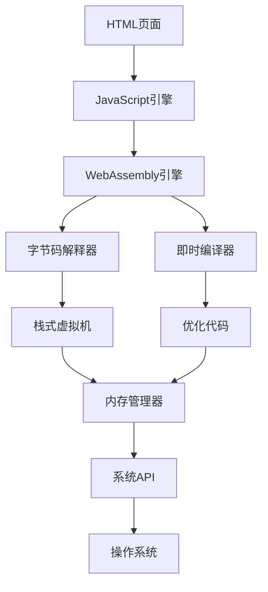

# 06-WebAssembly架构理论

## 目录

1. [1.0 WebAssembly基础理论](#10-webassembly基础理论)
2. [2.0 字节码形式化模型](#20-字节码形式化模型)
3. [3.0 执行模型理论](#30-执行模型理论)
4. [4.0 内存模型理论](#40-内存模型理论)
5. [5.0 组件模型理论](#50-组件模型理论)
6. [6.0 安全模型理论](#60-安全模型理论)
7. [7.0 性能优化理论](#70-性能优化理论)
8. [8.0 实践应用](#80-实践应用)

## 1.0 WebAssembly基础理论

### 1.1 WebAssembly定义

**定义 1.1.1 (WebAssembly模块)**
WebAssembly模块是一个五元组 $\mathcal{WAM} = (F, M, T, G, E)$，其中：

- $F$ 是函数集合 (Functions)
- $M$ 是内存集合 (Memories)
- $T$ 是表集合 (Tables)
- $G$ 是全局变量集合 (Globals)
- $E$ 是导出集合 (Exports)

**定义 1.1.2 (WebAssembly实例)**
WebAssembly实例是一个四元组 $\mathcal{WAI} = (\mathcal{WAM}, S, H, I)$，其中：

- $\mathcal{WAM}$ 是WebAssembly模块
- $S$ 是栈状态 (Stack State)
- $H$ 是堆状态 (Heap State)
- $I$ 是导入状态 (Import State)

### 1.2 类型系统

**定义 1.2.1 (WebAssembly类型)**
WebAssembly类型集合 $\mathcal{T}$ 定义为：

$$\mathcal{T} = \{\text{i32}, \text{i64}, \text{f32}, \text{f64}, \text{v128}\}$$

**定义 1.2.2 (函数类型)**
函数类型是一个二元组 $\text{func}(P, R)$，其中：

- $P$ 是参数类型序列
- $R$ 是返回类型序列

**定义 1.2.3 (内存类型)**
内存类型是一个三元组 $\text{mem}(\text{min}, \text{max}, \text{shared})$，其中：

- $\text{min}$ 是最小页数
- $\text{max}$ 是最大页数
- $\text{shared}$ 是共享标志

### 1.3 指令集

**定义 1.3.1 (数值指令)**
数值指令集合 $\mathcal{NI}$ 包含：

$$\mathcal{NI} = \{\text{i32.const}, \text{i64.const}, \text{f32.const}, \text{f64.const}, \text{i32.add}, \text{i64.add}, \ldots\}$$

**定义 1.3.2 (内存指令)**
内存指令集合 $\mathcal{MI}$ 包含：

$$\mathcal{MI} = \{\text{i32.load}, \text{i64.store}, \text{f32.load}, \text{f64.store}, \ldots\}$$

**定义 1.3.3 (控制指令)**
控制指令集合 $\mathcal{CI}$ 包含：

$$\mathcal{CI} = \{\text{block}, \text{loop}, \text{if}, \text{br}, \text{br\_if}, \text{call}, \text{return}, \ldots\}$$

## 2.0 字节码形式化模型

### 2.1 字节码语法

**定义 2.1.1 (字节码语法)**
字节码语法是一个上下文无关文法 $G = (V, \Sigma, P, S)$，其中：

- $V$ 是非终结符集合
- $\Sigma$ 是终结符集合（字节码指令）
- $P$ 是产生式集合
- $S$ 是开始符号

**产生式 2.1.1 (基本产生式)**:

```
S → module
module → (module section*)
section → type_section | func_section | memory_section | export_section
type_section → (type func_type*)
func_type → (func param* result*)
param → (param val_type*)
result → (result val_type*)
```

### 2.2 字节码语义

**定义 2.2.1 (字节码语义)**
字节码语义是一个三元组 $\mathcal{BS} = (C, \rightarrow, \Downarrow)$，其中：

- $C$ 是配置集合
- $\rightarrow$ 是转换关系
- $\Downarrow$ 是求值关系

**定义 2.2.2 (配置)**
配置是一个四元组 $c = (F, L, S, I)$，其中：

- $F$ 是函数帧栈
- $L$ 是局部变量
- $S$ 是操作数栈
- $I$ 是指令序列

**规则 2.2.1 (数值指令语义)**

$$\frac{v \in \text{Values}}{\text{const}(v) :: S \rightarrow v :: S}$$

$$\frac{v_1, v_2 \in \text{Values} \quad v_1 + v_2 = v_3}{v_1 :: v_2 :: \text{add} :: S \rightarrow v_3 :: S}$$

### 2.3 验证规则

**定义 2.3.1 (类型验证)**
类型验证是一个函数 $\text{Validate}: \text{Module} \to \{\text{true}, \text{false}\}$，定义：

$$\text{Validate}(m) = \begin{cases}
\text{true} & \text{if } \forall f \in F, \text{ValidateFunc}(f) \\
\text{false} & \text{otherwise}
\end{cases}$$

**规则 2.3.1 (函数验证规则)**

$$\frac{\text{ValidateLocals}(f) \land \text{ValidateBody}(f)}{\text{ValidateFunc}(f)}$$

## 3.0 执行模型理论

### 3.1 栈式虚拟机

**定义 3.1.1 (栈式虚拟机)**
栈式虚拟机是一个五元组 $\mathcal{SVM} = (S, L, G, M, I)$，其中：

- $S$ 是操作数栈
- $L$ 是局部变量数组
- $G$ 是全局变量数组
- $M$ 是内存数组
- $I$ 是指令指针

**算法 3.1.1 (栈式虚拟机执行算法)**

```rust
pub struct StackVirtualMachine {
    operand_stack: Vec<Value>,
    locals: Vec<Value>,
    globals: Vec<Value>,
    memory: Vec<u8>,
    instruction_pointer: usize,
    function_stack: Vec<FunctionFrame>,
}

impl StackVirtualMachine {
    pub fn execute(&mut self, module: &Module) -> Result<Value, ExecutionError> {
        // 初始化执行环境
        self.initialize_execution_environment(module);
        
        // 开始执行
        while self.instruction_pointer < self.current_function().code.len() {
            let instruction = &self.current_function().code[self.instruction_pointer];
            self.execute_instruction(instruction)?;
            self.instruction_pointer += 1;
        }
        
        // 返回栈顶值
        self.operand_stack.pop().ok_or(ExecutionError::StackUnderflow)
    }
    
    fn execute_instruction(&mut self, instruction: &Instruction) -> Result<(), ExecutionError> {
        match instruction {
            Instruction::Const(value) => {
                self.operand_stack.push(*value);
            }
            Instruction::Add => {
                let b = self.operand_stack.pop().ok_or(ExecutionError::StackUnderflow)?;
                let a = self.operand_stack.pop().ok_or(ExecutionError::StackUnderflow)?;
                let result = self.add_values(a, b)?;
                self.operand_stack.push(result);
            }
            Instruction::Sub => {
                let b = self.operand_stack.pop().ok_or(ExecutionError::StackUnderflow)?;
                let a = self.operand_stack.pop().ok_or(ExecutionError::StackUnderflow)?;
                let result = self.subtract_values(a, b)?;
                self.operand_stack.push(result);
            }
            Instruction::Mul => {
                let b = self.operand_stack.pop().ok_or(ExecutionError::StackUnderflow)?;
                let a = self.operand_stack.pop().ok_or(ExecutionError::StackUnderflow)?;
                let result = self.multiply_values(a, b)?;
                self.operand_stack.push(result);
            }
            Instruction::Div => {
                let b = self.operand_stack.pop().ok_or(ExecutionError::StackUnderflow)?;
                let a = self.operand_stack.pop().ok_or(ExecutionError::StackUnderflow)?;
                let result = self.divide_values(a, b)?;
                self.operand_stack.push(result);
            }
            Instruction::LocalGet(index) => {
                let value = self.locals[*index as usize].clone();
                self.operand_stack.push(value);
            }
            Instruction::LocalSet(index) => {
                let value = self.operand_stack.pop().ok_or(ExecutionError::StackUnderflow)?;
                self.locals[*index as usize] = value;
            }
            Instruction::GlobalGet(index) => {
                let value = self.globals[*index as usize].clone();
                self.operand_stack.push(value);
            }
            Instruction::GlobalSet(index) => {
                let value = self.operand_stack.pop().ok_or(ExecutionError::StackUnderflow)?;
                self.globals[*index as usize] = value;
            }
            Instruction::MemoryLoad(offset, alignment) => {
                let address = self.operand_stack.pop().ok_or(ExecutionError::StackUnderflow)?;
                let value = self.load_from_memory(address, *offset, *alignment)?;
                self.operand_stack.push(value);
            }
            Instruction::MemoryStore(offset, alignment) => {
                let value = self.operand_stack.pop().ok_or(ExecutionError::StackUnderflow)?;
                let address = self.operand_stack.pop().ok_or(ExecutionError::StackUnderflow)?;
                self.store_to_memory(address, value, *offset, *alignment)?;
            }
            Instruction::Call(function_index) => {
                self.call_function(*function_index)?;
            }
            Instruction::Return => {
                self.return_from_function()?;
            }
            Instruction::If(block_type) => {
                let condition = self.operand_stack.pop().ok_or(ExecutionError::StackUnderflow)?;
                if self.is_truthy(condition) {
                    // 继续执行if块
                } else {
                    // 跳转到else块或end
                    self.jump_to_else_or_end()?;
                }
            }
            Instruction::Block(block_type) => {
                self.enter_block(*block_type);
            }
            Instruction::End => {
                self.exit_block();
            }
            Instruction::Br(label_index) => {
                self.branch(*label_index)?;
            }
            Instruction::BrIf(label_index) => {
                let condition = self.operand_stack.pop().ok_or(ExecutionError::StackUnderflow)?;
                if self.is_truthy(condition) {
                    self.branch(*label_index)?;
                }
            }
            Instruction::Loop(label_index) => {
                self.enter_loop(*label_index);
            }
        }
        Ok(())
    }
    
    fn add_values(&self, a: Value, b: Value) -> Result<Value, ExecutionError> {
        match (a, b) {
            (Value::I32(x), Value::I32(y)) => Ok(Value::I32(x.wrapping_add(y))),
            (Value::I64(x), Value::I64(y)) => Ok(Value::I64(x.wrapping_add(y))),
            (Value::F32(x), Value::F32(y)) => Ok(Value::F32(x + y)),
            (Value::F64(x), Value::F64(y)) => Ok(Value::F64(x + y)),
            _ => Err(ExecutionError::TypeMismatch),
        }
    }
    
    fn call_function(&mut self, function_index: u32) -> Result<(), ExecutionError> {
        let function = self.get_function(function_index)?;
        
        // 创建新的函数帧
        let frame = FunctionFrame {
            function_index,
            return_address: self.instruction_pointer,
            locals: vec![Value::I32(0); function.local_count as usize],
        };
        
        self.function_stack.push(frame);
        self.instruction_pointer = 0;
        
        Ok(())
    }
}
```

### 3.2 寄存器分配

**定义 3.2.1 (寄存器分配)**
寄存器分配是一个函数 $\text{RegisterAllocate}: \text{Instructions} \to \text{RegisterMapping}$，使得：

$$\forall v \in \text{Variables}, \quad \text{Register}(v) \in \text{Registers}$$

**算法 3.2.1 (图着色寄存器分配算法)**

```go
type RegisterAllocator struct {
    interferenceGraph *InterferenceGraph
    registers         []Register
    spillCosts        map[string]float64
}

func (ra *RegisterAllocator) AllocateRegisters(function *Function) *RegisterMapping {
    // 构建干扰图
    ra.buildInterferenceGraph(function)
    
    // 简化图
    ra.simplify()
    
    // 选择寄存器
    ra.selectRegisters()
    
    // 处理溢出
    ra.handleSpills()
    
    return ra.createMapping()
}

func (ra *RegisterAllocator) buildInterferenceGraph(function *Function) {
    ra.interferenceGraph = NewInterferenceGraph()
    
    // 分析活跃变量
    liveRanges := ra.analyzeLiveRanges(function)
    
    // 构建干扰边
    for i, range1 := range liveRanges {
        for j, range2 := range liveRanges {
            if i != j && ra.rangesOverlap(range1, range2) {
                ra.interferenceGraph.AddEdge(range1.Variable, range2.Variable)
            }
        }
    }
}

func (ra *RegisterAllocator) simplify() {
    stack := make([]string, 0)
    
    for ra.interferenceGraph.NodeCount() > 0 {
        // 找到度数小于寄存器数量的节点
        node := ra.findLowDegreeNode()
        if node != "" {
            stack = append(stack, node)
            ra.interferenceGraph.RemoveNode(node)
        } else {
            // 需要溢出
            node = ra.selectSpillNode()
            stack = append(stack, node)
            ra.interferenceGraph.RemoveNode(node)
        }
    }
    
    ra.simplificationStack = stack
}

func (ra *RegisterAllocator) selectRegisters() {
    ra.registerMapping = make(map[string]Register)
    
    for i := len(ra.simplificationStack) - 1; i >= 0; i-- {
        node := ra.simplificationStack[i]
        
        // 找到可用的寄存器
        availableRegisters := ra.findAvailableRegisters(node)
        
        if len(availableRegisters) > 0 {
            ra.registerMapping[node] = availableRegisters[0]
        } else {
            // 需要溢出
            ra.spillNodes = append(ra.spillNodes, node)
        }
    }
}
```

## 4.0 内存模型理论

### 4.1 线性内存

**定义 4.1.1 (线性内存)**
线性内存是一个三元组 $\mathcal{LM} = (A, S, P)$，其中：

- $A$ 是地址空间 $[0, 2^{32} - 1]$
- $S$ 是内存大小
- $P$ 是页大小（64KB）

**定义 4.1.2 (内存访问)**
内存访问是一个函数 $\text{MemoryAccess}: \text{Address} \times \text{Size} \to \text{Value}$，满足：

$$\text{MemoryAccess}(addr, size) = \begin{cases}
\text{Value} & \text{if } addr + size \leq S \\
\text{Trap} & \text{otherwise}
\end{cases}$$

### 4.2 内存安全

**定义 4.2.1 (内存安全)**
WebAssembly内存是安全的，当且仅当：

$$\forall \text{access} \in \text{MemoryAccesses}, \quad \text{Safe}(\text{access})$$

其中 $\text{Safe}(\text{access})$ 定义为：

$$\text{Safe}(\text{access}) \Leftrightarrow \text{InBounds}(\text{access}) \land \text{Aligned}(\text{access})$$

**定理 4.2.1 (内存安全定理)**
如果WebAssembly模块通过验证，则其内存访问是安全的。

**证明**：
1. 边界检查：所有内存访问都在有效范围内
2. 对齐检查：所有内存访问都满足对齐要求
3. 类型检查：所有内存访问都符合类型约束

### 4.3 内存管理

**算法 4.3.1 (内存分配算法)**

```rust
pub struct MemoryManager {
    memory: Vec<u8>,
    page_size: usize,
    allocated_pages: HashSet<usize>,
    free_pages: VecDeque<usize>,
}

impl MemoryManager {
    pub fn new(initial_pages: usize) -> Self {
        let page_size = 64 * 1024; // 64KB
        let memory_size = initial_pages * page_size;
        
        Self {
            memory: vec![0; memory_size],
            page_size,
            allocated_pages: HashSet::new(),
            free_pages: VecDeque::new(),
        }
    }
    
    pub fn grow_memory(&mut self, pages: usize) -> Result<usize, MemoryError> {
        let current_pages = self.memory.len() / self.page_size;
        let new_pages = current_pages + pages;
        
        // 检查最大页数限制
        if new_pages > 65536 { // 4GB
            return Err(MemoryError::ExceedsMaximum);
        }
        
        // 扩展内存
        let new_size = new_pages * self.page_size;
        self.memory.resize(new_size, 0);
        
        // 添加新页到空闲页列表
        for page in current_pages..new_pages {
            self.free_pages.push_back(page);
        }
        
        Ok(current_pages)
    }
    
    pub fn allocate(&mut self, size: usize) -> Result<usize, MemoryError> {
        let pages_needed = (size + self.page_size - 1) / self.page_size;
        
        if self.free_pages.len() < pages_needed {
            return Err(MemoryError::InsufficientMemory);
        }
        
        let mut allocated_pages = Vec::new();
        for _ in 0..pages_needed {
            if let Some(page) = self.free_pages.pop_front() {
                allocated_pages.push(page);
                self.allocated_pages.insert(page);
            } else {
                return Err(MemoryError::InsufficientMemory);
            }
        }
        
        Ok(allocated_pages[0] * self.page_size)
    }
    
    pub fn deallocate(&mut self, address: usize) -> Result<(), MemoryError> {
        let page = address / self.page_size;
        
        if !self.allocated_pages.contains(&page) {
            return Err(MemoryError::InvalidAddress);
        }
        
        self.allocated_pages.remove(&page);
        self.free_pages.push_back(page);
        
        Ok(())
    }
    
    pub fn read(&self, address: usize, size: usize) -> Result<&[u8], MemoryError> {
        if address + size > self.memory.len() {
            return Err(MemoryError::OutOfBounds);
        }
        
        Ok(&self.memory[address..address + size])
    }
    
    pub fn write(&mut self, address: usize, data: &[u8]) -> Result<(), MemoryError> {
        if address + data.len() > self.memory.len() {
            return Err(MemoryError::OutOfBounds);
        }
        
        self.memory[address..address + data.len()].copy_from_slice(data);
        Ok(())
    }
}
```

## 5.0 组件模型理论

### 5.1 组件定义

**定义 5.1.1 (Wasm组件)**
Wasm组件是一个四元组 $\mathcal{WC} = (I, O, T, L)$，其中：

- $I$ 是接口定义 (Interface Definition)
- $O$ 是对象模型 (Object Model)
- $T$ 是类型系统 (Type System)
- $L$ 是生命周期管理 (Lifecycle Management)

**定义 5.1.2 (组件接口)**
组件接口是一个三元组 $\text{Interface}(F, T, C)$，其中：

- $F$ 是函数签名集合
- $T$ 是类型定义集合
- $C$ 是约束集合

### 5.2 组件组合

**定义 5.2.1 (组件组合)**
组件组合是一个函数 $\text{Compose}: \mathcal{WC} \times \mathcal{WC} \to \mathcal{WC}$，满足：

$$\text{Compose}(c_1, c_2) = c_3$$

其中 $c_3$ 的接口是 $c_1$ 和 $c_2$ 接口的组合。

**算法 5.2.1 (组件链接算法)**

```go
type ComponentLinker struct {
    components map[string]*Component
    interfaces map[string]*Interface
    adapters   map[string]*Adapter
}

func (cl *ComponentLinker) LinkComponents(componentList []string) (*Component, error) {
    // 解析组件
    for _, componentName := range componentList {
        component, err := cl.loadComponent(componentName)
        if err != nil {
            return nil, fmt.Errorf("failed to load component %s: %w", componentName, err)
        }
        cl.components[componentName] = component
    }
    
    // 解析接口
    for _, component := range cl.components {
        for _, iface := range component.Interfaces {
            cl.interfaces[iface.Name] = iface
        }
    }
    
    // 创建适配器
    for _, component := range cl.components {
        for _, import_ := range component.Imports {
            if adapter := cl.createAdapter(import_); adapter != nil {
                cl.adapters[import_.Name] = adapter
            }
        }
    }
    
    // 生成链接代码
    linkedComponent := cl.generateLinkedComponent()
    
    return linkedComponent, nil
}

func (cl *ComponentLinker) createAdapter(import_ *Import) *Adapter {
    // 查找匹配的导出
    for _, component := range cl.components {
        for _, export := range component.Exports {
            if cl.interfacesCompatible(import_.Interface, export.Interface) {
                return &Adapter{
                    Import:  import_,
                    Export:  export,
                    Component: component,
                }
            }
        }
    }
    return nil
}

func (cl *ComponentLinker) generateLinkedComponent() *Component {
    linkedComponent := &Component{
        Name: "linked",
        Functions: make([]*Function, 0),
        Memories:  make([]*Memory, 0),
        Tables:    make([]*Table, 0),
        Globals:   make([]*Global, 0),
        Exports:   make([]*Export, 0),
    }
    
    // 合并所有组件的函数
    for _, component := range cl.components {
        for _, function := range component.Functions {
            linkedComponent.Functions = append(linkedComponent.Functions, function)
        }
    }
    
    // 生成适配器代码
    for _, adapter := range cl.adapters {
        adapterCode := cl.generateAdapterCode(adapter)
        linkedComponent.Functions = append(linkedComponent.Functions, adapterCode...)
    }
    
    return linkedComponent
}
```

## 6.0 安全模型理论

### 6.1 沙箱模型

**定义 6.1.1 (WebAssembly沙箱)**
WebAssembly沙箱是一个五元组 $\mathcal{WS} = (M, F, N, P, S)$，其中：

- $M$ 是内存隔离
- $F$ 是函数调用限制
- $N$ 是网络访问控制
- $P$ 是权限系统
- $S$ 是安全检查

**定义 6.1.2 (沙箱安全)**
沙箱是安全的，当且仅当：

$$\forall \text{operation} \in \text{Operations}, \quad \text{Allowed}(\text{operation}) \Rightarrow \text{Safe}(\text{operation})$$

### 6.2 权限系统

**定义 6.2.1 (权限)**
权限是一个三元组 $\text{Permission}(R, A, C)$，其中：

- $R$ 是资源类型
- $A$ 是操作类型
- $C$ 是条件集合

**算法 6.2.1 (权限检查算法)**

```rust
pub struct PermissionSystem {
    permissions: HashMap<String, Permission>,
    capabilities: HashMap<String, Vec<String>>,
    policies: Vec<Policy>,
}

impl PermissionSystem {
    pub fn check_permission(&self, operation: &Operation, context: &Context) -> bool {
        // 获取操作所需的权限
        let required_permissions = self.get_required_permissions(operation);
        
        // 检查上下文中的权限
        for permission in required_permissions {
            if !self.has_permission(context, &permission) {
                return false;
            }
        }
        
        // 检查策略约束
        for policy in &self.policies {
            if !policy.evaluate(operation, context) {
                return false;
            }
        }
        
        true
    }
    
    fn has_permission(&self, context: &Context, permission: &Permission) -> bool {
        // 检查直接权限
        if context.permissions.contains(&permission.name) {
            return true;
        }
        
        // 检查继承权限
        for role in &context.roles {
            if let Some(capabilities) = self.capabilities.get(role) {
                if capabilities.contains(&permission.name) {
                    return true;
                }
            }
        }
        
        false
    }
    
    pub fn grant_permission(&mut self, subject: &str, permission: &str) -> Result<(), SecurityError> {
        // 检查授权权限
        if !self.can_grant_permission(subject, permission) {
            return Err(SecurityError::InsufficientPrivileges);
        }
        
        // 授予权限
        self.capabilities.entry(subject.to_string())
            .or_insert_with(Vec::new)
            .push(permission.to_string());
        
        Ok(())
    }
    
    pub fn revoke_permission(&mut self, subject: &str, permission: &str) -> Result<(), SecurityError> {
        // 检查撤销权限
        if !self.can_revoke_permission(subject, permission) {
            return Err(SecurityError::InsufficientPrivileges);
        }
        
        // 撤销权限
        if let Some(capabilities) = self.capabilities.get_mut(subject) {
            capabilities.retain(|p| p != permission);
        }
        
        Ok(())
    }
}
```

## 7.0 性能优化理论

### 7.1 编译优化

**定义 7.1.1 (编译优化)**
编译优化是一个函数 $\text{Optimize}: \text{Module} \to \text{Module}$，使得：

$$\text{Performance}(\text{Optimize}(m)) \geq \text{Performance}(m)$$

**算法 7.1.1 (常量折叠优化)**

```go
type ConstantFoldingOptimizer struct {
    module *Module
}

func (cfo *ConstantFoldingOptimizer) Optimize() *Module {
    for _, function := range cfo.module.Functions {
        cfo.optimizeFunction(function)
    }
    return cfo.module
}

func (cfo *ConstantFoldingOptimizer) optimizeFunction(function *Function) {
    for i := 0; i < len(function.Code)-1; i++ {
        if cfo.canFoldConstants(function.Code[i:i+2]) {
            folded := cfo.foldConstants(function.Code[i:i+2])
            function.Code[i] = folded
            // 移除第二个指令
            function.Code = append(function.Code[:i+1], function.Code[i+2:]...)
        }
    }
}

func (cfo *ConstantFoldingOptimizer) canFoldConstants(instructions []Instruction) bool {
    if len(instructions) < 2 {
        return false
    }
    
    // 检查是否是常量操作序列
    switch instructions[0].(type) {
    case *ConstInstruction:
        switch instructions[1].(type) {
        case *ConstInstruction:
            return true
        case *BinaryInstruction:
            return true
        }
    }
    
    return false
}

func (cfo *ConstantFoldingOptimizer) foldConstants(instructions []Instruction) Instruction {
    const1 := instructions[0].(*ConstInstruction)
    binary := instructions[1].(*BinaryInstruction)
    
    var result Value
    switch binary.Op {
    case Add:
        result = cfo.addValues(const1.Value, binary.Operand2)
    case Sub:
        result = cfo.subtractValues(const1.Value, binary.Operand2)
    case Mul:
        result = cfo.multiplyValues(const1.Value, binary.Operand2)
    case Div:
        result = cfo.divideValues(const1.Value, binary.Operand2)
    }
    
    return &ConstInstruction{Value: result}
}
```

### 7.2 内存优化

**算法 7.2.1 (内存布局优化)**

```rust
pub struct MemoryLayoutOptimizer {
    module: Module,
}

impl MemoryLayoutOptimizer {
    pub fn optimize(&mut self) {
        // 优化全局变量布局
        self.optimize_global_layout();
        
        // 优化函数局部变量布局
        self.optimize_local_layout();
        
        // 优化内存访问模式
        self.optimize_memory_access();
    }
    
    fn optimize_global_layout(&mut self) {
        let mut globals = self.module.globals.clone();
        
        // 按大小排序
        globals.sort_by(|a, b| {
            let size_a = self.get_type_size(&a.typ);
            let size_b = self.get_type_size(&b.typ);
            size_b.cmp(&size_a) // 大对象在前
        });
        
        // 重新分配偏移量
        let mut offset = 0;
        for global in &mut globals {
            let size = self.get_type_size(&global.typ);
            let alignment = self.get_type_alignment(&global.typ);
            
            // 对齐偏移量
            offset = (offset + alignment - 1) & !(alignment - 1);
            global.offset = offset;
            offset += size;
        }
        
        self.module.globals = globals;
    }
    
    fn optimize_local_layout(&mut self) {
        for function in &mut self.module.functions {
            let mut locals = function.locals.clone();
            
            // 按大小排序
            locals.sort_by(|a, b| {
                let size_a = self.get_type_size(&a.typ);
                let size_b = self.get_type_size(&b.typ);
                size_b.cmp(&size_a)
            });
            
            // 重新分配索引
            for (i, local) in locals.iter_mut().enumerate() {
                local.index = i as u32;
            }
            
            function.locals = locals;
        }
    }
    
    fn optimize_memory_access(&mut self) {
        for function in &mut self.module.functions {
            for instruction in &mut function.code {
                if let Instruction::MemoryLoad { offset, .. } = instruction {
                    // 优化内存访问偏移量
                    *offset = self.optimize_memory_offset(*offset);
                }
            }
        }
    }
    
    fn get_type_size(&self, typ: &ValueType) -> usize {
        match typ {
            ValueType::I32 => 4,
            ValueType::I64 => 8,
            ValueType::F32 => 4,
            ValueType::F64 => 8,
            ValueType::V128 => 16,
        }
    }
    
    fn get_type_alignment(&self, typ: &ValueType) -> usize {
        match typ {
            ValueType::I32 => 4,
            ValueType::I64 => 8,
            ValueType::F32 => 4,
            ValueType::F64 => 8,
            ValueType::V128 => 16,
        }
    }
}
```

## 8.0 实践应用

### 8.1 浏览器集成

**架构 8.1.1 (浏览器WebAssembly架构)**



**实现 8.1.1 (浏览器WebAssembly集成)**

```javascript
// WebAssembly模块加载和执行
class WebAssemblyRuntime {
    constructor() {
        this.memory = null;
        this.table = null;
        this.exports = null;
    }
    
    async loadModule(wasmBytes) {
        try {
            // 编译WebAssembly模块
            const module = await WebAssembly.compile(wasmBytes);
            
            // 创建内存和表
            const memory = new WebAssembly.Memory({
                initial: 256, // 16MB
                maximum: 65536 // 4GB
            });
            
            const table = new WebAssembly.Table({
                initial: 0,
                element: 'anyfunc'
            });
            
            // 实例化模块
            const instance = await WebAssembly.instantiate(module, {
                env: {
                    memory: memory,
                    table: table,
                    // 导入函数
                    abort: this.abort.bind(this),
                    seed: this.seed.bind(this),
                    // 数学函数
                    Math: Math,
                    // 控制台输出
                    console: console
                }
            });
            
            this.memory = memory;
            this.table = table;
            this.exports = instance.exports;
            
            return instance;
        } catch (error) {
            console.error('Failed to load WebAssembly module:', error);
            throw error;
        }
    }
    
    callFunction(name, ...args) {
        if (!this.exports || !this.exports[name]) {
            throw new Error(`Function ${name} not found`);
        }
        
        try {
            return this.exports[name](...args);
        } catch (error) {
            console.error(`Error calling function ${name}:`, error);
            throw error;
        }
    }
    
    getMemoryView(offset, length) {
        if (!this.memory) {
            throw new Error('Memory not initialized');
        }
        
        return new Uint8Array(this.memory.buffer, offset, length);
    }
    
    setMemoryView(offset, data) {
        if (!this.memory) {
            throw new Error('Memory not initialized');
        }
        
        const view = new Uint8Array(this.memory.buffer, offset, data.length);
        view.set(data);
    }
    
    // 导入函数实现
    abort(msg, file, line, column) {
        console.error(`Abort: ${msg} at ${file}:${line}:${column}`);
        throw new Error(`WebAssembly abort: ${msg}`);
    }
    
    seed() {
        return Math.random();
    }
}

// 使用示例
async function runWebAssemblyExample() {
    const runtime = new WebAssemblyRuntime();
    
    // 加载WebAssembly模块
    const response = await fetch('example.wasm');
    const wasmBytes = await response.arrayBuffer();
    await runtime.loadModule(wasmBytes);
    
    // 调用函数
    const result = runtime.callFunction('add', 5, 3);
    console.log('Result:', result);
    
    // 内存操作
    const data = new Uint8Array([1, 2, 3, 4]);
    runtime.setMemoryView(0, data);
    
    const retrieved = runtime.getMemoryView(0, 4);
    console.log('Retrieved:', Array.from(retrieved));
}
```

### 8.2 服务器端应用

**实现 8.2.1 (Node.js WebAssembly集成)**

```javascript
const fs = require('fs');
const { WASI } = require('wasi');

class ServerWebAssemblyRuntime {
    constructor() {
        this.wasi = new WASI({
            args: process.argv,
            env: process.env,
            bindings: {
                ...WASI.defaultBindings
            }
        });
    }
    
    async loadModule(wasmPath) {
        try {
            // 读取WebAssembly文件
            const wasmBytes = fs.readFileSync(wasmPath);
            
            // 编译模块
            const module = await WebAssembly.compile(wasmBytes);
            
            // 创建实例
            const instance = await WebAssembly.instantiate(module, {
                wasi_snapshot_preview1: this.wasi.wasiImport
            });
            
            // 启动WASI
            this.wasi.start(instance);
            
            return instance;
        } catch (error) {
            console.error('Failed to load WebAssembly module:', error);
            throw error;
        }
    }
    
    async executeFunction(instance, functionName, ...args) {
        if (!instance.exports[functionName]) {
            throw new Error(`Function ${functionName} not found`);
        }
        
        try {
            return await instance.exports[functionName](...args);
        } catch (error) {
            console.error(`Error executing function ${functionName}:`, error);
            throw error;
        }
    }
}

// 使用示例
async function runServerWebAssembly() {
    const runtime = new ServerWebAssemblyRuntime();
    
    try {
        // 加载WebAssembly模块
        const instance = await runtime.loadModule('./server-module.wasm');
        
        // 执行函数
        const result = await runtime.executeFunction(instance, 'processData', 'input data');
        console.log('Processing result:', result);
        
        // 文件操作
        const fileContent = await runtime.executeFunction(instance, 'readFile', '/path/to/file.txt');
        console.log('File content:', fileContent);
        
    } catch (error) {
        console.error('WebAssembly execution failed:', error);
    }
}
```

### 8.3 边缘计算应用

**架构 8.3.1 (边缘计算WebAssembly架构)**

```go
// 边缘计算WebAssembly运行时
type EdgeWasmRuntime struct {
    modules    map[string]*WasmModule
    instances  map[string]*WasmInstance
    memory     *MemoryManager
    scheduler  *TaskScheduler
    network    *NetworkManager
}

func NewEdgeWasmRuntime() *EdgeWasmRuntime {
    return &EdgeWasmRuntime{
        modules:   make(map[string]*WasmModule),
        instances: make(map[string]*WasmInstance),
        memory:    NewMemoryManager(),
        scheduler: NewTaskScheduler(),
        network:   NewNetworkManager(),
    }
}

func (ewr *EdgeWasmRuntime) LoadModule(name string, wasmBytes []byte) error {
    // 编译WebAssembly模块
    module, err := wasm.CompileModule(wasmBytes)
    if err != nil {
        return fmt.Errorf("failed to compile module: %w", err)
    }
    
    ewr.modules[name] = module
    return nil
}

func (ewr *EdgeWasmRuntime) CreateInstance(name string, imports map[string]interface{}) error {
    module, exists := ewr.modules[name]
    if !exists {
        return fmt.Errorf("module %s not found", name)
    }
    
    // 创建实例
    instance, err := module.Instantiate(imports)
    if err != nil {
        return fmt.Errorf("failed to instantiate module: %w", err)
    }
    
    ewr.instances[name] = instance
    return nil
}

func (ewr *EdgeWasmRuntime) ExecuteFunction(instanceName, functionName string, args ...interface{}) (interface{}, error) {
    instance, exists := ewr.instances[instanceName]
    if !exists {
        return nil, fmt.Errorf("instance %s not found", instanceName)
    }
    
    // 执行函数
    result, err := instance.CallFunction(functionName, args...)
    if err != nil {
        return nil, fmt.Errorf("failed to execute function: %w", err)
    }
    
    return result, nil
}

func (ewr *EdgeWasmRuntime) HandleRequest(request *Request) (*Response, error) {
    // 根据请求类型选择处理模块
    moduleName := ewr.selectModule(request)
    
    // 创建或获取实例
    instanceName := fmt.Sprintf("%s_%d", moduleName, time.Now().Unix())
    if err := ewr.CreateInstance(moduleName, ewr.getImports()); err != nil {
        return nil, err
    }
    
    // 执行处理函数
    result, err := ewr.ExecuteFunction(instanceName, "handleRequest", request)
    if err != nil {
        return nil, err
    }
    
    // 清理实例
    delete(ewr.instances, instanceName)
    
    return result.(*Response), nil
}

func (ewr *EdgeWasmRuntime) selectModule(request *Request) string {
    // 根据请求特征选择最合适的模块
    switch {
    case request.Type == "image":
        return "image-processing"
    case request.Type == "data":
        return "data-analysis"
    case request.Type == "ml":
        return "machine-learning"
    default:
        return "general-processing"
    }
}

func (ewr *EdgeWasmRuntime) getImports() map[string]interface{} {
    return map[string]interface{}{
        "env": map[string]interface{}{
            "memory": ewr.memory,
            "network": ewr.network,
            "scheduler": ewr.scheduler,
        },
    }
}
```

## 总结

本WebAssembly架构理论建立了完整的形式化框架，包括：

1. **理论基础**：WebAssembly定义、类型系统、指令集
2. **字节码模型**：语法、语义、验证规则
3. **执行模型**：栈式虚拟机、寄存器分配
4. **内存模型**：线性内存、内存安全、内存管理
5. **组件模型**：组件定义、组件组合、链接算法
6. **安全模型**：沙箱模型、权限系统
7. **性能优化**：编译优化、内存优化
8. **实践应用**：浏览器集成、服务器端应用、边缘计算

该理论体系具有以下特点：

- **形式化程度高**：使用严格的数学定义和证明
- **安全性强**：提供完整的安全模型和验证
- **性能优异**：支持多种优化策略
- **跨平台性**：支持多种运行环境
- **可扩展性好**：支持组件化开发和组合

下一步将继续完善其他理论模块，建立完整的应用体系。 