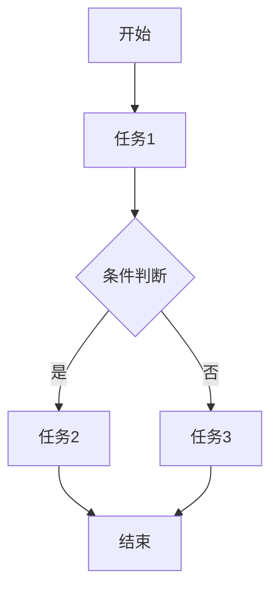

# 工作流架构理论

## 1. 理论概述

工作流架构理论关注业务流程的建模、自动化与优化，是企业级系统和复杂业务场景中的核心架构理论之一。本理论将工作流从工程实现提升为严格的形式化理论体系。

### 1.1 理论基础

- **流程建模理论**：基于Petri网、状态机、BPMN等
- **自动化理论**：基于自动机、规则引擎、调度算法
- **系统集成理论**：基于服务编排、事件驱动、消息中间件

### 1.2 核心目标

- 建立工作流的形式化建模方法
- 提供流程自动化与优化的理论基础
- 支持复杂业务流程的可视化与可追溯
- 实现流程引擎的可扩展与高可用

## 2. 基本概念

### 2.1 工作流定义

```rust
// 工作流结构
pub struct Workflow {
    pub id: String,
    pub name: String,
    pub states: Vec<State>,
    pub transitions: Vec<Transition>,
    pub tasks: Vec<Task>,
    pub triggers: Vec<Trigger>,
    pub context: WorkflowContext,
}

// 状态定义
pub struct State {
    pub id: String,
    pub name: String,
    pub state_type: StateType,
}

pub enum StateType {
    Start,
    Intermediate,
    End,
    Error,
}

// 任务定义
pub struct Task {
    pub id: String,
    pub name: String,
    pub action: TaskAction,
    pub assignee: Option<String>,
    pub dependencies: Vec<String>,
}
```

### 2.2 流程引擎

```rust
// 工作流引擎
pub struct WorkflowEngine {
    pub workflows: HashMap<String, Workflow>,
    pub scheduler: Scheduler,
    pub event_bus: EventBus,
}

impl WorkflowEngine {
    pub fn start_workflow(&mut self, workflow_id: &str) -> Result<(), Error> {
        // 启动工作流
        todo!("实现工作流启动")
    }
    
    pub fn execute_task(&mut self, task_id: &str) -> Result<(), Error> {
        // 执行任务
        todo!("实现任务执行")
    }
    
    pub fn handle_event(&mut self, event: &Event) -> Result<(), Error> {
        // 事件处理
        todo!("实现事件处理")
    }
}
```

## 3. 形式化表示

### 3.1 工作流图



### 3.2 数学表示

工作流可形式化为有向图 $WF = (S, T, E)$，其中：

- $S$ 为状态集合
- $T$ 为任务集合
- $E$ 为转移关系

流程约束：
$$\forall t \in T, \exists s_{in}, s_{out} \in S: (s_{in}, t, s_{out}) \in E$$

## 4. 流程自动化

### 4.1 规则引擎

```rust
// 规则引擎
pub struct RuleEngine {
    pub rules: Vec<Rule>,
    pub context: RuleContext,
}

impl RuleEngine {
    pub fn evaluate(&self, input: &Input) -> Result<Output, Error> {
        // 规则评估
        todo!("实现规则评估")
    }
}
```

### 4.2 事件驱动

```rust
// 事件驱动
pub struct EventBus {
    pub subscribers: HashMap<String, Vec<Subscriber>>,
}

impl EventBus {
    pub fn publish(&self, event: &Event) {
        // 发布事件
        todo!("实现事件发布")
    }
    
    pub fn subscribe(&mut self, event_type: &str, subscriber: Subscriber) {
        // 订阅事件
        todo!("实现事件订阅")
    }
}
```

## 5. 交叉引用

### 5.1 相关理论

- [软件架构理论总论](00-软件架构理论总论.md)
- [分布式架构理论](05-分布式架构理论.md)
- [形式模型理论](../06-形式模型理论/00-形式模型理论总论.md)

### 5.2 实践应用

- [架构设计工具](../08-实践应用开发/04-架构设计工具/README.md)
- [模型检测工具](../08-实践应用开发/05-模型检测工具/README.md)

## 6. 导航

- [返回软件架构理论总论](00-软件架构理论总论.md)
- [设计模式理论](01-设计模式理论.md)
- [微服务架构理论](02-微服务架构理论.md)
- [组件化架构理论](03-组件化架构理论.md)
- [云原生架构理论](04-云原生架构理论.md)
- [分布式架构理论](05-分布式架构理论.md)
- [WebAssembly架构理论](06-WebAssembly架构理论.md)
