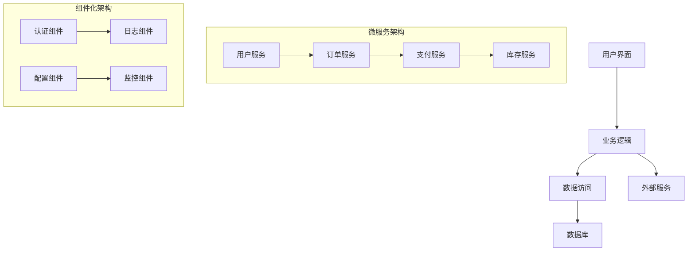
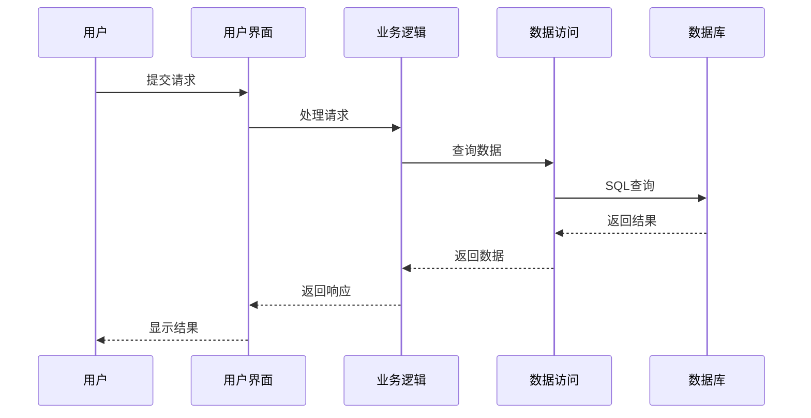

# 00-软件架构理论总论

## 目录

1. [理论概述](#1-理论概述)
2. [软件架构体系架构](#2-软件架构体系架构)
3. [核心概念体系](#3-核心概念体系)
4. [形式化表示](#4-形式化表示)
5. [跨学科整合](#5-跨学科整合)
6. [理论应用](#6-理论应用)
7. [参考文献](#7-参考文献)

## 1. 理论概述

### 1.1 软件架构理论定位

软件架构理论是形式化架构理论的核心应用领域，为整个理论体系提供：

- **设计原则**：软件系统的设计原则和方法论
- **架构模式**：可重用的架构模式和设计模式
- **质量属性**：软件系统的质量属性和评估方法
- **技术栈**：现代软件技术栈和最佳实践
- **工程实践**：软件工程的实践方法和工具

### 1.2 理论特色

本软件架构理论体系具有以下特色：

1. **高度形式化**：使用数学符号、UML图表、代码示例进行精确表达
2. **现代导向**：重点关注微服务、云原生、事件驱动等现代架构
3. **实践导向**：强调实际工程应用和最佳实践
4. **跨技术整合**：整合Rust、Go、Python等多种技术栈
5. **开源生态**：基于开源组件和成熟技术栈

### 1.3 理论目标

- 建立统一的软件架构概念体系
- 提供形式化的架构设计方法
- 支持现代软件系统的构建
- 为软件工程提供理论基础

## 2. 软件架构体系架构

### 2.1 整体架构

```mermaid
graph TB
    A[软件架构理论] --> B[设计模式]
    A --> C[微服务架构]
    A --> D[组件化架构]
    A --> E[工作流架构]
    A --> F[系统架构]
    A --> G[IOT架构]
    
    B --> B1[创建型模式]
    B --> B2[结构型模式]
    B --> B3[行为型模式]
    B --> B4[并发模式]
    B --> B5[分布式模式]
    B --> B6[工作流模式]
    
    C --> C1[服务设计]
    C --> C2[服务通信]
    C --> C3[服务治理]
    C --> C4[可观测性]
    
    D --> D1[组件设计]
    D --> D2[组件通信]
    D --> D3[组件组合]
    D --> D4[组件测试]
    
    E --> E1[工作流引擎]
    E --> E2[状态机]
    E --> E3[任务队列]
    E --> E4[编排与协同]
    
    F --> F1[系统设计]
    F --> F2[系统集成]
    F --> F3[系统测试]
    F --> F4[系统部署]
    
    G --> G1[设备管理]
    G --> G2[数据采集]
    G --> G3[边缘计算]
    G --> G4[云端集成]
```



### 2.2 架构层次

| 层次 | 内容 | 抽象程度 | 关注点 |
|------|------|----------|--------|
| **系统层** | 整体系统架构 | 高 | 系统边界、集成 |
| **服务层** | 微服务架构 | 中高 | 服务设计、通信 |
| **组件层** | 组件化架构 | 中 | 组件设计、组合 |
| **模式层** | 设计模式 | 中低 | 可重用解决方案 |
| **实现层** | 具体实现 | 低 | 代码、技术栈 |

## 3. 核心概念体系

### 3.1 设计模式理论

#### 3.1.1 创建型模式

```rust
// 单例模式
pub struct Singleton {
    data: String,
}

impl Singleton {
    // 使用 once_cell 实现线程安全的单例
    pub fn instance() -> &'static Singleton {
        use once_cell::sync::Lazy;
        static INSTANCE: Lazy<Singleton> = Lazy::new(|| {
            Singleton {
                data: "Singleton Data".to_string(),
            }
        });
        &INSTANCE
    }
    
    pub fn get_data(&self) -> &str {
        &self.data
    }
}

// 工厂方法模式
pub trait Product {
    fn operation(&self) -> String;
}

pub struct ConcreteProductA;
pub struct ConcreteProductB;

impl Product for ConcreteProductA {
    fn operation(&self) -> String {
        "ConcreteProductA operation".to_string()
    }
}

impl Product for ConcreteProductB {
    fn operation(&self) -> String {
        "ConcreteProductB operation".to_string()
    }
}

pub trait Creator {
    fn factory_method(&self) -> Box<dyn Product>;
}

pub struct ConcreteCreatorA;
pub struct ConcreteCreatorB;

impl Creator for ConcreteCreatorA {
    fn factory_method(&self) -> Box<dyn Product> {
        Box::new(ConcreteProductA)
    }
}

impl Creator for ConcreteCreatorB {
    fn factory_method(&self) -> Box<dyn Product> {
        Box::new(ConcreteProductB)
    }
}

// 抽象工厂模式
pub trait AbstractFactory {
    fn create_product_a(&self) -> Box<dyn ProductA>;
    fn create_product_b(&self) -> Box<dyn ProductB>;
}

pub trait ProductA {
    fn operation_a(&self) -> String;
}

pub trait ProductB {
    fn operation_b(&self) -> String;
}

pub struct ConcreteFactory1;
pub struct ConcreteFactory2;

impl AbstractFactory for ConcreteFactory1 {
    fn create_product_a(&self) -> Box<dyn ProductA> {
        Box::new(ConcreteProductA1)
    }
    
    fn create_product_b(&self) -> Box<dyn ProductB> {
        Box::new(ConcreteProductB1)
    }
}

impl AbstractFactory for ConcreteFactory2 {
    fn create_product_a(&self) -> Box<dyn ProductA> {
        Box::new(ConcreteProductA2)
    }
    
    fn create_product_b(&self) -> Box<dyn ProductB> {
        Box::new(ConcreteProductB2)
    }
}
```

#### 3.1.2 结构型模式

```rust
// 适配器模式
pub trait Target {
    fn request(&self) -> String;
}

pub struct Adaptee {
    specific_request: String,
}

impl Adaptee {
    pub fn new() -> Self {
        Adaptee {
            specific_request: "Specific request".to_string(),
        }
    }
    
    pub fn specific_request(&self) -> String {
        self.specific_request.clone()
    }
}

pub struct Adapter {
    adaptee: Adaptee,
}

impl Adapter {
    pub fn new(adaptee: Adaptee) -> Self {
        Adapter { adaptee }
    }
}

impl Target for Adapter {
    fn request(&self) -> String {
        format!("Adapter: {}", self.adaptee.specific_request())
    }
}

// 装饰器模式
pub trait Component {
    fn operation(&self) -> String;
}

pub struct ConcreteComponent;

impl Component for ConcreteComponent {
    fn operation(&self) -> String {
        "ConcreteComponent".to_string()
    }
}

pub struct Decorator {
    component: Box<dyn Component>,
}

impl Decorator {
    pub fn new(component: Box<dyn Component>) -> Self {
        Decorator { component }
    }
}

impl Component for Decorator {
    fn operation(&self) -> String {
        format!("Decorator({})", self.component.operation())
    }
}

// 代理模式
pub trait Subject {
    fn request(&self) -> String;
}

pub struct RealSubject;

impl Subject for RealSubject {
    fn request(&self) -> String {
        "RealSubject request".to_string()
    }
}

pub struct Proxy {
    real_subject: Option<RealSubject>,
}

impl Proxy {
    pub fn new() -> Self {
        Proxy { real_subject: None }
    }
}

impl Subject for Proxy {
    fn request(&self) -> String {
        if self.real_subject.is_none() {
            // 延迟初始化
            return "Proxy: Initializing...".to_string();
        }
        format!("Proxy: {}", self.real_subject.as_ref().unwrap().request())
    }
}
```

#### 3.1.3 行为型模式

```rust
// 观察者模式
use std::collections::HashMap;
use std::sync::{Arc, Mutex};

pub trait Observer {
    fn update(&self, subject: &Subject);
}

pub trait Subject {
    fn attach(&mut self, observer: Arc<dyn Observer>);
    fn detach(&mut self, observer: Arc<dyn Observer>);
    fn notify(&self);
    fn get_state(&self) -> String;
}

pub struct ConcreteSubject {
    observers: Vec<Arc<dyn Observer>>,
    state: String,
}

impl ConcreteSubject {
    pub fn new() -> Self {
        ConcreteSubject {
            observers: Vec::new(),
            state: "Initial state".to_string(),
        }
    }
    
    pub fn set_state(&mut self, state: String) {
        self.state = state;
        self.notify();
    }
}

impl Subject for ConcreteSubject {
    fn attach(&mut self, observer: Arc<dyn Observer>) {
        self.observers.push(observer);
    }
    
    fn detach(&mut self, observer: Arc<dyn Observer>) {
        // 实现移除观察者的逻辑
    }
    
    fn notify(&self) {
        for observer in &self.observers {
            observer.update(self);
        }
    }
    
    fn get_state(&self) -> String {
        self.state.clone()
    }
}

// 策略模式
pub trait Strategy {
    fn algorithm(&self) -> String;
}

pub struct ConcreteStrategyA;
pub struct ConcreteStrategyB;

impl Strategy for ConcreteStrategyA {
    fn algorithm(&self) -> String {
        "Strategy A".to_string()
    }
}

impl Strategy for ConcreteStrategyB {
    fn algorithm(&self) -> String {
        "Strategy B".to_string()
    }
}

pub struct Context {
    strategy: Box<dyn Strategy>,
}

impl Context {
    pub fn new(strategy: Box<dyn Strategy>) -> Self {
        Context { strategy }
    }
    
    pub fn execute_strategy(&self) -> String {
        self.strategy.algorithm()
    }
    
    pub fn set_strategy(&mut self, strategy: Box<dyn Strategy>) {
        self.strategy = strategy;
    }
}
```

### 3.2 微服务架构理论

#### 3.2.1 服务设计原则

```rust
// 微服务定义
pub struct Microservice {
    id: String,
    name: String,
    version: String,
    endpoints: Vec<Endpoint>,
    dependencies: Vec<ServiceDependency>,
    configuration: ServiceConfiguration,
}

// 服务端点
pub struct Endpoint {
    path: String,
    method: HttpMethod,
    request_schema: Option<JsonSchema>,
    response_schema: Option<JsonSchema>,
    authentication: AuthenticationType,
    rate_limiting: Option<RateLimit>,
}

// 服务依赖
pub struct ServiceDependency {
    service_id: String,
    dependency_type: DependencyType,
    health_check: HealthCheck,
    circuit_breaker: Option<CircuitBreaker>,
}

// 服务配置
pub struct ServiceConfiguration {
    environment: Environment,
    resources: ResourceLimits,
    scaling: ScalingPolicy,
    monitoring: MonitoringConfig,
}

// 服务注册与发现
pub trait ServiceRegistry {
    fn register(&self, service: &Microservice) -> Result<(), RegistryError>;
    fn deregister(&self, service_id: &str) -> Result<(), RegistryError>;
    fn discover(&self, service_name: &str) -> Result<Vec<Microservice>, RegistryError>;
    fn health_check(&self, service_id: &str) -> Result<HealthStatus, RegistryError>;
}

// 服务网格
pub struct ServiceMesh {
    proxy: Proxy,
    control_plane: ControlPlane,
    data_plane: DataPlane,
}

pub struct Proxy {
    inbound: InboundTraffic,
    outbound: OutboundTraffic,
    policies: Vec<TrafficPolicy>,
}

pub struct ControlPlane {
    service_discovery: ServiceDiscovery,
    traffic_management: TrafficManagement,
    security: SecurityPolicy,
    observability: ObservabilityConfig,
}
```

#### 3.2.2 服务通信模式

```rust
// 同步通信
pub trait SyncCommunication {
    fn request(&self, request: Request) -> Result<Response, CommunicationError>;
    fn request_with_timeout(&self, request: Request, timeout: Duration) -> Result<Response, CommunicationError>;
}

// 异步通信
pub trait AsyncCommunication {
    fn send(&self, message: Message) -> Result<(), CommunicationError>;
    fn receive(&self) -> Result<Message, CommunicationError>;
    fn subscribe(&self, topic: &str) -> Result<Subscription, CommunicationError>;
}

// 消息队列
pub struct MessageQueue {
    queue_name: String,
    message_type: MessageType,
    persistence: PersistenceConfig,
    delivery_guarantee: DeliveryGuarantee,
}

// 事件驱动架构
pub struct EventBus {
    topics: HashMap<String, Vec<EventHandler>>,
    event_store: EventStore,
    event_sourcing: EventSourcingConfig,
}

pub struct Event {
    id: String,
    type_name: String,
    data: serde_json::Value,
    timestamp: DateTime<Utc>,
    version: u64,
}

pub trait EventHandler {
    fn handle(&self, event: &Event) -> Result<(), EventHandlingError>;
}
```

### 3.3 组件化架构理论

#### 3.3.1 组件设计

```rust
// 组件定义
pub trait Component {
    fn id(&self) -> &str;
    fn name(&self) -> &str;
    fn version(&self) -> &str;
    fn interfaces(&self) -> Vec<Interface>;
    fn lifecycle(&self) -> ComponentLifecycle;
}

// 组件接口
pub struct Interface {
    name: String,
    methods: Vec<Method>,
    events: Vec<Event>,
    properties: Vec<Property>,
}

// 组件生命周期
pub struct ComponentLifecycle {
    initialization: InitializationPhase,
    running: RunningPhase,
    shutdown: ShutdownPhase,
}

// 组件容器
pub struct ComponentContainer {
    components: HashMap<String, Box<dyn Component>>,
    dependencies: DependencyGraph,
    lifecycle_manager: LifecycleManager,
}

impl ComponentContainer {
    pub fn new() -> Self {
        ComponentContainer {
            components: HashMap::new(),
            dependencies: DependencyGraph::new(),
            lifecycle_manager: LifecycleManager::new(),
        }
    }
    
    pub fn register_component(&mut self, component: Box<dyn Component>) -> Result<(), ContainerError> {
        let id = component.id().to_string();
        self.components.insert(id.clone(), component);
        self.lifecycle_manager.initialize_component(&id)?;
        Ok(())
    }
    
    pub fn get_component(&self, id: &str) -> Option<&Box<dyn Component>> {
        self.components.get(id)
    }
    
    pub fn start_all(&mut self) -> Result<(), ContainerError> {
        self.lifecycle_manager.start_all(&self.components)
    }
    
    pub fn stop_all(&mut self) -> Result<(), ContainerError> {
        self.lifecycle_manager.stop_all(&self.components)
    }
}
```

#### 3.3.2 组件通信

```rust
// 组件通信协议
pub trait ComponentCommunication {
    fn send_message(&self, target: &str, message: Message) -> Result<(), CommunicationError>;
    fn broadcast(&self, message: Message) -> Result<(), CommunicationError>;
    fn subscribe(&self, topic: &str, handler: MessageHandler) -> Result<Subscription, CommunicationError>;
}

// 消息定义
pub struct Message {
    id: String,
    source: String,
    target: String,
    content: MessageContent,
    timestamp: DateTime<Utc>,
    priority: Priority,
}

// 消息处理器
pub type MessageHandler = Box<dyn Fn(&Message) -> Result<(), MessageHandlingError> + Send + Sync>;

// 组件总线
pub struct ComponentBus {
    subscribers: HashMap<String, Vec<MessageHandler>>,
    message_queue: VecDeque<Message>,
    routing_table: RoutingTable,
}

impl ComponentBus {
    pub fn new() -> Self {
        ComponentBus {
            subscribers: HashMap::new(),
            message_queue: VecDeque::new(),
            routing_table: RoutingTable::new(),
        }
    }
    
    pub fn publish(&mut self, message: Message) -> Result<(), BusError> {
        if let Some(handlers) = self.subscribers.get(&message.target) {
            for handler in handlers {
                handler(&message)?;
            }
        }
        Ok(())
    }
    
    pub fn subscribe(&mut self, topic: String, handler: MessageHandler) {
        self.subscribers.entry(topic).or_insert_with(Vec::new).push(handler);
    }
}
```

### 3.4 工作流架构理论

#### 3.4.1 工作流引擎

```rust
// 工作流定义
pub struct Workflow {
    id: String,
    name: String,
    version: String,
    steps: Vec<WorkflowStep>,
    transitions: Vec<Transition>,
    variables: HashMap<String, Variable>,
}

// 工作流步骤
pub struct WorkflowStep {
    id: String,
    name: String,
    step_type: StepType,
    action: Box<dyn Action>,
    conditions: Vec<Condition>,
    timeout: Option<Duration>,
}

// 步骤类型
pub enum StepType {
    Task,
    Decision,
    Parallel,
    Subworkflow,
    Wait,
    Event,
}

// 工作流引擎
pub struct WorkflowEngine {
    workflows: HashMap<String, Workflow>,
    executions: HashMap<String, WorkflowExecution>,
    state_store: StateStore,
    event_bus: EventBus,
}

impl WorkflowEngine {
    pub fn new() -> Self {
        WorkflowEngine {
            workflows: HashMap::new(),
            executions: HashMap::new(),
            state_store: StateStore::new(),
            event_bus: EventBus::new(),
        }
    }
    
    pub fn register_workflow(&mut self, workflow: Workflow) {
        self.workflows.insert(workflow.id.clone(), workflow);
    }
    
    pub fn start_execution(&mut self, workflow_id: &str, input: WorkflowInput) -> Result<String, EngineError> {
        let workflow = self.workflows.get(workflow_id)
            .ok_or(EngineError::WorkflowNotFound)?;
        
        let execution_id = generate_execution_id();
        let execution = WorkflowExecution::new(execution_id.clone(), workflow.clone(), input);
        
        self.executions.insert(execution_id.clone(), execution);
        self.execute_next_step(&execution_id)?;
        
        Ok(execution_id)
    }
    
    pub fn execute_next_step(&mut self, execution_id: &str) -> Result<(), EngineError> {
        let execution = self.executions.get_mut(execution_id)
            .ok_or(EngineError::ExecutionNotFound)?;
        
        if let Some(current_step) = execution.get_current_step() {
            let result = current_step.action.execute(&execution.context)?;
            execution.update_step_result(current_step.id.clone(), result)?;
            
            if let Some(next_step) = execution.get_next_step() {
                execution.set_current_step(next_step);
            } else {
                execution.complete()?;
            }
        }
        
        Ok(())
    }
}
```

#### 3.4.2 状态机

```rust
// 状态机定义
pub struct StateMachine {
    id: String,
    name: String,
    states: Vec<State>,
    transitions: Vec<Transition>,
    initial_state: String,
    final_states: Vec<String>,
}

// 状态
pub struct State {
    id: String,
    name: String,
    entry_actions: Vec<Box<dyn Action>>,
    exit_actions: Vec<Box<dyn Action>>,
    internal_transitions: Vec<InternalTransition>,
}

// 转换
pub struct Transition {
    id: String,
    from_state: String,
    to_state: String,
    event: Option<String>,
    condition: Option<Box<dyn Condition>>,
    actions: Vec<Box<dyn Action>>,
}

// 状态机执行器
pub struct StateMachineExecutor {
    state_machine: StateMachine,
    current_state: String,
    context: ExecutionContext,
    event_queue: VecDeque<Event>,
}

impl StateMachineExecutor {
    pub fn new(state_machine: StateMachine) -> Self {
        let initial_state = state_machine.initial_state.clone();
        StateMachineExecutor {
            state_machine,
            current_state: initial_state,
            context: ExecutionContext::new(),
            event_queue: VecDeque::new(),
        }
    }
    
    pub fn send_event(&mut self, event: Event) -> Result<(), ExecutionError> {
        self.event_queue.push_back(event);
        self.process_events()?;
        Ok(())
    }
    
    pub fn process_events(&mut self) -> Result<(), ExecutionError> {
        while let Some(event) = self.event_queue.pop_front() {
            self.process_event(event)?;
        }
        Ok(())
    }
    
    pub fn process_event(&mut self, event: Event) -> Result<(), ExecutionError> {
        let current_state = self.state_machine.states.iter()
            .find(|s| s.id == self.current_state)
            .ok_or(ExecutionError::StateNotFound)?;
        
        // 查找匹配的转换
        for transition in &self.state_machine.transitions {
            if transition.from_state == self.current_state && 
               transition.event.as_ref() == Some(&event.name) {
                
                // 检查条件
                if let Some(condition) = &transition.condition {
                    if !condition.evaluate(&self.context)? {
                        continue;
                    }
                }
                
                // 执行转换
                self.execute_transition(transition)?;
                break;
            }
        }
        
        Ok(())
    }
    
    pub fn execute_transition(&mut self, transition: &Transition) -> Result<(), ExecutionError> {
        // 执行退出动作
        let current_state = self.state_machine.states.iter()
            .find(|s| s.id == self.current_state)
            .ok_or(ExecutionError::StateNotFound)?;
        
        for action in &current_state.exit_actions {
            action.execute(&mut self.context)?;
        }
        
        // 执行转换动作
        for action in &transition.actions {
            action.execute(&mut self.context)?;
        }
        
        // 更新状态
        self.current_state = transition.to_state.clone();
        
        // 执行进入动作
        let new_state = self.state_machine.states.iter()
            .find(|s| s.id == self.current_state)
            .ok_or(ExecutionError::StateNotFound)?;
        
        for action in &new_state.entry_actions {
            action.execute(&mut self.context)?;
        }
        
        Ok(())
    }
}
```

## 4. 形式化表示

### 4.1 架构描述语言

#### 4.1.1 组件图



#### 4.1.2 序列图



### 4.2 数学符号系统

#### 4.2.1 架构组件符号

- $C = \{c_1, c_2, \ldots, c_n\}$ : 组件集合
- $I = \{i_1, i_2, \ldots, i_m\}$ : 接口集合
- $D = \{(c_i, c_j) \mid c_i, c_j \in C\}$ : 依赖关系
- $M = \{m_1, m_2, \ldots, m_k\}$ : 消息集合

#### 4.2.2 服务质量符号

- $R(t)$ : 可靠性函数
- $A(t)$ : 可用性函数
- $P(t)$ : 性能函数
- $S(t)$ : 安全性函数

#### 4.2.3 架构模式符号

- $\text{Pattern}(C, I, D, M)$ : 架构模式
- $\text{Microservice}(S, C, G)$ : 微服务架构
- $\text{Component}(C, I, L)$ : 组件化架构
- $\text{Workflow}(S, T, E)$ : 工作流架构

### 4.3 形式化公理

#### 4.3.1 架构设计公理

**单一职责公理**：
$$\forall c \in C: \text{responsibility}(c) = 1$$

**开闭原则公理**：
$$\forall c \in C: \text{open}(c) \land \text{closed}(c)$$

**依赖倒置公理**：
$$\forall d \in D: \text{abstract}(d) \rightarrow \text{concrete}(d)$$

#### 4.3.2 服务质量公理

**可靠性公理**：
$$R(t) = \exp(-\lambda t)$$

**可用性公理**：
$$A = \frac{MTTF}{MTTF + MTTR}$$

**性能公理**：
$$P(t) = \frac{1}{1 + \alpha t}$$

## 5. 跨学科整合

### 5.1 与系统理论的整合

#### 5.1.1 系统思维

软件架构理论与系统理论的整合：

1. **整体性**：系统整体大于部分之和
2. **层次性**：系统的层次结构
3. **涌现性**：系统层面的涌现性质
4. **反馈性**：系统的反馈机制

#### 5.1.2 控制理论

与控制理论的整合：

1. **状态反馈**：系统状态的控制
2. **稳定性**：系统的稳定性分析
3. **鲁棒性**：系统的鲁棒性设计
4. **自适应**：系统的自适应控制

### 5.2 与信息论的整合

#### 5.2.1 信息流

与信息论的整合：

1. **信息熵**：系统信息的不确定性
2. **信道容量**：通信信道的容量
3. **编码理论**：信息的编码和解码
4. **信息流**：系统中的信息流动

#### 5.2.2 通信理论

与通信理论的整合：

1. **协议设计**：通信协议的设计
2. **网络拓扑**：网络拓扑结构
3. **路由算法**：信息路由算法
4. **拥塞控制**：网络拥塞控制

### 5.3 与认知科学的整合

#### 5.3.1 认知架构

与认知科学的整合：

1. **认知模型**：人类认知的模型
2. **学习理论**：学习过程的理论
3. **决策理论**：决策过程的理论
4. **注意力机制**：注意力分配机制

#### 5.3.2 人机交互

与人机交互的整合：

1. **用户体验**：用户体验设计
2. **界面设计**：用户界面设计
3. **交互模式**：人机交互模式
4. **可用性**：系统可用性设计

## 6. 理论应用

### 6.1 企业应用

#### 6.1.1 企业架构

软件架构理论在企业架构中的应用：

1. **业务架构**：业务过程的架构设计
2. **应用架构**：应用系统的架构设计
3. **技术架构**：技术基础设施的架构设计
4. **数据架构**：数据管理的架构设计

#### 6.1.2 数字化转型

在数字化转型中的应用：

1. **微服务化**：传统系统的微服务改造
2. **云原生**：云原生架构的采用
3. **DevOps**：DevOps实践的推广
4. **数据驱动**：数据驱动的决策支持

### 6.2 互联网应用

#### 6.2.1 大规模系统

软件架构理论在大规模系统中的应用：

1. **分布式系统**：分布式系统的设计
2. **高可用性**：高可用性系统的设计
3. **可扩展性**：可扩展性系统的设计
4. **容错性**：容错性系统的设计

#### 6.2.2 实时系统

在实时系统中的应用：

1. **实时处理**：实时数据处理
2. **流式计算**：流式计算架构
3. **事件驱动**：事件驱动架构
4. **响应时间**：响应时间优化

### 6.3 物联网应用

#### 6.3.1 边缘计算

软件架构理论在边缘计算中的应用：

1. **边缘节点**：边缘节点的设计
2. **边缘智能**：边缘智能的实现
3. **边缘存储**：边缘存储的设计
4. **边缘安全**：边缘安全的保障

#### 6.3.2 设备管理

在设备管理中的应用：

1. **设备注册**：设备的注册和管理
2. **设备监控**：设备的监控和维护
3. **固件更新**：固件的远程更新
4. **设备安全**：设备的安全保护

## 7. 参考文献

### 7.1 经典文献

1. Gamma, E., Helm, R., Johnson, R., Vlissides, J. *Design Patterns: Elements of Reusable Object-Oriented Software*.
2. Fowler, M. *Patterns of Enterprise Application Architecture*.
3. Hohpe, G., Woolf, B. *Enterprise Integration Patterns*.
4. Buschmann, F., Meunier, R., Rohnert, H., Sommerlad, P., Stal, M. *Pattern-Oriented Software Architecture*.

### 7.2 现代文献

1. Newman, S. *Building Microservices*.
2. Richardson, C. *Microservices Patterns*.
3. Evans, E. *Domain-Driven Design*.
4. Vernon, V. *Implementing Domain-Driven Design*.

### 7.3 技术文献

1. Fielding, R.T. *Architectural Styles and the Design of Network-based Software Architectures*.
2. Bass, L., Clements, P., Kazman, R. *Software Architecture in Practice*.
3. Rozanski, N., Woods, E. *Software Systems Architecture*.
4. Gorton, I. *Essential Software Architecture*.

---

**文件**: `00-软件架构理论总论.md`  
**版本**: v60  
**创建时间**: 2024年  
**最后更新**: 2024年当前时间  
**相关文件**:

- [01-设计模式理论](01-设计模式理论.md)
- [02-微服务架构理论](02-微服务架构理论.md)
- [03-组件化架构理论](03-组件化架构理论.md)
- [04-工作流架构理论](04-工作流架构理论.md)
- [05-系统架构理论](05-系统架构理论.md)
