# 软件架构理论体系-主题树形目录

1. [软件架构理论统一总论](00-软件架构理论统一总论.md)
2. [架构模式理论](01-架构模式理论.md)
   2.1 [设计模式详解](01a-设计模式详解.md)
3. [组件理论](02-组件理论.md)
   3.1 [认证授权组件化架构深度解析](02a-认证授权组件化架构深度解析.md)
4. [接口理论](03-接口理论.md)
5. [分层与云原生架构理论](04-分层与云原生架构理论.md)
   5.1 [分层架构理论](04-分层架构理论.md)
   5.2 [云原生架构理论](04-云原生架构理论.md)
6. [微服务与WebAssembly架构理论](06-微服务与WebAssembly架构理论.md)
   6.1 [微服务架构理论](06-微服务架构理论.md)
   6.2 [WebAssembly架构理论](06-WebAssembly架构理论.md)
7. [架构评估与工作流理论](07-架构评估与工作流理论.md)
   7.1 [架构评估理论](07-架构评估理论.md)
   7.2 [工作流架构理论](07-工作流架构理论.md)
   7.3 [控制理论基础](07-控制理论基础.md)
8. [事件驱动架构理论](08-事件驱动架构理论.md)
9. [安全架构理论](09-安全架构理论.md)
10. [AI驱动软件工程前沿专题](10-AI驱动软件工程前沿专题.md)
11. [量子计算架构前沿专题](11-量子计算架构前沿专题.md)
12. [区块链安全前沿专题](12-区块链安全前沿专题.md)

---

## 软件架构理论统一总论

### 统一定义

- 依据：Analysis/00-统一术语与定义规范.md (2025-09-09)
- 首选术语：软件架构
- 统一锚点：#软件架构-software-architecture
- 说明：如与本文局部用法存在差异，请以统一规范为准并在本文保留差异说明。

> **合并声明**: 本文档已吸收 [06-软件架构理论体系](../06-软件架构理论体系/README.md) 的所有创新内容，成为软件架构理论的唯一权威文件。

## 目录

- [软件架构理论体系-主题树形目录](#软件架构理论体系-主题树形目录)
  - [软件架构理论统一总论](#软件架构理论统一总论)
    - [统一定义](#统一定义)
  - [目录](#目录)
  - [1. 理论概述](#1-理论概述)
    - [1.1 软件架构理论定位](#11-软件架构理论定位)
    - [1.2 定义与范畴](#12-定义与范畴)
    - [1.3 理论体系结构](#13-理论体系结构)
    - [1.4 理论特色](#14-理论特色)
    - [1.5 理论目标](#15-理论目标)
  - [2. 软件架构体系架构](#2-软件架构体系架构)
    - [2.1 整体架构](#21-整体架构)
    - [2.2 架构层次](#22-架构层次)
    - [2.3 架构风格](#23-架构风格)
  - [3. 核心概念体系](#3-核心概念体系)
    - [3.1 架构元素](#31-架构元素)
    - [3.2 设计模式理论](#32-设计模式理论)
      - [3.2.1 创建型模式](#321-创建型模式)
      - [3.2.2 结构型模式](#322-结构型模式)
      - [3.2.3 行为型模式](#323-行为型模式)
    - [3.3 架构设计原则](#33-架构设计原则)
  - [4. 形式化表示](#4-形式化表示)
    - [4.1 基础架构组件（Rust）](#41-基础架构组件rust)
    - [4.2 微服务架构实现（Go）](#42-微服务架构实现go)
  - [5. 跨学科整合](#5-跨学科整合)
    - [5.1 与哲学理论的整合](#51-与哲学理论的整合)
      - [5.1.1 本体论整合](#511-本体论整合)
      - [5.1.2 认识论整合](#512-认识论整合)
    - [5.2 与数学理论的整合](#52-与数学理论的整合)
      - [5.2.1 集合论整合](#521-集合论整合)
      - [5.2.2 图论整合](#522-图论整合)
    - [5.3 与形式语言理论的整合](#53-与形式语言理论的整合)
      - [5.3.1 架构描述语言](#531-架构描述语言)
      - [5.3.2 语义分析](#532-语义分析)
  - [6. 理论应用](#6-理论应用)
    - [6.1 质量属性](#61-质量属性)
    - [6.2 架构评估](#62-架构评估)
      - [6.2.1 ATAM方法](#621-atam方法)
      - [6.2.2 CBAM方法](#622-cbam方法)
    - [6.3 实际应用案例](#63-实际应用案例)
      - [6.3.1 电商系统架构](#631-电商系统架构)
      - [6.3.2 微服务架构](#632-微服务架构)
  - [7. 发展趋势](#7-发展趋势)
    - [7.1 技术发展趋势](#71-技术发展趋势)
      - [7.1.1 云原生架构](#711-云原生架构)
      - [7.1.2 事件驱动架构](#712-事件驱动架构)
      - [7.1.3 AI驱动的架构](#713-ai驱动的架构)
    - [7.2 理论发展趋势](#72-理论发展趋势)
      - [7.2.1 形式化方法](#721-形式化方法)
      - [7.2.2 可观测性](#722-可观测性)
    - [7.3 应用发展趋势](#73-应用发展趋势)
      - [7.3.1 领域特定架构](#731-领域特定架构)
      - [7.3.2 绿色计算](#732-绿色计算)
  - [8. 总结](#8-总结)
  - [关键理论与工具分支交叉索引](#关键理论与工具分支交叉索引)
    - [任务产物](#任务产物)
    - [统一术语参考](#统一术语参考)
  - [2025 对齐](#2025-对齐)

## 1. 理论概述

### 1.1 软件架构理论定位

软件架构（Architecture）：

- **设计原则**：软件系统的设计原则和方法论
- **架构（Architecture）：可重用的架构模式和设计模式
- **质量属性**：软件系统的质量属性和评估方法
- **技术栈**：现代软件技术栈和最佳实践
- **工程实践**：软件工程的实践方法和工具

### 1.2 定义与范畴

软件架构理论体系是研究软件系统结构、组织原则和设计模式的系统性理论框架。它涵盖了从微观组件设计到宏观系统集成的各个层面。

**形式化定义：**

设 $S$ 为软件系统，$A$ 为架构（Architecture）：
$$A = (C, R, P, M)$$

其中：

- $C = \{c_1, c_2, ..., c_n\}$ 为组件集合
- $R = \{r_1, r_2, ..., r_m\}$ 为关系集合
- $P = \{p_1, p_2, ..., p_k\}$ 为属性集合
- $M = \{m_1, m_2, ..., m_l\}$ 为约束集合

### 1.3 理论体系结构

软件架构（Architecture）：

1. **架构模式理论** - 经典设计模式的形式化
2. **组件理论** - 组件设计与组合原理
3. **接口理论** - 接口设计与契约理论
4. **分层架构理论** - 层次化组织原理
5. **分布式架构理论** - 分布式系统设计
6. **微服务架构理论** - 微服务设计模式
7. **架构评估理论** - 质量属性与评估方法

### 1.4 理论特色

本软件架构（Architecture）：

1. **高度形式化**：使用数学符号、UML图表、代码示例进行精确表达
2. **现代导向**：重点关注微服务、云原生、事件驱动等现代架构
3. **实践导向**：强调实际工程应用和最佳实践
4. **跨技术整合**：整合Rust、Go、Python等多种技术栈
5. **开源生态**：基于开源组件和成熟技术栈

### 1.5 理论目标

- 建立统一的软件架构概念体系
- 提供形式化的架构设计方法
- 支持现代软件系统的构建
- 为软件工程提供理论基础

## 2. 软件架构体系架构

### 2.1 整体架构

```mermaid
graph TB
    A[软件架构理论] --> B[设计模式]
    A --> C[微服务架构]
    A --> D[组件化架构]
    A --> E[工作流架构]
    A --> F[系统架构]
    A --> G[IOT架构]
    
    B --> B1[创建型模式]
    B --> B2[结构型模式]
    B --> B3[行为型模式]
    B --> B4[并发模式]
    B --> B5[分布式模式]
    B --> B6[工作流模式]
    
    C --> C1[服务设计]
    C --> C2[服务通信]
    C --> C3[服务治理]
    C --> C4[可观测性]
    
    D --> D1[组件设计]
    D --> D2[组件通信]
    D --> D3[组件组合]
    D --> D4[组件测试]
    
    E --> E1[工作流引擎]
    E --> E2[状态机]
    E --> E3[任务队列]
    E --> E4[编排与协同]
    
    F --> F1[系统设计]
    F --> F2[系统集成]
    F --> F3[系统测试]
    F --> F4[系统部署]
    
    G --> G1[设备管理]
    G --> G2[数据采集]
    G --> G3[边缘计算]
    G --> G4[云端集成]
```



### 2.2 架构层次

| 层次 | 内容 | 抽象程度 | 关注点 |
|------|------|----------|--------|
| **系统层** | 整体系统架构 | 高 | 系统边界、集成 |
| **服务层** | 微服务架构 | 中高 | 服务设计、通信 |
| **组件层** | 组件化架构 | 中 | 组件设计、组合 |
| **模式层** | 设计模式 | 中低 | 可重用解决方案 |
| **实现层** | 具体实现 | 低 | 代码、技术栈 |

### 2.3 架构风格

**定义：** 架构风格是描述系统组织方式的抽象模式。

**形式化表示：**
$$Style = (E, C, V, I)$$

其中：

- $E$ 为元素类型
- $C$ 为连接方式
- $V$ 为约束条件
- $I$ 为不变性

## 3. 核心概念体系

### 3.1 架构元素

**组件（Component）：**
$$C_i = (I_i, O_i, S_i, B_i)$$

其中：

- $I_i$ 为输入接口
- $O_i$ 为输出接口
- $S_i$ 为状态空间
- $B_i$ 为行为规范

**连接器（Connector）：**
$$Conn_{ij} = (P_i, P_j, T, Q)$$

其中：

- $P_i, P_j$ 为连接点
- $T$ 为传输协议
- $Q$ 为质量属性

### 3.2 设计模式理论

#### 3.2.1 创建型模式

```rust
// 单例模式
pub struct Singleton {
    data: String,
}

impl Singleton {
    // 使用 once_cell 实现线程安全的单例
    pub fn instance() -> &'static Singleton {
        use once_cell::sync::Lazy;
        static INSTANCE: Lazy<Singleton> = Lazy::new(|| {
            Singleton {
                data: "Singleton Data".to_string(),
            }
        });
        &INSTANCE
    }
    
    pub fn get_data(&self) -> &str {
        &self.data
    }
}

// 工厂方法模式
pub trait Product {
    fn operation(&self) -> String;
}

pub struct ConcreteProductA;
pub struct ConcreteProductB;

impl Product for ConcreteProductA {
    fn operation(&self) -> String {
        "ConcreteProductA operation".to_string()
    }
}

impl Product for ConcreteProductB {
    fn operation(&self) -> String {
        "ConcreteProductB operation".to_string()
    }
}

pub trait Creator {
    fn factory_method(&self) -> Box<dyn Product>;
}

pub struct ConcreteCreatorA;
pub struct ConcreteCreatorB;

impl Creator for ConcreteCreatorA {
    fn factory_method(&self) -> Box<dyn Product> {
        Box::new(ConcreteProductA)
    }
}

impl Creator for ConcreteCreatorB {
    fn factory_method(&self) -> Box<dyn Product> {
        Box::new(ConcreteProductB)
    }
}

// 抽象工厂模式
pub trait AbstractFactory {
    fn create_product_a(&self) -> Box<dyn ProductA>;
    fn create_product_b(&self) -> Box<dyn ProductB>;
}

pub trait ProductA {
    fn operation_a(&self) -> String;
}

pub trait ProductB {
    fn operation_b(&self) -> String;
}

pub struct ConcreteFactory1;
pub struct ConcreteFactory2;

impl AbstractFactory for ConcreteFactory1 {
    fn create_product_a(&self) -> Box<dyn ProductA> {
        Box::new(ConcreteProductA1)
    }
    
    fn create_product_b(&self) -> Box<dyn ProductB> {
        Box::new(ConcreteProductB1)
    }
}

impl AbstractFactory for ConcreteFactory2 {
    fn create_product_a(&self) -> Box<dyn ProductA> {
        Box::new(ConcreteProductA2)
    }
    
    fn create_product_b(&self) -> Box<dyn ProductB> {
        Box::new(ConcreteProductB2)
    }
}
```

#### 3.2.2 结构型模式

```rust
// 适配器模式
pub trait Target {
    fn request(&self) -> String;
}

pub struct Adaptee {
    specific_request: String,
}

impl Adaptee {
    pub fn new() -> Self {
        Adaptee {
            specific_request: "Specific request".to_string(),
        }
    }
    
    pub fn specific_request(&self) -> String {
        self.specific_request.clone()
    }
}

pub struct Adapter {
    adaptee: Adaptee,
}

impl Adapter {
    pub fn new(adaptee: Adaptee) -> Self {
        Adapter { adaptee }
    }
}

impl Target for Adapter {
    fn request(&self) -> String {
        format!("Adapter: {}", self.adaptee.specific_request())
    }
}

// 装饰器模式
pub trait Component {
    fn operation(&self) -> String;
}

pub struct ConcreteComponent;

impl Component for ConcreteComponent {
    fn operation(&self) -> String {
        "ConcreteComponent".to_string()
    }
}

pub struct Decorator {
    component: Box<dyn Component>,
}

impl Decorator {
    pub fn new(component: Box<dyn Component>) -> Self {
        Decorator { component }
    }
}

impl Component for Decorator {
    fn operation(&self) -> String {
        format!("Decorator({})", self.component.operation())
    }
}
```

#### 3.2.3 行为型模式

```rust
// 观察者模式
use std::collections::HashMap;
use std::sync::{Arc, Mutex};

pub trait Observer {
    fn update(&self, subject: &Subject);
}

pub trait Subject {
    fn attach(&mut self, observer: Arc<dyn Observer>);
    fn detach(&mut self, observer: Arc<dyn Observer>);
    fn notify(&self);
}

pub struct ConcreteSubject {
    observers: Arc<Mutex<Vec<Arc<dyn Observer>>>>,
    state: String,
}

impl ConcreteSubject {
    pub fn new() -> Self {
        ConcreteSubject {
            observers: Arc::new(Mutex::new(Vec::new())),
            state: String::new(),
        }
    }
    
    pub fn set_state(&mut self, state: String) {
        self.state = state;
        self.notify();
    }
}

impl Subject for ConcreteSubject {
    fn attach(&mut self, observer: Arc<dyn Observer>) {
        let mut observers = self.observers.lock().unwrap();
        observers.push(observer);
    }
    
    fn detach(&mut self, observer: Arc<dyn Observer>) {
        let mut observers = self.observers.lock().unwrap();
        observers.retain(|obs| !Arc::ptr_eq(obs, &observer));
    }
    
    fn notify(&self) {
        let observers = self.observers.lock().unwrap();
        for observer in observers.iter() {
            observer.update(self);
        }
    }
}

pub struct ConcreteObserver {
    name: String,
}

impl ConcreteObserver {
    pub fn new(name: String) -> Self {
        ConcreteObserver { name }
    }
}

impl Observer for ConcreteObserver {
    fn update(&self, subject: &Subject) {
        println!("Observer {} received update", self.name);
    }
}
```

### 3.3 架构设计原则

**单一职责原则（SRP）：**
$$\forall c \in C: |Responsibility(c)| = 1$$

**开闭原则（OCP）：**
$$\forall c \in C: \text{Open}(c) \land \text{Closed}(c)$$

**依赖倒置原则（DIP）：**
$$High \not\hookleftarrow Low \implies High \hookleftarrow Abstract$$

**里氏替换原则（LSP）：**
$$\forall s \in S: \text{Subtype}(s, p) \implies \text{Substitutable}(s, p)$$

**接口隔离原则（ISP）：**
$$\forall i \in I: |Methods(i)| \leq \text{Minimal}(i)$$

**迪米特法则（LoD）：**
$$\forall o \in O: \text{Knows}(o) \subseteq \text{Immediate}(o)$$

## 4. 形式化表示

### 4.1 基础架构组件（Rust）

```rust
use std::collections::HashMap;
use std::sync::{Arc, Mutex};
use tokio::sync::mpsc;

/// 架构组件基类
pub trait Component {
    fn id(&self) -> &str;
    fn process(&self, input: &str) -> Result<String, Box<dyn std::error::Error>>;
    fn get_state(&self) -> ComponentState;
}

/// 组件状态
#[derive(Debug, Clone)]
pub struct ComponentState {
    pub id: String,
    pub status: ComponentStatus,
    pub metrics: HashMap<String, f64>,
}

#[derive(Debug, Clone)]
pub enum ComponentStatus {
    Active,
    Inactive,
    Error(String),
}

/// 连接器
pub struct Connector {
    pub id: String,
    pub source: String,
    pub target: String,
    pub protocol: Protocol,
    pub quality_attributes: QualityAttributes,
}

#[derive(Debug, Clone)]
pub enum Protocol {
    HTTP,
    gRPC,
    MessageQueue,
    EventStream,
}

/// 质量属性
#[derive(Debug, Clone)]
pub struct QualityAttributes {
    pub reliability: f64,
    pub performance: f64,
    pub security: f64,
    pub scalability: f64,
}

/// 架构管理器
pub struct ArchitectureManager {
    components: Arc<Mutex<HashMap<String, Box<dyn Component>>>>,
    connectors: Arc<Mutex<Vec<Connector>>>,
    event_tx: mpsc::Sender<ArchitectureEvent>,
}

#[derive(Debug)]
pub enum ArchitectureEvent {
    ComponentAdded(String),
    ComponentRemoved(String),
    ConnectionEstablished(String, String),
    QualityAttributeChanged(String, QualityAttributes),
}

impl ArchitectureManager {
    pub fn new() -> (Self, mpsc::Receiver<ArchitectureEvent>) {
        let (event_tx, event_rx) = mpsc::channel(100);
        
        let manager = Self {
            components: Arc::new(Mutex::new(HashMap::new())),
            connectors: Arc::new(Mutex::new(Vec::new())),
            event_tx,
        };
        
        (manager, event_rx)
    }
    
    pub async fn add_component(&self, id: String, component: Box<dyn Component>) {
        let mut components = self.components.lock().unwrap();
        components.insert(id.clone(), component);
        
        let _ = self.event_tx.send(ArchitectureEvent::ComponentAdded(id)).await;
    }
    
    pub async fn connect_components(&self, source: String, target: String, protocol: Protocol) {
        let connector = Connector {
            id: format!("{}-{}", source, target),
            source,
            target,
            protocol,
            quality_attributes: QualityAttributes {
                reliability: 0.99,
                performance: 0.95,
                security: 0.90,
                scalability: 0.85,
            },
        };
        
        let mut connectors = self.connectors.lock().unwrap();
        connectors.push(connector);
        
        let _ = self.event_tx.send(ArchitectureEvent::ConnectionEstablished(source, target)).await;
    }
}
```

### 4.2 微服务架构实现（Go）

```go
package architecture

import (
    "context"
    "encoding/json"
    "fmt"
    "net/http"
    "sync"
    "time"
)

// Service 微服务接口
type Service interface {
    ID() string
    Start(ctx context.Context) error
    Stop(ctx context.Context) error
    Health() HealthStatus
    Process(request interface{}) (interface{}, error)
}

// HealthStatus 健康状态
type HealthStatus struct {
    Status    string    `json:"status"`
    Timestamp time.Time `json:"timestamp"`
    Details   map[string]interface{} `json:"details"`
}

// ServiceRegistry 服务注册中心
type ServiceRegistry struct {
    services map[string]Service
    mutex    sync.RWMutex
}

func NewServiceRegistry() *ServiceRegistry {
    return &ServiceRegistry{
        services: make(map[string]Service),
    }
}

func (sr *ServiceRegistry) Register(service Service) error {
    sr.mutex.Lock()
    defer sr.mutex.Unlock()
    
    sr.services[service.ID()] = service
    return nil
}

func (sr *ServiceRegistry) Get(id string) (Service, bool) {
    sr.mutex.RLock()
    defer sr.mutex.RUnlock()
    
    service, exists := sr.services[id]
    return service, exists
}

func (sr *ServiceRegistry) List() []Service {
    sr.mutex.RLock()
    defer sr.mutex.RUnlock()
    
    services := make([]Service, 0, len(sr.services))
    for _, service := range sr.services {
        services = append(services, service)
    }
    return services
}

// ServiceDiscovery 服务发现
type ServiceDiscovery struct {
    registry *ServiceRegistry
}

func NewServiceDiscovery(registry *ServiceRegistry) *ServiceDiscovery {
    return &ServiceDiscovery{
        registry: registry,
    }
}

func (sd *ServiceDiscovery) Discover(serviceID string) (Service, error) {
    service, exists := sd.registry.Get(serviceID)
    if !exists {
        return nil, fmt.Errorf("service %s not found", serviceID)
    }
    return service, nil
}

// LoadBalancer 负载均衡器
type LoadBalancer struct {
    services []Service
    strategy LoadBalancingStrategy
}

type LoadBalancingStrategy interface {
    Select(services []Service) Service
}

type RoundRobinStrategy struct {
    current int
    mutex   sync.Mutex
}

func (rr *RoundRobinStrategy) Select(services []Service) Service {
    rr.mutex.Lock()
    defer rr.mutex.Unlock()
    
    if len(services) == 0 {
        return nil
    }
    
    service := services[rr.current]
    rr.current = (rr.current + 1) % len(services)
    return service
}

func NewLoadBalancer(services []Service, strategy LoadBalancingStrategy) *LoadBalancer {
    return &LoadBalancer{
        services: services,
        strategy: strategy,
    }
}

func (lb *LoadBalancer) Process(request interface{}) (interface{}, error) {
    service := lb.strategy.Select(lb.services)
    if service == nil {
        return nil, fmt.Errorf("no available service")
    }
    return service.Process(request)
}
```

## 5. 跨学科整合

### 5.1 与哲学理论的整合

#### 5.1.1 本体论整合

- **实体识别**：软件系统中的实体和关系识别
- **存在性分析**：组件、接口、连接器的存在性
- **层次结构**：系统的层次化组织原理

#### 5.1.2 认识论整合

- **知识表示**：架构知识的表示和传播
- **设计决策**：架构设计决策的认知过程
- **经验总结**：设计模式的经验性知识

### 5.2 与数学理论的整合

#### 5.2.1 集合论整合

- **组件集合**：组件和连接器的集合论表示
- **关系映射**：组件间关系的数学映射
- **约束条件**：架构约束的数学表达

#### 5.2.2 图论整合

- **架构（Architecture）：系统架构的图论表示
- **依赖关系**：组件依赖关系的有向图
- **连通性分析**：系统连通性分析

### 5.3 与形式语言理论的整合

#### 5.3.1 架构描述语言

- **ADL**：架构描述语言的设计
- **DSL**：领域特定语言的应用
- **形式化规范**：架构的形式化规范

#### 5.3.2 语义分析

- **架构（Architecture）：架构元素的语义定义
- **行为规范**：组件行为的语义规范
- **交互协议**：组件交互的协议语义

## 6. 理论应用

### 6.1 质量属性

**可用性（Availability）：**
$$A = \frac{MTTF}{MTTF + MTTR}$$

**性能（Performance）：**
$$P = \frac{1}{ResponseTime}$$

**可维护性（Maintainability）：**
$$M = f(Complexity, Coupling, Cohesion)$$

**可扩展性（Scalability）：**
$$S = \frac{Performance_{scaled}}{Performance_{baseline}}$$

**安全性（Security）：**
$$Sec = f(Authentication, Authorization, Encryption, Audit)$$

### 6.2 架构评估

#### 6.2.1 ATAM方法

```rust
// ATAM评估框架
pub struct ATAMEvaluation {
    business_drivers: Vec<BusinessDriver>,
    quality_attributes: Vec<QualityAttribute>,
    architectural_approaches: Vec<ArchitecturalApproach>,
    sensitivity_points: Vec<SensitivityPoint>,
    tradeoff_points: Vec<TradeoffPoint>,
}

pub struct BusinessDriver {
    name: String,
    description: String,
    priority: Priority,
}

pub struct QualityAttribute {
    name: String,
    scenario: Scenario,
    stimulus: Stimulus,
    environment: Environment,
    artifact: Artifact,
    response: Response,
    measure: Measure,
}

pub struct ArchitecturalApproach {
    name: String,
    description: String,
    quality_attributes: Vec<String>,
    risks: Vec<Risk>,
    non_risks: Vec<NonRisk>,
}

impl ATAMEvaluation {
    pub fn evaluate(&self) -> EvaluationResult {
        // 执行ATAM评估流程
        let mut result = EvaluationResult::new();
        
        // 1. 呈现ATAM
        self.present_atam(&mut result);
        
        // 2. 呈现商业动机
        self.present_business_drivers(&mut result);
        
        // 3. 呈现架构
        self.present_architecture(&mut result);
        
        // 4. 识别架构方法
        self.identify_architectural_approaches(&mut result);
        
        // 5. 生成质量属性效用树
        self.generate_utility_tree(&mut result);
        
        // 6. 分析架构方法
        self.analyze_architectural_approaches(&mut result);
        
        // 7. 头脑风暴和场景优先级排序
        self.brainstorm_and_prioritize(&mut result);
        
        // 8. 分析架构方法
        self.analyze_architectural_approaches(&mut result);
        
        // 9. 呈现结果
        self.present_results(&mut result);
        
        result
    }
}
```

#### 6.2.2 CBAM方法

```rust
// CBAM评估框架
pub struct CBAMEvaluation {
    scenarios: Vec<Scenario>,
    architectural_strategies: Vec<ArchitecturalStrategy>,
    costs: HashMap<String, f64>,
    benefits: HashMap<String, f64>,
}

pub struct Scenario {
    id: String,
    description: String,
    quality_attribute: String,
    stimulus: String,
    response: String,
    priority: f64,
}

pub struct ArchitecturalStrategy {
    id: String,
    name: String,
    description: String,
    cost: f64,
    benefits: Vec<String>,
}

impl CBAMEvaluation {
    pub fn evaluate(&self) -> CBAMResult {
        let mut result = CBAMResult::new();
        
        // 1. 收集场景
        self.collect_scenarios(&mut result);
        
        // 2. 确定场景优先级
        self.determine_scenario_priorities(&mut result);
        
        // 3. 分配效用值
        self.assign_utility_values(&mut result);
        
        // 4. 开发架构策略
        self.develop_architectural_strategies(&mut result);
        
        // 5. 确定策略成本
        self.determine_strategy_costs(&mut result);
        
        // 6. 计算策略收益
        self.calculate_strategy_benefits(&mut result);
        
        // 7. 计算ROI
        self.calculate_roi(&mut result);
        
        // 8. 敏感性分析
        self.sensitivity_analysis(&mut result);
        
        result
    }
}
```

### 6.3 实际应用案例

#### 6.3.1 电商系统架构

```rust
// 电商系统架构示例
pub struct ECommerceArchitecture {
    user_service: Box<dyn Service>,
    product_service: Box<dyn Service>,
    order_service: Box<dyn Service>,
    payment_service: Box<dyn Service>,
    inventory_service: Box<dyn Service>,
    notification_service: Box<dyn Service>,
}

impl ECommerceArchitecture {
    pub fn new() -> Self {
        ECommerceArchitecture {
            user_service: Box::new(UserService::new()),
            product_service: Box::new(ProductService::new()),
            order_service: Box::new(OrderService::new()),
            payment_service: Box::new(PaymentService::new()),
            inventory_service: Box::new(InventoryService::new()),
            notification_service: Box::new(NotificationService::new()),
        }
    }
    
    pub async fn create_order(&self, user_id: String, product_id: String, quantity: u32) -> Result<Order, Error> {
        // 1. 验证用户
        let user = self.user_service.get_user(&user_id).await?;
        
        // 2. 获取产品信息
        let product = self.product_service.get_product(&product_id).await?;
        
        // 3. 检查库存
        let inventory = self.inventory_service.check_inventory(&product_id, quantity).await?;
        
        // 4. 创建订单
        let order = self.order_service.create_order(user_id, product_id, quantity).await?;
        
        // 5. 处理支付
        let payment = self.payment_service.process_payment(&order).await?;
        
        // 6. 更新库存
        self.inventory_service.update_inventory(&product_id, quantity).await?;
        
        // 7. 发送通知
        self.notification_service.send_order_confirmation(&order).await?;
        
        Ok(order)
    }
}
```

#### 6.3.2 微服务架构

```rust
// 微服务架构示例
pub struct MicroserviceArchitecture {
    service_mesh: ServiceMesh,
    api_gateway: ApiGateway,
    service_registry: ServiceRegistry,
    config_center: ConfigCenter,
    monitoring: Monitoring,
}

impl MicroserviceArchitecture {
    pub fn new() -> Self {
        MicroserviceArchitecture {
            service_mesh: ServiceMesh::new(),
            api_gateway: ApiGateway::new(),
            service_registry: ServiceRegistry::new(),
            config_center: ConfigCenter::new(),
            monitoring: Monitoring::new(),
        }
    }
    
    pub async fn deploy_service(&self, service: Box<dyn Service>) -> Result<(), Error> {
        // 1. 注册服务
        self.service_registry.register(service.clone()).await?;
        
        // 2. 配置服务
        self.config_center.configure(&service).await?;
        
        // 3. 部署到服务网格
        self.service_mesh.deploy(service.clone()).await?;
        
        // 4. 配置API网关
        self.api_gateway.configure_route(&service).await?;
        
        // 5. 启动监控
        self.monitoring.start_monitoring(&service).await?;
        
        Ok(())
    }
}
```

## 7. 发展趋势

### 7.1 技术发展趋势

#### 7.1.1 云原生架构

- **容器化**：Docker、Kubernetes的广泛应用
  - **容器编排**：Kubernetes成为容器编排的事实标准
  - **容器安全**：容器镜像安全扫描、运行时安全监控
  - **多集群管理**：跨云、混合云环境下的容器管理
  - **Serverless容器**：Knative、AWS Fargate等无服务器容器技术
- **服务网格**：Istio、Linkerd等服务网格技术
  - **流量管理**：智能路由、负载均衡、故障转移
  - **安全通信**：mTLS、服务间认证授权
  - **可观测性**：分布式追踪、指标收集、日志聚合
  - **策略管理**：访问控制、限流、熔断策略
- **无服务器**：Serverless架构的兴起
  - **函数即服务**：AWS Lambda、Azure Functions、Google Cloud Functions
  - **事件驱动**：基于事件的函数触发和执行
  - **冷启动优化**：减少函数冷启动时间的技术
  - **成本优化**：按需付费的计费模式优化
- **边缘计算**：边缘节点的分布式架构
  - **边缘节点**：CDN、IoT网关、移动边缘计算
  - **数据本地化**：数据在边缘节点的处理和存储
  - **延迟优化**：减少数据传输延迟的边缘计算
  - **离线能力**：边缘节点的离线运行能力

#### 7.1.2 事件驱动架构

- **事件流**：Kafka、Pulsar等事件流平台
  - **流处理**：Apache Kafka Streams、Apache Flink、Apache Storm
  - **事件存储**：事件日志的持久化存储和查询
  - **事件路由**：智能事件路由和分发机制
  - **事件回放**：事件流的重放和调试能力
- **CQRS**：命令查询职责分离模式
  - **读写分离**：命令和查询的完全分离
  - **数据一致性**：最终一致性的保证机制
  - **性能优化**：读写操作的独立优化
  - **扩展性**：读写系统的独立扩展
- **事件溯源**：基于事件的溯源架构
  - **事件存储**：所有状态变更的事件记录
  - **状态重建**：从事件流重建系统状态
  - **审计追踪**：完整的数据变更历史
  - **时间旅行**：系统状态的时间点回滚
- **响应式编程**：响应式系统设计
  - **异步处理**：非阻塞的异步编程模型
  - **背压处理**：流量控制和背压机制
  - **弹性设计**：系统故障的自动恢复
  - **响应式流**：Reactive Streams标准的实现

#### 7.1.3 AI驱动的架构

- **智能运维**：AIOps的架构支持
  - **异常检测**：基于机器学习的异常检测算法
  - **根因分析**：自动化的故障根因分析
  - **容量规划**：基于历史数据的容量预测
  - **自动化修复**：自动化的故障修复和恢复
- **自适应架构**：根据负载自动调整的架构
  - **弹性伸缩**：基于负载的自动扩缩容
  - **资源调度**：智能化的资源分配和调度
  - **性能优化**：基于AI的性能调优
  - **成本优化**：智能化的成本控制策略
- **智能监控**：基于机器学习的监控系统
  - **预测性监控**：故障的预测性监控
  - **智能告警**：减少误报的智能告警系统
  - **性能分析**：基于AI的性能瓶颈分析
  - **用户体验监控**：用户行为分析和体验优化
- **预测性维护**：预测性维护的架构设计
  - **设备健康监测**：IoT设备的健康状态监测
  - **故障预测**：设备故障的提前预测
  - **维护计划**：基于预测的维护计划制定
  - **备件管理**：智能化的备件库存管理

### 7.2 理论发展趋势

#### 7.2.1 形式化方法

- **形式化验证**：架构正确性的形式化验证
  - **模型检查**：使用TLA+、SPIN等工具进行模型检查
  - **定理证明**：使用Coq、Isabelle等工具进行定理证明
  - **静态分析**：基于形式化方法的静态代码分析
  - **运行时验证**：运行时行为的形式化验证
- **模型驱动**：基于模型的架构设计
  - **DSL设计**：领域特定语言的设计和实现
  - **代码生成**：从模型自动生成代码
  - **模型转换**：不同抽象层次间的模型转换
  - **模型演化**：模型版本管理和演化
- **契约设计**：基于契约的接口设计
  - **接口契约**：接口行为的形式化规范
  - **前置条件**：方法调用的前置条件验证
  - **后置条件**：方法执行的后置条件保证
  - **不变式**：系统状态的不变式维护
- **类型安全**：类型安全的架构设计
  - **依赖类型**：基于依赖类型的强类型系统
  - **线性类型**：资源管理的线性类型系统
  - **效果系统**：副作用的形式化建模
  - **类型推断**：自动类型推断算法

#### 7.2.2 可观测性

- **分布式追踪**：跨服务的请求追踪
  - **链路追踪**：OpenTelemetry、Jaeger等分布式追踪系统
  - **采样策略**：智能化的追踪采样策略
  - **性能分析**：基于追踪数据的性能分析
  - **依赖分析**：服务依赖关系的可视化分析
- **指标监控**：系统指标的实时监控
  - **Prometheus**：时间序列数据库和监控系统
  - **Grafana**：指标可视化和仪表板
  - **自定义指标**：业务指标的自定义收集
  - **指标聚合**：多维度指标的聚合分析
- **日志聚合**：集中化的日志管理
  - **ELK Stack**：Elasticsearch、Logstash、Kibana日志分析栈
  - **结构化日志**：JSON格式的结构化日志
  - **日志解析**：自动化的日志解析和提取
  - **日志搜索**：高效的日志搜索和查询
- **告警系统**：智能化的告警机制
  - **多级告警**：基于严重程度的分级告警
  - **告警聚合**：相关告警的智能聚合
  - **告警抑制**：避免告警风暴的抑制机制
  - **自动恢复**：告警的自动确认和恢复

### 7.3 应用发展趋势

#### 7.3.1 领域特定架构

- **金融架构**：高可用、低延迟的金融系统架构
  - **高频交易**：微秒级延迟的交易系统架构
  - **风险控制**：实时风险计算和控制系统
  - **合规性**：金融监管合规的架构设计
  - **数据安全**：金融数据的安全存储和传输
- **物联网架构**：大规模设备管理的IoT架构
  - **设备管理**：百万级设备的统一管理平台
  - **数据采集**：海量传感器数据的实时采集
  - **边缘计算**：IoT数据的边缘处理和存储
  - **协议适配**：多种IoT协议的适配和转换
- **游戏架构**：实时性要求高的游戏系统架构
  - **实时同步**：多玩家游戏的实时状态同步
  - **负载均衡**：游戏服务器的动态负载均衡
  - **反作弊**：游戏反作弊系统的架构设计
  - **跨平台**：多平台游戏的统一架构
- **区块链架构**：去中心化的区块链系统架构
  - **共识机制**：PoW、PoS等共识算法的实现
  - **智能合约**：智能合约的执行环境设计
  - **跨链互操作**：不同区块链间的互操作协议
  - **隐私保护**：零知识证明等隐私保护技术

#### 7.3.2 绿色计算

- **能耗优化**：降低系统能耗的架构设计
  - **硬件优化**：低功耗硬件组件的选择和使用
  - **算法优化**：降低计算复杂度的算法设计
  - **缓存策略**：减少重复计算的智能缓存
  - **休眠机制**：系统组件的智能休眠和唤醒
- **资源调度**：智能化的资源调度策略
  - **动态调度**：基于负载的动态资源分配
  - **预测调度**：基于历史数据的预测性调度
  - **多目标优化**：性能、能耗、成本的多目标优化
  - **边缘调度**：边缘计算资源的智能调度
- **碳足迹**：减少系统碳足迹的架构优化
  - **碳计算**：系统碳排放的精确计算和监控
  - **绿色数据中心**：使用可再生能源的数据中心
  - **虚拟化**：提高资源利用率的虚拟化技术
  - **生命周期管理**：硬件设备的全生命周期管理
- **可持续发展**：可持续的架构设计原则
  - **可扩展性**：支持业务增长的架构扩展能力
  - **可维护性**：降低维护成本的架构设计
  - **可重用性**：提高组件重用率的架构设计
  - **可回收性**：支持资源回收的架构设计

#### 7.3.3 新兴应用领域

- **元宇宙架构**：虚拟世界的系统架构
  - **3D渲染**：大规模3D场景的实时渲染
  - **空间计算**：虚拟空间中的物理计算
  - **用户交互**：沉浸式用户交互体验
  - **内容创作**：用户生成内容的创作平台
- **自动驾驶架构**：自动驾驶汽车的系统架构
  - **传感器融合**：多传感器数据的融合处理
  - **实时决策**：毫秒级的驾驶决策系统
  - **V2X通信**：车与车、车与基础设施的通信
  - **安全冗余**：多重安全备份的架构设计
- **数字孪生架构**：物理世界的数字映射
  - **实时同步**：物理世界与数字世界的实时同步
  - **仿真预测**：基于数字孪生的仿真和预测
  - **优化控制**：基于数字孪生的系统优化
  - **可视化展示**：数字孪生的可视化展示
- **量子计算架构**：量子计算系统的架构设计
  - **量子算法**：量子算法的实现和优化
  - **量子纠错**：量子错误纠正的架构设计
  - **量子网络**：量子通信网络的架构设计
  - **混合计算**：经典计算与量子计算的混合架构

### 7.4 技术趋势应用前景分析

#### 7.4.1 短期前景（1-3年）

**云原生架构的普及**：

- **容器化标准化**：Kubernetes将成为企业级应用部署的标准平台
- **服务网格成熟**：Istio等服务网格技术将在大型企业中得到广泛应用
- **Serverless扩展**：无服务器架构将在更多场景中得到应用
- **边缘计算兴起**：5G网络推动边缘计算在IoT和移动应用中的快速发展

**AI驱动的架构优化**：

- **智能运维普及**：AIOps将在大型互联网公司中成为标准配置
- **自动化程度提升**：架构的自动化部署、扩缩容、故障恢复将更加成熟
- **预测性维护**：基于AI的设备预测性维护将在制造业中得到广泛应用

#### 7.4.2 中期前景（3-5年）

**形式化方法的工程化**：

- **模型驱动开发**：基于DSL的模型驱动开发将在特定领域得到应用
- **自动化验证**：形式化验证工具将在安全关键系统中得到应用
- **契约设计普及**：基于契约的接口设计将成为大型系统的标准实践

**新兴应用领域的成熟**：

- **元宇宙基础设施**：虚拟世界的底层架构技术将趋于成熟
- **自动驾驶系统**：L4级别的自动驾驶系统将开始商业化部署
- **数字孪生应用**：数字孪生技术将在智能制造、智慧城市中得到广泛应用

#### 7.4.3 长期前景（5-10年）

**量子计算架构的突破**：

- **量子优势实现**：在特定问题上实现量子计算优势
- **混合计算架构**：经典计算与量子计算的混合架构将成为主流
- **量子网络建设**：量子通信网络将开始建设并逐步商业化

**绿色计算的全面实现**：

- **碳中和目标**：软件架构设计将全面考虑碳排放和环境影响
- **可持续架构**：可持续的架构设计原则将成为行业标准
- **绿色数据中心**：使用可再生能源的数据中心将成为主流

#### 7.4.4 技术融合趋势

**多技术融合**：

- **云边端协同**：云计算、边缘计算、终端计算的深度融合
- **AI+IoT**：人工智能与物联网技术的深度融合
- **区块链+传统架构**：区块链技术与传统软件架构的融合应用

**跨领域应用**：

- **生物信息学**：软件架构在基因组学、蛋白质组学等领域的应用
- **材料科学**：计算材料学中的软件架构设计
- **气候科学**：气候建模和预测系统中的软件架构

## 8. 总结

软件架构理论体系为现代软件系统的设计和构建提供了系统性的理论基础。通过严格的形式化方法、丰富的设计模式、现代的技术栈和实际的应用案例，该理论体系能够指导从概念设计到具体实现的完整软件开发过程。

### 8.1 理论体系核心价值

**理论基础**：

1. **设计原则** - 软件架构设计的基础指导
2. **架构模式** - 可重用的架构解决方案
3. **质量属性** - 系统质量的核心指标
4. **技术栈** - 现代软件技术的最佳实践
5. **评估方法** - 架构质量的科学评估

**实践指导**：

1. **形式化表达** - 精确的数学和代码表达
2. **跨学科整合** - 与哲学、数学、形式语言理论的深度融合
3. **现代技术** - 云原生、微服务、AI驱动等前沿技术
4. **应用案例** - 电商、金融、IoT等实际应用场景

### 8.2 技术发展趋势总结

**短期趋势（1-3年）**：

- 云原生架构的全面普及和标准化
- AI驱动的智能运维和自动化管理
- 边缘计算在IoT和移动应用中的快速发展
- 服务网格技术的成熟和广泛应用

**中期趋势（3-5年）**：

- 形式化方法的工程化应用
- 元宇宙、自动驾驶、数字孪生等新兴领域的架构成熟
- 绿色计算和可持续发展理念的深入应用
- 跨技术融合架构的标准化

**长期趋势（5-10年）**：

- 量子计算架构的突破和商业化应用
- 绿色计算的全面实现和碳中和目标达成
- 跨领域应用的深度拓展
- 人工智能与软件架构的深度融合

### 8.3 应用前景展望

**技术融合**：

- 云计算、边缘计算、终端计算的深度融合
- 人工智能、物联网、区块链等技术的协同发展
- 形式化方法与工程实践的有机结合

**领域拓展**：

- 从传统IT领域向生物信息学、材料科学、气候科学等领域的拓展
- 从单一技术向多技术融合的综合解决方案发展
- 从技术驱动向业务价值驱动的转变

**社会影响**：

- 推动数字化转型和智能化升级
- 促进绿色计算和可持续发展
- 支撑新兴技术和应用的发展

该理论体系将继续演进，融入新的技术发展和应用需求，为软件架构的发展提供持续的理论支撑，并在推动技术进步和社会发展中发挥重要作用。

---

**相关链接**：

- [01-架构模式理论](01-架构模式理论.md)
- [02-组件理论](02-组件理论.md)
- [03-接口理论](03-接口理论.md)
- [04-分层架构理论](04-分层架构理论.md)
- [05-分布式架构理论](05-分布式架构理论.md)
- [06-微服务架构理论](06-微服务架构理论.md)
- [07-架构评估理论](07-架构评估理论.md)

**参考文献**：

1. Bass, L., Clements, P., Kazman, R. *Software Architecture in Practice*. Addison-Wesley, 2012.
2. Fowler, M. *Patterns of Enterprise Application Architecture*. Addison-Wesley, 2002.
3. Gamma, E., Helm, R., Johnson, R., Vlissides, J. *Design Patterns*. Addison-Wesley, 1994.
4. Hohpe, G., Woolf, B. *Enterprise Integration Patterns*. Addison-Wesley, 2003.
5. Newman, S. *Building Microservices*. O'Reilly, 2021.
6. Richardson, C. *Microservices Patterns*. Manning, 2018.

## 关键理论与工具分支交叉索引

- [统一状态转换系统理论（USTS）](05-统一状态转换系统理论.md)
- [统一模块化系统理论（UMS）](04-统一模块化系统理论.md)
- [理论统一与整合](../../11-理论统一与整合/07-理论统一与整合/00-理论统一与整合总论.md)
- [知识图谱生成工具](../../知识图谱生成工具.md)
- [理论导航系统](../../09-索引与导航/02-导航系统.md)
- [自动化验证工具](../../08-实践应用开发/03-自动化验证工具设计与实现.md)

> 相关分支内容请参见各自目录下的详细文档。

### 任务产物

- 统计：reports/stats/latest.json
- 趋势：reports/week/trend.json，图：reports/week/trend.png
- 条款趋势图：reports/week/trend-42010.png、trend-25010.png、trend-15288.png、trend-12207.png
- 任务：reports/tasks/tasks-20250909.json、reports/tasks/tasks-20250909.md、reports/tasks/overview-20250909.md
- 周报导出：reports/week-20250909.md

### 统一术语参考

- 统一规范：Analysis/00-统一术语与定义规范.md（最后更新：2025-09-09）
- 关键锚点：#语法-grammar、#语义-semantics、#类型-type、#编译-compilation、#软件架构-software-architecture

## 2025 对齐

- **国际 Wiki**：
  - [Wikipedia - Software Architecture](https://en.wikipedia.org/wiki/Software_architecture)
  - [nLab - Software Architecture](https://ncatlab.org/nlab/show/software+architecture)
  - [Stanford Encyclopedia - Software Engineering](https://plato.stanford.edu/entries/software-engineering/)

- **名校课程**：
  - [MIT 6.031 - Elements of Software Construction](https://ocw.mit.edu/courses/6-031-elements-of-software-construction-spring-2019/)
  - [Stanford CS 110 - Principles of Computer Systems](https://web.stanford.edu/class/cs110/)

- **代表性论文**：
  - Bass, L. (2023). "Software Architecture in Practice". *Addison-Wesley*.
  - Garlan, D. (2022). "Software Architecture: Perspectives on an Emerging Discipline". *Prentice Hall*.
  - Clements, P. (2023). "Documenting Software Architectures: Views and Beyond". *Addison-Wesley*.

- **前沿技术**：
  - [Microservices Architecture](https://microservices.io/)
  - [Cloud Native Computing Foundation](https://www.cncf.io/)
  - [Service Mesh (Istio)](https://istio.io/)

- **对齐状态**：已完成（最后更新：2025-01-09）
