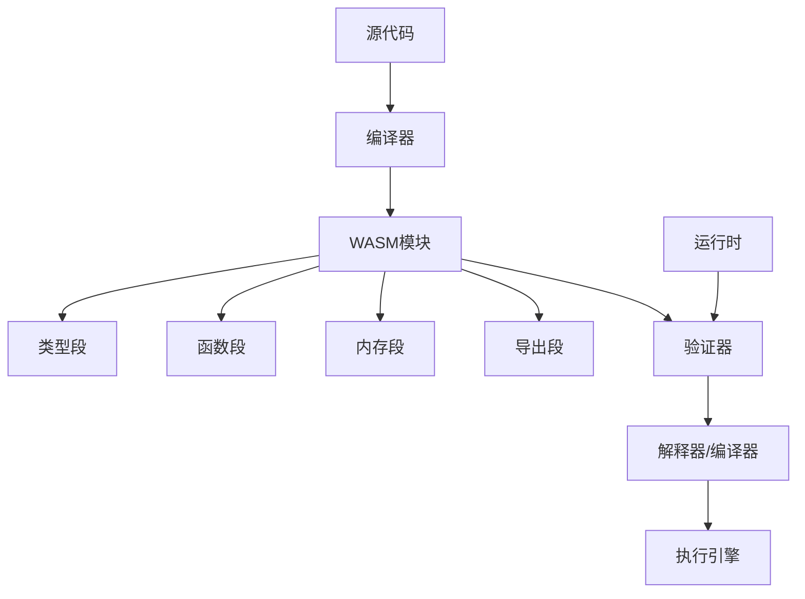

# WebAssembly架构理论

## 1. 理论概述

WebAssembly架构理论是现代Web应用和跨平台开发的重要理论体系，旨在通过WebAssembly技术实现高性能、可移植的应用程序。本理论将WebAssembly从技术实现提升为严格的形式化理论。

### 1.1 理论基础

- **虚拟机理论**：基于栈式虚拟机和字节码理论
- **编译理论**：基于编译器优化和代码生成理论
- **Web标准理论**：基于Web平台和浏览器理论

### 1.2 核心目标

- 建立WebAssembly的形式化语义
- 提供跨平台编译的理论框架
- 支持高性能Web应用的开发
- 实现Web与原生应用的统一架构

## 2. 基本概念

### 2.1 WebAssembly定义

```rust
// WebAssembly模块的基本结构
pub struct WebAssemblyModule {
    pub name: String,
    pub version: String,
    pub types: Vec<FunctionType>,
    pub functions: Vec<Function>,
    pub tables: Vec<Table>,
    pub memories: Vec<Memory>,
    pub globals: Vec<Global>,
    pub exports: Vec<Export>,
    pub imports: Vec<Import>,
}

// 函数类型定义
pub struct FunctionType {
    pub parameters: Vec<ValueType>,
    pub results: Vec<ValueType>,
}

// 值类型
pub enum ValueType {
    I32,
    I64,
    F32,
    F64,
}

// 函数定义
pub struct Function {
    pub type_index: u32,
    pub locals: Vec<ValueType>,
    pub body: Vec<Instruction>,
}
```

### 2.2 WASM指令集

```rust
// WebAssembly指令
pub enum Instruction {
    // 数值指令
    I32Const(i32),
    I64Const(i64),
    F32Const(f32),
    F64Const(f64),
    
    // 算术指令
    I32Add,
    I32Sub,
    I32Mul,
    I32Div,
    
    // 控制指令
    Block(BlockType),
    Loop(BlockType),
    If(BlockType),
    Br(u32),
    BrIf(u32),
    
    // 内存指令
    I32Load(MemoryImmediate),
    I32Store(MemoryImmediate),
    
    // 函数调用
    Call(u32),
    CallIndirect(u32),
}

// 内存立即数
pub struct MemoryImmediate {
    pub offset: u32,
    pub align: u32,
}
```

## 3. 形式化表示

### 3.1 WASM模块图



### 3.2 数学表示

WebAssembly模块可以形式化为元组 $WASM = (T, F, M, G, E, I)$，其中：

- $T$ 是类型段
- $F$ 是函数段
- $M$ 是内存段
- $G$ 是全局变量段
- $E$ 是导出段
- $I$ 是导入段

执行语义可以表示为：
$$\text{Execute}(wasm, input) = \text{Validate}(wasm) \land \text{Interpret}(wasm, input)$$

## 4. 编译技术

### 4.1 编译器架构

```rust
// WASM编译器
pub struct WASMCompiler {
    pub frontend: Frontend,
    pub optimizer: Optimizer,
    pub backend: Backend,
    pub target: TargetPlatform,
}

// 前端编译器
pub struct Frontend {
    pub parser: Parser,
    pub semantic_analyzer: SemanticAnalyzer,
    pub ir_generator: IRGenerator,
}

impl Frontend {
    pub fn compile(&self, source: &str) -> Result<IR, CompilationError> {
        // 1. 词法分析
        let tokens = self.parser.tokenize(source)?;
        
        // 2. 语法分析
        let ast = self.parser.parse(&tokens)?;
        
        // 3. 语义分析
        let semantic_info = self.semantic_analyzer.analyze(&ast)?;
        
        // 4. 生成IR
        let ir = self.ir_generator.generate(&ast, &semantic_info)?;
        
        Ok(ir)
    }
}

// 优化器
pub struct Optimizer {
    pub passes: Vec<OptimizationPass>,
}

impl Optimizer {
    pub fn optimize(&self, ir: &mut IR) -> Result<(), Error> {
        for pass in &self.passes {
            pass.apply(ir)?;
        }
        Ok(())
    }
}

// 优化通道
pub trait OptimizationPass {
    fn apply(&self, ir: &mut IR) -> Result<(), Error>;
}

// 常量折叠
pub struct ConstantFolding;

impl OptimizationPass for ConstantFolding {
    fn apply(&self, ir: &mut IR) -> Result<(), Error> {
        // 实现常量折叠优化
        todo!("实现常量折叠")
    }
}

// 死代码消除
pub struct DeadCodeElimination;

impl OptimizationPass for DeadCodeElimination {
    fn apply(&self, ir: &mut IR) -> Result<(), Error> {
        // 实现死代码消除
        todo!("实现死代码消除")
    }
}
```

### 4.2 代码生成

```rust
// 后端代码生成器
pub struct Backend {
    pub instruction_selector: InstructionSelector,
    pub register_allocator: RegisterAllocator,
    pub code_emitter: CodeEmitter,
}

impl Backend {
    pub fn generate(&self, ir: &IR) -> Result<WebAssemblyModule, Error> {
        // 1. 指令选择
        let instructions = self.instruction_selector.select(ir)?;
        
        // 2. 寄存器分配
        let allocated_code = self.register_allocator.allocate(&instructions)?;
        
        // 3. 代码发射
        let module = self.code_emitter.emit(&allocated_code)?;
        
        Ok(module)
    }
}

// 指令选择器
pub struct InstructionSelector {
    pub patterns: Vec<InstructionPattern>,
}

impl InstructionSelector {
    pub fn select(&self, ir: &IR) -> Result<Vec<Instruction>, Error> {
        // 将IR转换为WASM指令
        todo!("实现指令选择")
    }
}
```

## 5. 运行时环境

### 5.1 虚拟机实现

```rust
// WASM虚拟机
pub struct WASMVM {
    pub stack: Vec<Value>,
    pub locals: Vec<Value>,
    pub memory: Memory,
    pub functions: Vec<Function>,
    pub tables: Vec<Table>,
    pub globals: Vec<Value>,
}

impl WASMVM {
    pub fn execute(&mut self, module: &WebAssemblyModule, function_name: &str, args: &[Value]) -> Result<Vec<Value>, Error> {
        // 1. 验证模块
        self.validate_module(module)?;
        
        // 2. 实例化模块
        let instance = self.instantiate_module(module)?;
        
        // 3. 查找函数
        let function = self.find_function(&instance, function_name)?;
        
        // 4. 执行函数
        let results = self.execute_function(function, args)?;
        
        Ok(results)
    }
    
    fn validate_module(&self, module: &WebAssemblyModule) -> Result<(), Error> {
        // 验证模块格式和类型
        todo!("实现模块验证")
    }
    
    fn instantiate_module(&mut self, module: &WebAssemblyModule) -> Result<ModuleInstance, Error> {
        // 实例化模块
        todo!("实现模块实例化")
    }
    
    fn execute_function(&mut self, function: &Function, args: &[Value]) -> Result<Vec<Value>, Error> {
        // 执行函数
        todo!("实现函数执行")
    }
}

// 模块实例
pub struct ModuleInstance {
    pub functions: Vec<FunctionInstance>,
    pub memories: Vec<MemoryInstance>,
    pub tables: Vec<TableInstance>,
    pub globals: Vec<Value>,
    pub exports: HashMap<String, ExportValue>,
}
```

### 5.2 内存管理

```rust
// 内存管理
pub struct Memory {
    pub pages: Vec<MemoryPage>,
    pub max_pages: u32,
    pub current_pages: u32,
}

pub struct MemoryPage {
    pub data: Vec<u8>,
    pub size: u32,
}

impl Memory {
    pub fn grow(&mut self, delta_pages: u32) -> Result<i32, Error> {
        // 增长内存
        todo!("实现内存增长")
    }
    
    pub fn read(&self, address: u32, size: u32) -> Result<Vec<u8>, Error> {
        // 读取内存
        todo!("实现内存读取")
    }
    
    pub fn write(&mut self, address: u32, data: &[u8]) -> Result<(), Error> {
        // 写入内存
        todo!("实现内存写入")
    }
}
```

## 6. 应用场景

### 6.1 Web应用

```rust
// Web应用集成
pub struct WebAppIntegration {
    pub wasm_module: WebAssemblyModule,
    pub js_bridge: JSBridge,
    pub dom_binding: DOMBinding,
}

impl WebAppIntegration {
    pub fn load_module(&mut self, wasm_bytes: &[u8]) -> Result<(), Error> {
        // 加载WASM模块
        todo!("实现模块加载")
    }
    
    pub fn call_function(&self, function_name: &str, args: &[JsValue]) -> Result<JsValue, Error> {
        // 调用WASM函数
        todo!("实现函数调用")
    }
}

// JavaScript桥接
pub struct JSBridge {
    pub wasm_instance: WebAssemblyInstance,
    pub imported_functions: HashMap<String, JsFunction>,
    pub exported_functions: HashMap<String, WASMFunction>,
}
```

### 6.2 跨平台应用

```rust
// 跨平台运行时
pub struct CrossPlatformRuntime {
    pub platform: Platform,
    pub wasm_runtime: WASMRuntime,
    pub native_bindings: NativeBindings,
}

pub enum Platform {
    Web,
    Desktop,
    Mobile,
    Server,
}

impl CrossPlatformRuntime {
    pub fn initialize(&mut self) -> Result<(), Error> {
        // 初始化运行时
        todo!("实现运行时初始化")
    }
    
    pub fn execute_module(&self, module: &WebAssemblyModule) -> Result<(), Error> {
        // 执行模块
        todo!("实现模块执行")
    }
}
```

### 6.3 性能优化

```rust
// 性能优化
pub struct PerformanceOptimizer {
    pub jit_compiler: JITCompiler,
    pub profiling: Profiler,
    pub optimization_passes: Vec<OptimizationPass>,
}

// JIT编译器
pub struct JITCompiler {
    pub code_cache: HashMap<String, CompiledFunction>,
    pub optimization_level: OptimizationLevel,
}

impl JITCompiler {
    pub fn compile_function(&mut self, function: &Function) -> Result<CompiledFunction, Error> {
        // JIT编译函数
        todo!("实现JIT编译")
    }
    
    pub fn optimize_hot_paths(&mut self, profile_data: &ProfileData) -> Result<(), Error> {
        // 优化热点路径
        todo!("实现热点优化")
    }
}

// 性能分析器
pub struct Profiler {
    pub execution_times: HashMap<String, Duration>,
    pub call_counts: HashMap<String, u64>,
    pub memory_usage: MemoryUsage,
}

impl Profiler {
    pub fn profile_execution(&mut self, function_name: &str, duration: Duration) {
        // 记录执行时间
        todo!("实现性能分析")
    }
    
    pub fn get_hot_functions(&self) -> Vec<String> {
        // 获取热点函数
        todo!("实现热点检测")
    }
}
```

## 7. 安全模型

### 7.1 沙箱机制

```rust
// 安全沙箱
pub struct SecuritySandbox {
    pub memory_bounds: MemoryBounds,
    pub function_permissions: FunctionPermissions,
    pub system_calls: SystemCallPolicy,
}

pub struct MemoryBounds {
    pub min_address: u32,
    pub max_address: u32,
    pub read_only: bool,
}

impl SecuritySandbox {
    pub fn validate_access(&self, address: u32, operation: MemoryOperation) -> Result<(), SecurityError> {
        // 验证内存访问
        todo!("实现访问验证")
    }
    
    pub fn check_permission(&self, function_name: &str, permission: Permission) -> Result<(), SecurityError> {
        // 检查函数权限
        todo!("实现权限检查")
    }
}
```

### 7.2 类型安全

```rust
// 类型检查器
pub struct TypeChecker {
    pub type_context: TypeContext,
    pub validation_rules: Vec<ValidationRule>,
}

impl TypeChecker {
    pub fn validate_module(&self, module: &WebAssemblyModule) -> Result<(), TypeError> {
        // 验证模块类型
        todo!("实现类型验证")
    }
    
    pub fn check_function(&self, function: &Function) -> Result<(), TypeError> {
        // 检查函数类型
        todo!("实现函数类型检查")
    }
}
```

## 8. 交叉引用

### 8.1 相关理论

- [软件架构理论总论](00-软件架构理论总论.md)
- [编程语言理论](../05-编程语言理论/00-编程语言理论总论.md)
- [形式语言理论](../03-形式语言理论/00-形式语言理论总论.md)

### 8.2 实践应用

- [代码生成工具](../08-实践应用开发/06-代码生成工具/README.md)
- [架构设计工具](../08-实践应用开发/04-架构设计工具/README.md)

## 9. 导航

- [返回软件架构理论总论](00-软件架构理论总论.md)
- [设计模式理论](01-设计模式理论.md)
- [微服务架构理论](02-微服务架构理论.md)
- [组件化架构理论](03-组件化架构理论.md)
- [云原生架构理论](04-云原生架构理论.md)
- [分布式架构理论](05-分布式架构理论.md)
- [工作流架构理论](07-工作流架构理论.md)
