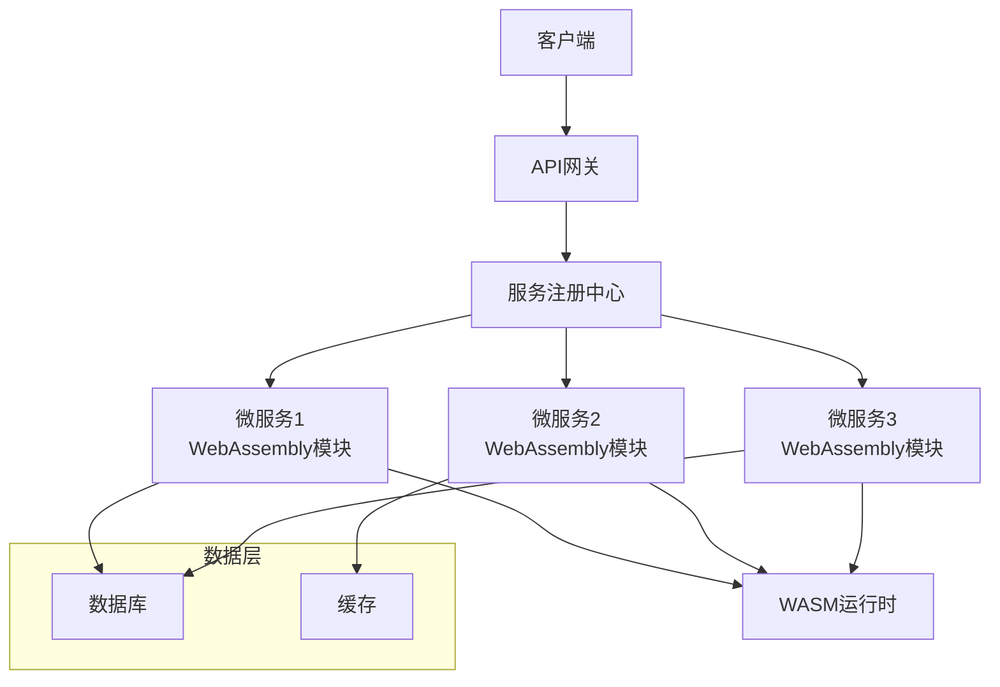
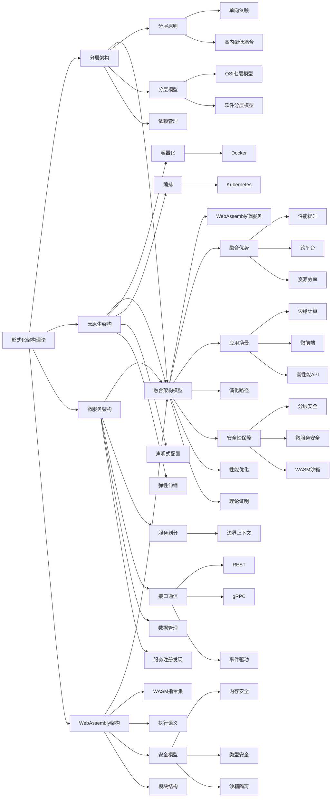

# 微服务与WebAssembly架构理论

## 目录

- [微服务与WebAssembly架构理论](#微服务与webassembly架构理论)
  - [目录](#目录)
  - [1. 理论基础](#1-理论基础)
    - [1.1 微服务架构定义与范畴](#11-微服务架构定义与范畴)
    - [1.2 WebAssembly架构定义与范畴](#12-webassembly架构定义与范畴)
    - [1.3 核心特性比较](#13-核心特性比较)
  - [2. 微服务设计原则](#2-微服务设计原则)
    - [2.1 服务划分](#21-服务划分)
    - [2.2 接口与通信](#22-接口与通信)
    - [2.3 数据管理](#23-数据管理)
  - [3. WebAssembly设计原则](#3-webassembly设计原则)
    - [3.1 WASM指令集](#31-wasm指令集)
    - [3.2 执行语义](#32-执行语义)
    - [3.3 安全模型](#33-安全模型)
  - [4. 微服务与WebAssembly融合架构](#4-微服务与webassembly融合架构)
    - [4.1 融合架构模型](#41-融合架构模型)
    - [4.2 融合架构的优势](#42-融合架构的优势)
  - [5. 实现技术](#5-实现技术)
    - [5.1 微服务框架（Rust）](#51-微服务框架rust)
    - [5.2 WebAssembly模块实现](#52-webassembly模块实现)
    - [5.3 WASM微服务运行时](#53-wasm微服务运行时)
  - [6. 架构模式与应用场景](#6-架构模式与应用场景)
    - [6.1 微服务WASM网关模式](#61-微服务wasm网关模式)
    - [6.2 WASM微前端架构](#62-wasm微前端架构)
    - [6.3 边缘计算微服务](#63-边缘计算微服务)
  - [7. 演化路径与未来展望](#7-演化路径与未来展望)
    - [7.1 渐进式采用路径](#71-渐进式采用路径)
    - [7.2 未来研究方向](#72-未来研究方向)
  - [8. 结论](#8-结论)

## 1. 理论基础

### 1.1 微服务架构定义与范畴

微服务架构理论是研究将单一应用拆分为一组小型、自治服务的系统性理论框架。每个微服务围绕特定业务能力构建，独立部署、扩展和演化。

**形式化定义：**

设 $M$ 为微服务系统，则：
$$M = (S, I, D, C, Q)$$

其中：

- $S = \{s_1, s_2, ..., s_n\}$ 为服务集合
- $I = \{i_1, i_2, ..., i_m\}$ 为接口集合
- $D = \{d_1, d_2, ..., d_k\}$ 为数据存储集合
- $C = \{c_1, c_2, ..., c_l\}$ 为通信机制集合
- $Q = \{q_1, q_2, ..., q_p\}$ 为质量属性集合

### 1.2 WebAssembly架构定义与范畴

WebAssembly架构理论是现代Web应用和跨平台开发的重要理论体系，旨在通过WebAssembly技术实现高性能、可移植的应用程序。本理论将WebAssembly从技术实现提升为严格的形式化理论。

**形式化定义：**

WebAssembly模块可以形式化为元组 $WASM = (T, F, M, G, E, I)$，其中：

- $T$ 是类型段
- $F$ 是函数段
- $M$ 是内存段
- $G$ 是全局变量段
- $E$ 是导出段
- $I$ 是导入段

### 1.3 核心特性比较

| 特性 | 微服务架构 | WebAssembly架构 |
|-----|-----------|---------------|
| 部署单元 | 服务 | 模块 |
| 通信机制 | API、消息、事件 | 函数调用、内存共享 |
| 隔离级别 | 进程/容器 | 安全沙箱 |
| 扩展方式 | 水平扩展 | 垂直/水平扩展 |
| 开发语言 | 多语言 | 多语言编译目标 |
| 状态管理 | 分布式状态 | 模块内/共享内存 |

## 2. 微服务设计原则

### 2.1 服务划分

**边界上下文（Bounded Context）：**
$$\forall s_i \in S, \exists BC_j: s_i \subseteq BC_j$$

**高内聚低耦合：**
$$Cohesion(s_i) > Threshold, \quad Coupling(s_i, s_j) < Threshold$$

### 2.2 接口与通信

**接口规范：**
$$I_s = (API, Contract, Version)$$

**通信机制：**

- 同步通信（REST, gRPC）
- 异步通信（消息队列, 事件流）

**幂等性：**
$$\forall r \in Request, f(f(r)) = f(r)$$

### 2.3 数据管理

**去中心化数据管理：**
$$\forall s_i \in S, \exists d_j \in D: Data(s_i) \cap Data(s_k) = \emptyset, \forall i \neq k$$

**最终一致性：**
$$\lim_{t \to \infty} State(s_i) = State(s_j)$$

## 3. WebAssembly设计原则

### 3.1 WASM指令集

```rust
// WebAssembly指令
pub enum Instruction {
    // 数值指令
    I32Const(i32),
    I64Const(i64),
    F32Const(f32),
    F64Const(f64),
    
    // 算术指令
    I32Add,
    I32Sub,
    I32Mul,
    I32Div,
    
    // 控制指令
    Block(BlockType),
    Loop(BlockType),
    If(BlockType),
    Br(u32),
    BrIf(u32),
    
    // 内存指令
    I32Load(MemoryImmediate),
    I32Store(MemoryImmediate),
    
    // 函数调用
    Call(u32),
    CallIndirect(u32),
}
```

### 3.2 执行语义

WebAssembly模块的执行语义可以表示为：
$$\text{Execute}(wasm, input) = \text{Validate}(wasm) \land \text{Interpret}(wasm, input)$$

### 3.3 安全模型

WebAssembly提供了强大的安全保障：

1. **内存安全**：线性内存模型，防止越界访问
2. **类型安全**：强类型系统，验证时类型检查
3. **控制流安全**：结构化控制流，防止非法跳转
4. **沙箱隔离**：隔离执行环境，限制系统资源访问

## 4. 微服务与WebAssembly融合架构

### 4.1 融合架构模型

微服务与WebAssembly架构可以形式化为融合模型：

$$M_{WASM} = (S_{WASM}, I_{WASM}, D_{WASM}, C_{WASM}, Q_{WASM})$$

其中：

- $S_{WASM}$ 是WebAssembly实现的微服务集合
- $I_{WASM}$ 是WebAssembly友好的接口集合
- $D_{WASM}$ 是适合WebAssembly的数据存储方案
- $C_{WASM}$ 是WebAssembly优化的通信机制
- $Q_{WASM}$ 是兼顾两种架构的质量属性



### 4.2 融合架构的优势

1. **性能提升**：微服务通过WebAssembly执行，接近原生性能
2. **跨平台**：微服务可以在任何支持WebAssembly的环境中运行
3. **资源效率**：相比容器化微服务，WebAssembly微服务更轻量
4. **多语言支持**：任何可编译到WebAssembly的语言都可用于微服务开发
5. **增强安全性**：结合微服务隔离与WebAssembly沙箱的双重安全

## 5. 实现技术

### 5.1 微服务框架（Rust）

```rust
use std::collections::HashMap;
use std::sync::{Arc, Mutex};
use tokio::sync::mpsc;
use serde::{Deserialize, Serialize};

/// 微服务定义
#[derive(Debug, Clone, Serialize, Deserialize)]
pub struct Microservice {
    pub id: String,
    pub name: String,
    pub version: String,
    pub endpoints: Vec<Endpoint>,
    pub dependencies: Vec<String>,
    pub data_store: Option<DataStore>,
    pub status: ServiceStatus,
    pub wasm_module: Option<WasmModuleInfo>,
}

#[derive(Debug, Clone, Serialize, Deserialize)]
pub struct WasmModuleInfo {
    pub module_path: String,
    pub memory_limit_mb: u32,
    pub allowed_imports: Vec<String>,
    pub exports: Vec<String>,
}

#[derive(Debug, Clone, Serialize, Deserialize)]
pub struct Endpoint {
    pub path: String,
    pub method: HttpMethod,
    pub handler: String,
    pub version: String,
}

#[derive(Debug, Clone, Serialize, Deserialize)]
pub enum HttpMethod {
    GET, POST, PUT, DELETE, PATCH
}

/// 微服务注册中心
pub struct ServiceRegistry {
    services: Arc<Mutex<HashMap<String, Microservice>>>,
    event_tx: mpsc::Sender<RegistryEvent>,
}

impl ServiceRegistry {
    pub fn new() -> (Self, mpsc::Receiver<RegistryEvent>) {
        let (event_tx, event_rx) = mpsc::channel(100);
        let registry = Self {
            services: Arc::new(Mutex::new(HashMap::new())),
            event_tx,
        };
        (registry, event_rx)
    }
    
    pub async fn register_service(&self, service: Microservice) {
        let mut services = self.services.lock().unwrap();
        services.insert(service.id.clone(), service.clone());
        let _ = self.event_tx.send(RegistryEvent::ServiceRegistered(service.id)).await;
    }
}
```

### 5.2 WebAssembly模块实现

```rust
// WebAssembly模块的基本结构
pub struct WebAssemblyModule {
    pub name: String,
    pub version: String,
    pub types: Vec<FunctionType>,
    pub functions: Vec<Function>,
    pub tables: Vec<Table>,
    pub memories: Vec<Memory>,
    pub globals: Vec<Global>,
    pub exports: Vec<Export>,
    pub imports: Vec<Import>,
}

// 函数类型定义
pub struct FunctionType {
    pub parameters: Vec<ValueType>,
    pub results: Vec<ValueType>,
}

// 值类型
pub enum ValueType {
    I32,
    I64,
    F32,
    F64,
}
```

### 5.3 WASM微服务运行时

```rust
/// WebAssembly微服务运行时
pub struct WasmMicroserviceRuntime {
    pub store: Store<HostState>,
    pub instance_cache: HashMap<String, Instance>,
    pub module_cache: HashMap<String, Module>,
    pub linker: Linker<HostState>,
}

impl WasmMicroserviceRuntime {
    pub fn new() -> Self {
        let engine = Engine::new(&Config::default()).unwrap();
        let mut linker = Linker::new(&engine);
        let mut store = Store::new(&engine, HostState::default());
        
        // 注册宿主函数
        Self::register_host_functions(&mut linker);
        
        Self {
            store,
            instance_cache: HashMap::new(),
            module_cache: HashMap::new(),
            linker,
        }
    }
    
    pub fn load_service(&mut self, service: &Microservice) -> Result<(), Error> {
        if let Some(wasm_info) = &service.wasm_module {
            let module_bytes = std::fs::read(&wasm_info.module_path)?;
            let module = Module::new(self.store.engine(), &module_bytes)?;
            
            // 缓存模块
            self.module_cache.insert(service.id.clone(), module.clone());
            
            // 实例化模块
            let instance = self.linker.instantiate(&mut self.store, &module)?;
            self.instance_cache.insert(service.id.clone(), instance);
            
            Ok(())
        } else {
            Err(Error::NoWasmModule)
        }
    }
    
    pub async fn call_endpoint(&mut self, 
                         service_id: &str, 
                         endpoint: &str, 
                         params: &[Value]) -> Result<Vec<Value>, Error> {
        if let Some(instance) = self.instance_cache.get(service_id) {
            let func = instance.get_func(&mut self.store, endpoint)
                .ok_or(Error::FunctionNotFound)?;
                
            let mut results = vec![Value::null(); func.result_arity(&self.store)];
            func.call_async(&mut self.store, params, &mut results).await?;
            
            Ok(results)
        } else {
            Err(Error::ServiceNotLoaded)
        }
    }
    
    fn register_host_functions(linker: &mut Linker<HostState>) {
        // 注册HTTP相关函数
        linker.func_wrap("http", "fetch", |ctx: Caller<'_, HostState>, url_ptr: i32, url_len: i32| {
            let memory = ctx.get_export("memory").unwrap().into_memory().unwrap();
            let url = read_string_from_memory(&memory, &ctx, url_ptr, url_len);
            // 实现HTTP请求逻辑
            0 // 返回响应句柄
        }).unwrap();
        
        // 注册数据库相关函数
        linker.func_wrap("db", "query", |ctx: Caller<'_, HostState>, query_ptr: i32, query_len: i32| {
            let memory = ctx.get_export("memory").unwrap().into_memory().unwrap();
            let query = read_string_from_memory(&memory, &ctx, query_ptr, query_len);
            // 实现数据库查询逻辑
            0 // 返回结果句柄
        }).unwrap();
    }
}
```

## 6. 架构模式与应用场景

### 6.1 微服务WASM网关模式

**定义**：使用WebAssembly实现API网关功能，通过编译到WebAssembly的路由、转换、聚合逻辑处理微服务请求。

**优势**：

- 高性能路由和转换
- 动态部署网关逻辑
- 跨平台兼容性
- 安全隔离

### 6.2 WASM微前端架构

**定义**：将微前端应用编译为WebAssembly模块，通过微服务架构管理多个前端模块的集成。

**优势**：

- 前端组件独立部署
- 技术栈无关性
- 加载性能优化
- 与后端微服务一致的架构风格

### 6.3 边缘计算微服务

**定义**：将WebAssembly微服务部署到边缘计算节点，实现低延迟、高性能的边缘处理。

**优势**：

- 轻量级部署
- 跨设备兼容性
- 动态更新能力
- 有限资源环境适配性

## 7. 演化路径与未来展望

### 7.1 渐进式采用路径

1. **微服务容器化**：将现有微服务容器化，建立基础微服务架构
2. **WebAssembly集成**：为特定场景引入WebAssembly模块，如高性能计算、前端组件
3. **混合架构**：同时运行容器化微服务和WebAssembly微服务
4. **全面融合**：建立统一的微服务WebAssembly平台

### 7.2 未来研究方向

1. **WebAssembly组件模型**：基于组件模型重新设计微服务通信
2. **WebAssembly系统接口（WASI）**：利用WASI标准化微服务与系统的交互
3. **分布式WebAssembly**：研究WebAssembly模块在分布式环境中的协作
4. **AI驱动的WASM微服务优化**：利用AI自动优化WebAssembly微服务性能与资源配置

## 8. 结论

微服务与WebAssembly架构的融合代表了软件架构的重要创新方向，将微服务的灵活性、可扩展性与WebAssembly的高性能、跨平台、安全特性相结合。这种融合架构特别适用于对性能要求高、需要跨平台部署、资源受限的场景，如边缘计算、IoT应用、高性能Web应用等。随着WebAssembly技术的成熟和微服务实践的深化，两种架构的融合将为现代软件系统提供更强大、更灵活的设计选择。

```mermaid
flowchart TD
    A["形式化架构理论"] --> B1["哲学基础"]
    A --> B2["数学基础"]
    A --> B3["形式语言"]
    A --> B4["软件架构"]
    A --> B5["编程语言"]
    A --> B6["形式模型"]
    A --> B7["理论统一"]
    A --> B8["实践应用"]
    
    B1 --> C11["本体论"]
    B1 --> C12["认识论"]
    B1 --> C13["逻辑学"]
    B1 --> C14["伦理学"]
    B1 --> C15["形而上学"]
    
    B2 --> C21["集合论"]
    B2 --> C22["代数"]
    B2 --> C23["分析"]
    B2 --> C24["几何"]
    B2 --> C25["概率统计"]
    
    B3 --> C31["自动机"]
    B3 --> C32["形式语法"]
    B3 --> C33["语义"]
    B3 --> C34["类型"]
    B3 --> C35["计算"]
    B3 --> C36["语言设计"]
    
    B4 --> C41["架构模式"]
    B4 --> C42["组件"]
    B4 --> C43["接口"]
    B4 --> C44["分层架构"]
    B4 --> C45["分布式架构"]
    B4 --> C46["微服务架构"]
    B4 --> C47["架构评估"]
    
    B5 --> C51["语法"]
    B5 --> C52["语义"]
    B5 --> C53["类型"]
    B5 --> C54["编译"]
    B5 --> C55["运行时"]
    B5 --> C56["并发"]
    B5 --> C57["语言设计"]
    
    B6 --> C61["状态机"]
    B6 --> C62["Petri网"]
    B6 --> C63["时序逻辑"]
    B6 --> C64["模型检查"]
    B6 --> C65["自动机"]
    B6 --> C66["进程代数"]
    B6 --> C67["形式化方法"]
    
    %% 跨领域关系
    C31 -.-> C65
    C33 -.-> C52
    C34 -.-> C53
    C36 -.-> C57
    C42 -.-> C43
    C44 -.-> C45
    C45 -.-> C46
```





---

**参考文献**：

1. Newman, S. (2021). "Building Microservices"
2. Haas, A. et al. (2017). "Bringing the Web up to Speed with WebAssembly"
3. Rossberg, A. (2019). "WebAssembly Core Specification"
4. Richardson, C. (2018). "Microservices Patterns"
5. Wasmer Team. (2023). "Running WebAssembly Workloads in Micro Service Architecture"
