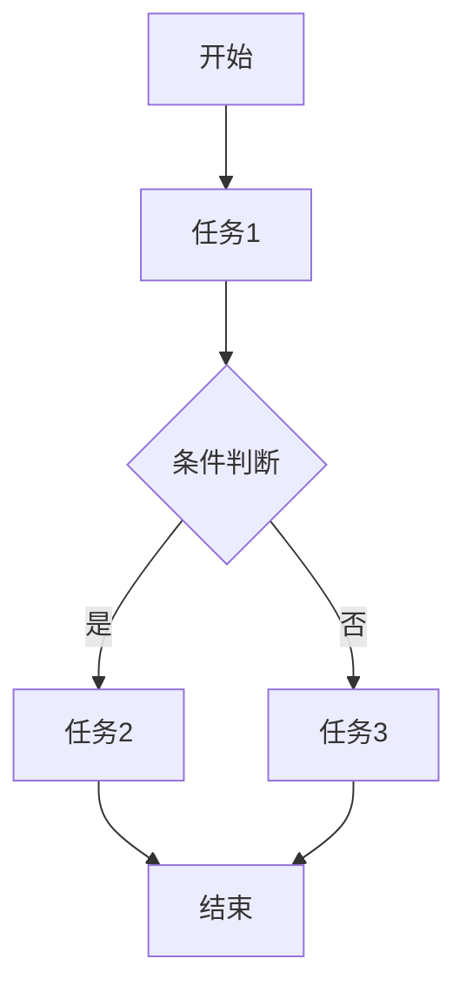
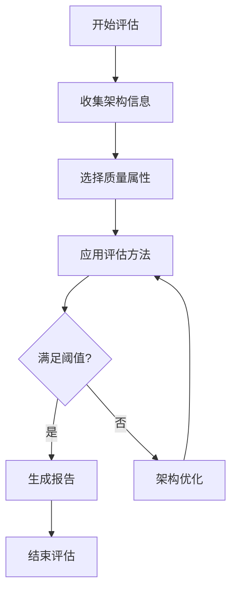
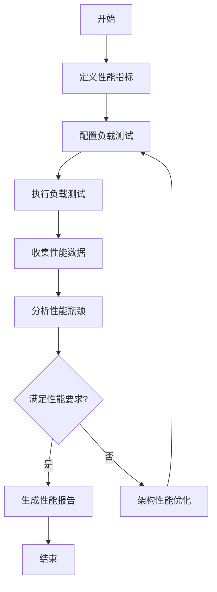

# 架构评估与工作流理论

## 1. 架构评估理论基础

### 1.1 定义与范畴

架构评估理论是研究软件系统架构质量属性、评估方法和决策支持的系统性理论框架。其目标是通过定量和定性方法，系统性地分析和优化架构设计。

**形式化定义：**

设 $A$ 为架构，$Q$ 为质量属性，$E$ 为评估方法，则：
$$Eval(A, Q, E) \rightarrow Score \in [0, 1]$$

其中：

- $A$ 为待评估架构
- $Q = \{q_1, q_2, ..., q_n\}$ 为质量属性集合
- $E = \{e_1, e_2, ..., e_m\}$ 为评估方法集合
- $Score$ 为评估得分

### 1.2 质量属性

软件架构评估的核心质量属性包括：

- 性能（Performance）
- 可用性（Availability）
- 可维护性（Maintainability）
- 可扩展性（Scalability）
- 安全性（Security）
- 可靠性（Reliability）
- 易用性（Usability）

## 2. 工作流架构理论基础

### 2.1 定义与范畴

工作流架构理论关注业务流程的建模、自动化与优化，是企业级系统和复杂业务场景中的核心架构理论之一。本理论将工作流从工程实现提升为严格的形式化理论体系。

**形式化定义：**

工作流可形式化为有向图 $WF = (S, T, E)$，其中：

- $S$ 为状态集合
- $T$ 为任务集合
- $E$ 为转移关系

流程约束：
$$\forall t \in T, \exists s_{in}, s_{out} \in S: (s_{in}, t, s_{out}) \in E$$

### 2.2 理论基础

工作流架构的核心理论基础包括：

- **流程建模理论**：基于Petri网、状态机、BPMN等
- **自动化理论**：基于自动机、规则引擎、调度算法
- **系统集成理论**：基于服务编排、事件驱动、消息中间件

## 3. 架构评估方法

### 3.1 定性评估

**专家评审法（Expert Review）：**

- 结构化评审
- 经验法则
- 设计模式匹配

**场景驱动法（ATAM）：**

- 业务场景建模
- 质量属性场景分析
- 风险与权衡识别

### 3.2 定量评估

**指标法（Metrics）：**

- 复杂度指标：$C = f(模块数, 依赖数)$
- 耦合度指标：$Coupling = \frac{外部依赖数}{总依赖数}$
- 内聚度指标：$Cohesion = \frac{内部关系数}{总关系数}$

**仿真法（Simulation）：**

- 性能仿真
- 故障仿真
- 负载仿真

## 4. 工作流架构模型

### 4.1 工作流基本结构

```rust
// 工作流结构
pub struct Workflow {
    pub id: String,
    pub name: String,
    pub states: Vec<State>,
    pub transitions: Vec<Transition>,
    pub tasks: Vec<Task>,
    pub triggers: Vec<Trigger>,
    pub context: WorkflowContext,
}

// 状态定义
pub struct State {
    pub id: String,
    pub name: String,
    pub state_type: StateType,
}

pub enum StateType {
    Start,
    Intermediate,
    End,
    Error,
}

// 任务定义
pub struct Task {
    pub id: String,
    pub name: String,
    pub action: TaskAction,
    pub assignee: Option<String>,
    pub dependencies: Vec<String>,
}
```

### 4.2 工作流可视化



## 5. 架构评估与工作流的融合

### 5.1 工作流驱动的架构评估

工作流驱动的架构评估（WDAE）是将工作流理论与架构评估理论结合的新型评估方法，通过定义评估流程工作流，实现架构评估的自动化、可重复性和可追溯性。

形式化定义：
$$WDAE = (WF_{eval}, A, Q, M)$$

其中：

- $WF_{eval}$ 是评估工作流
- $A$ 是待评估架构
- $Q$ 是质量属性
- $M$ 是度量方法

### 5.2 评估工作流模型



评估工作流的形式化表示：
$$WF_{eval} = (S_{eval}, T_{eval}, E_{eval}, C_{eval})$$

其中：

- $S_{eval}$ 是评估状态集合
- $T_{eval}$ 是评估任务集合
- $E_{eval}$ 是状态转移关系
- $C_{eval}$ 是约束条件

## 6. 代码实现

### 6.1 架构评估框架（Rust）

```rust
use std::collections::HashMap;
use serde::{Deserialize, Serialize};

/// 质量属性
#[derive(Debug, Clone, Serialize, Deserialize)]
pub enum QualityAttribute {
    Performance,
    Availability,
    Maintainability,
    Scalability,
    Security,
    Reliability,
    Usability,
}

/// 架构评估方法
#[derive(Debug, Clone, Serialize, Deserialize)]
pub enum EvaluationMethod {
    ExpertReview,
    ATAM,
    Metrics,
    Simulation,
    WorkflowDriven,
}

/// 评估结果
#[derive(Debug, Clone, Serialize, Deserialize)]
pub struct EvaluationResult {
    pub attribute: QualityAttribute,
    pub method: EvaluationMethod,
    pub score: f64,
    pub details: String,
}

/// 架构评估器
pub struct ArchitectureEvaluator {
    pub weights: HashMap<QualityAttribute, f64>,
    pub workflow_engine: Option<WorkflowEngine>,
}

impl ArchitectureEvaluator {
    pub fn new(weights: HashMap<QualityAttribute, f64>) -> Self {
        Self { weights, workflow_engine: None }
    }
    
    pub fn with_workflow(mut self, workflow_engine: WorkflowEngine) -> Self {
        self.workflow_engine = Some(workflow_engine);
        self
    }
    
    pub fn evaluate(&self, architecture: &str, methods: Vec<EvaluationMethod>) -> Vec<EvaluationResult> {
        // 这里只做示例，实际应集成具体评估逻辑
        methods.iter().map(|method| {
            EvaluationResult {
                attribute: QualityAttribute::Performance,
                method: method.clone(),
                score: 0.85,
                details: format!("评估架构 {} 的性能", architecture),
            }
        }).collect()
    }
    
    pub fn decision(&self, results: &[EvaluationResult]) -> f64 {
        results.iter().map(|r| self.weights.get(&r.attribute).unwrap_or(&1.0) * r.score).sum()
    }
}
```

### 6.2 工作流引擎（Rust）

```rust
use std::collections::HashMap;

/// 工作流引擎
pub struct WorkflowEngine {
    pub workflows: HashMap<String, Workflow>,
    pub scheduler: Scheduler,
    pub event_bus: EventBus,
}

impl WorkflowEngine {
    pub fn new() -> Self {
        Self {
            workflows: HashMap::new(),
            scheduler: Scheduler::new(),
            event_bus: EventBus::new(),
        }
    }

    pub fn start_workflow(&mut self, workflow_id: &str) -> Result<(), Error> {
        if let Some(workflow) = self.workflows.get_mut(workflow_id) {
            // 设置初始状态
            let start_state = workflow.states.iter()
                .find(|s| matches!(s.state_type, StateType::Start))
                .ok_or(Error::NoStartState)?;
                
            // 触发开始事件
            let event = Event {
                workflow_id: workflow_id.to_string(),
                event_type: "workflow_started".to_string(),
                state_id: start_state.id.clone(),
                data: HashMap::new(),
            };
            self.event_bus.publish(&event);
            
            // 调度首个任务
            let initial_tasks = workflow.tasks.iter()
                .filter(|t| t.dependencies.is_empty())
                .collect::<Vec<_>>();
                
            for task in initial_tasks {
                self.scheduler.schedule_task(task.id.clone())?;
            }
            
            Ok(())
        } else {
            Err(Error::WorkflowNotFound)
        }
    }
    
    pub fn execute_task(&mut self, task_id: &str) -> Result<(), Error> {
        // 查找任务
        let mut workflow_id = None;
        let mut task = None;
        
        for (wf_id, wf) in &self.workflows {
            if let Some(t) = wf.tasks.iter().find(|t| t.id == task_id) {
                workflow_id = Some(wf_id.clone());
                task = Some(t.clone());
                break;
            }
        }
        
        let task = task.ok_or(Error::TaskNotFound)?;
        let workflow_id = workflow_id.unwrap();
        
        // 执行任务
        match task.action {
            TaskAction::Function(func) => func(),
            TaskAction::Command(cmd) => execute_command(&cmd)?,
            TaskAction::Subprocess(subprocess) => spawn_subprocess(&subprocess)?,
        }
        
        // 触发任务完成事件
        let event = Event {
            workflow_id,
            event_type: "task_completed".to_string(),
            state_id: "".to_string(), // 需要确定当前状态
            data: HashMap::new(),
        };
        self.event_bus.publish(&event);
        
        Ok(())
    }
    
    pub fn handle_event(&mut self, event: &Event) -> Result<(), Error> {
        if let Some(workflow) = self.workflows.get(&event.workflow_id) {
            // 查找当前状态
            let current_state = workflow.states.iter()
                .find(|s| s.id == event.state_id)
                .ok_or(Error::StateNotFound)?;
                
            // 查找可用的转换
            let transitions = workflow.transitions.iter()
                .filter(|t| t.from_state == current_state.id)
                .collect::<Vec<_>>();
                
            // 评估条件并执行转换
            for transition in transitions {
                if evaluate_condition(&transition.condition, event) {
                    // 执行转换
                    let next_state_id = &transition.to_state;
                    
                    // 触发状态变更事件
                    let state_change_event = Event {
                        workflow_id: event.workflow_id.clone(),
                        event_type: "state_changed".to_string(),
                        state_id: next_state_id.clone(),
                        data: event.data.clone(),
                    };
                    self.event_bus.publish(&state_change_event);
                    
                    // 查找下一个任务
                    let next_tasks = get_tasks_for_state(workflow, next_state_id);
                    for task in next_tasks {
                        self.scheduler.schedule_task(task.id.clone())?;
                    }
                    
                    break;
                }
            }
            
            Ok(())
        } else {
            Err(Error::WorkflowNotFound)
        }
    }
}
```

## 7. 融合案例：架构评估工作流

### 7.1 ATAM评估工作流

ATAM（Architecture Tradeoff Analysis Method）是一种系统化的软件架构评估方法，通过工作流引擎可以实现其自动化与标准化。

```rust
/// 创建ATAM评估工作流
pub fn create_atam_workflow() -> Workflow {
    Workflow {
        id: "atam_evaluation".to_string(),
        name: "ATAM架构评估流程".to_string(),
        states: vec![
            State {
                id: "start".to_string(),
                name: "开始评估".to_string(),
                state_type: StateType::Start,
            },
            State {
                id: "collect_info".to_string(),
                name: "收集架构信息".to_string(),
                state_type: StateType::Intermediate,
            },
            State {
                id: "identify_scenarios".to_string(),
                name: "识别质量属性场景".to_string(),
                state_type: StateType::Intermediate,
            },
            State {
                id: "analyze_architecture".to_string(),
                name: "分析架构".to_string(),
                state_type: StateType::Intermediate,
            },
            State {
                id: "identify_risks".to_string(),
                name: "识别风险与权衡".to_string(),
                state_type: StateType::Intermediate,
            },
            State {
                id: "end".to_string(),
                name: "评估完成".to_string(),
                state_type: StateType::End,
            },
        ],
        transitions: vec![
            Transition {
                from_state: "start".to_string(),
                to_state: "collect_info".to_string(),
                condition: Condition::Always,
            },
            // ... 其他转换 ...
        ],
        tasks: vec![
            Task {
                id: "collect_architecture_info".to_string(),
                name: "收集架构信息".to_string(),
                action: TaskAction::Function(|| println!("收集架构信息")),
                assignee: None,
                dependencies: vec![],
            },
            // ... 其他任务 ...
        ],
        triggers: vec![],
        context: WorkflowContext::new(),
    }
}
```

### 7.2 性能评估自动化工作流



## 8. 理论发展与未来展望

### 8.1 AI驱动的架构评估

AI驱动的架构评估将机器学习与架构评估相结合，通过分析历史架构评估数据，自动识别架构问题、预测质量属性并提出优化建议。

形式化定义：
$$AIEval(A) = ML(HistoricalData, ArchitectureFeatures(A))$$

### 8.2 自适应工作流架构

自适应工作流架构能够根据环境变化、负载情况和业务需求动态调整工作流配置与执行策略。

$$AdaptiveWF = WF + Sensors + AdaptationRules + ControlLoop$$

### 8.3 跨领域集成

架构评估与工作流理论的融合为多个相关领域提供了理论基础，包括：

1. **DevOps自动化**：流水线工作流评估与优化
2. **业务流程管理**：业务流程架构评估
3. **微服务治理**：服务编排工作流评估
4. **智能运维**：故障诊断与处理工作流

## 9. 结论

架构评估与工作流理论的融合为软件系统的质量保障、流程优化提供了强大的理论基础和实践工具。通过将系统化的架构评估方法融入到工作流驱动的自动化过程中，可以实现更高效、更可重复、更可信的架构质量保障体系，同时为架构持续优化提供明确的方法论支持。这种融合也反映了软件工程中跨领域知识整合的趋势，为未来的智能化软件工程实践奠定了基础。

---

**参考文献**:

1. Bass, L., Clements, P., & Kazman, R. (2021). "Software Architecture in Practice"
2. Aalst, W. van der. (2016). "Process Mining: Data Science in Action"
3. Fowler, M. (2019). "Patterns of Enterprise Application Architecture"
4. Kazman, R., Klein, M., & Clements, P. (2000). "ATAM: Method for Architecture Evaluation"
5. Object Management Group. (2014). "Business Process Model and Notation (BPMN) Version 2.0"
